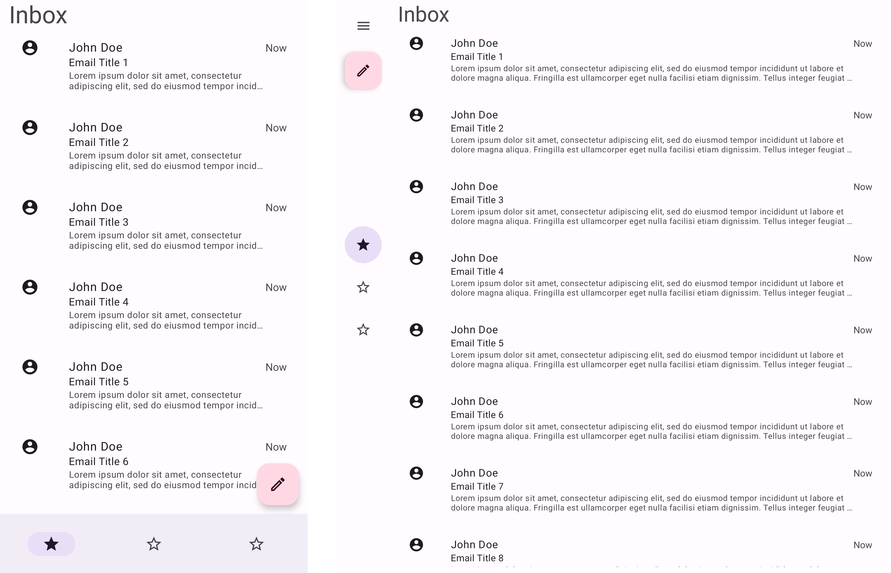
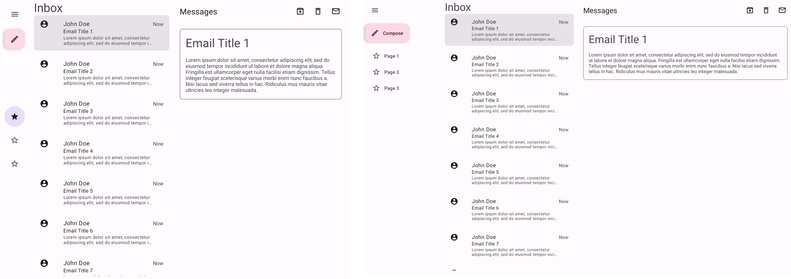

<!--docs:
title: "Canonical Layouts"
layout: detail
section: adaptive
excerpt: "Guide for building the adaptive canonical layouts"
path: /adaptive/canonicallayouts/
-->

# Canonical layouts

**Contents**

*   [Libraries and APIs](#libraries-and-apis)
*   [Demos](#demos)
*   [General implementation](#general-implementation)
*   [List View demo](#list-view-demo)
*   [Feed demo](#feed-demo)
*   [Single View Hero demo](#single-view-hero-demo)
*   [Supporting Panel demo](#supporting-panel-demo)

The canonical layout demos found in the
[MDC catalog](https://github.com/material-components/material-components-android/tree/master/catalog/java/io/material/catalog/)
are examples of adaptive layouts in which components and views change depending
on device configuration, such as screen size, orientation, and/or the presence
of a physical fold.

This doc discusses the general logic that can be applied to implementations like
the one in the [general implementation section](#general-implementation), while
each demo section discusses its specific implementation.

Tip: Follow along with the source code to better understand the concepts in this
documentation.

## Libraries and APIs

To use the Material library, you will need to add a dependency to the Material
Components for Android library. For more information, see the
[Getting started](https://github.com/material-components/material-components-android/tree/master/docs/getting-started.md)
page.

The AndroidX
[ConstraintLayout](https://developer.android.com/jetpack/androidx/releases/constraintlayout)
and
[WindowManager](https://developer.android.com/jetpack/androidx/releases/window)
libraries are used to achieve layout adaptivity. For more information about
them, see the following:

*   [Get started with large screens](https://developer.android.com/guide/topics/ui/responsive-layout-overview)
*   [Build a Responsive UI with ConstraintLayout](https://developer.android.com/training/constraint-layout)
*   [Designing for foldables](https://developer.android.com/training/constraint-layout/foldables)

For more information about the navigation components used in these demos, check
out their documentation:

*   [BottomNavigation](../components/BottomNavigation.md)
*   [NavigationRail](../components/NavigationRail.md)
*   [NavigationDrawer](../components/NavigationDrawer.md)
*   [FloatingActionButton](../components/FloatingActionButton.md)

## Demos

The catalog's
[Adaptive demo](https://github.com/material-components/material-components-android/tree/master/catalog/java/io/material/catalog/adaptive/)
has implementations of the following canonical layouts:

*   List View demo
    *   [`AdaptiveListViewDemoActivity`](https://github.com/material-components/material-components-android/tree/master/catalog/java/io/material/catalog/adaptive/AdaptiveListViewDemoActivity.java)
    *   [`AdaptiveListViewDemoFragment`](https://github.com/material-components/material-components-android/tree/master/catalog/java/io/material/catalog/adaptive/AdaptiveListViewDemoFragment.java)
    *   [`AdaptiveListViewDetailDemoFragment`](https://github.com/material-components/material-components-android/tree/master/catalog/java/io/material/catalog/adaptive/AdaptiveListViewDemoFragment.java)
*   Feed demo
    *   [`AdaptiveFeedDemoActivity`](https://github.com/material-components/material-components-android/tree/master/catalog/java/io/material/catalog/adaptive/AdaptiveFeedDemoActivity.java)
    *   [`AdaptiveFeedDemoFragment`](https://github.com/material-components/material-components-android/tree/master/catalog/java/io/material/catalog/adaptive/AdaptiveFeedDemoFragment.java)
*   Single View Hero demo
    *   [`AdaptiveHeroDemoActivity`](https://github.com/material-components/material-components-android/tree/master/catalog/java/io/material/catalog/adaptive/AdaptiveHeroDemoActivity.java)
    *   [`AdaptiveHeroDemoFragment`](https://github.com/material-components/material-components-android/tree/master/catalog/java/io/material/catalog/adaptive/AdaptiveHeroDemoFragment.java)
*   Supporting Panel demo
    *   [`AdaptiveSupportingPanelDemoActivity`](https://github.com/material-components/material-components-android/tree/master/catalog/java/io/material/catalog/adaptive/AdaptiveSupportingPanelDemoActivity.java)
    *   [`AdaptiveSupportingPanelDemoFragment`](https://github.com/material-components/material-components-android/tree/master/catalog/java/io/material/catalog/adaptive/AdaptiveSupportingPanelDemoFragment.java)

## General implementation

Each demo has a main `Activity` class that displays the appropriate navigation
component based on screen size, displays a main `Fragment`, and communicates
with that `Fragment` class.

We use `ConstraintLayout` and `ConstraintSet` to allow the layouts to adapt to
multiple screen and device configurations, and the `WindowManager` library to
capture specific foldable states.

### Navigation components

The demos all display different navigation components according to the screen
size: small screens have a bottom navigation, medium screens have a navigation
rail, and large screens have a standard navigation drawer. Medium screens also
display a modal navigation drawer if the navigation header's button is clicked.

On the Activity XML of each demo, we add all of the navigation components
mentioned:

```xml
<androidx.drawerlayout.widget.DrawerLayout xmlns:android="http://schemas.android.com/apk/res/android"
  xmlns:app="http://schemas.android.com/apk/res-auto"
  android:id="@+id/drawer_layout"
  android:layout_width="match_parent"
  android:layout_height="match_parent">
  <androidx.constraintlayout.widget.ConstraintLayout
      android:id="@+id/activity_container"
      ... >

    <!-- Container of the nav rail or nav drawer. -->
    <FrameLayout
      android:id="@+id/nav_container"
      ...>
      <!-- Navigation drawer to be used for large screens. -->
      <com.google.android.material.navigation.NavigationView
        android:id="@+id/nav_drawer"
        android:visibility="gone"
        ... />

      <!-- Navigation rail to be used for medium screens. -->
      <com.google.android.material.navigationrail.NavigationRailView
        android:id="@+id/nav_rail"
        android:visibility="gone"
        ... />
    </FrameLayout>

    <!-- FAB and bottom nav to be used for small screens. -->
    <com.google.android.material.floatingactionbutton.FloatingActionButton
      android:id="@+id/fab"
      ... />

    <!-- Bottom nav to be used for small screens. -->
    <com.google.android.material.bottomnavigation.BottomNavigationView
      android:id="@+id/bottom_nav"
      ... />

    <!-- The demo's fragment container. -->
    <FrameLayout
      android:id="@+id/fragment_container"
      android:layout_width="0dp"
      android:layout_height="0dp"
      android:layout_weight="1"
      app:layout_constraintStart_toEndOf="@id/nav_container"
      app:layout_constraintEnd_toEndOf="parent"
      app:layout_constraintTop_toTopOf="parent"
      app:layout_constraintBottom_toTopOf="@id/bottom_nav"/>
  </androidx.constraintlayout.widget.ConstraintLayout>

  <!-- Modal nav drawer to be shown on medium screens on menu button click. -->
  <com.google.android.material.navigation.NavigationView
    android:id="@+id/modal_nav_drawer"
    ... />
</androidx.drawerlayout.widget.DrawerLayout>
```

We arrange the views so it defaults to a mobile layout (note how most of the
components have `android:visibility="gone"`). We also set each
`app:layout_constraint*` so that the views will look correct no matter which
navigation component is currently visible.

In code, in the `Activity` class, we adjust each component visibility by
checking the current screen width. We also set a click listener on the
navigation rail's header button so that it triggers a modal navigation drawer to
be shown. Take a look at
[`AdaptiveUtils.java`](https://github.com/material-components/material-components-android/tree/master/catalog/java/io/material/catalog/adaptive/AdaptiveUtils.java)
to see in detail how that is done.

### Displaying the main `Fragment`

On the XML code snippet above, we have a `FrameLayout` that we use to load our
demo's `Fragment`.

In the `Activity` class:

```java
@Override
protected void onCreate(@Nullable Bundle bundle) {
  ...

  demoFragment = new DemoFragment();

  getSupportFragmentManager()
      .beginTransaction()
      .replace(R.id.fragment_container, demoFragment)
      .commit();
}
```

### Monitoring foldable device states

The Activity monitors the demo's foldable device state with the `WindowManager`
library, similar to this
[AndroidX FoldableExperiments example](https://github.com/androidx/constraintlayout/blob/main/projects/FoldableExperiments/app/src/main/java/com/example/experiments/MainActivity.kt).

The Activity has a `StateContainer` inner class that implements
`Consumer<WindowLayoutInfo>`, where it checks for specific foldable
configurations:

```java
private class StateContainer implements Consumer<WindowLayoutInfo> {

  public StateContainer() {}

  @Override
  public void accept(WindowLayoutInfo windowLayoutInfo) {

    List<DisplayFeature> displayFeatures = windowLayoutInfo
      .getDisplayFeatures();

    for (DisplayFeature displayFeature : displayFeatures) {
      if (displayFeature instanceof FoldingFeature) {
        FoldingFeature foldingFeature = (FoldingFeature) displayFeature;

        // Check for specific FoldingFeatures here and communicate with the
        // demo fragment as needed. Here's also where we can find the fold
        // position.
          ...
      }
    }
      ...
  }
}
```

You can find the position of the fold and check whether it's a hinge by using
`foldingFeature.getBounds()`. That is useful for changing the position of a
guideline in order to rearrange views. In the demos, we make use of the
[`ReactiveGuide`](https://github.com/androidx/constraintlayout/blob/main/constraintlayout/constraintlayout/src/main/java/androidx/constraintlayout/widget/ReactiveGuide.java)
to do so.

### Using `ConstraintSet`

An easy way to rearrange views in a `ConstraintLayout` is by creating
`ConstraintSet`s. You can create a constraint set for a specific device
configuration in the Fragment class and then update the layout as needed.

For example, the Supporting Panel demo's Fragment has the
`updatePortraitLayout`, `updateLandscapeLayout`, and `updateTableTopLayout`
methods that the Activity calls when it detects that the device is in portrait,
landscape, or table top mode, respectively.

## List View demo

The following shows screenshots of the List View demo on different devices and
screen sizes.

Portrait:



Landscape:



This demo is an example of an email inbox layout, where there's a list of items
that can be clicked to show a detailed view.

In portrait it shows only the list of emails, but in landscape it also shows a
selected email view by its side.

### Implementation

Source code:

*   [`AdaptiveListViewDemoActivity`](https://github.com/material-components/material-components-android/tree/master/catalog/java/io/material/catalog/adaptive/AdaptiveListViewDemoActivity.java)
*   [`AdaptiveListViewDemoFragment`](https://github.com/material-components/material-components-android/tree/master/catalog/java/io/material/catalog/adaptive/AdaptiveListViewDemoFragment.java)
*   [`AdaptiveListViewDetailDemoFragment`](https://github.com/material-components/material-components-android/tree/master/catalog/java/io/material/catalog/adaptive/AdaptiveListViewDemoFragment.java)

This demo differs a bit from the others because it uses two fragments.

**AdaptiveListViewDemoActivity.java**

The `AdaptiveListViewDemoActivity` follows the logic described in the
[general implementation](#general-implementation) section above.

The Activity either displays an `AdaptiveListViewDemoFragment` that fills the
screen (portrait layout) or both an `AdaptiveListViewDemoFragment` and an
`AdaptiveListViewDetailDemoFragment` side by side (landscape layout).

In its `StateContainer` class, it updates the layout according to the device
orientation, and if it's in landscape, it also checks for a vertical fold in
order to update the position of the vertical `ReactiveGuide`. If there's no
vertical fold then the guideline is positioned at the middle of the screen.

**AdaptiveListViewDemoFragment.java**

The `AdaptiveListViewDemoFragment` class represents the email list. It inflates
`cat_adaptive_list_view_fragment.xml` and sets up the `emailList` recycler view.
It also contains the mock `Email` data and class.

In its `emailAdapterListener`, it creates an instance of
`AdaptiveListViewDetailDemoFragment` and displays it either in its own container
if the device is in portrait, or in the `id/list_view_detail_fragment_container`
from the Activity XML if it's in landscape.

**AdaptiveListViewDetailDemoFragment.java**

The `AdaptiveListViewDetailDemoFragment` class represents an opened email view.
It inflates `cat_adaptive_list_view_detail_fragment.xml` and updates the email
title according to the `emailId`.

**Note:** You can also implement this demo to achieve something similar with
[`SlidingPaneLayout`](https://developer.android.com/guide/topics/ui/layout/twopane).

## Feed demo

The following shows screenshots of the Feed demo on different devices and screen
sizes.

Portrait:


Landscape:


Open foldable in portrait:


This demo is an example of a news feed layout.

### Implementation

Source code:

*   [`AdaptiveFeedDemoActivity`](https://github.com/material-components/material-components-android/tree/master/catalog/java/io/material/catalog/adaptive/AdaptiveFeedDemoActivity.java)
*   [`AdaptiveFeedDemoFragment`](https://github.com/material-components/material-components-android/tree/master/catalog/java/io/material/catalog/adaptive/AdaptiveFeedDemoFragment.java)

**AdaptiveFeedDemoFragment.java**

The `AdaptiveFeedDemoFragment` class inflates `cat_adaptive_feed_fragment.xml`
and sets up two `RecyclerView`s, a `smallContentList` that holds small cards and
a `largeContentList` that holds large ones.

The Fragment also sets up two constraint sets, a `closedLayout` and an
`openLayout`.

For non-foldable devices, they are displayed as follows:

Orientation | Layout
----------- | --------------
Portrait    | `closedLayout`
Landscape   | `openLayout`

For foldables:

Orientation | State  | Layout
----------- | ------ | --------------
Portrait    | closed | `closedLayout`
Portrait    | open   | `openLayout`
Landscape   | any    | `openLayout`

The default layout is the **`closedLayout`**, which displays
`cat_adaptive_feed_fragment.xml`. There, the `largeContentList` has
`android:visibility="gone"`, as it only displays one large card (with id
`highlight_content_card`).

The **`openLayout`** hides the `highlight_content_card`, displays the
`largeContentList`, and rearranges the position of the different components. It
does so by using the `ReactiveGuide` in the XML as reference.

For example, the `MaterialButton` has
`app:layout_constraintStart_toStartOf="parent"` by default, so we change its
position by calling

```java
constraintSet.connect(R.id.top_button, ConstraintSet.START, R.id.fold, ConstraintSet.END)
```

making it appear on the right side of the guideline.

We change the position of the `ReactiveGuide` by either setting it at the fold
position if it's a vertical fold, or by setting it to the middle of the screen
if it's not or if the device isn't foldable.

**AdaptiveFeedDemoActivity.java**

The `AdaptiveFeedDemoActivity` follows the logic described in the
[general implementation](#general-implementation) section above.

In its `StateContainer` class, it calls the `AdaptiveFeedDemoFragment` methods
responsible for updating the layout and the `ReactiveGuide` position.

## Single View Hero demo

The following shows screenshots of the Single View Hero demo on different
devices and screen sizes.

Portrait:


Landscape:


This demo shows a large top content view on top of the layout, also called a
hero view, as well as a main content view and a list view of supporting items.
The hero and other containers take on different layout configurations depending
on the screen size.

### Implementation

Source code:

*   [`AdaptiveHeroDemoActivity`](https://github.com/material-components/material-components-android/tree/master/catalog/java/io/material/catalog/adaptive/AdaptiveHeroDemoActivity.java)
*   [`AdaptiveHeroDemoFragment`](https://github.com/material-components/material-components-android/tree/master/catalog/java/io/material/catalog/adaptive/AdaptiveHeroDemoFragment.java)

**AdaptiveHeroDemoFragment.java**

The `AdaptiveHeroDemoFragment` class inflates `cat_adaptive_hero_fragment.xml`
and sets up a recycler view `sideContentList`, and three different constrain
sets, `smallLayout`, `mediumLayout`, and `largeLayout`.

The change of layouts is based exclusively on screen size:

Size   | Layout
------ | --------------
small  | `smallLayout`
medium | `mediumLayout`
large  | `largeLayout`

The default layout is the **`smallLayout`**, which displays
`cat_adaptive_hero_fragment.xml`.

The **`mediumLayout`** changes the `sideContentList` position from below the
main content card to its right. It also displays a large top content card at the
top of both views.

The **`largeLayout`** changes the `sideContentList` position again, but it
displays at the right side of the top content card view instead of below it.

**AdaptiveHeroDemoActivity.java**

The `AdaptiveHeroDemoActivity` follows the logic described in the
[general implementation](#general-implementation) section above, but since its
changes are based only on screen size, it does not worry about foldable states.

## Supporting Panel demo

The following shows screenshots of the Supporting Panel demo on different
devices and screen sizes.

Portrait:


Landscape:


This demo is an example of a layout that has an always visible main content
view, followed by a supporting panel with a list of items that changes position
depending on certain screen configurations.

### Implementation

Source code:

*   [`AdaptiveSupportingPanelDemoActivity`](https://github.com/material-components/material-components-android/tree/master/catalog/java/io/material/catalog/adaptive/AdaptiveSupportingPanelDemoActivity.java)
*   [`AdaptiveSupportingPanelDemoFragment`](https://github.com/material-components/material-components-android/tree/master/catalog/java/io/material/catalog/adaptive/AdaptiveSupportingPanelDemoFragment.java)

**AdaptiveSupportingPanelDemoFragment.java**

The `AdaptiveSupportingPanelDemoFragment` class inflates
`cat_adaptive_supporting_panel_fragment.xml` and sets up a recycler view
`supportingPanelList`, and three constraint sets, `portraitLayout`,
`landscapeLayout`, and `tableTopLayout`.

The change of layouts is based on device orientation:

Orientation | Layout
----------- | -----------------
portrait    | `portraitLayout`
landscape   | `landscapeLayout`

For foldables, it also depends on state and fold orientation:

Orientation | FoldingFeature.State | FoldingFeature.Orientation | Layout
----------- | -------------------- | -------------------------- | ------
any         | `HALF.OPENED`        | `HORIZONTAL`               | `tableTopLayout`
any         | `HALF.OPENED`        | `VERTICAL`                 | `portraitLayout`
portrait    | `FLAT` or none       | any                        | `portraitLayout`
landscape   | `FLAT` or none       | any                        | `landscapeLayout`

The default layout is the **`portraitLayout`**, looking like the
`cat_adaptive_supporting_panel_fragment.xml` as it is.

The **`landscapeLayout`** changes the `supportingPanelList` position from below
the main content to its right.

The **`tableTopLayout`** is similar to the `portraitLayout`, but it makes sure
that the main content is limited to being displayed above the fold, while the
`supportingPanelList` is displayed below it.

We change the position of the `ReactiveGuide` by setting it at the fold when the
device is in table top mode.

**AdaptiveSupportingPanelDemoActivity.java**

The `AdaptiveSupportingPanelDemoActivity` follows the logic described in the
[general implementation](#general-implementation) section above.

In its `StateContainer` class, it calls the
`AdaptiveSupportingPanelDemoFragment` methods responsible for updating the
layout.
