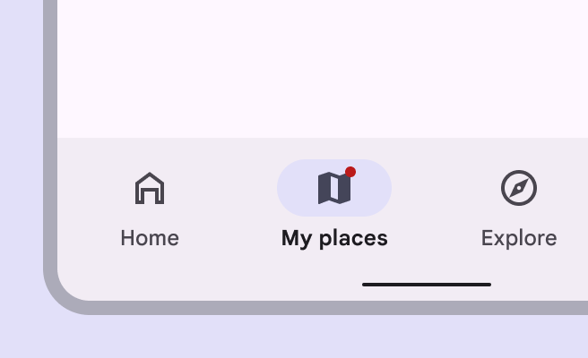
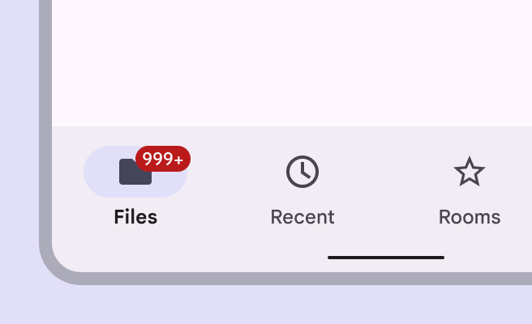

<!--docs:
title: "Badges"
layout: detail
section: components
excerpt: "Badges can contain dynamic information, such as a number of pending requests."
iconId: badge
path: /catalog/badging/
-->

# Badges

[Badges](https://m3.material.io/components/badges/overview) show notifications,
counts, or status information on navigation items and icons. There are two
variants of badges.

 | 
----------------------------------------------------------------------------- | -----------------------------------------------------------------------------
1                                                                             | 2

1.  Small badge
2.  Large badge

**Note:** Images use various dynamic color schemes.

## Design & API documentation

*   [Material 3 (M3) spec](https://m3.material.io/components/badges/overview)
*   [API reference](https://developer.android.com/reference/com/google/android/material/badge/package-summary)

## Anatomy


1.  Small badge
2.  Large badge container
3.  Large badge label

More details on anatomy items in the
[component guidelines](https://m3.material.io/components/badges/guidelines#07608fcc-43f7-47b3-b5cb-ee617753b877).

## Key properties

### `BadgeDrawable` Attributes

| Feature                   | Relevant attributes                                                                                                                                      |
|-----------------------    |----------------------------------------------------------------------------------------------------------------------------------------------------------|
| Color                     | `app:backgroundColor` <br> `app:badgeTextColor`                                                                                                          |
| Width                     | `app:badgeWidth` <br> `app:badgeWithTextWidth`                                                                                                           |
| Height                    | `app:badgeHeight` <br> `app:badgeWithTextHeight`                                                                                                         |
| Shape                     | `app:badgeShapeAppearance` <br> `app:badgeShapeAppearanceOverlay` <br> `app:badgeWithTextShapeAppearance` <br> `app:badgeWithTextShapeAppearanceOverlay` |
| Label                     | `app:badgeText` (for text) <br> `app:number` (for numbers)                                                                                               |
| Label Length              | `app:maxCharacterCount` (for all text) <br> `app:maxNumber` (for numbers only)                                                                           |
| Label Text Color          | `app:badgeTextColor`                                                                                                                                     |
| Label Text Appearance     | `app:badgeTextAppearance`                                                                                                                                |
| Badge Gravity             | `app:badgeGravity`                                                                                                                                       |
| Offset Alignment          | `app:offsetAlignmentMode`                                                                                                                                |
| Horizontal Padding        | `app:badgeWidePadding`                                                                                                                                   |
| Vertical Padding          | `app:badgeVerticalPadding`                                                                                                                               |
| Large Font Vertical Offset| `app:largeFontVerticalOffsetAdjustment`                                                                                                                  |
| Badge Fixed Edge          | `app:badgeFixedEdge`                                                                                                                                     |

**Note:** If both `app:badgeText` and `app:number` are specified, the badge
label will be `app:badgeText`.

## Code implementation

Before you can use Material badges, you need to add a dependency to the Material
components for Android library. For more information, go to the
[Getting started](https://github.com/material-components/material-components-android/tree/master/docs/getting-started.md)
page.

**Note:** This component is still under development and may not support the full
range of customization Material Android components generally support, for
instance, themed attributes.

A `BadgeDrawable` represents dynamic information such as a number of pending
requests in a [`BottomNavigationView`](BottomNavigation.md) or
[`TabLayout`](Tabs.md).

### Adding badges


1.  Small badge on a navigation item
2.  Large badge on a navigation item
3.  Large badge with max characters on a navigation item

API and source code:

*   `BadgeDrawable`
    *   [Class definition](https://developer.android.com/reference/com/google/android/material/badge/BadgeDrawable)
    *   [Class source](https://github.com/material-components/material-components-android/tree/master/lib/java/com/google/android/material/badge/BadgeDrawable.java)
*   `BadgeUtils`
    *   [Class definition](https://developer.android.com/reference/com/google/android/material/badge/BadgeUtils)
    *   [Class source](https://github.com/material-components/material-components-android/tree/master/lib/java/com/google/android/material/badge/BadgeUtils.java)

Create an instance of `BadgeDrawable` by calling `create(Context)` or
`createFromAttributes(Context, AttributeSet, int, int)}`.

The approach used to add and display a `BadgeDrawable` on top of its anchor view
depends on the API level:

In API 18+ (APIs supported by
[ViewOverlay](https://developer.android.com/reference/android/view/ViewOverlay))

1.  Add `BadgeDrawable` as a
    [ViewOverlay](https://developer.android.com/reference/android/view/ViewOverlay)
    to the desired anchor view.
2.  Update the `BadgeDrawable`'s coordinates (center and bounds) based on its
    anchor view using `#updateBadgeCoordinates(View)`.

Both steps have been encapsulated in a util method:

```java
BadgeUtils.attachBadgeDrawable(badgeDrawable, anchor);
```

In Pre API-18

1.  Set `BadgeDrawable` as the foreground of the anchor view's `FrameLayout`
    ancestor.
2.  Update the `BadgeDrawable`'s coordinates (center and bounds) based on its
    anchor view, relative to its `FrameLayout` ancestor's coordinate space.

Option 1: `BadgeDrawable` will dynamically create and wrap the anchor view in a
`FrameLayout`, then insert the `FrameLayout` into the original anchor view
position in the view hierarchy. Same syntax as API 18+

```java
BadgeUtils.attachBadgeDrawable(badgeDrawable, anchor);
```

Option 2: If you do not want `BadgeDrawable` to modify your view hierarchy, you
can specify a `FrameLayout` to display the badge instead.

```java
BadgeUtils.attachBadgeDrawable(badgeDrawable, anchor, anchorFrameLayoutParent);
```

### `BadgeDrawable` gravity modes

`BadgeDrawable` offers two gravity modes to control how the badge aligns with
its anchor view. By default, (`TOP_END`) badge aligns with the top and end edges
of the anchor (with some offsets). Alternatively, you can use `TOP_START` to
align the badge with the top and start edges of the anchor. Note that
`BOTTOM_START` and `BOTTOM_END` are deprecated and not recommended for use.

### `BadgeDrawable` placement and offsets

By default, `BadgeDrawable` is aligned with the top and end edges of its anchor
view (with some offsets if `offsetAlignmentMode` is `legacy`). Call
`setBadgeGravity(int)` to change it to one of the other supported modes. To
adjust the badge's offsets relative to the anchor's center, use
`setHorizontalOffset(int)` or `setVerticalOffset(int)`

Regardless of offsets, badges are automatically moved to within the bounds of
its first ancestor view that does not clip its children, to ensure that the
badge is not clipped if there is enough space.

### TalkBack support

`BadgeDrawable` provides a getter for its content description, which is based on
the displayed number or text (if any). To specify the content description, the
developer is provided with the following methods:
`setContentDescriptionForText(CharSequence)`
`setContentDescriptionQuantityStringsResource(@PluralsRes int)`
`setContentDescriptionExceedsMaxBadgeNumberStringResource(@StringRes int)`
`setContentDescriptionNumberless(CharSequence)`
