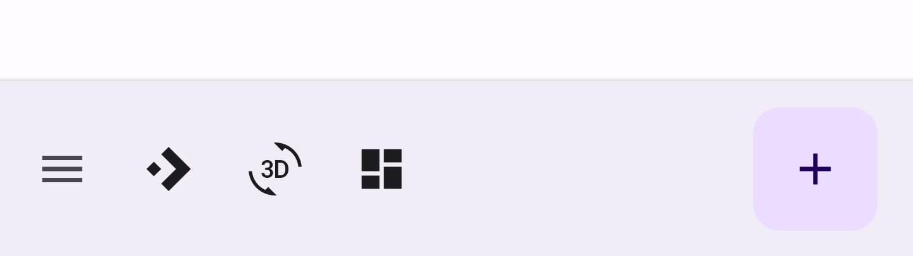
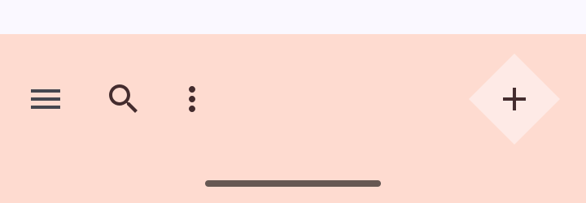

<!--docs:
title: "Bottom app bars"
layout: detail
section: components
excerpt: "Android bottom app bars."
iconId: bottom_app_bar
path: /catalog/bottom-app-bars/
-->

# Bottom app bars

A [bottom app bar](https://material.io/components/app-bars-bottom/) displays
navigation and key actions at the bottom of mobile screens.


**Contents**

*   [Using bottom app bars](#using-bottom-app-bars)
*   [Bottom app bar](#bottom-app-bar)
*   [Theming bottom app bars](#theming-bottom-app-bars)

## Using bottom app bars

Before you can use Material bottom app bars, you need to add a dependency to the
Material Components for Android library. For more information, go to the
[Getting started](https://github.com/material-components/material-components-android/tree/master/docs/getting-started.md)
page.

### Making bottom app bars accessible

Android's bottom app bar component APIs provide support for the navigation icon,
action items, overflow menu and more for informing the user as to what each
action performs. While optional, their use is strongly encouraged.

#### Content descriptions

When using icons for navigation icons, action items and other elements of bottom
app bars, you should set a content description on them so that screen readers
like TalkBack are able to announce their purpose or action, if any.

For an overall content description of the bottom app bar, set an
`android:contentDescription` or use the `setContentDescription` method on the
`BottomAppBar`.

For the navigation icon, this can be achieved via the
`app:navigationContentDescription` attribute or
`setNavigationContentDescription` method.

For action items and items within the overflow menu, the content description
needs to be set in the menu:

```xml
<menu ...>
    ...
    <item
          ...
          android:contentDescription="@string/content_description_one" />
    <item
          ...
          android:contentDescription="@string/content_description_two" />
</menu>
```

## Bottom app bar

Bottom app bars provide access to a bottom navigation drawer and up to four
actions, including the floating action button.

### Bottom app bar examples

API and source code:

*   `CoordinatorLayout`
    *   [Class definition](https://developer.android.com/reference/androidx/coordinatorlayout/widget/CoordinatorLayout)
*   `BottomAppBar`
    *   [Class definition](https://developer.android.com/reference/com/google/android/material/bottomappbar/BottomAppBar)
    *   [Class source](https://github.com/material-components/material-components-android/tree/master/lib/java/com/google/android/material/bottomappbar/BottomAppBar.java)
*   `FloatingActionButton`
    *   [Class definition](https://developer.android.com/reference/com/google/android/material/floatingactionbutton/FloatingActionButton)
    *   [Class source](https://github.com/material-components/material-components-android/tree/master/lib/java/com/google/android/material/floatingactionbutton/FloatingActionButton.java)

The following example shows a bottom app bar with a navigation icon, an action
icon, a cradled FAB, and an overflow menu.



In the layout:

```xml
<androidx.coordinatorlayout.widget.CoordinatorLayout
    ...
    android:layout_width="match_parent"
    android:layout_height="match_parent">

    <!-- Note: A RecyclerView can also be used -->
    <androidx.core.widget.NestedScrollView
        android:layout_width="match_parent"
        android:layout_height="match_parent"
        android:paddingBottom="100dp"
        android:clipToPadding="false">

        <!-- Scrollable content -->

    </androidx.core.widget.NestedScrollView>

    <com.google.android.material.bottomappbar.BottomAppBar
        android:id="@+id/bottomAppBar"
        android:layout_width="match_parent"
        android:layout_height="wrap_content"
        android:layout_gravity="bottom"
        style="@style/Widget.MaterialComponents.BottomAppBar.Colored"
        app:navigationIcon="@drawable/ic_menu_24dp"
        app:menu="@menu/bottom_app_bar"
        />

    <com.google.android.material.floatingactionbutton.FloatingActionButton
        android:layout_width="wrap_content"
        android:layout_height="wrap_content"
        app:srcCompat="@drawable/ic_add_24dp"
        app:layout_anchor="@id/bottomAppBar"
        />

</androidx.coordinatorlayout.widget.CoordinatorLayout>
```

In `menu/bottom_app_bar.xml`:

```xml
<menu
      ...>

    <item
        android:id="@+id/search"
        android:icon="@drawable/ic_search_24dp"
        android:title="@string/search"
        android:contentDescription="@string/content_description_search"
        app:showAsAction="ifRoom"
        />

    <item
        android:id="@+id/more"
        android:title="@string/more"
        android:contentDescription="@string/content_description_more"
        app:showAsAction="never"
        />

</menu>
```

In menu/navigation icon drawables:

```xml
<vector
    ...
    android:tint="?attr/colorControlNormal">
    ...
</vector>
```

In code:

```kt
bottomAppBar.setNavigationOnClickListener {
    // Handle navigation icon press
}

bottomAppBar.setOnMenuItemClickListener { menuItem ->
    when (menuItem.itemId) {
        R.id.search -> {
            // Handle search icon press
            true
        }
        R.id.more -> {
            // Handle more item (inside overflow menu) press
            true
        }
        else -> false
    }
}
```

#### Applying scrolling behavior to the bottom app bar

The following example shows the bottom app bar hiding upon scrolling the
scrollable content down, and appearring upon scrolling up.

```xml
<androidx.coordinatorlayout.widget.CoordinatorLayout
    ...>

    ...

    <com.google.android.material.bottomappbar.BottomAppBar
        ...
        app:hideOnScroll="true"
        />

    ...

</androidx.coordinatorlayout.widget.CoordinatorLayout>
```

## Anatomy and key properties

A bottom app bar has a container and an optional navigation icon, anchored
floating action button (FAB), action item(s) and an overflow menu.


1.  Container
2.  Navigation icon (optional)
3.  Floating action button (FAB) (optional)
4.  Action item(s) (optional)
5.  Overflow menu (optional)

### Container attributes

&nbsp;        | Attribute            | Related method(s)                          | Default value
------------- | -------------------- | ------------------------------------------ | -------------
**Color**     | `app:backgroundTint` | `setBackgroundTint`<br>`getBackgroundTint` | `?attr/colorSurface`
**Elevation** | `app:elevation`      | `setElevation`                             | `8dp`
**Height**    | `android:minHeight`  | `setMinimumHeight`<br>`getMinimumHeight`   | `56dp` (default) and `64dp` (w600dp)

### Navigation icon attributes

&nbsp;    | Attribute            | Related method(s)                          | Default value
--------- | -------------------- | ------------------------------------------ | -------------
**Icon**  | `app:navigationIcon` | `setNavigationIcon`<br>`getNavigationIcon` | `null`
**Color** | N/A                  | N/A                                        | `?attr/colorControlNormal` (as `Drawable` tint)

### FAB attributes

&nbsp;                           | Attribute                          | Related method(s)                                                      | Default value
-------------------------------- | ---------------------------------- | ---------------------------------------------------------------------- | -------------
**Alignment mode**               | `app:fabAlignmentMode`             | `setFabAlignmentMode`<br>`getFabAlignmentMode`                         | `center`
**Animation mode**               | `app:fabAnimationMode`             | `setFabAnimationMode`<br>`getFabAnimationMode`                         | `scale`
**Cradle margin**                | `app:fabCradleMargin`              | `setFabCradleMargin`<br>`getFabCradleMargin`                           | `5dp`
**Cradle rounded corner radius** | `app:fabCradleRoundedCornerRadius` | `setFabCradleRoundedCornerRadius`<br>`getFabCradleRoundedCornerRadius` | `8dp`
**Cradle vertical offset**       | `app:fabCradleVerticalOffset`      | `setCradleVerticalOffset`<br>`getCradleVerticalOffset`                 | `0dp`

See the
[FAB documentation](https://github.com/material-components/material-components-android/tree/master/docs/components/FloatingActionButton.md)
for more attributes.

#### Action item(s) attributes

&nbsp;         | Attribute  | Related method(s)          | Default value
-------------- | ---------- | -------------------------- | -------------
**Menu**       | `app:menu` | `replaceMenu`<br>`getMenu` | `null`
**Icon color** | N/A        | N/A                        | `?attr/colorControlNormal` (as `Drawable` tint)

### Overflow menu attributes

&nbsp;              | Attribute                                                                                          | Related method(s)                      | Default value
------------------- | -------------------------------------------------------------------------------------------------- | -------------------------------------- | -------------
**Icon**            | `android:src` and `app:srcCompat` in `actionOverflowButtonStyle` (in app theme)                    | `setOverflowIcon`<br>`getOverflowIcon` | `@drawable/abc_ic_menu_overflow_material` (before API 23) or `@drawable/ic_menu_moreoverflow_material` (after API 23)
**Theme**           | `app:popupTheme`                                                                                   | `setPopupTheme`<br>`getPopupTheme`     | `@style/ThemeOverlay.MaterialComponents.*`
**Item typography** | `textAppearanceSmallPopupMenu` and `textAppearanceLargePopupMenu` in `app:popupTheme` or app theme | N/A                                    | `?attr/textAppearanceSubtitle1`

### Styles

&nbsp;                                                                           | Style
-------------------------------------------------------------------------------- | -----
**Default style**                                                                | `Widget.MaterialComponents.BottomAppBar`
**Primary background color style**                                               | `Widget.MaterialComponents.BottomAppBar.Colored`
**Primary (light theme) or surface (dark theme)**<br/>**background color style** | `Widget.MaterialComponents.BottomAppBar.PrimarySurface`

Default style theme attribute: `bottomAppBarStyle`

See the full list of
[styles](https://github.com/material-components/material-components-android/tree/master/lib/java/com/google/android/material/bottomappbar/res/values/styles.xml)
and
[attrs](https://github.com/material-components/material-components-android/tree/master/lib/java/com/google/android/material/bottomappbar/res/values/attrs.xml).

## Theming bottom app bars

Bottom app bars support
[Material Theming](https://material.io/components/app-bars-bottom#theming) and
can be customized in terms of color, typography and shape.

### Bottom app bar theming example

API and source code:

*   `CoordinatorLayout`
    *   [Class definition](https://developer.android.com/reference/androidx/coordinatorlayout/widget/CoordinatorLayout)
*   `BottomAppBar`
    *   [Class definition](https://developer.android.com/reference/com/google/android/material/bottomappbar/BottomAppBar)
    *   [Class source](https://github.com/material-components/material-components-android/tree/master/lib/java/com/google/android/material/bottomappbar/BottomAppBar.java)
*   `FloatingActionButton`
    *   [Class definition](https://developer.android.com/reference/com/google/android/material/floatingactionbutton/FloatingActionButton)
    *   [Class source](https://github.com/material-components/material-components-android/tree/master/lib/java/com/google/android/material/floatingactionbutton/FloatingActionButton.java)
*   `BottomAppBarCutCornersTopEdge`:
    *   [Class source](https://github.com/material-components/material-components-android/tree/master/catalog/java/io/material/catalog/bottomappbar/BottomAppBarCutCornersTopEdge.java)

The following example shows a bottom app bar with Material Theming.



#### Implementing bottom app bar theming

Using theme attributes in `res/values/styles.xml` (themes all bottom app bars
and FABs and affects other components):

```xml
<style name="Theme.App" parent="Theme.MaterialComponents.*">
    ...
    <item name="colorPrimary">@color/shrine_pink_100</item>
    <item name="colorOnPrimary">@color/shrine_pink_900</item>
    <item name="colorSecondary">@color/shrine_pink_50</item>
    <item name="colorOnSecondary">@color/shrine_pink_900</item>
    <item name="textAppearanceSubtitle1">@style/TextAppearance.App.Subtitle1</item>
    <item name="shapeAppearanceSmallComponent">@style/ShapeAppearance.App.SmallComponent</item>
</style>

<style name="TextAppearance.App.Subtitle1" parent="TextAppearance.MaterialComponents.Subtitle1">
    <item name="fontFamily">@font/rubik</item>
    <item name="android:fontFamily">@font/rubik</item>
</style>

<style name="ShapeAppearance.App.SmallComponent" parent="ShapeAppearance.MaterialComponents.SmallComponent">
    <item name="cornerFamily">cut</item>
    <item name="cornerSize">4dp</item>
</style>
```

or using default style theme attributes, styles and theme overlays (themes all
bottom app bars and FABs but does not affect other components):

```xml
<style name="Theme.App" parent="Theme.MaterialComponents.*">
    ...
    <item name="bottomAppBarStyle">@style/Widget.App.BottomAppBar</item>
    <item name="fabStyle">@style/Widget.App.FloatingActionButton</item>
</style>

<style name="Widget.App.BottomAppBar" parent="Widget.MaterialComponents.BottomAppBar.Colored">
    <item name="materialThemeOverlay">@style/ThemeOverlay.App.BottomAppBar</item>
</style>

<style name="Widget.App.FloatingActionButton" parent="Widget.MaterialComponents.FloatingActionButton">
    <item name="materialThemeOverlay">@style/ThemeOverlay.App.FloatingActionButton</item>
</style>

<style name="ThemeOverlay.App.BottomAppBar" parent="">
    <item name="colorPrimary">@color/shrine_pink_100</item>
    <item name="colorOnPrimary">@color/shrine_pink_900</item>
    <item name="textAppearanceSubtitle1">@style/TextAppearance.App.Subtitle1</item>
</style>

<style name="ThemeOverlay.App.FloatingActionButton" parent="">
    <item name="colorSecondary">@color/shrine_pink_50</item>
    <item name="colorOnSecondary">@color/shrine_pink_900</item>
    <item name="shapeAppearanceSmallComponent">@style/ShapeAppearance.App.SmallComponent</item>
</style>
```

or using the styles in the layout (affects only this bottom app bar and FAB):

```xml
<com.google.android.material.bottomappbar.BottomAppBar
    ...
    style="@style/Widget.App.BottomAppBar"
    />

<com.google.android.material.floatingactionbutton.FloatingActionButton
    ...
    style="@style/Widget.App.FloatingActionButton"
    />
```

In code:

```kt
val topEdge = BottomAppBarCutCornersTopEdge(
    bottomAppBar.fabCradleMargin,
    bottomAppBar.fabCradleRoundedCornerRadius,
    bottomAppBar.cradleVerticalOffset
)
val background = bottomAppBar.background as MaterialShapeDrawable
background.shapeAppearanceModel = background.shapeAppearanceModel.toBuilder().setTopEdge(topEdge).build()
```

_**Note:** Using `BottomAppBarCutCornersTopEdge` is not necessary with rounded
shapeAppearance corners._
