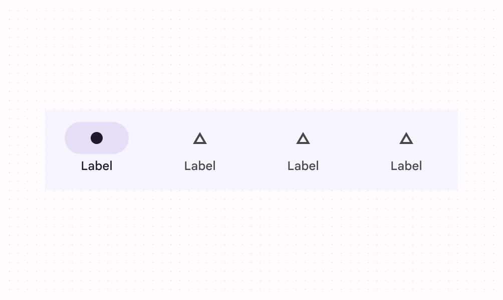
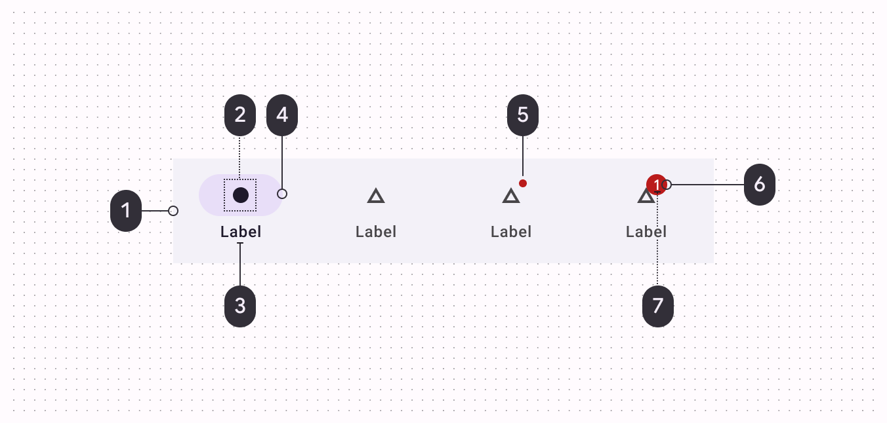

<!--docs:
title: "Bottom navigation"
layout: detail
section: components
excerpt: "Bottom navigation bars make it easy to explore and switch between top-level views in a single tap."
iconId: bottom_navigation
path: /catalog/bottom-navigation/
-->

# Bottom Navigation

[Bottom navigation](https://material.io/components/bottom-navigation/#) bars
allow movement between primary destinations in an app.



**Contents**

*   [Using bottom navigation](#using-bottom-navigation)
*   [Bottom navigation bar](#bottom-navigation-bar)
*   [Theming](#theming-a-bottom-navigation-bar)

## Using bottom navigation

Before you can use the Material bottom navigation, you need to add a dependency
to the Material Components for Android library. For more information, go to the
[Getting started](https://github.com/material-components/material-components-android/tree/master/docs/getting-started.md)
page.

A typical layout will look similar to this:

```xml
<LinearLayout
    xmlns:android="http://schemas.android.com/apk/res/android"
    xmlns:app="http://schemas.android.com/apk/res-auto"
    android:layout_width="match_parent"
    android:layout_height="wrap_content">
  ...
  <com.google.android.material.bottomnavigation.BottomNavigationView
      android:id="@+id/bottom_navigation"
      android:layout_width="match_parent"
      android:layout_height="wrap_content"
      app:menu="@menu/bottom_navigation_menu" />

</LinearLayout>
```

In `bottom_navigation_menu.xml` inside a `menu` resource directory:

```xml
<menu xmlns:android="http://schemas.android.com/apk/res/android">
  <item
      android:id="@+id/page_1"
      android:enabled="true"
      android:icon="@drawable/icon_1"
      android:title="@string/text_label_1"/>
  <item
      android:id="@+id/page_2"
      android:enabled="true"
      android:icon="@drawable/icon_2"
      android:title="@string/text_label_2"/>
</menu>
```

**Note:** `BottomNavigationView` does not support more than 5 `menu` items.

In code:

```kt
BottomNavigationView.OnNavigationItemSelectedListener { item ->
    when(item.itemId) {
        R.id.item1 -> {
            // Respond to navigation item 1 click
            true
        }
        R.id.item2 -> {
            // Respond to navigation item 2 click
            true
        }
        else -> false
    }
}
```

There's also a method for detecting when navigation items have been reselected:

```kt
bottomNavigation.setOnNavigationItemReselectedListener { item ->
    when(item.itemId) {
        R.id.item1 -> {
            // Respond to navigation item 1 reselection
        }
        R.id.item2 -> {
            // Respond to navigation item 2 reselection
        }
    }
}
```

That results in:


### Making bottom navigation accessible

You should set an `android:title` for each of your `menu` items so that screen
readers like TalkBack can properly announce what each navigation item
represents:

```xml
<menu xmlns:android="http://schemas.android.com/apk/res/android">
  <item
      ...
      android:title="@string/text_label"/>
  ...
</menu>
```

The `labelVisibilityMode` attribute can be used to adjust the behavior of the
text labels for each navigation item. There are four visibility modes:

*   `LABEL_VISIBILITY_AUTO` (default): The label behaves as “labeled” when there
    are 3 items or less, or “selected” when there are 4 items or more
*   `LABEL_VISIBILITY_SELECTED`: The label is only shown on the selected
    navigation item
*   `LABEL_VISIBILITY_LABELED`: The label is shown on all navigation items
*   `LABEL_VISIBILITY_UNLABELED`: The label is hidden for all navigation items

### Adding badges


Initialize and show a `BadgeDrawable` associated with `menuItemId`, subsequent
calls to this method will reuse the existing `BadgeDrawable`:

```kt
var badge = bottomNavigation.getOrCreateBadge(menuItemId)
badge.isVisible = true
// An icon only badge will be displayed unless a number is set:
badge.number = 99
```

As best practice if you need to temporarily hide the badge (e.g. until the next
notification is received), change the visibility of `BadgeDrawable`:

```kt
val badgeDrawable = bottomNavigation.getBadge(menuItemId)
    if (badgeDrawable != null) {
        badgeDrawable.isVisible = false
        badgeDrawable.clearNumber()
    }
```

To remove any `BadgeDrawable`s that are no longer needed:

```kt
bottomNavigation.removeBadge(menuItemId)
```

See the [`BadgeDrawable`](BadgeDrawable.md) documentation for more information
about it.

## Bottom navigation bar


### Bottom navigation bar example

API and source code:

*   `BottomNavigationView`
    *   [Class description](https://developer.android.com/reference/com/google/android/material/bottomnavigation/BottomNavigationView)
    *   [Class source](https://github.com/material-components/material-components-android/tree/master/lib/java/com/google/android/material/bottomnavigation/BottomNavigationView.java)

The following example shows a bottom navigation bar with four icons:

*   favorites
*   music note
*   places
*   news


In `layout.xml`:

```xml
<LinearLayout
    xmlns:android="http://schemas.android.com/apk/res/android"
    xmlns:app="http://schemas.android.com/apk/res-auto"
    android:layout_width="match_parent"
    android:layout_height="wrap_content">

  <com.google.android.material.bottomnavigation.BottomNavigationView
      android:id="@+id/bottom_navigation"
      style="@style/Widget.MaterialComponents.BottomNavigationView.Colored"
      android:layout_width="match_parent"
      android:layout_height="wrap_content"
      app:menu="@menu/bottom_navigation_menu" />

</LinearLayout>
```

In `bottom_navigation_menu.xml` inside a `menu` resource directory:

```xml
<menu xmlns:android="http://schemas.android.com/apk/res/android">
  <item
      android:id="@+id/page_1"
      android:enabled="true"
      android:icon="@drawable/ic_favorite"
      android:title="@string/favorites"/>
  <item
      android:id="@+id/page_2"
      android:enabled="true"
      android:icon="@drawable/ic_music"
      android:title="@string/music"/>
  <item
      android:id="@+id/page_3"
      android:enabled="true"
      android:icon="@drawable/ic_places"
      android:title="@string/places"/>
  <item
      android:id="@+id/page_4"
      android:enabled="true"
      android:icon="@drawable/ic_new"
      android:title="@string/news"/>
</menu>
```

In code:

```kt
bottomNavigation.selectedItemId = R.id.page_2
```

### Anatomy and key properties

The following is an anatomy diagram for the bottom navigation bar:



*   (1) Container
*   Navigation items:
    *   (2) Inactive icon
    *   (3) Inactive text label
    *   (4) Active icon
    *   (5) Active text label

#### Container attributes

&nbsp;        | **Attribute**        | **Related methods**      | **Default value**
------------- | -------------------- | ------------------------ | -----------------
**Color**     | `app:backgroundTint` | N/A                      | `?attr/colorSurface`
**Elevation** | `app:elevation`      | `setElevation`           | `8dp`

#### Navigation item attributes

&nbsp;                    | **Attribute**             | **Related methods**                                   | **Default value**
------------------------- | ------------------------- | ----------------------------------------------------- | -----------------
**Menu resource**         | `app:menu`                | `inflateMenu`<br/>`getMenu`                           | N/A
**Ripple (inactive)**     | `app:itemRippleColor`     | `setItemRippleColor`<br/>`getItemRippleColor`         | `?attr/colorOnSurface` at 8% (see all [states](https://github.com/material-components/material-components-android/tree/master/lib/java/com/google/android/material/navigation/res/color/mtrl_navigation_bar_ripple_color.xml))
**Ripple (active)**       | "                         | "                                                     | `?attr/colorPrimary` at 8% (see all [states](https://github.com/material-components/material-components-android/tree/master/lib/java/com/google/android/material/navigation/res/color/mtrl_navigation_bar_ripple_color.xml))
**Label visibility mode** | `app:labelVisibilityMode` | `setLabelVisibilityMode`<br/>`getLabelVisibilityMode` | `LABEL_VISIBILITY_AUTO`

#### Icon attributes

&nbsp;               | **Attribute**                         | **Related methods**                                              | **Default value**
-------------------- | ------------------------------------- | ---------------------------------------------------------------- | -----------------
**Icon**             | `android:icon` in the `menu` resource | N/A                                                              | N/A
**Size**             | `app:itemIconSize`                    | `setItemIconSize`<br/>`setItemIconSizeRes`<br/>`getItemIconSize` | `24dp`
**Color (inactive)** | `app:itemIconTint`                    | `setItemIconTintList`<br/>`getItemIconTintList`                  | `?attr/colorOnSurface` at 60%
**Color (active)**   | "                                     | "                                                                | `?attr/colorPrimary`

#### Text label attributes

&nbsp;                    | **Attribute**                          | **Related methods**                                                 | **Default value**
------------------------- | -------------------------------------- | ------------------------------------------------------------------- | -----------------
**Text label**            | `android:title` in the `menu` resource | N/A                                                                 | N/A
**Color (inactive)**      | `app:itemTextColor`                    | `setItemTextColor`<br/>`getItemTextColor`                           | `?attr/colorOnSurface` at 60%
**Color (active)**        | "                                      | "                                                                   | `?attr/colorPrimary`
**Typography (inactive)** | `app:itemTextAppearanceInactive`       | `setItemTextAppearanceInactive`<br/>`getItemTextAppearanceInactive` | `?attr/textAppearanceCaption`
**Typography (active)**   | `app:itemTextAppearanceActive`         | `setItemTextAppearanceActive`<br/>`getItemTextAppearanceActive`     | `?attr/textAppearanceCaption`

#### Styles

&nbsp;                         | **Style**                                                       | **Container color**                                                        | **Icon/Text label color (inactive)**                                                          | **Icon/Text label color (active)**
------------------------------ | --------------------------------------------------------------- | -------------------------------------------------------------------------- | --------------------------------------------------------------------------------------------- | ----------------------------------
**Default style**              | `Widget.MaterialComponents.BottomNavigationView`                | `?attr/colorSurface`                                                       | `?attr/colorOnSurface` at 60%                                                                 | `?attr/colorPrimary`
**Colored style**              | `Widget.MaterialComponents.BottomNavigationView.Colored`        | `?attr/colorPrimary`                                                       | `?attr/colorOnPrimary` at 60%                                                                 | `?attr/colorOnPrimary`
**Dark theme supported style** | `Widget.MaterialComponents.BottomNavigationView.PrimarySurface` | `?attr/colorPrimary` in light theme<br/>`?attr/colorSurface` in dark theme | `?attr/colorOnPrimary` at 60% in light theme<br/>`?attr/colorOnSurface` at 60% in light theme | `?attr/colorOnPrimary` in light theme<br/>`?attr/colorPrimary` in dark theme

Default style theme attribute: `?attr/bottomNavigationStyle`

**Note:** The `Widget.MaterialComponents.BottomNavigationView.PrimarySurface`
style will automatically switch between between the component's primary colored
style in light theme and surface colored style in dark theme. More information
in the
[Dark theme documentation](https://github.com/material-components/material-components-android/tree/master/docs/theming/Dark.md#primary-vs-surface-coloring-for-large-surfaces).

See the full list of
[styles](https://github.com/material-components/material-components-android/tree/master/lib/java/com/google/android/material/bottomnavigation/res/values/styles.xml),
[navigation bar attributes](https://github.com/material-components/material-components-android/tree/master/lib/java/com/google/android/material/navigation/res/values/attrs.xml),
and
[bottom navigation attributes](https://github.com/material-components/material-components-android/tree/master/lib/java/com/google/android/material/bottomnavigation/res/values/attrs.xml).

## Theming a bottom navigation bar

Bottom navigation supports
[Material Theming](https://material.io/components/bottom-navigation#theming) and
can be customized in terms of color and typography.

### Bottom navigation theming example

API and source code:

*   `BottomNavigationView`
    *   [Class description](https://developer.android.com/reference/com/google/android/material/bottomnavigation/BottomNavigationView)
    *   [Class source](https://github.com/material-components/material-components-android/tree/master/lib/java/com/google/android/material/bottomnavigation/BottomNavigationView.java)

The following example shows a bottom navigation bar with Material Theming.


#### Implementing bottom navigation theming

Using theme attributes and a style in `res/values/styles.xml` (themes all bottom
navigation bars and affects other components):

```xml
<style name="Theme.App" parent="Theme.MaterialComponents.*">
    ...
    <item name="bottomNavigationStyle">@style/Widget.MaterialComponents.BottomNavigationView.Colored</item>
    <item name="colorPrimary">@color/shrine_pink_100</item>
    <item name="colorOnPrimary">@color/shrine_pink_900</item>
</style>
```

Or using a default style theme attribute, styles, and a theme overlay (themes
all bottom navigation bars but does not affect other components):

```xml
<style name="Theme.App" parent="Theme.MaterialComponents.*">
    ...
    <item name="bottomNavigationStyle">@style/Widget.App.BottomNavigationView</item>
</style>

<style name="Widget.App.BottomNavigationView" parent="Widget.MaterialComponents.BottomNavigationView.Colored">
    <item name="materialThemeOverlay">@style/ThemeOverlay.App.BottomNavigationView</item>
</style>

<style name="ThemeOverlay.App.BottomNavigationView" parent="">
    <item name="colorPrimary">@color/shrine_pink_100</item>
    <item name="colorOnPrimary">@color/shrine_pink_900</item>
</style>
```

Or using the style in the layout (affects only this specific bottom navigation
bar):

```xml
<com.google.android.material.bottomnavigation.BottomNavigationView
    ...
    style="@style/Widget.App.BottomNavigationView"
/>
```
