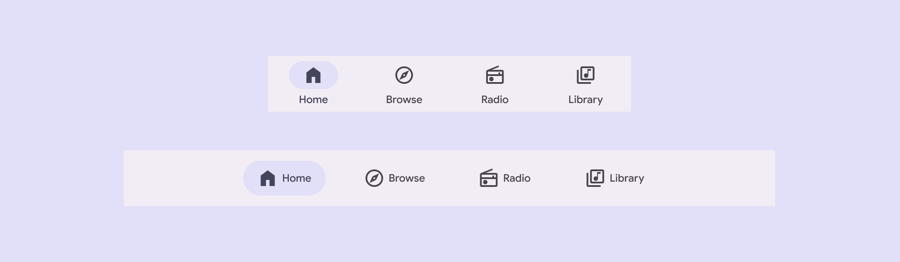
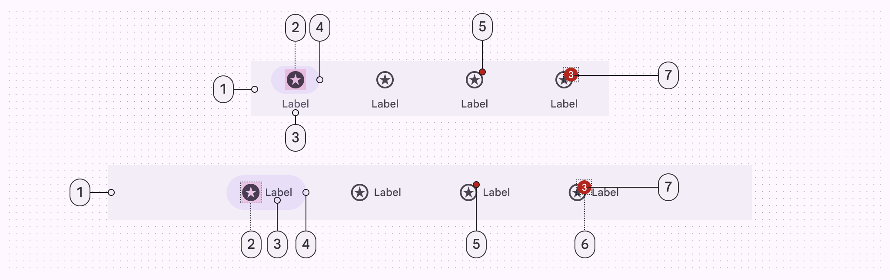
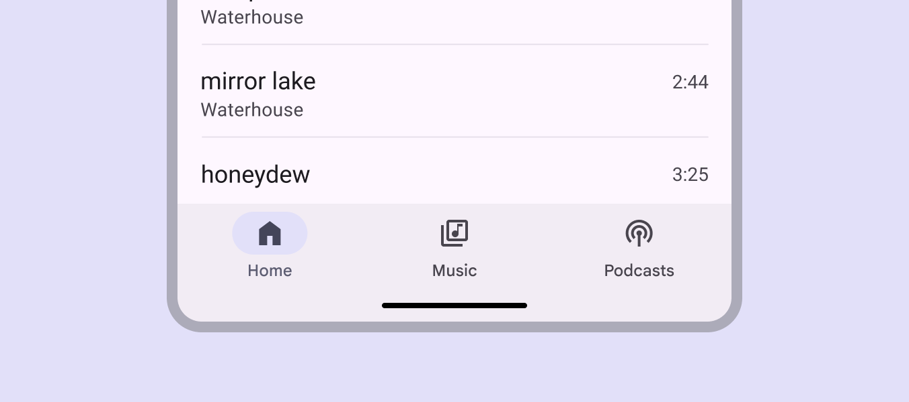
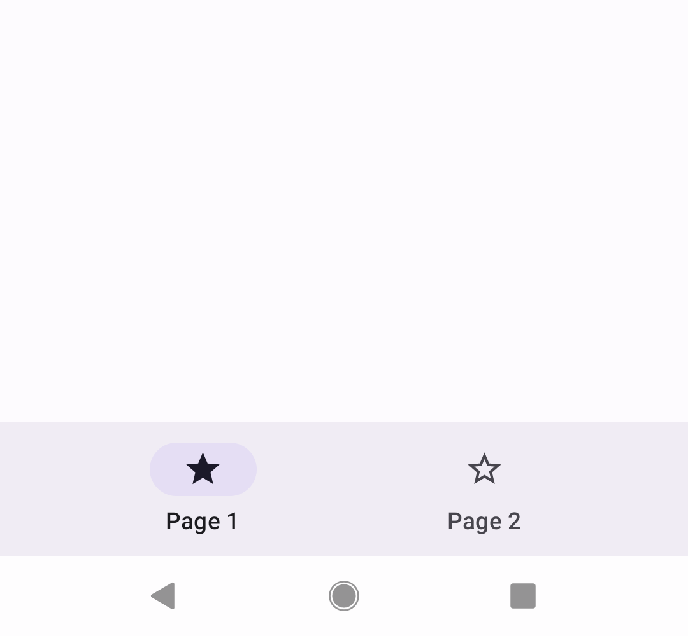
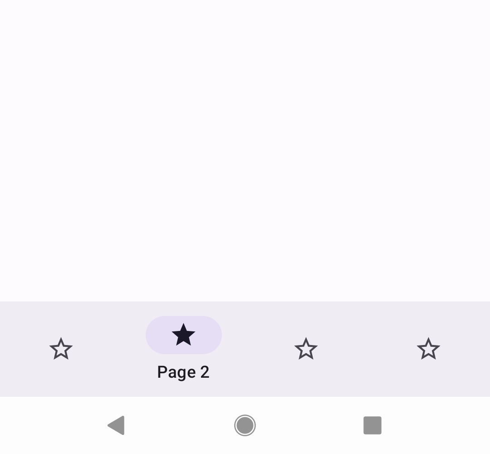
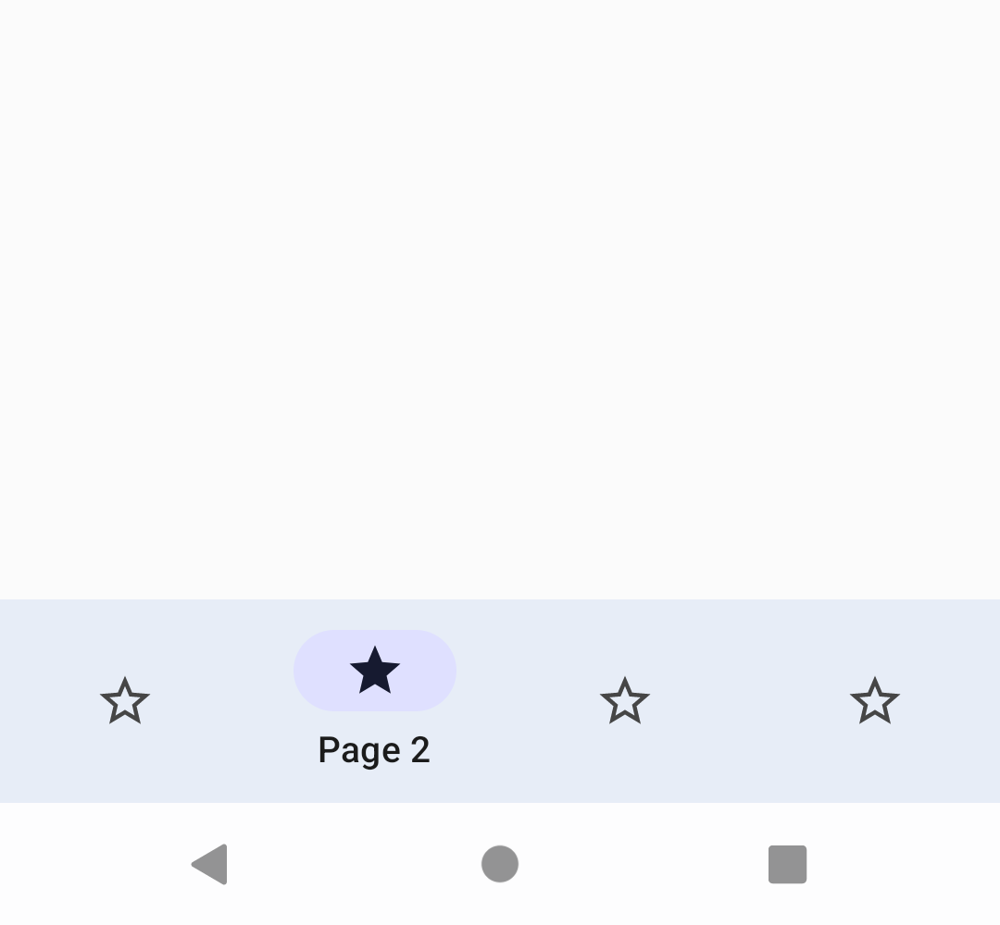

<!--docs:
title: "Bottom navigation"
layout: detail
section: components
excerpt: "Bottom navigation bars make it easy to explore and switch between top-level views in a single tap."
iconId: bottom_navigation
path: /catalog/bottom-navigation/
-->

# Bottom navigation (Navigation bar)

[Navigation bar](https://m3.material.io/components/navigation-bar/overview) lets
people switch between UI views on smaller devices.

**Note:** The design name of this component has been changed from **Bottom
navigation** to **Navigation bar**. However, Material's Android implementation
remains as `BottomNavigationView`.


Navigation bar on compact and medium window sizes

Navigation bars can have three to five destinations. The nav bar is positioned
at the bottom of screens for convenient access. Each destination is represented
by an icon and label text.

**Note:** Images use various dynamic color schemes.

## Design & API documentation

*   [Material 3 (M3) spec](https://m3.material.io/components/navigation-bar/overview)
*   [API reference](https://developer.android.com/reference/com/google/android/material/bottomnavigation/package-summary)

## Anatomy



1.  Container
2.  Icon
3.  Label text
4.  Active indicator
5.  Small badge (optional)
6.  Large badge (optional)
7.  Large badge label

More details on anatomy items in the
[component guidelines](https://m3.material.io/components/navigation-bar/guidelines#895b5b49-a166-4d30-90be-c71a4c970f04).

## M3 Expressive

### M3 Expressive update

Before you can use `Material3Expressive` component styles, follow the
[`Material3Expressive` themes setup instructions](https://github.com/material-components/material-components-android/tree/master/docs/getting-started.md#material3expressive-themes).

A new expressive style for the bottom navigation bar has been introduced that's
shorter and supports horizontal navigation items in medium-sized windows.
[More on M3 Expressive](https://m3.material.io/blog/building-with-m3-expressive)



**Color:**

*   Active label changed from **on-surface-variant** to **secondary**

### M3 Expressive styles

Changes from M3:

*   Height: From 80dp to 64dp
*   Color: New expressive colors!
*   Top item padding: From 12dp to 6dp
*   Bottom item padding: From 16dp to 6dp
*   Label text is no longer bolded when selected
*   Active indicator: From 64dp to 56dp
*   New horizontal item configuration on medium and larger window sizes (greater
    than or equal to 600dp):
    *   Icon moves from top to start of item
    *   Instead of being a set width based on the item count, item width is
        based on content with a max width
    *   Item gravity: From top center to center

The default style for bottom navigation bar is:

```xml
<item name="bottomNavigationStyle">@style/Widget.Material3Expressive.BottomNavigationView</item>
```

## Key properties

### Container attributes

Element                        | Attribute             | Related methods | Default value
------------------------------ | --------------------- | --------------- | -------------
**Color**                      | `app:backgroundTint`  | N/A             | `?attr/colorSurfaceContainer`
**Elevation**                  | `app:elevation`       | `setElevation`  | `3dp`
**Compat Shadow** (deprecated) | `compatShadowEnabled` | N/A             | `false`

**Note:** `compatShadowEnabled` has no effect, as the library no longer supports
pre-Lollipop.

### Navigation bar item attributes

Element                   | Attribute                 | Related methods                                       | Default value
------------------------- | ------------------------- | ----------------------------------------------------- | -------------
**Menu resource**         | `app:menu`                | `inflateMenu`<br/>`getMenu`                           | N/A
**Ripple (inactive)**     | `app:itemRippleColor`     | `setItemRippleColor`<br/>`getItemRippleColor`         | Variations of `?attr/colorPrimary` and `?attr/colorOnSurfaceVariant` (see all [states](https://github.com/material-components/material-components-android/tree/master/lib/java/com/google/android/material/bottomnavigation/res/color/m3_navigation_bar_ripple_color_selector.xml))
**Ripple (active)**       | "                         | "                                                     | Variations of `?attr/colorPrimary` (see all [states](https://github.com/material-components/material-components-android/tree/master/lib/java/com/google/android/material/bottomnavigation/res/color/m3_navigation_bar_ripple_color_selector.xml))
**Label visibility mode** | `app:labelVisibilityMode` | `setLabelVisibilityMode`<br/>`getLabelVisibilityMode` | `LABEL_VISIBILITY_AUTO`
**Item Gravity**          | `app:itemGravity`         | `setItemGravity`<br/>`getItemGravity`                 | `TOP_CENTER`

### Active indicator attributes

Element                                 | Attribute                                  | Related methods                                                                                       | Default value
--------------------------------------- | ------------------------------------------ | ----------------------------------------------------------------------------------------------------- | -------------
**Color**                               | `android:color`                            | `setItemActiveIndicatorColor`<br/>`getItemActiveIndicatorColor`                                       | `?attr/colorSecondaryContainer`
**Width**                               | `android:width`                            | `setItemActiveIndicatorWidth`<br/>`getItemActiveIndicatorWidth`                                       | `56dp`
**Height**                              | `android:height`                           | `setItemActiveIndicatorHeight`<br/>`getItemActiveIndicatorHeight`                                     | `32dp`
**Shape**                               | `app:shapeAppearance`                      | `setItemActiveIndicatorShapeAppearance`<br/>`getItemActiveIndicatorShapeAppearance`                   | `50% rounded`
**Margin horizontal**                   | `app:marginHorizontal`                     | `setItemActiveIndicatorMarginHorizontal`<br/>`getItemActiveIndicatorMarginHorizontal`                 | `4dp`
**Padding between indicator and label** | `app:activeIndicatorLabelPadding`          | `setActiveIndicatorLabelPadding` <br/> `getActiveIndicatorLabelPadding`                               | `4dp`
**Expanded Width**                      | `app:expandedWidth`                        | `setItemActiveIndicatorExpandedWidth`<br/>`getItemActiveIndicatorExpandedWidth`                       | `HUG`
**Expanded Height**                     | `app:expandedHeight`                       | `setItemActiveIndicatorExpandedHeight`<br/>`getItemActiveIndicatorExpandedHeight`                     | `56dp`
**Expanded Margin horizontal**          | `app:expandedMarginHorizontal`             | `setItemActiveIndicatorExpandedMarginHorizontal`<br/>`getItemActiveIndicatorExpandedMarginHorizontal` | `20dp`
**Expanded Start Padding**              | `app:expandedActiveIndicatorPaddingStart`  | `setItemExpandedActiveIndicatorPadding`                                                               | `16dp`
**Expanded End Padding**                | `app:expandedActiveIndicatorPaddingEnd`    | `setItemExpandedActiveIndicatorPadding`                                                               | `16dp`
**Expanded Top Padding**                | `app:expandedActiveIndicatorPaddingTop`    | `setItemExpandedActiveIndicatorPadding`                                                               | `0dp`
**Expanded Bottom Padding**             | `app:expandedActiveIndicatorPaddingBottom` | `setItemExpandedActiveIndicatorPadding`                                                               | `0dp`

**Note:** The expanded active indicator refers to the active indicator that
expands to wrap the content of the navigation bar item when the
`itemIconGravity` value is equal to `START`.

### Icon attributes

Element                           | Attribute                             | Related methods                                                     | Default value
--------------------------------- | ------------------------------------- | ------------------------------------------------------------------- | -------------
**Icon**                          | `android:icon` in the `menu` resource | N/A                                                                 | N/A
**Size**                          | `app:itemIconSize`                    | `setItemIconSize`<br/>`setItemIconSizeRes`<br/>`getItemIconSize`    | `24dp`
**Color (inactive)**              | `app:itemIconTint`                    | `setItemIconTintList`<br/>`getItemIconTintList`                     | `?attr/colorOnSurfaceVariant` (see all [states](https://github.com/material-components/material-components-android/tree/master/lib/java/com/google/android/material/bottomnavigation/res/color/m3_navigation_bar_item_with_indicator_icon_tint.xml))
**Color (active)**                | "                                     | "                                                                   | `?attr/colorOnSecondaryContainer` (see all [states](https://github.com/material-components/material-components-android/tree/master/lib/java/com/google/android/material/bottomnavigation/res/color/m3_navigation_bar_item_with_indicator_icon_tint.xml))
**Gravity**                       | `app:itemIconGravity`                 | `setItemIconGravity`<br/>`getItemIconGravity`                       | `TOP`
**Icon label horizontal padding** | `app:iconLabelHorizontalSpacing`      | `setIconLabelHorizontalSpacing`<br/>`getIconLabelHorizontalSpacing` | `4dp`

### Text label attributes

Element                   | Attribute                                                                       | Related methods                                                                                                                                                 | Default value
------------------------- | ------------------------------------------------------------------------------- | --------------------------------------------------------------------------------------------------------------------------------------------------------------- | -------------
**Text label**            | `android:title` in the `menu` resource                                          | N/A                                                                                                                                                             | N/A
**Color (inactive)**      | `app:itemTextColor`                                                             | `setItemTextColor`<br/>`getItemTextColor`                                                                                                                       | `?attr/colorOnSurfaceVariant` (see all [states](https://github.com/material-components/material-components-android/tree/master/lib/java/com/google/android/material/bottomnavigation/res/color/m3_navigation_bar_item_with_indicator_label_tint.xml))
**Color (active)**        | "                                                                               | "                                                                                                                                                               | `?attr/colorOnSurface` (see all [states](https://github.com/material-components/material-components-android/tree/master/lib/java/com/google/android/material/bottomnavigation/res/color/m3_navigation_bar_item_with_indicator_label_tint.xml))
**Typography (inactive)** | `app:itemTextAppearanceInactive`<br/>`app:horizontalItemTextAppearanceInactive` | `setItemTextAppearanceInactive`<br/>`getItemTextAppearanceInactive`<br/>`setHorizontalItemTextAppearanceInactive`<br/>`getHorizontalItemTextAppearanceInactive` | `?attr/textAppearanceTitleSmall`
**Typography (active)**   | `app:itemTextAppearanceActive`<br/>`app:horizontalItemTextAppearanceActive`     | `setItemTextAppearanceActive`<br/>`getItemTextAppearanceActive`<br/>`setHorizontalItemTextAppearanceActive`<br/>`getHorizontalItemTextAppearanceActive`         | `?attr/textAppearanceTitleSmall`
**Typography (active)**   | `app:itemTextAppearanceActiveBoldEnabled`                                       | `setItemTextAppearanceActiveBoldEnabled`                                                                                                                        | `true`
**Max lines**             | `app:labelMaxLines`                                                             | `setLabelMaxLines`<br/>`getLabelMaxLines`                                                                                                                       | `1`
**Scale with font size**  | `app:scaleLabelWithFontSize`                                                    | `setScaleLabelTextWithFont`<br/>`getScaleLabelTextWithFont`                                                                                                     | `false`

### Styles

Element           | Style                                   | Container color      | Icon/Text label color (inactive) | Icon/Text label color (active)                                             | Theme attribute
----------------- | --------------------------------------- | -------------------- | -------------------------------- | -------------------------------------------------------------------------- | ---------------
**Default style** | `Widget.Material3.BottomNavigationView` | `?attr/colorSurface` | `?attr/colorOnSurfaceVariant`    | Icon: `?attr/colorOnSecondaryContainer` <br/> Text: `?attr/colorOnSurface` | `?attr/bottomNavigationStyle`

For the full list, see
[styles](https://github.com/material-components/material-components-android/tree/master/lib/java/com/google/android/material/bottomnavigation/res/values/styles.xml),
[navigation attributes](https://github.com/material-components/material-components-android/tree/master/lib/java/com/google/android/material/navigation/res/values/attrs.xml),
and
[navigation bar attributes](https://github.com/material-components/material-components-android/tree/master/lib/java/com/google/android/material/bottomnavigation/res/values/attrs.xml).

## Code implementation

Before you can use the Material navigation bar, you need to add a dependency to
the Material components for Android library. For more information, go to the
[Getting started](https://github.com/material-components/material-components-android/tree/master/docs/getting-started.md)
page.

### Adding navigation bar

A typical layout looks like this:

```xml
<LinearLayout
    xmlns:android="http://schemas.android.com/apk/res/android"
    xmlns:app="http://schemas.android.com/apk/res-auto"
    android:layout_width="match_parent"
    android:layout_height="wrap_content">
  ...
  <com.google.android.material.bottomnavigation.BottomNavigationView
      android:id="@+id/bottom_navigation"
      android:layout_width="match_parent"
      android:layout_height="wrap_content"
      app:menu="@menu/bottom_navigation_menu" />

</LinearLayout>
```

The `@menu/bottom_navigation_menu` resource should point to a file named
`bottom_navigation_menu.xml` inside a `menu` resource directory:

```xml
<menu xmlns:android="http://schemas.android.com/apk/res/android">
  <item
      android:id="@+id/item_1"
      android:enabled="true"
      android:icon="@drawable/icon_1"
      android:title="@string/text_label_1"/>
  <item
      android:id="@+id/item_2"
      android:enabled="true"
      android:icon="@drawable/icon_2"
      android:title="@string/text_label_2"/>
</menu>
```

**Note:** `BottomNavigationView` does not support more than 5 `menu` items.

In code:

```kt
NavigationBarView.OnItemSelectedListener { item ->
    when(item.itemId) {
        R.id.item_1 -> {
            // Respond to navigation item 1 click
            true
        }
        R.id.item_2 -> {
            // Respond to navigation item 2 click
            true
        }
        else -> false
    }
}
```

There's also a method for detecting when navigation items have been reselected:

```kt
bottomNavigation.setOnItemReselectedListener { item ->
    when(item.itemId) {
        R.id.item_1 -> {
            // Respond to navigation item 1 reselection
        }
        R.id.item_2 -> {
            // Respond to navigation item 2 reselection
        }
    }
}
```

That results in:



**Note:** We have deprecated the
`BottomNavigationView#setOnNavigationItemSelectedListener` and
`BottomNavigationView#setOnNavigationItemReselectedListener` methods in favor of
the listeners in `NavigationBarView`. This allows you to share selection
handling code between the `BottomNavigation` and `NavigationRail` view elements.

### Navigation bar example

The following example shows a navigation bar with four icons:



In `layout.xml`:

```xml
<LinearLayout
    xmlns:android="http://schemas.android.com/apk/res/android"
    xmlns:app="http://schemas.android.com/apk/res-auto"
    android:layout_width="match_parent"
    android:layout_height="wrap_content">

  <com.google.android.material.bottomnavigation.BottomNavigationView
      android:id="@+id/bottom_navigation"
      android:layout_width="match_parent"
      android:layout_height="wrap_content"
      app:menu="@menu/bottom_navigation_menu" />

</LinearLayout>
```

In `bottom_navigation_menu.xml` inside a `menu` resource directory:

```xml
<menu xmlns:android="http://schemas.android.com/apk/res/android">
  <item
      android:id="@+id/page_1"
      android:enabled="true"
      android:icon="@drawable/ic_star"
      android:title="@string/page_1"/>
  <item
      android:id="@+id/page_2"
      android:enabled="true"
      android:icon="@drawable/ic_star"
      android:title="@string/page_2"/>
  <item
      android:id="@+id/page_3"
      android:enabled="true"
      android:icon="@drawable/ic_star"
      android:title="@string/page_3"/>
  <item
      android:id="@+id/page_4"
      android:enabled="true"
      android:icon="@drawable/ic_star"
      android:title="@string/page_4"/>
</menu>
```

In code:

```kt
bottomNavigation.selectedItemId = R.id.page_2
```

### Adding navigation bar on larger screens

On medium screen sizes and larger, navigation bars are recommended to be a
horizontal item configuration, by setting `app:itemIconGravity` to be `start`
instead of `top`. You can do this by
[setting alternative layouts identified by resource qualifiers](https://developer.android.com/develop/ui/views/layout/responsive-adaptive-design-with-views#alternative_layout_resources).

Here's an example:

```xml
<com.google.android.material.bottomnavigation.BottomNavigationView
  android:id="@+id/bottom_navigation_bar"
  android:layout_width="match_parent"
  android:layout_height="wrap_content"
  android:layout_gravity="bottom"
  app:itemIconGravity="start"
  app:itemGravity="center"
  app:menu="@menu/bottom_navigation_menu"/>
```


### Making navigation bar accessible

You should set an `android:title` for each of your `menu` items so that screen
readers like TalkBack can properly announce what each navigation item
represents:

```xml
<menu xmlns:android="http://schemas.android.com/apk/res/android">
  <item
      ...
      android:title="@string/text_label"/>
  ...
</menu>
```

The `labelVisibilityMode` attribute can be used to adjust the behavior of the
text labels for each navigation bar item. There are four visibility modes:

*   `LABEL_VISIBILITY_AUTO` (default): The label behaves as “labeled” when there
    are 3 items or less, or “selected” when there are 4 items or more
*   `LABEL_VISIBILITY_SELECTED`: The label is only shown on the selected
    navigation item
*   `LABEL_VISIBILITY_LABELED`: The label is shown on all navigation items
*   `LABEL_VISIBILITY_UNLABELED`: The label is hidden for all navigation items

### Adding badges


Initialize and show a `BadgeDrawable` associated with `menuItemId`, subsequent
calls to this method will reuse the existing `BadgeDrawable`:

```kt
var badge = bottomNavigation.getOrCreateBadge(menuItemId)
badge.isVisible = true
// An icon only badge will be displayed unless a number or text is set:
badge.number = 99  // or badge.text = "New"
```

As a best practice, if you need to temporarily hide the badge, for instance
until the next notification is received, change the visibility of
`BadgeDrawable`:

```kt
val badgeDrawable = bottomNavigation.getBadge(menuItemId)
    if (badgeDrawable != null) {
        badgeDrawable.isVisible = false
        badgeDrawable.clearNumber()  // or badgeDrawable.clearText()
    }
```

To remove any `BadgeDrawable`s that are no longer needed:

```kt
bottomNavigation.removeBadge(menuItemId)
```

See the [`Badges`](BadgeDrawable.md) documentation for more information about
badges.

## Customizing navigation bar

### Theming a navigation bar

Navigation bars support the customization of color and typography.

#### Navigation bar theming example

API and source code:

*   `BottomNavigationView`
    *   [Class description](https://developer.android.com/reference/com/google/android/material/bottomnavigation/BottomNavigationView)
    *   [Class source](https://github.com/material-components/material-components-android/tree/master/lib/java/com/google/android/material/bottomnavigation/BottomNavigationView.java)

The following example shows a navigation bar with Material theming.



##### Implementing navigation bar theming

Use theme attributes and a style in `res/values/styles.xml`, which applies to
all navigation bars and affects other components:

```xml
<style name="Theme.App" parent="Theme.Material3.*">
    ...
    <item name="colorSurface">@color/shrine_theme_light_surface</item>
    <item name="colorOnSurfaceVariant">@color/shrine_theme_light_onSurfaceVariant</item>
</style>
```

Use a default style theme attribute, styles, and a theme overlay, which apply to
all navigation bars but do not affect other components:

```xml
<style name="Theme.App" parent="Theme.Material3.*">
    ...
    <item name="bottomNavigationStyle">@style/Widget.App.BottomNavigationView</item>
</style>

<style name="Widget.App.BottomNavigationView" parent="Widget.Material3.BottomNavigationView">
    <item name="materialThemeOverlay">@style/ThemeOverlay.App.BottomNavigationView</item>
</style>

<style name="ThemeOverlay.App.BottomNavigationView" parent="">
    <item name="colorSurface">@color/shrine_theme_light_surface</item>
    <item name="colorOnSurfaceVariant">@color/shrine_theme_light_onSurfaceVariant</item>
</style>
```

Use the style in the layout, which affects only this specific navigation bar:

```xml
<com.google.android.material.bottomnavigation.BottomNavigationView
    ...
    style="@style/Widget.App.BottomNavigationView"
/>
```
