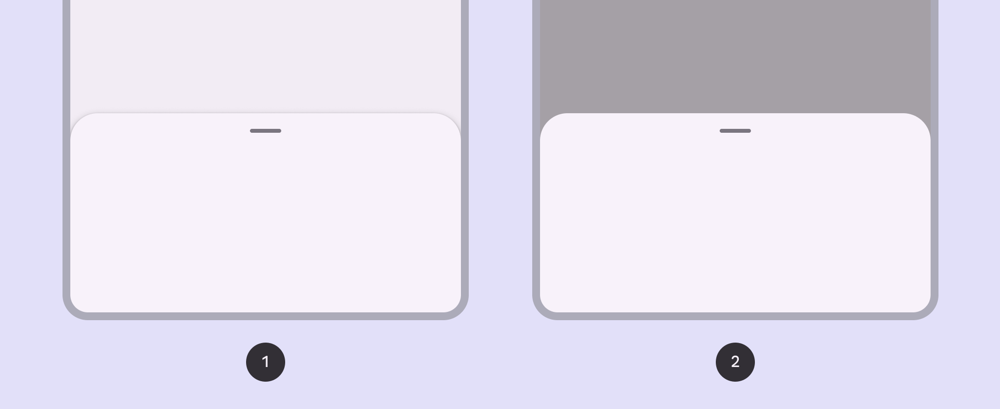
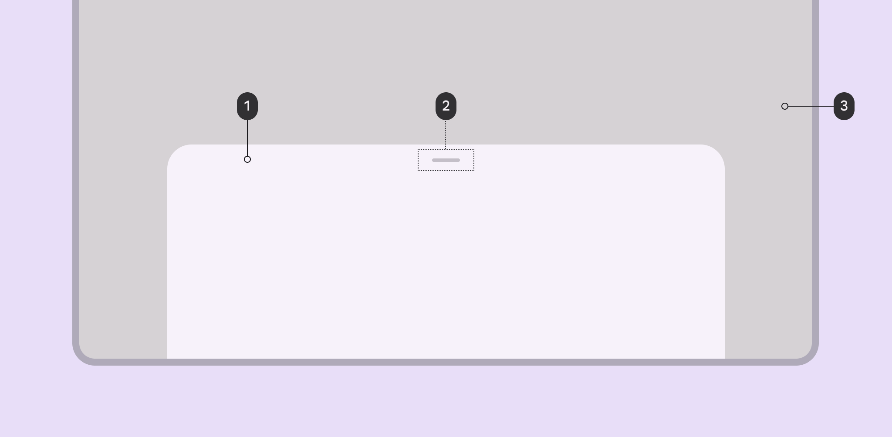
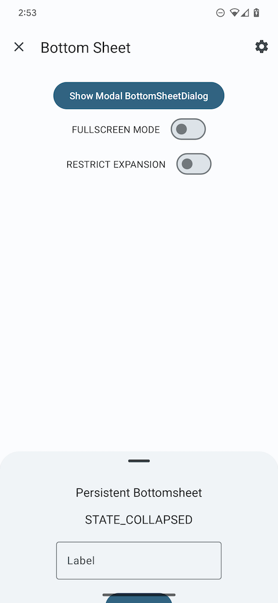
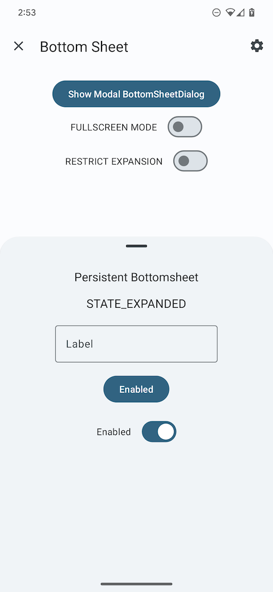
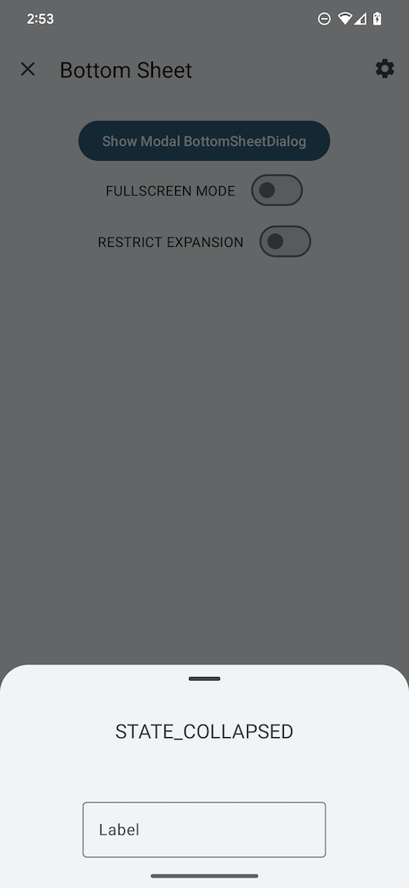
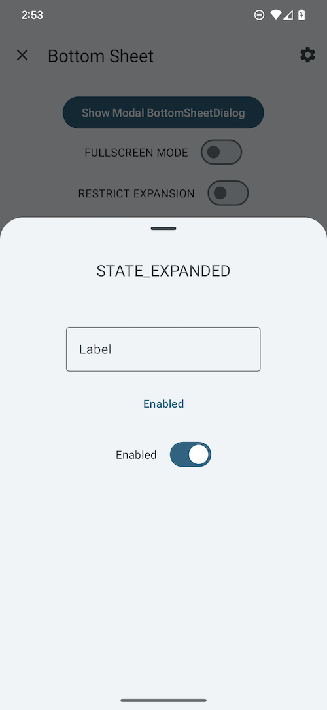
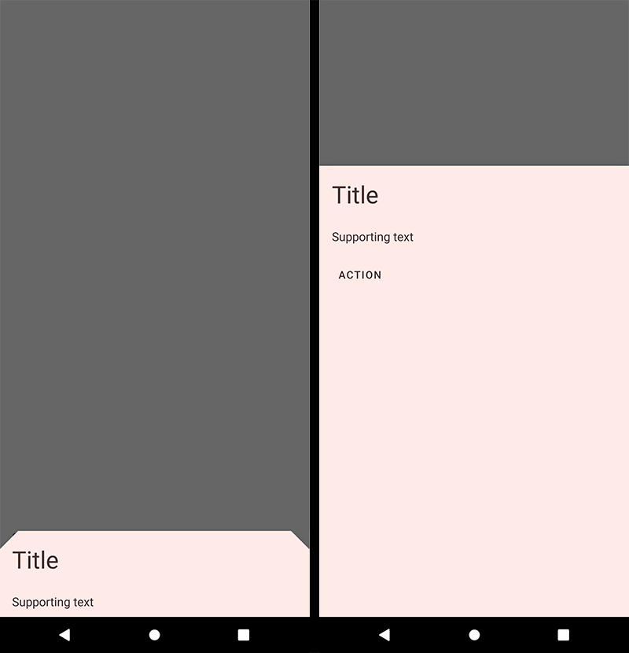

<!--docs:
title: "Bottom sheets"
layout: detail
section: components
excerpt: "Bottom sheets slide up from the bottom of the screen to reveal more content."
iconId: bottom_sheet
path: /catalog/bottom-sheet-behavior/
-->

# Bottom sheets

[Bottom sheets](https://m3.material.io/components/bottom-sheets/overview) show
secondary content anchored to the bottom of the screen. There are two variants
of bottom sheets.



1.  Standard bottom sheet
2.  Modal bottom sheet

**Note:** Images use various dynamic color schemes.

## Design & API documentation

*   [Material 3 (M3) spec](https://m3.material.io/components/bottom-sheets/overview)
*   [API reference](https://developer.android.com/reference/com/google/android/material/bottomsheet/package-summary)

## Anatomy

Modal bottom sheets are above a scrim while standard bottom sheets don't have a
scrim. Besides this, both types of bottom sheets have the same specs.



1.  Container
2.  Drag handle (optional)
3.  Scrim

More details on anatomy items in the
[component guidelines](https://m3.material.io/components/bottom-sheets/guidelines#0dd76c6d-7f76-4ff4-b325-0abf28b00029).

## Key properties

### Sheet attributes

Element        | Attribute             | Related method(s)                 | Default value
-------------- | --------------------- | --------------------------------- | -------------
**Color**      | `app:backgroundTint`  | N/A                               | `?attr/colorSurfaceContainerLow`
**Shape**      | `app:shapeAppearance` | N/A                               | `?attr/shapeAppearanceCornerExtraLarge`
**Elevation**  | `android:elevation`   | N/A                               | `1dp`
**Max width**  | `android:maxWidth`    | `setMaxWidth`<br/>`getMaxWidth`   | `640dp`
**Max height** | `android:maxHeight`   | `setMaxHeight`<br/>`getMaxHeight` | N/A

### Behavior attributes

More information about these attributes and how to use them in the
[setting behavior](#setting-behavior) section.

Behavior                                          | Related method(s)                                                         | Default value
------------------------------------------------- | ------------------------------------------------------------------------- | -------------
`app:behavior_peekHeight`                         | `setPeekHeight`<br/>`getPeekHeight`                                       | `auto`
`app:behavior_hideable`                           | `setHideable`<br/>`isHideable`                                            | `false` for standard<br/>`true` for modal
`app:behavior_skipCollapsed`                      | `setSkipCollapsed`<br/>`getSkipCollapsed`                                 | `false`
`app:behavior_fitToContents`                      | `setFitToContents`<br/>`isFitToContents`                                  | `true`
`app:behavior_draggable`                          | `setDraggable`<br/>`isDraggable`                                          | `true`
`app:behavior_draggableOnNestedScroll`            | `setDraggableOnNestedScroll`<br/>`isDraggableOnNestedScroll`              | `true`
`app:behavior_halfExpandedRatio`                  | `setHalfExpandedRatio`<br/>`getHalfExpandedRatio`                         | `0.5`
`app:behavior_expandedOffset`                     | `setExpandedOffset`<br/>`getExpandedOffset`                               | `0dp`
`app:behavior_significantVelocityThreshold`       | `setSignificantVelocityThreshold` <br/> `getSignificantVelocityThreshold` | `500 pixels/s`
`app:behavior_multipleScrollingChildrenSupported` | N/A                                                                       | `false`

To save behavior on configuration change:

Attribute                | Related method(s)                 | Default value
------------------------ | --------------------------------- | -------------
`app:behavior_saveFlags` | `setSaveFlags`<br/>`getSaveFlags` | `SAVE_NONE`

### Styles

Element                   | Default value                               | Theme attribute
------------------------- | ------------------------------------------- | ---------------
**Default style (modal)** | `@style/Widget.Material3.BottomSheet.Modal` | `?attr/bottomSheetStyle`

**Note**: The `?attr/bottomSheetStyle` default style theme attribute is for
modal bottom sheets only. There is no default style theme attribute for standard
bottom sheets, because `BottomSheetBehavior`s don't have a designated associated
`View`.

### Theme overlays

Element                   | Theme overlay                              | Attribute
------------------------- | ------------------------------------------ | ---------
**Default theme overlay** | `ThemeOverlay.Material3.BottomSheetDialog` | `?attr/bottomSheetDialogTheme`

For the full list, see
[styles](https://github.com/material-components/material-components-android/tree/master/lib/java/com/google/android/material/bottomsheet/res/values/styles.xml),
[attrs](https://github.com/material-components/material-components-android/tree/master/lib/java/com/google/android/material/bottomsheet/res/values/attrs.xml),
and
[themes and theme overlays](https://github.com/material-components/material-components-android/tree/master/lib/java/com/google/android/material/bottomsheet/res/values/themes.xml).

## Variants of bottom sheets

### Standard bottom sheet

Standard bottom sheets co-exist with the screen’s main UI region and allow for
simultaneously viewing and interacting with both regions. They are commonly used
to keep a feature or secondary content visible on screen when content in the
main UI region is frequently scrolled or panned.

[`BottomSheetBehavior`](https://developer.android.com/reference/com/google/android/material/bottomsheet/BottomSheetBehavior)
is applied to a child of
[CoordinatorLayout](https://developer.android.com/reference/androidx/coordinatorlayout/widget/CoordinatorLayout)
to make that child a **persistent bottom sheet**, which is a view that comes up
from the bottom of the screen, elevated over the main content. It can be dragged
vertically to expose more or less content.

API and source code:

*   `BottomSheetBehavior`
    *   [Class definition](https://developer.android.com/reference/com/google/android/material/bottomsheet/BottomSheetBehavior)
    *   [Class source](https://github.com/material-components/material-components-android/tree/master/lib/java/com/google/android/material/bottomsheet/BottomSheetBehavior.java)

#### Standard bottom sheet example

The following example shows a standard bottom sheet in its collapsed and
expanded states:

Collapsed <div style="width:400px"></div>                                                                             | Expanded <div style="width:400px"></div>
--------------------------------------------------------------------------------------------------------------------- | ----------------------------------------
 | 

`BottomSheetBehavior` works in tandem with `CoordinatorLayout` to let you
display content on a bottom sheet, perform enter/exit animations, respond to
dragging/swiping gestures, etc.

Apply the `BottomSheetBehavior` to a direct child `View` of `CoordinatorLayout`:

```xml
<androidx.coordinatorlayout.widget.CoordinatorLayout
  ...>

  <FrameLayout
    android:id="@+id/standard_bottom_sheet"
    style="@style/Widget.Material3.BottomSheet"
    android:layout_width="match_parent"
    android:layout_height="match_parent"
    app:layout_behavior="com.google.android.material.bottomsheet.BottomSheetBehavior">

    <!-- Drag handle for accessibility -->
    <com.google.android.material.bottomsheet.BottomSheetDragHandleView
    android:id="@+id/drag_handle"
    android:layout_width="match_parent"
    android:layout_height="wrap_content"/>

    <!-- Bottom sheet contents. -->
    <TextView
    android:layout_width="wrap_content"
    android:layout_height="wrap_content"
    android:text="@string/title"
    .../>

    <TextView
    android:layout_width="wrap_content"
    android:layout_height="wrap_content"
    android:text="@string/supporting_text"
    .../>

    <Button
    android:id="@+id/bottomsheet_button"
    android:layout_width="wrap_content"
    android:layout_height="wrap_content"
    android:text="@string/action"
    .../>

    <com.google.android.material.switchmaterial.SwitchMaterial
    android:layout_width="wrap_content"
    android:layout_height="wrap_content"
    android:text="@string/switch_label"/>

  </FrameLayout>

</androidx.coordinatorlayout.widget.CoordinatorLayout>
```

In this example, the bottom sheet is the `FrameLayout`.

You can use the `BottomSheetBehavior` to set attributes like so:

```kt
val standardBottomSheet = findViewById<FrameLayout>(R.id.standard_bottom_sheet)
val standardBottomSheetBehavior = BottomSheetBehavior.from(standardBottomSheet)
// Use this to programmatically apply behavior attributes; eg.
// standardBottomSheetBehavior.setState(STATE_EXPANDED);
```

More information about using the behavior to set attributes is in the
[setting behavior](#setting-behavior) section.

### Modal bottom sheet

Modal bottom sheets present a set of choices while blocking interaction with the
rest of the screen. They are an alternative to inline menus and simple dialogs
on mobile devices, providing additional room for content, iconography, and
actions.

[`BottomSheetDialogFragment`](https://developer.android.com/reference/com/google/android/material/bottomsheet/BottomSheetDialogFragment)
is a thin layer on top of the regular support library Fragment that renders your
fragment as a **modal bottom sheet**, fundamentally acting as a dialog.

Modal bottom sheets render a shadow on the content below them, to indicate that
they are modal. If the content outside of the dialog is tapped, the bottom sheet
is dismissed. Modal bottom sheets can be dragged vertically and dismissed by
sliding them down completely.

API and source code:

*   `BottomSheetDialogFragment`
    *   [Class definition](https://developer.android.com/reference/com/google/android/material/bottomsheet/BottomSheetDialogFragment)
    *   [Class source](https://github.com/material-components/material-components-android/tree/master/lib/java/com/google/android/material/bottomsheet/BottomSheetDialogFragment.java)

#### Modal bottom sheet example

The following example shows a modal bottom sheet in its collapsed and expanded
states:

Collapsed <div style="width:400px"></div>                                                                       | Expanded <div style="width:400px"></div>
--------------------------------------------------------------------------------------------------------------- | ----------------------------------------
 | 

First, subclass `BottomSheetDialogFragment` and overwrite `onCreateView` to
provide a layout for the contents of the sheet (in this example, it's
`modal_bottom_sheet_content.xml`):

```kt
class ModalBottomSheet : BottomSheetDialogFragment() {

    override fun onCreateView(
        inflater: LayoutInflater,
        container: ViewGroup?,
        savedInstanceState: Bundle?
    ): View? = inflater.inflate(R.layout.modal_bottom_sheet_content, container, false)

    companion object {
        const val TAG = "ModalBottomSheet"
    }
}
```

Then, inside an `AppCompatActivity`, to show the bottom sheet:

```kt
val modalBottomSheet = ModalBottomSheet()
modalBottomSheet.show(supportFragmentManager, ModalBottomSheet.TAG)
```

`BottomSheetDialogFragment` is a subclass of `AppCompatFragment`, which means
you need to use `Activity.getSupportFragmentManager()`.

**Note:** Don't call `setOnCancelListener` or `setOnDismissListener` on a
`BottomSheetDialogFragment`. You can override `onCancel(DialogInterface)` or
`onDismiss(DialogInterface)` if necessary.

`BottomSheetDialogFragment` wraps the view in a `BottomSheetDialog`, which has
its own `BottomSheetBehavior`. You can define your own `BottomSheetBehavior`
through overriding `onCreateDialog`.

**Note:** If overriding `onCreateDialog`, you should not override
`onCreateView`.

```kt

import android.view.View
import com.google.android.material.bottomsheet.BottomSheetBehavior

class ModalBottomSheet : BottomSheetDialogFragment() {

  override fun onCreateDialog(
    savedInstanceState: Bundle?,
  ): Dialog {
    val bottomSheetDialog: BottomSheetDialog =
      BottomSheetDialog(
        getContext(), R.style.ThemeOverlay_Catalog_BottomSheetDialog_Scrollable
      )
    bottomSheetDialog.setContentView(R.layout.bottom_sheet_content)
    // Set behavior attributes
    bottomSheetDialog.getBehavior().setPeekHeight(123)
    return bottomSheetDialog
  }
}
```

## Code implementation

Before you can use Material bottom sheets, you need to add a dependency to the
Material components for Android library. For more information, see the
[Getting started](https://github.com/material-components/material-components-android/tree/master/docs/getting-started.md)
page.

<details>
  <summary><h3>Listening to state and slide changes</h3></summary>

A `BottomSheetCallback` can be added to a `BottomSheetBehavior`:

```kt
val bottomSheetCallback = object : BottomSheetBehavior.BottomSheetCallback() {

    override fun onStateChanged(bottomSheet: View, newState: Int) {
        // Do something for new state.
    }

    override fun onSlide(bottomSheet: View, slideOffset: Float) {
        // Do something for slide offset.
    }
}

// To add the callback:
bottomSheetBehavior.addBottomSheetCallback(bottomSheetCallback)

// To remove the callback:
bottomSheetBehavior.removeBottomSheetCallback(bottomSheetCallback)
```

</details>

<details>
  <summary><h3>Handling insets and fullscreen</h3></summary>

`BottomSheetBehavior` can automatically handle insets (such as for
[edge to edge](https://developer.android.com/training/gestures/edge-to-edge)) by
specifying any of these to true on the view:

*   `app:paddingBottomSystemWindowInsets`
*   `app:paddingLeftSystemWindowInsets`
*   `app:paddingRightSystemWindowInsets`
*   `app:paddingTopSystemWindowInsets`

On API 21 and above the modal bottom sheet will be rendered fullscreen (edge to
edge) if the navigation bar is transparent and `enableEdgeToEdge` is true. To
enable edge-to-edge by default for modal bottom sheets, you can override
`?attr/bottomSheetDialogTheme` like the below example (`enableEdgeToEdge` is
already true in `ThemeOverlay.Material3.BottomSheetDialog`):

```xml
<style name="AppTheme" parent="Theme.Material3.*">
  ...
  <item name="bottomSheetDialogTheme">@style/ThemeOverlay.App.BottomSheetDialog</item>
</style>

<style name="ThemeOverlay.App.BottomSheetDialog" parent="ThemeOverlay.Material3.BottomSheetDialog">
    <item name="android:navigationBarColor">@android:color/transparent<item>
</style>
```

Insets can be added automatically if any of the padding attributes above are set
to true in the style, either by updating the style passed to the constructor, or
by updating the default style specified by the `?attr/bottomSheetDialogTheme`
attribute in your theme.

`BottomSheetDialog` will also add padding to the top when the bottom sheet
slides under the status bar, to prevent content from being drawn underneath it.

`BottomSheetDialog` also supports
[Protections](https://developer.android.com/reference/androidx/core/view/insets/Protection).
If using
[Gradient Protections](https://developer.android.com/reference/androidx/core/view/insets/GradientProtection),
`BottomSheetBehavior` provides a `getDefaultBottomGradientProtection()` method
that will return a bottom `GradientProtection` that is the color
`?attr/colorSurfaceContainerLow` for Material3 or later, or `?attr/colorSurface`
if otherwise not defined.

</details>

<details>
  <summary><h3>Predictive back</h3></summary>

#### Modal bottom sheets

The modal `BottomSheetDialogFragment` and `BottomSheetDialog` components
automatically support
[predictive back](/third_party/java_src/android_libs/material_components/docs/foundations/PredictiveBack.md).
No further integration is required on the app side other than the general
predictive back prerequisites and migration steps mentioned
[here](/third_party/java_src/android_libs/material_components/docs/foundations/PredictiveBack.md#usage).

Visit the
[predictive back design guidelines](https://m3.material.io/components/bottom-sheets/guidelines#3d7735e2-73ea-4f3e-bd42-e70161fc1085)
to see how the component behaves when a user swipes back.

#### Standard (Non-Modal) bottom sheets

To set up predictive back for standard (non-modal) bottom sheets using
`BottomSheetBehavior`, create an AndroidX back callback that forwards
`BackEventCompat` objects to your `BottomSheetBehavior`:

```kt
val bottomSheetBackCallback = object : OnBackPressedCallback(/* enabled= */false) {
  override fun handleOnBackStarted(backEvent: BackEventCompat) {
    bottomSheetBehavior.startBackProgress(backEvent)
  }

  override fun handleOnBackProgressed(backEvent: BackEventCompat) {
    bottomSheetBehavior.updateBackProgress(backEvent)
  }

  override fun handleOnBackPressed() {
    bottomSheetBehavior.handleBackInvoked()
  }

  override fun handleOnBackCancelled() {
    bottomSheetBehavior.cancelBackProgress()
  }
}
```

And then add and enable the back callback as follows:

```kt
getOnBackPressedDispatcher().addCallback(this, bottomSheetBackCallback)

bottomSheetBehavior.addBottomSheetCallback(object : BottomSheetCallback() {
  override fun onStateChanged(bottomSheet: View, newState: Int) {
    when (newState) {
      STATE_EXPANDED, STATE_HALF_EXPANDED -> bottomSheetBackCallback.setEnabled(true)
      STATE_COLLAPSED, STATE_HIDDEN -> bottomSheetBackCallback.setEnabled(false)
      else -> {
        // Do nothing, only change callback enabled for "stable" states.
      }
    }
  }

  override fun onSlide(bottomSheet: View, slideOffset: Float) {}
})
```

</details>

<details>
  <summary><h3>Setting state</h3></summary>

Standard and modal bottom sheets have the following states:

*   `STATE_COLLAPSED`: The bottom sheet is visible but only showing its peek
    height. This state is usually the 'resting position' of a bottom sheet, and
    should have enough height to indicate there is extra content for the user to
    interact with.
*   `STATE_EXPANDED`: The bottom sheet is visible at its maximum height and it
    is neither dragging nor settling
*   `STATE_HALF_EXPANDED`: The bottom sheet is half-expanded (only applicable if
    `behavior_fitToContents` has been set to false), and is neither dragging nor
    settling (see below).
*   `STATE_HIDDEN`: The bottom sheet is no longer visible and can only be
    re-shown programmatically.
*   `STATE_DRAGGING`: The user is actively dragging the bottom sheet up or down.
*   `STATE_SETTLING`: The bottom sheet is settling to a specific height after a
    drag/swipe gesture. This will be the peek height, expanded height, or 0, in
    case the user action caused the bottom sheet to hide.

**Note:** `STATE_SETTLING` and `STATE_DRAGGING` should not be set
programmatically.

You can set a state on the bottom sheet:

```kt
bottomSheetBehavior.state = BottomSheetBehavior.STATE_COLLAPSED
```

</details>

<details>
  <summary><h3>Setting behavior</h3></summary>

There are several attributes that can be used to adjust the behavior of both
standard and modal bottom sheets.

Behavior attributes can be applied to standard bottom sheets in xml by setting
them on a child `View` set to `app:layout_behavior`, or programmatically:

```kt
val standardBottomSheetBehavior = BottomSheetBehavior.from(standardBottomSheet)
// Use this to programmatically apply behavior attributes
```

Behavior attributes can be applied to modal bottom sheets using app-level theme
attributes and styles:

```xml
<style name="ModalBottomSheet" parent="Widget.Material3.BottomSheet.Modal">
  <!-- Apply attributes here -->
</style>

<style name="ModalBottomSheetDialog" parent="ThemeOverlay.Material3.BottomSheetDialog">
  <item name="bottomSheetStyle">@style/ModalBottomSheet</item>
</style>

<style name="AppTheme" parent="Theme.Material3.*">
  <item name="bottomSheetDialogTheme">@style/ModalBottomSheetDialog</item>
</style>
```

Or programmatically:

```kt
val modalBottomSheetBehavior = (modalBottomSheet.dialog as BottomSheetDialog).behavior
// Use this to programmatically apply behavior attributes
```

More information about these attributes and their default values is available in
the [behavior attributes](#behavior-attributes) section.

</details>

<details>
  <summary><h3>Making bottom sheets accessible</h3></summary>

The contents within a bottom sheet should follow their own accessibility
guidelines, such as setting content descriptions for images.

To support dragging bottom sheets with accessibility services such as TalkBack,
Voice Access, Switch Access, etc., we provide a convenient widget,
`BottomSheetDragHandleView`, which will automatically receive and handle
accessibility commands to expand and collapse the attached bottom sheet when the
accessibility mode is enabled. The handle also supports tapping to cycle through
expanded and collapsed states as well as double tapping to hide. To
use`BottomSheetDragHandleView`, you can add it to the top of your bottom sheet
content. It will show a customizable visual indicator for all users. See the
example in the below section for how to add a drag handle to your bottom sheet.

**Note:** `BottomSheetDragHandleView` has a default min width and height of 48dp
to conform to the minimum touch target requirement. So you will need to preserve
at least 48dp at the top to place a drag handle.

</details>

## Customizing bottom sheets

### Theming bottom sheets

Bottom sheets support the customization of color and shape.

#### Bottom sheet theming example

API and source code:

*   `BottomSheetBehavior`
    *   [Class definition](https://developer.android.com/reference/com/google/android/material/bottomsheet/BottomSheetBehavior)
    *   [Class source](https://github.com/material-components/material-components-android/tree/master/lib/java/com/google/android/material/bottomsheet/BottomSheetBehavior.java)
*   `BottomSheetDialogFragment`
    *   [Class definition](https://developer.android.com/reference/com/google/android/material/bottomsheet/BottomSheetDialogFragment)
    *   [Class source](https://github.com/material-components/material-components-android/tree/master/lib/java/com/google/android/material/bottomsheet/BottomSheetDialogFragment.java)

The following example shows a bottom sheet with Material theming, in its
collapsed and expanded states.



##### Implementing bottom sheet theming

Setting the theme attribute `bottomSheetDialogTheme` to your custom
`ThemeOverlay` will affect all bottom sheets.

In `res/values/themes.xml`:

```xml
<style name="Theme.App" parent="Theme.Material3.*">
  ...
  <item name="bottomSheetDialogTheme">@style/ThemeOverlay.App.BottomSheetDialog</item>
</style>

<style name="ThemeOverlay.App.BottomSheetDialog" parent="ThemeOverlay.Material3.BottomSheetDialog">
    <item name="bottomSheetStyle">@style/ModalBottomSheetDialog</item>
</style>
```

In `res/values/styles.xml`:

```xml
<style name="ModalBottomSheetDialog" parent="Widget.Material3.BottomSheet.Modal">
    <item name="backgroundTint">@color/shrine_pink_light</item>
    <item name="shapeAppearance">@style/ShapeAppearance.App.LargeComponent</item>
</style>

<style name="ShapeAppearance.App.LargeComponent" parent="ShapeAppearance.Material3.LargeComponent">
    <item name="cornerFamily">cut</item>
    <item name="cornerSize">24dp</item>
</style>
```

**Note:** The benefit of using a custom `ThemeOverlay` is that any changes to
your main theme, such as updated colors, will be reflected in the bottom sheet,
as long as they're not overridden in your custom theme overlay. If you use a
custom `Theme` instead, by extending from one of the
`Theme.Material3.*.BottomSheetDialog` variants, you will have more control over
exactly what attributes are included in each, but it also means you'll have to
duplicate any changes that you've made in your main theme into your custom
theme.
