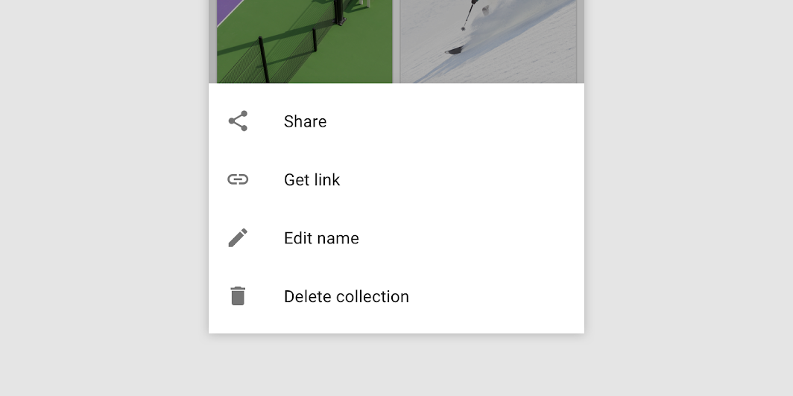

<!--docs:
title: "Bottom Sheets"
layout: detail
section: components
excerpt: "Bottom sheets slide up from the bottom of the screen to reveal more content."
iconId: bottom_sheet
path: /catalog/bottom-sheet-behavior/
-->

# Bottom Sheets

[Bottom sheets](https://material.io/components/sheets-bottom) are surfaces
containing supplementary content that are anchored to the bottom of the screen.



**Contents**

*   [Using bottom sheets](#using-bottom-sheets)
*   [Standard bottom sheet](#standard-bottom-sheet)
*   [Modal bottom sheet](#modal-bottom-sheet)
*   [Anatomy and key properties](#anatomy-and-key-properties)
*   [Theming](#theming-bottom-sheets)

## Using bottom sheets

Before you can use Material bottom sheets, you need to add a dependency to the
Material Components for Android library. For more information, go to the
[Getting started](https://github.com/material-components/material-components-android/tree/master/docs/getting-started.md)
page.

Standard bottom sheet basic usage:

```xml
<androidx.coordinatorlayout.widget.CoordinatorLayout
  ...>

  <FrameLayout
    ...
    android:id="@+id/standard_bottom_sheet"
    app:layout_behavior="com.google.android.material.bottomsheet.BottomSheetBehavior">

    <!-- Bottom sheet contents. -->

  </FrameLayout>

</androidx.coordinatorlayout.widget.CoordinatorLayout>
```

Modal bottom sheet basic usage:

```kt
class ModalBottomSheet : BottomSheetDialogFragment() {

    override fun onCreateView(
        inflater: LayoutInflater,
        container: ViewGroup?,
        savedInstanceState: Bundle?
    ): View? = inflater.inflate(R.layout.modal_bottom_sheet_content, container, false)

    companion object {
        const val TAG = "ModalBottomSheet"
    }
}

class MainActivity : AppCompatActivity() {
    ...
    val modalBottomSheet = ModalBottomSheet()
    modalBottomSheet.show(supportFragmentManager, ModalBottomSheet.TAG)
    ...
}
```

More info on each individual section below.

### Setting behavior

There are several attributes that can be used to adjust the behavior of both
standard and modal bottom sheets.

In standard bottom sheets, they can be applied in xml by setting them on the
same child `View` that has the `app:layout_behavior` set on it, or
programmaticaly like so:

```kt
val standardBottomSheetBehavior = BottomSheetBehavior.from(standardBottomSheet)
// Use this to programmatically apply behavior attributes
```

In modal bottom sheets they can be applied via app-level theme attributes and
styles:

```xml
<style name="ModalBottomSheet" parent="Widget.MaterialComponents.BottomSheet.Modal">
  <!-- Apply attributes here -->
</style>

<style name="ModalBottomSheetDialog" parent="ThemeOverlay.MaterialComponents.BottomSheetDialog">
  <item name="bottomSheetStyle">@style/ModalBottomSheet</item>
</style>

<style name="AppTheme" parent="Theme.MaterialComponents.*">
  <item name="bottomSheetDialogTheme">@style/ModalBottomSheetDialog</item>
</style>
```

Or programmaticaly like so:

```kt
val modalBottomSheetBehavior = (modalBottomSheet.dialog as BottomSheetDialog).behavior
// Use this to programmatically apply behavior attributes
```

More info about these attributes and their default values in the
[behavior attributes](#behavior-attributes) section.

### Retaining behavior on configuration change

In order to save and restore specific behaviors of the bottom sheet on
configuration change, the following flags can be set (or combined with bitwise
OR operations):

*   `SAVE_PEEK_HEIGHT`: `app:behavior_peekHeight` is preserved.
*   `SAVE_HIDEABLE`: `app:behavior_hideable` is preserved.
*   `SAVE_SKIP_COLLAPSED`: `app:behavior_skipCollapsed` is preserved.
*   `SAVE_FIT_TO_CONTENTS`: `app:behavior_fitToContents` is preserved.
*   `SAVE_ALL`: All aforementioned attributes are preserved.
*   `SAVE_NONE`: No attribute is preserved. This is the default value.

That can be done in code like so:

```kt
bottomSheetBehavior.saveFlags = BottomSheetBehavior.SAVE_ALL
```

Or in xml via the `app:behavior_saveFlags` attribute.

### Setting state

Standard and modal bottom sheets have the following states:

*   `STATE_COLLAPSED`: The bottom sheet is visible but only showing its peek
    height. This state is usually the 'resting position' of a bottom sheet, and
    should have enough height to indicate there is extra content for the user to
    interact with.
*   `STATE_EXPANDED`: The bottom sheet is visible at its maximum height and it
    is neither dragging or settling (see below).
*   `STATE_HALF_EXPANDED`: The bottom sheet is half-expanded (only applicable if
    `behavior_fitToContents` has been set to false), and is neither dragging or
    settling (see below).
*   `STATE_HIDDEN`: The bottom sheet is no longer visible and can only be
    re-shown programmatically.
*   `STATE_DRAGGING`: The user is actively dragging the bottom sheet up or down.
*   `STATE_SETTLING`: The bottom sheet is settling to specific height after a
    drag/swipe gesture. This will be the peek height, expanded height, or 0, in
    case the user action caused the bottom sheet to hide.

You can set a state on the bottom sheet like so:

```kt
bottomSheetBehavior.state = BottomSheetBehavior.STATE_COLLAPSED
```

Note: `STATE_SETTLING` and `STATE_DRAGGING` should not be set programmatically.

### Listening to state and slide changes

A `BottomSheetCallback` can be added to a `BottomSheetBehavior` like so:

```kt
val bottomSheetCallback = object : BottomSheetBehavior.BottomSheetCallback() {

    override fun onStateChanged(bottomSheet: View, newState: Int) {
        // Do something for new state.
    }

    override fun onSlide(bottomSheet: View, slideOffset: Float) {
        // Do something for slide offset.
    }
}

// To add the callback:
bottomSheetBehavior.addBottomSheetCallback(bottomSheetCallback)

// To remove the callback:
bottomSheetBehavior.removeBottomSheetCallback(bottomSheetCallback)
```

### Handling insets and fullscreen

`BottomSheetBehavior` can automatically handle insets (such as for
[edge to edge](https://developer.android.com/training/gestures/edge-to-edge)) by
specifying any of:

*   `app:paddingBottomSystemWindowInsets`
*   `app:paddingLeftSystemWindowInsets`
*   `app:paddingRightSystemWindowInsets`
*   `app:paddingTopSystemWindowInsets`

to true on the view.

On API 21 and above the modal bottom sheet will be rendered fullscreen (edge to
edge) if the navigation bar is transparent and `app:enableEdgeToEdge` is true.

It can automatically add insets if any of the padding attributes above are set
to true in the style, either by updating the style passed to the constructor, or
by updating the default style specified by the `?attr/bottomSheetDialogTheme`
attribute in your theme.

`BottomSheetDialog` will also add padding to the top when the bottom sheet
slides under the status bar to prevent content from being drawn underneath it.

### Making bottom sheets accessible

The contents within a bottom sheet should follow their own accessibility
guidelines, such as images having content descriptions set on them.

## Standard bottom sheet

Standard bottom sheets co-exist with the screen’s main UI region and allow for
simultaneously viewing and interacting with both regions. They are commonly used
to keep a feature or secondary content visible on screen when content in main UI
region is frequently scrolled or panned.

`BottomSheetBehavior` is applied to a child of
[CoordinatorLayout](https://developer.android.com/reference/androidx/coordinatorlayout/widget/CoordinatorLayout)
to make that child a **persistent bottom sheet**, which is a view that comes up
from the bottom of the screen, elevated over the main content. It can be dragged
vertically to expose more or less of their content.

API and source code:

*   `BottomSheetBehavior`
    *   [Class definition](https://developer.android.com/reference/com/google/android/material/bottomsheet/BottomSheetBehavior)
    *   [Class source](https://github.com/material-components/material-components-android/tree/master/lib/java/com/google/android/material/bottomsheet/BottomSheetBehavior.java)

### Standard bottom sheet example

The following example shows a standard bottom sheet in its collapsed and
expanded state:


`BottomSheetBehavior` works in tandem with `CoordinatorLayout` to let you
display content on a bottom sheet, perform enter/exit animations, respond to
dragging/swiping gestures, etc.

Apply the `BottomSheetBehavior` to a direct child `View` of `CoordinatorLayout`
like so:

```xml
<androidx.coordinatorlayout.widget.CoordinatorLayout
  ...>

  <FrameLayout
    android:id="@+id/standard_bottom_sheet"
    android:layout_width="match_parent"
    android:layout_height="match_parent"
    style="?attr/bottomSheetStyle"
    app:layout_behavior="com.google.android.material.bottomsheet.BottomSheetBehavior">

    <!-- Bottom sheet contents. -->
    <TextView
    android:layout_width="wrap_content"
    android:layout_height="wrap_content"
    android:text="@string/title"
    .../>

    <TextView
    android:layout_width="wrap_content"
    android:layout_height="wrap_content"
    android:text="@string/supporting_text"
    .../>

    <Button
    android:id="@+id/bottomsheet_button"
    android:layout_width="wrap_content"
    android:layout_height="wrap_content"
    android:text="@string/action"
    .../>

  </FrameLayout>

</androidx.coordinatorlayout.widget.CoordinatorLayout>
```

In this example, the bottom sheet is in fact the `FrameLayout`.

## Modal bottom sheet

Modal bottom sheets present a set of choices while blocking interaction with the
rest of the screen. They are an alternative to inline menus and simple dialogs
on mobile, providing additional room for content, iconography, and actions.

`BottomSheetDialogFragment` is a thin layer on top of the regular support
library Fragment that renders your fragment as a **modal bottom sheet**,
fundamentally acting as a dialog.

Modal bottom sheets render a shadow on the content below them to indicate that
they are modal. If the content outside of the dialog is tapped then the bottom
sheet is dismissed. Modal bottom sheets can be dragged vertically and dismissed
by completely sliding them down.

API and source code:

*   `BottomSheetDialogFragment`
    *   [Class definition](https://developer.android.com/reference/com/google/android/material/bottomsheet/BottomSheetDialogFragment)
    *   [Class source](https://github.com/material-components/material-components-android/tree/master/lib/java/com/google/android/material/bottomsheet/BottomSheetDialogFragment.java)

### Modal bottom sheet example

The following example shows a modal bottom sheet in its collapsed and expanded
state:


First, subclass `BottomSheetDialogFragment` and overwrite `onCreateView` to
provide a layout for the contents of the sheet (in this example, it's
`modal_bottom_sheet_content.xml`):

```kt
class ModalBottomSheet : BottomSheetDialogFragment() {

    override fun onCreateView(
        inflater: LayoutInflater,
        container: ViewGroup?,
        savedInstanceState: Bundle?
    ): View? = inflater.inflate(R.layout.modal_bottom_sheet_content, container, false)

    companion object {
        const val TAG = "ModalBottomSheet"
    }
}
```

Then, inside an `AppCompatActivity`, to show the bottom sheet:

```kt
val modalBottomSheet = ModalBottomSheet()
modalBottomSheet.show(supportFragmentManager, ModalBottomSheet.TAG)
```

`BottomSheetDialogFragment` is a subclass of `AppCompatFragment`, which means
you need to use `Activity.getSupportFragmentManager()`.

Note: Don't call `setOnCancelListener` or `setOnDismissListener` on a
`BottomSheetDialogFragment`, instead you can override
`onCancel(DialogInterface)` or `onDismiss(DialogInterface)` if necessary.

## Anatomy and key properties

Bottom sheets have a sheet, content, and, if modal, a scrim.


1.  Sheet
2.  Content
3.  Scrim (in modal bottom sheets)

### Sheet attributes

Element        | Attribute             | Related method(s)                 | Default value
-------------- | --------------------- | --------------------------------- | -------------
**Color**      | `app:backgroundTint`  | N/A                               | `?attr/colorSurface`
**Shape**      | `app:shapeAppearance` | N/A                               | `?attr/shapeAppearanceLargeComponent`
**Elevation**  | `android:elevation`   | N/A                               | `1dp`
**Max width**  | `android:maxWidth`    | `setMaxWidth`<br/>`getMaxWidth`   | `640dp`
**Max height** | `android:maxHeight`   | `setMaxHeight`<br/>`getMaxHeight` | N/A

### Behavior attributes

More info about these attributes and how to use them in the
[setting behavior](#setting-behavior) section.

Behavior                         | Related method(s)                                 | Default value
-------------------------------- | ------------------------------------------------- | -------------
`app:behavior_peekHeight`        | `setPeekHeight`<br/>`getPeekHeight`               | `auto`
`app:behavior_hideable`          | `setHideable`<br/>`isHideable`                    | `false` for standard<br/>`true` for modal
`app:behavior_skipCollapsed`     | `setSkipCollapsed`<br/>`getSkipCollapsed`         | `false`
`app:behavior_fitToContents`     | `setFitToContents`<br/>`isFitToContents`          | `true`
`app:behavior_draggable`         | `setDraggable`<br/>`isDraggable`                  | `true`
`app:behavior_halfExpandedRatio` | `setHalfExpandedRatio`<br/>`getHalfExpandedRatio` | `0.5`
`app:behavior_expandedOffset`    | `setExpandedOffset`<br/>`getExpandedOffset`       | `0dp`

To save behavior on configuration change:

Attribute                | Related method(s)                 | Default value
------------------------ | --------------------------------- | -------------
`app:behavior_saveFlags` | `setSaveFlags`<br/>`getSaveFlags` | `SAVE_NONE`

### Styles

Element                   | **Default value**
------------------------- | ----------------------------------------------------
**Default style (modal)** | `@style/Widget.MaterialComponents.BottomSheet.Modal`

Default style theme attribute:`?attr/bottomSheetStyle`

### Theme overlays

Element                   | **Theme overlay**
------------------------- | ---------------------------------------------------
**Default theme overlay** | `ThemeOverlay.MaterialComponents.BottomSheetDialog`

Default theme overlay attribute: `?attr/bottomSheetDialogTheme`

See the full list of
[styles](https://github.com/material-components/material-components-android/tree/master/lib/java/com/google/android/material/bottomsheet/res/values/styles.xml),
[attrs](https://github.com/material-components/material-components-android/tree/master/lib/java/com/google/android/material/bottomsheet/res/values/attrs.xml),
and
[themes and theme overlays](https://github.com/material-components/material-components-android/tree/master/lib/java/com/google/android/material/bottomsheet/res/values/themes.xml).

## Theming bottom sheets

Bottom sheets support
[Material Theming](https://material.io/components/sheets-bottom#theming) and can
be customized in terms of color and shape.

### Bottom sheet theming example

API and source code:

*   `BottomSheetBehavior`
    *   [Class definition](https://developer.android.com/reference/com/google/android/material/bottomsheet/BottomSheetBehavior)
    *   [Class source](https://github.com/material-components/material-components-android/tree/master/lib/java/com/google/android/material/bottomsheet/BottomSheetBehavior.java)
*   `BottomSheetDialogFragment`
    *   [Class definition](https://developer.android.com/reference/com/google/android/material/bottomsheet/BottomSheetDialogFragment)
    *   [Class source](https://github.com/material-components/material-components-android/tree/master/lib/java/com/google/android/material/bottomsheet/BottomSheetDialogFragment.java)

The following example shows a bottom sheet with Material Theming, in its
collapsed and expanded states.


#### Implementing bottom sheet theming

Setting the theme attribute `bottomSheetDialogTheme` to your custom
`ThemeOverlay` will affect all bottom sheets.

In `res/values/themes.xml`:

```xml
<style name="Theme.App" parent="Theme.MaterialComponents.*">
  ...
  <item name="bottomSheetDialogTheme">@style/ThemeOverlay.App.BottomSheetDialog</item>
</style>

<style name="ThemeOverlay.App.BottomSheetDialog" parent="ThemeOverlay.MaterialComponents.BottomSheetDialog">
    <item name="bottomSheetStyle">@style/ModalBottomSheetDialog</item>
</style>
```

In `res/values/styles.xml`:

```xml
<style name="ModalBottomSheetDialog" parent="Widget.MaterialComponents.BottomSheet.Modal">
    <item name="backgroundTint">@color/shrine_pink_light</item>
    <item name="shapeAppearance">@style/ShapeAppearance.App.LargeComponent</item>
</style>

<style name="ShapeAppearance.App.LargeComponent" parent="ShapeAppearance.MaterialComponents.LargeComponent">
    <item name="cornerFamily">cut</item>
    <item name="cornerSize">24dp</item>
</style>
```

Note: The benefit of using a custom `ThemeOverlay` is that any changes to your
main theme, such as updated colors, will be reflected in the bottom sheet (as
long as they're not overridden in your custom theme overlay). If you use a
custom `Theme` instead (by extending from one of the
`Theme.MaterialComponents.*.BottomSheetDialog` variants) you have more control
over exactly what attributes are included in each, but it also means you'll have
to duplicate any changes that you've made in your main theme into these as well.
