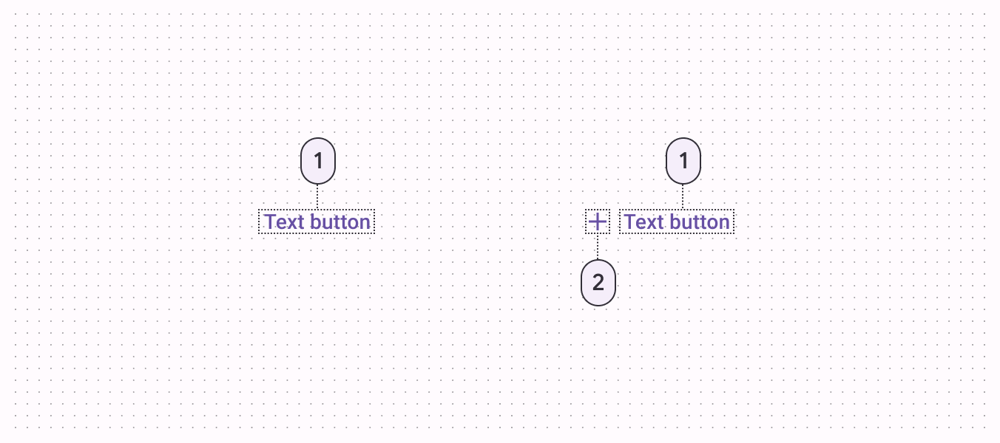
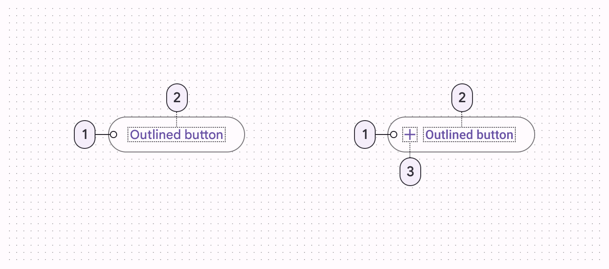

<!--docs:
title: "Buttons"
layout: detail
section: components
excerpt: "A customizable button component with updated visual styles."
iconId: materialbutton
path: /catalog/buttons/
-->

# Buttons

[Buttons](https://material.io/components/buttons/) allow users to take actions,
and make choices, with a single tap.


**Contents**

*   [Using buttons](#using-buttons)
*   [Text button](#text-button)
*   [Outlined button](#outlined-button)
*   [Contained button](#contained-button)
*   [Toggle button](#toggle-button)
*   [Theming](#theming-buttons)

## Using buttons

Before you can use Material buttons, you need to add a dependency to the
Material Components for Android library. For more information, go to the
[Getting started](https://github.com/material-components/material-components-android/tree/master/docs/getting-started.md)
page.

_**Note:** `<Button>` is auto-inflated as
`<com.google.android.material.button.MaterialButton>` via
`MaterialComponentsViewInflater` when using a non-Bridge
`Theme.MaterialComponents.*` theme._

### Making buttons accessible

Buttons support content labeling for accessibility and are readable by most
screen readers, such as TalkBack. Text rendered in buttons is automatically
provided to accessibility services. Additional content labels are usually
unnecessary.

For more information on content labels, go to the
[Android accessibility help guide](https://support.google.com/accessibility/android/answer/7158690).

## Types

There are four types of buttons: 1\. [Text button](#text-button), 2\.
[Outlined button](#outlined-button), 3\. [Contained button](#contained-button),
4\. [Toggle button](#toggle-button)


## Text button

[Text buttons](https://material.io/components/buttons/#text-button) are
typically used for less-pronounced actions, including those located in dialogs
and cards. In cards, text buttons help maintain an emphasis on card content.

### Text button examples

API and source code:

*   `MaterialButton`
    *   [Class description](https://developer.android.com/reference/com/google/android/material/button/MaterialButton)
    *   [Class source](https://github.com/material-components/material-components-android/tree/master/lib/java/com/google/android/material/button/MaterialButton.java)

The following example shows a text button with a text label.


In the layout:

```xml
<Button
    android:id="@+id/textButton"
    android:layout_width="wrap_content"
    android:layout_height="wrap_content"
    android:text="Text button"
    style="@style/Widget.MaterialComponents.Button.TextButton"
/>
```

In code:

```kt
textButton.setOnClickListener {
    // Respond to button press
}
```

#### Adding an icon to a text button

The following example shows a text button with an icon.


In the layout:

```xml
<Button
    ...
    app:icon="@drawable/ic_add_24dp"
    style="@style/Widget.MaterialComponents.Button.TextButton.Icon"
/>
```

### Anatomy and key properties

A text button has a text label, a transparent container and an optional icon.



1.  Text label
2.  Icon

#### Text label attributes

&nbsp;         | Attribute                | Related method(s)                 | Default value
-------------- | ------------------------ | --------------------------------- | -------------
**Text label** | `android:text`           | `setText`<br/>`getText`           | `null`
**Color**      | `android:textColor`      | `setTextColor`<br/>`getTextColor` | `?attr/colorPrimary` (see all [states](https://github.com/material-components/material-components-android/tree/master/lib/java/com/google/android/material/button/res/color/mtrl_text_btn_text_color_selector.xml))
**Typography** | `android:textAppearance` | `setTextAppearance`               | `?attr/textAppearanceButton`

#### Container attributes

&nbsp;           | Attribute             | Related method(s)                                                            | Default value
---------------- | --------------------- | ---------------------------------------------------------------------------- | -------------
**Color**        | `app:backgroundTint`  | `setBackgroundColor`<br/>`setBackgroundTintList`<br/>`getBackgroundTintList` | `@android:color/transparent` (see all [states](https://github.com/material-components/material-components-android/tree/master/lib/java/com/google/android/material/button/res/color/mtrl_btn_text_btn_bg_color_selector.xml))
**Stroke color** | `app:strokeColor`     | `setStrokeColor`<br/>`setStrokeColorResource`<br/>`getStrokeColor`           | `null`
**Stroke width** | `app:strokeWidth`     | `setStrokeWidth`<br/>`setStrokeWidthResource`<br/>`getStrokeWidth`           | `0dp`
**Shape**        | `app:shapeAppearance` | `setShapeAppearanceModel`<br/>`getShapeAppearanceModel`                      | `?attr/shapeAppearanceSmallComponent`
**Elevation**    | `app:elevation`       | `setElevation`<br/>`getElevation`                                            | `0dp`
**Ripple color** | `app:rippleColor`     | `setRippleColor`<br/>`setRippleColorResource`<br/>`getRippleColor`           | `?attr/colorPrimary` at 12% opacity (see all [states](https://github.com/material-components/material-components-android/tree/master/lib/java/com/google/android/material/button/res/color/mtrl_btn_text_btn_ripple_color.xml))

#### Icon attributes

&nbsp;                                          | Attribute         | Related method(s)                                         | Default value
----------------------------------------------- | ----------------- | --------------------------------------------------------- | -------------
**Icon**                                        | `app:icon`        | `setIcon`<br/>`setIconResource`<br/>`getIcon`             | `null`
**Color**                                       | `app:iconTint`    | `setIconTint`<br/>`setIconTintResource`<br/>`getIconTint` | `?attr/colorPrimary` (see all [states](https://github.com/material-components/material-components-android/tree/master/lib/java/com/google/android/material/button/res/color/mtrl_text_btn_text_color_selector.xml))
**Size**                                        | `app:iconSize`    | `setIconSize`<br/>`getIconSize`                           | `wrap_content`
**Gravity** (position relative to text label)   | `app:iconGravity` | `setIconGravity`<br/>`getIconGravity`                     | `start`
**Padding** (space between icon and text label) | `app:iconPadding` | `setIconPadding`<br/>`getIconPadding`                     | `4dp`

#### Styles

&nbsp;            | Style
----------------- | --------------------------------------------------
**Default style** | `Widget.MaterialComponents.Button.TextButton`
**Icon style**    | `Widget.MaterialComponents.Button.TextButton.Icon`

Default style theme attribute: `?attr/borderlessButtonStyle`

See the full list of
[styles](https://github.com/material-components/material-components-android/tree/master/lib/java/com/google/android/material/button/res/values/styles.xml)
and
[attrs](https://github.com/material-components/material-components-android/tree/master/lib/java/com/google/android/material/button/res/values/attrs.xml).

## Outlined button

[Outlined buttons](https://material.io/components/buttons/#outlined-button) are
medium-emphasis buttons. They contain actions that are important, but aren’t the
primary action in an app.

### Outlined button examples

API and source code:

*   `MaterialButton`
    *   [Class description](https://developer.android.com/reference/com/google/android/material/button/MaterialButton)
    *   [Class source](https://github.com/material-components/material-components-android/tree/master/lib/java/com/google/android/material/button/MaterialButton.java)

The following example shows an outlined button with a text label and stroked
container.


In the layout:

```xml
<Button
    android:id="@+id/outlinedButton"
    android:layout_width="wrap_content"
    android:layout_height="wrap_content"
    android:text="Outlined button"
    style="?attr/materialButtonOutlinedStyle"
/>
```

In code:

```kt
outlinedButton.setOnClickListener {
    // Respond to button press
}
```

#### Adding an icon to an outlined button

The following example shows an outlined button with an icon.


In the layout:

```xml
<Button
    ...
    app:icon="@drawable/ic_add_24dp"
    style="@style/Widget.MaterialComponents.Button.OutlinedButton.Icon"
/>
```

### Anatomy and key properties

An outlined button has a text label, a stroked container and an optional icon.



1.  Text label
2.  Container
3.  Icon

#### Text label attributes

&nbsp;         | Attribute                | Related method(s)                 | Default value
-------------- | ------------------------ | --------------------------------- | -------------
**Text label** | `android:text`           | `setText`<br/>`getText`           | `null`
**Color**      | `android:textColor`      | `setTextColor`<br/>`getTextColor` | `?attr/colorPrimary` (see all [states](https://github.com/material-components/material-components-android/tree/master/lib/java/com/google/android/material/button/res/color/mtrl_text_btn_text_color_selector.xml))
**Typography** | `android:textAppearance` | `setTextAppearance`               | `?attr/textAppearanceButton`

#### Container attributes

&nbsp;           | Attribute             | Related method(s)                                                            | Default value
---------------- | --------------------- | ---------------------------------------------------------------------------- | -------------
**Color**        | `app:backgroundTint`  | `setBackgroundColor`<br/>`setBackgroundTintList`<br/>`getBackgroundTintList` | `@android:color/transparent` (see all [states](https://github.com/material-components/material-components-android/tree/master/lib/java/com/google/android/material/button/res/color/mtrl_btn_text_btn_bg_color_selector.xml))
**Stroke color** | `app:strokeColor`     | `setStrokeColor`<br/>`setStrokeColorResource`<br/>`getStrokeColor`           | `?attr/colorOnSurface` at 12% opacity (see all [states](https://github.com/material-components/material-components-android/tree/master/lib/java/com/google/android/material/button/res/color/mtrl_btn_stroke_color_selector.xml))
**Stroke width** | `app:strokeWidth`     | `setStrokeWidth`<br/>`setStrokeWidthResource`<br/>`getStrokeWidth`           | `1dp`
**Shape**        | `app:shapeAppearance` | `setShapeAppearanceModel`<br/>`getShapeAppearanceModel`                      | `?attr/shapeAppearanceSmallComponent`
**Elevation**    | `app:elevation`       | `setElevation`<br/>`getElevation`                                            | `0dp`
**Ripple color** | `app:rippleColor`     | `setRippleColor`<br/>`setRippleColorResource`<br/>`getRippleColor`           | `?attr/colorPrimary` at 12% opacity (see all [states](https://github.com/material-components/material-components-android/tree/master/lib/java/com/google/android/material/button/res/color/mtrl_btn_text_btn_ripple_color.xml))

#### Icon attributes

&nbsp;                                          | Attribute         | Related method(s)                                         | Default value
----------------------------------------------- | ----------------- | --------------------------------------------------------- | -------------
**Icon**                                        | `app:icon`        | `setIcon`<br/>`setIconResource`<br/>`getIcon`             | `null`
**Color**                                       | `app:iconTint`    | `setIconTint`<br/>`setIconTintResource`<br/>`getIconTint` | `?attr/colorPrimary` (see all [states](https://github.com/material-components/material-components-android/tree/master/lib/java/com/google/android/material/button/res/color/mtrl_text_btn_text_color_selector.xml))
**Size**                                        | `app:iconSize`    | `setIconSize`<br/>`getIconSize`                           | `wrap_content`
**Gravity** (position relative to text label)   | `app:iconGravity` | `setIconGravity`<br/>`getIconGravity`                     | `start`
**Padding** (space between icon and text label) | `app:iconPadding` | `setIconPadding`<br/>`getIconPadding`                     | `4dp`

#### Styles

&nbsp;            | Style
----------------- | ------------------------------------------------------
**Default style** | `Widget.MaterialComponents.Button.OutlinedButton`
**Icon style**    | `Widget.MaterialComponents.Button.OutlinedButton.Icon`

Default style theme attribute: `?attr/materialButtonOutlinedStyle`

See the full list of
[styles](https://github.com/material-components/material-components-android/tree/master/lib/java/com/google/android/material/button/res/values/styles.xml)
and
[attrs](https://github.com/material-components/material-components-android/tree/master/lib/java/com/google/android/material/button/res/values/attrs.xml).

## Contained button

[Contained buttons](https://material.io/components/buttons/#contained-button)
are high-emphasis, distinguished by their use of elevation and fill. They
contain actions that are primary to your app.

_**Note** The contained button is the default style if the style is not set._

### Contained button examples

API and source code:

*   `MaterialButton`
    *   [Class description](https://developer.android.com/reference/com/google/android/material/button/MaterialButton)
    *   [Class source](https://github.com/material-components/material-components-android/tree/master/lib/java/com/google/android/material/button/MaterialButton.java)

The following example shows a contained button with a text label and a filled
container.


In the layout:

```xml
<Button
    android:id="@+id/containedButton"
    android:layout_width="wrap_content"
    android:layout_height="wrap_content"
    android:text="Contained button"
/>
```

_**Note:** Since this is the default type, you don't need to specify a style tag
as long as you are using a Material Components Theme. If not, set the style to
`@style/Widget.MaterialComponents.Button`._

In code:

```kt
containedButton.setOnClickListener {
    // Respond to button press
}
```

#### Adding an icon to a contained button

The following example shows a contained button with an icon.


In the layout:

```xml
<Button
    ...
    app:icon="@drawable/ic_add_24dp"
    style="@style/Widget.MaterialComponents.Button.Icon"
/>
```

### Anatomy and key properties

A contained button has a text label, a filled container and an optional icon.


1.  Text label
2.  Container
3.  Icon

#### Text label attributes

&nbsp;         | Attribute                | Related method(s)                 | Default value
-------------- | ------------------------ | --------------------------------- | -------------
**Text label** | `android:text`           | `setText`<br/>`getText`           | `null`
**Color**      | `android:textColor`      | `setTextColor`<br/>`getTextColor` | `?attr/colorOnPrimary` (see all [states](https://github.com/material-components/material-components-android/tree/master/lib/java/com/google/android/material/button/res/color/mtrl_btn_text_color_selector.xml))
**Typography** | `android:textAppearance` | `setTextAppearance`               | `?attr/textAppearanceButton`

#### Container attributes

&nbsp;           | Attribute             | Related method(s)                                                            | Default value
---------------- | --------------------- | ---------------------------------------------------------------------------- | -------------
**Color**        | `app:backgroundTint`  | `setBackgroundColor`<br/>`setBackgroundTintList`<br/>`getBackgroundTintList` | `?attr/colorPrimary` (see all [states](https://github.com/material-components/material-components-android/tree/master/lib/java/com/google/android/material/button/res/color/mtrl_btn_bg_color_selector.xml))
**Stroke color** | `app:strokeColor`     | `setStrokeColor`<br/>`setStrokeColorResource`<br/>`getStrokeColor`           | `null`
**Stroke width** | `app:strokeWidth`     | `setStrokeWidth`<br/>`setStrokeWidthResource`<br/>`getStrokeWidth`           | `0dp`
**Shape**        | `app:shapeAppearance` | `setShapeAppearanceModel`<br/>`getShapeAppearanceModel`                      | `?attr/shapeAppearanceSmallComponent`
**Elevation**    | `app:elevation`       | `setElevation`<br/>`getElevation`                                            | `2dp`
**Ripple color** | `app:rippleColor`     | `setRippleColor`<br/>`setRippleColorResource`<br/>`getRippleColor`           | `?attr/colorOnPrimary` at 24% opacity (see all [states](https://github.com/material-components/material-components-android/tree/master/lib/java/com/google/android/material/button/res/color/mtrl_btn_ripple_color.xml))

#### Icon attributes

&nbsp;                                          | Attribute         | Related method(s)                                         | Default value
----------------------------------------------- | ----------------- | --------------------------------------------------------- | -------------
**Icon**                                        | `app:icon`        | `setIcon`<br/>`setIconResource`<br/>`getIcon`             | `null`
**Color**                                       | `app:iconTint`    | `setIconTint`<br/>`setIconTintResource`<br/>`getIconTint` | `?attr/colorOnPrimary` (see all [states](https://github.com/material-components/material-components-android/tree/master/lib/java/com/google/android/material/button/res/color/mtrl_btn_text_color_selector.xml))
**Size**                                        | `app:iconSize`    | `setIconSize`<br/>`getIconSize`                           | `wrap_content`
**Gravity** (position relative to text label)   | `app:iconGravity` | `setIconGravity`<br/>`getIconGravity`                     | `start`
**Padding** (space between icon and text label) | `app:iconPadding` | `setIconPadding`<br/>`getIconPadding`                     | `4dp`

#### Styles

&nbsp;                    | Style
------------------------- | -------------------------------------------------------
**Default style**         | `Widget.MaterialComponents.Button`
**Icon style**            | `Widget.MaterialComponents.Button.Icon`
**Unelevated style**      | `Widget.MaterialComponents.Button.UnelevatedButton`
**Unelevated icon style** | `Widget.MaterialComponents.Button.UnelevatedButton.Icon`

Default style theme attribute: `?attr/materialButtonStyle`

See the full list of
[styles](https://github.com/material-components/material-components-android/tree/master/lib/java/com/google/android/material/button/res/values/styles.xml)
and
[attrs](https://github.com/material-components/material-components-android/tree/master/lib/java/com/google/android/material/button/res/values/attrs.xml).

## Toggle button

[Toggle buttons](https://material.io/components/buttons/#toggle-button) can be
used to select from a group of choices.

There are two types of toggle buttons:

*   [Toggle button](#toggle-button)
*   [Icon](#icon)

### Toggle button

To emphasize groups of related toggle buttons, a group should share a common
container.

#### Toggle button examples

API and source code:

*   `MaterialButtonToggleGroup`
    *   [Class description](https://developer.android.com/reference/com/google/android/material/button/MaterialButtonToggleGroup)
    *   [Class source](https://github.com/material-components/material-components-android/tree/master/lib/java/com/google/android/material/button/MaterialButtonToggleGroup.java)
*   `MaterialButton`
    *   [Class description](https://developer.android.com/reference/com/google/android/material/button/MaterialButton)
    *   [Class source](https://github.com/material-components/material-components-android/tree/master/lib/java/com/google/android/material/button/MaterialButton.java)

The following example shows a toggle button with three buttons that have text
labels.


In the layout:

```xml
<com.google.android.material.button.MaterialButtonToggleGroup
    android:id="@+id/toggleButton"
    android:layout_width="wrap_content"
    android:layout_height="wrap_content">
    <Button
        android:id="@+id/button1"
        android:layout_width="wrap_content"
        android:layout_height="wrap_content"
        android:text="Button 1"
        style="?attr/materialButtonOutlinedStyle"
    />
    <Button
        android:id="@+id/button2"
        android:layout_width="wrap_content"
        android:layout_height="wrap_content"
        android:text="Button 2"
        style="?attr/materialButtonOutlinedStyle"
    />
    <Button
        android:id="@+id/button3"
        android:layout_width="wrap_content"
        android:layout_height="wrap_content"
        android:text="Button 3"
        style="?attr/materialButtonOutlinedStyle"
    />
</com.google.android.material.button.MaterialButtonToggleGroup>
```

In code:

```kt
toggleButton.addOnButtonCheckedListener { toggleButton, checkedId, isChecked ->
    // Respond to button selection
}
```

#### Implementing an icon-only toggle button

The following example shows a toggle button with three buttons that have icons.


In `res/values/styles.xml`:

```xml
<style name="Widget.App.Button.OutlinedButton.IconOnly" parent="Widget.MaterialComponents.Button.OutlinedButton">
    <item name="iconPadding">0dp</item>
    <item name="android:insetTop">0dp</item>
    <item name="android:insetBottom">0dp</item>
    <item name="android:paddingLeft">12dp</item>
    <item name="android:paddingRight">12dp</item>
    <item name="android:minWidth">48dp</item>
    <item name="android:minHeight">48dp</item>
</style>
```

In the layout:

```xml
<com.google.android.material.button.MaterialButtonToggleGroup
    ...>
    <Button
        ...
        app:icon="@drawable/ic_favorite_24dp"
        style="@style/Widget.App.Button.OutlinedButton.IconOnly"
    />
    <Button
        ...
        app:icon="@drawable/ic_remove_red_eye_24dp"
        style="@style/Widget.App.Button.OutlinedButton.IconOnly"
    />
    <Button
        ...
        app:icon="@drawable/ic_notifications_24dp"
        style="@style/Widget.App.Button.OutlinedButton.IconOnly"
    />
</com.google.android.material.button.MaterialButtonToggleGroup>
```

### Anatomy and key properties

A toggle button has a shared stroked container, icons and/or text labels.


1.  Container
2.  Icon

#### Selection attributes

&nbsp;                 | Attribute               | Related method(s)                                | Default value
---------------------- | ----------------------- | ------------------------------------------------ | -------------
**Single selection**   | `app:singleSelection`   | `setSingleSelection`<br/>`isSingleSelection`     | `false`
**Selection required** | `app:selectionRequired` | `setSelectionRequired`<br/>`isSelectionRequired` | `false`

#### Styles

&nbsp;            | Style
----------------- | -----------------------------------------------------
**Default style** | `Widget.MaterialComponents.MaterialButtonToggleGroup`

Default style theme attribute: `?attr/materialButtonToggleGroupStyle`

See the full list of
[styles](https://github.com/material-components/material-components-android/tree/master/lib/java/com/google/android/material/button/res/values/styles.xml)
and
[attrs](https://github.com/material-components/material-components-android/tree/master/lib/java/com/google/android/material/button/res/values/attrs.xml).

### Icon

Icons can be used as toggle buttons when they allow selection, or deselection,
of a single choice, such as marking an item as a favorite.

#### Icon example

API and source code:

*   `CheckBox`
    *   [Class description](https://developer.android.com/reference/android/widget/CheckBox)

_**Note** The `CheckBox` API is just one of several inputs that can implement
the icon button. See other
[selection controls](https://material.io/components/selection-controls/) for
more details._

The following example shows an icon that can be used independently or in items
of a `RecyclerView`.


In the layout:

```xml
<CheckBox
    android:id="@+id/icon"
    android:layout_width="wrap_content"
    android:layout_height="wrap_content"
    android:button="@drawable/sl_favourite_24dp"
    app:buttonTint="@android:color/white"
/>
```

In `res/drawable/sl_favourite_24dp.xml`:

```xml
<selector>
    <item
        android:drawable="@drawable/ic_favourite_outlined_24dp"
        android:state_checked="false"
    />
    <item
        android:drawable="@drawable/ic_favourite_filled_24dp"
        android:state_checked="true"
    />
    <item android:drawable="@drawable/ic_favourite_outlined_24dp" />
</selector>
```

In code:

```kt
icon.setOnCheckedChangeListener { checkBox, isChecked ->
    // Respond to icon toggle
}
```

## Theming buttons

Buttons support
[Material Theming](https://material.io/components/buttons/#theming) and can be
customized in terms of color, typography and shape.

### Button theming example

API and source code:

*   `MaterialButton`
    *   [Class description](https://developer.android.com/reference/com/google/android/material/button/MaterialButton)
    *   [Class source](https://github.com/material-components/material-components-android/tree/master/lib/java/com/google/android/material/button/MaterialButton.java)

The following example shows text, outlined and contained button types with
Material Theming.


#### Implementing button theming

Using theme attributes and styles in `res/values/styles.xml` (themes all buttons
and affects other components):

```xml
<style name="Theme.App" parent="Theme.MaterialComponents.*">
    ...
    <item name="colorPrimary">@color/shrine_pink_100</item>
    <item name="colorOnPrimary">@color/shrine_pink_900</item>
    <item name="textAppearanceButton">@style/TextAppearance.App.Button</item>
    <item name="shapeAppearanceSmallComponent">@style/ShapeAppearance.App.SmallComponent</item>
</style>

<style name="TextAppearance.App.Button" parent="TextAppearance.MaterialComponents.Button">
    <item name="fontFamily">@font/rubik</item>
    <item name="android:fontFamily">@font/rubik</item>
</style>

<style name="ShapeAppearance.App.SmallComponent" parent="ShapeAppearance.MaterialComponents.SmallComponent">
    <item name="cornerFamily">cut</item>
    <item name="cornerSize">4dp</item>
</style>
```

or using default style theme attributes, styles and theme overlays (themes all
buttons but does not affect other components):

```xml
<style name="Theme.App" parent="Theme.MaterialComponents.*">
    ...
    <item name="borderlessButtonStyle">@style/Widget.App.Button.TextButton</item>
    <item name="materialButtonOutlinedStyle">@style/Widget.App.Button.OutlinedButton</item>
    <item name="materialButtonStyle">@style/Widget.App.Button</item>
</style>

<style name="Widget.App.Button.TextButton" parent="Widget.MaterialComponents.Button.TextButton">
    <item name="materialThemeOverlay">@style/ThemeOverlay.App.Button.TextButton</item>
    <item name="android:textAppearance">@style/TextAppearance.App.Button</item>
    <item name="shapeAppearance">@style/ShapeAppearance.App.SmallComponent</item>
</style>

<style name="Widget.App.Button.OutlinedButton" parent="Widget.MaterialComponents.Button.OutlinedButton">
    <item name="materialThemeOverlay">@style/ThemeOverlay.App.Button.TextButton</item>
    <item name="android:textAppearance">@style/TextAppearance.App.Button</item>
    <item name="shapeAppearance">@style/ShapeAppearance.App.SmallComponent</item>
</style>

<style name="Widget.App.Button" parent="Widget.MaterialComponents.Button">
    <item name="materialThemeOverlay">@style/ThemeOverlay.App.Button</item>
    <item name="android:textAppearance">@style/TextAppearance.App.Button</item>
    <item name="shapeAppearance">@style/ShapeAppearance.App.SmallComponent</item>
</style>

<style name="ThemeOverlay.App.Button.TextButton" parent="">
    <item name="colorPrimary">@color/shrine_pink_900</item>
</style>

<style name="ThemeOverlay.App.Button" parent="">
    <item name="colorPrimary">@color/shrine_pink_100</item>
    <item name="colorOnPrimary">@color/shrine_pink_900</item>
</style>
```

or using one of the styles in the layout (affects only this button):

```xml
<Button
    ...
    style="@style/Widget.App.Button"
/>
```
