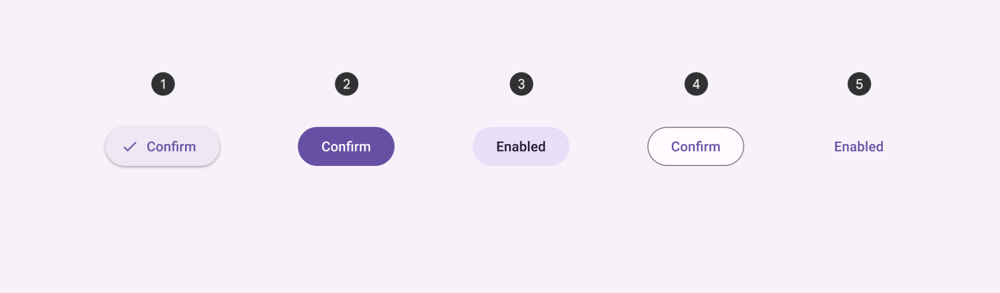
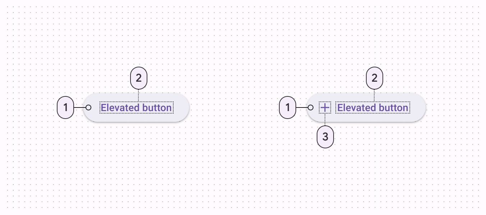

<!--docs:
title: "Buttons"
layout: detail
section: components
excerpt: "A customizable button component with updated visual styles."
iconId: materialbutton
path: /catalog/buttons/
-->

# Buttons

[Buttons](https://material.io/components/buttons/) allow users to take actions,
and make choices, with a single tap.



**Contents**

*   [Design & API Documentation](#design-api-documentation)
*   [Using buttons](#using-buttons)
*   [Elevated button](#elevated-button)
*   [Filled button](#filled-button)
*   [Filled tonal button](#filled-tonal-button)
*   [Outlined button](#outlined-button)
*   [Text button](#text-button)
*   [Toggle button](#toggle-button)
*   [Icon button](#icon-button)
*   [Theming](#theming-buttons)

## Design & API Documentation

*   [Google Material3 Spec](https://material.io/components/buttons/overview)
*   [API Reference](https://developer.android.com/reference/com/google/android/material/button/package-summary)

## Using buttons

Before you can use Material buttons, you need to add a dependency to the
Material Components for Android library. For more information, go to the
[Getting started](https://github.com/material-components/material-components-android/tree/master/docs/getting-started.md)
page.

**Note:** `<Button>` is auto-inflated as
`<com.google.android.material.button.MaterialButton>` via
`MaterialComponentsViewInflater` when using a `Theme.Material3.*` theme.

### Making buttons accessible

Buttons support content labeling for accessibility and are readable by most
screen readers, such as TalkBack. Text rendered in buttons is automatically
provided to accessibility services. Additional content labels are usually
unnecessary.

For more information on content labels, go to the
[Android accessibility help guide](https://support.google.com/accessibility/android/answer/7158690).

### Types

There are five types of common buttons: 1\. [Elevated button](#elevated-button),
2\. [Filled button](#filled-button), 3\.
[Filled tonal button](#filled-tonal-button), 4\.
[Outlined button](#outlined-button), 5\. [Text button](#text-button).

[Toggle button](#toggle-button) is an additional pattern using a segmented
container or icon.


## Elevated button

[Elevated buttons](https://material.io/components/buttons/#elevated-button) are
essentially outlined buttons with a shadow. To prevent shadow creep, only use
them when absolutely necessary, such as when the button requires visual
separation from a patterned background.

### Elevated button examples

API and source code:

*   `MaterialButton`
    *   [Class description](https://developer.android.com/reference/com/google/android/material/button/MaterialButton)
    *   [Class source](https://github.com/material-components/material-components-android/tree/master/lib/java/com/google/android/material/button/MaterialButton.java)

The following example shows an elevated button with a text label.


In the layout:

```xml
<Button
    style="@style/Widget.Material3.Button.ElevatedButton"
    android:id="@+id/elevatedButton"
    android:layout_width="wrap_content"
    android:layout_height="wrap_content"
    android:text="Elevated button"
/>
```

In code:

```kt
elevatedButton.setOnClickListener {
    // Respond to button press
}
```

#### Adding an icon to an elevated button

The following example shows an elevated button with an icon.


In the layout:

```xml
<Button
    style="@style/Widget.Material3.Button.ElevatedButton.Icon"
    ...
    app:icon="@drawable/ic_add_24dp"
/>
```

### Anatomy and key properties

An elevated button has a text label, a stroked container and an optional icon.



1.  Container
2.  Label text
3.  Icon

#### Text label attributes

Element        | Attribute                | Related method(s)                 | Default value
-------------- | ------------------------ | --------------------------------- | -------------
**Text label** | `android:text`           | `setText`<br/>`getText`           | `null`
**Color**      | `android:textColor`      | `setTextColor`<br/>`getTextColor` | `?attr/colorOnSurface` (see all [states](https://github.com/material-components/material-components-android/tree/master/lib/java/com/google/android/material/button/res/color/m3_text_button_foreground_color_selector.xml))
**Typography** | `android:textAppearance` | `setTextAppearance`               | `?attr/textAppearanceLabelLarge`

#### Container attributes

Element          | Attribute             | Related method(s)                                                            | Default value
---------------- | --------------------- | ---------------------------------------------------------------------------- | -------------
**Color**        | `app:backgroundTint`  | `setBackgroundColor`<br/>`setBackgroundTintList`<br/>`getBackgroundTintList` | `?attr/colorSurfaceContainerLow` (see all [states](https://github.com/material-components/material-components-android/tree/master/lib/java/com/google/android/material/button/res/color/m3_text_button_background_color_selector.xml))
**Stroke color** | `app:strokeColor`     | `setStrokeColor`<br/>`setStrokeColorResource`<br/>`getStrokeColor`           | `null`
**Stroke width** | `app:strokeWidth`     | `setStrokeWidth`<br/>`setStrokeWidthResource`<br/>`getStrokeWidth`           | `0dp`
**Shape**        | `app:shapeAppearance` | `setShapeAppearanceModel`<br/>`getShapeAppearanceModel`                      | `?attr/shapeAppearanceSmallComponent`
**Elevation**    | `app:elevation`       | `setElevation`<br/>`getElevation`                                            | `1dp`
**Ripple color** | `app:rippleColor`     | `setRippleColor`<br/>`setRippleColorResource`<br/>`getRippleColor`           | `?attr/colorOnSurface` at 16% opacity (see all [states](https://github.com/material-components/material-components-android/tree/master/lib/java/com/google/android/material/button/res/color/m3_text_button_ripple_color_selector.xml))

#### Icon attributes

Element                                         | Attribute         | Related method(s)                                         | Default value
----------------------------------------------- | ----------------- | --------------------------------------------------------- | -------------
**Icon**                                        | `app:icon`        | `setIcon`<br/>`setIconResource`<br/>`getIcon`             | `null`
**Color**                                       | `app:iconTint`    | `setIconTint`<br/>`setIconTintResource`<br/>`getIconTint` | `?attr/colorOnSurface` (see all [states](https://github.com/material-components/material-components-android/tree/master/lib/java/com/google/android/material/button/res/color/m3_text_button_foreground_color_selector.xml))
**Size**                                        | `app:iconSize`    | `setIconSize`<br/>`getIconSize`                           | `wrap_content`
**Gravity** (position relative to text label)   | `app:iconGravity` | `setIconGravity`<br/>`getIconGravity`                     | `start`
**Padding** (space between icon and text label) | `app:iconPadding` | `setIconPadding`<br/>`getIconPadding`                     | `8dp`

#### Styles

Element           | Style
----------------- | ---------------------------------------------
**Default style** | `Widget.Material3.Button.ElevatedButton`
**Icon style**    | `Widget.Material3.Button.ElevatedButton.Icon`

See the full list of
[styles](https://github.com/material-components/material-components-android/tree/master/lib/java/com/google/android/material/button/res/values/styles.xml)
and
[attrs](https://github.com/material-components/material-components-android/tree/master/lib/java/com/google/android/material/button/res/values/attrs.xml).

## Filled button

[Filled button's](https://material.io/components/buttons/#filled-button)
contrasting surface color makes it the most prominent button after the FAB. It’s
used for final or unblocking actions in a flow.

**Note** The filled button is the default style if the style is not set.

### Filled button examples

API and source code:

*   `MaterialButton`
    *   [Class description](https://developer.android.com/reference/com/google/android/material/button/MaterialButton)
    *   [Class source](https://github.com/material-components/material-components-android/tree/master/lib/java/com/google/android/material/button/MaterialButton.java)

The following example shows a filled button with a text label and a filled
container.


In the layout:

```xml
<Button
    android:id="@+id/filledButton"
    android:layout_width="wrap_content"
    android:layout_height="wrap_content"
    android:text="Filled button"
/>
```

**Note:** Since this is the default type, you don't need to specify a style tag
as long as you are using a Material Components Theme. If not, set the style to
`@style/Widget.Material3.Button`.

In code:

```kt
filledButton.setOnClickListener {
    // Respond to button press
}
```

#### Adding an icon to a filled button

The following example shows a filled button with an icon.


In the layout:

```xml
<Button
    style="@style/Widget.Material3.Button.Icon"
    ...
    app:icon="@drawable/ic_add_24dp"
/>
```

### Anatomy and key properties

A filled button has a text label, a filled container and an optional icon.


1.  Container
2.  Label text
3.  Icon

#### Text label attributes

Element        | Attribute                | Related method(s)                 | Default value
-------------- | ------------------------ | --------------------------------- | -------------
**Text label** | `android:text`           | `setText`<br/>`getText`           | `null`
**Color**      | `android:textColor`      | `setTextColor`<br/>`getTextColor` | `?attr/colorOnPrimary` (see all [states](https://github.com/material-components/material-components-android/tree/master/lib/java/com/google/android/material/color/res/color/m3_button_foreground_color_selector.xml))
**Typography** | `android:textAppearance` | `setTextAppearance`               | `?attr/textAppearanceLabelLarge`

#### Container attributes

Element          | Attribute             | Related method(s)                                                            | Default value
---------------- | --------------------- | ---------------------------------------------------------------------------- | -------------
**Color**        | `app:backgroundTint`  | `setBackgroundColor`<br/>`setBackgroundTintList`<br/>`getBackgroundTintList` | `?attr/colorPrimary` (see all [states](https://github.com/material-components/material-components-android/tree/master/lib/java/com/google/android/material/color/res/color/m3_button_background_color_selector.xml))
**Stroke color** | `app:strokeColor`     | `setStrokeColor`<br/>`setStrokeColorResource`<br/>`getStrokeColor`           | `null`
**Stroke width** | `app:strokeWidth`     | `setStrokeWidth`<br/>`setStrokeWidthResource`<br/>`getStrokeWidth`           | `0dp`
**Shape**        | `app:shapeAppearance` | `setShapeAppearanceModel`<br/>`getShapeAppearanceModel`                      | `?attr/shapeAppearanceSmallComponent`
**Elevation**    | `app:elevation`       | `setElevation`<br/>`getElevation`                                            | `2dp`
**Ripple color** | `app:rippleColor`     | `setRippleColor`<br/>`setRippleColorResource`<br/>`getRippleColor`           | `?attr/colorOnPrimary` at 16% opacity (see all [states](https://github.com/material-components/material-components-android/tree/master/lib/java/com/google/android/material/color/res/color/m3_button_ripple_color_selector.xml))

#### Icon attributes

Element                                         | Attribute         | Related method(s)                                         | Default value
----------------------------------------------- | ----------------- | --------------------------------------------------------- | -------------
**Icon**                                        | `app:icon`        | `setIcon`<br/>`setIconResource`<br/>`getIcon`             | `null`
**Color**                                       | `app:iconTint`    | `setIconTint`<br/>`setIconTintResource`<br/>`getIconTint` | `?attr/colorOnPrimary` (see all [states](https://github.com/material-components/material-components-android/tree/master/lib/java/com/google/android/material/color/res/color/m3_button_foreground_color_selector.xml))
**Size**                                        | `app:iconSize`    | `setIconSize`<br/>`getIconSize`                           | `wrap_content`
**Gravity** (position relative to text label)   | `app:iconGravity` | `setIconGravity`<br/>`getIconGravity`                     | `start`
**Padding** (space between icon and text label) | `app:iconPadding` | `setIconPadding`<br/>`getIconPadding`                     | `8dp`

#### Styles

Element                   | Style
------------------------- | -----------------------------------------------
**Default style**         | `Widget.Material3.Button`
**Icon style**            | `Widget.Material3.Button.Icon`
**Unelevated style**      | `Widget.Material3.Button.UnelevatedButton`
**Unelevated icon style** | `Widget.Material3.Button.UnelevatedButton.Icon`

Default style theme attribute: `?attr/materialButtonStyle`

See the full list of
[styles](https://github.com/material-components/material-components-android/tree/master/lib/java/com/google/android/material/button/res/values/styles.xml)
and
[attrs](https://github.com/material-components/material-components-android/tree/master/lib/java/com/google/android/material/button/res/values/attrs.xml).

## Filled tonal button

[Filled tonal buttons](https://material.io/components/buttons/#filled-tonal-button)
have a lighter background color and darker label color, making them less
visually prominent than a regular filled button. They’re still used for final or
unblocking actions in a flow, but may be better when these actions don’t require
quite so much emphasis.

### Filled tonal button examples

API and source code:

*   `MaterialButton`
    *   [Class description](https://developer.android.com/reference/com/google/android/material/button/MaterialButton)
    *   [Class source](https://github.com/material-components/material-components-android/tree/master/lib/java/com/google/android/material/button/MaterialButton.java)

The following example shows a filled tonal button with a text label and a filled
container.


In the layout:

```xml
<Button
    style="@style/Widget.Material3.Button.TonalButton"
    android:id="@+id/filledTonalButton"
    android:layout_width="wrap_content"
    android:layout_height="wrap_content"
    android:text="Filled tonal button"
/>
```

In code:

```kt
filledTonalButton.setOnClickListener {
    // Respond to button press
}
```

#### Adding an icon to a filled tonal button

The following example shows a filled tonal button with an icon.


In the layout:

```xml
<Button
    style="@style/Widget.Material3.Button.TonalButton.Icon"
    ...
    app:icon="@drawable/ic_add_24dp"
/>
```

### Anatomy and key properties

A filled tonal button has a text label, a filled container and an optional icon.


1.  Container
2.  Label text
3.  Icon

#### Text label attributes

Element        | Attribute                | Related method(s)                 | Default value
-------------- | ------------------------ | --------------------------------- | -------------
**Text label** | `android:text`           | `setText`<br/>`getText`           | `null`
**Color**      | `android:textColor`      | `setTextColor`<br/>`getTextColor` | `?attr/colorOnSecondaryContainer` (see all [states](https://github.com/material-components/material-components-android/tree/master/lib/java/com/google/android/material/color/res/color/m3_button_foreground_color_selector.xml))
**Typography** | `android:textAppearance` | `setTextAppearance`               | `?attr/textAppearanceLabelLarge`

#### Container attributes

Element          | Attribute             | Related method(s)                                                            | Default value
---------------- | --------------------- | ---------------------------------------------------------------------------- | -------------
**Color**        | `app:backgroundTint`  | `setBackgroundColor`<br/>`setBackgroundTintList`<br/>`getBackgroundTintList` | `?attr/colorSecondaryContainer` (see all [states](https://github.com/material-components/material-components-android/tree/master/lib/java/com/google/android/material/color/res/color/m3_button_background_color_selector.xml))
**Stroke color** | `app:strokeColor`     | `setStrokeColor`<br/>`setStrokeColorResource`<br/>`getStrokeColor`           | `null`
**Stroke width** | `app:strokeWidth`     | `setStrokeWidth`<br/>`setStrokeWidthResource`<br/>`getStrokeWidth`           | `0dp`
**Shape**        | `app:shapeAppearance` | `setShapeAppearanceModel`<br/>`getShapeAppearanceModel`                      | `?attr/shapeAppearanceSmallComponent`
**Elevation**    | `app:elevation`       | `setElevation`<br/>`getElevation`                                            | `2dp`
**Ripple color** | `app:rippleColor`     | `setRippleColor`<br/>`setRippleColorResource`<br/>`getRippleColor`           | `?attr/colorOnSecondaryContainer` at 16% opacity (see all [states](https://github.com/material-components/material-components-android/tree/master/lib/java/com/google/android/material/color/res/color/m3_tonal_button_ripple_color_selector.xml))

#### Icon attributes

Element                                         | Attribute         | Related method(s)                                         | Default value
----------------------------------------------- | ----------------- | --------------------------------------------------------- | -------------
**Icon**                                        | `app:icon`        | `setIcon`<br/>`setIconResource`<br/>`getIcon`             | `null`
**Color**                                       | `app:iconTint`    | `setIconTint`<br/>`setIconTintResource`<br/>`getIconTint` | `?attr/colorOnSecondaryContainer` (see all [states](https://github.com/material-components/material-components-android/tree/master/lib/java/com/google/android/material/color/res/color/m3_button_foreground_color_selector.xml))
**Size**                                        | `app:iconSize`    | `setIconSize`<br/>`getIconSize`                           | `wrap_content`
**Gravity** (position relative to text label)   | `app:iconGravity` | `setIconGravity`<br/>`getIconGravity`                     | `start`
**Padding** (space between icon and text label) | `app:iconPadding` | `setIconPadding`<br/>`getIconPadding`                     | `8dp`

#### Styles

Element           | Style
----------------- | ------------------------------------------
**Default style** | `Widget.Material3.Button.TonalButton`
**Icon style**    | `Widget.Material3.Button.TonalButton.Icon`

See the full list of
[styles](https://github.com/material-components/material-components-android/tree/master/lib/java/com/google/android/material/button/res/values/styles.xml)
and
[attrs](https://github.com/material-components/material-components-android/tree/master/lib/java/com/google/android/material/button/res/values/attrs.xml).

## Outlined button

[Outlined buttons](https://material.io/components/buttons/#outlined-button) are
for actions that need attention but aren’t the primary action, such as “See all”
or “Add to cart.” This is also the button used to give someone the opportunity
to change their mind or escape a flow.

### Outlined button examples

API and source code:

*   `MaterialButton`
    *   [Class description](https://developer.android.com/reference/com/google/android/material/button/MaterialButton)
    *   [Class source](https://github.com/material-components/material-components-android/tree/master/lib/java/com/google/android/material/button/MaterialButton.java)

The following example shows an outlined button with a text label and stroked
container.


In the layout:

```xml
<Button
    style="?attr/materialButtonOutlinedStyle"
    android:id="@+id/outlinedButton"
    android:layout_width="wrap_content"
    android:layout_height="wrap_content"
    android:text="Outlined button"
/>
```

In code:

```kt
outlinedButton.setOnClickListener {
    // Respond to button press
}
```

#### Adding an icon to an outlined button

The following example shows an outlined button with an icon.


In the layout:

```xml
<Button
    style="@style/Widget.Material3.Button.OutlinedButton.Icon"
    ...
    app:icon="@drawable/ic_add_24dp"
/>
```

### Anatomy and key properties

An outlined button has a text label, a stroked container and an optional icon.


1.  Container
2.  Label text
3.  Icon

#### Text label attributes

Element        | Attribute                | Related method(s)                 | Default value
-------------- | ------------------------ | --------------------------------- | -------------
**Text label** | `android:text`           | `setText`<br/>`getText`           | `null`
**Color**      | `android:textColor`      | `setTextColor`<br/>`getTextColor` | `?attr/colorOnSurface` (see all [states](https://github.com/material-components/material-components-android/tree/master/lib/java/com/google/android/material/button/res/color/m3_text_button_foreground_color_selector.xml))
**Typography** | `android:textAppearance` | `setTextAppearance`               | `?attr/textAppearanceLabelLarge`

#### Container attributes

Element          | Attribute             | Related method(s)                                                            | Default value
---------------- | --------------------- | ---------------------------------------------------------------------------- | -------------
**Color**        | `app:backgroundTint`  | `setBackgroundColor`<br/>`setBackgroundTintList`<br/>`getBackgroundTintList` | `@android:color/transparent` (see all [states](https://github.com/material-components/material-components-android/tree/master/lib/java/com/google/android/material/button/res/color/m3_text_button_background_color_selector.xml))
**Stroke color** | `app:strokeColor`     | `setStrokeColor`<br/>`setStrokeColorResource`<br/>`getStrokeColor`           | `?attr/colorOnSurface` at 12% opacity (see all [states](https://github.com/material-components/material-components-android/tree/master/lib/java/com/google/android/material/button/res/color/m3_button_outline_color_selector.xml))
**Stroke width** | `app:strokeWidth`     | `setStrokeWidth`<br/>`setStrokeWidthResource`<br/>`getStrokeWidth`           | `1dp`
**Shape**        | `app:shapeAppearance` | `setShapeAppearanceModel`<br/>`getShapeAppearanceModel`                      | `?attr/shapeAppearanceSmallComponent`
**Elevation**    | `app:elevation`       | `setElevation`<br/>`getElevation`                                            | `0dp`
**Ripple color** | `app:rippleColor`     | `setRippleColor`<br/>`setRippleColorResource`<br/>`getRippleColor`           | `?attr/colorOnSurface` at 16% opacity (see all [states](https://github.com/material-components/material-components-android/tree/master/lib/java/com/google/android/material/button/res/color/m3_text_button_ripple_color_selector.xml))

#### Icon attributes

Element                                         | Attribute         | Related method(s)                                         | Default value
----------------------------------------------- | ----------------- | --------------------------------------------------------- | -------------
**Icon**                                        | `app:icon`        | `setIcon`<br/>`setIconResource`<br/>`getIcon`             | `null`
**Color**                                       | `app:iconTint`    | `setIconTint`<br/>`setIconTintResource`<br/>`getIconTint` | `?attr/colorOnSurface` (see all [states](https://github.com/material-components/material-components-android/tree/master/lib/java/com/google/android/material/button/res/color/m3_text_button_foreground_color_selector.xml))
**Size**                                        | `app:iconSize`    | `setIconSize`<br/>`getIconSize`                           | `wrap_content`
**Gravity** (position relative to text label)   | `app:iconGravity` | `setIconGravity`<br/>`getIconGravity`                     | `start`
**Padding** (space between icon and text label) | `app:iconPadding` | `setIconPadding`<br/>`getIconPadding`                     | `8dp`

#### Styles

Element           | Style
----------------- | ---------------------------------------------
**Default style** | `Widget.Material3.Button.OutlinedButton`
**Icon style**    | `Widget.Material3.Button.OutlinedButton.Icon`

Default style theme attribute: `?attr/materialButtonOutlinedStyle`

See the full list of
[styles](https://github.com/material-components/material-components-android/tree/master/lib/java/com/google/android/material/button/res/values/styles.xml)
and
[attrs](https://github.com/material-components/material-components-android/tree/master/lib/java/com/google/android/material/button/res/values/attrs.xml).

## Text button

[Text buttons](https://material.io/components/buttons/#text-button) have less
visual prominence, so should be used for low emphasis actions, such as when
presenting multiple options.

### Text button examples

API and source code:

*   `MaterialButton`
    *   [Class description](https://developer.android.com/reference/com/google/android/material/button/MaterialButton)
    *   [Class source](https://github.com/material-components/material-components-android/tree/master/lib/java/com/google/android/material/button/MaterialButton.java)

The following example shows a text button with a text label.


In the layout:

```xml
<Button
    style="@style/Widget.Material3.Button.TextButton"
    android:id="@+id/textButton"
    android:layout_width="wrap_content"
    android:layout_height="wrap_content"
    android:text="Text button"
/>
```

In code:

```kt
textButton.setOnClickListener {
    // Respond to button press
}
```

#### Adding an icon to a text button

The following example shows a text button with an icon.


In the layout:

```xml
<Button
    style="@style/Widget.Material3.Button.TextButton.Icon"
    ...
    app:icon="@drawable/ic_add_24dp"
/>
```

### Anatomy and key properties

A text button has a text label, a transparent container and an optional icon.


1.  Label text
2.  Icon

#### Text label attributes

Element        | Attribute                | Related method(s)                 | Default value
-------------- | ------------------------ | --------------------------------- | -------------
**Text label** | `android:text`           | `setText`<br/>`getText`           | `null`
**Color**      | `android:textColor`      | `setTextColor`<br/>`getTextColor` | `?attr/colorOnSurface` (see all [states](https://github.com/material-components/material-components-android/tree/master/lib/java/com/google/android/material/button/res/color/m3_text_button_foreground_color_selector.xml))
**Typography** | `android:textAppearance` | `setTextAppearance`               | `?attr/textAppearanceLabelLarge`

#### Container attributes

Element          | Attribute             | Related method(s)                                                            | Default value
---------------- | --------------------- | ---------------------------------------------------------------------------- | -------------
**Color**        | `app:backgroundTint`  | `setBackgroundColor`<br/>`setBackgroundTintList`<br/>`getBackgroundTintList` | `@android:color/transparent` (see all [states](https://github.com/material-components/material-components-android/tree/master/lib/java/com/google/android/material/button/res/color/m3_text_button_background_color_selector.xml))
**Stroke color** | `app:strokeColor`     | `setStrokeColor`<br/>`setStrokeColorResource`<br/>`getStrokeColor`           | `null`
**Stroke width** | `app:strokeWidth`     | `setStrokeWidth`<br/>`setStrokeWidthResource`<br/>`getStrokeWidth`           | `0dp`
**Shape**        | `app:shapeAppearance` | `setShapeAppearanceModel`<br/>`getShapeAppearanceModel`                      | `?attr/shapeAppearanceSmallComponent`
**Elevation**    | `app:elevation`       | `setElevation`<br/>`getElevation`                                            | `0dp`
**Ripple color** | `app:rippleColor`     | `setRippleColor`<br/>`setRippleColorResource`<br/>`getRippleColor`           | `?attr/colorOnSurface` at 16% opacity (see all [states](https://github.com/material-components/material-components-android/tree/master/lib/java/com/google/android/material/button/res/color/m3_text_button_ripple_color_selector.xml))

#### Icon attributes

Element                                         | Attribute         | Related method(s)                                         | Default value
----------------------------------------------- | ----------------- | --------------------------------------------------------- | -------------
**Icon**                                        | `app:icon`        | `setIcon`<br/>`setIconResource`<br/>`getIcon`             | `null`
**Color**                                       | `app:iconTint`    | `setIconTint`<br/>`setIconTintResource`<br/>`getIconTint` | `?attr/colorOnSurface` (see all [states](https://github.com/material-components/material-components-android/tree/master/lib/java/com/google/android/material/button/res/color/m3_text_button_foreground_color_selector.xml))
**Size**                                        | `app:iconSize`    | `setIconSize`<br/>`getIconSize`                           | `wrap_content`
**Gravity** (position relative to text label)   | `app:iconGravity` | `setIconGravity`<br/>`getIconGravity`                     | `start`
**Padding** (space between icon and text label) | `app:iconPadding` | `setIconPadding`<br/>`getIconPadding`                     | `8dp`

#### Styles

Element                | Style
---------------------- | -----------------------------------------------------
**Default style**      | `Widget.Material3.Button.TextButton`
**Icon style**         | `Widget.Material3.Button.TextButton.Icon`
**Full Width Buttons** | `Widget.Material3.Button.TextButton.Dialog.FullWidth`

Default style theme attribute: `?attr/borderlessButtonStyle`

See the full list of
[styles](https://github.com/material-components/material-components-android/tree/master/lib/java/com/google/android/material/button/res/values/styles.xml)
and
[attrs](https://github.com/material-components/material-components-android/tree/master/lib/java/com/google/android/material/button/res/values/attrs.xml).

## Toggle button

[Toggle buttons](https://material.io/components/buttons/#toggle-button) can be
used to select from a group of choices.

There are two types of toggle buttons:

*   [Toggle button](#toggle-button)
*   [Icon](#icon)

### Toggle button

To emphasize groups of related toggle buttons, a group should share a common
container.

#### Toggle button examples

API and source code:

*   `MaterialButtonToggleGroup`
    *   [Class description](https://developer.android.com/reference/com/google/android/material/button/MaterialButtonToggleGroup)
    *   [Class source](https://github.com/material-components/material-components-android/tree/master/lib/java/com/google/android/material/button/MaterialButtonToggleGroup.java)
*   `MaterialButton`
    *   [Class description](https://developer.android.com/reference/com/google/android/material/button/MaterialButton)
    *   [Class source](https://github.com/material-components/material-components-android/tree/master/lib/java/com/google/android/material/button/MaterialButton.java)

The following example shows a toggle button with three buttons that have text
labels.


In the layout:

```xml
<com.google.android.material.button.MaterialButtonToggleGroup
    android:id="@+id/toggleButton"
    android:layout_width="wrap_content"
    android:layout_height="wrap_content">
    <Button
        style="?attr/materialButtonOutlinedStyle"
        android:id="@+id/button1"
        android:layout_width="wrap_content"
        android:layout_height="wrap_content"
        android:text="Button 1"
    />
    <Button
        style="?attr/materialButtonOutlinedStyle"
        android:id="@+id/button2"
        android:layout_width="wrap_content"
        android:layout_height="wrap_content"
        android:text="Button 2"
    />
    <Button
        style="?attr/materialButtonOutlinedStyle"
        android:id="@+id/button3"
        android:layout_width="wrap_content"
        android:layout_height="wrap_content"
        android:text="Button 3"
    />
</com.google.android.material.button.MaterialButtonToggleGroup>
```

In code:

```kt
toggleButton.addOnButtonCheckedListener { toggleButton, checkedId, isChecked ->
    // Respond to button selection
}
```

#### Implementing an icon-only toggle button

The following example shows a toggle button with three buttons that have icons.


In `res/values/styles.xml`:

```xml
<style name="Widget.App.Button.OutlinedButton.IconOnly" parent="Widget.Material3.Button.OutlinedButton">
    <item name="iconPadding">0dp</item>
    <item name="android:insetTop">0dp</item>
    <item name="android:insetBottom">0dp</item>
    <item name="android:paddingLeft">12dp</item>
    <item name="android:paddingRight">12dp</item>
    <item name="android:minWidth">48dp</item>
    <item name="android:minHeight">48dp</item>
</style>
```

In the layout:

```xml
<com.google.android.material.button.MaterialButtonToggleGroup
    ...>
    <Button
        style="@style/Widget.App.Button.OutlinedButton.IconOnly"
        ...
        app:icon="@drawable/ic_favorite_24dp"
    />
    <Button
        style="@style/Widget.App.Button.OutlinedButton.IconOnly"
        ...
        app:icon="@drawable/ic_add_24dp"
    />
    <Button
        style="@style/Widget.App.Button.OutlinedButton.IconOnly"
        ...
        app:icon="@drawable/ic_search_24dp"
    />
</com.google.android.material.button.MaterialButtonToggleGroup>
```

### Anatomy and key properties

A toggle button has a shared stroked container, icons and/or text labels.


1.  Container
2.  Icon

#### Selection attributes

Element                             | Attribute               | Related method(s)                                | Default value
----------------------------------- | ----------------------- | ------------------------------------------------ | -------------
**Single selection**                | `app:singleSelection`   | `setSingleSelection`<br/>`isSingleSelection`     | `false`
**Selection required**              | `app:selectionRequired` | `setSelectionRequired`<br/>`isSelectionRequired` | `false`
**Enable the group and all children | `android:enabled`       | `setEnabled`<br/>`isEnabled`                     | `true`

#### Styles

Element           | Style
----------------- | -----------------------------------------------------
**Default style** | `Widget.Material3.MaterialButtonToggleGroup`

Default style theme attribute: `?attr/materialButtonToggleGroupStyle`

See the full list of
[styles](https://github.com/material-components/material-components-android/tree/master/lib/java/com/google/android/material/button/res/values/styles.xml)
and
[attrs](https://github.com/material-components/material-components-android/tree/master/lib/java/com/google/android/material/button/res/values/attrs.xml).

### Icon

Icons can be used as toggle buttons when they allow selection, or deselection,
of a single choice, such as marking an item as a favorite.

#### Icon example

API and source code:

*   `CheckBox`
    *   [Class description](https://developer.android.com/reference/android/widget/CheckBox)

**Note:** The `CheckBox` API is just one of several inputs that can implement
the icon button. See other
[selection controls](https://material.io/components/selection-controls/) for
more details.

The following example shows an icon that can be used independently or in items
of a `RecyclerView`.


In the layout:

```xml
<CheckBox
    android:id="@+id/icon"
    android:layout_width="wrap_content"
    android:layout_height="wrap_content"
    android:button="@drawable/sl_favourite_24dp"
    app:buttonTint="@android:color/white"
/>
```

In `res/drawable/sl_favourite_24dp.xml`:

```xml
<selector>
    <item
        android:drawable="@drawable/ic_favourite_outlined_24dp"
        android:state_checked="false"
    />
    <item
        android:drawable="@drawable/ic_favourite_filled_24dp"
        android:state_checked="true"
    />
    <item android:drawable="@drawable/ic_favourite_outlined_24dp" />
</selector>
```

In code:

```kt
icon.setOnCheckedChangeListener { checkBox, isChecked ->
    // Respond to icon toggle
}
```

## Icon button

[Icon buttons](https://material.io/components/buttons/#icon-buttons) help users
take supplementary actions with a single tap. There are two types of icon
buttons: standard and contained.

*   **Standard icon button:** By default icon buttons will not have a container.
*   **Contained icon button:** Optionally, it is possible to have a container
    around the icon.

See [Icon button examples](#icon-button-examples) section below for more
information.

### Usage

*   Icon buttons should be used when a compact button is required, such as in a
    toolbar.
*   Icon buttons can take the form of a wide range of system icons.
*   Ensure the meaning of the icon is unambiguous.
*   Ensure that the tooltip describes the button’s action, rather than
    the icon.

**Note:** The examples below show how to create an icon button using `Button`
which will be inflated to `MaterialButton` when using a Material theme. There is
a known performance issue where `MaterialButton` takes longer to initialize when
compared to `ImageButton` or `AppCompatImageButton`, in large part because
`MaterialButton` extends from `AppCompatButton` which supports more than just
icon buttons. Consider using those pure icon button alternatives if the extra
latency causes a noticeable issue for your app.

#### Icon button examples

API and source code:

*   `MaterialButton`
    *   [Class description](https://developer.android.com/reference/com/google/android/material/button/MaterialButton)
    *   [Class source](https://github.com/material-components/material-components-android/tree/master/lib/java/com/google/android/material/button/MaterialButton.java)

#### Standard Icon button

The following example shows a standard icon button.


In the layout:

```xml
<Button
    style="?attr/materialIconButtonStyle"
    android:id="@+id/iconButton"
    android:layout_width="wrap_content"
    android:layout_height="wrap_content"
    android:contentDescription="@string/standard_icon_btn_desc"
    app:icon="@drawable/ic_icon_24dp"
/>
```

In code:

```kt
iconButton.addOnButtonCheckedListener { iconButton, checkedId, isChecked ->
    // Respond to button selection
}
```

#### Filled Icon button

The following example shows a contained icon button that is filled.


In the layout:

```xml
<Button
    style="?attr/materialIconButtonFilledStyle"
    android:id="@+id/iconButton"
    android:layout_width="wrap_content"
    android:layout_height="wrap_content"
    android:contentDescription="@string/filled_icon_btn_desc"
    app:icon="@drawable/ic_icon_24dp"
/>
```

#### Filled Tonal Icon button

The following example shows a tonal icon button.


In the layout:

```xml
<Button
    style="?attr/materialIconButtonFilledTonalStyle"
    android:id="@+id/iconButton"
    android:layout_width="wrap_content"
    android:layout_height="wrap_content"
    android:contentDescription="@string/filled_tonal_icon_btn_desc"
    app:icon="@drawable/ic_icon_24dp"
/>
```

#### Outlined Icon button

The following example shows an outlined icon button.


In the layout:

```xml
<Button
    style="?attr/materialIconButtonOutlinedStyle"
    android:id="@+id/iconButton"
    android:layout_width="wrap_content"
    android:layout_height="wrap_content"
    android:contentDescription="@string/outlined_icon_btn_desc"
    app:icon="@drawable/ic_icon_24dp"
/>
```

#### Styles & Theme attributes

Element                      | Style                                             | Theme Attribute
---------------------------- | ------------------------------------------------- | ---------------
**Default style**            | `Widget.Material3.Button.IconButton`              | `?attr/materialIconButtonStyle`
**Filled Icon Button**       | `Widget.Material3.Button.IconButton.Filled`       | `?attr/materialIconButtonFilledStyle`
**Filled Tonal Icon Button** | `Widget.Material3.Button.IconButton.Filled.Tonal` | `?attr/materialIconButtonFilledTonalStyle`
**Outlined Icon Button**     | `Widget.Material3.Button.IconButton.Outlined`     | `?attr/materialIconButtonOutlinedStyle`

See the full list of
[styles](https://github.com/material-components/material-components-android/tree/master/lib/java/com/google/android/material/button/res/values/styles.xml)
and
[attrs](https://github.com/material-components/material-components-android/tree/master/lib/java/com/google/android/material/button/res/values/attrs.xml).

## Theming buttons

Buttons support
[Material Theming](https://material.io/components/buttons/#theming) and can be
customized in terms of color, typography and shape.

### Button theming example

API and source code:

*   `MaterialButton`
    *   [Class description](https://developer.android.com/reference/com/google/android/material/button/MaterialButton)
    *   [Class source](https://github.com/material-components/material-components-android/tree/master/lib/java/com/google/android/material/button/MaterialButton.java)

The following example shows text, outlined and filled button types with
Material Theming.


#### Implementing button theming

Use theme attributes and styles in `res/values/styles.xml` to add the theme to
all buttons. This affects other components:

```xml
<style name="Theme.App" parent="Theme.Material3.*">
    ...
    <item name="colorPrimary">@color/shrine_pink_100</item>
    <item name="colorOnPrimary">@color/shrine_pink_900</item>
    <item name="textAppearanceLabelLarge">@style/TextAppearance.App.Button</item>
    <item name="shapeAppearanceSmallComponent">@style/ShapeAppearance.App.SmallComponent</item>
</style>

<style name="TextAppearance.App.Button" parent="TextAppearance.Material3.LabelLarge">
    <item name="fontFamily">@font/rubik</item>
    <item name="android:fontFamily">@font/rubik</item>
</style>

<style name="ShapeAppearance.App.SmallComponent" parent="ShapeAppearance.Material3.SmallComponent">
    <item name="cornerFamily">cut</item>
    <item name="cornerSize">4dp</item>
</style>
```

Use default style theme attributes, styles and theme overlays. This adds the
theme to all buttons but does not affect other components:

```xml
<style name="Theme.App" parent="Theme.Material3.*">
    ...
    <item name="borderlessButtonStyle">@style/Widget.App.Button.TextButton</item>
    <item name="materialButtonOutlinedStyle">@style/Widget.App.Button.OutlinedButton</item>
    <item name="materialButtonStyle">@style/Widget.App.Button</item>
</style>

<style name="Widget.App.Button.TextButton" parent="Widget.Material3.Button.TextButton">
    <item name="materialThemeOverlay">@style/ThemeOverlay.App.Button.TextButton</item>
    <item name="android:textAppearance">@style/TextAppearance.App.Button</item>
    <item name="shapeAppearance">@style/ShapeAppearance.App.SmallComponent</item>
</style>

<style name="Widget.App.Button.OutlinedButton" parent="Widget.Material3.Button.OutlinedButton">
    <item name="materialThemeOverlay">@style/ThemeOverlay.App.Button.TextButton</item>
    <item name="android:textAppearance">@style/TextAppearance.App.Button</item>
    <item name="shapeAppearance">@style/ShapeAppearance.App.SmallComponent</item>
</style>

<style name="Widget.App.Button" parent="Widget.Material3.Button">
    <item name="materialThemeOverlay">@style/ThemeOverlay.App.Button</item>
    <item name="android:textAppearance">@style/TextAppearance.App.Button</item>
    <item name="shapeAppearance">@style/ShapeAppearance.App.SmallComponent</item>
</style>

<style name="ThemeOverlay.App.Button.TextButton" parent="ThemeOverlay.Material3.Button.TextButton">
    <item name="colorOnContainer">@color/shrine_pink_900</item>
</style>

<style name="ThemeOverlay.App.Button" parent="ThemeOverlay.Material3.Button">
    <item name="colorContainer">@color/shrine_pink_100</item>
    <item name="colorOnContainer">@color/shrine_pink_900</item>
</style>
```

Use one of the styles in the layout. That will affect only this button:

```xml
<Button
    style="@style/Widget.App.Button"
    ...
/>
```
