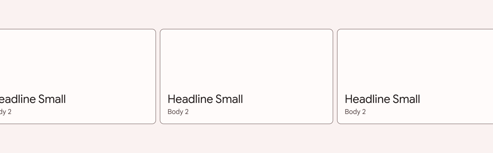
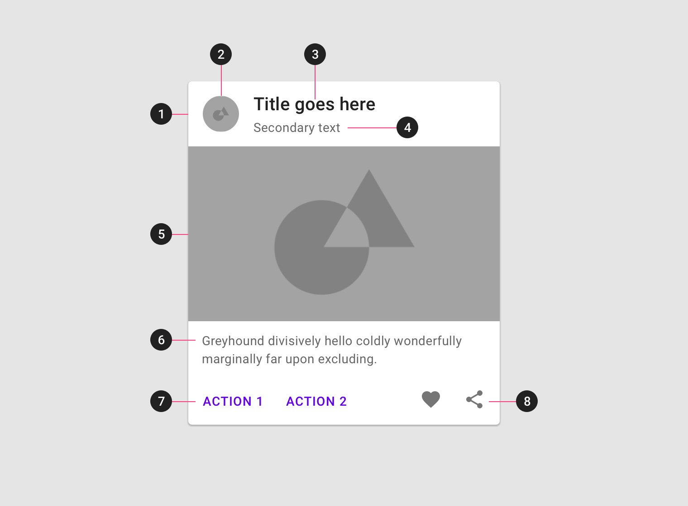

<!--docs:
title: "Cards"
layout: detail
section: components
excerpt: "Cards display content and actions on a single subject."
iconId: card
path: /catalog/cards/
-->

# Cards

[Cards](https://material.io/components/cards/) contain content and actions about
a single subject.



**Contents**

*   [Using cards](#using-cards)
*   [Card](#card)
*   [Theming](#theming-cards)

## Using cards

Before you can use a Material card, you need to add a dependency to the Material
Components for Android library. For more information, go to the
[Getting started](https://github.com/material-components/material-components-android/tree/master/docs/getting-started.md)
page.

Cards support [checking](#making-a-card-checkable) and
[dragging](#making-a-card-draggable), but those behaviors are not implemented by
default.

### Making cards accessible

The contents within a card should follow their own accessibility guidelines,
such as images having content descriptions set on them.

If you have a draggable card, you should set an
[`AccessibilityDelegate`](https://developer.android.com/reference/android/view/View.AccessibilityDelegate)
on it, so that the behavior can be accessible via screen readers such as
TalkBack. See the [draggable card section](#making-a-card-draggable) section
below for more info.

### Making a card checkable


When a card is checked, it will show a checked icon and change its foreground
color. There is no default behavior for enabling/disabling the checked state. An
example of how to do it in response to a long click is shown below.

In the layout:

```xml
<com.google.android.material.card.MaterialCardView
    ...
    android:clickable="true"
    android:focusable="true"
    android:checkable="true">

    ...

</com.google.android.material.card.MaterialCardView>
```

In code:

```kt
card.setOnLongClickListener {
    card.setChecked(!card.isChecked)
    true
}
```

### Making a card draggable


Cards have an `app:state_dragged` that has foreground and elevation changes to
convey motion. We recommend using
[`ViewDragHelper`](https://developer.android.com/reference/androidx/customview/widget/ViewDragHelper)
to set the dragged state:

```kt
private inner class ViewDragHelperCallback : ViewDragHelper.Callback() {

    override fun onViewCaptured(capturedChild: View, activePointerId: Int) {
        if (capturedChild is MaterialCardView) {
            (view as MaterialCardView).setDragged(true)
        }
    }

    override fun onViewReleased(releaseChild: View, xVel: Float, yVel: Float) {
        if (releaseChild is MaterialCardView) {
            (view as MaterialCardView).setDragged(false)
        }
    }
}
```

Alternatively, the
[Material Catalog](https://github.com/material-components/material-components-android/tree/master/catalog/java/io/material/catalog/card)
has an implementation example that uses a custom class called
[`DraggableCoordinatorLayout`](https://github.com/material-components/material-components-android/tree/master/catalog/java/io/material/catalog/draggable/DraggableCoordinatorLayout.java)
that you can copy, which is used as the parent container in the layout:

In the layout:

```xml
<io.material.catalog.draggable.DraggableCoordinatorLayout
    android:id="@+id/parentContainer"
    ...>

    <com.google.android.material.card.MaterialCardView
        ...>

        ...

    </com.google.android.material.card.MaterialCardView>

</io.material.catalog.draggable.DraggableCoordinatorLayout>
```

In code:

```kt
parentContainer.addDraggableChild(card)

parentContainer.setViewDragListener(object : DraggableCoordinatorLayout.ViewDragListener {

    override fun onViewCaptured(view: View, pointerId: Int) {
        card.isDragged = true
    }

    override fun onViewReleased(view: View, vX: Float, vY: Float) {
        card.isDragged = false
    }
})
```

Finally, make sure to make the behavior is accessible by setting an
[`AccessibilityDelegate`](https://developer.android.com/reference/android/view/View.AccessibilityDelegate)
on the card. The following shows an example of allowing the user to move the
card to two different positions on the screen.

```kt
private val cardDelegate = object : AccessibilityDelegate() {
    override fun onInitializeAccessibilityNodeInfo(host: View, info: AccessibilityNodeInfo) {
        super.onInitializeAccessibilityNodeInfo(host, info)

        val layoutParams = card!!.layoutParams as CoordinatorLayout.LayoutParams
        val gravity = layoutParams.gravity
        val isOnTop = gravity and Gravity.TOP == Gravity.TOP
        val isOnBottom = gravity and Gravity.BOTTOM == Gravity.BOTTOM

        if (!isOnTop) {
            info.addAction(AccessibilityAction(R.id.move_card_top_action, getString(R.string.card_action_move_top)))
        }
        if (!isOnBottom) {
            info.addAction(AccessibilityAction(R.id.move_card_bottom_action, getString(R.string.card_action_move_bottom)))
        }
    }

    override fun performAccessibilityAction(host: View, action: Int, arguments: Bundle): Boolean {
        val gravity: Int
        if (action == R.id.move_card_top_action) {
            gravity = Gravity.TOP
        } else if (action == R.id.move_card_bottom_action) {
            gravity = Gravity.BOTTOM
        } else {
            return super.performAccessibilityAction(host, action, arguments)
        }

        val layoutParams = card!!.layoutParams as CoordinatorLayout.LayoutParams
        if (layoutParams.gravity != gravity) {
            layoutParams.gravity = gravity
            card!!.requestLayout()
        }

        return true
    }
}
```

_**Note:** Cards also support a swipe-to-dismiss behavior through the use of
['SwipeDismissBehavior'](https://github.com/material-components/material-components-android/tree/master/lib/java/com/google/android/material/behavior/SwipeDismissBehavior.java).
You can see an example
[here](https://github.com/material-components/material-components-android/tree/master/catalog/java/io/material/catalog/card/CardSwipeDismissFragment.java)._

## Card

On mobile, a [card’s](https://material.io/components/cards/#specs) default
elevation is `1dp`, with a raised dragged elevation of `8dp`.


### Card examples

API and source code:

*   `MaterialCardView`
    *   [Class definition](https://developer.android.com/reference/com/google/android/material/card/MaterialCardView)
    *   [Class source](https://github.com/material-components/material-components-android/tree/master/lib/java/com/google/android/material/card/MaterialCardView.java)

_**Note:** You don't need to specify a style tag as long as you are using a
Material Components Theme. If not, set the style to
`Widget.MaterialComponents.CardView`._

#### Elevated card

The following example shows an elevated card.


```xml
<com.google.android.material.card.MaterialCardView
    android:id="@+id/card"
    android:layout_width="match_parent"
    android:layout_height="wrap_content"
    android:layout_margin="8dp">

    <LinearLayout
        android:layout_width="match_parent"
        android:layout_height="wrap_content"
        android:orientation="vertical">

        <!-- Media -->
        <ImageView
            android:layout_width="match_parent"
            android:layout_height="194dp"
            app:srcCompat="@drawable/media"
            android:scaleType="centerCrop"
            android:contentDescription="@string/content_description_media"
            />

        <LinearLayout
            android:layout_width="match_parent"
            android:layout_height="wrap_content"
            android:orientation="vertical"
            android:padding="16dp">

            <!-- Title, secondary and supporting text -->
            <TextView
                android:layout_width="wrap_content"
                android:layout_height="wrap_content"
                android:text="@string/title"
                android:textAppearance="?attr/textAppearanceHeadline6"
                />
            <TextView
                android:layout_width="wrap_content"
                android:layout_height="wrap_content"
                android:layout_marginTop="8dp"
                android:text="@string/secondary_text"
                android:textAppearance="?attr/textAppearanceBody2"
                android:textColor="?android:attr/textColorSecondary"
                />
            <TextView
                android:layout_width="wrap_content"
                android:layout_height="wrap_content"
                android:layout_marginTop="16dp"
                android:text="@string/supporting_text"
                android:textAppearance="?attr/textAppearanceBody2"
                android:textColor="?android:attr/textColorSecondary"
                />

        </LinearLayout>

        <!-- Buttons -->
        <LinearLayout
            android:layout_width="wrap_content"
            android:layout_height="wrap_content"
            android:layout_margin="8dp"
            android:orientation="horizontal">
            <com.google.android.material.button.MaterialButton
                android:layout_width="wrap_content"
                android:layout_height="wrap_content"
                android:layout_marginEnd="8dp"
                android:text="@string/action_1"
                style="?attr/borderlessButtonStyle"
                />
            <com.google.android.material.button.MaterialButton
                android:layout_width="wrap_content"
                android:layout_height="wrap_content"
                android:text="@string/action_2"
                style="?attr/borderlessButtonStyle"
                />
        </LinearLayout>

    </LinearLayout>

</com.google.android.material.card.MaterialCardView>
```

#### Outlined card

The following example shows an outlined card.


In the layout:

```xml
<com.google.android.material.card.MaterialCardView
    ...
    app:strokeWidth="1dp"
    app:strokeColor="@color/stroke_color"
    app:cardElevation="0dp">

    ...

</com.google.android.material.card.MaterialCardView>
```

In the stroke color (`stroke_color.xml`):

```xml
<selector xmlns:android="http://schemas.android.com/apk/res/android">
    <item android:color="?attr/colorPrimary" android:state_checked="true"/>
    <item android:alpha="0.12" android:color="?attr/colorOnSurface" android:state_checked="false"/>
</selector>
```

### Anatomy and key properties

A card has a container and an optional thumbnail, header text, secondary text,
media, supporting text, buttons and icons.



1.  Container
2.  Thumbnail
3.  Header text
4.  Secondary text
5.  Media
6.  Supporting text
7.  Buttons
8.  Icons
9.  Checked icon (not shown)

_**Note:** All the optional elements of a card's content (with the exception of
the checked icon) are implemented through the use of other views/components, as
shown in the [card examples](#card-examples) section._

#### Container attributes

&nbsp;               | Attribute                 | Related method(s)                                                   | Default value
-------------------- | ------------------------- | ------------------------------------------------------------------- | -------------
**Color**            | `app:cardBackgroundColor` | `setCardBackgroundColor`<br/>`getCardBackgroundColor`               | `?attr/colorSurface`
**Foreground color** | `app:cardForegroundColor` | `setCardForegroundColor`<br/>`getCardForegroundColor`               | `@android:color/transparent` (see all [states](https://github.com/material-components/material-components-android/tree/master/lib/java/com/google/android/material/card/res/color/mtrl_card_view_foreground.xml))
**Stroke color**     | `app:strokeColor`         | `setStrokeColor`<br/>`getStrokeColor`<br/>`getStrokeColorStateList` | `null`
**Stroke width**     | `app:strokeWidth`         | `setStrokeWidth`<br/>`getStrokeWidth`                               | `0dp`
**Shape**            | `app:shapeAppearance`     | `setShapeAppearanceModel`<br/>`getShapeAppearanceModel`             | `?attr/shapeAppearanceMediumComponent`
**Elevation**        | `app:cardElevation`       | `setCardElevation`<br/>`setCardMaxElevation`                        | `1dp`
**Ripple color**     | `app:rippleColor`         | `setRippleColor`<br/>`setRippleColorResource`<br/>`getRippleColor`  | `?attr/colorOnSurface` at 20% opacity (see all [states](https://github.com/material-components/material-components-android/tree/master/lib/java/com/google/android/material/card/res/color/mtrl_card_view_ripple.xml))

_**Note:** We recommend that cards on mobile have `8dp` margins.
`android:layout_margin` will [**NOT**](https://stackoverflow.com/a/13365288)
work in default styles (eg. `materialCardViewStyle`) so either set this attr
directly on a `MaterialCardView` in the layout or add it to a style that is
applied in the layout with `style="@style/...`._

_**Note:** Without an `app:strokeColor`, the card will not render a stroked
border, regardless of the `app:strokeWidth` value._

#### Checked icon attributes

&nbsp;        | Attribute           | Related method(s)                                                                    | Default value
------------- | ------------------- | ------------------------------------------------------------------------------------ | -------------
**Icon**      | `checkedIcon`       | `setCheckedIcon`<br/>`setCheckedIconResource`<br/>`getCheckedIcon`                   | [`@drawable/ic_mtrl_checked_circle.xml`](https://github.com/material-components/material-components-android/tree/master/lib/java/com/google/android/material/resources/res/drawable/ic_mtrl_checked_circle.xml)
**Color**     | `checkedIconTint`   | `setCheckedIconTint`<br/>`getCheckedIconTint`                                        | `?attr/colorPrimary`
**Checkable** | `android:checkable` | `setCheckable`<br/>`isCheckable`                                                     | `false`
**Size**      | `checkedIconSize`   | `setCheckedIconSize`<br/>`setCheckedIconSizeResource`<br/>`getCheckedIconSize`       | `24dp`
**Margin**    | `checkedIconMargin` | `setCheckedIconMargin`<br/>`setCheckedIconMarginResource`<br/>`getCheckedIconMargin` | `8dp`

#### States

Cards can have the following states:

State                                 | Description                         | Related method(s)
------------------------------------- | ----------------------------------- | -----------------
**Default**                           | Card is not checked and not dragged | N/A
**Checked** (`android:state_checked`) | `true` if a card is checked         | `setChecked`<br/>`setOnCheckedChangeListener`<br/>`isChecked`
**Dragged** (`app:state_dragged`)     | `true` when a card is being dragged | `setDragged`<br/>`isDragged`

#### Styles

&nbsp;            | Style
----------------- | ------------------------------------
**Default style** | `Widget.MaterialComponents.CardView`

Default style theme attribute: `?attr/materialCardViewStyle`

See the full list of
[styles](https://github.com/material-components/material-components-android/tree/master/lib/java/com/google/android/material/card/res/values/styles.xml)
and
[attributes](https://github.com/material-components/material-components-android/tree/master/lib/java/com/google/android/material/card/res/values/attrs.xml).

## Theming cards

A card supports
[Material Theming](https://material.io/components/cards/#theming) and can be
customized in terms of color, typography and shape.

### Card theming example

API and source code

*   `MaterialCardView`
    *   [Class definition](https://developer.android.com/reference/com/google/android/material/card/MaterialCardView)
    *   [Class source](https://github.com/material-components/material-components-android/tree/master/lib/java/com/google/android/material/card/MaterialCardView.java)

The following example shows a card with Material Theming.


#### Implementing card theming

Using theme attributes and a style in `res/values/styles.xml` (themes all cards
and affects other components):

```xml
<style name="Theme.App" parent="Theme.MaterialComponents.*">
    ...
    <item name="colorPrimary">@color/shrine_pink_100</item>
    <item name="colorSurface">@color/shrine_pink_light</item>
    <item name="colorOnSurface">@color/shrine_pink_900</item>
    <item name="shapeAppearanceMediumComponent">@style/ShapeAppearance.App.MediumComponent</item>
</style>

<style name="ShapeAppearance.App.MediumComponent" parent="ShapeAppearance.MaterialComponents.MediumComponent">
    <item name="cornerFamily">cut</item>
    <item name="cornerSize">8dp</item>
</style>
```

or using a default style theme attribute, styles and a theme overlay (themes all
cards but does not affect other components):

```xml
<style name="Theme.App" parent="Theme.MaterialComponents.*">
    ...
    <item name="materialCardViewStyle">@style/Widget.App.CardView</item>
</style>

<style name="Widget.App.CardView" parent="Widget.MaterialComponents.CardView">
    <item name="materialThemeOverlay">@style/ThemeOverlay.App.Card</item>
    <item name="shapeAppearance">@style/ShapeAppearance.App.MediumComponent</item>
</style>

<style name="ThemeOverlay.App.Card" parent="">
    <item name="colorPrimary">@color/shrine_pink_100</item>
    <item name="colorSurface">@color/shrine_pink_light</item>
    <item name="colorOnSurface">@color/shrine_pink_900</item>
</style>
```

or using the style in the layout (affects only this specific card):

```xml
<com.google.android.material.card.MaterialCardView
    ...
    style="@style/Widget.App.CardView"
/>
```

In order to optimize shape theming, some (optional) adjustments need to be made
to the card layout to incorporate
[ShapeableImageView](https://github.com/material-components/material-components-android/tree/master/lib/java/com/google/android/material/imageview/ShapeableImageView.java).

In the layout:

```xml
<com.google.android.material.card.MaterialCardView
    ...
    app:cardPreventCornerOverlap="false">

    ...

        <!-- Media -->
        <com.google.android.material.imageview.ShapeableImageView
            ...
            app:shapeAppearance="?attr/shapeAppearanceMediumComponent"
            app:shapeAppearanceOverlay="@style/ShapeAppearanceOverlay.App.Card.Media"
            />

</com.google.android.material.card.MaterialCardView>
```

In `res/values/styles.xml`:

```xml
<style name="ShapeAppearanceOverlay.App.Card.Media" parent="">
    <item name="cornerSizeBottomLeft">0dp</item>
    <item name="cornerSizeBottomRight">0dp</item>
</style>
```

_**Note:** In order to theme card contents (text, buttons, etc.), the relevant
styles/attributes for these components will need to be included. For more
information, see the article on
[buttons](https://material.io/develop/android/components/buttons/)._
