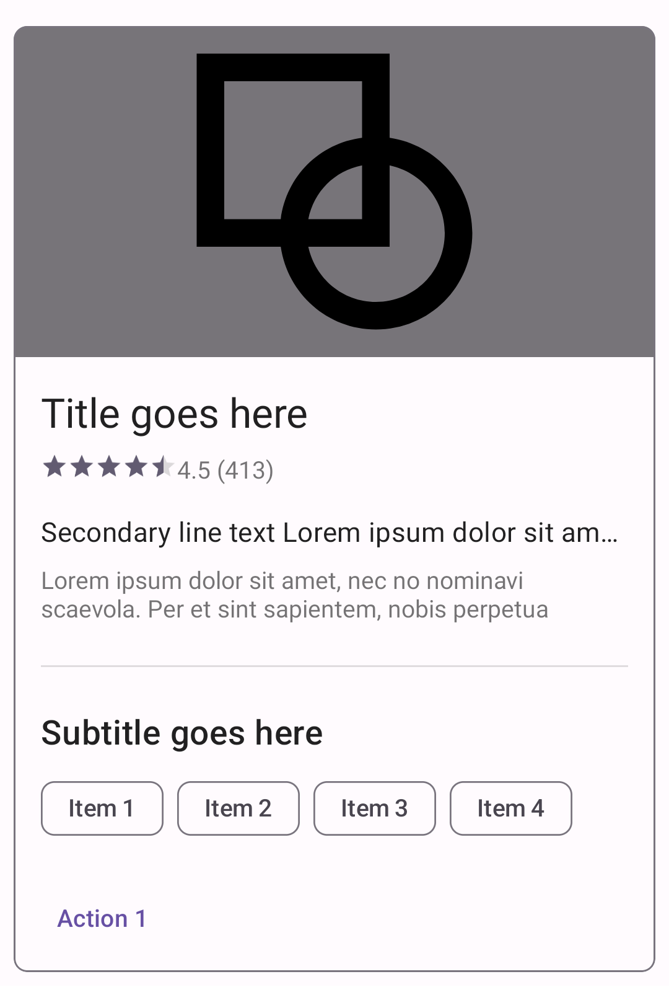

<!--docs:
title: "Cards"
layout: detail
section: components
excerpt: "Cards display content and actions on a single subject."
iconId: card
path: /catalog/cards/
-->

# Cards

[Cards](https://m3.material.io/components/cards/overview) contain content and
actions about a single subject. There are three variants of cards.


1.  Elevated card
2.  Filled card
3.  Outlined card

**Note:** Images use various dynamic color schemes.

## Design & API documentation

*   [Material 3 (M3) spec](https://m3.material.io/components/cards/overview)
*   [API reference](https://developer.android.com/reference/com/google/android/material/card/package-summary)

## Anatomy


1.  Container
2.  Headline
3.  Subhead
4.  Supporting text
5.  Image
6.  Buttons

More details on anatomy items in the
[component guidelines](https://m3.material.io/components/cards/guidelines#dbcb6275-bbaf-4e06-a867-f4aa632c1141).

## Key properties

### Container attribute

Element              | Attribute                 | Related method(s)                                                   | Default value
-------------------- | ------------------------- | ------------------------------------------------------------------- | -------------
**Color**            | `app:cardBackgroundColor` | `setCardBackgroundColor`<br/>`getCardBackgroundColor`               | `?attr/colorSurface` (outlined style)</br>`?attr/colorSurfaceContainerHighest` (filled style)</br>`?attr/colorSurfaceContainerLow` (elevated style)
**Foreground color** | `app:cardForegroundColor` | `setCardForegroundColor`<br/>`getCardForegroundColor`               | `@android:color/transparent` (see all [states](https://github.com/material-components/material-components-android/tree/master/lib/java/com/google/android/material/card/res/color/m3_card_foreground_color.xml))
**Stroke color**     | `app:strokeColor`         | `setStrokeColor`<br/>`getStrokeColor`<br/>`getStrokeColorStateList` | `?attr/colorOutline` (unchecked)<br/>`?attr/colorSecondary` (checked)
**Stroke width**     | `app:strokeWidth`         | `setStrokeWidth`<br/>`getStrokeWidth`                               | `1dp` (outlined style)<br/>`0dp` (elevated or filled style)
**Shape**            | `app:shapeAppearance`     | `setShapeAppearanceModel`<br/>`getShapeAppearanceModel`             | `?attr/shapeAppearanceCornerMedium`
**Elevation**        | `app:cardElevation`       | `setCardElevation`<br/>`setCardMaxElevation`                        | `0dp` (outlined or filled style)<br/>`1dp` (elevated style)
**Ripple color**     | `app:rippleColor`         | `setRippleColor`<br/>`setRippleColorResource`<br/>`getRippleColor`  | `?attr/colorOnSurfaceVariant` at 20% opacity (see all [states](https://github.com/material-components/material-components-android/tree/master/lib/java/com/google/android/material/card/res/color/m3_card_ripple_color.xml))

**Note:** We recommend that cards on mobile have `8dp` margins.
`android:layout_margin` will [**NOT**](https://stackoverflow.com/a/13365288)
work in default styles (for example `materialCardViewStyle`) so either set this
attr directly on a `MaterialCardView` in the layout or add it to a style that is
applied in the layout with `style="@style/...`.

**Note:** Without an `app:strokeColor`, the card will not render a stroked
border, regardless of the `app:strokeWidth` value.

### Checked icon attributes

Element       | Attribute            | Related method(s)                                                                    | Default value
------------- | -------------------- | ------------------------------------------------------------------------------------ | -------------
**Icon**      | `checkedIcon`        | `setCheckedIcon`<br/>`setCheckedIconResource`<br/>`getCheckedIcon`                   | [`@drawable/ic_mtrl_checked_circle.xml`](https://github.com/material-components/material-components-android/tree/master/lib/java/com/google/android/material/resources/res/drawable/ic_mtrl_checked_circle.xml)
**Color**     | `checkedIconTint`    | `setCheckedIconTint`<br/>`getCheckedIconTint`                                        | `?attr/colorOutline` (unchecked)<br/>`?attr/colorSecondary` (checked)
**Checkable** | `android:checkable`  | `setCheckable`<br/>`isCheckable`                                                     | `false`
**Size**      | `checkedIconSize`    | `setCheckedIconSize`<br/>`setCheckedIconSizeResource`<br/>`getCheckedIconSize`       | `24dp`
**Margin**    | `checkedIconMargin`  | `setCheckedIconMargin`<br/>`setCheckedIconMarginResource`<br/>`getCheckedIconMargin` | `8dp`
**Gravity**   | `checkedIconGravity` | `setCheckedIconGravity`<br/>`getCheckedIconGravity`                                  | `TOP_END`

### States

Cards can have the following states:

State                                 | Description                         | Related method(s)
------------------------------------- | ----------------------------------- | -----------------
**Default**                           | Card is not checked and not dragged | N/A
**Checked** (`android:state_checked`) | `true` if a card is checked         | `setChecked`<br/>`setOnCheckedChangeListener`<br/>`isChecked`
**Dragged** (`app:state_dragged`)     | `true` when a card is being dragged | `setDragged`<br/>`isDragged`

### Styles

Element              | Style                                                                   | Theme attribute
-------------------- | ----------------------------------------------------------------------- | ---------------
**Default style**    | `Widget.Material3.CardView.Outlined`                                    | `?attr/materialCardViewStyle`
**Additional style** | `Widget.Material3.CardView.Elevated`,`Widget.Material3.CardView.Filled` | `?attr/materialCardViewOutlinedStyle`,`?attr/materialCardViewFilledStyle`,`?attr/materialCardViewElevatedStyle`

For the full list, see
[styles](https://github.com/material-components/material-components-android/tree/master/lib/java/com/google/android/material/card/res/values/styles.xml)
and
[attributes](https://github.com/material-components/material-components-android/tree/master/lib/java/com/google/android/material/card/res/values/attrs.xml).

## Variants of cards

There are three types of cards:

*   Elevated
*   Filled
*   Outlined

Each provides the same legibility and functionality, so the type you use depends
on style alone.

<details>
  <summary><h3>Elevated card</h3></summary>

Elevated cards have a drop shadow, providing more separation from the background
than filled cards, but less than outlined cards.

On mobile, an outlined or a filled card’s default elevation is `0dp`, with a
raised dragged elevation of `8dp`. The Material Android library also provides an
elevated card style, which has an elevation of `1dp`, with a raised dragged
elevation of `2dp`.

The following example shows an elevated card.


In the layout:

```xml
<com.google.android.material.card.MaterialCardView
    ...
    style="?attr/materialCardViewElevatedStyle">

    ...

</com.google.android.material.card.MaterialCardView>
```

</details>

<details>
  <summary><h3>Filled card</h3></summary>

Filled cards provide subtle separation from the background. This has less
emphasis than elevated or outlined cards.

The following example shows a filled card.


In the layout:

```xml
<com.google.android.material.card.MaterialCardView
    ...
    style="?attr/materialCardViewFilledStyle">

    ...

</com.google.android.material.card.MaterialCardView>
```

</details>

<details>
  <summary><h3>Outlined card</h3></summary>

Outlined cards have a visual boundary around the container. This can provide
greater emphasis than the other types.

The following example shows an outlined card.



```xml
<com.google.android.material.card.MaterialCardView
    android:id="@+id/card"
    android:layout_width="match_parent"
    android:layout_height="wrap_content"
    android:layout_margin="8dp">

    <LinearLayout
        android:layout_width="match_parent"
        android:layout_height="wrap_content"
        android:orientation="vertical">

        <!-- Media -->
        <ImageView
            android:layout_width="match_parent"
            android:layout_height="194dp"
            app:srcCompat="@drawable/media"
            android:scaleType="centerCrop"
            android:contentDescription="@string/content_description_media"
            />

        <LinearLayout
            android:layout_width="match_parent"
            android:layout_height="wrap_content"
            android:orientation="vertical"
            android:padding="16dp">

            <!-- Title, secondary and supporting text -->
            <TextView
                android:layout_width="wrap_content"
                android:layout_height="wrap_content"
                android:text="@string/title"
                android:textAppearance="?attr/textAppearanceTitleMedium"
                />
            <TextView
                android:layout_width="wrap_content"
                android:layout_height="wrap_content"
                android:layout_marginTop="8dp"
                android:text="@string/secondary_text"
                android:textAppearance="?attr/textAppearanceBodyMedium"
                android:textColor="?android:attr/textColorSecondary"
                />
            <TextView
                android:layout_width="wrap_content"
                android:layout_height="wrap_content"
                android:layout_marginTop="16dp"
                android:text="@string/supporting_text"
                android:textAppearance="?attr/textAppearanceBodyMedium"
                android:textColor="?android:attr/textColorSecondary"
                />

        </LinearLayout>

        <!-- Buttons -->
        <LinearLayout
            android:layout_width="wrap_content"
            android:layout_height="wrap_content"
            android:layout_margin="8dp"
            android:orientation="horizontal">
            <com.google.android.material.button.MaterialButton
                android:layout_width="wrap_content"
                android:layout_height="wrap_content"
                android:layout_marginEnd="8dp"
                android:text="@string/action_1"
                style="?attr/borderlessButtonStyle"
                />
            <com.google.android.material.button.MaterialButton
                android:layout_width="wrap_content"
                android:layout_height="wrap_content"
                android:text="@string/action_2"
                style="?attr/borderlessButtonStyle"
                />
        </LinearLayout>

    </LinearLayout>

</com.google.android.material.card.MaterialCardView>
```

</details>

## Code implementation

Before you can use a Material card, you need to add a dependency to the Material
components for Android library. For more information, go to the
[Getting started](https://github.com/material-components/material-components-android/tree/master/docs/getting-started.md)
page.

Cards support [checking](#making-cards-checkable) and
[dragging](#making-cards-draggable), but those behaviors are not implemented by
default.

**Note:** All the optional elements of a card's content (with the exception of
the checked icon) are implemented through the use of other views/components, as
shown in the [Card theming example](#card-example) section.

### Making cards checkable


When a card is checked, it will show a checked icon and change its foreground
color. There is no default behavior for enabling/disabling the checked state. An
example of how to do it in response to a long click is shown below.

In the layout:

```xml
<com.google.android.material.card.MaterialCardView
    ...
    android:clickable="true"
    android:focusable="true"
    android:checkable="true">

    ...

</com.google.android.material.card.MaterialCardView>
```

In code:

```kt
card.setOnLongClickListener {
    card.setChecked(!card.isChecked)
    true
}
```

### Making cards draggable


Cards have an `app:state_dragged` with foreground and elevation changes to
convey motion. We recommend using
[`ViewDragHelper`](https://developer.android.com/reference/androidx/customview/widget/ViewDragHelper)
to set the dragged state:

```kt
private inner class ViewDragHelperCallback : ViewDragHelper.Callback() {

    override fun onViewCaptured(capturedChild: View, activePointerId: Int) {
        if (capturedChild is MaterialCardView) {
            (view as MaterialCardView).setDragged(true)
        }
    }

    override fun onViewReleased(releaseChild: View, xVel: Float, yVel: Float) {
        if (releaseChild is MaterialCardView) {
            (view as MaterialCardView).setDragged(false)
        }
    }
}
```

Alternatively, the
[Material catalog](https://github.com/material-components/material-components-android/tree/master/catalog/java/io/material/catalog/card)
has an implementation example that you can copy, which uses a custom class
called
[`DraggableCoordinatorLayout`](https://github.com/material-components/material-components-android/tree/master/catalog/java/io/material/catalog/draggable/DraggableCoordinatorLayout.java).
It is used as the parent container.

In the layout:

```xml
<io.material.catalog.draggable.DraggableCoordinatorLayout
    android:id="@+id/parentContainer"
    ...>

    <com.google.android.material.card.MaterialCardView
        ...>

        ...

    </com.google.android.material.card.MaterialCardView>

</io.material.catalog.draggable.DraggableCoordinatorLayout>
```

In code:

```kt
parentContainer.addDraggableChild(card)

parentContainer.setViewDragListener(object : DraggableCoordinatorLayout.ViewDragListener {

    override fun onViewCaptured(view: View, pointerId: Int) {
        card.isDragged = true
    }

    override fun onViewReleased(view: View, vX: Float, vY: Float) {
        card.isDragged = false
    }
})
```

Finally, make sure the behavior is accessible by setting an
[`AccessibilityDelegate`](https://developer.android.com/reference/android/view/View.AccessibilityDelegate)
on the card. The code below demonstrates how to allow the user to move the card
to two different positions on the screen.

```kt
private val cardDelegate = object : AccessibilityDelegate() {
    override fun onInitializeAccessibilityNodeInfo(host: View, info: AccessibilityNodeInfo) {
        super.onInitializeAccessibilityNodeInfo(host, info)

        val layoutParams = card!!.layoutParams as CoordinatorLayout.LayoutParams
        val gravity = layoutParams.gravity
        val isOnTop = gravity and Gravity.TOP == Gravity.TOP
        val isOnBottom = gravity and Gravity.BOTTOM == Gravity.BOTTOM

        if (!isOnTop) {
            info.addAction(AccessibilityAction(R.id.move_card_top_action, getString(R.string.card_action_move_top)))
        }
        if (!isOnBottom) {
            info.addAction(AccessibilityAction(R.id.move_card_bottom_action, getString(R.string.card_action_move_bottom)))
        }
    }

    override fun performAccessibilityAction(host: View, action: Int, arguments: Bundle): Boolean {
        val gravity: Int
        if (action == R.id.move_card_top_action) {
            gravity = Gravity.TOP
        } else if (action == R.id.move_card_bottom_action) {
            gravity = Gravity.BOTTOM
        } else {
            return super.performAccessibilityAction(host, action, arguments)
        }

        val layoutParams = card!!.layoutParams as CoordinatorLayout.LayoutParams
        if (layoutParams.gravity != gravity) {
            layoutParams.gravity = gravity
            card!!.requestLayout()
        }

        return true
    }
}
```

**Note:** Cards also support a swipe-to-dismiss behavior through the use of
['SwipeDismissBehavior'](https://github.com/material-components/material-components-android/tree/master/lib/java/com/google/android/material/behavior/SwipeDismissBehavior.java).
You can see an example
[here](https://github.com/material-components/material-components-android/tree/master/catalog/java/io/material/catalog/card/CardSwipeDismissFragment.java).

### Making cards accessible

The contents within a card should follow their own accessibility guidelines,
such as images having content descriptions set on them.

If you have a draggable card, you should set an
[`AccessibilityDelegate`](https://developer.android.com/reference/android/view/View.AccessibilityDelegate)
on it, so that the behavior can be accessible via screen readers such as
TalkBack. See the [draggable card section](#making-cards-draggable) for more
info.

## Customizing cards

### Theming cards

Cards support the customization of color, typography, and shape.

<h4 id="card-example">Card theming example</h4>

API and source code

*   `MaterialCardView`
    *   [Class definition](https://developer.android.com/reference/com/google/android/material/card/MaterialCardView)
    *   [Class source](https://github.com/material-components/material-components-android/tree/master/lib/java/com/google/android/material/card/MaterialCardView.java)

**Note:** You don't need to specify a style tag as long as you are using a
Material components theme. If not, set the style to
`Widget.Material3.CardView.Outlined`, `Widget.Material3.CardView.Filled` or
`Widget.Material3.CardView.Elevated`.

The following example shows a card with Material theming.


##### Implementing card theming

Use theme attributes and a style in `res/values/styles.xml` to apply the theme
to all cards. This will affect other components:

```xml
<style name="Theme.App" parent="Theme.Material3.*">
    ...
    <item name="colorSecondary">@color/shrine_pink_100</item>
    <item name="colorSurface">@color/shrine_pink_light</item>
    <item name="colorOnSurfaceVariant">@color/shrine_pink_900</item>
    <item name="shapeAppearanceCornerMedium">@style/ShapeAppearance.App.Corner.Medium</item>
</style>

<style name="ShapeAppearance.App.Corner.Medium" parent="ShapeAppearance.Material3.Corner.Medium">
    <item name="cornerFamily">cut</item>
    <item name="cornerSize">8dp</item>
</style>
```

Use a default style theme attribute, styles and a theme overlay. This applies a
theme to all cards but does not affect other components:

```xml
<style name="Theme.App" parent="Theme.Material3.*">
    ...
    <item name="materialCardViewStyle">@style/Widget.App.CardView</item>
</style>

<style name="Widget.App.CardView" parent="Widget.Material3.CardView.Elevated">
    <item name="materialThemeOverlay">@style/ThemeOverlay.App.Card</item>
    <item name="shapeAppearance">@style/ShapeAppearance.App.Corner.Medium</item>
</style>

<style name="ThemeOverlay.App.Card" parent="">
    <item name="colorSecondary">@color/shrine_pink_100</item>
    <item name="colorSurface">@color/shrine_pink_light</item>
    <item name="colorOnSurfaceVariant">@color/shrine_pink_900</item>
</style>
```

Use the style in the layout. This affects only this specific card:

```xml
<com.google.android.material.card.MaterialCardView
    ...
    style="@style/Widget.App.CardView"
/>
```

In order to optimize shape theming, some (optional) adjustments need to be made
to the card layout to incorporate
[ShapeableImageView](https://github.com/material-components/material-components-android/tree/master/lib/java/com/google/android/material/imageview/ShapeableImageView.java).

In the layout:

```xml
<com.google.android.material.card.MaterialCardView
    ...
    app:cardPreventCornerOverlap="false">

    ...

        <!-- Media -->
        <com.google.android.material.imageview.ShapeableImageView
            ...
            app:shapeAppearance="?attr/shapeAppearanceCornerMedium"
            app:shapeAppearanceOverlay="@style/ShapeAppearanceOverlay.App.Card.Media"
            />

</com.google.android.material.card.MaterialCardView>
```

In `res/values/styles.xml`:

```xml
<style name="ShapeAppearanceOverlay.App.Card.Media" parent="">
    <item name="cornerSizeBottomLeft">0dp</item>
    <item name="cornerSizeBottomRight">0dp</item>
</style>
```

**Note:** In order to apply a theme to card contents (text, buttons, etc.), the
relevant styles/attributes for these components need to be included. For more
information, see the article on
[buttons](https://material.io/develop/android/components/buttons/).
