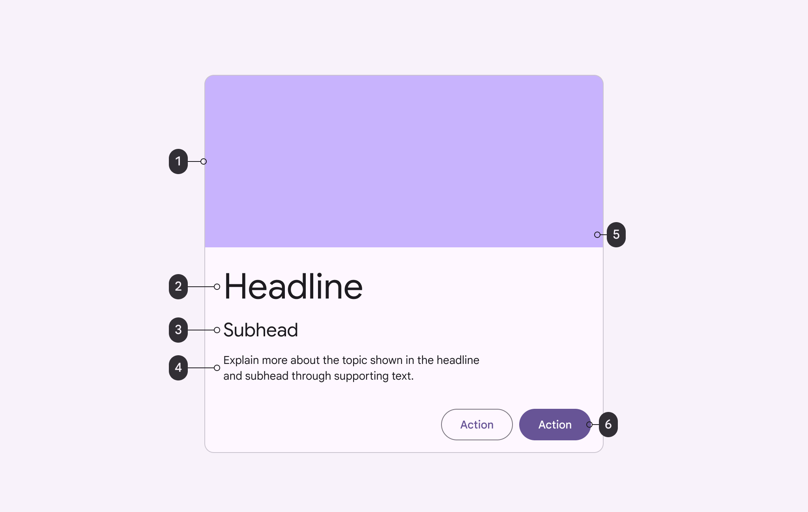

<!--docs:
title: "Cards"
layout: detail
section: components
excerpt: "Cards display content and actions on a single subject."
iconId: card
path: /catalog/cards/
-->

# Cards

[Cards](https://material.io/components/cards/) contain content and actions about
a single subject.

There are two types of cards:

1.  [Elevated](#elevated-card)
2.  [Outlined](#outlined-card)


## Using cards

Before you can use a Material card, you need to add a dependency to the Material
Components for Android library. For more information, go to the
[Getting started](/material-components/material-components-android/blob/master/docs/getting-started.md)
page.

Cards support [checking](#making-the-card-checkable) and
[dragging](#making-the-card-draggable), but those behaviors are not implemented
by default.

### Making cards accessible

The contents within a card should follow their own accessibility guidelines,
such as images having content description set on them.

If you have a draggable card, you should set an
[`AccessibilityDelegate`](https://developer.android.com/reference/android/view/View.AccessibilityDelegate)
on it, so that the behavior can be accessible via screen readers such as
TalkBack. More info about it under the
[draggable card section](#making-the-card-draggable).

## Card

On mobile, a [card’s](https://material.io/components/cards/#specs) default
elevation is 1dp, with a raised dragged elevation of 8dp.

### Card example

Source code API:

*   `MaterialCardView`
    *   [Class definition](https://developer.android.com/reference/com/google/android/material/card/MaterialCardView)
    *   [Class source](https://github.com/material-components/material-components-android/tree/master/lib/java/com/google/android/material/card/MaterialCardView.java)

**Note:** You don't need to specify a style tag as long as you are using a
Material Components Theme. If not, set the style to
`Widget.MaterialComponents.CardView`.

#### Elevated card

The following example shows an elevated card.


In the layout:

```xml
<com.google.android.material.card.MaterialCardView
    android:layout_width="@dimen/card_width"
    android:layout_height="wrap_content"
    android:layout_margin="8dp"
    android:clickable="true"
    android:focusable="true"
    android:minHeight="@dimen/card_min_height">

  <LinearLayout
      android:layout_width="match_parent"
      android:layout_height="wrap_content"
      android:orientation="vertical">

    <!-- Media -->
    <androidx.appcompat.widget.AppCompatImageView
        android:layout_width="match_parent"
        android:layout_height="194dp"
        android:background="@android:color/transparent"
        android:contentDescription="@string/media_image_view_description"
        app:srcCompat="@drawable/card_sample_image" />

    <!-- Title and supporting text -->
    <LinearLayout
        android:layout_width="match_parent"
        android:layout_height="wrap_content"
        android:orientation="vertical"
        android:padding="16dp">
      <TextView
          style="?attr/textAppearanceHeadline6"
          android:layout_width="wrap_content"
          android:layout_height="wrap_content"
          android:text="@string/card_title" />
      <TextView
          android:layout_width="wrap_content"
          android:layout_height="wrap_content"
          android:layout_marginTop="8dp"
          android:text="@string/secondary_text" />
      <TextView
          android:layout_width="wrap_content"
          android:layout_height="wrap_content"
          android:layout_marginTop="16dp"
          android:text="@string/supporting_text" />

      <!-- Buttons -->
      <LinearLayout
          android:layout_width="wrap_content"
          android:layout_height="wrap_content"
          android:layout_marginTop="8dp"
          android:orientation="horizontal">

        <com.google.android.material.button.MaterialButton
            style="?attr/borderlessButtonStyle"
            android:layout_width="wrap_content"
            android:layout_height="wrap_content"
            android:layout_marginEnd="8dp"
            android:layout_marginRight="8dp"
            android:text="@string/action_1" />

        <com.google.android.material.button.MaterialButton
            style="?attr/borderlessButtonStyle"
            android:layout_width="wrap_content"
            android:layout_height="wrap_content"
            android:layout_marginEnd="8dp"
            android:layout_marginRight="8dp"
            android:text="@string/action_2" />

      </LinearLayout>
    </LinearLayout>

  </LinearLayout>

</com.google.android.material.card.MaterialCardView>
```

#### Outlined card

The following example shows an outlined card.


In the layout:

```xml
<com.google.android.material.card.MaterialCardView
    ...
    app:strokeWidth="1dp"
    app:strokeColor="@color/gray"
    app:cardElevation="0dp">
        ...
        <!-- Card contents (same as elevated card example). -->

</com.google.android.material.card.MaterialCardView>
```

#### Making the card checkable


When a card is checked, it will show a checked icon and change the foreground
color. There is no default behavior for enabling/disabling the checked state. An
example of how to do it in response to a long click is shown below.

In the layout:

```xml
<com.google.android.material.card.MaterialCardView
    ...
    android:clickable="true"
    android:focusable="true"
    android:checkable="true">
    ...
</com.google.android.material.card.MaterialCardView>
```

In code:

```kt
card.setOnLongClickListener {
    card.setChecked(!card.isChecked)
    true
}
```

#### Making the card draggable

Cards have an `app:state_dragged` that has foreground and elevation changes to
convey motion. The recommended way of using the dragged state is via the
[`ViewDragHelper`](https://developer.android.com/reference/androidx/customview/widget/ViewDragHelper):

```kt
private inner class ViewDragHelperCallback : ViewDragHelper.Callback() {

    override fun onViewCaptured(capturedChild: View, activePointerId: Int) {
        if (capturedChild is MaterialCardView) {
          (view as MaterialCardView).setDragged(true)
        }
    }

    override fun onViewReleased(releaseChild: View, xVel: Float, yVel: Float) {
        if (releaseChild is MaterialCardView) {
          (view as MaterialCardView).setDragged(false)
        }
    }
}
```

Alternatively, the
[Material Catalog](https://github.com/material-components/material-components-android/tree/master/catalog/java/io/material/catalog/card)
has an implementation example that uses a custom class called
[`DraggableCoordinatorLayout`](https://github.com/material-components/material-components-android/tree/master/catalog/java/io/material/catalog/draggable/DraggableCoordinatorLayout.java)
that you can copy, which is used as the parent container in the layout:

```xml
<io.material.catalog.draggable.DraggableCoordinatorLayout
    android:id="@+id/parentContainer"
    ...
    >

    <com.google.android.material.card.MaterialCardView
        ...
        >
        <!-- Card contents. -->
    </com.google.android.material.card.MaterialCardView>

</io.material.catalog.draggable.DraggableCoordinatorLayout>
```

Then, in code:

```kt
parentContainer.addDraggableChild(card)

parentContainer.setViewDragListener(object : DraggableCoordinatorLayout.ViewDragListener {

    override fun onViewCaptured(view: View, pointerId: Int) {
        card.isDragged = true
    }

    override fun onViewReleased(view: View, vX: Float, vY: Float) {
        card.isDragged = false
    }
})
```

Finally, make sure to make the behavior is accessible by setting an
[`AccessibilityDelegate`](https://developer.android.com/reference/android/view/View.AccessibilityDelegate)
on the card. The following shows an example of allowing the user to move the
card to two different positions on the screen.

```kt
private val cardDelegate = object : AccessibilityDelegate() {
    override fun onInitializeAccessibilityNodeInfo(host: View, info: AccessibilityNodeInfo) {
        super.onInitializeAccessibilityNodeInfo(host, info)

        val layoutParams = card!!.layoutParams as CoordinatorLayout.LayoutParams
        val gravity = layoutParams.gravity
        val isOnTop = gravity and Gravity.TOP == Gravity.TOP
        val isOnBottom = gravity and Gravity.BOTTOM == Gravity.BOTTOM

        if (!isOnTop) {
            info.addAction(AccessibilityAction(R.id.move_card_top_action, getString(R.string.card_action_move_top)))
        }
        if (!isOnBottom) {
            info.addAction(AccessibilityAction(R.id.move_card_bottom_action, getString(R.string.card_action_move_bottom)))
        }
    }

    override fun performAccessibilityAction(host: View, action: Int, arguments: Bundle): Boolean {
        val gravity: Int
        if (action == R.id.move_card_top_action) {
            gravity = Gravity.TOP
        } else if (action == R.id.move_card_bottom_action) {
            gravity = Gravity.BOTTOM
        } else {
            return super.performAccessibilityAction(host, action, arguments)
        }

        val layoutParams = card!!.layoutParams as CoordinatorLayout.LayoutParams
        if (layoutParams.gravity != gravity) {
            layoutParams.gravity = gravity
            card!!.requestLayout()
        }

        return true
    }
}
```

**Note:** Cards also support a swipe-to-dismiss behavior through the use of
['SwipeDismissBehavior'](https://github.com/material-components/material-components-android/tree/master/lib/java/com/google/android/material/behavior/SwipeDismissBehavior.java).
An
[example](https://github.com/material-components/material-components-android/tree/master/catalog/java/io/material/catalog/card/CardSwipeDismissFragment.java)
can be found on the catalog.

### Key properties



1.  Container
2.  Thumbnail (optional)
3.  Header text (optional)
4.  Subhead (optional)
5.  Media (optional)
6.  Supporting text (optional)
7.  Buttons (optional)
8.  Icons (optional)

**Note:** All the optional elements of a card's content are implemented through
the use of other views/components, as shown on the [card example](#card-example)
section. With the exception of the optional checked icon, explained below.

#### Container attributes

&nbsp;           | Attribute                    | Related method(s)                                                   | Default value
---------------- | ---------------------------- | ------------------------------------------------------------------- | -------------
Margin (left)    | `android:layout_marginLeft`  | N/A                                                                 | N/A (recommended: `8dp`)
Margin (right)   | `android:layout_marginRight` | N/A                                                                 | N/A (recommended: `8dp`)
Margin (top)     | `android:layout_marginTop`   | N/A                                                                 | N/A (recommended: `8dp`)
Elevation        | `app:cardElevation`          | `setCardElevation`<br/>`setCardMaxElevation`                        | `1dp`
Stroke color     | `app:strokeColor`            | `setStrokeColor`<br/>`getStrokeColor`<br/>`getStrokeColorStateList` | `@null`
Stroke width     | `app:strokeWidth`            | `setStrokeWidth`<br/>`getStrokeWidth`                               | `0dp`
Background color | `app:cardBackgroundColor`    | `setCardBackgroundColor`<br/>`getCardBackgroundColor`               | `?attr/colorSurface`
Foreground color | `app:cardForegroundColor`    | `setCardForegroundColor`<br/>`getCardForegroundColor`               | `@android:color/transparent` (see all [states](https://github.com/material-components/material-components-android/tree/master/lib/java/com/google/android/material/card/res/color/mtrl_card_view_foreground.xml))
Ripple color     | `app:rippleColor`            | `setRippleColor`<br/>`setRippleColorResource`<br/>`getRippleColor`  | `?attr/colorOnSurface` at 20% opacity (see all [states](https://github.com/material-components/material-components-android/tree/master/lib/java/com/google/android/material/card/res/color/mtrl_card_view_ripple.xml))
Shape            | `app:shapeAppearance`        | `setShapeAppearanceModel`<br/>`getShapeAppearanceModel`             | `?attr/shapeAppearanceMediumComponent`

<b>Note about the margins</b>

It's recommended that cards on mobile have `8dp` margins.
`android:layout_margin` needs to be set directly on a `View` in its layout and
won't work when included as part of a style.

<b>Note about the stroke</b>

Without an `app:strokeColor`, the card will not render a stroked border,
regardless of the `app:strokeWidth` value.

#### Checked icon (optional) attributes

&nbsp;                 | Attribute           | Related method(s)                                                  | Default value
---------------------- | ------------------- | ------------------------------------------------------------------ | -------------
Icon                   | `checkedIcon`       | `setCheckedIcon`<br/>`setCheckedIconResource`<br/>`getCheckedIcon` | [`@drawable/ic_mtrl_checked_circle.xml`](https://github.com/material-components/material-components-android/tree/master/lib/java/com/google/android/material/resources/res/drawable/ic_mtrl_checked_circle.xml)
Tint                   | `checkedIconTint`   | `setCheckedIconTint`<br/>`getCheckedIconTint`                      | `?attr/colorPrimary`
To make card checkable | `android:checkable` | `setCheckable`<br/>`isCheckable`                                   | `false`

#### States

Cards have the following states:

State                             | Description                         | Related method(s)
--------------------------------- | ----------------------------------- | -----------------
Default                           | Card is not checked and not dragged | N/A
Checked (`android:state_checked`) | `true` if a card is checked         | `setChecked`<br/>`setOnCheckedChangeListener`<br/>`isChecked`
Dragged (`app:state_dragged`)     | `true` when a card is being dragged | `setDragged`<br/>`isDragged`

#### Styles

&nbsp;            | Style
----------------- | ------------------------------------
**Default style** | `Widget.MaterialComponents.CardView`

Default style theme attribute: `?attr/materialCardViewStyle`

See the full list of
[styles](https://github.com/material-components/material-components-android/tree/master/lib/java/com/google/android/material/card/res/values/styles.xml)
and
[attrs](https://github.com/material-components/material-components-android/tree/master/lib/java/com/google/android/material/card/res/values/attrs.xml).

## Theming a card

A card supports
[Material Theming](https://material.io/components/cards/#theming) and can be
customized in terms of color, typography and shape.


### Card theming example

API and source code

*   `MaterialCardView`
    *   [Class definition](https://developer.android.com/reference/com/google/android/material/card/MaterialCardView)
    *   [Class source](https://github.com/material-components/material-components-android/tree/master/lib/java/com/google/android/material/card/MaterialCardView.java)

#### Implementing card theming

Using theme attributes and styles in `res/values/styles.xml` (themes all cards
and affects other components):

```xml
<style name="Theme.App" parent="Theme.MaterialComponents.*">
    ...
    <item name="colorPrimary">@color/shrine_pink_100</item>
    <item name="colorOnPrimary">@color/shrine_pink_900</item>
    <item name="colorOnSurface">@color/shrine_pink_900</item>
    <item name="shapeAppearanceMediumComponent">@style/ShapeAppearance.App.MediumComponent</item>
</style>

<style name="ShapeAppearance.App.MediumComponent" parent="ShapeAppearance.MaterialComponents.MediumComponent">
    <item name="cornerFamily">cut</item>
    <item name="cornerSize">8dp</item>
</style>

<!-- You still need the individual card styles to change non-theme attributes, like strokeWidth, strokeColor, etc.
     See the example below. -->
```

or using default style theme attributes, styles and theme overlays (themes all
buttons but does not affect other components):

```xml
<style name="Theme.App" parent="Theme.MaterialComponents.*">
    ...
    <item name="materialCardViewStyle">@style/Widget.MaterialComponents.CardView</item>
</style>

<style name="Widget.App.Card" parent="Widget.MaterialComponents.CardView">
    <item name="materialThemeOverlay">@style/ThemeOverlay.App.Card</item>
    <item name="shapeAppearance">@style/ShapeAppearance.App.MediumComponent</item>
</style>

<style name="ThemeOverlay.App.Card" parent="">
    <item name="colorPrimary">@color/shrine_pink_100</item>
    <item name="colorOnPrimary">@color/shrine_pink_900</item>
    <item name="colorOnSurface">@color/shrine_pink_900</item>
</style>
```

or using one of the styles in the layout (affects only this specific card):

```xml
<com.google.android.material.card.MaterialCardView
    ...
    style="@style/Widget.App.Card"
/>
```
