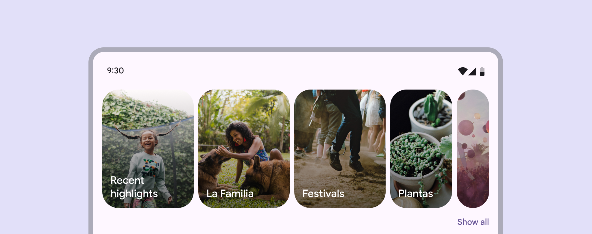
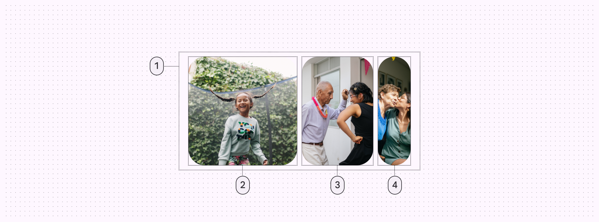
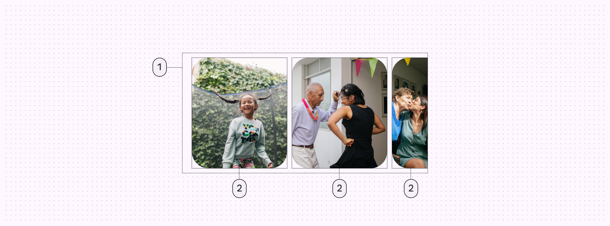
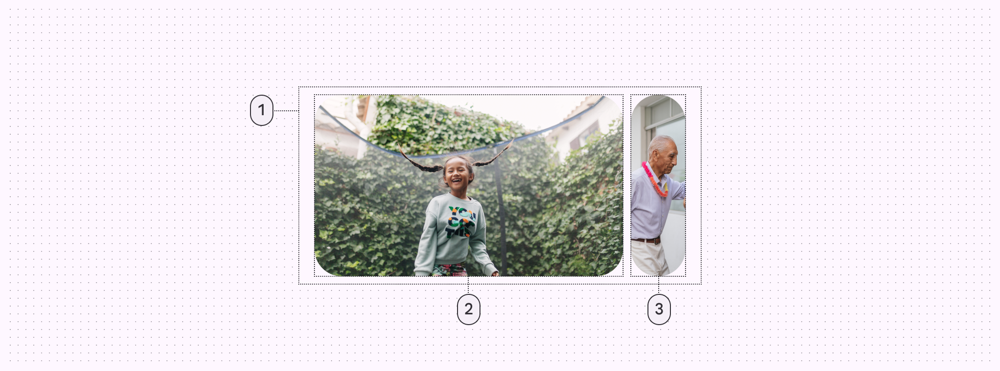
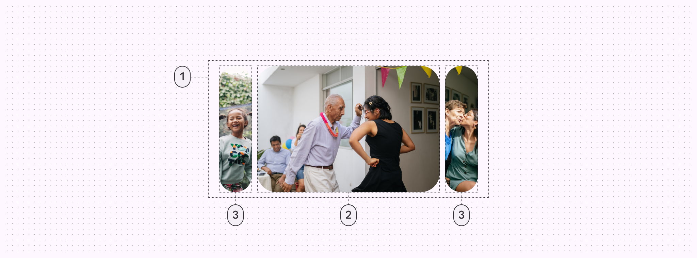
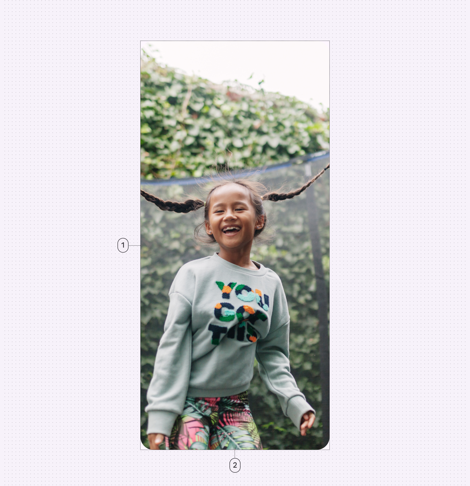

<!--docs:
title: "Carousels"
layout: detail
section: components
excerpt: "Carousels contain a collection of items that can move into or out of view.
iconId: carousel
path: /catalog/carousel/
-->

# Carousels

[Carousels](https://m3.material.io/components/carousel/overview) contain a
collection of items that can move into or out of view.



Carousel items emphasize visuals, but can also contain brief text that adapts to
the item size.

There are four [carousel layouts](#layouts-of-carousel):

*   Multi-browse
*   Uncontained
*   Hero
    *   Start-aligned hero
    *   Center-aligned hero
*   Full-screen

**Note:** Images use various dynamic color schemes.

## Design & API documentation

*   [Material 3 (M3) spec](https://m3.material.io/components/carousel/overview)
*   [API reference](https://developer.android.com/reference/com/google/android/material/carousel/package-summary)

## Anatomy

#### Multi browse

<details>

<summary>The multi-browse layout shows at least one large, medium, and small
carousel item.</summary>



1.  Container
2.  Large carousel item
3.  Medium carousel item
4.  Small carousel item

</details>

#### Uncontained

<details>

<summary>The uncontained layout shows items that scroll to the edge of the
container.</summary>



1.  Container
2.  Large carousel item

</details>

#### Hero

##### Start-aligned hero

<details>

<summary>The hero layout shows at least one large item and one small
item.</summary>



1.  Container
2.  Large carousel item
3.  Small carousel item
    </details>

##### Center-aligned hero

<details>

<summary>The center-aligned hero layout shows at least one large item and two
small items.</summary>



1.  Container
2.  Large carousel item
3.  Small carousel item

</details>

#### Full screen

<details>

<summary>The full-screen layout shows one edge-to-edge large item.</summary>



1.  Container
2.  Large carousel item

</details>

More details on anatomy items in the
[component guidelines](https://m3.material.io/components/carousel/guidelines#792bd03f-3f95-4e1b-8fb7-c2303c76156e).

## Key properties

Note that in order to use these attributes on the RecyclerView,
CarouselLayoutManager must be set through the RecyclerView attribute
`app:layoutManager`.

Element         | Attribute               | Related method(s)      | Default value
--------------- | ----------------------- | ---------------------- | -------------
**Orientation** | `android:orientation`   | `setOrientation`       | `horizontal` (if layoutManager has been set through xml)
**Alignment**   | `app:carouselAlignment` | `setCarouselAlignment` | `start`

## Layouts of carousel

<h3 id="multi-browse-strategy">Multi browse</h3>

A multi-browse strategy allows quick browsing of many small items, like a photo
thumbnail gallery. A start-aligned, multi-browse strategy is the default
strategy for the carousel.


API and source code:

*   `MultiBrowseCarouselStrategy`
    *   [Class definition](https://developer.android.com/reference/com/google/android/material/carousel/MultiBrowseCarouselStrategy)
    *   [Class source](https://github.com/material-components/material-components-android/tree/master/lib/java/com/google/android/material/carousel/MultiBrowseCarouselStrategy.java)

With a multi-browse strategy, large items are at the start of the list followed
by medium and small items, depending on the size of the `RecyclerView`
container.

You can use the multi-browse strategy by passing in no arguments to the
CarouselLayoutManager constructor: `CarouselLayoutManager()`.

With the multi-browse strategy, it is recommended to use the
`CarouselSnapHelper` to snap to the nearest item like so:

```kt
val snapHelper = CarouselSnapHelper()
snapHelper.attachToRecyclerView(carouselRecyclerView)
```

<h3>Uncontained</h3>

An uncontained strategy fits as many items as possible into the carousel without
altering the item size. With the remaining space, it fits one item that is the
smallest it can be to fill the space but still gets cut off in a way such that
there is a visible effect of items getting smaller as it goes out of the
carousel bounds.


You can use the uncontained strategy by passing in the strategy to the
CarouselLayoutManager constructor:
`CarouselLayoutManager(UncontainedCarouselStrategy())`.

As the uncontained strategy does not alter item sizes, it is ideal for use cases
where aspect ratios of the items must be maintained. However, this can lead to
aesthetically displeasing layouts when the carousel size is almost perfectly
divisible by the item size, so it is advised to update the item sizes based on
the carousel size.

<h3 id="hero-strategy">Hero</h3>

A hero strategy highlights large content, like movies and other media, for more
considered browsing and selection. It draws attention and focus to a main
carousel item while hinting at the next item in line.

With a **start-aligned hero strategy**, typically there is one large item is at
the start of the list followed by a small item.


With a **center-aligned hero strategy**, there is typically one large item at
the middle of the list surrounded by small items.


When there is one large item, the large item takes up the entire size of the
`RecyclerView` container, save some space for the small item(s). See
[controlling focal alignment](#controlling-focal-alignment) for more information about changing
alignment of the large items.

There may be more than one large item depending on the dimensions of the
carousel. On a horizontal carousel, the width of a large item will maximally be
twice its height, and conversely, on a vertical carousel, the height of a large
item will maximally be twice its width. More large items are added when the
maximum large item size has been reached. For example, horizontal carousels with
`match_parent` as the width will have more and more large items as the screen
size grows.

You can use the hero strategy by passing in the strategy to the
CarouselLayoutManager constructor:
`CarouselLayoutManager(HeroCarouselStrategy())`.

With the hero strategy, it is recommended to use the `CarouselSnapHelper` to
snap to the nearest item like so:

```kt
val snapHelper = CarouselSnapHelper()
snapHelper.attachToRecyclerView(carouselRecyclerView)
```

<h3 id="full-screen-strategy">Full screen</h3>

A fullscreen strategy shows one item at a time that takes up the entire space of
the carousel.


You can use the fullscreen strategy by passing in the strategy to the
CarouselLayoutManager constructor:
`CarouselLayoutManager(FullScreenCarouselStrategy())`.

With the fullscreen strategy, it is recommended to use a vertical orientation
carousel by either setting the orientation on the CarouselLayoutManager with the
setter, or through its constructor: `CarouselLayoutManager(
FullScreenCarouselStrategy(), RecyclerView.VERTICAL)`. Stick to portrait
orientation only, or adapt your layout to a different strategy when using
landscape in order to maintain the aspect ratios of your images.

It is also recommended to use the `CarouselSnapHelper` to snap to the nearest
item like so:

```kt
val snapHelper = CarouselSnapHelper()
snapHelper.attachToRecyclerView(carouselRecyclerView)
```

## Code implementation

Before you can use Material carousels, you need to add a dependency on the
Material Components for Android library. For more information, go to the
[Getting started](https://github.com/material-components/material-components-android/tree/master/docs/getting-started.md)
page.

### Adding carousel

**API and source code:**

*   `RecyclerView`
    *   [Class definition](https://developer.android.com/reference/androidx/recyclerview/widget/RecyclerView)
*   `CarouselLayoutManager`
    *   [Class definition](https://developer.android.com/reference/com/google/android/material/carousel/CarouselLayoutManager)
    *   [Class source](https://github.com/material-components/material-components-android/tree/master/lib/java/com/google/android/material/carousel/CarouselLayoutManager.java)
*   `CarouselStrategy`
    *   [Class definition](https://developer.android.com/reference/com/google/android/material/carousel/CarouselStrategy)
    *   [Class source](https://github.com/material-components/material-components-android/tree/master/lib/java/com/google/android/material/carousel/CarouselStrategy.java)
*   `MaskableFrameLayout`
    *   [Class definition](https://developer.android.com/reference/com/google/android/material/carousel/MaskableFrameLayout)
    *   [Class source](https://github.com/material-components/material-components-android/tree/master/lib/java/com/google/android/material/carousel/MaskableFrameLayout.java)

Carousel is built on top of `RecyclerView`. To learn how to use `RecyclerView`
to display a list of items, please see
[Create dynamic lists with RecyclerView](https://developer.android.com/develop/ui/views/layout/recyclerview).

To turn a horizontal list into a carousel, first wrap your `RecyclerView`'s item
layout in a `MaskableFrameLayout`. `MaskableFrameLayout` is a `FrameLayout` that
is able to mask (clip) itself, and its children, to a percentage of its width.
When a mask is set to 0%, the the entire view is visible in its original,
"unmasked" width. As a mask approaches 100%, the edges of the view begin to crop
in towards the center, leaving a narrower and narrower sliver of the original
view visible. Carousel masks and unmasks items as they are scrolled across the
viewport to create a stylized look and feel.

```xml
<com.google.android.material.carousel.MaskableFrameLayout
  xmlns:android="http://schemas.android.com/apk/res/android"
  xmlns:app="http://schemas.android.com/apk/res-auto"
  xmlns:tools="http://schemas.android.com/tools"
  android:id="@+id/carousel_item_container"
  android:layout_width="150dp"
  android:layout_height="match_parent"
  android:layout_marginStart="4dp"
  android:layout_marginEnd="4dp"
  android:foreground="?attr/selectableItemBackground"
  app:shapeAppearance="?attr/shapeAppearanceCornerExtraLarge">
  <ImageView
    android:id="@+id/carousel_image_view"
    android:layout_width="match_parent"
    android:layout_height="match_parent"
    android:scaleType="centerCrop"/>
</com.google.android.material.carousel.MaskableFrameLayout>
```

**Note:** Masking creates the best effect when `MaskableFrameLayout` contains a
full-bleed image or other backgrounds that extend to or past the edges of its
parent. If the shape or masking behavior of your item doesn't look correct, try
removing any padding set on `MaskableFrameLayout` or margins set on children of
`MaskableFrameLayout`.

Next, set your `RecyclerView`s layout manager to a new `CarouselLayoutManager`.

```xml
<androidx.recyclerview.widget.RecyclerView
  android:id="@+id/carousel_recycler_view"
  android:layout_width="match_parent"
  android:layout_height="196dp"
  android:clipChildren="false"
  android:clipToPadding="false" />
```

```kt
carouselRecyclerView.setLayoutManager(CarouselLayoutManager())
```

These are the basic steps to create a carousel. The look of the carousel depends
on which carousel strategy you are using; you can have a
[multi-browse strategy](#multi-browse-strategy),
[hero strategy](#hero-strategy), or
[full-screen strategy](#full-screen-strategy).

## Customizing carousel

### Setting item size

The main means of changing the look of carousel is by setting the height of your
`RecyclerView` and width of your item's `MaskableFrameLayout`. The width set in
the item layout is used by `CarouselLayoutManager` to determine the size items
should be when they are fully unmasked. This width needs to be set to a specific
dp value and cannot be set to `wrap_content`. `CarouselLayoutManager` tries to
then use a size as close to your item layout's specified width as possible but
may increase or decrease this size depending on the `RecyclerView`'s available
space. This is needed to create a pleasing arrangement of items which fit within
the `RecyclerView`'s bounds. Additionally, `CarouselLayoutManager` will only
read and use the width set on the first list item. All remaining items will be
laid out using this first item's width.

The small item size range may be customized for strategies that have small items
by calling `setSmallItemSizeMin`/`setSmallItemSizeMax`. Note that these
strategies choose the small item size within the range that alters the fully
unmasked item size as little as possible, and may not correspond with the width
of the carousel. For strategies that do not use small items, these methods are a
no-op.

### Setting item shape

`MaskableFrameLayout` takes an `app:shapeAppearance` attribute to determine its
corner radius. It's recommended to use the `?attr/shapeAppearanceExtraLarge`
shape attribute but this can be set to any `ShapeAppearance` theme attribute or
style. See
[Shape theming](https://github.com/material-components/material-components-android/tree/master/docs/theming/Shape.md)
documentation for more details.

### Reacting to changes in item mask size

If your `RecyclerView`'s item layout contains text or other content that needs
to react to changes in the item's mask, you can listen for changes in mask size
by setting an
[`onMaskChangedListener`](https://developer.android.com/reference/com/google/android/material/carousel/OnMaskChangedListener)
on your `MaskableFrameLayout` inside your `RecyclerView.ViewHolder`.

```kt
(viewHolder.itemView as MaskableFrameLayout).setOnMaskChangedListener {
    maskRect ->
      // Any custom motion to run when mask size changes
      viewHolder.title.setTranslationX(maskRect.left)
      viewHolder.title.setAlpha(lerp(1F, 0F, 0F, 80F, maskRect.left))
}
```

In the example above, a title is translated so it appears pinned to the left
masking edge of the item. As the item masks and becomes too small for the title,
it is faded out.

### Controlling focal alignment

You can control the alignment of the focal (large) items in the carousel by
setting the `app:carousel_alignment` attribute on your RecyclerView, if you are
also setting the RecyclerView's LayoutManager through `app:layoutManager`:

```xml
    <androidx.recyclerview.widget.RecyclerView
      ...
      app:layoutManager="com.google.android.material.carousel.CarouselLayoutManager"
      app:carousel_alignment="center"
      android:orientation="horizontal"/>
```

If CarouselLayoutManager is being set programmatically, you may set the
alignment as well programmatically:

```kt
carouselLayoutManager.setCarouselAlignment(CarouselLayoutManager.CENTER)
```

By default, the focal alignment is start-aligned.
