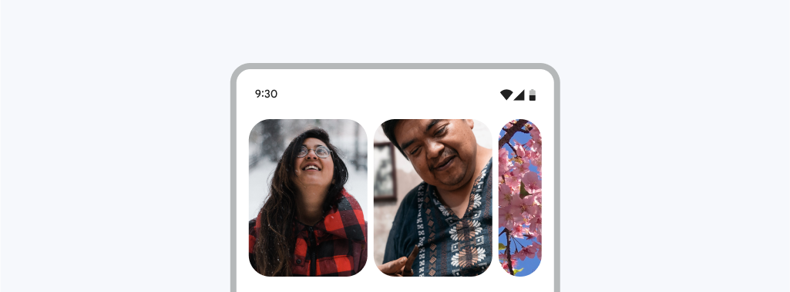

<!--docs:
title: "Carousel"
layout: detail
section: components
excerpt: "Carousels contain a collection of items that can move into or out of view.
iconId: carousel
path: /catalog/carousel/
-->

# Carousel

Carousels contain a collection of items that can move into or out of view



**Contents**

*   [Using carousel](#using-carousel)
*   [Multi-browse carousels](#multi-browse-carousels)
*   [Customizing carousel](#customizing-carousel)

## Using carousel

Before you can use Material carousels, you need to add a dependency on the
Material Components for Android library. For more information, go to the
[Getting started](https://github.com/material-components/material-components-android/tree/master/docs/getting-started.md)
page.

Carousel is built on top of `RecyclerView`. To learn how to use `RecyclerView` to display a list of items, please see [Create dynamic lists with RecyclerView](https://developer.android.com/develop/ui/views/layout/recyclerview).

## Multi-browse carousels

A multi-browse carousel allows quick browsing of many small items, like a photo thumbnail gallery. A start-aligned, multi-browse carousel is the default carousel configuration.

To turn a horizontal list into a multi-browse carousel, first wrap your `RecyclerView`'s item layout in a `MaskableFrameLayout`. `MaskableFrameLayout` is a `FrameLayout` that is able to mask (clip) itself, and its children, to a percentage of its width. When a mask is set to 0%, the the entire view is visible in its original, "unmaksed" width. As a mask approaches 100%, the edges of the view begin to crop in towards the center, leaving a narrower and narrower sliver of the original view visible. Carousel masks and unmasks items as they are scrolled across the viewport to create a stylized look and feel.

```xml
<com.google.android.material.carousel.MaskableFrameLayout
  xmlns:android="http://schemas.android.com/apk/res/android"
  xmlns:app="http://schemas.android.com/apk/res-auto"
  xmlns:tools="http://schemas.android.com/tools"
  android:id="@+id/carousel_item_container"
  android:layout_width="150dp"
  android:layout_height="match_parent"
  android:layout_marginStart="4dp"
  android:layout_marginEnd="4dp"
  android:foreground="?attr/selectableItemBackground"
  app:shapeAppearance="?attr/shapeAppearanceCornerExtraLarge">
  <ImageView
    android:id="@+id/carousel_image_view"
    android:layout_width="match_parent"
    android:layout_height="match_parent"
    android:scaleType="centerCrop"/>
</com.google.android.material.carousel.MaskableFrameLayout>
```

**Note:** Masking creates the best effect when `MaskableFrameLayout` contains a full-bleed image or other backgrounds that extend to or past the edges of its parent. If the shape or masking behavior of your item doesn't look correct, try removing any padding set on `MaskableFrameLayout` or margins set on children of `MaskableFrameLayout`.

Next, set your `RecyclerView`s layout manager to a new `CarouselLayoutManager`.

```xml
<androidx.recyclerview.widget.RecyclerView
  android:id="@+id/carousel_recycler_view"
  android:layout_width="match_parent"
  android:layout_height="196dp"
  android:clipChildren="false"
  android:clipToPadding="false" />
```

```kotlin
carouselRecyclerView.setLayoutManager(CarouselLayoutManager())
```

These are the basic steps to create a carousel with large items at the start of the list followed by medium and small items, depending on the size of the `RecyclerView` container.

## Customizing carousel

### Item size

The main means of changing the look of carousel is by setting the height of your `RecyclerView` and width of your item's `MaskableFrameLayout`. The width set in the item layout is used by `CarouselLayoutManager` to determine the size items should be when they are fully unmasked. This width needs to be set to a specific dp value and cannot be set to `wrap_content`. `CarouselLayoutManager` tries to then use a size as close to your item layout's specified width as possible but may increase or decrease this size depending on the `RecyclerView`'s available space. This is needed to create a pleasing arrangement of items which fit within the `RecyclerView`'s bounds. Additionally, `CarouselLayoutManager` will only read and use the width set on the first list item. All remaining items will be laid out using this first item's width. 

### Item shape

`MaskableFrameLayout` takes an `app:shapeAppearance` attribute to determine its corner radius. It's recommended to use the `?attr/shapeAppearanceExtraLarge` shape attribute but this can be set to any `ShapeAppearance` theme attribute or style. See [Shape theming](https://github.com/material-components/material-components-android/tree/master/docs/theming/Shape.md) documentation for more details.

### Reacting to changes in item mask size

If your `RecyclerView`'s item layout contains text or other content that needs to react to changes in the item's mask, you can listen for changes in mask size by setting an `onMaskChangedListener` on your `MaskableFrameLayout` inside your `RecyclerView.ViewHolder`.

```kotlin
(viewHolder.itemView as MaskableFrameLayout).addOnMaskChangedListener(
    maskRect ->
      // Any custom motion to run when mask size changes
      viewHolder.title.setTranslationX(maskRect.left);
      viewHolder.title.setAlpha(lerp(1F, 0F, 0F, 80F, maskRect.left));
    );
}
```

In the example above, a title is translated so it appears pinned to the left masking edge of the item. As the item masks and becomes too small for the title, it is faded out.


