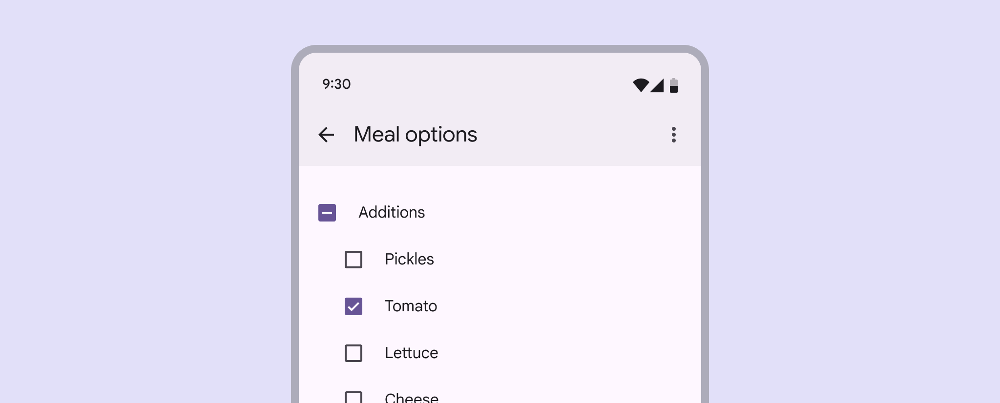
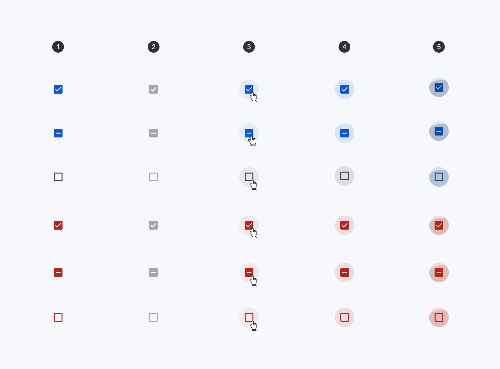
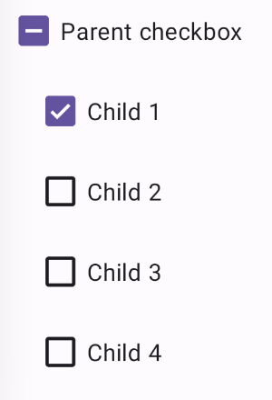
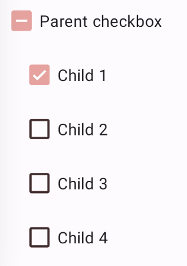

<!--docs:
title: "Checkbox"
layout: detail
section: components
excerpt: "Selection controls allow the user to select options."
iconId: checkbox
path: /catalog/checkboxes/
-->

# Checkbox

[Checkboxes](https://m3.material.io/components/checkbox/overview) let users
select one or more items from a list, or turn an item on or off.



**Note:** Images use various dynamic color schemes.

## Design & API documentation

*   [Material 3 (M3) spec](https://m3.material.io/components/checkbox/overview)
*   [API reference](https://developer.android.com/reference/com/google/android/material/checkbox/package-summary)

## Anatomy


1.  Container
2.  Icon

More details on anatomy items in the
[component guidelines](https://m3.material.io/components/checkbox/guidelines#c04665de-5bf3-4706-87ae-68ad7e2b7fda).

## Key properties

### Checkbox attributes

The checkbox is composed of an `app:buttonCompat` drawable (the container) and
an `app:buttonIcon` drawable (the icon) layered on top of it.

Element                      | Attribute                                  | Related method(s)                                        | Default value
---------------------------- | ------------------------------------------ | -------------------------------------------------------- | -------------
**Button tint**              | `app:buttonTint`                           | `setButtonTintList`<br/>`getButtonTintList`              | `?attr/colorOnSurface` (see all [states](https://github.com/material-components/material-components-android/tree/master/lib/java/com/google/android/material/checkbox/res/color/m3_checkbox_button_tint.xml))
**Button icon drawable**     | `app:buttonIcon`                           | `setButtonIconDrawable`<br/>`getButtonIconDrawable`      | [@mtrl_checkbox_button_icon](https://github.com/material-components/material-components-android/tree/master/lib/java/com/google/android/material/checkbox/res/drawable/mtrl_checkbox_button_icon.xml)
**Button icon tint**         | `app:buttonIconTint`                       | `setButtonIconTintList`<br/>`getButtonIconTintList`      | `?attr/colorOnPrimary` (see all [states](https://github.com/material-components/material-components-android/tree/master/lib/java/com/google/android/material/checkbox/res/color/m3_checkbox_button_icon_tint.xml))
**Min size**                 | `android:minWidth`<br/>`android:minHeight` | `(set/get)MinWidth`<br/>`(set/get)MinHeight`             | `?attr/minTouchTargetSize`
**Centered icon if no text** | `app:centerIfNoTextEnabled`                | `setCenterIfNoTextEnabled`<br/>`isCenterIfNoTextEnabled` | `true`

**Note:** If setting a custom `app:buttonCompat`, make sure to also set
`app:buttonIcon` if an icon is desired. The checkbox does not support having a
custom `app:buttonCompat` and preserving the default `app:buttonIcon` checkmark
at the same time.

### Text label attributes

Element        | Attribute                | Related method(s)                  | Default value
-------------- | ------------------------ | ---------------------------------- | -------------
**Text label** | `android:text`           | `setText`<br/>`getText`            | `null`
**Color**      | `android:textColor`      | `setTextColor`<br/>`getTextColors` | inherits from `AppCompatCheckBox`
**Typography** | `android:textAppearance` | `setTextAppearance`                | `?attr/textAppearanceBodyMedium`

### Checkbox states

Checkboxes can be selected, unselected, or indeterminate, and those states on
error. Checkboxes have enabled, disabled, hover, focused, and pressed states.



1.  Enabled
2.  Disabled
3.  Hover
4.  Focused
5.  Pressed

### Styles

Element           | Style                                      | Theme attribute
----------------- | ------------------------------------------ | ---------------
**Default style** | `Widget.Material3.CompoundButton.CheckBox` | `?attr/checkboxStyle`

For the full list, see
[styles](https://github.com/material-components/material-components-android/tree/master/lib/java/com/google/android/material/checkbox/res/values/styles.xml)
and
[attrs](https://github.com/material-components/material-components-android/tree/master/lib/java/com/google/android/material/checkbox/res/values/attrs.xml).

## Code implementation

Before you can use Material checkboxes, you need to add a dependency to the
Material components for Android library. For more information, go to the
[Getting started](https://github.com/material-components/material-components-android/tree/master/docs/getting-started.md)
page.

### Adding checkbox

```xml
<CheckBox
    android:layout_width="match_parent"
    android:layout_height="wrap_content"
    android:text="@string/label"/>
```

**Note:** `<CheckBox>` is auto-inflated as
`<com.google.android.material.button.MaterialCheckBox>` via
`MaterialComponentsViewInflater` when using a `Theme.Material3.*` theme.

### Checkbox example

The following example shows a list of checkboxes with a parent/children
relationship.

The first checkbox (the parent) will be selected if all children are selected,
not selected if all of the children are not selected, and indeterminate if only
some of the children are selected.



In the layout:

```xml
<CheckBox
    android:id="@+id/checkbox_parent"
    android:layout_width="match_parent"
    android:layout_height="wrap_content"
    app:checkedState="indeterminate"
    android:text="@string/label_parent"/>

<LinearLayout
    android:id="@+id/checkbox_container"
    android:layout_width="match_parent"
    android:layout_height="wrap_content"
    android:layout_marginStart="@dimen/checkbox_margin"
    android:orientation="vertical">

  <CheckBox
      android:id="@+id/checkbox_child_1"
      android:layout_width="match_parent"
      android:layout_height="wrap_content"
      android:text="@string/label_child_1"/>

  <CheckBox
      android:id="@+id/checkbox_child_2"
      android:layout_width="match_parent"
      android:layout_height="wrap_content"
      android:text="@string/label_child_2"/>

  <CheckBox
      android:id="@+id/checkbox_child_3"
      android:layout_width="match_parent"
      android:layout_height="wrap_content"
      android:text="@string/label_child_3"/>


  <CheckBox
      android:id="@+id/checkbox_child_4"
      android:layout_width="match_parent"
      android:layout_height="wrap_content"
      android:text="@string/label_child_4"/>

</LinearLayout>
```

In code:

```kt
// Class variable
private var isUpdatingChildren = false

...

// Parent's checked state changed listener
val parentOnCheckedStateChangedListener =
  OnCheckedStateChangedListener { checkBox: MaterialCheckBox, state: Int ->
    val isChecked = checkBox.isChecked
    if (state != MaterialCheckBox.STATE_INDETERMINATE) {
      isUpdatingChildren = true
      for (child in childrenCheckBoxes) {
        child.isChecked = isChecked
      }
      isUpdatingChildren = false
    }
  }
checkBoxParent.addOnCheckedStateChangedListener(parentOnCheckedStateChangedListener)

// Checked state changed listener for each child
val childOnCheckedStateChangedListener =
  OnCheckedStateChangedListener { checkBox: MaterialCheckBox?, state: Int ->
    if (!isUpdatingChildren) {
      setParentState(checkBoxParent, childrenCheckBoxes, parentOnCheckedStateChangedListener)
    }
  }
for (child in childrenCheckBoxes) {
  (child as MaterialCheckBox)
    .addOnCheckedStateChangedListener(childOnCheckedStateChangedListener)
}

// Set first child to be checked
firstChild.isChecked = true
// Set parent's state
setParentState(checkBoxParent, childrenCheckBoxes, parentOnCheckedStateChangedListener)

...

private fun setParentState(
  checkBoxParent: MaterialCheckBox,
  childrenCheckBoxes: List<CheckBox>,
  parentOnCheckedStateChangedListener: OnCheckedStateChangedListener
) {
  val checkedCount = childrenCheckBoxes.stream().filter { obj: CheckBox -> obj.isChecked }
    .count()
    .toInt()
  val allChecked = checkedCount == childrenCheckBoxes.size
  val noneChecked = checkedCount == 0
  checkBoxParent.removeOnCheckedStateChangedListener(parentOnCheckedStateChangedListener)
  if (allChecked) {
    checkBoxParent.isChecked = true
  } else if (noneChecked) {
    checkBoxParent.isChecked = false
  } else {
    checkBoxParent.checkedState = MaterialCheckBox.STATE_INDETERMINATE
  }
  checkBoxParent.addOnCheckedStateChangedListener(parentOnCheckedStateChangedListener)
}

```

### Making checkbox accessible

Checkboxes support content labeling for accessibility and are readable by most
screen readers, such as TalkBack. Text rendered in checkboxes is automatically
provided to accessibility services. Additional content labels are usually
unnecessary.

### Selecting checkbox

In the layout:

```xml
<CheckBox
    ...
    android:checked="true"/>
```

In code:

```kt
// To check a checkbox
checkbox.isChecked = true

// To listen for a checkbox's checked/unchecked state changes
checkbox.setOnCheckedChangeListener { buttonView, isChecked ->
    // Responds to checkbox being checked/unchecked
}

// Alternatively, you can check a checkbox via setCheckedState
checkBox.setCheckedState(MaterialCheckbox.STATE_CHECKED);

// To uncheck:
checkBox.setCheckedState(MaterialCheckbox.STATE_UNCHECKED);

// And to listen for changes:
checkbox.addOnCheckedStateChangedListener { checkBox, state ->
  // Responds to when the checkbox changes state.
}
```

### Setting error state on checkbox

In the layout:

```xml
<CheckBox
    ...
    app:errorShown="true"/>
```

In code:

```kt
// Set error.
checkbox.errorShown = true

// Optional listener:
checkbox.addOnErrorChangedListener { checkBox, errorShown ->
    // Responds to when the checkbox enters/leaves error state
}

// To set a custom accessibility label:
checkbox.errorAccessibilityLabel = "Error: custom error announcement."

```

### Making checkbox indeterminate


Unselected, selected (hover), and indeterminate checkboxes

In the layout:

```xml
<CheckBox
    ...
    app:checkedState="indeterminate"/>
```

In code:

```kt
// You can set the state of the checkbox (STATE_CHECKED, STATE_UNCHECKED,
// or STATE_INDETERMINATE) via setCheckedState.
checkBox.setCheckedState(MaterialCheckbox.STATE_INDETERMINATE);

// Checkbox state listener.
checkbox.addOnCheckedStateChangedListener { checkBox, state ->
  // Responds to when the checkbox changes state.
}
```

## Customizing checkbox

### Theming checkbox

Checkboxes support the customization of color and typography.

**Note:** Checkboxes do not support shape theming and are only rounded square
checkboxes.

#### Checkbox theming example

API and source code:

*   `MaterialCheckBox`
    *   [Class definition](https://developer.android.com/reference/com/google/android/material/checkbox/MaterialCheckBox)
    *   [Class source](https://github.com/material-components/material-components-android/tree/master/lib/java/com/google/android/material/checkbox/MaterialCheckBox.java)

The following example shows a checkbox with Material theming.



##### Implementing checkbox theming

Use theme attributes in `res/values/styles.xml`, which adds a theme to all
checkboxes and affects other components:

```xml
<style name="Theme.App" parent="Theme.Material3.*">
    ...
    <item name="colorOnSurface">@color/shrine_on_surface</item>
    <item name="colorPrimary">@color/shrine_primary</item>
    <item name="colorSurface">@color/shrine_surface</item>
    <item name="colorOnPrimary">@color/shrine_on_primary</item>
</style>

```

Use default style theme attributes, styles and theme overlays, which will add a
theme to all checkboxes but does not affect other components:

```xml
<style name="Theme.App" parent="Theme.Material3.*">
    ...
    <item name="checkboxStyle">@style/Widget.App.CheckBox</item>
</style>

<style name="Widget.App.CheckBox" parent="Widget.Material3.CompoundButton.CheckBox">
    <item name="materialThemeOverlay">@style/ThemeOverlay.App.CheckBox</item>
</style>

<style name="ThemeOverlay.App.CheckBox" parent="">
    <!-- Container colors -->
    <item name="colorOnSurface">@color/shrine_on_surface</item>
    <item name="colorPrimary">@color/shrine_primary</item>
    <item name="colorError">@color/shrine_error</item>
    <!-- Icon colors -->
    <item name="colorSurface">@color/shrine_surface</item>
    <item name="colorOnPrimary">@color/shrine_on_primary</item>
    <item name="colorOnError">@color/shrine_on_error</item>
</style>
```

You can also change the checkbox colors via the `?attr/buttonTint` and
`?attr/buttonIconTint` attributes:

```xml
<style name="Widget.App.CheckBox" parent="Widget.Material3.CompoundButton.CheckBox">
   <item name="buttonTint">@color/button_tint</item>
   <item name="buttonIconTint">@color/button_icon_tint</item>
</style>
```

in `color/button_tint.xml`:

```xml
<selector xmlns:android="http://schemas.android.com/apk/res/android">
  <item android:alpha="0.38" android:color="@color/shrine_on_surface" android:state_enabled="false"/>
  <item android:color="@color/shrine_error" app:state_error="true"/>
  <item android:color="@color/shrine_primary" app:state_indeterminate="true"/>
  <item android:color="@color/shrine_primary" android:state_checked="true"/>
</selector>
```

an in `color/button_icon_tint.xml`:

```xml
<selector xmlns:android="http://schemas.android.com/apk/res/android">
  <item android:color="@color/shrine_surface" android:state_enabled="false"/>
  <item android:color="@color/shrine_on_error" app:state_error="true"/>
  <item android:color="@color/shrine_on_primary" app:state_indeterminate="true"/>
  <item android:color="@color/shrine_on_primary" android:state_checked="true"/>
</selector>
```

Use the styles in the layout that affects only this checkbox:

```xml
<CheckBox
        ...
    style="@style/Widget.App.CheckBox"
    />
```
