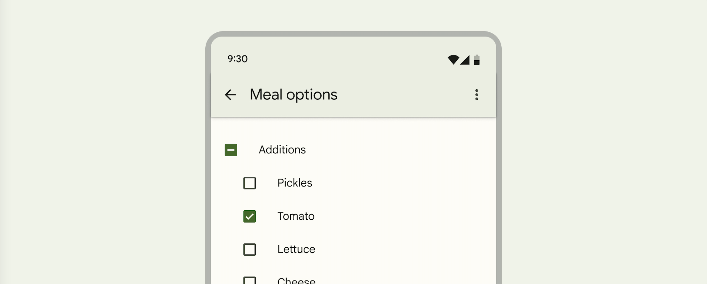
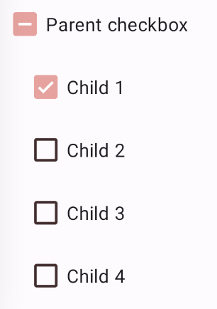

<!--docs:
title: "Material selection controls: CheckBoxes"
layout: detail
section: components
excerpt: "Selection controls allow the user to select options."
iconId: checkbox
path: /catalog/checkboxes/
-->

# Selection controls: checkboxes

[Selection controls](https://material.io/components/selection-controls#usage)
allow the user to select options.

Use checkboxes to:

*   Select one or more options from a list
*   Present a list containing sub-selections
*   Turn an item on or off in a desktop environment



**Contents**

*   [Using checkboxes](#using-checkboxes)
*   [Checkbox](#checkbox)
*   [Theming checkboxes](#theming-checkboxes)

## Using checkboxes

Before you can use Material checkboxes, you need to add a dependency to the
Material Components for Android library. For more information, go to the
[Getting started](https://github.com/material-components/material-components-android/tree/master/docs/getting-started.md)
page.

_**Note:** `<CheckBox>` is auto-inflated as
`<com.google.android.material.button.MaterialCheckBox>` via
`MaterialComponentsViewInflater` when using a non-Bridge
`Theme.MaterialComponents.*` theme._

### Making checkboxes accessible

Checkboxes support content labeling for accessibility and are readable by most
screen readers, such as TalkBack. Text rendered in check boxes is automatically
provided to accessibility services. Additional content labels are usually
unnecessary.

## Checkbox

A checkbox is a square button with a check to denote its current state.
Checkboxes allow the user to select one or more items from a set. Checkboxes can
be used to turn an option on or off. Unlike radio buttons, changes in the states
of one checkbox do not usually affect other checkboxes.

_**Note:** Checkboxes do not support shape theming and are only rounded square
checkboxes._

### Checkboxes example

API and source code:

*   `MaterialCheckBox`
    *   [Class definition](https://developer.android.com/reference/com/google/android/material/checkbox/MaterialCheckBox)
    *   [Class source](https://github.com/material-components/material-components-android/tree/master/lib/java/com/google/android/material/checkbox/MaterialCheckBox.java)

The following example shows a list of five checkboxes.


In the layout:

```xml
<CheckBox
    android:layout_width="match_parent"
    android:layout_height="match_parent"
    android:checked="true"
    android:text="@string/label_1"/>
<CheckBox
    android:layout_width="match_parent"
    android:layout_height="match_parent"
    android:text="@string/label_2"/>
<CheckBox
    android:layout_width="match_parent"
    android:layout_height="match_parent"
    android:text="@string/label_3"/>
<CheckBox
    android:layout_width="match_parent"
    android:layout_height="match_parent"
    android:text="@string/label_4"/>
<CheckBox
    android:layout_width="match_parent"
    android:layout_height="match_parent"
    android:enabled="false"
    android:text="@string/label_5"/>
```

In code:

```kt
// To check a checkbox
checkbox.isChecked = true

// To listen for a checkbox's checked/unchecked state changes
checkbox.setOnCheckedChangeListener { buttonView, isChecked
    // Responds to checkbox being checked/unchecked
}
```

## Key properties

### Checkbox attributes

&nbsp;                     | Attribute                                  | Related method(s)                                          | Default value
-------------------------- | ------------------------------------------ | ---------------------------------------------------------- | -------------
**To use material colors** | `app:useMaterialThemeColors`               | `setUseMaterialThemeColors`<br/>`isUseMaterialThemeColors` | `true` (ignored if `app:buttonTint` is set)
**Color**                  | `app:buttonTint`                           | `setButtonTintList`<br/>`getButtonTintList`                | `null`
**Min size**               | `android:minWidth`<br/>`android:minHeight` | `(set/get)MinWidth`<br/>`(set/get)MinHeight`               | `?attr/minTouchTargetSize`

The color of the checbox defaults to `?attr/colorOnSurface` (unchecked) and
`?attr/colorSecondary` (checked) defined in your app theme. If you want to
override this behavior, as you might with a custom drawable that should not be
tinted, set `app:useMaterialThemeColors` to `false`:

```xml
<CheckBox
        ...
    app:useMaterialThemeColors="false"
    />
```

### Text label attributes

&nbsp;         | Attribute                | Related method(s)                  | Default value
-------------- | ------------------------ | ---------------------------------- | -------------
**Text label** | `android:text`           | `setText`<br/>`getText`            | `null`
**Color**      | `android:textColor`      | `setTextColor`<br/>`getTextColors` | inherits from `AppCompatCheckBox`
**Typography** | `android:textAppearance` | `setTextAppearance`                | inherits from `AppCompatCheckBox`

### Checkbox states

Checkboxes can be selected, unselected, or indeterminate. Checkboxes have
enabled, disabled, hover, focused, and pressed states.


_**Note:** `MaterialCheckBox` does not support the indeterminate state. Only
selected and unselected states are supported._

### Styles

&nbsp;            | Style
----------------- | ---------------------------------------------------
**Default style** | `Widget.MaterialComponents.CompoundButton.CheckBox`

Default style theme attribute: `?attr/checkboxStyle`

See the full list of
[styles](https://github.com/material-components/material-components-android/tree/master/lib/java/com/google/android/material/checkbox/res/values/styles.xml)
and
[attrs](https://github.com/material-components/material-components-android/tree/master/lib/java/com/google/android/material/checkbox/res/values/attrs.xml).

## Theming checkboxes

Checkboxes support
[Material Theming](https://material.io/components/selection-controls#theming)
and can be customized in terms of color and typography.

### Checkbox theming example

API and source code:

*   `MaterialCheckBox`
    *   [Class definition](https://developer.android.com/reference/com/google/android/material/checkbox/MaterialCheckBox)
    *   [Class source](https://github.com/material-components/material-components-android/tree/master/lib/java/com/google/android/material/checkbox/MaterialCheckBox.java)

The following example shows a checkbox with Material Theming.



#### Implementing checkbox theming

Using theme attributes in `res/values/styles.xml` (themes all checkboxes and
affects other components):

```xml
<style name="Theme.App" parent="Theme.MaterialComponents.*">
    ...
    <item name="colorOnSurface">@color/shrine_pink_900</item>
    <item name="colorSecondary">@color/shrine_pink_100</item>
</style>

```

or using default style theme attributes, styles and theme overlays (themes all
checkboxes but does not affect other components):

```xml
<style name="Theme.App" parent="Theme.MaterialComponents.*">
    ...
    <item name="checkboxStyle">@style/Widget.App.CheckBox</item>
</style>

<style name="Widget.App.CheckBox" parent="Widget.MaterialComponents.CompoundButton.CheckBox">
    <item name="materialThemeOverlay">@style/ThemeOverlay.App.CheckBox</item>
</style>

<style name="ThemeOverlay.App.CheckBox" parent="">
    <item name="colorOnSurface">@color/shrine_pink_900</item>
    <item name="colorSecondary">@color/shrine_pink_100</item>
</style>
```

you can also change the checkbox colors via the `?attr/buttonTint` attribute:

```xml
<style name="Widget.App.CheckBox" parent="Widget.MaterialComponents.CompoundButton.CheckBox">
   <item name="buttonTint">@color/button_tint</item>
</style>
```

and in `color/button_tint.xml`:

```xml
<selector xmlns:android="http://schemas.android.com/apk/res/android">
  <item android:color=">@color/shrine_pink_900" android:state_checked="true"/>
  <item android:alpha="0.38" android:color="@color/shrine_pink_100" android:state_enabled="false"/>
  <item android:color="@color/shrine_pink_100"/>
</selector>
```

or using the styles in the layout (affects only this checkbox):

```xml
<CheckBox
        ...
    style="@style/Widget.App.CheckBox"
    />
```
