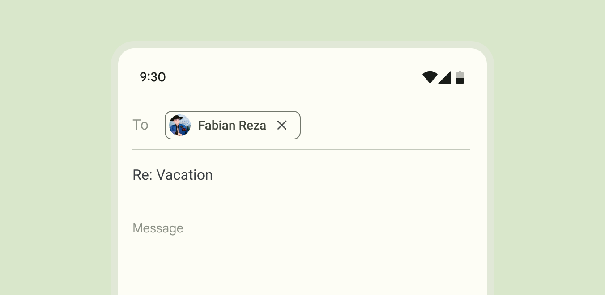
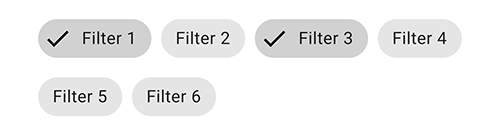
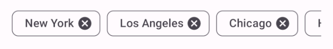
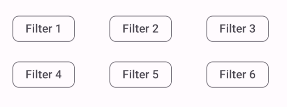
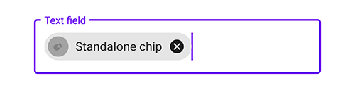
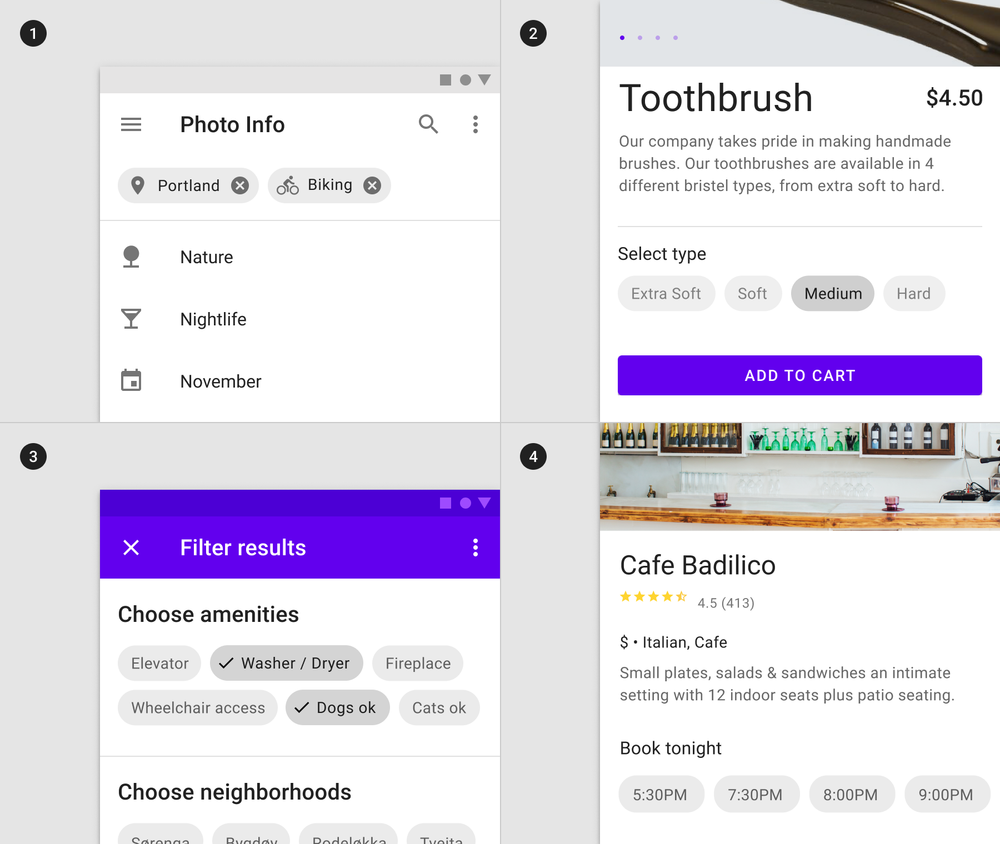
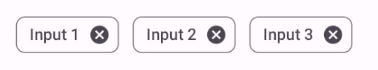
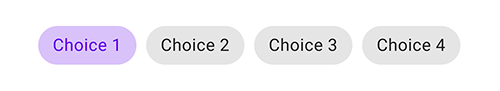
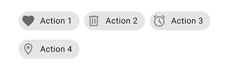
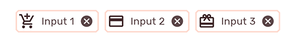

title: "Material chips"
layout: detail
section: components
excerpt: "Chips are compact elements that represent an input, attribute, or action."
iconId: chip
path: /catalog/chips/
-->

# Chips

[Chips](https://material.io/components/chips) are compact elements that
represent an input, attribute, or action.



**Contents**

*   [Using chips](#using-chips)
*   [Input chip](#input-chip)
*   [Choice chip](#choice-chip)
*   [Filter chip](#filter-chip)
*   [Action chip](#action-chip)
*   [Theming chips](#theming-chips)

## Using chips

Before you can use Material chips, you need to add a dependency to the Material
Components for Android library. For more information, go to the
[Getting started](https://github.com/material-components/material-components-android/tree/master/docs/getting-started.md)
page.

Chips allow users to enter information, make selections, filter content, or
trigger actions. While buttons are expected to appear consistently and with
familiar calls to action, chips should appear dynamically as a group of multiple
interactive elements.

### Usage

A `Chip` can be added in a layout like so:

```xml
<com.google.android.material.chip.Chip
    android:id="@+id/chip"
    android:layout_width="wrap_content"
    android:layout_height="wrap_content"
    android:text="@string/text"/>
```

Changes to a chip can be observed like so:

```kt
chip.setOnClickListener {
   // Responds to chip click
}

chip.setOnCloseIconClickListener {
    // Responds to chip's close icon click if one is present
}

chip.setOnCheckedChangeListener { chip, isChecked ->
    // Responds to chip checked/unchecked
}
```

### Making chips accessible

Chips support content labeling for accessibility and are readable by most screen
readers, such as TalkBack. Text rendered in chips is automatically provided to
accessibility services. Additional content labels are usually unnecessary.

#### Touch target

The `Widget.MaterialComponents.Chip.*` styles use an
[InsetDrawable](https://developer.android.com/reference/android/graphics/drawable/InsetDrawable)
to extend the chip's touch target when necessary to meet Android's recommended
[accessibility touch target size](https://support.google.com/accessibility/android/answer/7101858).
Developers can override a chip's minimum touch target size using
`app:chipMinTouchTargetSize`. Developers can set whether the chip should extend
its bounds to meet the minimum touch target using `app:ensureMinTouchTargetSize`
(true by default).

#### RTL-friendly chip layout

Call `setLayoutDirection(int)` with `View.LAYOUT_DIRECTION_LOCALE` to ensure
that the chip's ancestor `TextView` renders the text with proper paddings.
Without this, the initial rendering may look like the text has its padding set
according to LTR direction.

```kt
chip.layoutDirection = View.LAYOUT_DIRECTION_LOCALE
```

### Grouping chips with `ChipGroup`

Chips are mostly commonly used in groups. We recommend using `ChipGroup` as it
is purpose-built to handle multi-chip layout and behavior patterns (as opposed
to a `ViewGroup` such as `RecyclerView`). A `ChipGroup` contains a set of
`Chip`s and manages their layout and multiple-exclusion scope, similarly to a
`RadioGroup`.

#### Layout Mode

A `ChipGroup` rearranges chips across multiple rows by default.



```xml
<com.google.android.material.chip.ChipGroup
    android:id="@+id/chipGroup"
    android:layout_width="match_parent"
    android:layout_height="wrap_content">

  <!-- Chips can be declared here, or added dynamically. -->

</com.google.android.material.chip.ChipGroup>
```

A `ChipGroup` can also constrain its chips to a single row using the
`app:singleLine` attribute. Using a single row may necessitate wrapping the
`ChipGroup` with a `HorizontalScrollView`.



```xml
<HorizontalScrollView
    ... >
  <com.google.android.material.chip.ChipGroup
      ...
      app:singleLine="true">

    <!-- Chips can be declared here, or added dynamically. -->

  </com.google.android.material.chip.ChipGroup>
</HorizontalScrollView>
```

#### Chip spacing

A `ChipGroup` can insert spacing between chips in a row or between rows of chips
using the `app:chipSpacing` attribute. Different horizontal and vertical spacing
can be set using the `app:chipSpacingHorizontal` and `app:chipSpacingVertical`
attributes.

_**Note:** The `app:chipMinTouchTargetSize` will overrule vertical chip spacing
for lower amounts._

The following image shows a group of chips with
`app:chipSpacingHorizontal="42dp"`.



#### Multiple exclusion scope

The `app:singleSelection` attribute can be set to true on a `ChipGroup` in order
to toggle single-select and multi-select behavior of child chips.

The `app:selectionRequired` attribute can be set to true on a `ChipGroup` to
prevent all child chips from being deselected (i.e. at least one option should
be chosen).

#### Handling checked chips

Changes to child chip checked/unchecked state can be observed like so:

```kt
val checkedChipId = chipGroup.checkedChipId // Returns View.NO_ID if singleSelection = false
val checkedChipIds = chipGroup.checkedChipIds // Returns a list of the selected chips' IDs, if any

chipGroup.setOnCheckedChangeListener { group, checkedId ->
    // Responds to child chip checked/unchecked
}
```

### Standalone `ChipDrawable`

A standalone `ChipDrawable` can be used in contexts that require a `Drawable`.
The most obvious use case is in text fields that "chipify" contacts, commonly
found in communications apps.

To use a `ChipDrawable`, first create a chip resource in `res/xml`. Note that
you must use the `<chip` tag in your resource file.

In `res/xml/standalone_chip.xml`:

```xml
<chip
    xmlns:android="http://schemas.android.com/apk/res/android"
    xmlns:app="http://schemas.android.com/apk/res-auto"
    app:chipIcon="@drawable/ic_chip"
    android:text="@string/text"/>
```

Entry Chip is the default Material style for standalone `ChipDrawable`s, but you
can apply any of the other styles using the `style` attribute. All the
attributes on `Chip` can be applied to a `ChipDrawable` resource.

A ChipDrawable can then be inflated from this resource like so:

```xml
val chipDrawable = ChipDrawable.createFromResource(context, R.xml.chip)
```

For example, consider an editable e-mail address field that converts addresses
to chips as they are typed and validated. We can combine `ChipDrawable` with
spans to add a chip to an `EditText`:



```kt
chip.setBounds(0, 0, chip.intrinsicWidth, chip.intrinsicHeight)
val span = ImageSpan(chip)
val text = editText.text!!
text.setSpan(span, 0, text.length, Spanned.SPAN_EXCLUSIVE_EXCLUSIVE)
```

## Types

There are four types of chips: 1\. [input (entry)](#input-chip), 2\.
[choice](#choice-chip), 3\. [filter](#filter-chip), 4\. [action](#action-chip)



API and source code:

*   `Chip`
    *   [Class definition](https://developer.android.com/reference/com/google/android/material/chip/Chip)
    *   [Class source](https://github.com/material-components/material-components-android/tree/master/lib/java/com/google/android/material/chip/Chip.java)
*   `ChipGroup`
    *   [Class definition](https://developer.android.com/reference/com/google/android/material/chip/ChipGroup)
    *   [Class source](https://github.com/material-components/material-components-android/tree/master/lib/java/com/google/android/material/chip/ChipGroup.java)
*   `ChipDrawable`
    *   [Class definition](https://developer.android.com/reference/com/google/android/material/chip/ChipDrawable)
    *   [Class source](https://github.com/material-components/material-components-android/tree/master/lib/java/com/google/android/material/chip/ChipDrawable.java)

### Input chip

Input chips (refered to as **entry** chips in Android) represent a complex piece
of information in compact form, such as an entity (person, place, or thing) or
text. They enable user input and verify that input by converting text into
chips.

#### Input chip example

The following example shows three input chips.



In the layout:

```xml
<com.google.android.material.chip.ChipGroup
    ...>
  <com.google.android.material.chip.Chip
      android:id="@+id/chip_1"
      style="@style/Widget.MaterialComponents.Chip.Entry"
      android:layout_width="wrap_content"
      android:layout_height="wrap_content"
      android:text="@string/text_input_1"/>

  <com.google.android.material.chip.Chip
      ...
      style="@style/Widget.MaterialComponents.Chip.Entry"
      android:text="@string/text_input_2"/>

  <com.google.android.material.chip.Chip
      ...
      style="@style/Widget.MaterialComponents.Chip.Entry"
      android:text="@string/text_input_3"/>

</com.google.android.material.chip.ChipGroup>
```

### Choice chip

Choice chips allow selection of a single chip from a set of options.

Choice chips clearly delineate and display options in a compact area. They are a
good alternative to toggle buttons, radio buttons, and single select menus.

#### Caveats

If you add choice chips to a dialog (which has 24dp elevation), disable the
chips' elevation overlays to ensure that there is sufficient color contrast when
the chips are checked.

```xml
<style name="Widget.MyApp.Chip.Choice" parent="Widget.MaterialComponents.Chip.Choice">
  ...
    <item name="materialThemeOverlay">@style/ThemeOverlay.MyApp.Chip.Choice</item>
</style>

<!-- Disabling elevation overlays because when chip's default background/surface
     composite are combined with elevation overlays in a highly elevated dialog,
     the resulting color becomes too light and causes contrast
     issues. -->
<style name="ThemeOverlay.MyApp.Chip.Choice" parent="">
    <item name="elevationOverlayEnabled">false</item>
</style>
```

#### Choice chip example

The following example shows four choice chips.



In the layout:

```xml
<com.google.android.material.chip.ChipGroup
    ...>
  <com.google.android.material.chip.Chip
      android:id="@+id/chip_1"
      style="@style/Widget.MaterialComponents.Chip.Choice"
      android:layout_width="wrap_content"
      android:layout_height="wrap_content"
      android:checked="true"
      android:text="@string/text_choice_1"/>

  <com.google.android.material.chip.Chip
      ...
      style="@style/Widget.MaterialComponents.Chip.Choice"
      android:text="@string/text_choice_2"/>

  <com.google.android.material.chip.Chip
      ...
      style="@style/Widget.MaterialComponents.Chip.Choice"
      android:text="@string/text_choice_3"/>

  <com.google.android.material.chip.Chip
      ...
      style="@style/Widget.MaterialComponents.Chip.Choice"
      android:text="@string/text_choice_4"/>

</com.google.android.material.chip.ChipGroup>
```

### Filter chip

Filter chips use tags or descriptive words to filter content.

Filter chips clearly delineate and display options in a compact area. They are a
good alternative to toggle buttons or checkboxes.

#### Filter chip example

The following example shows six filter chips.


In the layout:

```xml
<com.google.android.material.chip.ChipGroup
    ...>
  <com.google.android.material.chip.Chip
      android:id="@+id/chip_1"
      style="@style/Widget.MaterialComponents.Chip.Choice"
      android:layout_width="wrap_content"
      android:layout_height="wrap_content"
      android:checked="true"
      android:text="@string/text_filter_1"/>

  <com.google.android.material.chip.Chip
      ...
      style="@style/Widget.MaterialComponents.Chip.Choice"
       android:text="@string/text_filter_2"/>

  <com.google.android.material.chip.Chip
      ...
      style="@style/Widget.MaterialComponents.Chip.Choice"
      android:checked="true"
      android:text="@string/text_filter_3"/>

  <com.google.android.material.chip.Chip
      ...
      style="@style/Widget.MaterialComponents.Chip.Choice"
      android:text="@string/text_filter_4"/>

  <com.google.android.material.chip.Chip
      ...
      style="@style/Widget.MaterialComponents.Chip.Choice"
      android:text="@string/text_filter_5"/>

  <com.google.android.material.chip.Chip
      ...
      style="@style/Widget.MaterialComponents.Chip.Choice"
      android:text="@string/text_filter_6"/>

</com.google.android.material.chip.ChipGroup>
```

### Action chip

Action chips offer actions related to primary content. They should appear
dynamically and contextually in a UI.

An alternative to action chips are buttons, which should appear persistently and
consistently.

#### Action chip example

The following example shows four action chips.



In the layout:

```xml
<com.google.android.material.chip.ChipGroup
    ...>
  <com.google.android.material.chip.Chip
      android:id="@+id/chip_1"
      android:layout_width="wrap_content"
      android:layout_height="wrap_content"
      app:chipIconTint="@color/icon_tint"
      app:chipIcon="@drawable/favorite"
      android:text="@string/text_action_1"/>

  <com.google.android.material.chip.Chip
      ...
      app:chipIconTint="@color/icon_tint"
      app:chipIcon="@drawable/delete"
      android:text="@string/text_action_2"/>

  <com.google.android.material.chip.Chip
      ...
      app:chipIconTint="@color/icon_tint"
      app:chipIcon="@drawable/alarm"
      android:text="@string/text_action_3"/>

  <com.google.android.material.chip.Chip
      ...
      app:chipIconTint="@color/icon_tint"
      app:chipIcon="@drawable/location"
      android:text="@string/text_action_4"/>

</com.google.android.material.chip.ChipGroup>
```

### Anatomy and key properties

The following is an anatomy diagram of a chip:


1.  Container
1.  Thumbnail (optional)
1.  Text
1.  Remove icon (optional)

#### Container attributes

&nbsp;               | Attribute                                                       | Related method(s)                                                                                          | Default value
-------------------- | --------------------------------------------------------------- | ---------------------------------------------------------------------------------------------------------- | -------------
**Color**            | `app:chipBackgroundColor`                                       | `setChipBackgroundColor`<br/>`setChipBackgroundColorResource`<br/>`getChipBackgroundColor`                 | `?attr/colorOnSurface` at 10%
**Ripple color**     | `app:rippleColor`                                               | `setRippleColor`<br/>`setRippleColorResource`<br/>`getRippleColor`                                         | `?attr/colorOnSurface` at 12%
**Stroke width**     | `app:chipStrokeWidth`                                           | `setStrokeWidth`<br/>`setChipStrokeWidthResource`<br/>`getChipStrokeWidth`                                 | `0dp`
**Stroke color**     | `app:chipStrokeColor`                                           | `setStrokeColor`<br/>`setChipStrokeColorResource`<br/>`getChipStrokeColor`                                 | `?attr/colorOnSurface`
**Min height**       | `app:chipMinHeight`                                             | `setChipMinHeight`<br/>`setChipMinHeightResource`<br/>`getChipMinHeight`                                   | `32dp`
**Padding**          | `app:chipStartPadding`<br/>`app:chipEndPadding`                 | `setChip*Padding`<br/>`setChip*PaddingResource`<br/>`getChip*Padding`                                      | `4dp` (start)<br/>`6dp` (end)
**Shape**            | `app:shapeAppearance`<br/>`shapeAppearanceOverlay`              | `setShapeAppearanceModel`<br/>`getShapeAppearanceModel`                                                    | `?attr/shapeAppearanceSmallComponent` with 50% `cornerSize`
**Min touch target** | `app:chipMinTouchTargetSize`<br/>`app:ensureMinTouchTargetSize` | `ensureAccessibleTouchTarget`<br/>`setEnsureAccessibleTouchTarget`<br/>`shouldEnsureAccessibleTouchTarget` | `48dp`<br/>`true`
**Checkable**        | `android:checkable`                                             | `setCheckable`<br/>`setCheckableResource`<br/>`isCheckable`                                                | `true` (entry, filter, choice)

#### Thumbnail attributes

**Chip icon**

&nbsp;         | Attribute                                       | Related method(s)                                                     | Default value
-------------- | ----------------------------------------------- | --------------------------------------------------------------------- | -------------
**Icon**       | `app:chipIcon`                                  | `setChipIconVisible`<br/>`isChipIconVisible`                          | `null`
**Visibility** | `app:chipIconVisible`                           | `setChipIcon`<br/>`setChipIconResource`<br/>`getChipIcon`             | `true` (action and entry)
**Color**      | `app:chipIconTint`                              | `setChipIconTint`<br/>`setChipIconTintResource`<br/>`getChipIconTint` | `null`
**Size**       | `app:chipIconSize`                              | `setChipIconSize`<br/>`setChipIconSizeResource`<br/>`getChipIconSize` | `24dp`
**Padding**    | `app:iconStartPadding`<br/>`app:iconEndPadding` | `setIcon*Padding`<br/>`setIcon*PaddingResource`<br/>`getIcon*Padding` | `0dp`

**Checked icon**

If visible, the checked icon overlays the chip icon.

&nbsp;         | Attribute                | Related method(s)                                                              | Default value
-------------- | ------------------------ | ------------------------------------------------------------------------------ | -------------
**Icon**       | `app:checkedIcon`        | `setCheckedIconVisible`<br/>`isCheckedIconVisible`                             | `@drawable/ic_mtrl_chip_checked_circle`
**Visibility** | `app:checkedIconVisible` | `setCheckedIcon`<br/>`setCheckedIconResource`<br/>`getCheckedIcon`             | `true` (entry, filter, choice)
**Color**      | `app:checkedIconTint`    | `setCheckedIconTint`<br/>`setCheckedIconTintResource`<br/>`getCheckedIconTint` | `null`

#### Text attributes

&nbsp;         | Attribute                                       | Related method(s)                                                           | Default value
-------------- | ----------------------------------------------- | --------------------------------------------------------------------------- | -------------
**Text label** | `android:text`                                  | `setChipText`<br/>`setChipTextResource`<br/>`getChipText`                   | `null`
**Color**      | `android:textColor`                             | `setTextColor`<br/>`getTextColors`                                          | `?attr/colorOnSurface` at 87%
**Typography** | `android:textAppearance`                        | `setTextAppearance`<br/>`setTextAppearanceResource`<br/>`getTextAppearance` | `?attr/textAppearanceBody2`
**Padding**    | `app:textStartPadding`<br/>`app:textEndPadding` | `setText*Padding`<br/>`setText*PaddingResource`<br/>`getText*Padding`       | `8dp` (start)<br/>`6dp` (end)

#### Remove (close) icon attributes

&nbsp;                  | Attribute                                                 | Related method(s)                                                                    | Default value
----------------------- | --------------------------------------------------------- | ------------------------------------------------------------------------------------ | -------------
**Icon**                | `app:closeIcon`                                           | `setCloseIcon`<br/>`setCloseIconResource`<br/>`getCloseIcon`                         | `@drawable/ic_mtrl_chip_close_circle`
**Visibility**          | `app:closeIconVisible`                                    | `setCloseIconVisible`<br/>`isCloseIconVisible`                                       | `true` for entry
**Color**               | `app:closeIconTint`                                       | `setCloseIconTint`<br/>`setCloseIconTintResource`<br/>`getCloseIconTint`             | `?attr/colorOnSurface` at 87%
**Size**                | `app:closeIconSize`                                       | `setCloseIconSize`<br/>`setCloseIconSizeResource`<br/>`getCloseIconSize`             | `18dp`
**Padding**             | `app:closeIconStartPadding`<br/>`app:closeIconEndPadding` | `setCloseIcon*Padding`<br/>`setCloseIcon*PaddingResource`<br/>`getCloseIcon*Padding` | `2dp`
**Content description** | N/A                                                       | `setCloseIconContentDescription`<br/>`getCloseIconContentDescription`                | `@string/mtrl_chip_close_icon_content_description`

#### `ChipGroup` attributes

&nbsp;        | Attribute                                                                   | Related method(s)                                             | Default value
------------- | --------------------------------------------------------------------------- | ------------------------------------------------------------- | -------------
**Layout**    | `app:singleLine`                                                            | `setSingleLine`<br/>`isSingleLine`                            | `false`
**Selection** | `app:singleSelection`<br/>`app:selectionRequired`                           | `setSingleSelection*`<br/>`isSingleSelection*`                | `false`<br/>`false`
**Spacing**   | `app:chipSpacing`<br/>`app:chipSpacingHorizontal`<br/>`chipSpacingVertical` | `setSpacing*`<br/>`setChipSpacing*Resource`<br/>`getSpacing*` | `8dp`

#### Styles

&nbsp;                          | Style
------------------------------- | ---------------------------------------
**Default style (action chip)** | `Widget.MaterialComponents.Chip.Action`
**Input (entry) chip**          | `Widget.MaterialComponents.Chip.Entry`
**Choice chip**                 | `Widget.MaterialComponents.Chip.Choice`
**Filter chip**                 | `Widget.MaterialComponents.Chip.Filter`
**`ChipGroup` style**           | `Widget.MaterialComponents.ChipGroup`

#### Theme attributes

&nbsp;             | Theme attribute             | Default style
------------------ | --------------------------- | -------------
**`Chip`**         | `?attr/chipStyle`           | `Widget.MaterialComponents.Chip.Action`
**`ChipGroup`**    | `?attr/chipGroupStyle`      | `Widget.MaterialComponents.ChipGroup`
**`ChipDrawable`** | `?attr/chipStandaloneStyle` | `Widget.MaterialComponents.Chip.Entry`

See the full list of
[styles](https://github.com/material-components/material-components-android/tree/master/lib/java/com/google/android/material/chip/res/values/styles.xml)
and
[attributes](https://github.com/material-components/material-components-android/tree/master/lib/java/com/google/android/material/chip/res/values/attrs.xml).

## Theming chips

Chips support [Material Theming](https://material.io/components/chips/#theming)
and can be customized in terms of color, typography and shape.

### Chip theming example

API and source code:

*   `Chip`
    *   [Class definition](https://developer.android.com/reference/com/google/android/material/chip/Chip)
    *   [Class source](https://github.com/material-components/material-components-android/tree/master/lib/java/com/google/android/material/chip/Chip.java)
*   `ChipGroup`
    *   [Class definition](https://developer.android.com/reference/com/google/android/material/chip/ChipGroup)
    *   [Class source](https://github.com/material-components/material-components-android/tree/master/lib/java/com/google/android/material/chip/ChipGroup.java)
*   `ChipDrawable`
    *   [Class definition](https://developer.android.com/reference/com/google/android/material/chip/ChipDrawable)
    *   [Class source](https://github.com/material-components/material-components-android/tree/master/lib/java/com/google/android/material/chip/ChipDrawable.java)

The following example shows chips with Material Theming.



#### Implementing chip theming

Using theme attributes and styles in `res/values/styles.xml` (themes all chips
and affects other components):

```xml
<style name="Theme.App" parent="Theme.MaterialComponents.*">
    ...
    <item name="colorOnSurface">@color/shrine_pink_100</item>
    <item name="textAppearanceBody2">@style/TextAppearance.App.Body2</item>
    <item name="shapeAppearanceSmallComponent">@style/ShapeAppearance.App.SmallComponent</item>
    <item name="chipStyle">@style/Widget.App.Chip</item>
</style>

<style name="Widget.App.Chip" parent="Widget.MaterialComponents.Chip.Entry">
    <item name="chipIconTint">@color/shrine_pink_900</item>
    <item name="chipBackgroundColor">@color/white</item>
    <item name="chipStrokeWidth">2dp</item>
    <item name="chipStrokeColor">@color/stroke_tint</item>
    <item name="checkedIconVisible">false</item>
    <item name="shapeAppearanceOverlay">@null</item>
</style>

<style name="TextAppearance.App.Body2" parent="TextAppearance.MaterialComponents.Body2">
    <item name="fontFamily">@font/rubik_regular</item>
    <item name="android:fontFamily">@font/rubik_regular</item>
</style>

<style name="ShapeAppearance.App.SmallComponent" parent="ShapeAppearance.MaterialComponents.SmallComponent">
    <item name="cornerFamily">cut</item>
    <item name="cornerSize">4dp</item>
</style>
```

in `color/stroke_tint.xml`:

```xml
<selector xmlns:android="http://schemas.android.com/apk/res/android">
  <item android:color="?attr/colorOnSurface" android:state_checked="true"/>
  <item android:color="@color/shrine_pink_100"/>
</selector>
```

or using a default style theme attribute, styles and a theme overlay (themes all
chips but does not affect other components):

```xml
<style name="Theme.App" parent="Theme.MaterialComponents.*">
    ...
    <item name="chipStyle">@style/Widget.App.Chip</item>
</style>

<style name="Widget.App.Chip" parent="Widget.MaterialComponents.Chip.Entry">
    <item name="materialThemeOverlay">@style/ThemeOverlay.App.Chip</item>
    <item name="android:textAppearance">@style/TextAppearance.App.Body2</item>
    <item name="shapeAppearance">@style/ShapeAppearance.App.SmallComponent</item>
    ...
</style>

<style name="ThemeOverlay.App.Chip" parent="">
    <item name="colorOnSurface">@color/shrine_pink_900</item>
</style>
```

or using the style in the layout (affects only this specific chips):

```xml
<com.google.android.material.chip.Chip
      ...
      style="@style/Widget.App.Chip."  />
```
