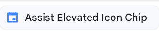
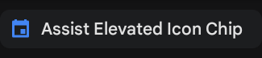
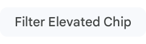
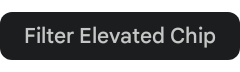

<!--docs:
title: "Chips"
layout: detail
section: components
excerpt: "Chips are compact elements that represent an input, attribute, or action."
iconId: chip
path: /catalog/chips/
-->

# Chips

[Chips](https://material.io/components/chips) are compact elements that
represent an input, attribute, or action. Chips help people enter information,
make selections, filter content, or trigger actions. There are four variants of
chips.


1.  Assist chip
2.  Filter chip
3.  Input chip
4.  Suggestion chip

**Note:** Images use various dynamic color schemes.

## Design & API documentation

*   [Material 3 (M3) spec](https://m3.material.io/components/chips/overview)
*   [API reference](https://developer.android.com/reference/com/google/android/material/chip/package-summary)

## Anatomy

<details>

<summary><h4>Assist</h4></summary>


1.  Container
2.  Label text
3.  Leading icon

</details>
<details>

<summary><h4>Filter</h4></summary>


1.  Container
2.  Label text
3.  Leading icon
4.  Trailing icon

</details>
<details>

<summary><h4>Input</h4></summary>


1.  Container
2.  Label text
3.  Trailing icon
4.  Leading icon

</details>
<details>

<summary><h4>Suggestion</h4></summary>


1.  Container
2.  Label text

</details>

More details on anatomy items in the
[component guidelines](https://m3.material.io/components/chips/guidelines#ba2e35f7-7771-42fb-afad-e774229295e3).

## Key properties

### Container attributes

Element              | Attribute                                                       | Related method(s)                                                                                          | Default value
-------------------- | --------------------------------------------------------------- | ---------------------------------------------------------------------------------------------------------- | -------------
**Color**            | `app:chipBackgroundColor`                                       | `setChipBackgroundColor`<br/>`setChipBackgroundColorResource`<br/>`getChipBackgroundColor`                 | `?attr/colorOnSurface`
**Ripple color**     | `app:rippleColor`                                               | `setRippleColor`<br/>`setRippleColorResource`<br/>`getRippleColor`                                         | `?attr/colorOnSecondaryContainer` at 12%
**Stroke width**     | `app:chipStrokeWidth`                                           | `setStrokeWidth`<br/>`setChipStrokeWidthResource`<br/>`getChipStrokeWidth`                                 | `1dp`
**Stroke color**     | `app:chipStrokeColor`                                           | `setStrokeColor`<br/>`setChipStrokeColorResource`<br/>`getChipStrokeColor`                                 | `?attr/colorOnSurface`
**Min height**       | `app:chipMinHeight`                                             | `setChipMinHeight`<br/>`setChipMinHeightResource`<br/>`getChipMinHeight`                                   | `32dp`
**Padding**          | `app:chipStartPadding`<br/>`app:chipEndPadding`                 | `setChip*Padding`<br/>`setChip*PaddingResource`<br/>`getChip*Padding`                                      | `4dp` (start)<br/>`6dp` (end)
**Shape**            | `app:shapeAppearance`<br/>`shapeAppearanceOverlay`              | `setShapeAppearanceModel`<br/>`getShapeAppearanceModel`                                                    | `?attr/shapeAppearanceCornerSmall` with 8dp `cornerSize`
**Min touch target** | `app:chipMinTouchTargetSize`<br/>`app:ensureMinTouchTargetSize` | `ensureAccessibleTouchTarget`<br/>`setEnsureAccessibleTouchTarget`<br/>`shouldEnsureAccessibleTouchTarget` | `48dp`<br/>`true`
**Checkable**        | `android:checkable`                                             | `setCheckable`<br/>`setCheckableResource`<br/>`isCheckable`                                                | `true` (input, suggestion, filter)

### Thumbnail attributes

**Chip icon**

Element        | Attribute                                       | Related method(s)                                                     | Default value
-------------- | ----------------------------------------------- | --------------------------------------------------------------------- | -------------
**Icon**       | `app:chipIcon`                                  | `setChipIcon`<br/>`setChipIconResource`<br/>`getChipIcon`             | `null`
**Visibility** | `app:chipIconVisible`                           | `setChipIconVisible`<br/>`isChipIconVisible`                          | `true` (input and assist)
**Color**      | `app:chipIconTint`                              | `setChipIconTint`<br/>`setChipIconTintResource`<br/>`getChipIconTint` | `null`
**Size**       | `app:chipIconSize`                              | `setChipIconSize`<br/>`setChipIconSizeResource`<br/>`getChipIconSize` | `18dp`
**Padding**    | `app:iconStartPadding`<br/>`app:iconEndPadding` | `setIcon*Padding`<br/>`setIcon*PaddingResource`<br/>`getIcon*Padding` | `0dp`, `-2dp` (filter end padding)

**Checked icon**

If visible, the checked icon overlays the chip icon.

Element        | Attribute                | Related method(s)                                                              | Default value
-------------- | ------------------------ | ------------------------------------------------------------------------------ | -------------
**Icon**       | `app:checkedIcon`        | `setCheckedIcon`<br/>`setCheckedIconResource`<br/>`getCheckedIcon`             | `@drawable/ic_m3_chip_checked_circle`
**Visibility** | `app:checkedIconVisible` | `setCheckedIconVisible`<br/>`isCheckedIconVisible`                             | `true` (input, filter)
**Color**      | `app:checkedIconTint`    | `setCheckedIconTint`<br/>`setCheckedIconTintResource`<br/>`getCheckedIconTint` | `null`

### Text attributes

Element        | Attribute                                       | Related method(s)                                                           | Default value
-------------- | ----------------------------------------------- | --------------------------------------------------------------------------- | -------------
**Text label** | `android:text`                                  | `setChipText`<br/>`setChipTextResource`<br/>`getChipText`                   | `null`
**Color**      | `android:textColor`                             | `setTextColor`<br/>`getTextColors`                                          | `?attr/colorOnSurfaceVariant`
**Typography** | `android:textAppearance`                        | `setTextAppearance`<br/>`setTextAppearanceResource`<br/>`getTextAppearance` | `?attr/textAppearanceLabelLarge`
**Padding**    | `app:textStartPadding`<br/>`app:textEndPadding` | `setText*Padding`<br/>`setText*PaddingResource`<br/>`getText*Padding`       | `8dp` (start)<br/>`6dp` (end)

### Remove (close) icon attributes

Element                 | Attribute                                                 | Related method(s)                                                                    | Default value
----------------------- | --------------------------------------------------------- | ------------------------------------------------------------------------------------ | -------------
**Icon**                | `app:closeIcon`                                           | `setCloseIcon`<br/>`setCloseIconResource`<br/>`getCloseIcon`                         | `@drawable/ic_mtrl_chip_close_circle`
**Visibility**          | `app:closeIconVisible`                                    | `setCloseIconVisible`<br/>`isCloseIconVisible`                                       | `true` for input
**Color**               | `app:closeIconTint`                                       | `setCloseIconTint`<br/>`setCloseIconTintResource`<br/>`getCloseIconTint`             | `?attr/colorOnSurfaceVariant`
**Size**                | `app:closeIconSize`                                       | `setCloseIconSize`<br/>`setCloseIconSizeResource`<br/>`getCloseIconSize`             | `18dp`
**Padding**             | `app:closeIconStartPadding`<br/>`app:closeIconEndPadding` | `setCloseIcon*Padding`<br/>`setCloseIcon*PaddingResource`<br/>`getCloseIcon*Padding` | `4dp` input end padding
**Content description** | N/A                                                       | `setCloseIconContentDescription`<br/>`getCloseIconContentDescription`                | `@string/mtrl_chip_close_icon_content_description`

### `ChipGroup` attributes

Element       | Attribute                                                                   | Related method(s)                                             | Default value
------------- | --------------------------------------------------------------------------- | ------------------------------------------------------------- | -------------
**Layout**    | `app:singleLine`                                                            | `setSingleLine`<br/>`isSingleLine`                            | `false`
**Selection** | `app:singleSelection`<br/>`app:selectionRequired`                           | `setSingleSelection*`<br/>`isSingleSelection*`                | `false`<br/>`false`
**Spacing**   | `app:chipSpacing`<br/>`app:chipSpacingHorizontal`<br/>`chipSpacingVertical` | `setSpacing*`<br/>`setChipSpacing*Resource`<br/>`getSpacing*` | `8dp`

### Styles

Element                         | Style
------------------------------- | ----------------------------------
**Default style (assist chip)** | `Widget.Material3.Chip.Assist`
**Input chip**                  | `Widget.Material3.Chip.Input`
**Suggestion chip**             | `Widget.Material3.Chip.Suggestion`
**Filter chip**                 | `Widget.Material3.Chip.Filter`
**`ChipGroup` style**           | `Widget.Material3.ChipGroup`

### Theme attributes

Element            | Theme attribute             | Default style
------------------ | --------------------------- | -------------
**`Chip`**         | `?attr/chipStyle`           | `Widget.Material3.Chip.Assist`
**`ChipGroup`**    | `?attr/chipGroupStyle`      | `Widget.Material3.ChipGroup`
**`ChipDrawable`** | `?attr/chipStandaloneStyle` | `Widget.Material3.Chip.Input`

See the full list of
[styles](https://github.com/material-components/material-components-android/tree/master/lib/java/com/google/android/material/chip/res/values/styles.xml)
and
[attributes](https://github.com/material-components/material-components-android/tree/master/lib/java/com/google/android/material/chip/res/values/attrs.xml).

## Variants of chips

Choose the type of chip based on its purpose and author.

Does the chip represent an action (assist chip) or filter results (filter chip)?
Is its content generated by the product (suggestion chip), or by the person
using the product (input chip)?

<details>

<summary><h3>Assist chip</h3></summary>

Assist chips represent smart or automated actions that can span multiple apps,
such as opening a calendar event from the home screen. Assist chips function as
though the user asked an assistant to complete the action.

#### Default

The following example shows an activated assist chip.


In the layout:

```xml
<TextView
  android:id="@+id/textView_1"
  android:layout_width="wrap_content"
  android:layout_height="wrap_content"
  android:text="@string/label_1"
  android:textAlignment="viewEnd"/>

<com.google.android.material.chip.Chip
  android:id="@+id/chip_1"
  android:layout_width="wrap_content"
  android:layout_height="wrap_content"
  android:text="@string/chip_text_1"
  app:chipIcon="@drawable/circle_1"
  app:ensureMinTouchTargetSize="true"/>
```

#### Elevated





Assist chips also come in an `Elevated` style variant, to be used when placed
against a background that needs protection, such as an image.

```xml
<com.google.android.material.chip.Chip
    style="@style/Widget.Material3.Chip.Assist.Elevated"
    android:layout_width="wrap_content"
    android:layout_height="wrap_content"
    android:text="@string/chip_text"
    app:chipIcon="@drawable/ic_action_24"/>
```

</details>

<details>

<summary><h3>Filter chip</h3></summary>

Filter chips use tags or descriptive words to filter content.

Filter chips clearly delineate and display options in a compact area. They are a
good alternative to toggle buttons or checkboxes.

#### Default

The following example shows filter chips.


In the layout:

```xml
<com.google.android.material.chip.ChipGroup
    ...>
  <com.google.android.material.chip.Chip
      android:id="@+id/chip_1"
      style="@style/Widget.Material3.Chip.Filter"
      android:layout_width="wrap_content"
      android:layout_height="wrap_content"
      android:checked="true"
      android:text="@string/text_filter_1"/>

  <com.google.android.material.chip.Chip
      ...
       style="@style/Widget.Material3.Chip.Filter"
       android:text="@string/text_filter_2"/>

  <com.google.android.material.chip.Chip
      ...
      style="@style/Widget.Material3.Chip.Filter"
      android:checked="true"
      android:text="@string/text_filter_3"/>

  <com.google.android.material.chip.Chip
      ...
      style="@style/Widget.Material3.Chip.Filter"
      android:text="@string/text_filter_4"/>

  <com.google.android.material.chip.Chip
      ...
      style="@style/Widget.Material3.Chip.Filter"
      android:text="@string/text_filter_5"/>

  <com.google.android.material.chip.Chip
      ...
      style="@style/Widget.Material3.Chip.Filter"
      android:text="@string/text_filter_6"/>

</com.google.android.material.chip.ChipGroup>
```

#### Elevated





Filter chips also come in an `Elevated` style variant, to be used when placed
against a background that needs protection, such as an image.

```xml
<com.google.android.material.chip.Chip
    style="@style/Widget.Material3.Chip.Filter.Elevated"
    android:layout_width="wrap_content"
    android:layout_height="wrap_content"
    android:text="@string/chip_text" />
```

</details>

<details>

<summary><h3>Input chip</h3></summary>

Input chips represent a discrete piece of information in compact form, such as
an entity (person, place, or thing) or text. They enable user input and verify
that input by converting text into chips.

#### Input chip example

The following example shows input chips.


In the layout:

```xml
<com.google.android.material.chip.ChipGroup
    ...>
  <com.google.android.material.chip.Chip
      android:id="@+id/chip_1"
      style="?attr/chipStandaloneStyle"
      android:layout_width="wrap_content"
      android:layout_height="wrap_content"
      android:text="@string/text_input_1"/>

  <com.google.android.material.chip.Chip
      ...
      style="?attr/chipStandaloneStyle"
      android:text="@string/text_input_2"/>

  <com.google.android.material.chip.Chip
      ...
      style="?attr/chipStandaloneStyle"
      android:text="@string/text_input_3"/>

</com.google.android.material.chip.ChipGroup>
```

</details>

<details>

<summary><h3>Suggestion chip</h3></summary>

Suggestion chips help narrow a user’s intent by presenting dynamically generated
suggestions, such as offering possible responses or providing search filters.

The following example shows suggestion chips in default and elevated styles.


#### Default

In the layout:

```xml
<com.google.android.material.chip.ChipGroup
    ...>
   <com.google.android.material.chip.Chip
    android:layout_width="wrap_content"
    android:layout_height="wrap_content"
    style="@style/Widget.Material3.Chip.Suggestion"
    android:text="@string/chip_text_1"/>
  <com.google.android.material.chip.Chip
    ...
    style="@style/Widget.Material3.Chip.Suggestion"
    android:text="@string/chip_text_2"/>

</com.google.android.material.chip.ChipGroup>
```

#### Elevated

Suggestion chips also come in an `Elevated` style variant. These chips
should be used when placed against a background that needs protection, such
as an image.

```xml
<com.google.android.material.chip.Chip
    style="@style/Widget.Material3.Chip.Suggestion.Elevated"
    android:layout_width="wrap_content"
    android:layout_height="wrap_content"
    android:text="@string/chip_text_3" />
```

**Note:** Suggestion chips are usually placed within a `ChipGroup`.

</details>

## Code implementation

Before you can use Material chips, you need to add a dependency to the Material
Components for Android library. For more information, go to the
[Getting started](https://github.com/material-components/material-components-android/tree/master/docs/getting-started.md)
page.

### Adding chips

Chips allow users to enter information, make selections, filter content, or
trigger actions. While buttons are expected to appear consistently and with
familiar calls to action, chips should appear dynamically as a group of multiple
interactive elements.

API and source code:

*   `Chip`
    *   [Class definition](https://developer.android.com/reference/com/google/android/material/chip/Chip)
    *   [Class source](https://github.com/material-components/material-components-android/tree/master/lib/java/com/google/android/material/chip/Chip.java)
*   `ChipGroup`
    *   [Class definition](https://developer.android.com/reference/com/google/android/material/chip/ChipGroup)
    *   [Class source](https://github.com/material-components/material-components-android/tree/master/lib/java/com/google/android/material/chip/ChipGroup.java)
*   `ChipDrawable`
    *   [Class definition](https://developer.android.com/reference/com/google/android/material/chip/ChipDrawable)
    *   [Class source](https://github.com/material-components/material-components-android/tree/master/lib/java/com/google/android/material/chip/ChipDrawable.java)

A `Chip` can be added in a layout with the following:

```xml
<com.google.android.material.chip.Chip
    android:id="@+id/chip"
    android:layout_width="wrap_content"
    android:layout_height="wrap_content"
    android:text="@string/text"/>
```

Changes to a chip can be observed with the following:

```kt
chip.setOnClickListener {
   // Responds to chip click
}

chip.setOnCloseIconClickListener {
    // Responds to chip's close icon click if one is present
}

chip.setOnCheckedChangeListener { chip, isChecked ->
    // Responds to chip checked/unchecked
}
```

### Making chips accessible

Chips support content labeling for accessibility and are readable by most screen
readers, such as TalkBack. Text rendered in chips is automatically provided to
accessibility services. Additional content labels are usually unnecessary.

#### Touch target

The `Widget.Material3.Chip.*` styles use an
[InsetDrawable](https://developer.android.com/reference/android/graphics/drawable/InsetDrawable)
to extend the chip's touch target when necessary to meet Android's recommended
[accessibility touch target size](https://support.google.com/accessibility/android/answer/7101858).
Developers can override a chip's minimum touch target size using
`app:chipMinTouchTargetSize`. Developers can set whether the chip should extend
its bounds to meet the minimum touch target using `app:ensureMinTouchTargetSize`
(true by default).

#### RTL-friendly chip layout

Call `setLayoutDirection(int)` with `View.LAYOUT_DIRECTION_LOCALE` to ensure
that the chip's ancestor `TextView` renders the text with proper paddings.
Without this, the initial rendering may look like the text has its padding set
according to LTR direction.

```kt
chip.layoutDirection = View.LAYOUT_DIRECTION_LOCALE
```

### Grouping chips with `ChipGroup`

Chips are most commonly used in groups. We recommend using `ChipGroup` because
it is purpose-built to handle multi-chip layouts and behavior patterns, as
opposed to a `ViewGroup` such as `RecyclerView`. A `ChipGroup` contains a set of
`Chip`s and manages their layout and multiple-exclusion scope, similarly to a
`RadioGroup`.

<details>
<summary><h4>Layout mode</h4></summary>

A `ChipGroup` rearranges chips across multiple rows by default.


```xml
<com.google.android.material.chip.ChipGroup
    android:id="@+id/chipGroup"
    android:layout_width="match_parent"
    android:layout_height="wrap_content">

  <!-- Chips can be declared here, or added dynamically. -->

</com.google.android.material.chip.ChipGroup>
```

A `ChipGroup` can also constrain its chips to a single row using the
`app:singleLine` attribute. Using a single row may necessitate wrapping the
`ChipGroup` with a `HorizontalScrollView`.


```xml
<HorizontalScrollView
    ... >
  <com.google.android.material.chip.ChipGroup
      ...
      app:singleLine="true">

    <!-- Chips can be declared here, or added dynamically. -->

  </com.google.android.material.chip.ChipGroup>
</HorizontalScrollView>
```

</details>

<details>
<summary><h4>Chip spacing</h4></summary>

A `ChipGroup` can insert spacing between chips in a row or between rows of chips
using the `app:chipSpacing` attribute. Different horizontal and vertical spacing
can be set using the `app:chipSpacingHorizontal` and `app:chipSpacingVertical`
attributes.

**Note:** The `app:chipMinTouchTargetSize` will overrule vertical chip spacing
for lower amounts.

The following image shows a group of chips with
`app:chipSpacingHorizontal="42dp"`.


</details>

<details>
<summary><h4>Multiple exclusion scope</h4></summary>

The `app:singleSelection` attribute can be set to true on a `ChipGroup` in order
to toggle single-select and multi-select behaviors of child chips.

The `app:selectionRequired` attribute can be set to true on a `ChipGroup` to
prevent all child chips from being deselected - at least one option should be
chosen.

</details>

<details>
<summary><h4>Handling checked chips</h4></summary>

Changes to child chip's checked/unchecked state can be observed with the
following:

```kt
val checkedChipId = chipGroup.checkedChipId // Returns View.NO_ID if singleSelection = false
val checkedChipIds = chipGroup.checkedChipIds // Returns a list of the selected chips' IDs, if any

chipGroup.setOnCheckedStateChangeListener { group, checkedIds ->
    // Responds to child chip checked/unchecked
}
```

</details>

### Using standalone `ChipDrawable`

A standalone `ChipDrawable` can be used in contexts that require a `Drawable`.
The most obvious use case is in text fields that "chipify" contacts, commonly
found in communications apps.

To use a `ChipDrawable`, first create a chip resource in `res/xml`. Note that
you must use the `<chip` tag in your resource file.

In `res/xml/standalone_chip.xml`:

```xml
<chip
    xmlns:android="http://schemas.android.com/apk/res/android"
    xmlns:app="http://schemas.android.com/apk/res-auto"
    app:chipIcon="@drawable/ic_chip"
    android:text="@string/text"/>
```

Input Chip is the default Material style for standalone `ChipDrawable`s, but you
can apply any of the other styles using the `style` attribute. All the
attributes on `Chip` can be applied to a `ChipDrawable` resource.

A ChipDrawable can then be inflated from this resource with the following:

```xml
val chipDrawable = ChipDrawable.createFromResource(context, R.xml.chip)
```

For example, consider an editable e-mail address field that converts addresses
to chips as they are typed and validated. We can combine `ChipDrawable` with
spans to add a chip to an `EditText`:


```kt
chip.setBounds(0, 0, chip.intrinsicWidth, chip.intrinsicHeight)
val span = ImageSpan(chip)
val text = editText.text!!
text.setSpan(span, 0, text.length, Spanned.SPAN_EXCLUSIVE_EXCLUSIVE)
```

## Customizing chips

### Theming chips

Chips support the customization of color, typography, and shape.

#### Chip theming example

API and source code:

*   `Chip`
    *   [Class definition](https://developer.android.com/reference/com/google/android/material/chip/Chip)
    *   [Class source](https://github.com/material-components/material-components-android/tree/master/lib/java/com/google/android/material/chip/Chip.java)
*   `ChipGroup`
    *   [Class definition](https://developer.android.com/reference/com/google/android/material/chip/ChipGroup)
    *   [Class source](https://github.com/material-components/material-components-android/tree/master/lib/java/com/google/android/material/chip/ChipGroup.java)
*   `ChipDrawable`
    *   [Class definition](https://developer.android.com/reference/com/google/android/material/chip/ChipDrawable)
    *   [Class source](https://github.com/material-components/material-components-android/tree/master/lib/java/com/google/android/material/chip/ChipDrawable.java)

The following example shows chips with Material theming.


##### Implementing chip theming

Use theme attributes and styles in `res/values/styles.xml`, which applies the
theme to all chips and affects other components:

```xml
<style name="Theme.App" parent="Theme.Material3.*">
    ...
    <item name="colorOnSurface">@color/shrine_pink_100</item>
    <item name="textAppearanceBodyMedium">@style/TextAppearance.App.BodyMedium</item>
    <item name="shapeAppearanceCornerSmall">@style/ShapeAppearance.App.Corner.Small</item>
    <item name="chipStyle">@style/Widget.App.Chip</item>
</style>

<style name="Widget.App.Chip" parent="Widget.Material3.Chip.Input">
    <item name="chipIconTint">@color/shrine_pink_900</item>
    <item name="chipBackgroundColor">@color/white</item>
    <item name="chipStrokeWidth">2dp</item>
    <item name="chipStrokeColor">@color/stroke_tint</item>
    <item name="checkedIconVisible">false</item>
    <item name="shapeAppearanceOverlay">@null</item>
</style>

<style name="TextAppearance.App.BodyMedium" parent="TextAppearance.Material3.BodyMedium">
    <item name="fontFamily">@font/rubik_regular</item>
    <item name="android:fontFamily">@font/rubik_regular</item>
</style>

<style name="ShapeAppearance.App.Corner.Small" parent="ShapeAppearance.Material3.Corner.Small">
    <item name="cornerFamily">cut</item>
    <item name="cornerSize">4dp</item>
</style>
```

in `color/stroke_tint.xml`:

```xml
<selector xmlns:android="http://schemas.android.com/apk/res/android">
  <item android:color="?attr/colorOnSurface" android:state_checked="true"/>
  <item android:color="@color/shrine_pink_100"/>
</selector>
```

Use a default style theme attribute, styles and a theme overlay. This applies
the theme to all chips but does not affect other components:

```xml
<style name="Theme.App" parent="Theme.Material3.*">
    ...
    <item name="chipStyle">@style/Widget.App.Chip</item>
</style>

<style name="Widget.App.Chip" parent="Widget.Material3.Chip.Input">
    <item name="materialThemeOverlay">@style/ThemeOverlay.App.Chip</item>
    <item name="android:textAppearance">@style/TextAppearance.App.BodyMedium</item>
    <item name="shapeAppearance">@style/ShapeAppearance.App.Corner.Small</item>
    ...
</style>

<style name="ThemeOverlay.App.Chip" parent="">
    <item name="colorOnSurfaceVariant">@color/shrine_pink_900</item>
</style>
```

Use the style in the layout, which affects only specific chips:

```xml
<com.google.android.material.chip.Chip
      ...
      style="@style/Widget.App.Chip"  />
```
