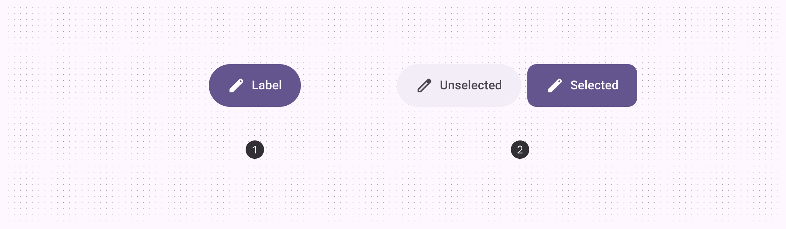
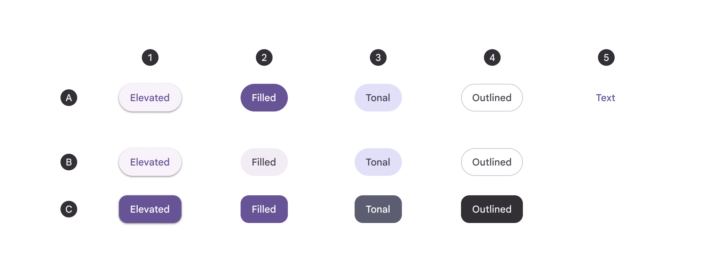
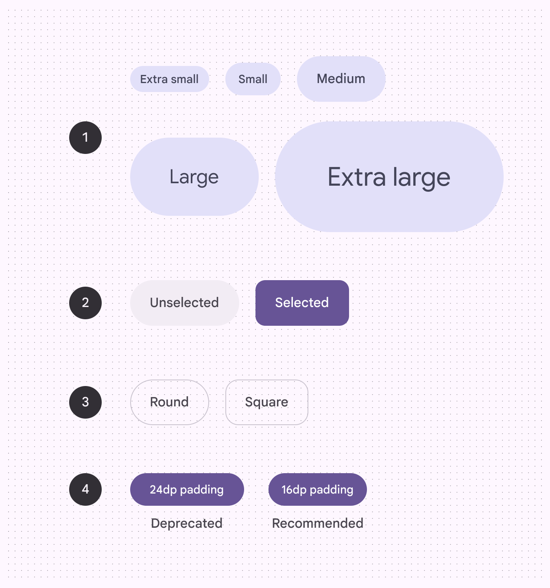
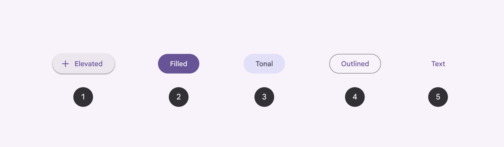

<!--docs:
title: "Buttons"
layout: detail
section: components
excerpt: "A customizable button component with updated visual styles."
iconId: materialbutton
path: /catalog/buttons/
-->

# Buttons

[Buttons](https://m3.material.io/components/buttons/overview) allow users to
take actions, and make choices, with a single tap. There are two variants of
common buttons.



1.  Default button
2.  Toggle button



There are five button styles, in order of emphasis:

1.  Elevated button
2.  Filled button
3.  Filled tonal button
4.  Outlined button
5.  Text button

Buttons have default and toggle behaviors:

A. Default button <br>
B. Toggle (unselected) <br>
C. Toggle (selected) <br>

**Note:** Images use various dynamic color schemes.

## Design & API documentation

*   [Material 3 (M3) spec](https://m3.material.io/components/buttons/overview)
*   [API reference](https://developer.android.com/reference/com/google/android/material/button/package-summary)

## Anatomy


1.  Container
2.  Label text
3.  Icon (optional)

More details on anatomy items in the
[component guidelines](https://m3.material.io/components/buttons/guidelines#653b660b-e9d8-48ad-9f53-67fb3d76e09e).

## M3 Expressive update

Before you can use `Material3Expressive` component styles, follow the
[`Material3Expressive` themes setup instructions](https://github.com/material-components/material-components-android/tree/master/docs/getting-started.md#material3expressive-themes).



1.  Five sizes
2.  Toggle (selection)
3.  Two shapes
4.  Two small padding widths

Buttons now have a wider variety of shapes and sizes, toggle functionality, and
can change shape when selected
[More on M3 Expressive](https://m3.material.io/blog/building-with-m3-expressive)

**Types and naming:**

*   Default and toggle (selection)
*   Color styles are now configurations. (elevated, filled, tonal, outlined,
    text)

**Shapes:**

*   Round and square options
*   Shape morphs when pressed
*   Shape morphs when selected

**Sizes:**

*   Extra small
*   Small (existing, default)
*   Medium
*   Large
*   Extra large

**New padding for small buttons:**

*   16dp (recommended to match padding of new sizes)
*   24dp (deprecated)

## Key properties

<details>

<summary><h3>Elevated button</h3></summary>

#### Text label attributes

Element        | Attribute                | Related method(s)                 | Default value
-------------- | ------------------------ | --------------------------------- | -------------
**Text label** | `android:text`           | `setText`<br/>`getText`           | `null`
**Color**      | `android:textColor`      | `setTextColor`<br/>`getTextColor` | `?attr/colorOnSurface` (see all [states](https://github.com/material-components/material-components-android/tree/master/lib/java/com/google/android/material/button/res/color/m3_text_button_foreground_color_selector.xml))
**Typography** | `android:textAppearance` | `setTextAppearance`               | `?attr/textAppearanceLabelLarge`

#### Container attributes

Element          | Attribute             | Related method(s)                                                            | Default value
---------------- | --------------------- | ---------------------------------------------------------------------------- | -------------
**Color**        | `app:backgroundTint`  | `setBackgroundColor`<br/>`setBackgroundTintList`<br/>`getBackgroundTintList` | `?attr/colorSurfaceContainerLow` (see all [states](https://github.com/material-components/material-components-android/tree/master/lib/java/com/google/android/material/button/res/color/m3_text_button_background_color_selector.xml))
**Stroke color** | `app:strokeColor`     | `setStrokeColor`<br/>`setStrokeColorResource`<br/>`getStrokeColor`           | `null`
**Stroke width** | `app:strokeWidth`     | `setStrokeWidth`<br/>`setStrokeWidthResource`<br/>`getStrokeWidth`           | `0dp`
**Shape**        | `app:shapeAppearance` | `setShapeAppearanceModel`<br/>`getShapeAppearanceModel`                      | `ShapeAppearance.M3.Sys.Shape.Corner.Full`
**Elevation**    | `app:elevation`       | `setElevation`<br/>`getElevation`                                            | `1dp`
**Ripple color** | `app:rippleColor`     | `setRippleColor`<br/>`setRippleColorResource`<br/>`getRippleColor`           | `?attr/colorOnSurface` at 16% opacity (see all [states](https://github.com/material-components/material-components-android/tree/master/lib/java/com/google/android/material/button/res/color/m3_text_button_ripple_color_selector.xml))

#### Icon attributes

Element                                         | Attribute         | Related method(s)                                         | Default value
----------------------------------------------- | ----------------- | --------------------------------------------------------- | -------------
**Icon**                                        | `app:icon`        | `setIcon`<br/>`setIconResource`<br/>`getIcon`             | `null`
**Color**                                       | `app:iconTint`    | `setIconTint`<br/>`setIconTintResource`<br/>`getIconTint` | `?attr/colorOnSurface` (see all [states](https://github.com/material-components/material-components-android/tree/master/lib/java/com/google/android/material/button/res/color/m3_text_button_foreground_color_selector.xml))
**Size**                                        | `app:iconSize`    | `setIconSize`<br/>`getIconSize`                           | `wrap_content`
**Gravity** (position relative to text label)   | `app:iconGravity` | `setIconGravity`<br/>`getIconGravity`                     | `start`
**Padding** (space between icon and text label) | `app:iconPadding` | `setIconPadding`<br/>`getIconPadding`                     | `8dp`

#### Styles

Element           | Style
----------------- | ---------------------------------------------
**Default style** | `Widget.Material3.Button.ElevatedButton`
**Icon style**    | `Widget.Material3.Button.ElevatedButton.Icon`

Default style theme attribute: `?attr/materialButtonElevatedStyle`

See the full list of
[styles](https://github.com/material-components/material-components-android/tree/master/lib/java/com/google/android/material/button/res/values/styles.xml)
and
[attrs](https://github.com/material-components/material-components-android/tree/master/lib/java/com/google/android/material/button/res/values/attrs.xml).

</details>

<details>

<summary><h3>Filled button</h3></summary>

#### Text label attributes

Element        | Attribute                | Related method(s)                 | Default value
-------------- | ------------------------ | --------------------------------- | -------------
**Text label** | `android:text`           | `setText`<br/>`getText`           | `null`
**Color**      | `android:textColor`      | `setTextColor`<br/>`getTextColor` | `?attr/colorOnPrimary` (see all [states](https://github.com/material-components/material-components-android/tree/master/lib/java/com/google/android/material/color/res/color/m3_button_foreground_color_selector.xml))
**Typography** | `android:textAppearance` | `setTextAppearance`               | `?attr/textAppearanceLabelLarge`

#### Container attributes

Element          | Attribute             | Related method(s)                                                            | Default value
---------------- | --------------------- | ---------------------------------------------------------------------------- | -------------
**Color**        | `app:backgroundTint`  | `setBackgroundColor`<br/>`setBackgroundTintList`<br/>`getBackgroundTintList` | `?attr/colorPrimary` (see all [states](https://github.com/material-components/material-components-android/tree/master/lib/java/com/google/android/material/color/res/color/m3_button_background_color_selector.xml))
**Stroke color** | `app:strokeColor`     | `setStrokeColor`<br/>`setStrokeColorResource`<br/>`getStrokeColor`           | `null`
**Stroke width** | `app:strokeWidth`     | `setStrokeWidth`<br/>`setStrokeWidthResource`<br/>`getStrokeWidth`           | `0dp`
**Shape**        | `app:shapeAppearance` | `setShapeAppearanceModel`<br/>`getShapeAppearanceModel`                      | `ShapeAppearance.M3.Sys.Shape.Corner.Full`
**Elevation**    | `app:elevation`       | `setElevation`<br/>`getElevation`                                            | `2dp`
**Ripple color** | `app:rippleColor`     | `setRippleColor`<br/>`setRippleColorResource`<br/>`getRippleColor`           | `?attr/colorOnPrimary` at 16% opacity (see all [states](https://github.com/material-components/material-components-android/tree/master/lib/java/com/google/android/material/color/res/color/m3_button_ripple_color_selector.xml))

#### Icon attributes

Element                                         | Attribute         | Related method(s)                                         | Default value
----------------------------------------------- | ----------------- | --------------------------------------------------------- | -------------
**Icon**                                        | `app:icon`        | `setIcon`<br/>`setIconResource`<br/>`getIcon`             | `null`
**Color**                                       | `app:iconTint`    | `setIconTint`<br/>`setIconTintResource`<br/>`getIconTint` | `?attr/colorOnPrimary` (see all [states](https://github.com/material-components/material-components-android/tree/master/lib/java/com/google/android/material/color/res/color/m3_button_foreground_color_selector.xml))
**Size**                                        | `app:iconSize`    | `setIconSize`<br/>`getIconSize`                           | `wrap_content`
**Gravity** (position relative to text label)   | `app:iconGravity` | `setIconGravity`<br/>`getIconGravity`                     | `start`
**Padding** (space between icon and text label) | `app:iconPadding` | `setIconPadding`<br/>`getIconPadding`                     | `8dp`

#### Styles

Element                   | Style
------------------------- | -----------------------------------------------
**Default style**         | `Widget.Material3.Button`
**Icon style**            | `Widget.Material3.Button.Icon`
**Unelevated style**      | `Widget.Material3.Button.UnelevatedButton`
**Unelevated icon style** | `Widget.Material3.Button.UnelevatedButton.Icon`

Default style theme attribute: `?attr/materialButtonStyle`

See the full list of
[styles](https://github.com/material-components/material-components-android/tree/master/lib/java/com/google/android/material/button/res/values/styles.xml)
and
[attrs](https://github.com/material-components/material-components-android/tree/master/lib/java/com/google/android/material/button/res/values/attrs.xml).

</details>

<details>

<summary><h3>Filled tonal button</h3></summary>

#### Text label attributes

Element        | Attribute                | Related method(s)                 | Default value
-------------- | ------------------------ | --------------------------------- | -------------
**Text label** | `android:text`           | `setText`<br/>`getText`           | `null`
**Color**      | `android:textColor`      | `setTextColor`<br/>`getTextColor` | `?attr/colorOnSecondaryContainer` (see all [states](https://github.com/material-components/material-components-android/tree/master/lib/java/com/google/android/material/color/res/color/m3_button_foreground_color_selector.xml))
**Typography** | `android:textAppearance` | `setTextAppearance`               | `?attr/textAppearanceLabelLarge`

#### Container attributes

Element          | Attribute             | Related method(s)                                                            | Default value
---------------- | --------------------- | ---------------------------------------------------------------------------- | -------------
**Color**        | `app:backgroundTint`  | `setBackgroundColor`<br/>`setBackgroundTintList`<br/>`getBackgroundTintList` | `?attr/colorSecondaryContainer` (see all [states](https://github.com/material-components/material-components-android/tree/master/lib/java/com/google/android/material/color/res/color/m3_button_background_color_selector.xml))
**Stroke color** | `app:strokeColor`     | `setStrokeColor`<br/>`setStrokeColorResource`<br/>`getStrokeColor`           | `null`
**Stroke width** | `app:strokeWidth`     | `setStrokeWidth`<br/>`setStrokeWidthResource`<br/>`getStrokeWidth`           | `0dp`
**Shape**        | `app:shapeAppearance` | `setShapeAppearanceModel`<br/>`getShapeAppearanceModel`                      | `ShapeAppearance.M3.Sys.Shape.Corner.Full`
**Elevation**    | `app:elevation`       | `setElevation`<br/>`getElevation`                                            | `2dp`
**Ripple color** | `app:rippleColor`     | `setRippleColor`<br/>`setRippleColorResource`<br/>`getRippleColor`           | `?attr/colorOnSecondaryContainer` at 16% opacity (see all [states](https://github.com/material-components/material-components-android/tree/master/lib/java/com/google/android/material/color/res/color/m3_tonal_button_ripple_color_selector.xml))

#### Icon attributes

Element                                         | Attribute         | Related method(s)                                         | Default value
----------------------------------------------- | ----------------- | --------------------------------------------------------- | -------------
**Icon**                                        | `app:icon`        | `setIcon`<br/>`setIconResource`<br/>`getIcon`             | `null`
**Color**                                       | `app:iconTint`    | `setIconTint`<br/>`setIconTintResource`<br/>`getIconTint` | `?attr/colorOnSecondaryContainer` (see all [states](https://github.com/material-components/material-components-android/tree/master/lib/java/com/google/android/material/color/res/color/m3_button_foreground_color_selector.xml))
**Size**                                        | `app:iconSize`    | `setIconSize`<br/>`getIconSize`                           | `wrap_content`
**Gravity** (position relative to text label)   | `app:iconGravity` | `setIconGravity`<br/>`getIconGravity`                     | `start`
**Padding** (space between icon and text label) | `app:iconPadding` | `setIconPadding`<br/>`getIconPadding`                     | `8dp`

#### Styles

Element           | Style
----------------- | ------------------------------------------
**Default style** | `Widget.Material3.Button.TonalButton`
**Icon style**    | `Widget.Material3.Button.TonalButton.Icon`

Default style theme attribute: `?attr/materialButtonTonalStyle`

See the full list of
[styles](https://github.com/material-components/material-components-android/tree/master/lib/java/com/google/android/material/button/res/values/styles.xml)
and
[attrs](https://github.com/material-components/material-components-android/tree/master/lib/java/com/google/android/material/button/res/values/attrs.xml).

</details>

<details>

<summary><h3>Outlined button</h3></summary>

#### Text label attributes

Element        | Attribute                | Related method(s)                 | Default value
-------------- | ------------------------ | --------------------------------- | -------------
**Text label** | `android:text`           | `setText`<br/>`getText`           | `null`
**Color**      | `android:textColor`      | `setTextColor`<br/>`getTextColor` | `?attr/colorOnSurface` (see all [states](https://github.com/material-components/material-components-android/tree/master/lib/java/com/google/android/material/button/res/color/m3_text_button_foreground_color_selector.xml))
**Typography** | `android:textAppearance` | `setTextAppearance`               | `?attr/textAppearanceLabelLarge`

#### Container attributes

Element          | Attribute             | Related method(s)                                                            | Default value
---------------- | --------------------- | ---------------------------------------------------------------------------- | -------------
**Color**        | `app:backgroundTint`  | `setBackgroundColor`<br/>`setBackgroundTintList`<br/>`getBackgroundTintList` | `@android:color/transparent` (see all [states](https://github.com/material-components/material-components-android/tree/master/lib/java/com/google/android/material/button/res/color/m3_text_button_background_color_selector.xml))
**Stroke color** | `app:strokeColor`     | `setStrokeColor`<br/>`setStrokeColorResource`<br/>`getStrokeColor`           | `?attr/colorOnSurface` at 12% opacity (see all [states](https://github.com/material-components/material-components-android/tree/master/lib/java/com/google/android/material/button/res/color/m3_button_outline_color_selector.xml))
**Stroke width** | `app:strokeWidth`     | `setStrokeWidth`<br/>`setStrokeWidthResource`<br/>`getStrokeWidth`           | `1dp`
**Shape**        | `app:shapeAppearance` | `setShapeAppearanceModel`<br/>`getShapeAppearanceModel`                      | `ShapeAppearance.M3.Sys.Shape.Corner.Full`
**Elevation**    | `app:elevation`       | `setElevation`<br/>`getElevation`                                            | `0dp`
**Ripple color** | `app:rippleColor`     | `setRippleColor`<br/>`setRippleColorResource`<br/>`getRippleColor`           | `?attr/colorOnSurface` at 16% opacity (see all [states](https://github.com/material-components/material-components-android/tree/master/lib/java/com/google/android/material/button/res/color/m3_text_button_ripple_color_selector.xml))

#### Icon attributes

Element                                         | Attribute         | Related method(s)                                         | Default value
----------------------------------------------- | ----------------- | --------------------------------------------------------- | -------------
**Icon**                                        | `app:icon`        | `setIcon`<br/>`setIconResource`<br/>`getIcon`             | `null`
**Color**                                       | `app:iconTint`    | `setIconTint`<br/>`setIconTintResource`<br/>`getIconTint` | `?attr/colorOnSurface` (see all [states](https://github.com/material-components/material-components-android/tree/master/lib/java/com/google/android/material/button/res/color/m3_text_button_foreground_color_selector.xml))
**Size**                                        | `app:iconSize`    | `setIconSize`<br/>`getIconSize`                           | `wrap_content`
**Gravity** (position relative to text label)   | `app:iconGravity` | `setIconGravity`<br/>`getIconGravity`                     | `start`
**Padding** (space between icon and text label) | `app:iconPadding` | `setIconPadding`<br/>`getIconPadding`                     | `8dp`

#### Styles

Element           | Style
----------------- | ---------------------------------------------
**Default style** | `Widget.Material3.Button.OutlinedButton`
**Icon style**    | `Widget.Material3.Button.OutlinedButton.Icon`

Default style theme attribute: `?attr/materialButtonOutlinedStyle`

See the full list of
[styles](https://github.com/material-components/material-components-android/tree/master/lib/java/com/google/android/material/button/res/values/styles.xml)
and
[attrs](https://github.com/material-components/material-components-android/tree/master/lib/java/com/google/android/material/button/res/values/attrs.xml).

</details>

<details>

<summary><h3>Text button</h3></summary>

#### Text label attributes

Element        | Attribute                | Related method(s)                 | Default value
-------------- | ------------------------ | --------------------------------- | -------------
**Text label** | `android:text`           | `setText`<br/>`getText`           | `null`
**Color**      | `android:textColor`      | `setTextColor`<br/>`getTextColor` | `?attr/colorOnSurface` (see all [states](https://github.com/material-components/material-components-android/tree/master/lib/java/com/google/android/material/button/res/color/m3_text_button_foreground_color_selector.xml))
**Typography** | `android:textAppearance` | `setTextAppearance`               | `?attr/textAppearanceLabelLarge`

#### Container attributes

Element          | Attribute             | Related method(s)                                                            | Default value
---------------- | --------------------- | ---------------------------------------------------------------------------- | -------------
**Color**        | `app:backgroundTint`  | `setBackgroundColor`<br/>`setBackgroundTintList`<br/>`getBackgroundTintList` | `@android:color/transparent` (see all [states](https://github.com/material-components/material-components-android/tree/master/lib/java/com/google/android/material/button/res/color/m3_text_button_background_color_selector.xml))
**Stroke color** | `app:strokeColor`     | `setStrokeColor`<br/>`setStrokeColorResource`<br/>`getStrokeColor`           | `null`
**Stroke width** | `app:strokeWidth`     | `setStrokeWidth`<br/>`setStrokeWidthResource`<br/>`getStrokeWidth`           | `0dp`
**Shape**        | `app:shapeAppearance` | `setShapeAppearanceModel`<br/>`getShapeAppearanceModel`                      | `ShapeAppearance.M3.Sys.Shape.Corner.Full`
**Elevation**    | `app:elevation`       | `setElevation`<br/>`getElevation`                                            | `0dp`
**Ripple color** | `app:rippleColor`     | `setRippleColor`<br/>`setRippleColorResource`<br/>`getRippleColor`           | `?attr/colorOnSurface` at 16% opacity (see all [states](https://github.com/material-components/material-components-android/tree/master/lib/java/com/google/android/material/button/res/color/m3_text_button_ripple_color_selector.xml))

#### Icon attributes

Element                                         | Attribute         | Related method(s)                                         | Default value
----------------------------------------------- | ----------------- | --------------------------------------------------------- | -------------
**Icon**                                        | `app:icon`        | `setIcon`<br/>`setIconResource`<br/>`getIcon`             | `null`
**Color**                                       | `app:iconTint`    | `setIconTint`<br/>`setIconTintResource`<br/>`getIconTint` | `?attr/colorOnSurface` (see all [states](https://github.com/material-components/material-components-android/tree/master/lib/java/com/google/android/material/button/res/color/m3_text_button_foreground_color_selector.xml))
**Size**                                        | `app:iconSize`    | `setIconSize`<br/>`getIconSize`                           | `wrap_content`
**Gravity** (position relative to text label)   | `app:iconGravity` | `setIconGravity`<br/>`getIconGravity`                     | `start`
**Padding** (space between icon and text label) | `app:iconPadding` | `setIconPadding`<br/>`getIconPadding`                     | `8dp`

#### Styles

Element                | Style
---------------------- | -----------------------------------------------------
**Default style**      | `Widget.Material3.Button.TextButton`
**Icon style**         | `Widget.Material3.Button.TextButton.Icon`
**Full Width Buttons** | `Widget.Material3.Button.TextButton.Dialog.FullWidth`

Default style theme attribute: `?attr/borderlessButtonStyle`

See the full list of
[styles](https://github.com/material-components/material-components-android/tree/master/lib/java/com/google/android/material/button/res/values/styles.xml)
and
[attrs](https://github.com/material-components/material-components-android/tree/master/lib/java/com/google/android/material/button/res/values/attrs.xml).

</details>

## Variants of buttons

### Default button

*   Buttons communicate actions that people can take.
*   They are typically placed throughout the UI, in places like:

    *   Dialogs
    *   Modal windows
    *   Forms
    *   Cards
    *   Toolbars

*   They can also be placed within standard button groups.

### Toggle button

*   Toggle buttons should be used for binary selections, such as Save or
    Favorite. When toggle buttons are pressed, they can change color, shape, and
    labels.

*   Toggle buttons should use an outlined icon when unselected, and a filled
    version of the icon when selected. If a filled version doesn’t exist,
    increase the weight instead.

*   By default, toggle buttons change from round to square when selected.

## Code implementation

Before you can use Material buttons, you need to add a dependency to the
Material components for Android library. For more information, go to the
[Getting started](https://github.com/material-components/material-components-android/tree/master/docs/getting-started.md)
page.

**Note:** `<Button>` is auto-inflated as
`<com.google.android.material.button.MaterialButton>` via
`MaterialComponentsViewInflater` when using a `Theme.Material3.*` theme.

### Adding button color styles

*   There are five built-in button color styles: elevated, filled, tonal,
    outlined, and text
*   The default and toggle buttons use different colors
*   Toggle buttons don’t use the text style



1.  Elevated button
2.  Filled button
3.  Filled tonal button
4.  Outlined button
5.  Text button

<details>

<summary><h4>Elevated button</h4></summary>

[Elevated buttons](https://m3.material.io/components/buttons/overview/#elevated-button)
are essentially outlined buttons with a shadow. To prevent shadow creep, only
use them when absolutely necessary, such as when the button requires visual
separation from a patterned background.

##### Elevated button examples

API and source code:

*   `MaterialButton`
    *   [Class description](https://developer.android.com/reference/com/google/android/material/button/MaterialButton)
    *   [Class source](https://github.com/material-components/material-components-android/tree/master/lib/java/com/google/android/material/button/MaterialButton.java)

The following example shows an elevated button with a text label.


In the layout:

```xml
<Button
    style="@style/Widget.Material3.Button.ElevatedButton"
    android:id="@+id/elevatedButton"
    android:layout_width="wrap_content"
    android:layout_height="wrap_content"
    android:text="Elevated button"
/>
```

In code:

```kt
elevatedButton.setOnClickListener {
    // Respond to button press
}
```

##### Adding an icon to an elevated button

The following example shows an elevated button with an icon.


In the layout:

```xml
<Button
    style="@style/Widget.Material3.Button.ElevatedButton.Icon"
    ...
    app:icon="@drawable/ic_add_24dp"
/>
```

</details>

<details>

<summary><h4>Filled button</h4></summary>

[Filled button's](https://m3.material.io/components/buttons#filled-button)
contrasting surface color makes it the most prominent button after the FAB. It’s
used for final or unblocking actions in a flow.

**Note:** The filled button is the default style if the style is not set.

##### Filled button examples

API and source code:

*   `MaterialButton`
    *   [Class description](https://developer.android.com/reference/com/google/android/material/button/MaterialButton)
    *   [Class source](https://github.com/material-components/material-components-android/tree/master/lib/java/com/google/android/material/button/MaterialButton.java)

The following example shows a filled button with a text label and a filled
container.


In the layout:

```xml
<Button
    android:id="@+id/filledButton"
    android:layout_width="wrap_content"
    android:layout_height="wrap_content"
    android:text="Filled button"
/>
```

**Note:** Since this is the default type, you don't need to specify a style tag
as long as you are using a Material components theme. If not, set the style to
`@style/Widget.Material3.Button`.

In code:

```kt
filledButton.setOnClickListener {
    // Respond to button press
}
```

##### Adding an icon to a filled button

The following example shows a filled button with an icon.


In the layout:

```xml
<Button
    style="@style/Widget.Material3.Button.Icon"
    ...
    app:icon="@drawable/ic_add_24dp"
/>
```

</details>

<details>

<summary><h4>Filled tonal button</h4></summary>

[Filled tonal buttons](https://m3.material.io/components/buttons/#filled-tonal-button)
have a lighter background color and darker label color, making them less
visually prominent than a regular filled button. They’re still used for final or
unblocking actions in a flow, but may be better when these actions don’t require
quite so much emphasis.

##### Filled tonal button examples

API and source code:

*   `MaterialButton`
    *   [Class description](https://developer.android.com/reference/com/google/android/material/button/MaterialButton)
    *   [Class source](https://github.com/material-components/material-components-android/tree/master/lib/java/com/google/android/material/button/MaterialButton.java)

The following example shows a filled tonal button with a text label and a filled
container.


In the layout:

```xml
<Button
    style="@style/Widget.Material3.Button.TonalButton"
    android:id="@+id/filledTonalButton"
    android:layout_width="wrap_content"
    android:layout_height="wrap_content"
    android:text="Filled tonal button"
/>
```

In code:

```kt
filledTonalButton.setOnClickListener {
    // Respond to button press
}
```

##### Adding an icon to a filled tonal button

The following example shows a filled tonal button with an icon.


In the layout:

```xml
<Button
    style="@style/Widget.Material3.Button.TonalButton.Icon"
    ...
    app:icon="@drawable/ic_add_24dp"
/>
```

</details>

<details>

<summary><h4>Outlined button</h4></summary>

[Outlined buttons](https://m3.material.io/components/buttons/#outlined-button)
are for actions that need attention but aren’t the primary action, such as “See
all” or “Add to cart.” This is also the button used to give someone the
opportunity to change their mind or escape a flow.

##### Outlined button examples

API and source code:

*   `MaterialButton`
    *   [Class description](https://developer.android.com/reference/com/google/android/material/button/MaterialButton)
    *   [Class source](https://github.com/material-components/material-components-android/tree/master/lib/java/com/google/android/material/button/MaterialButton.java)

The following example shows an outlined button with a text label and stroked
container.


In the layout:

```xml
<Button
    style="?attr/materialButtonOutlinedStyle"
    android:id="@+id/outlinedButton"
    android:layout_width="wrap_content"
    android:layout_height="wrap_content"
    android:text="Outlined button"
/>
```

In code:

```kt
outlinedButton.setOnClickListener {
    // Respond to button press
}
```

##### Adding an icon to an outlined button

The following example shows an outlined button with an icon.


In the layout:

```xml
<Button
    style="@style/Widget.Material3.Button.OutlinedButton.Icon"
    ...
    app:icon="@drawable/ic_add_24dp"
/>
```

</details>

<details>

<summary><h4>Text button</h4></summary>

[Text buttons](https://m3.material.io/components/buttons/#text-button) have less
visual prominence, so should be used for low emphasis actions, such as when
presenting multiple options.

##### Text button examples

API and source code:

*   `MaterialButton`
    *   [Class description](https://developer.android.com/reference/com/google/android/material/button/MaterialButton)
    *   [Class source](https://github.com/material-components/material-components-android/tree/master/lib/java/com/google/android/material/button/MaterialButton.java)

The following example shows a text button with a text label.


In the layout:

```xml
<Button
    style="@style/Widget.Material3.Button.TextButton"
    android:id="@+id/textButton"
    android:layout_width="wrap_content"
    android:layout_height="wrap_content"
    android:text="Text button"
/>
```

In code:

```kt
textButton.setOnClickListener {
    // Respond to button press
}
```

##### Adding an icon to a text button

The following example shows a text button with an icon.


In the layout:

```xml
<Button
    style="@style/Widget.Material3.Button.TextButton.Icon"
    ...
    app:icon="@drawable/ic_add_24dp"
/>
```

</details>

### Making buttons accessible

Buttons support content labeling for accessibility and are readable by most
screen readers, such as TalkBack. Text rendered in buttons is automatically
provided to accessibility services. Additional content labels are usually
unnecessary.

For more information on content labels, go to the
[Android accessibility help guide](https://support.google.com/accessibility/android/answer/7158690).

## Customizing buttons

### Theming buttons

Buttons support the customization of color, typography, and shape.

#### Button theming example

API and source code:

*   `MaterialButton`
    *   [Class description](https://developer.android.com/reference/com/google/android/material/button/MaterialButton)
    *   [Class source](https://github.com/material-components/material-components-android/tree/master/lib/java/com/google/android/material/button/MaterialButton.java)

The following example shows text, outlined and filled button types with Material
theming.


##### Implementing button theming

Use theme attributes and styles in `res/values/styles.xml` to add the theme to
all buttons. This affects other components:

```xml
<style name="Theme.App" parent="Theme.Material3.*">
    ...
    <item name="colorPrimary">@color/shrine_pink_100</item>
    <item name="colorOnPrimary">@color/shrine_pink_900</item>
    <item name="textAppearanceLabelLarge">@style/TextAppearance.App.Button</item>
    <item name="shapeCornerFamily">cut</item>
</style>

<style name="TextAppearance.App.Button" parent="TextAppearance.Material3.LabelLarge">
    <item name="fontFamily">@font/rubik</item>
    <item name="android:fontFamily">@font/rubik</item>
</style>
```

Use default style theme attributes, styles and theme overlays. This adds the
theme to all buttons but does not affect other components:

```xml
<style name="Theme.App" parent="Theme.Material3.*">
    ...
    <item name="borderlessButtonStyle">@style/Widget.App.Button.TextButton</item>
    <item name="materialButtonOutlinedStyle">@style/Widget.App.Button.OutlinedButton</item>
    <item name="materialButtonStyle">@style/Widget.App.Button</item>
</style>

<style name="Widget.App.Button.TextButton" parent="Widget.Material3.Button.TextButton">
    <item name="materialThemeOverlay">@style/ThemeOverlay.App.Button.TextButton</item>
    <item name="android:textAppearance">@style/TextAppearance.App.Button</item>
    <item name="shapeAppearance">@style/ShapeAppearance.App.Button</item>
</style>

<style name="Widget.App.Button.OutlinedButton" parent="Widget.Material3.Button.OutlinedButton">
    <item name="materialThemeOverlay">@style/ThemeOverlay.App.Button.TextButton</item>
    <item name="android:textAppearance">@style/TextAppearance.App.Button</item>
    <item name="shapeAppearance">@style/ShapeAppearance.App.Button</item>
</style>

<style name="Widget.App.Button" parent="Widget.Material3.Button">
    <item name="materialThemeOverlay">@style/ThemeOverlay.App.Button</item>
    <item name="android:textAppearance">@style/TextAppearance.App.Button</item>
    <item name="shapeAppearance">@style/ShapeAppearance.App.Button</item>
</style>

<style name="ThemeOverlay.App.Button.TextButton" parent="ThemeOverlay.Material3.Button.TextButton">
    <item name="colorOnContainer">@color/shrine_pink_900</item>
</style>

<style name="ThemeOverlay.App.Button" parent="ThemeOverlay.Material3.Button">
    <item name="colorContainer">@color/shrine_pink_100</item>
    <item name="colorOnContainer">@color/shrine_pink_900</item>
</style>

<style name="ShapeAppearance.App.Button" parent="">
    <item name="cornerFamily">cut</item>
    <item name="cornerSize">4dp</item>
</style>
```

Use one of the styles in the layout. That will affect only this button:

```xml
<Button
    style="@style/Widget.App.Button"
    ...
/>
```

### Optical centering

Optical centering means to offset the `MaterialButton`’s contents (icon and/or
label) when the shape is asymmetric. Before optical centering, we only provided
centering with horizontally asymmetrical shapes.

To turn on optical centering for a given button, use
`setOpticalCenterEnabled(true)`. Optical centering is disabled by default. When
enabled, the shift amount of the icon and/or text is calculated as a value with
the fixed ratio to the difference between left corner size in dp and right
corner size in dp. The shift amount is applied to the padding start and padding
end.
