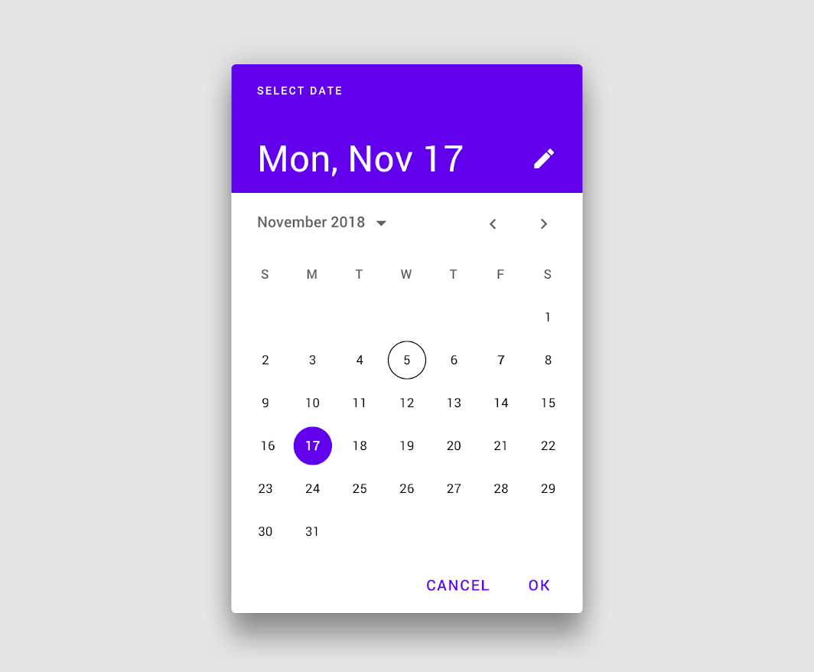
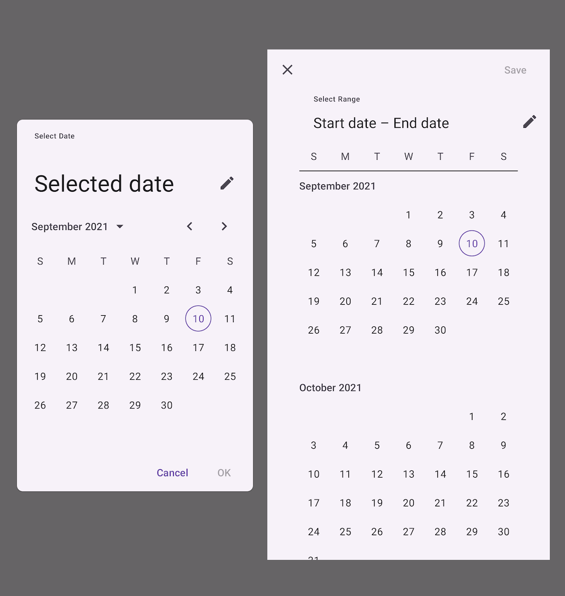
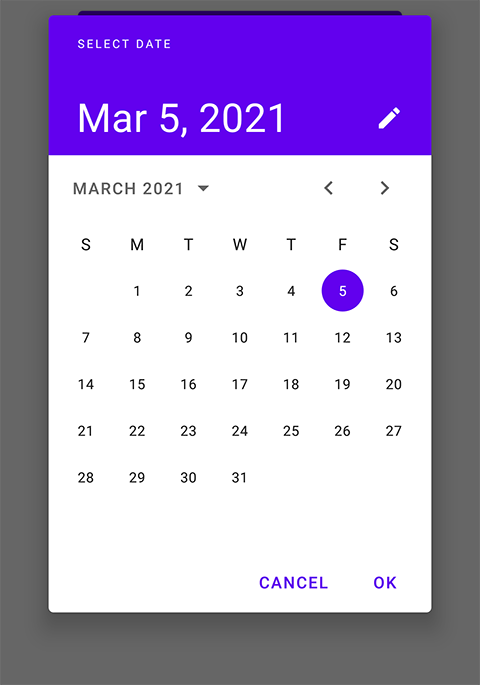
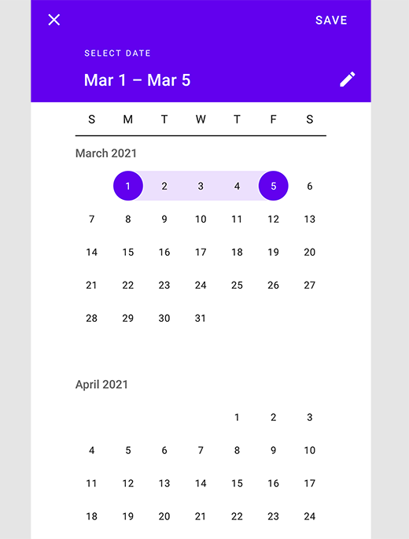
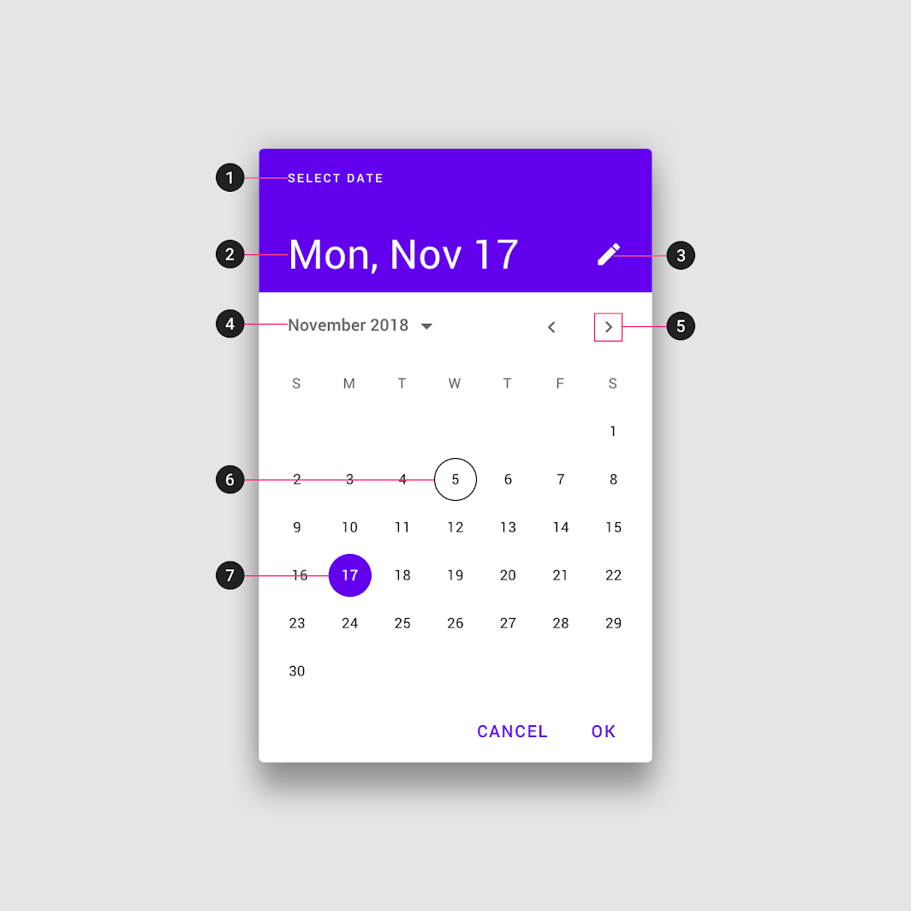

<!--docs:
title: "Pickers"
layout: detail
section: components
excerpt: "Date pickers let users select a date or range of dates."
iconId: picker
path: /catalog/date-pickers/
-->

# Date Pickers

[Date pickers](https://material.io/components/date-pickers) let users select a
date or range of dates.



**Contents**

*   [Using date pickers](#using-date-pickers)
*   [Date picker](#date-pickers)
*   [Theming date pickers](#theming-date-pickers)

## Using date pickers

Before you can use Material date pickers, you need to add a dependency to the
Material Components for Android library. For more information, go to the
[Getting started](https://github.com/material-components/material-components-android/tree/master/docs/getting-started.md)
page.

Date pickers let users select a date or range of dates. They should be suitable
for the context in which they appear.

Date pickers can be embedded into dialogs on mobile.

### Usage

The following image shows a date picker and a range date picker.



API and source code:

*   `MaterialDatePicker`
    *   [Class definition](https://developer.android.com/reference/com/google/android/material/datepicker/MaterialDatePicker)
    *   [Class source](https://github.com/material-components/material-components-android/tree/master/lib/java/com/google/android/material/datepicker/MaterialDatePicker.java)
*   `CalendarConstraints`
    *   [Class definition](https://developer.android.com/reference/com/google/android/material/datepicker/CalendarConstraints)
    *   [Class source](https://github.com/material-components/material-components-android/tree/master/lib/java/com/google/android/material/datepicker/CalendarConstraints.java)

A date picker can be instantiated with
`MaterialDatePicker.Builder.datePicker()`:

```kt
val datePicker =
    MaterialDatePicker.Builder.datePicker()
        .setTitleText("Select date")
        .build()
```

A date range picker can be instantiated with
`MaterialDatePicker.Builder.dateRangePicker()`:

```kt
val dateRangePicker =
    MaterialDatePicker.Builder.dateRangePicker()
        .setTitleText("Select dates")
        .build()
```

To set a default selection:

```kt
// Opens the date picker with today's date selected.
MaterialDatePicker.Builder().datePicker()
      ...
    .setSelection(MaterialDatePicker.todayInUtcMilliseconds())

// Opens the date range picker with the range of the first day of
// the month to today selected.
MaterialDatePicker.Builder.dateRangePicker()
      ...
    .setSelection(
          Pair(
            MaterialDatePicker.thisMonthInUtcMilliseconds(),
            MaterialDatePicker.todayInUtcMilliseconds()
          )
        )
```

The picker can be started in text input mode with:

```kt
MaterialDatePicker.Builder().datePicker()
      ...
    .setInputMode(MaterialDatePicker.INPUT_MODE_TEXT)
```

To show the picker to the user:

```kt
 picker.show(supportFragmentManager, "tag");
```

Subscribe to button clicks or dismiss events with the following calls:

```
picker.addOnPositiveButtonClickListener {
    // Respond to positive button click.
}
picker.addOnNegativeButtonClickListener {
    // Respond to negative button click.
}
picker.addOnCancelListener {
    // Respond to cancel button click.
}
picker.addOnDismissListener {
    // Respond to dismiss events.
}
```

Finally, you can get the user selection with `datePicker.selection`.

### Adding calendar constraints

To constrain the calendar to the beginning to the end of this year:

```kt
val today = MaterialDatePicker.todayInUtcMilliseconds()
val calendar = Calendar.getInstance(TimeZone.getTimeZone("UTC"))

calendar.timeInMillis = today
calendar[Calendar.MONTH] = Calendar.JANUARY
val janThisYear = calendar.timeInMillis

calendar.timeInMillis = today
calendar[Calendar.MONTH] = Calendar.DECEMBER
val decThisYear = calendar.timeInMillis

// Build constraints.
val constraintsBuilder =
   CalendarConstraints.Builder()
       .setStart(janThisYear)
       .setEnd(decThisYear)
```

To open picker at a default month:

```kt
...
calendar[Calendar.MONTH] = Calendar.FEBRUARY
val february = calendar.timeInMillis

val constraintsBuilder =
   CalendarConstraints.Builder()
       .setOpenAt(february)
```

To set a validator:

```kt
// Makes only dates from today forward selectable.
val constraintsBuilder =
   CalendarConstraints.Builder()
       .setValidator(DateValidatorPointForward.now)

// Makes only dates from February forward selectable.
val constraintsBuilder =
   CalendarConstraints.Builder()
       .setValidator(DateValidatorPointForward.from(february))
```

You can also use `DateValidatorPointBackward` or use a custom one by creating a
class that implements `DateValidator`
([example of a `DateValidatorWeekdays`](https://github.com/material-components/material-components-android/tree/master/catalog/java/io/material/catalog/datepicker/DateValidatorWeekdays.java)
in the MDC catalog).

Finally, to set the constraint to the picker's builder:

```kt
MaterialDatePicker.Builder().datePicker()
      ...
    .setCalendarConstraints(constraintsBuilder.build())
```

### Making date pickers accessible

Material date pickers are fully accessible and compatible with screen readers.
The title of your date picker will be read when the user launches the dialog.
Use a descriptive title that for the task:

```kt
val picker =
   MaterialDatePicker.Builder()
      ...
       .setTitleText("Select appointment date")
   ...
```

## Date pickers

Calendar date pickers can be used to select dates in the near future or past,
when it’s useful to see them in a calendar month format. They are displayed in a
dialog.

Common use cases include:

*   Making a restaurant reservation
*   Scheduling a meeting

### Date picker example

The following example shows a date picker with a date selected.



In code:

```kt
val datePicker =
    MaterialDatePicker.Builder.datePicker()
        .setTitleText("Select date")
        .setSelection(MaterialDatePicker.todayInUtcMilliseconds())
        .build()

datePicker.show()
```

## Date range pickers

Mobile date range pickers allow selection of a range of dates. They cover the
entire screen.

Common use cases include:

*   Booking a flight
*   Reserving a hotel

### Date range picker example

The following example shows a date range picker with a date selected.



In code:

```kt
val dateRangePicker =
    MaterialDatePicker.Builder.dateRangePicker()
        .setTitleText("Select dates")
        .setSelection(
          Pair(
            MaterialDatePicker.thisMonthInUtcMilliseconds(),
            MaterialDatePicker.todayInUtcMilliseconds()
          )
        )
        .build()

dateRangePicker.show()
```

## Anatomy and key properties

The following diagram shows the elements of a date picker:



1.  Title
2.  Selected date
3.  Switch-to-keyboard input icon
4.  Year selection menu
5.  Month pagination
6.  Current date
7.  Selected date

### Title

Element        | Attribute                         | Related method(s)                          | Default value
-------------- | --------------------------------- | ------------------------------------------ | -------------
**Style**      | `app:materialCalendarHeaderTitle` | N/A                                        | `@style/Widget.MaterialComponents.MaterialCalendar.HeaderTitle`
**Text label** | N/A                               | `Builder.setTitleText`<br/>`getHeaderText` | `Select Date`
**Color**      | `android:textColor`               | N/A                                        | `?attr/colorOnPrimary`
**Typography** | `android:textAppearance`          | N/A                                        | `?attr/textAppearanceOverline`

### Selected date

Element        | Attribute                             | Related method(s) | Default value
-------------- | ------------------------------------- | ----------------- | -------------
**Style**      | `app:materialCalendarHeaderSelection` | N/A               | `@style/Widget.MaterialComponents.MaterialCalendar.HeaderSelection`
**Color**      | `android:textColor`                   | N/A               | `?attr/colorOnPrimary`
**Typography** | `android:textAppearance`              | N/A               | `?attr/textAppearanceHeadline4`

### Switch-to-keyboard input icon

Element        | Attribute                                | Related method(s) | Default value
-------------- | ---------------------------------------- | ----------------- | -------------
**Style**      | `app:materialCalendarHeaderToggleButton` | N/A               | `@style/Widget.MaterialComponents.MaterialCalendar.HeaderToggleButton`
**Background** | `android:background`                     | N/A               | `?attr/actionBarItemBackground`
**Color**      | `android:tint`                           | N/A               | `?attr/colorOnPrimary`

### Year selection menu

Element        | Attribute                                  | Related method(s) | Default value
-------------- | ------------------------------------------ | ----------------- | -------------
**Style**      | `app:materialCalendarYearNavigationButton` | N/A               | `@style/Widget.MaterialComponents.MaterialCalendar.YearNavigationButton`
**Text color** | `android:textColor`                        | N/A               | `?attr/colorOnSurface` at 60%
**Icon color** | `app:iconTint`                             | N/A               | `?attr/colorOnSurface` at 60%

### Month pagination

Element        | Attribute                                   | Related method(s) | Default value
-------------- | ------------------------------------------- | ----------------- | -------------
**Style**      | `app:materialCalendarMonthNavigationButton` | N/A               | `@style/Widget.MaterialComponents.MaterialCalendar.MonthNavigationButton`
**Text color** | `android:textColor`                         | N/A               | `?attr/colorOnSurface` at 60%
**Icon color** | `app:iconTint`                              | N/A               | `?attr/colorOnSurface` at 60%

### Current date

Element          | Attribute             | Related method(s) | Default value
---------------- | --------------------- | ----------------- | -------------
**Style**        | `app:dayTodayStyle`   | N/A               | `@style/Widget.MaterialComponents.MaterialCalendar.Day.Today`
**Text color**   | `app:itemTextColor`   | N/A               | `?attr/colorOnSurface` at 87%
**Stroke color** | `app:itemStrokeColor` | N/A               | `?attr/colorOnSurface` at 87%
**Stroke width** | `app:itemStrokeWidth` | N/A               | `1dp`

### Selected date

Element              | Attribute              | Related method(s) | Default value
-------------------- | ---------------------- | ----------------- | -------------
**Style**            | `app:daySelectedStyle` | N/A               | `@style/Widget.MaterialComponents.MaterialCalendar.Day.Selected`
**Background color** | `app:itemFillColor`    | N/A               | `?attr/colorPrimary`
**Text color**       | `app:itemTextColor`    | N/A               | `?attr/colorOnPrimary`
**Stroke color**     | `app:itemStrokeColor`  | N/A               | `@color/mtrl_calendar_item_stroke_color`
**Stroke width**     | `app:itemStrokeWidth`  | N/A               | `0dp`

### Selected range

| Element   | Attribute            | Related method(s) | Default value        |
| --------- | -------------------- | ----------------- | -------------------- |
| **Color** | `app:rangeFillColor` | N/A               | `?attr/colorPrimary` |
:           :                      :                   : at 12%               :

### Cancel button

Element        | Attribute                                | Related method(s) | Default value
-------------- | ---------------------------------------- | ----------------- | -------------
**Style**      | `app:materialCalendarHeaderCancelButton` | N/A               | `@style/Widget.MaterialComponents.MaterialCalendar.HeaderCancelButton`
**Text color** | `android:textColor`                      | N/A               | `@color/mtrl_text_btn_text_color_selector`
**Icon color** | `app:iconTint`                           | N/A               | `?attr/colorOnPrimary`

### Styles and theme overlays

Element                              | Style
------------------------------------ | -----
**Default**<br/>**theme overlay**    | `ThemeOverlay.MaterialComponents.MaterialCalendar`
**Default style**                    | `Widget.MaterialComponents.MaterialCalendar`
**Fullscreen**<br/>**theme overlay** | `ThemeOverlay.MaterialComponents.MaterialCalendar.Fullscreen`
**Full screen style**                | `Widget.MaterialComponents.MaterialCalendar.Fullscreen`

Default style theme attribute (set inside the theme overlay):
`?attr/materialCalendarStyle`

Default theme attribute (set on the app's theme): `?attr/materialCalendarTheme`

See the full list of
[styles](https://github.com/material-components/material-components-android/tree/master/lib/java/com/google/android/material/datepicker/res/values/styles.xml),
[attributes](https://github.com/material-components/material-components-android/tree/master/lib/java/com/google/android/material/datepicker/res/values/attrs.xml),
and
[theme overlays](https://github.com/material-components/material-components-android/tree/master/lib/java/com/google/android/material/datepicker/res/values/themes.xml).

## Theming date pickers

Date pickers support
[Material Theming](https://material.io/components/date-pickers#theming) and can
be customized in terms of color, shape and typography.

### Date picker theming example

API and source code:

*   `MaterialDatePicker`
    *   [Class definition](https://developer.android.com/reference/com/google/android/material/datepicker/MaterialDatePicker)
    *   [Class source](https://github.com/material-components/material-components-android/tree/master/lib/java/com/google/android/material/datepicker/MaterialDatePicker.java)
*   `CalendarConstraints`
    *   [Class definition](https://developer.android.com/reference/com/google/android/material/datepicker/CalendarConstraints)
    *   [Class source](https://github.com/material-components/material-components-android/tree/master/lib/java/com/google/android/material/datepicker/CalendarConstraints.java)

The following example shows a date picker with Material Theming.


Using theme attributes and styles in `res/values/styles.xml` (themes all date
pickers and affects other components):

```xml
<style name="Theme.App" parent="Theme.MaterialComponents.*">
    ...
    <item name="colorPrimary">@color/shrine_pink_100</item>
    <item name="colorOnPrimary">@color/shrine_pink_900</item>
    <item name="shapeAppearanceSmallComponent">@style/ShapeAppearance.App.SmallComponent</item>
    <item name="shapeAppearanceMediumComponent">@style/ShapeAppearance.App.MediumComponent</item>
</style>

<style name="ShapeAppearance.App.SmallComponent" parent="ShapeAppearance.MaterialComponents.SmallComponent">
    <item name="cornerFamily">cut</item>
</style>

<style name="ShapeAppearance.App.MediumComponent" parent="ShapeAppearance.MaterialComponents.MediumComponent">
    <item name="cornerSize">16dp</item>
</style>
```

or using a default style theme attribute, styles and a theme overlay (themes all
date pickers but does not affect other components):

```xml
<style name="Theme.App" parent="Theme.MaterialComponents.*">
    ...
    <item name="materialCalendarTheme">@style/ThemeOverlay.App.DatePicker</item>
</style>

<style name="ThemeOverlay.App.DatePicker" parent="@style/ThemeOverlay.MaterialComponents.MaterialCalendar">
    <item name="colorPrimary">@color/shrine_pink_100</item>
    <item name="colorOnPrimary">@color/shrine_pink_900</item>
    <item name="shapeAppearanceSmallComponent">@style/ShapeAppearance.App.SmallComponent</item>
    <item name="shapeAppearanceMediumComponent">@style/ShapeAppearance.App.MediumComponent</item>
    <!-- Customize text field of the text input mode. -->
    <item name="textInputStyle">@style/Widget.App.TextInputLayout</item>
  </style>
```

or setting the theme in code (affects only this date picker):

```kt
val picker =
   MaterialDatePicker.Builder()
      ...
       .setTheme(.style.ThemeOverlay_App_DatePicker)
```
