<!--docs:
title: "Date pickers"
layout: detail
section: components
excerpt: "Date pickers let users select a date or range of dates."
iconId: picker
path: /catalog/date-pickers/
-->

# Date pickers

[Date pickers](https://material.io/components/date-pickers) let users select a
date or range of dates.There are three variants of date pickers.

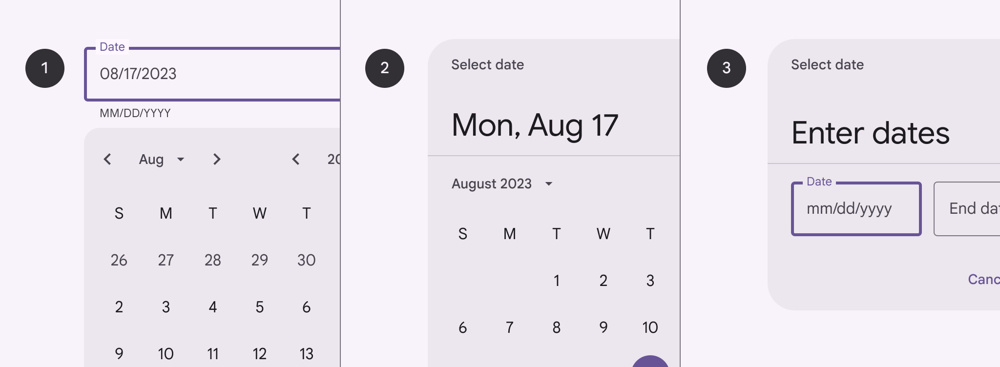

1.  Docked date picker
2.  Modal date picker
3.  Modal date input

**Note:** Images use various dynamic color schemes.

## Design & API documentation

*   [Material 3 (M3) spec](https://m3.material.io/components/date-pickers/overview/)
*   [API reference](https://developer.android.com/reference/com/google/android/material/datepicker/package-summary)

## Anatomy

<details>

<summary><h4>Docked date picker</h4></summary>

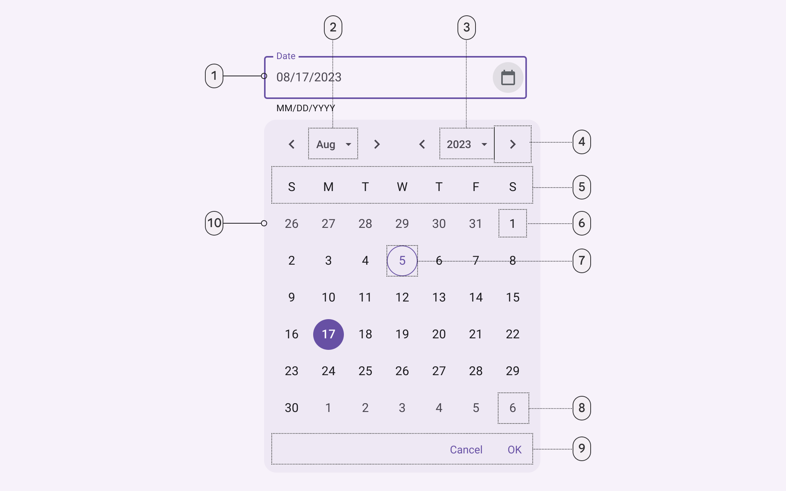

1.  Outlined text field
2.  Menu button: Month selection
3.  Menu button: Year selection
4.  Icon button
5.  Weekdays label text
6.  Unselected date
7.  Today’s date
8.  Outside month date
9.  Text buttons
10. Container

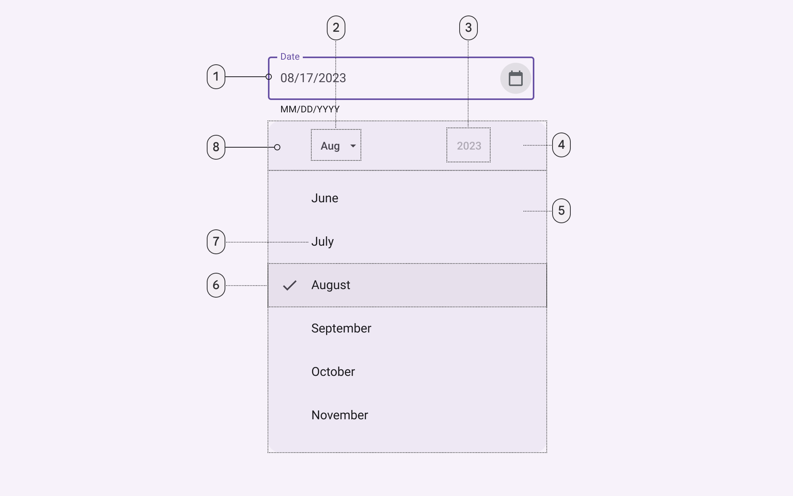

1.  Outlined text field
2.  Menu button: Month selection (pressed)
3.  Menu button: Year selection (disabled)
4.  Header
5.  Menu
6.  Selected list item
7.  Unselected menu list item
8.  Container

</details>

<details>

<summary><h4>Modal date picker</h4></summary>

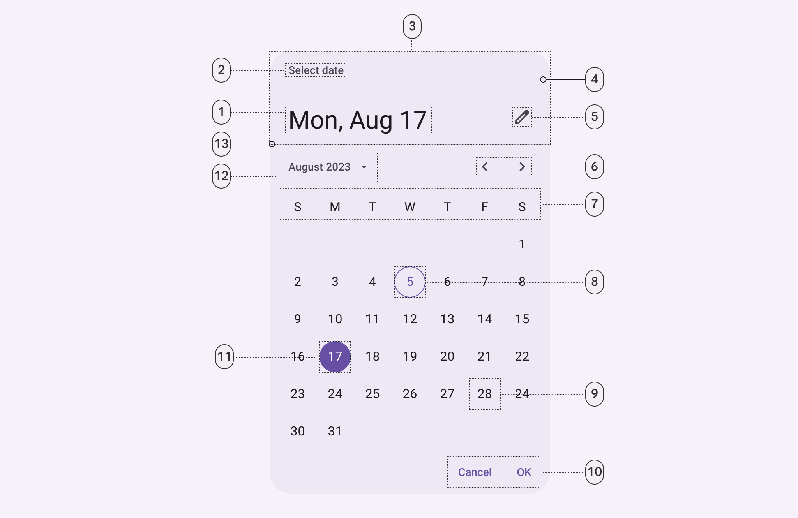

1.  Headline
2.  Supporting text
3.  Header
4.  Container
5.  Icon button
6.  Icon buttons
7.  Weekdays
8.  Today’s date
9.  Unselected date
10. Text buttons
11. Selected date
12. Menu button
13. Divider

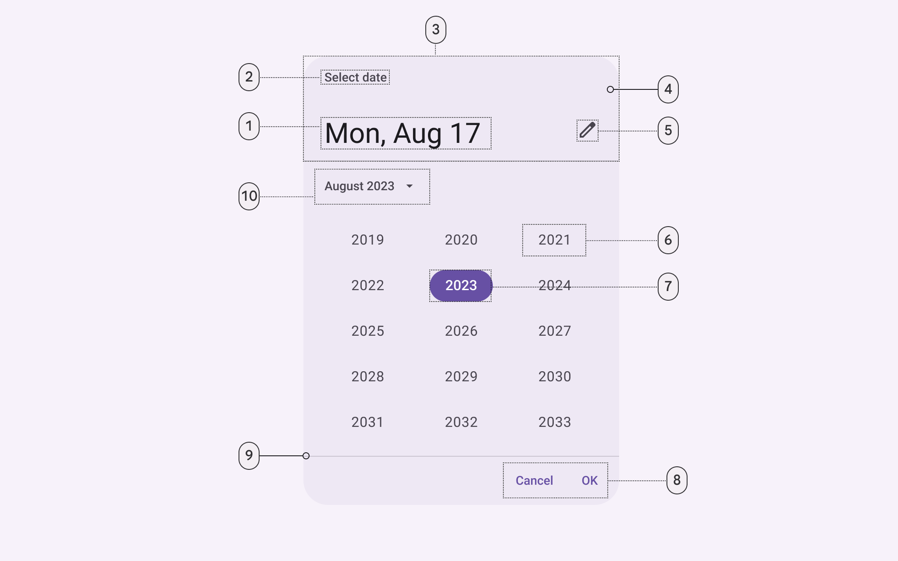

1.  Headline
2.  Supporting text
3.  Header
4.  Container
5.  Icon button
6.  Unselected year
7.  Selected year
8.  Text buttons
9.  Divider
10. Menu button

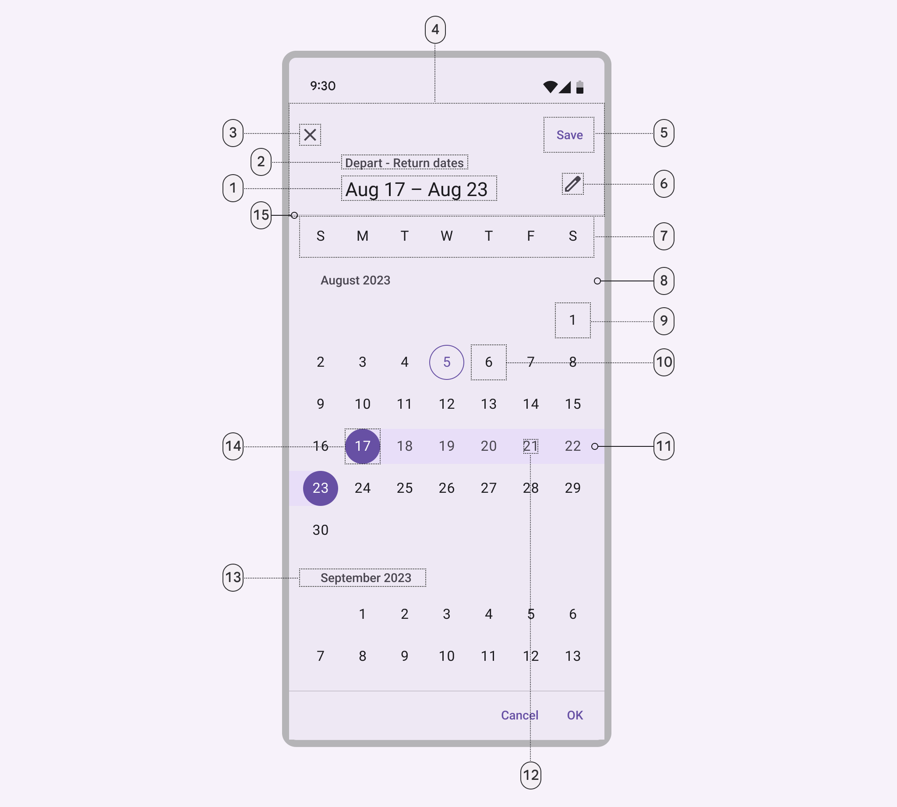

1.  Headline
2.  Supporting text
3.  Icon button
4.  Header
5.  Text button
6.  Icon button
7.  Weekdays label text
8.  Container
9.  Unselected date
10. Today’s date
11. In range active indicator
12. In range date
13. Month subhead
14. Selected date
15. Divider

</details>

<details>

<summary><h4>Modal date input</h4></summary>

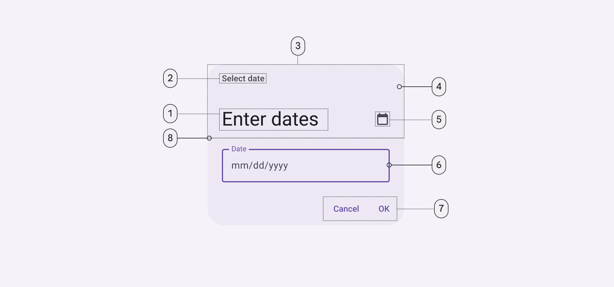

1.  Headline
2.  Supporting text
3.  Header
4.  Container
5.  Icon button
6.  Outlined text field
7.  Text buttons
8.  Divider

</details>

More details on anatomy items in the
[component guidelines](https://m3.material.io/components/date-pickers/guidelines#8899f108-6a06-44df-b228-0cee1ccf67ca).

## Key properties

### Container

Element   | Attribute             | Related method(s) | Default value
--------- | --------------------- | ----------------- | -------------
**Color** | `app:backgroundTint`  | N/A               | `?attr/colorSurfaceContainerHigh`
**Shape** | `app:shapeAppearance` | N/A               | `?attr/shapeAppearanceCornerExtraLarge`

### Title

Element        | Attribute                         | Related method(s)                          | Default value
-------------- | --------------------------------- | ------------------------------------------ | -------------
**Style**      | `app:materialCalendarHeaderTitle` | N/A                                        | `@style/Widget.Material3.MaterialCalendar.HeaderTitle`
**Text label** | N/A                               | `Builder.setTitleText`<br/>`getHeaderText` | `Select Date`
**Color**      | `android:textColor`               | N/A                                        | `?attr/colorOnSurfaceVariant`
**Typography** | `android:textAppearance`          | N/A                                        | `?attr/textAppearanceLabelMedium`

### Selected date

Element        | Attribute                             | Related method(s) | Default value
-------------- | ------------------------------------- | ----------------- | -------------
**Style**      | `app:materialCalendarHeaderSelection` | N/A               | `@style/Widget.Material3.MaterialCalendar.HeaderSelection`
**Color**      | `android:textColor`                   | N/A               | `?attr/colorOnSurface`
**Typography** | `android:textAppearance`              | N/A               | `?attr/textAppearanceHeadlineLarge`

### Switch-to-keyboard input icon

Element        | Attribute                                | Related method(s) | Default value
-------------- | ---------------------------------------- | ----------------- | -------------
**Style**      | `app:materialCalendarHeaderToggleButton` | N/A               | `@style/Widget.Material3.MaterialCalendar.HeaderToggleButton`
**Background** | `android:background`                     | N/A               | `?attr/actionBarItemBackground`
**Color**      | `android:tint`                           | N/A               | `?attr/colorOnSurfaceVariant`

### Year selection menu

Element        | Attribute                                  | Related method(s) | Default value
-------------- | ------------------------------------------ | ----------------- | -------------
**Style**      | `app:materialCalendarYearNavigationButton` | N/A               | `@style/Widget.Material3.MaterialCalendar.YearNavigationButton`
**Text color** | `android:textColor`                        | N/A               | `?attr/colorOnSurfaceVariant`
**Icon color** | `app:iconTint`                             | N/A               | `?attr/colorOnSurfaceVariant`

### Month pagination

Element        | Attribute                                   | Related method(s) | Default value
-------------- | ------------------------------------------- | ----------------- | -------------
**Style**      | `app:materialCalendarMonthNavigationButton` | N/A               | `@style/Widget.Material3.MaterialCalendar.MonthNavigationButton`
**Text color** | `android:textColor`                         | N/A               | `?attr/colorOnSurfaceVariant`
**Icon color** | `app:iconTint`                              | N/A               | `?attr/colorOnSurfaceVariant`

### Current date

Element          | Attribute             | Related method(s) | Default value
---------------- | --------------------- | ----------------- | -------------
**Style**        | `app:dayTodayStyle`   | N/A               | `@style/Widget.Material3.MaterialCalendar.Day.Today`
**Text color**   | `app:itemTextColor`   | N/A               | `?attr/colorPrimary`
**Stroke color** | `app:itemStrokeColor` | N/A               | `?attr/colorPrimary`
**Stroke width** | `app:itemStrokeWidth` | N/A               | `1dp`

### Selected date

Element              | Attribute              | Related method(s) | Default value
-------------------- | ---------------------- | ----------------- | -------------
**Style**            | `app:daySelectedStyle` | N/A               | `@style/Widget.Material3.MaterialCalendar.Day.Selected`
**Background color** | `app:itemFillColor`    | N/A               | `?attr/colorPrimary`
**Text color**       | `app:itemTextColor`    | N/A               | `?attr/colorOnPrimary`
**Stroke color**     | `app:itemStrokeColor`  | N/A               | N/A
**Stroke width**     | `app:itemStrokeWidth`  | N/A               | `0dp`

### Selected range

Element   | Attribute            | Related  method(s) | Default value
--------- | -------------------- | ------------------ | ---------------------------
**Color** | `app:rangeFillColor` | N/A                | `?attr/colorSurfaceVariant`

### Cancel button

Element        | Attribute                                | Related method(s) | Default value
-------------- | ---------------------------------------- | ----------------- | -------------
**Style**      | `app:materialCalendarHeaderCancelButton` | N/A               | `@style/Widget.Material3.MaterialCalendar.HeaderCancelButton`
**Text color** | `android:textColor`                      | N/A               | `?attr/colorOnSurface` (see all [states](https://github.com/material-components/material-components-android/tree/master/lib/java/com/google/android/material/button/res/color/m3_text_button_foreground_color_selector.xml))
**Icon color** | `app:iconTint`                           | N/A               | `?attr/colorOnSurfaceVariant`

### Styles and theme overlays

Element                              | Style
------------------------------------ | -----
**Default**<br/>**theme overlay**    | `ThemeOverlay.Material3.MaterialCalendar`
**Default style**                    | `Widget.Material3.MaterialCalendar`
**Fullscreen**<br/>**theme overlay** | `ThemeOverlay.Material3.MaterialCalendar.Fullscreen`
**Full screen style**                | `Widget.Material3.MaterialCalendar.Fullscreen`

Default style theme attribute (set inside the theme overlay):
`?attr/materialCalendarStyle`

Default theme attribute (set on the app's theme): `?attr/materialCalendarTheme`,
`?attr/materialCalendarFullscreenTheme` (fullscreen)

See the full list of
[styles](https://github.com/material-components/material-components-android/tree/master/lib/java/com/google/android/material/datepicker/res/values/styles.xml),
[attributes](https://github.com/material-components/material-components-android/tree/master/lib/java/com/google/android/material/datepicker/res/values/attrs.xml),
and
[theme overlays](https://github.com/material-components/material-components-android/tree/master/lib/java/com/google/android/material/datepicker/res/values/themes.xml).

## Variants of date pickers

<details>

<summary><h3>Docked date picker</h3></summary>

Docked date pickers allow the selection of a specific date and year. The docked
date picker displays a date input field by default, and a dropdown calendar
appears when the user taps on the input field. Either form of date entry can be
interacted with.

Docked date pickers are ideal for navigating dates in both the near future or
past and the distant future or past, as they provide multiple ways to select
dates.

#### Docked date picker example

The following example shows a date picker with a date selected.

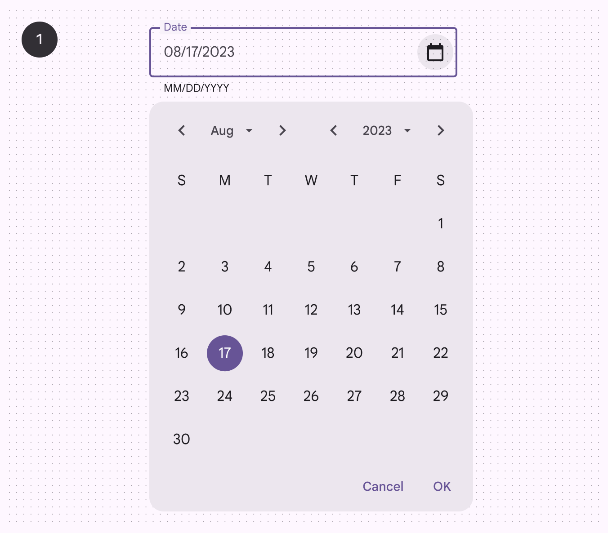

In XML:

```
<com.google.android.material.textfield.textinputlayout
android:id="@+id/booking_date_input_layout"
android:layout_width="match_parent"
android:layout_height="wrap_content"
android:hint="Select Booking Date"
app:layout_constraintEnd_toEndOf="parent"
app:layout_constraintStart_toStartOf="parent"
app:layout_constraintTop_toTopOf="parent"
app:endIconMode="custom"
app:endIconDrawable="@drawable/ic_android_black_24dp"
app:endIconContentDescription="Open Date Picker"
style="?attr/textInputOutlinedStyle">

<com.google.android.material.textfield.TextInputEditText
android:id="@+id/booking_date_edit_text"
android:layout_width="match_parent"
android:layout_height="wrap_content"
android:focusable="false"
android:clickable="true"
android:inputType="none"
/>

</com.google.android.material.textfield.TextInputLayout>
```

In code:

```kt
val datePickerBuilder.setTitleText("Select Date")
if (bookingDateEditText.text.toString().isNotEmpty()) {
  try {
      val dateFormat = SimpleDateFormat("dd/MM/yyyy", Locale.getDefault())
      dateFormat.timeZone = TimeZone.getTimeZone("UTC")
      val parsedDate = dateFormat.parse(bookingDateEditText.text.toString())
      parsedDate?.let {
          datePickerBuilder.setSelection(it.time)
        }
      } catch (e: Exception) {
          e.printStackTrace()
        }
}
  val datePicker = datePickerBuilder.build()
  datePicker.addOnPositiveButtonClickListener { selection ->
  val dateFormat = SimpleDateFormat("dd/MM/yyyy", Locale.getDefault())
  dateFormat.timeZone = TimeZone.getTimeZone("UTC")
  val formattedDate = dateFormat.format(Date(selection))
  bookingDateEditText.setText(formattedDate)
}
  datePicker.addOnNegativeButtonClickListener {
  bookingDateEditText.clearFocus()
}
  datePicker.addOnDismissListener {
  bookingDateEditText.clearFocus()
}
  datePicker.show()
```

</details>

<details>

<summary><h3>Modal date picker</h3></summary>

Modal date pickers navigate across dates in several ways:

*   To navigate across months, swipe horizontally
*   To navigate across years, scroll vertically
*   To access the year picker, tap the year

Date range selection provides a start and end date.

Common use cases include:

*   Booking a flight
*   Reserving a hotel

Modal date pickers navigate across date ranges in several ways:

*   To select a range of dates, tap the start and end dates on the calendar
*   To navigate across months, scroll vertically

#### Modal date picker example

The following example shows a **modal date picker** with a date range selected.

  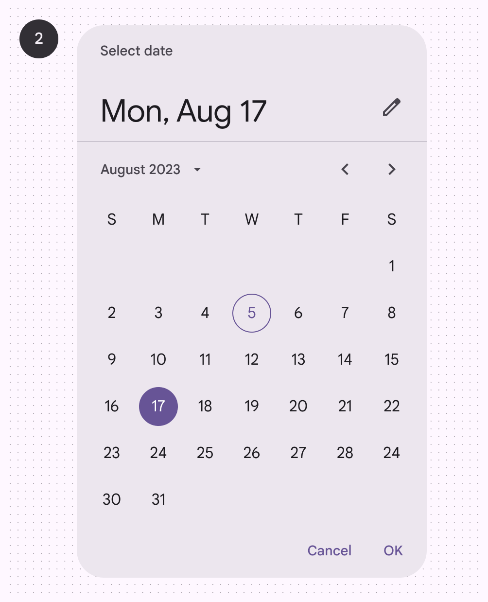

In code:

```kt
val datePicker =
    MaterialDatePicker.Builder.datePicker()
        .setTitleText("Select date")
        .setSelection(MaterialDatePicker.todayInUtcMilliseconds())
        .build()

datePicker.show()
```

The following example shows a **modal date range picker** with a date range
selected.

  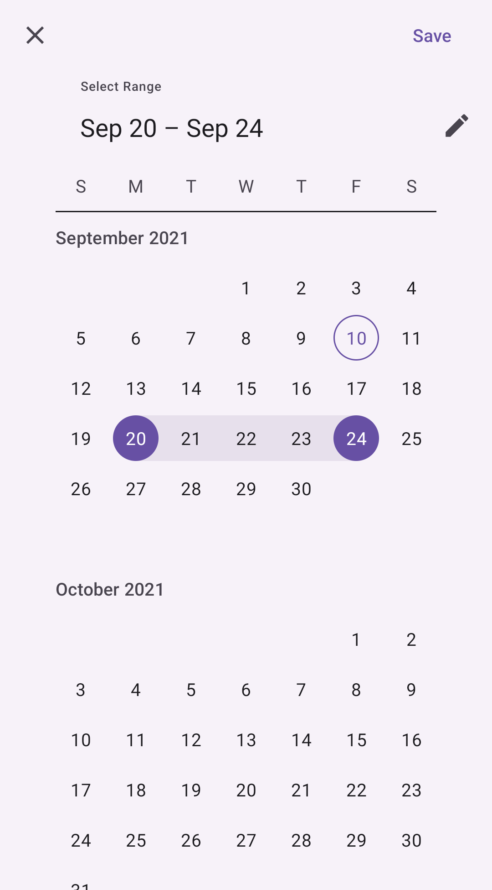

In code:

```kt
val dateRangePicker =
    MaterialDatePicker.Builder.dateRangePicker()
        .setTitleText("Select dates")
        .setSelection(
          Pair(
            MaterialDatePicker.thisMonthInUtcMilliseconds(),
            MaterialDatePicker.todayInUtcMilliseconds()
          )
        )
        .build()

dateRangePicker.show()
```

</details>

<details>

<summary><h3>Modal date input</h3></summary>

Modal date inputs allow the manual entry of dates using the numbers on a
keyboard. Users can input a date or a range of dates in a dialog.

  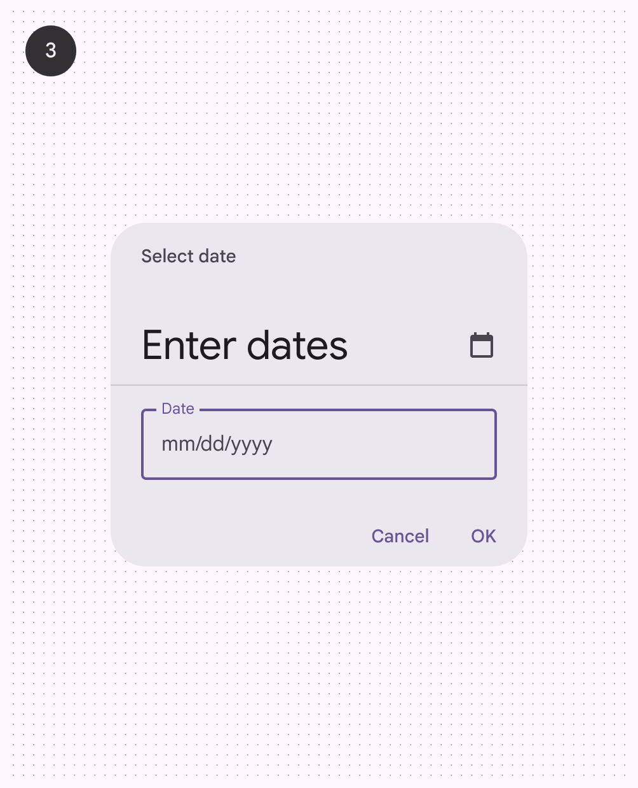

In code:

```kt
val datePickerBuilder =
     MaterialDatePicker.Builder.datePicker()
      .setInputMode(MaterialDatePicker.INPUT_MODE_TEXT)
      datePickerBuilder.setTitleText("Select Date")
      datePickerBuilder.setSelection(MaterialDatePicker.todayInUtcMilliseconds())
val datePicker = datePickerBuilder.build() datePicker.show()
```

</details>

## Code implementation

Before you can use Material date pickers, you need to add a dependency to the
Material components for Android library. For more information, go to the
[Getting started](https://github.com/material-components/material-components-android/tree/master/docs/getting-started.md)
page.

Date pickers should be suitable for the context in which they appear and can be
embedded into dialogs on mobile devices.

### Date pickers examples

**API and source code:**

*   `MaterialDatePicker`
    *   [Class definition](https://developer.android.com/reference/com/google/android/material/datepicker/MaterialDatePicker)
    *   [Class source](https://github.com/material-components/material-components-android/tree/master/lib/java/com/google/android/material/datepicker/MaterialDatePicker.java)
*   `CalendarConstraints`
    *   [Class definition](https://developer.android.com/reference/com/google/android/material/datepicker/CalendarConstraints)
    *   [Class source](https://github.com/material-components/material-components-android/tree/master/lib/java/com/google/android/material/datepicker/CalendarConstraints.java)

**A date range picker can be instantiated with
`MaterialDatePicker.Builder.dateRangePicker()`:**

```kt
val dateRangePicker =
    MaterialDatePicker.Builder.dateRangePicker()
        .setTitleText("Select dates")
        .build()
```

**To set a default selection:**

```kt
// Opens the date picker with today's date selected.
MaterialDatePicker.Builder.datePicker()
      ...
    .setSelection(MaterialDatePicker.todayInUtcMilliseconds())

// Opens the date range picker with the range of the first day of
// the month to today selected.
MaterialDatePicker.Builder.dateRangePicker()
      ...
    .setSelection(
          Pair(
            MaterialDatePicker.thisMonthInUtcMilliseconds(),
            MaterialDatePicker.todayInUtcMilliseconds()
          )
        )
```

**The picker can be started in text input mode with:**

```kt
MaterialDatePicker.Builder.datePicker()
      ...
    .setInputMode(MaterialDatePicker.INPUT_MODE_TEXT)
```

**A `DayViewDecorator` can be set allowing customizing the day of month views
within the picker
([example of a `DayViewDecorator`](https://github.com/material-components/material-components-android/tree/master/catalog/java/io/material/catalog/datepicker/CircleIndicatorDecorator.java)):**

```kt
MaterialDatePicker.Builder.datePicker()
      ...
    .setDayViewDecorator(CircleIndicatorDecorator())
```

**To show the picker to the user:**

```kt
picker.show(supportFragmentManager, "tag")
```

**Listen to button clicks, cancel, and dismiss events with the following
calls:**

```kt
picker.addOnPositiveButtonClickListener {
    // Respond to positive button click.
}
picker.addOnNegativeButtonClickListener {
    // Respond to negative button click.
}
picker.addOnCancelListener {
    // Respond to cancel events.
}
picker.addOnDismissListener {
    // Respond to dismiss events.
}
```

**Finally, you can get the user selection with `picker.selection`.**

### Adding calendar constraints

**To constrain the calendar from the beginning to the end of this year:**

```kt
val today = MaterialDatePicker.todayInUtcMilliseconds()
val calendar = Calendar.getInstance(TimeZone.getTimeZone("UTC"))

calendar.timeInMillis = today
calendar[Calendar.MONTH] = Calendar.JANUARY
val janThisYear = calendar.timeInMillis

calendar.timeInMillis = today
calendar[Calendar.MONTH] = Calendar.DECEMBER
val decThisYear = calendar.timeInMillis

// Build constraints.
val constraintsBuilder =
   CalendarConstraints.Builder()
       .setStart(janThisYear)
       .setEnd(decThisYear)
```

**To open the picker at a default month:**

```kt
...
calendar[Calendar.MONTH] = Calendar.FEBRUARY
val february = calendar.timeInMillis

val constraintsBuilder =
   CalendarConstraints.Builder()
       .setOpenAt(february)
```

**To set the first day of the week:**

```kt
val constraintsBuilder =
   CalendarConstraints.Builder()
       .setFirstDayOfWeek(Calendar.MONDAY)
```

**To set a validator:**

```kt
// Makes only dates from today forward selectable.
val constraintsBuilder =
   CalendarConstraints.Builder()
       .setValidator(DateValidatorPointForward.now())

// Makes only dates from February forward selectable.
val constraintsBuilder =
   CalendarConstraints.Builder()
       .setValidator(DateValidatorPointForward.from(february))
```

You can also use `DateValidatorPointBackward` or customize by creating a class
that implements `DateValidator`
([example of a `DateValidatorWeekdays`](https://github.com/material-components/material-components-android/tree/master/catalog/java/io/material/catalog/datepicker/DateValidatorWeekdays.java)
in the MDC catalog).

**To set the constraint to the picker's builder:**

```kt
MaterialDatePicker.Builder.datePicker()
      ...
    .setCalendarConstraints(constraintsBuilder.build())
```

### Making date pickers accessible

Material date pickers are fully accessible and compatible with screen readers.
The title of your date picker will be read when the user launches the dialog.
Use a descriptive title for the task:

```kt
val picker =
   MaterialDatePicker.Builder.datePicker()
      ...
       .setTitleText("Select appointment date")
   ...
```

## Customizing date pickers

### Theming date pickers

Date pickers support the customization of color, typography, and shape.

#### Date picker theming example

API and source code:

*   `MaterialDatePicker`
    *   [Class definition](https://developer.android.com/reference/com/google/android/material/datepicker/MaterialDatePicker)
    *   [Class source](https://github.com/material-components/material-components-android/tree/master/lib/java/com/google/android/material/datepicker/MaterialDatePicker.java)
*   `CalendarConstraints`
    *   [Class definition](https://developer.android.com/reference/com/google/android/material/datepicker/CalendarConstraints)
    *   [Class source](https://github.com/material-components/material-components-android/tree/master/lib/java/com/google/android/material/datepicker/CalendarConstraints.java)

The following example shows a date picker with Material theming.

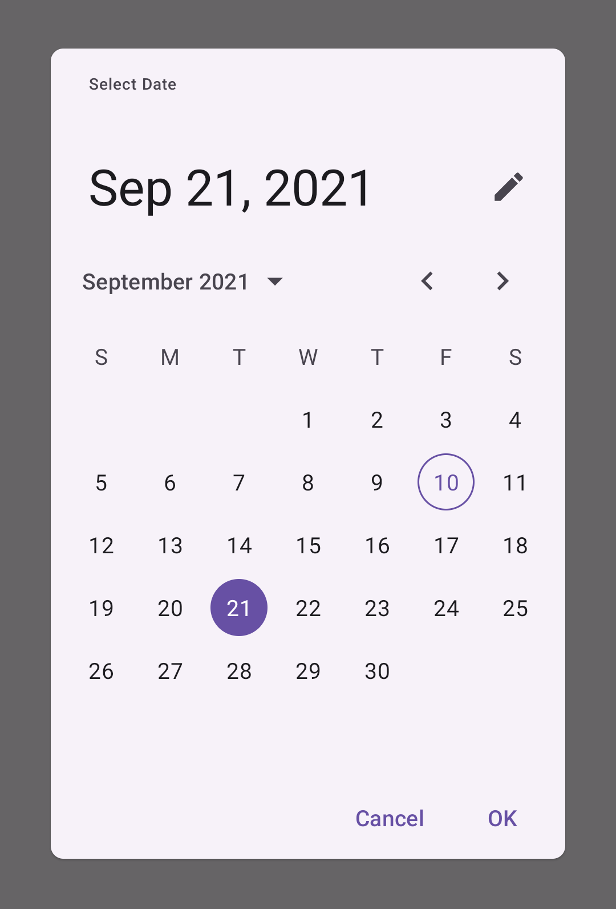

Use theme attributes and styles in `res/values/styles.xml`, which apply to all
date pickers and affect other components:

```xml
<style name="Theme.App" parent="Theme.Material3.*">
    ...
    <item name="colorPrimary">@color/shrine_pink_100</item>
    <item name="colorOnPrimary">@color/shrine_pink_900</item>
    <item name="shapeCornerFamily">cut</item>
</style>
```

Use a default style theme attribute, styles and a theme overlay which apply to
all date pickers but do not affect other components:

```xml
<style name="Theme.App" parent="Theme.Material3.*">
    ...
    <item name="materialCalendarTheme">@style/ThemeOverlay.App.DatePicker</item>
</style>

<style name="ThemeOverlay.App.DatePicker" parent="@style/ThemeOverlay.Material3.MaterialCalendar">
    <item name="colorPrimary">@color/shrine_pink_100</item>
    <item name="colorOnPrimary">@color/shrine_pink_900</item>
    <item name="shapeCornerFamily">cut</item>
    <!-- Customize text field of the text input mode. -->
    <item name="textInputStyle">@style/Widget.App.TextInputLayout</item>
</style>
```

Set the theme in code, which affects only this date picker:

```kt
val picker =
   MaterialDatePicker.Builder.datePicker()
      ...
       .setTheme(R.style.ThemeOverlay_App_DatePicker)
```
