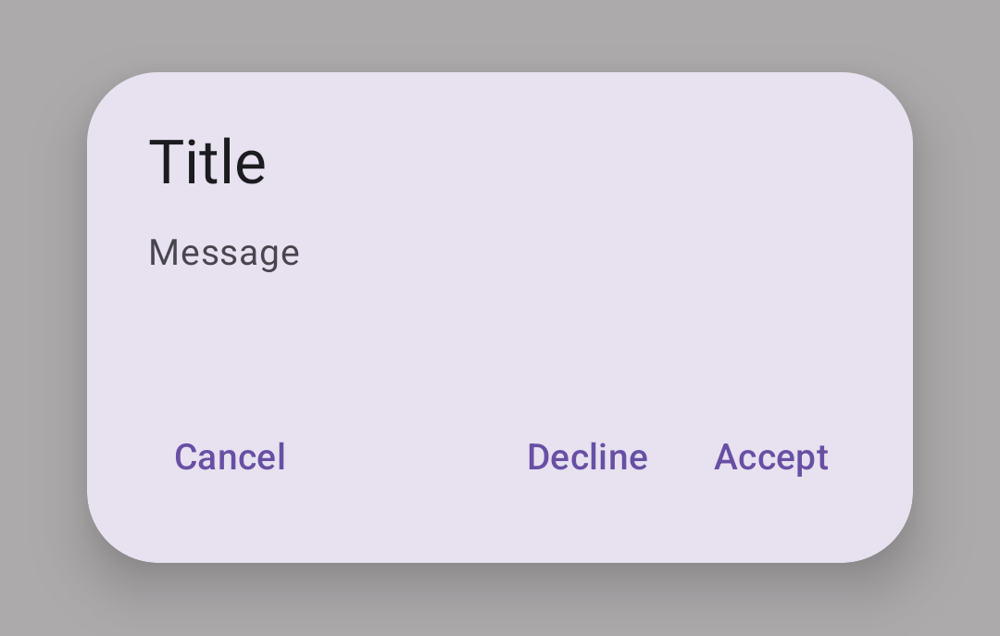

<!--docs:
title: "Dialogs"
layout: detail
section: components
excerpt: "Dialogs are modal windows that require interaction."
iconId: dialog
path: /catalog/dialogs/
-->

# Dialogs

[Dialogs](https://material.io/components/dialogs/) inform users about a task and
can contain critical information, require decisions, or involve multiple tasks.


**Contents**

*   [Design & API documentation](#design-api-documentation)
*   [Using dialogs](#using-dialogs)
*   [Basic dialog](#basic-dialog)
*   [Full-screen dialog](#full-screen-dialog)
*   [Theming](#theming-dialogs)

## Design & API Documentation

*   [Google Material3 Spec](https://material.io/components/date-pickers/overview)
*   [API reference](https://developer.android.com/reference/com/google/android/material/dialog/package-summary)

## Using dialogs

Before you can use Material dialogs, you need to add a dependency to the
Material Components for Android library. For more information, go to the
[Getting started](https://github.com/material-components/material-components-android/tree/master/docs/getting-started.md)
page.

```kt
MaterialAlertDialogBuilder(context)
    // Add customization options here
    .show()
```

### Making dialogs accessible

The contents within a dialog should follow their own accessibility guidelines,
such as an icon on a title having a content description via the
`android:contentDescription` attribute set in the
`MaterialAlertDialog.Material3.Title.Icon` style or descendant.

### Types

There are two types of dialogs: 1\. [Basic dialog](#basic-dialog), 2\.
[Full-screen dialog](#full-screen-dialog)


## Dialogs

A dialog is a type of modal window that appears in front of app content to
provide critical information or ask for a decision. Dialogs disable all app
functionality when they appear, and remain on screen until confirmed, dismissed,
or a required action has been taken.

Dialogs are purposefully interruptive, so they should be used sparingly.

### Dialog examples

API and source code:

*   `MaterialAlertDialogBuilder`
    *   [Class description](https://developer.android.com/reference/com/google/android/material/dialog/MaterialAlertDialogBuilder)
    *   [Class source](https://github.com/material-components/material-components-android/tree/master/lib/java/com/google/android/material/dialog/MaterialAlertDialogBuilder.java)

## Basic dialog

The following example shows a basic dialog.



In code:

```kt
MaterialAlertDialogBuilder(context)
        .setTitle(resources.getString(R.string.title))
        .setMessage(resources.getString(R.string.supporting_text))
        .setNeutralButton(resources.getString(R.string.cancel)) { dialog, which ->
            // Respond to neutral button press
        }
        .setNegativeButton(resources.getString(R.string.decline)) { dialog, which ->
            // Respond to negative button press
        }
        .setPositiveButton(resources.getString(R.string.accept)) { dialog, which ->
            // Respond to positive button press
        }
        .show()
```

## Full-screen dialog

Full-screen dialogs group a series of tasks, such as creating a calendar entry
with the event title, date, location, and time. Because they take up the entire
screen, full-screen dialogs are the only dialogs over which other dialogs can
appear.

There is no specific Material implementation of a full-screen dialog. You can
implement it by using a
[`DialogFragment`](https://developer.android.com/reference/androidx/fragment/app/DialogFragment)
as explained in the
[Android Developer guides](https://developer.android.com/guide/topics/ui/dialogs#FullscreenDialog).

### Anatomy and key properties

A dialog has a container, content (either supporting text or a set of items of a
particular type), a background scrim, and, optionally, title and buttons.


1.  Container
2.  Icon (optional)
3.  Title (optional)
4.  Content
5.  Buttons (optional)
6.  Scrim

#### Container attributes

Element                             | **Attribute**                                            | **Related methods**                                    | **Default value**
----------------------------------- | -------------------------------------------------------- | ------------------------------------------------------ | -----------------
**Color**                           | `app:backgroundTint`                                     | N/A                                                    | `?attr/colorSurfaceContainerHigh`
**Shape**                           | `app:shapeAppearance`<br/>`app:shapeAppearanceOverlay`   | N/A                                                    | `?attr/shapeAppearanceCornerExtraLarge`
**Background inset start and end**  | `app:backgroundInsetStart`<br/>`app:backgroundInsetEnd`  | `setBackgroundInsetStart`<br/>`setBackgroundInsetEnd`  | `24dp`
**Background inset top and bottom** | `app:backgroundInsetTop`<br/>`app:backgroundInsetBottom` | `setBackgroundInsetTop`<br/>`setBackgroundInsetBottom` | `80dp`

#### Title attributes

Element        | **Attribute**            | **Related methods**              | **Default value**
-------------- | ------------------------ | -------------------------------- | -----------------
**Text label** | N/A                      | `setTitle`<br/>`setCustomTitle`  | `null`
**Text color** | `android:textColor`      | N/A                              | `?attr/colorOnSurface`
**Typography** | `android:textAppearance` | N/A                              | `?attr/textAppearanceHeadlineSmall`
**Icon**       | N/A                      | `setIcon`<br/>`setIconAttribute` | `null`
**Icon tint**  | `app:tint`               | N/A                              | `?attr/colorSecondary`

#### Content attributes

**Supporting text**

Element        | **Attribute**            | **Related methods** | **Default value**
-------------- | ------------------------ | ------------------- | -----------------
**Text**       | N/A                      | `setMessage`        | `null`
**Color**      | `android:textColor`      | N/A                 | `?attr/colorOnSurfaceVariant`
**Typography** | `android:textAppearance` | N/A                 | `?attr/textAppearanceBodyMedium`

**List item**

Element                                 | **Attribute**                  | **Related methods**    | **Default value**
--------------------------------------- | ------------------------------ | ---------------------- | -----------------
**List item layout**                    | `app:listItemLayout`           | `setItems`             | [`@layout/mtrl_alert_select_dialog_item`](https://github.com/material-components/material-components-android/tree/master/lib/java/com/google/android/material/dialog/res/layout/mtrl_alert_select_dialog_item.xml)
**List item layout style**              | N/A                            | N/A                    | `?attr/materialAlertDialogBodyTextStyle`
**List item text color**                | `android:textColor`            | N/A                    | `?attr/colorOnSurfaceVariant`
**List item typography**                | `android:textAppearance`       | N/A                    | `?attr/textAppearanceBodyMedium`
**Multi choice item layout**            | `app:multiChoiceItemLayout`    | `setMultiChoiceItems`  | [`@layout/mtrl_alert_select_dialog_multichoice`](https://github.com/material-components/material-components-android/tree/master/lib/java/com/google/android/material/dialog/res/layout/mtrl_alert_select_dialog_multichoice.xml)
**Single choice item layout**           | `app:singleChoiceItemLayout`   | `setSingleChoiceItems` | [`@layout/mtrl_alert_select_dialog_singlechoice`](https://github.com/material-components/material-components-android/tree/master/lib/java/com/google/android/material/dialog/res/layout/mtrl_alert_select_dialog_singlechoice.xml)
**Multi/single choice item style**      | `android:checkedTextViewStyle` | N/A                    | `@style/Widget.Material3.CheckedTextView`
**Multi/single choice item text color** | `android:textColor`            | N/A                    | `?attr/colorOnSurfaceVariant`
**Multi/single choice item typography** | `android:textAppearance`       | N/A                    | `?attr/textAppearanceBodyLarge`

**Note:** You can set any custom view to be the content of your dialog via the
`setView` method.

#### Buttons attributes

Element                                          | **Attribute**                     | **Related methods** | **Default value**
------------------------------------------------ | --------------------------------- | ------------------- | -----------------
**Buttons theme attributes (negative/positive)** | `app:buttonBar*ButtonStyle`       | N/A                 | `@style/Widget.Material3.Button.TextButton.Dialog`
**Buttons theme attributes (neutral)**           | `app:buttonBarNeutralButtonStyle` | N/A                 | `@style/Widget.Material3.Button.TextButton.Dialog.Flush`
**Buttons (neutral/negative/positive)**          | N/A                               | `set*Button`        | `null`
**Icons**                                        | N/A                               | `set*ButtonIcon`    | `null`

For specific button attributes, see the
[Buttons documentation](https://github.com/material-components/material-components-android/tree/master/docs/components/Button.md).

#### Scrim attributes

Element        | **Attribute**                 | **Related methods** | **Default value**
-------------- | ----------------------------- | ------------------- | -----------------
**Dim amount** | `android:backgroundDimAmount` | N/A                 | 32%

#### Theme overlays

Element                    | **Theme overlay**
-------------------------- | -----------------
**Default theme overlay**  | `ThemeOverlay.Material3.MaterialAlertDialog`
**Centered theme overlay** | `ThemeOverlay.Material3.MaterialAlertDialog.Centered`

Default theme overlay attribute: `?attr/materialAlertDialogTheme`

#### Theme attributes

Element                   | **Theme attribute**                       | **Default value**
------------------------- | ----------------------------------------- | -----------------
**Default style**         | `?attr/alertDialogStyle`                  | `@style/MaterialAlertDialog.Material3`
**Title text style**      | `?attr/materialAlertDialogTitleTextStyle` | `@style/MaterialAlertDialog.Material3.Title.Text`
**Supporting text style** | `?attr/materialAlertDialogBodyTextStyle`  | `@style/MaterialAlertDialog.Material3.Body.Text`

See full list of
[styles](https://github.com/material-components/material-components-android/tree/master/lib/java/com/google/android/material/dialog/res/values/styles.xml),
[attributes](https://github.com/material-components/material-components-android/tree/master/lib/java/com/google/android/material/dialog/res/values/attrs.xml),
and
[theme overlays](https://github.com/material-components/material-components-android/tree/master/lib/java/com/google/android/material/dialog/res/values/themes.xml).

## Theming dialogs

A dialog supports
[Material Theming](https://material.io/components/dialogs/#theming) which can
customize color, typography and shape.

### Dialog theming example

API and source code:

*   `MaterialAlertDialogBuilder`
    *   [Class description](https://developer.android.com/reference/com/google/android/material/dialog/MaterialAlertDialogBuilder)
    *   [Class source](https://github.com/material-components/material-components-android/tree/master/lib/java/com/google/android/material/dialog/MaterialAlertDialogBuilder.java)

The following example shows a dialog with Material Theming.


#### Implementing dialog theming

Setting the theme attribute `materialAlertDialogTheme` to your custom
`ThemeOverlay` will affect all dialogs.

In `res/values/themes.xml`:

```xml
<style name="Theme.App" parent="Theme.Material3.*">
  ...
  <item name="materialAlertDialogTheme">@style/ThemeOverlay.App.MaterialAlertDialog</item>
</style>

<style name="ThemeOverlay.App.MaterialAlertDialog" parent="ThemeOverlay.Material3.MaterialAlertDialog">
    <item name="colorPrimary">@color/shrine_pink_100</item>
    <item name="colorSecondary">@color/shrine_pink_100</item>
    <item name="colorSurface">@color/shrine_pink_light</item>
    <item name="colorOnSurface">@color/shrine_pink_900</item>
    <item name="alertDialogStyle">@style/MaterialAlertDialog.App</item>
    <item name="materialAlertDialogTitleTextStyle">@style/MaterialAlertDialog.App.Title.Text</item>
    <item name="buttonBarPositiveButtonStyle">@style/Widget.App.Button</item>
    <item name="buttonBarNegativeButtonStyle">@style/Widget.App.Button</item>
</style>
```

In `res/values/styles.xml`:

```xml
<style name="MaterialAlertDialog.App" parent="MaterialAlertDialog.Material3">
    <item name="shapeAppearance">@style/ShapeAppearance.App.MediumComponent</item>
    <item name="shapeAppearanceOverlay">@null</item>
</style>

<style name="MaterialAlertDialog.App.Title.Text" parent="MaterialAlertDialog.Material3.Title.Text">
     <item name="android:textColor">@color/shrine_pink_900</item>
</style>

  <style name="Widget.App.Button" parent="Widget.Material3.Button.TextButton.Dialog">
    <item name="android:textColor">@color/shrine_pink_900</item>
  </style>

<style name="ShapeAppearance.App.MediumComponent" parent="ShapeAppearance.Material3.MediumComponent">
    <item name="cornerFamily">cut</item>
    <item name="cornerSize">8dp</item>
</style>
```

Or if you want to change only one specific dialog, pass the `themeResId` to the
constructor:

```kt
MaterialAlertDialogBuilder(context,  R.style.ThemeOverlay_App_MaterialAlertDialog)
        ...
        .show()
```
