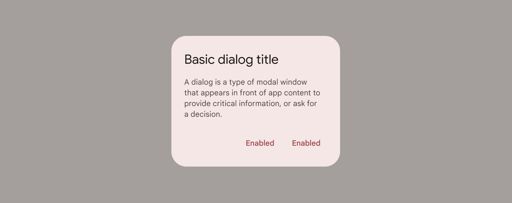
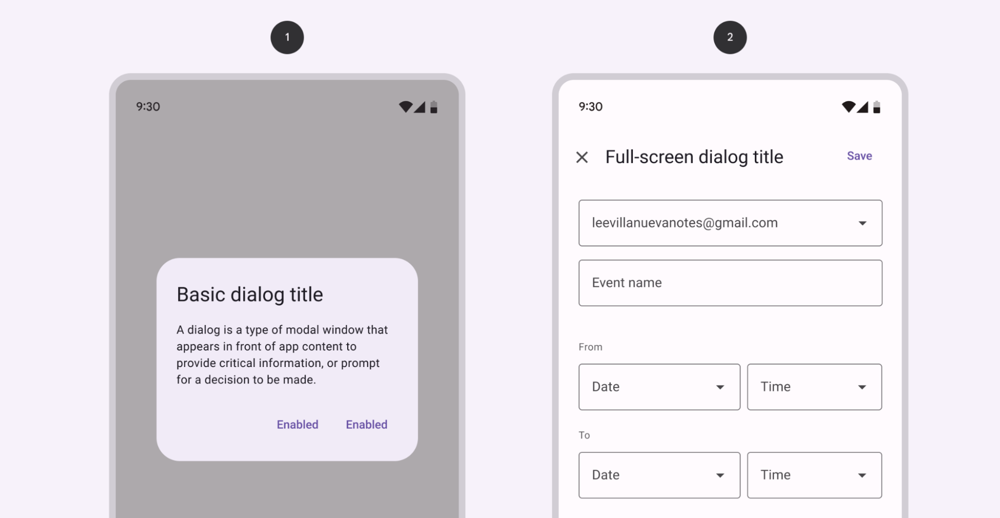
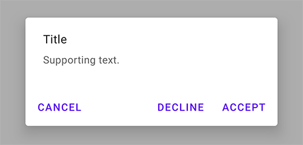
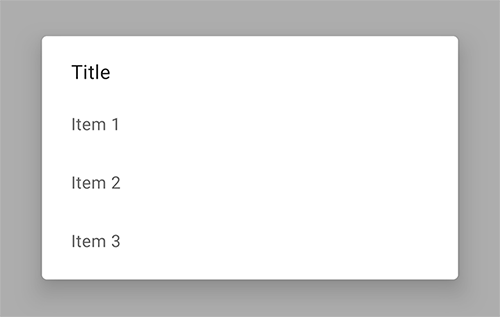
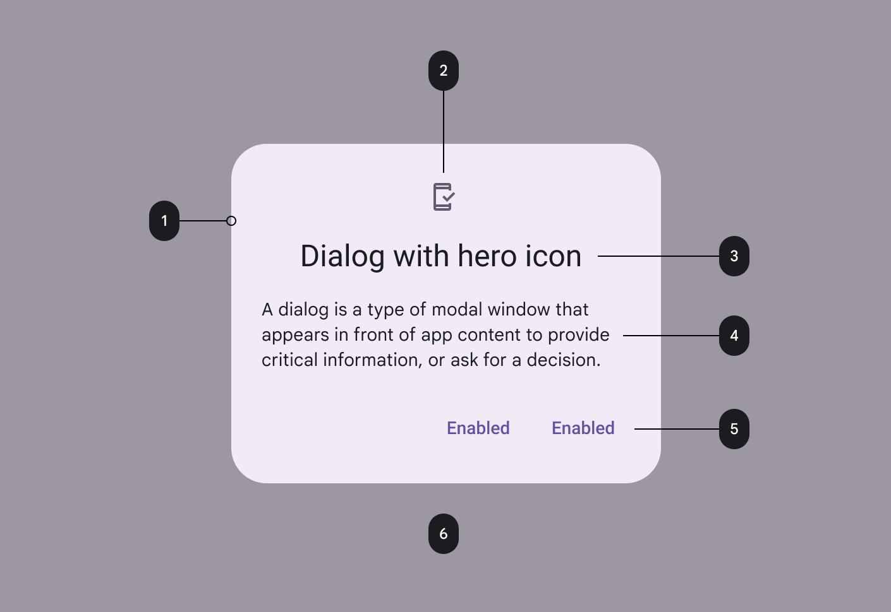
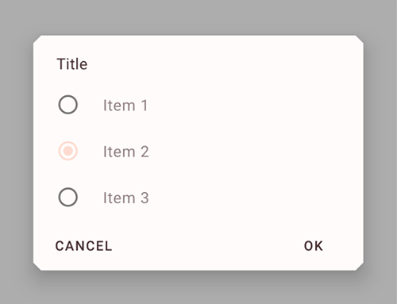

<!--docs:
title: "Dialogs"
layout: detail
section: components
excerpt: "Dialogs are modal windows that require interaction."
iconId: dialog
path: /catalog/dialogs/
-->

# Dialogs

[Dialogs](https://material.io/components/dialogs/) inform users about a task and
can contain critical information, require decisions, or involve multiple tasks.



**Contents**

*   [Using dialogs](#using-dialogs)
*   [Alert dialog](#alert-dialog)
*   [Simple dialog](#simple-dialog)
*   [Confirmation dialog](#confirmation-dialog)
*   [Full-screen dialog](#full-screen-dialog)
*   [Theming](#theming-dialogs)

## Using dialogs

Before you can use Material dialogs, you need to add a dependency to the
Material Components for Android library. For more information, go to the
[Getting started](https://github.com/material-components/material-components-android/tree/master/docs/getting-started.md)
page.

```kt
MaterialAlertDialogBuilder(context)
    // Add customization options here
    .show()
```

### Making dialogs accessible

The contents within a dialog should follow their own accessibility guidelines,
such as an icon on a title having a content description via the
`android:contentDescription` attribute set in the
`MaterialAlertDialog.MaterialComponents.Title.Icon` style or descendant.

## Types

There are four types of dialogs: 1\. [Alert dialog](#alert-dialog), 2\.
[Simple dialog](#simple-dialog), 3\.
[Confirmation dialog](#confirmation-dialog), 4\.
[Full-screen dialog](#full-screen-dialog)



## Dialogs

A dialog is a type of modal window that appears in front of app content to
provide critical information or ask for a decision. Dialogs disable all app
functionality when they appear, and remain on screen until confirmed, dismissed,
or a required action has been taken.

Dialogs are purposefully interruptive, so they should be used sparingly.

### Dialog examples

API and source code:

*   `MaterialAlertDialogBuilder`
    *   [Class description](https://developer.android.com/reference/com/google/android/material/dialog/MaterialAlertDialogBuilder)
    *   [Class source](https://github.com/material-components/material-components-android/tree/master/lib/java/com/google/android/material/dialog/MaterialAlertDialogBuilder.java)

#### Alert dialog

Alert dialogs interrupt users with urgent information, details, or actions.

The following example shows an alert dialog.



In code:

```kt
MaterialAlertDialogBuilder(context)
        .setTitle(resources.getString(R.string.title))
        .setMessage(resources.getString(R.string.supporting_text))
        .setNeutralButton(resources.getString(R.string.cancel)) { dialog, which ->
            // Respond to neutral button press
        }
        .setNegativeButton(resources.getString(R.string.decline)) { dialog, which ->
            // Respond to negative button press
        }
        .setPositiveButton(resources.getString(R.string.accept)) { dialog, which ->
            // Respond to positive button press
        }
        .show()
```

#### Simple dialog

Simple dialogs can display items that are immediately actionable when selected.
They don’t have text buttons.

As simple dialogs are interruptive, they should be used sparingly.
Alternatively, dropdown menus provide options in a non-modal, less disruptive
way.

The following example shows a simple dialog.



In code:

```kt
val items = arrayOf("Item 1", "Item 2", "Item 3")

MaterialAlertDialogBuilder(context)
        .setTitle(resources.getString(R.string.title))
        .setItems(items) { dialog, which ->
             // Respond to item chosen
         }
        .show()
```

#### Confirmation dialog

Confirmation dialogs give users the ability to provide final confirmation of a
choice before committing to it, so they have a chance to change their minds if
necessary.

If the user confirms a choice, it’s carried out. Otherwise, the user can dismiss
the dialog. For example, users can listen to multiple ringtones but only make a
final selection upon tapping “OK.”

The following example shows a confirmation dialog.


```kt
val singleItems = arrayOf("Item 1", "Item 2", "Item 3")
val checkedItem = 1

MaterialAlertDialogBuilder(context)
        .setTitle(resources.getString(R.string.title))
        .setNeutralButton(resources.getString(R.string.cancel)) { dialog, which ->
            // Respond to neutral button press
        }
        .setPositiveButton(resources.getString(R.string.ok)) { dialog, which ->
            // Respond to positive button press
        }
        // Single-choice items (initialized with checked item)
        .setSingleChoiceItems(singleItems, checkedItem) { dialog, which ->
             // Respond to item chosen
         }
        .show()
```

For multiple choice items you can do as follows:

```kt
val multiItems = arrayOf("Item 1", "Item 2", "Item 3")
val checkedItems = booleanArrayOf(true, false, false, false)

MaterialAlertDialogBuilder(context)
        ...
        //Multi-choice items (initialized with checked items)
        .setMultiChoiceItems(multiItems, checkedItems) { dialog, which, checked ->
            // Respond to item chosen
        }
        .show()
```

#### Full-screen dialog

Full-screen dialogs group a series of tasks, such as creating a calendar entry
with the event title, date, location, and time. Because they take up the entire
screen, full-screen dialogs are the only dialogs over which other dialogs can
appear.

There is no specific Material implementation of a full-screen dialog. You can
implement it by using a
[`DialogFragment`](https://developer.android.com/reference/androidx/fragment/app/DialogFragment)
as explained in the
[Android Developer guides](https://developer.android.com/guide/topics/ui/dialogs#FullscreenDialog).

### Anatomy and key properties

A dialog has a container, content (either supporting text or a set of items of a
particular type), a background scrim, and, optionally, title and buttons.



1.  Container
2.  Title (optional)
3.  Content
4.  Buttons (optional)
5.  Scrim

#### Container attributes

&nbsp;                              | **Attribute**                                            | **Related methods**                                    | **Default value**
----------------------------------- | -------------------------------------------------------- | ------------------------------------------------------ | -----------------
**Color**                           | N/A                                                      | N/A                                                    | `?attr/colorSurface`
**Shape**                           | `app:shapeAppearance`<br/>`app:shapeAppearanceOverlay`   | N/A                                                    | `?attr/shapeAppearanceMediumComponent`
**Background inset start and end**  | `app:backgroundInsetStart`<br/>`app:backgroundInsetEnd`  | `setBackgroundInsetStart`<br/>`setBackgroundInsetEnd`  | `24dp`
**Background inset top and bottom** | `app:backgroundInsetTop`<br/>`app:backgroundInsetBottom` | `setBackgroundInsetTop`<br/>`setBackgroundInsetBottom` | `80dp`

#### Title attributes

&nbsp;         | **Attribute**            | **Related methods**              | **Default value**
-------------- | ------------------------ | -------------------------------- | -----------------
**Text label** | N/A                      | `setTitle`<br/>`setCustomTitle`  | `null`
**Text color** | `android:textColor`      | N/A                              | `?attr/colorOnSurface` at 87%
**Typography** | `android:textAppearance` | N/A                              | `?attr/textAppearanceSubtitle1`
**Icon**       | N/A                      | `setIcon`<br/>`setIconAttribute` | `null`

#### Content attributes

**Supporting text**

&nbsp;         | **Attribute**            | **Related methods** | **Default value**
-------------- | ------------------------ | ------------------- | -----------------
**Text**       | N/A                      | `setMessage`        | `null`
**Color**      | `android:textColor`      | N/A                 | `?attr/colorOnSurface` at 60%
**Typography** | `android:textAppearance` | N/A                 | `?attr/textAppearanceBody2`

**List item**

&nbsp;                                  | **Attribute**                  | **Related methods**    | **Default value**
--------------------------------------- | ------------------------------ | ---------------------- | -----------------
**List item layout**                    | `app:listItemLayout`           | `setItems`             | [`@layout/mtrl_alert_select_dialog_item`](https://github.com/material-components/material-components-android/tree/master/lib/java/com/google/android/material/dialog/res/layout/mtrl_alert_select_dialog_item.xml)
**List item layout style**              | N/A                            | N/A                    | `?attr/materialAlertDialogBodyTextStyle`
**List item text color**                | `android:textColor`            | N/A                    | `?attr/colorOnSurface` at 60%
**List item typography**                | `android:textAppearance`       | N/A                    | `?attr/textAppearanceBody2`
**Multi choice item layout**            | `app:multiChoiceItemLayout`    | `setMultiChoiceItems`  | [`@layout/mtrl_alert_select_dialog_multichoice`](https://github.com/material-components/material-components-android/tree/master/lib/java/com/google/android/material/dialog/res/layout/mtrl_alert_select_dialog_multichoice.xml)
**Single choice item layout**           | `app:singleChoiceItemLayout`   | `setSingleChoiceItems` | [`@layout/mtrl_alert_select_dialog_singlechoice`](https://github.com/material-components/material-components-android/tree/master/lib/java/com/google/android/material/dialog/res/layout/mtrl_alert_select_dialog_singlechoice.xml)
**Multi/single choice item style**      | `android:checkedTextViewStyle` | N/A                    | `@style/Widget.MaterialComponents.CheckedTextView`
**Multi/single choice item text color** | `android:textColor`            | N/A                    | `?attr/colorOnSurface` at 60%
**Multi/single choice item typography** | `android:textAppearance`       | N/A                    | `?attr/textAppearanceBody1`

_**Note:** You can set any view to be the content of your dialog via the
`setView` method._

#### Buttons attributes

&nbsp;                                  | **Attribute**               | **Related methods** | **Default value**
--------------------------------------- | --------------------------- | ------------------- | -----------------
**Buttons theme attributes**            | `app:buttonBar*ButtonStyle` | N/A                 | `@style/Widget.MaterialComponents.Button.TextButton.Dialog`
**Buttons (neutral/negative/positive)** | N/A                         | `set*Button`        | `null`
**Icons**                               | N/A                         | `set*ButtonIcon`    | `null`

For specific button attributes, see the
[Buttons documentation](https://github.com/material-components/material-components-android/tree/master/docs/components/Button.md).

#### Scrim attributes

&nbsp;          | **Attribute**                 | **Related methods** | **Default value**
--------------- | ----------------------------- | ------------------- | -----------------
**Dim ammount** | `android:backgroundDimAmount` | N/A                 | 32%

#### Theme overlays

&nbsp;                     | **Theme overlay**
-------------------------- | -----------------
**Default theme overlay**  | `ThemeOverlay.MaterialComponents.MaterialAlertDialog`
**Centered theme overlay** | `ThemeOverlay.MaterialComponents.MaterialAlertDialog.Centered`

Default theme overlay attribute: `?attr/materialAlertDialogTheme`

#### Theme attributes

&nbsp;                    | **Theme attribute**                       | **Default value**
------------------------- | ----------------------------------------- | -----------------
**Default style**         | `?attr/alertDialogStyle`                  | `@style/MaterialAlertDialog.MaterialComponents`
**Title text style**      | `?attr/materialAlertDialogTitleTextStyle` | `@style/MaterialAlertDialog.MaterialComponents.Title.Text`
**Supporting text style** | `?attr/materialAlertDialogBodyTextStyle`  | `@style/MaterialAlertDialog.MaterialComponents.Body.Text`

See full list of
[styles](https://github.com/material-components/material-components-android/tree/master/lib/java/com/google/android/material/dialog/res/values/styles.xml),
[attributes](https://github.com/material-components/material-components-android/tree/master/lib/java/com/google/android/material/dialog/res/values/attrs.xml),
and
[theme overlays](https://github.com/material-components/material-components-android/tree/master/lib/java/com/google/android/material/dialog/res/values/themes.xml).

## Theming dialogs

A dialog supports
[Material Theming](https://material.io/components/dialogs/#theming) and can be
customized in terms of color, typography and shape.

### Dialog theming example

API and source code:

*   `MaterialAlertDialogBuilder`
    *   [Class description](https://developer.android.com/reference/com/google/android/material/dialog/MaterialAlertDialogBuilder)
    *   [Class source](https://github.com/material-components/material-components-android/tree/master/lib/java/com/google/android/material/dialog/MaterialAlertDialogBuilder.java)

The following example shows a dialog with Material Theming.



#### Implementing dialog theming

Setting the theme attribute `materialAlertDialogTheme` to your custom
`ThemeOverlay` will affect all dialogs.

In `res/values/themes.xml`:

```xml
<style name="Theme.App" parent="Theme.MaterialComponents.*">
  ...
  <item name="materialAlertDialogTheme">@style/ThemeOverlay.App.MaterialAlertDialog</item>
</style>

<style name="ThemeOverlay.App.MaterialAlertDialog" parent="ThemeOverlay.MaterialComponents.MaterialAlertDialog">
    <item name="colorPrimary">@color/shrine_pink_100</item>
    <item name="colorSecondary">@color/shrine_pink_100</item>
    <item name="colorSurface">@color/shrine_pink_light</item>
    <item name="colorOnSurface">@color/shrine_pink_900</item>
    <item name="alertDialogStyle">@style/MaterialAlertDialog.App</item>
    <item name="materialAlertDialogTitleTextStyle">@style/MaterialAlertDialog.App.Title.Text</item>
    <item name="buttonBarPositiveButtonStyle">@style/Widget.App.Button</item>
    <item name="buttonBarNeutralButtonStyle">@style/Widget.App.Button</item>
</style>
```

In `res/values/styles.xml`:

```xml
<style name="MaterialAlertDialog.App" parent="MaterialAlertDialog.MaterialComponents">
    <item name="shapeAppearance">@style/ShapeAppearance.App.MediumComponent</item>
</style>

<style name="MaterialAlertDialog.App.Title.Text" parent="MaterialAlertDialog.MaterialComponents.Title.Text">
     <item name="android:textColor">@color/shrine_pink_900</item>
</style>

<style name="Widget.App.Button" parent="Widget.MaterialComponents.Button.TextButton.Dialog">
    <item name="materialThemeOverlay">@style/ThemeOverlay.App.Button.TextButton</item>
    <item name="shapeAppearance">@style/ShapeAppearance.App.SmallComponent</item>
</style>

<style name="ThemeOverlay.App.Button" parent="">
    <item name="colorPrimary">@color/shrine_pink_900</item>
</style>

<style name="ShapeAppearance.App.MediumComponent" parent="ShapeAppearance.MaterialComponents.MediumComponent">
    <item name="cornerFamily">cut</item>
    <item name="cornerSize">8dp</item>
</style>

<style name="ShapeAppearance.App.SmallComponent" parent="ShapeAppearance.MaterialComponents.SmallComponent">
    <item name="cornerFamily">cut</item>
    <item name="cornerSize">4dp</item>
</style>
```

Or if you want to only change one specific dialog, pass the `themeResId` to the
constructor:

```kt
MaterialAlertDialogBuilder(context,  R.style.ThemeOverlay_App_MaterialAlertDialog)
        ...
        .show()
```
