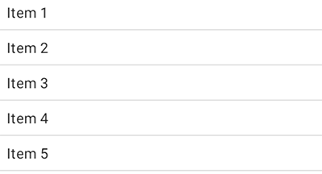
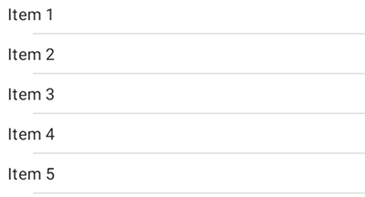
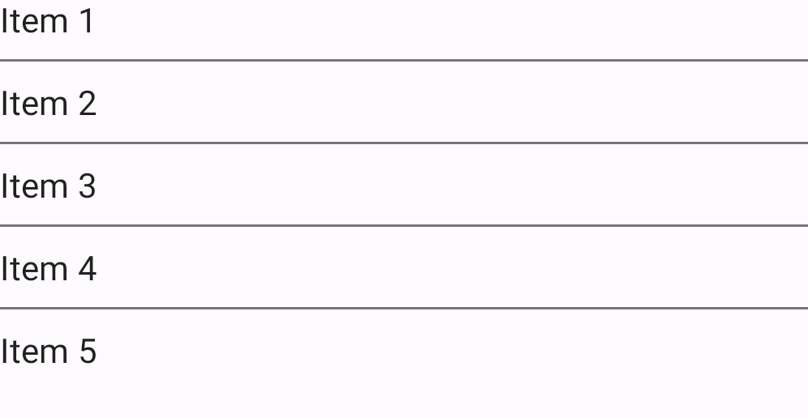
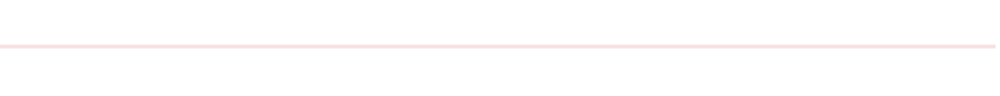

<!--docs:
title: "Dividers"
layout: detail
section: components
excerpt: "Dividers separate content into clear groups."
iconId: divider
path: /catalog/dividers/
-->

# Dividers

[Dividers](https://material.io/components/dividers) separate content into clear
groups.


**Contents**

*   [Design & API Documentation](#design-api-documentation)
*   [Using dividers](#using-dividers)
*   [Divider's key properties](#key-properties)
*   [Theming dividers](#theming-dividers)

## Design & API Documentation

*   [Google Material3 Spec](https://material.io/components/divider/overview)
*   [API reference](https://developer.android.com/reference/com/google/android/material/divider/package-summary)

## Using dividers

Before you can use Material dividers, you need to add a dependency to the
Material Components for Android library. For more information, go to the
[Getting started](https://github.com/material-components/material-components-android/tree/master/docs/getting-started.md)
page.

### `MaterialDivider`

API and source code:

*   `MaterialDivider`
    *   [Class definition](https://developer.android.com/reference/com/google/android/material/divider/MaterialDivider)
    *   [Class source](https://github.com/material-components/material-components-android/tree/master/lib/java/com/google/android/material/divider/MaterialDivider.java)

The `MaterialDivider` is a view that can be used in layouts to separate content
into clear groups.

**Note:** Make sure to set `android:layout_height="wrap_content"` on the
`MaterialDivider` to ensure that the correct size is set for the divider.

The full-bleed divider is displayed below:


On the layout:

```xml
<com.google.android.material.divider.MaterialDivider
    android:layout_width="match_parent"
    android:layout_height="wrap_content"/>
```

By default, dividers will be full-bleed. You can use `app:dividerInsetStart` and
`app:dividerInsetEnd` to achieve the look of an inset or middle divider:

```xml
<com.google.android.material.divider.MaterialDivider
    android:layout_width="match_parent"
    android:layout_height="wrap_content"
    app:dividerInsetStart="16dp"
    app:dividerInsetEnd="16dp"/>
```

Or in code:

```kt
divider.setDividerInsetStart(insetStart)
divider.setDividerInsetEnd(insetEnd)
```

### `MaterialDividerItemDecoration`

API and source code:

*   `MaterialDividerItemDecoration`
    *   [Class definition](https://developer.android.com/reference/com/google/android/material/divider/MaterialDividerItemDecoration)
    *   [Class source](https://github.com/material-components/material-components-android/tree/master/lib/java/com/google/android/material/divider/MaterialDividerItemDecoration.java)

The `MaterialDividerItemDecoration` is a `RecyclerView.ItemDecoration`, similar
to a `DividerItemDecoration`, that can be used as a divider between items of a
`LinearLayoutManager`. It supports both horizontal and vertical orientations.

A list with full-bleed dividers is displayed below:



In code:

```kt
val divider = MaterialDividerItemDecoration(context!!, LinearLayoutManager.VERTICAL /*or LinearLayoutManager.HORIZONTAL*/)
recyclerView.addItemDecoration(divider)
```

By default, dividers will be full-bleed. To achieve the look of an inset or
middle divider:



In code:

```kt
divider.setDividerInsetStart(insetStart)
divider.setDividerInsetEnd(insetEnd)
```

Optionally, you can hide the last divider of a list:



In code:

```kt
divider.setLastItemDecorated(false)
```

### Making dividers accessible

The divider is a decorative element. There are no special accessibility
precautions for the divider.

## Key properties

### Dividers attributes

Element                 | Attribute               | Related method(s)                                                                    | Default value
----------------------- | ----------------------- | ------------------------------------------------------------------------------------ | -------------
**Thickness**           | `app:dividerThickness`  | `setDividerThickness`<br/>`setDividerThicknessResource`<br/>`getDividerThickness`    | `1dp` for the regular divider <br/> `8dp` for the heavy divider
**Color**               | `app:dividerColor`      | `setDividerColor`<br/>`setDividerColorResource`<br/>`getDividerColor`                | `?attr/colorOutline`
**Start inset**         | `app:dividerInsetStart` | `setDividerInsetStart`<br/>`setDividerInsetStartResource`<br/>`getDividerInsetStart` | `0dp`
**End inset**           | `app:dividerInsetEnd`   | `setDividerInsetEnd`<br/>`setDividerInsetEndResource`<br/>`getDividerInsetEnd`       | `0dp`
**Last item decorated** | `app:lastItemDecorated` | `setLastItemDecorated`<br/>`isLastItemDecorated`                                     | `true`

### Styles

Element           | Style
----------------- | -------------------------------------------
**Default style** | `Widget.Material3.MaterialDivider`

Default style theme attribute: `?attr/materialDividerStyle`

See the full list of
[styles](https://github.com/material-components/material-components-android/tree/master/lib/java/com/google/android/material/divider/res/values/styles.xml)
and
[attrs](https://github.com/material-components/material-components-android/tree/master/lib/java/com/google/android/material/divider/res/values/attrs.xml).

## Theming dividers

Dividers support
[Material Theming](https://material.io/components/selection-controls#theming) and therefore can have their colors customized.

### Divider theming example

API and source code:

*   `MaterialDivider`
    *   [Class definition](https://developer.android.com/reference/com/google/android/material/divider/MaterialDivider)
    *   [Class source](https://github.com/material-components/material-components-android/tree/master/lib/java/com/google/android/material/divider/MaterialDivider.java)
*   `MaterialDividerItemDecoration`
    *   [Class definition](https://developer.android.com/reference/com/google/android/material/divider/MaterialDividerItemDecoration)
    *   [Class source](https://github.com/material-components/material-components-android/tree/master/lib/java/com/google/android/material/divider/MaterialDividerItemDecoration.java)

The following example shows a divider with Material Theming.



#### Implementing divider theming

Use theme attributes in `res/values/styles.xml`, which applies to all dividers
and affects other components:

```xml
<style name="Theme.App" parent="Theme.Material3.*">
    ...
    <item name="colorOutline">@color/shrine_pink_900</item>
</style>
```

Use default style theme attributes, styles and theme overlays, which apply to
all dividers but do not affect other components:

```xml
<style name="Theme.App" parent="Theme.Material3.*">
    ...
    <item name="materialDividerStyle">@style/Widget.App.MaterialDivider</item>
</style>

<style name="Widget.App.MaterialDivider" parent="Widget.Material3.MaterialDivider">
    <item name="materialThemeOverlay">@style/ThemeOverlay.App.MaterialDivider</item>
</style>

<style name="ThemeOverlay.App.MaterialDivider" parent="">
    <item name="colorOutline">@color/shrine_pink_900</item>
</style>
```

More easily, you can also change the divider color via the `?attr/dividerColor`
attribute:

```xml
<style name="Widget.App.MaterialDivider" parent="Widget.Material3.MaterialDivider">
   <item name="dividerColor">@color/shrine_divider_color</item>
</style>
```

or use the style in the layout, which affects only this divider:

```xml
<com.google.android.material.divider.MaterialDivider
    style="@style/Widget.App.MaterialDivider"
    android:layout_width="match_parent"
    android:layout_height="wrap_content"/>
```
