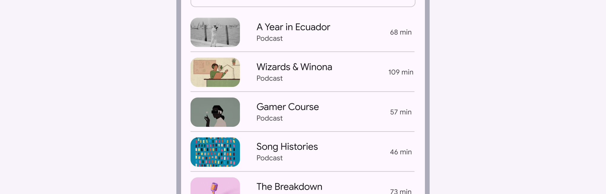
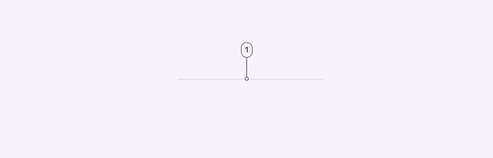
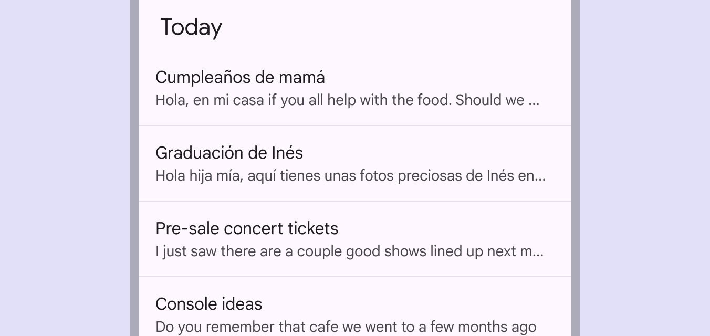
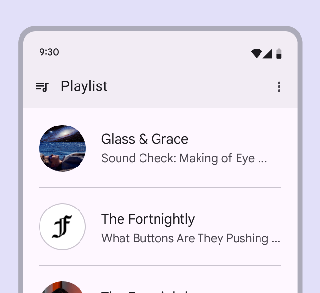
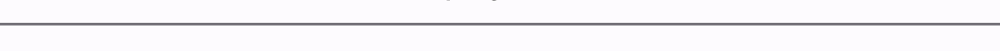
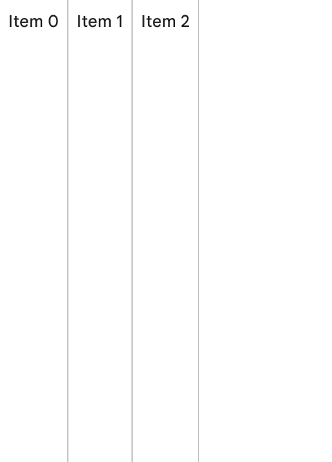
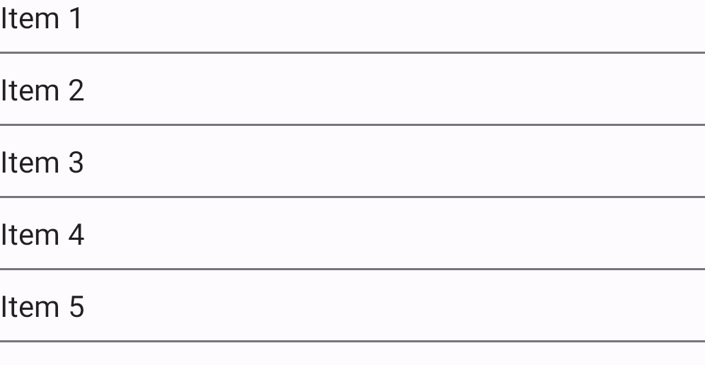
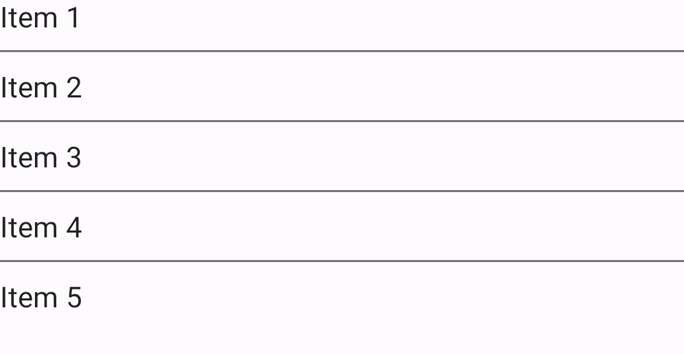
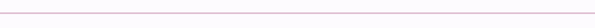

<!--docs:
title: "Dividers"
layout: detail
section: components
excerpt: "Dividers separate content into clear groups."
iconId: divider
path: /catalog/dividers/
-->

# Dividers

[Dividers](https://m3.material.io/components/divider/overview) are thin lines
that group content in lists or other containers. Dividers are one way to
visually group components and create hierarchy. They can also be used to imply
nested parent/child relationships.



**Note:** Images use various dynamic color schemes.

## Design & API documentation

*   [Material 3 (M3) spec](https://m3.material.io/components/divider/overview)
*   [API reference](https://developer.android.com/reference/com/google/android/material/divider/package-summary)

## Anatomy



1.  Divider

More details on anatomy items in the
[component guidelines](https://m3.material.io/components/divider/guidelines#b56e93b4-b56d-4e12-bd9f-68ce55132cc4).

## Key properties

### Dividers attributes

Element                 | Attribute               | Related method(s)                                                                    | Default value
----------------------- | ----------------------- | ------------------------------------------------------------------------------------ | -------------
**Thickness**           | `app:dividerThickness`  | `setDividerThickness`<br/>`setDividerThicknessResource`<br/>`getDividerThickness`    | `1dp` for the regular divider <br/> `8dp` for the heavy divider
**Color**               | `app:dividerColor`      | `setDividerColor`<br/>`setDividerColorResource`<br/>`getDividerColor`                | `?attr/colorOutlineVariant`
**Start inset**         | `app:dividerInsetStart` | `setDividerInsetStart`<br/>`setDividerInsetStartResource`<br/>`getDividerInsetStart` | `0dp`
**End inset**           | `app:dividerInsetEnd`   | `setDividerInsetEnd`<br/>`setDividerInsetEndResource`<br/>`getDividerInsetEnd`       | `0dp`
**Last item decorated** | `app:lastItemDecorated` | `setLastItemDecorated`<br/>`isLastItemDecorated`                                     | `true`

### Styles

Element           | Style                              | Theme attribute
----------------- | ---------------------------------- | ---------------
**Default style** | `Widget.Material3.MaterialDivider` | `?attr/materialDividerStyle`

For the full list, see
[styles](https://github.com/material-components/material-components-android/tree/master/lib/java/com/google/android/material/divider/res/values/styles.xml)
and
[attrs](https://github.com/material-components/material-components-android/tree/master/lib/java/com/google/android/material/divider/res/values/attrs.xml).

## Types of divider

There are two types of dividers:

*   Full width
*   Inset

### Full width divider


Full width dividers to indicate separation of content

Full width dividers separate larger sections of unrelated content. They also
separate interactive areas from non-interactive areas. They can be used directly
on a surface or inside other components like cards or lists.

### Inset divider


Inset divider to indicate separation of content

Inset dividers separate related content within a section. They are equally
indented from both sides of the screen by default.

## Code implementation

Before you can use Material dividers, you need to add a dependency to the
Material components for Android library. For more information, go to the
[Getting started](https://github.com/material-components/material-components-android/tree/master/docs/getting-started.md)
page.

### Adding `MaterialDivider`

API and source code:

*   `MaterialDivider`
    *   [Class definition](https://developer.android.com/reference/com/google/android/material/divider/MaterialDivider)
    *   [Class source](https://github.com/material-components/material-components-android/tree/master/lib/java/com/google/android/material/divider/MaterialDivider.java)

The `MaterialDivider` is a view that can be used in layouts to separate content
into clear groups.

**Note:** Make sure to set `android:layout_height="wrap_content"` on the
`MaterialDivider` to ensure that the correct size is set for the divider.

The full-bleed divider is displayed below:



On the layout:

```xml
<com.google.android.material.divider.MaterialDivider
    android:layout_width="match_parent"
    android:layout_height="wrap_content"/>
```

By default, dividers will be full-bleed. You can use `app:dividerInsetStart` and
`app:dividerInsetEnd` to achieve the look of an inset or middle divider:

```xml
<com.google.android.material.divider.MaterialDivider
    android:layout_width="match_parent"
    android:layout_height="wrap_content"
    app:dividerInsetStart="16dp"
    app:dividerInsetEnd="16dp"/>
```

Or in code:

```kt
divider.setDividerInsetStart(insetStart)
divider.setDividerInsetEnd(insetEnd)
```

### Adding heavy divider


Heavy dividers are used for indicating a visual break or stop between major
sections in a long page. They are used as an additional level of visual
differentiation and hierarchy within a layout.

Note: Make sure to set `android:layout_height="wrap_content"` on the
`MaterialDivider` to ensure that the correct size is set for the divider.

```xml
<com.google.android.material.divider.MaterialDivider
    style="?attr/materialDividerHeavyStyle"
    android:layout_width="match_parent"
    android:layout_height="wrap_content"
    android:layout_marginTop="16dp"
    android:layout_marginBottom="16dp" />
```

Note: Heavy dividers are automatically used as the default for dividers set to
`?attr/materialDividerHeavyStyle`, which points to
`@style/Widget.Material3.MaterialDivider.Heavy`. To get the heavy divider,
you should set the divider style to `?attr/materialDividerHeavyStyle`.

### Adding `MaterialDividerItemDecoration`

API and source code:

*   `MaterialDividerItemDecoration`
    *   [Class definition](https://developer.android.com/reference/com/google/android/material/divider/MaterialDividerItemDecoration)
    *   [Class source](https://github.com/material-components/material-components-android/tree/master/lib/java/com/google/android/material/divider/MaterialDividerItemDecoration.java)

The `MaterialDividerItemDecoration` is a `RecyclerView.ItemDecoration`, similar
to a `DividerItemDecoration`, that can be used as a divider between items of a
`LinearLayoutManager`. It supports both horizontal and vertical orientations.

Divider in a vertically oriented RecyclerView:



A list with full-bleed dividers is displayed below:



In code:

```kt
val divider = MaterialDividerItemDecoration(context!!, LinearLayoutManager.VERTICAL /*or LinearLayoutManager.HORIZONTAL*/)
recyclerView.addItemDecoration(divider)
```

By default, dividers will be full-bleed. To achieve the look of an inset or
middle divider:


In code:

```kt
divider.setDividerInsetStart(insetStart)
divider.setDividerInsetEnd(insetEnd)
```

Optionally, you can hide the last divider of a list:



In code:

```kt
divider.setLastItemDecorated(false)
```

### Making dividers accessible

The divider is a decorative element. There are no special accessibility
precautions for the divider.

## Customizing dividers

### Theming dividers

Dividers support the customization of color.

#### Divider theming example

API and source code:

*   `MaterialDivider`
    *   [Class definition](https://developer.android.com/reference/com/google/android/material/divider/MaterialDivider)
    *   [Class source](https://github.com/material-components/material-components-android/tree/master/lib/java/com/google/android/material/divider/MaterialDivider.java)
*   `MaterialDividerItemDecoration`
    *   [Class definition](https://developer.android.com/reference/com/google/android/material/divider/MaterialDividerItemDecoration)
    *   [Class source](https://github.com/material-components/material-components-android/tree/master/lib/java/com/google/android/material/divider/MaterialDividerItemDecoration.java)

The following example shows a divider with Material theming.



##### Implementing divider theming

Use theme attributes in `res/values/styles.xml`, which applies to all dividers
and affects other components:

```xml
<style name="Theme.App" parent="Theme.Material3.*">
    ...
    <item name="colorOutline">@color/shrine_pink_900</item>
</style>
```

Use default style theme attributes, styles and theme overlays, which apply to
all dividers but do not affect other components:

```xml
<style name="Theme.App" parent="Theme.Material3.*">
    ...
    <item name="materialDividerStyle">@style/Widget.App.MaterialDivider</item>
</style>

<style name="Widget.App.MaterialDivider" parent="Widget.Material3.MaterialDivider">
    <item name="materialThemeOverlay">@style/ThemeOverlay.App.MaterialDivider</item>
</style>

<style name="ThemeOverlay.App.MaterialDivider" parent="">
    <item name="colorOutline">@color/shrine_pink_900</item>
</style>
```

More easily, you can also change the divider color via the `?attr/dividerColor`
attribute:

```xml
<style name="Widget.App.MaterialDivider" parent="Widget.Material3.MaterialDivider">
   <item name="dividerColor">@color/shrine_divider_color</item>
</style>
```

or use the style in the layout, which affects only this divider:

```xml
<com.google.android.material.divider.MaterialDivider
    style="@style/Widget.App.MaterialDivider"
    android:layout_width="match_parent"
    android:layout_height="wrap_content"/>
```
