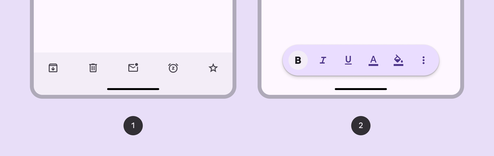
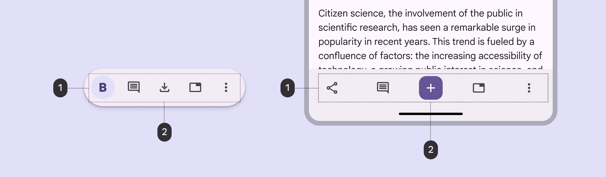
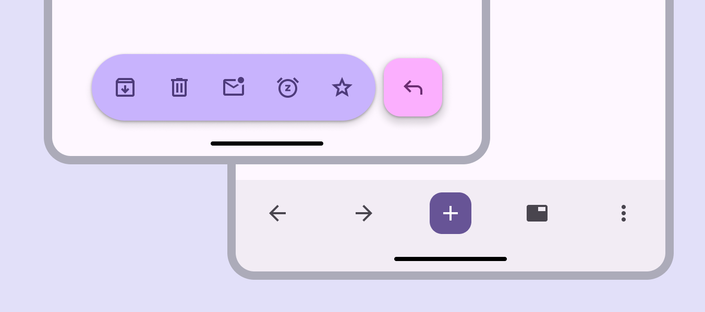

<!--docs:
title: "Docked & floating toolbars"
layout: detail
section: components
excerpt: "Docked & floating toolbars display frequently used actions relevant to the current page"
iconId: docked_and_floating_toolbars
path: /catalog/docked-and-floating-toolbars/
-->

# Docked & floating toolbars

Docked & floating toolbars display frequently used actions relevant to the
current page.

1.  [Docked toolbar](DockedToolbar.md): Spans the full width of the window. It’s
    best used for global actions that remain the same across multiple pages.
2.  [Floating toolbar](FloatingToolbar.md): Floats above the body content. It’s
    best used for contextual actions relevant to the body content or the
    specific page.

**Note:** Images use various dynamic color schemes.

## Design & API documentation

*   [Material 3 (M3) spec](https://m3.material.io/components/toolbars/overview)

## Anatomy

1.  Container
2.  Elements

More details on anatomy items in the
[component guidelines](https://m3.material.io/components/toolbars/guidelines#d6b7bcb1-295d-41e6-a051-37f12e1c96ab).

## M3 Expressive update

Before you can use `Material3Expressive` component styles, follow the
[`Material3Expressive themes` setup instructions](https://github.com/material-components/material-components-android/tree/master/docs/getting-started.md#material3expressive-themes).

1.  Floating, vibrant color scheme and paired with FAB
2.  Docked with embedded primary action instead of FAB

The **bottom app bar** is being deprecated and should be replaced with the
**docked toolbar**, which functions similarly, but is shorter and has more
flexibility. The **floating toolbar** was created for more versatility, greater
amounts of actions, and more variety in where it's placed. an inset icon.
[More on M3 Expressive](https://m3.material.io/blog/building-with-m3-expressive)

**Types and naming**

*   Added **[docked toolbar](DockedToolbar.md)** to replace
    **[bottom app bar](BottomAppBar.md)**

    *   Size: Shorter height
    *   Color: Standard or vibrant
    *   Flexibility: More layout and element options

*   Added **[floating toolbar](FloatingToolbar.md)** with the following
    attributes:

    *   Layout: Horizontal or vertical
    *   Color: Standard or vibrant
    *   Flexibility: Can hold many elements and components. Can be paired with
        FAB.

*   **Bottom app bar** is still available, but not recommended
