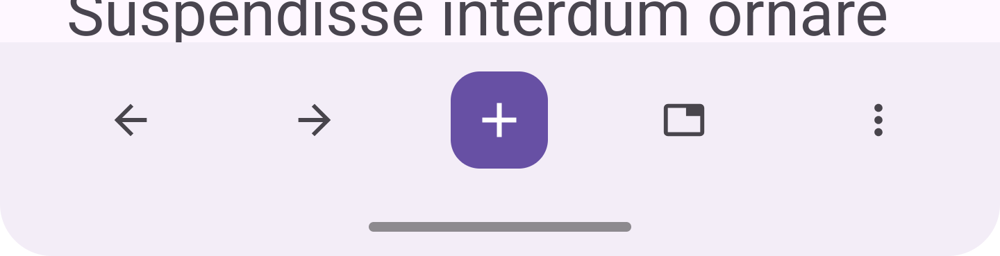
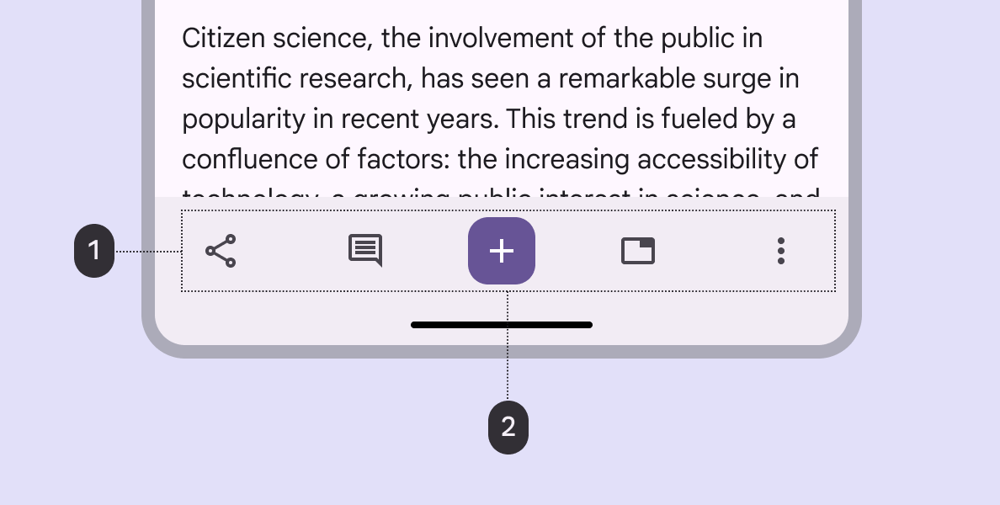
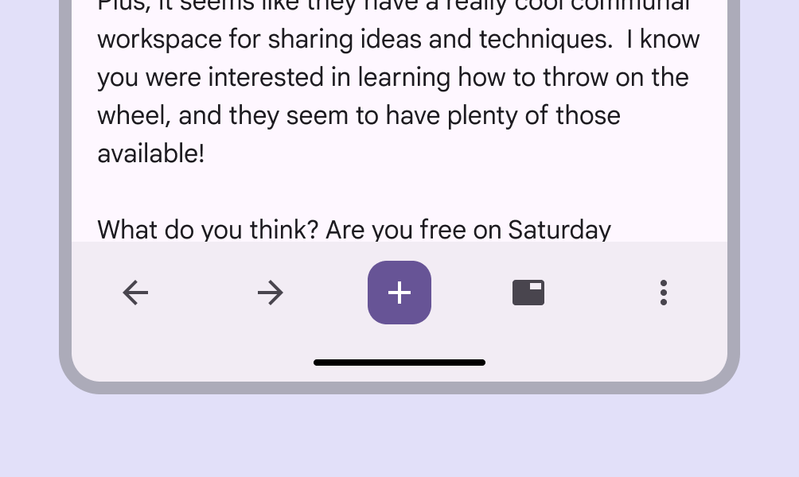
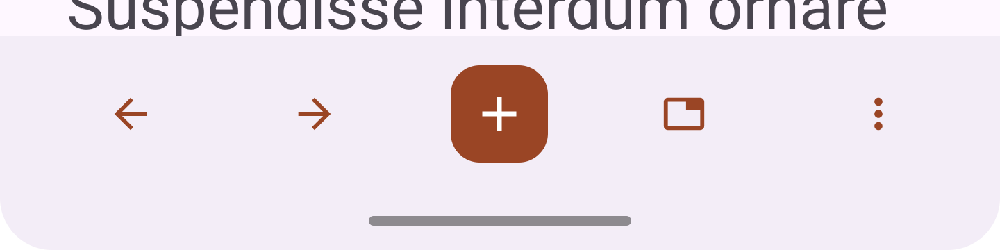

<!--docs:
title: "Docked toolbar"
layout: detail
section: components
excerpt: "Docked toolbars show actions related to the current page"
iconId: docked_toolbar
path: /catalog/docked-toolbar/
-->

# Docked toolbar

Docked toolbar provides a way to show actions related to the current page.



**Note:** Images use various dynamic color schemes.

## Design & API documentation

*   [Material 3 (M3) spec](https://m3.material.io/components/toolbars/overview)
*   API reference in progress

## Anatomy



1.  Container
2.  Elements

More details on anatomy items in the
[component guidelines](https://m3.material.io/components/toolbars/guidelines#d6b7bcb1-295d-41e6-a051-37f12e1c96ab).

## M3 Expressive

### M3 Expressive update

Before you can use `Material3Expressive` component styles, follow the
[`Material3Expressive themes` setup instructions](https://github.com/material-components/material-components-android/tree/master/docs/getting-started.md#material3expressive-themes).


Docked with embedded primary action instead of FAB

The **bottom app bar** is being deprecated and should be replaced with the
**docked toolbar**, which functions similarly, but is shorter and has more
flexibility.
[More on M3 Expressive](https://m3.material.io/blog/building-with-m3-expressive)

**Types and naming**

*   Added **docked toolbar** to replace **bottom app bar**

    *   Size: Shorter height
    *   Color: Standard or vibrant
    *   Flexibility: More layout and element options

*   **Bottom app bar** is still available, but not recommended

### M3 Expressive styles

The standard style for the docked toolbar is defined as below:

```xml
<item name="dockedToolbarStyle">@style/Widget.Material3Expressive.DockedToolbar</item>
```

## Key properties

### Container attributes

Element                  | Attribute                             | Related methods | Default value
------------------------ | ------------------------------------- | --------------- | -------------
**Color**                | `app:backgroundTint`                  | N/A             | `?attr/colorSurfaceContainer`
**Shape**                | `app:shapeAppearance`                 | N/A             | `0% rounded`
**Top inset padding**    | `app:paddingTopSystemWindowInsets`    | N/A             | `unset`
**Bottom inset padding** | `app:paddingBottomSystemWindowInsets` | N/A             | `unset`

**Note:** `DockedToolbarLayout` automatically adds top or bottom inset based on
its gravity inside a `CoordinatorLayout`, if `app:paddingTopSystemWindowInsets`
or `app:paddingBottomSystemWindowInsets` is not set. If not using a docked
toolbar inside a `CoordinatorLayout`, set these attributes explicitly to add
inset padding.

### Styles

Element           | Style                                    | Theme attribute
----------------- | ---------------------------------------- | ---------------
**Default style** | `Widget.Material3.DockedToolbar`         | `?attr/dockedToolbarStyle`
**Vibrant style** | `Widget.Material3.DockedToolbar.Vibrant` | `?attr/dockedToolbarVibrantStyle`

The default style is the standard style.

Docked toolbar also recommends a special style for specific components for when
they are inside of a docked toolbar. Currently, the docked toolbar styles also
include a theme overlay for `?attr/materialButtonStyle`,
`?attr/materialIconButtonStyle`, and `?attr/borderlessButtonStyle` to style
buttons inside of a docked toolbar.

For the full list, see
[styles](https://github.com/material-components/material-components-android/tree/master/lib/java/com/google/android/material/dockedtoolbar/res/values/styles.xml)
and
[docked toolbar attributes](https://github.com/material-components/material-components-android/tree/master/lib/java/com/google/android/material/dockedtoolbar/res/values/attrs.xml)

## Code implementation

Before you can use the docked toolbar, you need to add a dependency to the
Material components for Android library. For more information, go to the
[Getting started](https://github.com/material-components/material-components-android/tree/master/docs/getting-started.md)
page.

### Adding docked toolbar

Here's what a typical layout would look like:

```xml
<androidx.coordinatorlayout.widget.CoordinatorLayout
  xmlns:android="http://schemas.android.com/apk/res/android"
  xmlns:app="http://schemas.android.com/apk/res-auto"
  android:layout_width="match_parent"
  android:layout_height="match_parent">

  <!-- sample screen content -->
  <androidx.core.widget.NestedScrollView
    android:layout_width="match_parent"
    android:layout_height="match_parent">
    <LinearLayout
      android:layout_width="match_parent"
      android:layout_height="wrap_content">

      <TextView
        android:layout_width="wrap_content"
        android:layout_height="wrap_content"
        android:text="@string/content" />
    </LinearLayout>
  </androidx.core.widget.NestedScrollView>

  <com.google.android.material.dockedtoolbar.DockedToolbarLayout
    android:id="@+id/docked_toolbar"
    android:layout_width="match_parent"
    android:layout_height="wrap_content"
    android:layout_gravity="bottom"
    app:layout_behavior="com.google.android.material.behavior.HideViewOnScrollBehavior">

    <!-- docked toolbar sample content -->
    <com.google.android.material.overflow.OverflowLinearLayout
      android:id="@+id/docked_toolbar_child"
      android:layout_width="wrap_content"
      android:layout_height="wrap_content"
      android:layout_gravity="center"
      android:orientation="horizontal">
      <FrameLayout
        android:layout_width="0dp"
        android:layout_height="wrap_content"
        android:minWidth="48dp"
        android:layout_weight="1"
        app:layout_overflowText="@string/docked_toolbar_back_button_description"
        app:layout_overflowIcon="@drawable/ic_arrow_back_24px">
        <Button
          android:id="@+id/docked_toolbar_back_button"
          android:layout_width="wrap_content"
          android:layout_height="wrap_content"
          android:layout_gravity="center"
          style="?attr/materialIconButtonStyle"
          android:contentDescription="@string/docked_toolbar_back_button_description"
          app:icon="@drawable/ic_arrow_back_24px" />
      </FrameLayout>

      <FrameLayout
        android:layout_width="0dp"
        android:layout_height="wrap_content"
        android:minWidth="48dp"
        android:layout_weight="1"
        app:layout_overflowText="@string/docked_toolbar_add_button_description"
        app:layout_overflowIcon="@drawable/ic_add_24px">
        <Button
          android:id="@+id/docked_toolbar_add_button"
          android:layout_width="wrap_content"
          android:layout_height="wrap_content"
          android:layout_gravity="center"
          style="?attr/materialIconButtonStyle"
          android:contentDescription="@string/docked_toolbar_add_button_description"
          app:icon="@drawable/ic_add_24px" />
      </FrameLayout>

      <FrameLayout
        android:layout_width="0dp"
        android:layout_height="wrap_content"
        android:minWidth="48dp"
        android:layout_weight="1"
        app:layout_overflowText="@string/docked_toolbar_forward_button_description"
        app:layout_overflowIcon="@drawable/ic_arrow_forward_24px">
        <Button
          android:id="@+id/docked_toolbar_forward_button"
          android:layout_width="wrap_content"
          android:layout_height="wrap_content"
          android:layout_gravity="center"
          style="?attr/materialIconButtonStyle"
          android:contentDescription="@string/docked_toolbar_forward_button_description"
          app:icon="@drawable/ic_arrow_forward_24px" />
      </FrameLayout>
    </com.google.android.material.overflow.OverflowLinearLayout>

  </com.google.android.material.dockedtoolbar.DockedToolbarLayout>
</androidx.coordinatorlayout.widget.CoordinatorLayout>
```

A docked toolbar is a `FrameLayout` that provides additional styling. You may
add children to it as you would to a `FrameLayout`. It's recommended to have its
children wrapped by an `OverflowLinearLayout` that will handle automatically
adding items to an overflow menu when there's not enough screen space to show
all the items.

When using `OverflowLinearLayout`, you should also set `app:layout_overflowText`
on each child as that will be the text of the menu item that corresponds to the
hidden child. Optionally, you can also set `app:layout_overflowIcon`. See
[OverflowLinearLayout](https://github.com/material-components/material-components-android/tree/master/docs/components/OverflowLinearLayout.md)
for more information.

Note: if the child view that is clickable is not a direct child of
`OverflowLinearLayout`, such as the case of the example above, make sure to
propagate the parent's click to the child. That is so overflowed items in the
overflowed menu respond properly to being clicked. Alternatively, you can also
set `onClickListener`s on the overflowed items directly by accessing them via
`OverflowLinearLayout.getOverflowedViews()`.

Docked toolbars can optionally hide on scroll off the bottom if inside a
`CoordinatorLayout` by setting the following `CoordinatorLayout.Behavior`
through the `app:layout_behavior` attribute:

```xml
<com.google.android.material.dockedtoolbar.DockedToolbarLayout
    android:id="@+id/docked_toolbar"
    android:layout_width="match_parent"
    android:layout_height="wrap_content"
    android:layout_gravity="bottom"
    app:layout_behavior="com.google.android.material.behavior.HideViewOnScrollBehavior">
  ...
</com.google.android.material.dockedtoolbar.DockedToolbarLayout>
```

[Top app bars](TopAppBar.md) and [Bottom app bars](BottomAppBar.md) are also
implementations of a docked toolbar which offer more in terms of functionality,
but are less flexible than the `DockedToolbarLayout` implementation.

API and source code:

*   `DockedToolbar`
    *   [Class source](https://github.com/material-components/material-components-android/tree/master/lib/java/com/google/android/material/dockedtoolbar/DockedToolbarLayout.java)

### Making docked toolbar accessible

You should set a `contentDescription` on all the actions in the docked toolbar
so that screen readers like TalkBack can properly announce what each action
represents.

You can also control the ordering of the TalkBack focus through the
`accessibilityTraversalBefore` and `accessibilityTraversalAfter` flags.

For example, if you want the docked toolbar to gain TalkBack focus first, you
can set these accessibility flags like below:

```xml
  <!-- sample screen content -->
  <androidx.core.widget.NestedScrollView
    android:layout_width="match_parent"
    android:layout_height="match_parent">
    <LinearLayout
      android:layout_width="match_parent"
      android:layout_height="wrap_content">

      <TextView
        android:id="@+id/content"
        android:layout_width="wrap_content"
        android:layout_height="wrap_content"
        android:text="@string/content"
        android:accessibilityTraversalAfter="@id/docked_toolbar" />
    </LinearLayout>
  </androidx.core.widget.NestedScrollView>

  <com.google.android.material.dockedbar.DockedToolbarLayout
    android:id="@+id/docked_toolbar"
    android:layout_width="wrap_content"
    android:layout_height="wrap_content"
    android:accessibilityTraversalBefore="@id/content">
    ...
  </com.google.android.material.dockedtoolbar.DockedToolbarLayout>
```

#### TalkBack

Docked toolbars can optionally use the `CoordinatorLayout.Behavior`
`HideViewOnScrollBehavior` to hide the docked toolbar on scroll. This behavior
is disabled when TalkBack is enabled disabled due to screen readers not being
able to see it if the docked toolbar is hidden when scrolled.

If using a docked toolbar in a layout that obscures any content when hide on
scroll is disabled, make sure to add the appropriate padding to the content. For
example, if the docked toolbar is on the bottom and it is obscuring the content,
bottom padding should be added to the content.

See below for an example:

```
val am = context.getSystemService(AccessibilityManager::class.java)
if (am != null && am.isTouchExplorationEnabled) {
    (bar.layoutParams as? CoordinatorLayout.LayoutParams)?.behavior = null
    bar.post {
        content.setPadding(
            content.paddingLeft,
            content.paddingTop,
            content.paddingRight,
            content.paddingBottom + bar.measuredHeight
        )
    }
}
```

## Customizing docked toolbar

### Theming docked toolbar

Docked toolbars support the customization of color and typography.

#### Docked toolbar theming example

The following example shows a docked toolbar with Material theming.



##### Implementing docked toolbar theming

Use theme attributes and a style in `res/values/styles.xml` which apply to all
docked toolbars and affect other components:

```xml
<style name="Theme.App" parent="Theme.Material3.*">
    ...
    <item name="colorPrimary">@color/shrine_theme_light_primary</item>
    <item name="colorOnPrimary">@color/shrine_theme_light_onPrimary</item>
    <item name="colorPrimaryContainer">@color/shrine_theme_light_primaryContainer</item>
    <item name="colorOnPrimaryContainer">@color/shrine_theme_light_onPrimaryContainer</item>
    <item name="colorSecondaryContainer">@color/shrine_theme_light_secondaryContainer</item>
    <item name="colorOnSecondaryContainer">@color/shrine_theme_light_onSecondaryContainer</item>
    <item name="colorTertiaryContainer">@color/shrine_theme_light_tertiaryContainer</item>
    <item name="colorOnTertiaryContainer">@color/shrine_theme_light_onTertiaryContainer</item>
    <item name="colorError">@color/shrine_theme_light_error</item>
    <item name="colorErrorContainer">@color/shrine_theme_light_errorContainer</item>
    <item name="colorOnError">@color/shrine_theme_light_onError</item>
    <item name="colorOnErrorContainer">@color/shrine_theme_light_onErrorContainer</item>
    <item name="colorSurface">@color/shrine_theme_light_surface</item>
    <item name="colorOnSurface">@color/shrine_theme_light_onSurface</item>
    <item name="colorOnSurfaceVariant">@color/shrine_theme_light_onSurfaceVariant</item>
</style>
```

Use a default style theme attribute, styles, and a theme overlay, which apply to
all docked toolbars but do not affect other components:

```xml
<style name="Theme.App" parent="Theme.Material3.*">
    ...
    <item name="dockedToolbarStyle">@style/Widget.App.DockedToolbar</item>
</style>

<style name="Widget.App.DockedToolbar" parent="Widget.Material3.DockedToolbar">
    <item name="materialThemeOverlay">@style/ThemeOverlay.App.DockedToolbar</item>
</style>

<style name="ThemeOverlay.App.DockedToolbar" parent="">
    <item name="colorPrimary">@color/shrine_theme_light_primary</item>
    <item name="colorOnPrimary">@color/shrine_theme_light_onPrimary</item>
    <item name="colorPrimaryContainer">@color/shrine_theme_light_primaryContainer</item>
    <item name="colorOnPrimaryContainer">@color/shrine_theme_light_onPrimaryContainer</item>
    <item name="colorSecondaryContainer">@color/shrine_theme_light_secondaryContainer</item>
    <item name="colorOnSecondaryContainer">@color/shrine_theme_light_onSecondaryContainer</item>
    <item name="colorTertiaryContainer">@color/shrine_theme_light_tertiaryContainer</item>
    <item name="colorOnTertiaryContainer">@color/shrine_theme_light_onTertiaryContainer</item>
    <item name="colorError">@color/shrine_theme_light_error</item>
    <item name="colorErrorContainer">@color/shrine_theme_light_errorContainer</item>
    <item name="colorOnError">@color/shrine_theme_light_onError</item>
    <item name="colorOnErrorContainer">@color/shrine_theme_light_onErrorContainer</item>
    <item name="colorSurface">@color/shrine_theme_light_surface</item>
    <item name="colorOnSurface">@color/shrine_theme_light_onSurface</item>
    <item name="colorOnSurfaceVariant">@color/shrine_theme_light_onSurfaceVariant</item>
</style>
```

Or use the style in the layout, which affects only this specific docked toolbar:

```xml
<com.google.android.material.dockedtoolbar.DockedToolbarLayout
    ...
    style="@style/Widget.App.DockedToolbar"
/>
```
