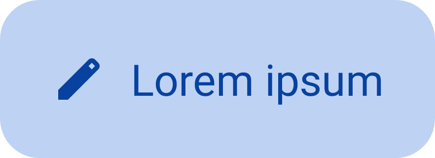
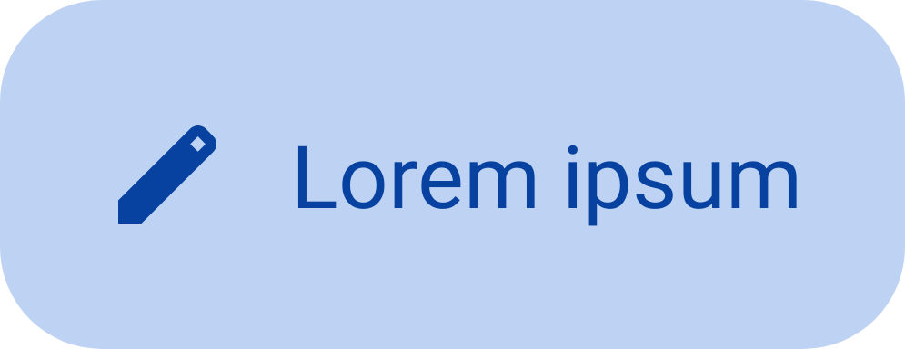

<!--docs:
title: "Extended floating action buttons"
layout: detail
section: components
excerpt:  "A floating action button (FAB) represents the primary action of a screen."
iconId: button
path: /catalog/floating-action-button/
-->

# Extended floating action buttons (Extended FABs)

[Extended floating action buttons (extended FABs)](https://m3.material.io/components/extended-fab)
help people take primary actions. There are three variants of the extended FAB.


1.  Small extended FAB
2.  Medium extended FAB
3.  Large extended FAB

**Note:** Images use various dynamic color schemes.

## Design & API documentation

*   [Material 3 (M3) spec](https://m3.material.io/components/extended-fab/overview)
*   [API reference](https://developer.android.com/reference/com/google/android/material/floatingactionbutton/package-summary)

## Anatomy


1.  Container
2.  Text label
3.  Icon (Optional)

More details on anatomy items in the
[component guidelines](https://m3.material.io/components/extended-fab/guidelines#1dc1f503-edff-4e3f-b2a6-c76cee1b8369).

## M3 Expressive

### M3 Expressive update

Before you can use `Material3Expressive` component styles, follow the
[`Material3Expressive` themes setup instructions](https://github.com/material-components/material-components-android/tree/master/docs/getting-started.md#material3expressive-themes).

 The original
extended FAB is replaced with a set of small, medium, and large extended FABs
with new typography

The extended FAB now has three sizes: small, medium, and large, each with
updated type styles. These align with the FAB sizes for an easier transition
between FABs. The original extended FAB is being deprecated and should be
replaced with the small extended FAB. Surface FABs are also being deprecated.
[More on M3 Expressive](https://m3.material.io/blog/building-with-m3-expressive)

**Types and naming:**

*   Added new sizes
    *   Small: 56dp
    *   Medium: 80dp
    *   Large: 96dp
*   Deprecated

    *   Original extended FAB (56dp)
    *   Surface extended FAB

*   Updates:

    *   Adjusted typography to be larger

### M3 Expressive styles

#### M3 Expressive small extended FAB

 <div style="width:400px"></div> |  <div style="width:400px"></div>
------------------------------------------------------------------------------------------------------------------------------------------- | -----------------------------------------------------------------------------------------------------------------------------------------

```xml
<com.google.android.material.floatingactionbutton.ExtendedFloatingActionButton
      style="?attr/extendedFloatingActionButtonSmallStyle"
      android:layout_width="wrap_content"
      android:layout_height="wrap_content"
      android:layout_margin="8dp"
      android:contentDescription="@string/m3_expressive_primary_small_extended_fab_content_description"
      android:text="@string/m3_expressive_extended_fab_label"
      app:icon="@drawable/gs_edit_fill1_vd_theme_24"
      app:materialThemeOverlay="@style/ThemeOverlay.Material3Expressive.FloatingActionButton.Primary" />
```

#### M3 Expressive medium extended FAB

 <div style="width:400px"></div> |  <div style="width:400px"></div>
--------------------------------------------------------------------------------------------------------------------------------------------- | -------------------------------------------------------------------------------------------------------------------------------------------

```xml
<com.google.android.material.floatingactionbutton.ExtendedFloatingActionButton
      style="?attr/extendedFloatingActionButtonMediumStyle"
      android:layout_width="wrap_content"
      android:layout_height="wrap_content"
      android:layout_margin="8dp"
      android:contentDescription="@string/m3_expressive_primary_medium_extended_fab_content_description"
      android:text="@string/m3_expressive_extended_fab_label"
      app:icon="@drawable/gs_edit_fill1_vd_theme_24"
      app:materialThemeOverlay="@style/ThemeOverlay.Material3Expressive.FloatingActionButton.Primary" />
```

#### M3 Expressive large extended FAB

 <div style="width:400px"></div> |  <div style="width:400px"></div>
------------------------------------------------------------------------------------------------------------------------------------------- | -----------------------------------------------------------------------------------------------------------------------------------------

```xml
<com.google.android.material.floatingactionbutton.ExtendedFloatingActionButton
      style="?attr/extendedFloatingActionButtonLargeStyle"
      android:layout_width="wrap_content"
      android:layout_height="wrap_content"
      android:layout_margin="8dp"
      android:contentDescription="@string/m3_expressive_primary_large_extended_fab_content_description"
      android:text="@string/m3_expressive_extended_fab_label"
      app:icon="@drawable/gs_edit_fill1_vd_theme_24"
      app:materialThemeOverlay="@style/ThemeOverlay.Material3Expressive.FloatingActionButton.Primary" />
```

## Key properties

### Container attributes

Element                       | Attribute                                                                                  | Related method(s)                                                  | Default value
----------------------------- | ------------------------------------------------------------------------------------------ | ------------------------------------------------------------------ | -------------
**Color**                     | `app:backgroundTint`                                                                       | `setBackgroundTintList`<br/>`getBackgroundTintList`                | `?attr/colorPrimaryContainer` (see all [states](https://github.com/material-components/material-components-android/tree/master/lib/java/com/google/android/material/color/res/color/m3_button_background_color_selector.xml))
**Stroke color**              | `app:strokeColor`                                                                          | `setStrokeColor`<br/>`getStrokeColor`                              | `null`
**Stroke width**              | `app:strokeWidth`                                                                          | `setStrokeWidth`<br/>`getStrokeWidth`                              | `0dp`
**Size**                      | `app:collapsedSize`                                                                        | `setCollapsedSize`<br/>`getCollapsedSize`                         |
**Extend Strategy**           | `app:extendStrategy`                                                                       | N/A                                                                | `wrap_content`
**Shape**                     | `app:shapeAppearance`<br/>`app:shapeAppearanceOverlay`                                     | `setShapeAppearanceModel`<br/>`getShapeAppearanceModel`            | `ShapeAppearanceOverlay.Material3.FloatingActionButton`<br/>
**Elevation**                 | `app:elevation`                                                                            | `setElevation`<br/>`getElevation`                                  | `6dp`
**Hovered/Focused elevation** | `app:hoveredFocusedTranslationZ`                                                           | N/A                                                                | `2dp`
**Pressed elevation**         | `app:pressedTranslationZ`                                                                  | N/A                                                                | `6dp`
**Ripple**                    | `app:rippleColor`                                                                          |                                                                    | variations of `?attr/colorOnPrimaryContainer`, see all [states](https://github.com/material-components/material-components-android/tree/master/lib/java/com/google/android/material/color/res/color/m3_button_ripple_color_selector.xml)
**Motion**                    | `app:showMotionSpec`<br>`app:hideMotionSpec`<br/>`extendMotionSpec`<br/>`shrinkMotionSpec` | `set*MotionSpec`<br/>`set*MotionSpecResource`<br/>`get*MotionSpec` | see [animators](https://github.com/material-components/material-components-android/tree/master/lib/java/com/google/android/material/floatingactionbutton/res/animator)

### Icon attributes

Element                           | Attribute         | Related method(s)                                         | Default value
--------------------------------- | ----------------- | --------------------------------------------------------- | -------------
**Icon**                          | `app:icon`        | `setIcon`<br/>`setIconResource`<br/>`getIcon`             | `null`
**Color**                         | `app:iconTint`    | `setIconTint`<br/>`setIconTintResource`<br/>`getIconTint` | `?attr/colorOnPrimaryContainer` (see all [states](https://github.com/material-components/material-components-android/tree/master/lib/java/com/google/android/material/color/res/color/m3_button_foreground_color_selector.xml))
**Size**                          | `app:iconSize`    | `setIconSize`<br/>`getIconSize`                           | `24dp`
**Padding between icon and text** | `app:iconPadding` | `setIconPadding`<br/>`getIconPadding`                     | `12dp`

### Text label

Element        | Attribute                | Related method(s)                 | Default value
-------------- | ------------------------ | --------------------------------- | -------------
**Text label** | `android:text`           | `setText`<br/>`getText`           | `null`
**Color**      | `android:textColor`      | `setTextColor`<br/>`getTextColor` | `?attr/colorPrimaryContainer` (see all [states](https://github.com/material-components/material-components-android/tree/master/lib/java/com/google/android/material/color/res/color/m3_button_foreground_color_selector.xml))
**Typography** | `android:textAppearance` | `setTextAppearance`               | `?attr/textAppearanceLabelLarge`

### Styles

Element                                   | Style                                                        | Theme attribute
----------------------------------------- | ------------------------------------------------------------ | ---------------
**Default style**                         | `Widget.Material3.ExtendedFloatingActionButton.Icon.Primary` | `?attr/extendedFloatingActionButtonStyle`
**Text-only when**<br/>**extended style** | `Widget.Material3.ExtendedFloatingActionButton.Primary`      | `?attr/extendedFloatingActionButtonPrimaryStyle`

See the full list of
[styles](https://github.com/material-components/material-components-android/tree/master/lib/java/com/google/android/material/floatingactionbutton/res/values/styles.xml)
and
[attrs](https://github.com/material-components/material-components-android/tree/master/lib/java/com/google/android/material/floatingactionbutton/res/values/attrs.xml).

## Variants of extended FAB

There are three types of extended FABs: small, medium, and large.


Choose an appropriately-sized extended FAB to add the right amount of emphasis
for an action.

In compact windows with one prominent action, the **large extended FAB** can be
appropriate.

In larger window sizes, use a **medium** or **large extended FAB**.

## Code implementation

Before you can use Material extended FABs, you need to add a dependency to the
Material Components for Android library. For more information, go to the
[Getting started](https://github.com/material-components/material-components-android/tree/master/docs/getting-started.md)
page.

**Note:** If the `FloatingActionButton` is a child of a `CoordinatorLayout`, you
get certain behaviors for free. It will automatically shift so that any
displayed `Snackbar`s do not cover it, and will automatically hide when covered
by an `AppBarLayout` or `BottomSheetBehavior`.

### Adding extended FAB

The extended FAB is wider, and it includes a text label.

**Note:** `ExtendedFloatingActionButton` is a child class of
[`MaterialButton`](Button.md), rather than `FloatingActionButton`. This means
that several attributes which are applicable to `FloatingActionButton` have
different naming in `ExtendedFloatingActionButton`. For example,
`FloatingActionButton` uses `app:srcCompat` to set the icon drawable, whereas
`ExtendedFloatingActionButton` uses `app:icon`. See the
[attributes tables](#key-properties) for more details.

API and source code:

*   `ExtendedFloatingActionButton`
    *   [Class description](https://developer.android.com/reference/com/google/android/material/floatingactionbutton/ExtendedFloatingActionButton)
    *   [Class source](https://github.com/material-components/material-components-android/tree/master/lib/java/com/google/android/material/floatingactionbutton/ExtendedFloatingActionButton.java)

The following example shows an extended FAB with a plus icon.


In the layout:

```xml
<androidx.coordinatorlayout.widget.CoordinatorLayout
    ...
    >

  <!-- Main content -->

  <com.google.android.material.floatingactionbutton.ExtendedFloatingActionButton
    android:id="@+id/extended_fab"
    android:layout_width="wrap_content"
    android:layout_height="wrap_content"
    android:layout_margin="16dp"
    android:layout_gravity="bottom|end"
    android:contentDescription="@string/extended_fab_content_desc"
    android:text="@string/extended_fab_label"
    app:icon="@drawable/ic_plus_24px"/>

</androidx.coordinatorlayout.widget.CoordinatorLayout>
```

In code:

```kt
extendedFab.setOnClickListener {
    // Respond to Extended FAB click
}
```

### Making extended FABs accessible

You should set a content description on a FAB via the
`android:contentDescription` attribute or `setContentDescription` method so that
screen readers like TalkBack are able to announce their purpose or action. Text
rendered in Extended FABs is automatically provided to accessibility services,
so additional content labels are usually unnecessary.

### Animating visibility of extended FAB

Use the `show` and `hide` methods to animate the visibility of an
`ExtendedFloatingActionButton`. The show animation grows the widget and fades it
in, while the hide animation shrinks the widget and fades it out.

```kt
// To show:
fab.show()
// To hide:
fab.hide()
```

### Extending and shrinking extended FAB

Use the `extend` and `shrink` methods to animate showing and hiding the text of
an `ExtendedFloatingActionButton`. The extend animation extends the FAB to show
the text and the icon. The shrink animation shrinks the FAB to show just the
icon.

```kt
// To extend:
extendedFab.extend()
// To shrink:
extendedFab.shrink()
```

## Customizing extended FABs

### Theming extended FABs

#### Extended FAB theming example

API and source code:

*   `ExtendedFloatingActionButton`
    *   [Class description](https://developer.android.com/reference/com/google/android/material/floatingactionbutton/ExtendedFloatingActionButton)
    *   [Class source](https://github.com/material-components/material-components-android/tree/master/lib/java/com/google/android/material/floatingactionbutton/ExtendedFloatingActionButton.java)

The following example shows a regular, small, and extended FAB with Material
Theming.


##### Implementing FAB theming

Use theme attributes and styles in `res/values/styles.xml` to add themes to all
FABs. This affects other components:

```xml
<style name="Theme.App" parent="Theme.Material3.*">
    ...
    <item name="colorPrimaryContainer">@color/purple_500</item>
    <item name="colorOnPrimaryContainer">@color/purple_700</item>
</style>
```

Use a default style theme attribute, styles and a theme overlay. This themes all
FABs in your app but does not affect other components:

```xml
<style name="Theme.App" parent="Theme.Material3.*">
    ...
    <item name="extendedFloatingActionButtonStyle">@style/Widget.App.ExtendedFloatingActionButton</item>
    <item name="floatingActionButtonStyle">@style/Widget.App.FloatingActionButton</item>
</style>

<style name="Widget.App.ExtendedFloatingActionButton" parent="Widget.Material3.ExtendedFloatingActionButton.Icon.Primary">
    <item name="materialThemeOverlay">@style/ThemeOverlay.App.FloatingActionButton</item>
</style>

<style name="Widget.App.FloatingActionButton" parent="Widget.Material3.FloatingActionButton.Primary">
    <item name="materialThemeOverlay">@style/ThemeOverlay.App.FloatingActionButton</item>
</style>

<style name="ThemeOverlay.App.FloatingActionButton" parent="">
    <item name="colorContainer">@color/purple_500</item>
    <item name="colorOnContainer">@color/purple_700</item>
</style>
```

Use one of the styles in the layout. That affects only this FAB:

```xml
<com.google.android.material.floatingactionbutton.FloatingActionButton
    ...
    style="@style/Widget.App.FloatingActionButton"
/>
```

### Sizing extended FABs

The `ExtendedFloatingActionButton` will be sized dynamically based on its
contents (icon and label) and paddings. If a bigger fixed size is preferred, you
may use `android:minWidth` and `android:minHeight` attributes.

In Material 3 themes, styles in 3 different sizes are provided:

*   Small - `?attr/extendedFloatingActionButtonSmallStyle` (or
    `?attr/extendedFloatingActionButton`,
    `?attr/extendedFloatingActionButtonPrimaryStyle`,
    `?attr/extendedFloatingActionButtonSecondaryStyle`,
    `?attr/extendedFloatingActionButtonTertiaryStyle`,
    `?attr/extendedFloatingActionButtonSurfaceStyle`)
*   Medium - `?attr/extendedFloatingActionButtonMediumStyle`
*   Large - `?attr/extendedFloatingActionButtonLargeStyle`

**Note:** If you are using the extending/collapsing feature with custom height,
please also consider to set the `collapsedSize` attribute to the same height.
