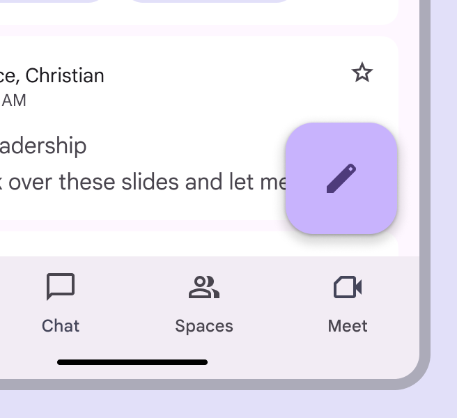

<!--docs:
title: "Floating action buttons"
layout: detail
section: components
excerpt:  "A floating action button (FAB) represents the primary action of a screen."
iconId: button
path: /catalog/floating-action-button/
-->

# Floating action buttons (FABs)

A
[floating action button (FAB)](https://m3.material.io/components/floating-action-button)
represents the primary action of a screen. There are three variants of a FAB.


1.  FAB
2.  Medium FAB
3.  Large FAB

**Note:** Images use various dynamic color schemes.

A FAB performs the primary or the most common action on a screen. It appears in
front of all screen content, typically as a boxy shape with an icon in its
center.

## Design & API documentation

*   [Material 3 (M3) spec](https://m3.material.io/components/floating-action-button/overview)
*   [API reference](https://developer.android.com/reference/com/google/android/material/floatingactionbutton/package-summary)

## Anatomy


1.  Container
2.  Icon

More details on anatomy items in the
[component guidelines](https://m3.material.io/components/floating-action-button/guidelines#9a56f806-8840-4910-8f53-3cb2a6c81c86).

## M3 Expressive

### M3 Expressive update

Before you can use `Material3Expressive` component styles, follow the
[`Material3Expressive` themes setup instructions](https://github.com/material-components/material-components-android/tree/master/docs/getting-started.md#material3expressive-themes).


FABs have updated colors and sizes

The FAB has new sizes to match the extended FAB and more color options. The
small FAB is deprecated.
[More on M3 Expressive](https://m3.material.io/blog/building-with-m3-expressive)

**Types and naming:**

*   Added **medium** FAB size
*   Deprecated **small** FAB size
*   FAB and large FAB sizes are unchanged
*   FAB types are based on size, not color

**Color:**

*   Added tone color styles:
    *   Primary
    *   Secondary
    *   Tertiary
*   Renamed existing tonal color styles to match their token names:
    *   **Primary** to **Primary container**
    *   **Secondary** to **Secondary container**
    *   **Tertiary** to **Tertiary container**
    *   The values haven't changed
*   Deprecated surface color FABs

### M3 Expressive styles

#### Theme overlays

To avoid a scenario of exploding style combinations, the colors will be handled
via theme overlays instead of creating distinct styles for each size/palette
combination for FABs and extended FABs.

M3 Expressive library provides six theme overlays to be used:

-   `ThemeOverlay.Material3Expressive.FloatingActionButton.Primary`
-   `ThemeOverlay.Material3Expressive.FloatingActionButton.Secondary`
-   `ThemeOverlay.Material3Expressive.FloatingActionButton.Tertiary`
-   `ThemeOverlay.Material3Expressive.FloatingActionButton.PrimaryContainer`
-   `ThemeOverlay.Material3Expressive.FloatingActionButton.SecondaryContainer`
-   `ThemeOverlay.Material3Expressive.FloatingActionButton.TertiaryContainer`

The theme overlay for a given FAB or extended FAB can be specified within the
component XML by adding, for example,
`app:materialThemeOverlay="@style/ThemeOverlay.Material3Expressive.FloatingActionButton.Primary`.

**Note:** The images below show FAB examples in light mode (left) and in dark
mode (right) using the primary theme overlay.

#### M3 Expressive FAB

 <div style="width:400px"></div> |  <div style="width:400px"></div>
------------------------------------------------------------------------------------------------------------------------------- | -----------------------------------------------------------------------------------------------------------------------------

```xml
<com.google.android.material.floatingactionbutton.FloatingActionButton
      style="?attr/floatingActionButtonStyle"
      android:layout_width="wrap_content"
      android:layout_height="wrap_content"
      android:layout_margin="8dp"
      android:contentDescription="@string/m3_expressive_primary_fab_content_description"
      app:srcCompat="@drawable/gs_edit_fill1_vd_theme_24"
      app:materialThemeOverlay="@style/ThemeOverlay.Material3Expressive.FloatingActionButton.Primary" />
```

#### M3 Expressive medium FAB

 <div style="width:400px"></div> |  <div style="width:400px"></div>
---------------------------------------------------------------------------------------------------------------------------------------------- | -------------------------------------------------------------------------------------------------------------------------------------------

```xml
<com.google.android.material.floatingactionbutton.FloatingActionButton
            style="?attr/floatingActionButtonMediumStyle"
            android:layout_width="wrap_content"
            android:layout_height="wrap_content"
            android:layout_margin="8dp"
            android:contentDescription="@string/m3_expressive_primary_medium_fab_content_description"
            app:srcCompat="@drawable/gs_edit_fill1_vd_theme_24"
            app:materialThemeOverlay="@style/ThemeOverlay.Material3Expressive.FloatingActionButton.Primary" />
```

#### M3 Expressive large FAB

 <div style="width:400px"></div> |  <div style="width:400px"></div>
-------------------------------------------------------------------------------------------------------------------------------------------- | -----------------------------------------------------------------------------------------------------------------------------------------

```xml
<com.google.android.material.floatingactionbutton.FloatingActionButton
      style="?attr/floatingActionButtonLargeStyle"
      android:layout_width="wrap_content"
      android:layout_height="wrap_content"
      android:layout_margin="8dp"
      android:contentDescription="@string/m3_expressive_primary_large_fab_content_description"
      app:srcCompat="@drawable/gs_edit_fill1_vd_theme_24"
      app:materialThemeOverlay="@style/ThemeOverlay.Material3Expressive.FloatingActionButton.Primary" />
```

## Key properties

### Container attributes

Element                       | Attribute                                      | Related method(s)                                                                     | Default value
----------------------------- | ---------------------------------------------- | ------------------------------------------------------------------------------------- | -------------
**Color**                     | `app:backgroundTint`                           | `setBackgroundTintList`<br/>`getBackgroundTintList`                                   | `?attr/colorPrimaryContainer` (see all [states](https://github.com/material-components/material-components-android/tree/master/lib/java/com/google/android/material/color/res/color/m3_button_background_color_selector.xml))
**Stroke**                    | `app:borderWidth`                              | N/A                                                                                   | `0dp`
**Size**                      | `app:fabSize`<br>`app:fabCustomSize`           | `setSize`<br/>`setCustomSize`<br/>`clearCustomSize`<br/>`getSize`<br/>`getCustomSize` | `auto`
**Shape**                     | `shapeAppearance`<br/>`shapeAppearanceOverlay` | `setShapeAppearanceModel`<br/>`getShapeAppearanceModel`                               | `ShapeAppearanceOverlay.Material3.FloatingActionButton`<br/>
**Elevation**                 | `app:elevation`                                | `setElevation`<br/>`getCompatElevation`                                               | `6dp`
**Hovered/Focused elevation** | `app:hoveredFocusedTranslationZ`               | `setCompatHoveredFocusedTranslationZ`<br/>`getCompatHoveredFocusedTranslationZ`       | `2dp`
**Pressed elevation**         | `app:pressedTranslationZ`                      | `setCompatPressedTranslationZ`<br/>`getCompatPressedTranslationZ`                     | `6dp`
**Ripple**                    | `app:rippleColor`                              | `setRippleColor`<br/>`getRippleColor`<br/>`getRippleColorStateList`                   | variations of `?attr/colorOnPrimaryContainer`, see all [states](https://github.com/material-components/material-components-android/tree/master/lib/java/com/google/android/material/color/res/color/m3_button_ripple_color_selector.xml)
**Motion**                    | `app:showMotionSpec`<br>`app:hideMotionSpec`   | `set*MotionSpec`<br/>`set*MotionSpecResource`<br/>`get*MotionSpec`                    | `@null`

### Icon attributes

Element   | Attribute       | Related method(s)                                           | Default value
--------- | --------------- | ----------------------------------------------------------- | -------------
**Icon**  | `app:srcCompat` | `setImageDrawable`<br/>`setImageResource`<br/>`getDrawable` | `null`
**Color** | `app:tint`      | `setImageTintList`<br/>`getImageTintList`                   | `?attr/colorOnPrimaryContainer` (see all [states](https://github.com/material-components/material-components-android/tree/master/lib/java/com/google/android/material/color/res/color/m3_button_foreground_color_selector.xml))

### Styles

Element           | Style                                           | Theme attribute
----------------- | ----------------------------------------------- | ---------------
**Default style** | `Widget.Material3.FloatingActionButton.Primary` | `?attr/floatingActionButtonStyle`

See the full list of
[styles](https://github.com/material-components/material-components-android/tree/master/lib/java/com/google/android/material/floatingactionbutton/res/values/styles.xml)
and
[attrs](https://github.com/material-components/material-components-android/tree/master/lib/java/com/google/android/material/floatingactionbutton/res/values/attrs.xml).

## Variants of FAB

There are three FAB sizes:

1.  FAB
2.  Medium FAB (most recommended)
3.  Large FAB

Choose the FAB size based on the visual hierarchy of your layout.

FABs have multiple sizes that scale with
window size

<details>

<summary><h3>FAB</h3></summary>

FABs are the default size and style for a primary action button. The FAB is the
smallest size, and is best used in compact windows where other actions may be
present on screen.

API and source code:

*   `FloatingActionButton`
    *   [Class description](https://developer.android.com/reference/com/google/android/material/floatingactionbutton/FloatingActionButton)
    *   [Class source](https://github.com/material-components/material-components-android/tree/master/lib/java/com/google/android/material/floatingactionbutton/FloatingActionButton.java)

#### FAB example

The following example shows a regular FAB with a plus icon.


In the layout:

```xml
<androidx.coordinatorlayout.widget.CoordinatorLayout
    ...
    android:layout_width="match_parent"
    android:layout_height="match_parent">

  <!-- Main content -->

  <com.google.android.material.floatingactionbutton.FloatingActionButton
      android:id="@+id/floating_action_button"
      android:layout_width="wrap_content"
      android:layout_height="wrap_content"
      android:layout_gravity="bottom|end"
      android:layout_margin="16dp"
      android:contentDescription="@string/fab_content_desc"
      app:srcCompat="@drawable/ic_plus_24"/>

</androidx.coordinatorlayout.widget.CoordinatorLayout>
```

In code:

```kt
fab.setOnClickListener {
    // Respond to FAB click
}
```

</details>

<details>

<summary><h3>Medium FAB</h3></summary>

A medium FAB is recommended for most situations, and works best in compact and
medium windows. Use it for important actions without taking up too much space.

API and source code:

*   `FloatingActionButton`
    *   [Class description](https://developer.android.com/reference/com/google/android/material/floatingactionbutton/FloatingActionButton)
    *   [Class source](https://github.com/material-components/material-components-android/tree/master/lib/java/com/google/android/material/floatingactionbutton/FloatingActionButton.java)

#### Medium FAB example

The following example shows a medium FAB with a plus icon.



In the layout:

```xml
<androidx.coordinatorlayout.widget.CoordinatorLayout
    ...
    >

  <!-- Main content -->

  <com.google.android.material.floatingactionbutton.FloatingActionButton
      ...
      style="?attr/floatingActionButtonMediumStyle"/>

</androidx.coordinatorlayout.widget.CoordinatorLayout>
```

In code:

```kt
fab.setOnClickListener {
    // Respond to FAB click
}
```

</details>

<details>

<summary><h3>Large FAB</h3></summary>

A large FAB is useful in any window size when the layout calls for a clear and
prominent primary action, but is best suited for expanded and larger window
sizes, where its size helps draw attention.

API and source code:

*   `FloatingActionButton`
    *   [Class description](https://developer.android.com/reference/com/google/android/material/floatingactionbutton/FloatingActionButton)
    *   [Class source](https://github.com/material-components/material-components-android/tree/master/lib/java/com/google/android/material/floatingactionbutton/FloatingActionButton.java)

#### Large FAB example

The following example shows a large FAB with a plus icon.


In the layout:

```xml
<androidx.coordinatorlayout.widget.CoordinatorLayout
    ...
    >

  <!-- Main content -->

  <com.google.android.material.floatingactionbutton.FloatingActionButton
      ...
      style="?attr/floatingActionButtonLargeStyle"/>

</androidx.coordinatorlayout.widget.CoordinatorLayout>
```

In code:

```kt
fab.setOnClickListener {
    // Respond to FAB click
}
```

</details>

<details>

<summary><h3>Small FAB (deprecated)</h3></summary>

A small FAB should be used on smaller screens.

Small FABs can also be used to create visual continuity with other screen
elements.

API and source code:

*   `FloatingActionButton`
    *   [Class description](https://developer.android.com/reference/com/google/android/material/floatingactionbutton/FloatingActionButton)
    *   [Class source](https://github.com/material-components/material-components-android/tree/master/lib/java/com/google/android/material/floatingactionbutton/FloatingActionButton.java)

#### Small FAB example

The following example shows a small FAB with a plus icon.


In the layout:

```xml
<androidx.coordinatorlayout.widget.CoordinatorLayout
    ...
    >

  <!-- Main content -->

  <com.google.android.material.floatingactionbutton.FloatingActionButton
      ...
      style="?attr/floatingActionButtonSmallStyle"/>

</androidx.coordinatorlayout.widget.CoordinatorLayout>
```

In code:

```kt
fab.setOnClickListener {
    // Respond to FAB click
}
```

</details>

## Code implementation

Before you can use Material FABs, you need to add a dependency to the Material
Components for Android library. For more information, go to the
[Getting started](https://github.com/material-components/material-components-android/tree/master/docs/getting-started.md)
page.

**Note:** If the `FloatingActionButton` is a child of a `CoordinatorLayout`, you
get certain behaviors for free. It will automatically shift so that any
displayed `Snackbar`s do not cover it, and will automatically hide when covered
by an `AppBarLayout` or `BottomSheetBehavior`.

### Making FABs accessible

You should set a content description on a FAB via the
`android:contentDescription` attribute or `setContentDescription` method so that
screen readers like TalkBack are able to announce their purpose or action. Text
rendered in Extended FABs is automatically provided to accessibility services,
so additional content labels are usually unnecessary.

### Animating visibility of FAB

Use the `show` and `hide` methods to animate the visibility of a
`FloatingActionButton`. The show animation grows the widget and fades it in,
while the hide animation shrinks the widget and fades it out.

```kt
// To show:
fab.show()
// To hide:
fab.hide()
```

## Customizing FABs

### Theming FABs

#### FAB theming example

API and source code:

*   `FloatingActionButton`
    *   [Class description](https://developer.android.com/reference/com/google/android/material/floatingactionbutton/FloatingActionButton)
    *   [Class source](https://github.com/material-components/material-components-android/tree/master/lib/java/com/google/android/material/floatingactionbutton/FloatingActionButton.java)

The following example shows multiple FABs with Material Theming in different
sizes that scale with window size.


##### Implementing FAB theming

Use theme attributes and styles in `res/values/styles.xml` to add themes to all
FABs. This affects other components:

```xml
<style name="Theme.App" parent="Theme.Material3.*">
    ...
    <item name="colorPrimaryContainer">@color/purple_500</item>
    <item name="colorOnPrimaryContainer">@color/purple_700</item>
</style>
```

Use a default style theme attribute, styles and a theme overlay. This themes all
FABs in your app but does not affect other components:

```xml
<style name="Theme.App" parent="Theme.Material3.*">
    ...
    <item name="extendedFloatingActionButtonStyle">@style/Widget.App.ExtendedFloatingActionButton</item>
    <item name="floatingActionButtonStyle">@style/Widget.App.FloatingActionButton</item>
</style>

<style name="Widget.App.ExtendedFloatingActionButton" parent="Widget.Material3.ExtendedFloatingActionButton.Icon.Primary">
    <item name="materialThemeOverlay">@style/ThemeOverlay.App.FloatingActionButton</item>
</style>

<style name="Widget.App.FloatingActionButton" parent="Widget.Material3.FloatingActionButton.Primary">
    <item name="materialThemeOverlay">@style/ThemeOverlay.App.FloatingActionButton</item>
</style>

<style name="ThemeOverlay.App.FloatingActionButton" parent="">
    <item name="colorContainer">@color/purple_500</item>
    <item name="colorOnContainer">@color/purple_700</item>
</style>
```

Use one of the styles in the layout. That affects only this FAB:

```xml
<com.google.android.material.floatingactionbutton.FloatingActionButton
    ...
    style="@style/Widget.App.FloatingActionButton"
/>
```

### Sizing FABs

The `FloatingActionButton` can be sized either by using `app:fabCustomSize` or
for the large/small FAB (M3 only) by applying the desired style. The
`app:fabSize` discrete size mode is deprecated in Material3 style. If the
`app:fabSize` is overridden in your FAB style, which inherits from one of these
styles:

*   `Widget.Material3.FloatingActionButton(.Large).Primary`
*   `Widget.Material3.FloatingActionButton(.Large).Secondary`
*   `Widget.Material3.FloatingActionButton(.Large).Tertiary`
*   `Widget.Material3.FloatingActionButton(.Large).Surface`

Please consider one of the following migration options:

*   If `normal` size is used, set the parent style to
    `Widget.Material3.FloatingActionButton.{Color}` and remove `app:fabSize`.
*   If `mini` size is used, set the parent style to
    `Widget.Material3.FloatingActionButton.Small.{Color}` and remove
    `app:fabSize`.
*   If FAB size changes in runtime by either setting `fabSize` or
    `fabCustomSize`, and relative sized corners are desired, set
    `shapeAppearanceOverlay` as
    `@style/ShapeAppearanceOverlay.Material3.FloatingActionButton` in the style.

If you'd like to use the small FAB, apply one of these style attributes:

*   `?attr/floatingActionButtonSmallStyle`
*   `?attr/floatingActionButtonSmallPrimaryStyle`
*   `?attr/floatingActionButtonSmallSecondaryStyle`
*   `?attr/floatingActionButtonSmallTertiaryStyle`
*   `?attr/floatingActionButtonSmallSurfaceStyle`

If you'd like to use the medium FAB, apply this style with the corresponding
color theme overlay via `materialThemeOverlay`:

*   `?attr/floatingActionButtonMediumStyle`

If you'd like to use the large FAB, apply one of these style attributes:

*   `?attr/floatingActionButtonLargeStyle`
*   `?attr/floatingActionButtonLargePrimaryStyle`
*   `?attr/floatingActionButtonLargeSecondaryStyle`
*   `?attr/floatingActionButtonLargeTertiaryStyle`
*   `?attr/floatingActionButtonLargeSurfaceStyle`
