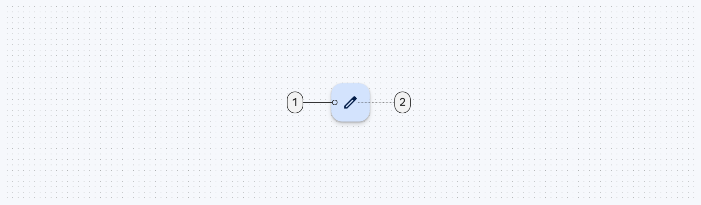
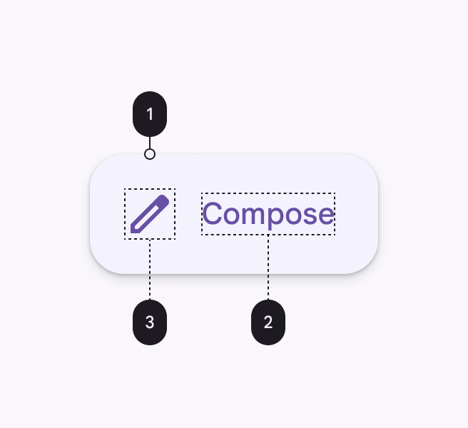

<!--docs:
title: "Floating action buttons"
layout: detail
section: components
excerpt:  "A floating action button (FAB) represents the primary action of a screen."
iconId: button
path: /catalog/floating-action-button/
-->

# Floating action buttons

A
[floating action button (FAB)](https://material.io/components/buttons-floating-action-button)
represents the primary action of a screen.


**Contents**

*   [Using FABs](#using-fabs)
*   [Regular FABs](#regular-fabs)
*   [Mini FABs](#mini-fabs)
*   [Extended FABs](#extended-fabs)
*   [Theming FABs](#theming-fabs)

## Using FABs

A FAB performs the primary, or most common, action on a screen. It appears in
front of all screen content, typically as a circular shape with an icon in its
center.

Before you can use Material FABs, you need to add a dependency to the Material
Components for Android library. For more information, go to the
[Getting started](https://github.com/material-components/material-components-android/tree/master/docs/getting-started.md)
page.

Note: If the `FloatingActionButton` is a child of a `CoordinatorLayout`, you get
certain behaviors for free. It will automatically shift so that any displayed
`Snackbar`s do not cover it, and will automatially hide when covered by an
`AppBarLayout` or `BottomSheetBehavior`.

### Making FABs accessible

You should set a content description on a FAB via the
`android:contentDescription` attribute or `setContentDescription` method so that
screen readers like TalkBack are able to announce their purpose or action. Text
rendered in Extended FABs is automatically provided to accessibility services,
so additional content labels are usually unnecessary.

### Visibility

Use the `show` and `hide` methods to animate the visibility of a
`FloatingActionButton` or an `ExtendedFloatingActionButton`. The show animation
grows the widget and fades it in, while the hide animation shrinks the widget
and fades it out.

```kt
// To show:
fab.show()
// To hide:
fab.hide()
```

### Extending and Shrinking

Use the `extend` and `shrink` methods to animate showing and hiding the text of
an `ExtendedFloatingActionButton`. The extend animation extends the FAB to show
the text and the icon. The shrink animation shrinks the FAB to show just the
icon.

```kt
// To extend:
extendedFab.extend()
// To shrink:
extendedFab.shrink()
```

### Sizing FABs

The `FloatingActionButton` can be sized either by using the discrete sizing
modes or a custom size.

There are three `app:fabSize` modes:

*   `normal` - the normal sized button, 56dp.
*   `mini` - the mini sized button, 40dp.
*   `auto` (default) - the button size will change based on the window size. For
    small sized windows (largest screen dimension < 470dp) this will select a
    mini sized button, and for larger sized windows it will select a normal
    sized button.

Or, you can set a custom size via the `app:fabCustomSize` attribute. If set,
`app:fabSize` will be ignored, unless the custom size is cleared via the
`clearCustomSize` method.

## Types

There are three types of FABS: 1\. [Regular FABs](#regular-fabs), 2\.
[Mini FABs](#mini-fabs), 3\. [Extended FABs](#extended-fabs)


## FABs

Floating action buttons come in a default and mini size.

API and source code:

*   `FloatingActionButton`
    *   [Class description](https://developer.android.com/reference/com/google/android/material/floatingactionbutton/FloatingActionButton)
    *   [Class source](https://github.com/material-components/material-components-android/tree/master/lib/java/com/google/android/material/floatingactionbutton/FloatingActionButton.java)

### Regular FABs

Regular FABs are FABs that are not expanded and are a regular size.

#### Regular FAB example

The following example shows a regular FAB with a plus icon.


In the layout:

```xml
<androidx.coordinatorlayout.widget.CoordinatorLayout
    ...
    android:layout_width="match_parent"
    android:layout_height="match_parent">

  <!-- Main content -->

  <com.google.android.material.floatingactionbutton.FloatingActionButton
      android:id="@+id/floating_action_button"
      android:layout_width="wrap_content"
      android:layout_height="wrap_content"
      android:layout_gravity="bottom|right"
      android:layout_margin="16dp"
      android:contentDescription="@string/fab_content_desc"
      app:srcCompat="@drawable/ic_plus_24"/>

</androidx.coordinatorlayout.widget.CoordinatorLayout>
```

In code:

```kt
fab.setOnClickListener {
    // Respond to FAB click
}
```

#### Anatomy



A regular FAB has a container and an icon.

1.  Container
1.  Icon

### Mini FABs

A mini FAB should be used on smaller screens.

Mini FABs can also be used to create visual continuity with other screen
elements.

### Mini FAB example

The following example shows a mini FAB with a plus icon.


In the layout:

```xml
<androidx.coordinatorlayout.widget.CoordinatorLayout
    ...
    >

  <!-- Main content -->

  <com.google.android.material.floatingactionbutton.FloatingActionButton
      ...
      app:fabSize="mini"/>

</androidx.coordinatorlayout.widget.CoordinatorLayout>
```

In code:

```kt
fab.setOnClickListener {
    // Respond to FAB click
}
```

#### Anatomy


A mini FAB has a container and an icon.

1.  Container
1.  Icon

### Regular and mini FAB key properties

#### Container attributes

&nbsp;                        | Attribute                                      | Related method(s)                                                                     | Default value
----------------------------- | ---------------------------------------------- | ------------------------------------------------------------------------------------- | -------------
**Color**                     | `app:backgroundTint`                           | `setBackgroundTintList`<br/>`getBackgroundTintList`                                   | `?attr/colorSecondary` (see all [states](https://github.com/material-components/material-components-android/tree/master/lib/java/com/google/android/material/floatingactionbutton/res/color/mtrl_fab_bg_color_selector.xml))
**Stroke**                    | `app:borderWidth`                              | N/A                                                                                   | `0.5dp`
**Size**                      | `app:fabSize`<br>`app:fabCustomSize`           | `setSize`<br/>`setCustomSize`<br/>`clearCustomSize`<br/>`getSize`<br/>`getCustomSize` | `auto`
**Shape**                     | `shapeAppearance`<br/>`shapeAppearanceOverlay` | `setShapeAppearanceModel`<br/>`getShapeAppearanceModel`                               | `?attr/shapeAppearanceSmallComponent`<br/>
**Elevation**                 | `app:elevation`                                | `setElevation`<br/>`getCompatElevation`                                               | `6dp`
**Hovered/Focused elevation** | `app:hoveredFocusedTranslationZ`               | `setCompatHoveredFocusedTranslationZ`<br/>`getCompatHoveredFocusedTranslationZ`       | `2dp`
**Pressed elevation**         | `app:pressedTranslationZ`                      | `setCompatPressedTranslationZ`<br/>`getCompatPressedTranslationZ`                     | `6dp`
**Ripple**                    | `app:rippleColor`                              | `setRippleColor`<br/>`getRippleColor`<br/>`getRippleColorStateList`                   | variations of `?attr/colorOnSecondary`, see all [states](https://github.com/material-components/material-components-android/tree/master/lib/java/com/google/android/material/floatingactionbutton/res/color/mtrl_fab_ripple_color.xml)
**Motion**                    | `app:showMotionSpec`<br>`app:hideMotionSpec`   | `set*MotionSpec`<br/>`set*MotionSpecResource`<br/>`get*MotionSpec`                    | see [animators](https://github.com/material-components/material-components-android/tree/master/lib/java/com/google/android/material/floatingactionbutton/res/animator)

#### Icon attributes

&nbsp;    | Attribute       | Related method(s)                                           | Default value
--------- | --------------- | ----------------------------------------------------------- | -------------
**Icon**  | `app:srcCompat` | `setImageDrawable`<br/>`setImageResource`<br/>`getDrawable` | `null`
**Color** | `app:tint`      | `setImageTintList`<br/>`getImageTintList`                   | `?attr/colorOnSecondary` (see all [states](https://github.com/material-components/material-components-android/tree/master/lib/java/com/google/android/material/floatingactionbutton/res/color/mtrl_fab_icon_text_color_selector.xml))

#### Styles

&nbsp;            | Style
----------------- | ------------------------------------------------
**Default style** | `Widget.MaterialComponents.FloatingActionButton`

Default style theme attribute: `?attr/floatingActionButtonStyle`

See the full list of
[styles](https://github.com/material-components/material-components-android/tree/master/lib/java/com/google/android/material/floatingactionbutton/res/values/styles.xml)
and
[attrs](https://github.com/material-components/material-components-android/tree/master/lib/java/com/google/android/material/floatingactionbutton/res/values/attrs.xml).

## Extended FABs

The extended FAB is wider, and it includes a text label.

Note: `ExtendedFloatingActionButton` is a child class of
[`MaterialButton`](Button.md), rather than `FloatingActionButton`. This means
that several attributes which are applicable to `FloatingActionButton` have
different naming in `ExtendedFloatingActionButton`. For example,
`FloatingActionButton` uses `app:srcCompat` to set the icon drawable, whereas
`ExtendedFloatingActionButton` uses `app:icon`. See the
[attributes tables](#anatomy-and-key-properties) below for more details.

API and source code:

*   `ExtendedFloatingActionButton`
    *   [Class description](https://developer.android.com/reference/com/google/android/material/floatingactionbutton/ExtendedFloatingActionButton)
    *   [Class source](https://github.com/material-components/material-components-android/tree/master/lib/java/com/google/android/material/floatingactionbutton/ExtendedFloatingActionButton.java)

### Extended FAB example

The following example shows an extended FAB with a plus icon.


In the layout:

```xml
<androidx.coordinatorlayout.widget.CoordinatorLayout
    ...
    >

  <!-- Main content -->

  <com.google.android.material.floatingactionbutton.ExtendedFloatingActionButton
    android:id="@+id/extended_fab"
    android:layout_width="wrap_content"
    android:layout_height="wrap_content"
    android:layout_margin="16dp"
    android:layout_gravity="bottom|right"
    android:contentDescription="@string/extended_fab_content_desc"
    android:text="@string/extended_fab_label"
    app:icon="@drawable/ic_plus_24px"/>

</androidx.coordinatorlayout.widget.CoordinatorLayout>
```

In code:

```kt
extendedFab.setOnClickListener {
    // Respond to Extended FAB click
}
```

### Anatomy and key properties



An extended FAB has a text label, a transparent container and an optional icon.

1.  Container
1.  Icon (Optional)
1.  Text label

#### Container attributes

&nbsp;                        | Attribute                                                                                  | Related method(s)                                                  | Default value
----------------------------- | ------------------------------------------------------------------------------------------ | ------------------------------------------------------------------ | -------------
**Color**                     | `app:backgroundTint`                                                                       | `setBackgroundTintList`<br/>`getBackgroundTintList`                | `?attr/colorSecondary` (see all [states](https://github.com/material-components/material-components-android/tree/master/lib/java/com/google/android/material/floatingactionbutton/res/color/mtrl_fab_bg_color_selector.xml))
**Stroke color**              | `app:strokeColor`                                                                          | `setStrokeColor`<br/>`getStrokeColor`                              | `null`
**Stroke width**              | `app:strokeWidth`                                                                          | `setStrokeWidth`<br/>`getStrokeWidth`                              | `0dp`
**Size**                      | `app:collapsedSize`                                                                        | N/A                                                                |
**Shape**                     | `app:shapeAppearance`<br/>`app:shapeAppearanceOverlay`                                     | `setShapeAppearanceModel`<br/>`getShapeAppearanceModel`            | `?attr/shapeAppearanceSmallComponent`
**Elevation**                 | `app:elevation`                                                                            | `setElevation`<br/>`getElevation`                                  | `6dp`
**Hovered/Focused elevation** | `app:hoveredFocusedTranslationZ`                                                           | N/A                                                                | `2dp`
**Pressed elevation**         | `app:pressedTranslationZ`                                                                  | N/A                                                                | `6dp`
**Ripple**                    | `app:rippleColor`                                                                          |                                                                    | variations of `?attr/colorOnSecondary`, see all [states](https://github.com/material-components/material-components-android/tree/master/lib/java/com/google/android/material/floatingactionbutton/res/color/mtrl_fab_ripple_color.xml)
**Motion**                    | `app:showMotionSpec`<br>`app:hideMotionSpec`<br/>`extendMotionSpec`<br/>`shrinkMotionSpec` | `set*MotionSpec`<br/>`set*MotionSpecResource`<br/>`get*MotionSpec` | see [animators](https://github.com/material-components/material-components-android/tree/master/lib/java/com/google/android/material/floatingactionbutton/res/animator)

#### Icon attributes

&nbsp;                            | Attribute         | Related method(s)                                         | Default value
--------------------------------- | ----------------- | --------------------------------------------------------- | -------------
**Icon**                          | `app:icon`        | `setIcon`<br/>`setIconResource`<br/>`getIcon`             | `?attr/colorOnSecondary`
**Color**                         | `app:iconTint`    | `setIconTint`<br/>`setIconTintResource`<br/>`getIconTint` | `?attr/colorOnSecondary` (see all [states](https://github.com/material-components/material-components-android/tree/master/lib/java/com/google/android/material/floatingactionbutton/res/color/mtrl_fab_icon_text_color_selector.xml))
**Size**                          | `app:iconSize`    | `setIconSize`<br/>`getIconSize`                           | `24dp`
**Padding between icon and text** | `app:iconPadding` | `setIconPadding`<br/>`getIconPadding`                     | `16dp`

#### Text label

&nbsp;         | Attribute                | Related method(s)                 | Default value
-------------- | ------------------------ | --------------------------------- | -------------
**Text label** | `android:text`           | `setText`<br/>`getText`           | `null`
**Color**      | `android:textColor`      | `setTextColor`<br/>`getTextColor` | `?attr/colorOnSecondary` (see all [states](https://github.com/material-components/material-components-android/tree/master/lib/java/com/google/android/material/floatingactionbutton/res/color/mtrl_fab_icon_text_color_selector.xml))
**Typography** | `android:textAppearance` | `setTextAppearance`               | `?attr/textAppearanceButton`

#### Styles

&nbsp;                                    | Style
----------------------------------------- | -----
**Default style**                         | `Widget.MaterialComponents.ExtendedFloatingActionButton.Icon`
**Text-only when**<br/>**extended style** | `Widget.MaterialComponents.ExtendedFloatingActionButton`

Default style theme attribute: `?attr/extendedFloatingActionButtonStyle`

See the full list of
[styles](https://github.com/material-components/material-components-android/tree/master/lib/java/com/google/android/material/floatingactionbutton/res/values/styles.xml)
and
[attrs](https://github.com/material-components/material-components-android/tree/master/lib/java/com/google/android/material/floatingactionbutton/res/values/attrs.xml).

## Theming FABs

### FAB theming example

API and source code:

*   `FloatingActionButton`
    *   [Class description](https://developer.android.com/reference/com/google/android/material/floatingactionbutton/FloatingActionButton)
    *   [Class source](https://github.com/material-components/material-components-android/tree/master/lib/java/com/google/android/material/floatingactionbutton/FloatingActionButton.java)
*   `ExtendedFloatingActionButton`
    *   [Class description](https://developer.android.com/reference/com/google/android/material/floatingactionbutton/ExtendedFloatingActionButton)
    *   [Class source](https://github.com/material-components/material-components-android/tree/master/lib/java/com/google/android/material/floatingactionbutton/ExtendedFloatingActionButton.java)

The following example shows a regular, mini, and extended FABs with Material
Theming.


#### Implementing FAB theming

Using theme attributes and styles in `res/values/styles.xml` (themes all FABs
and affects other components):

```xml
<style name="Theme.App" parent="Theme.MaterialComponents.*">
    ...
    <item name="colorSecondary">@color/shrine_pink_100</item>
    <item name="colorOnSecondary">@color/shrine_pink_900</item>
    <item name="colorOnSurface">@color/shrine_pink_900</item>
    <item name="shapeAppearanceSmallComponent">@style/ShapeAppearance.App.SmallComponent</item>
</style>

<style name="ShapeAppearance.App.SmallComponent" parent="ShapeAppearance.MaterialComponents.SmallComponent">
    <item name="cornerFamily">cut</item>
    <item name="cornerSize">4dp</item>
</style>
```

Or using a default style theme attribute, styles and a theme overlay (themes all
FABs but does not affect other components):

```xml
<style name="Theme.App" parent="Theme.MaterialComponents.*">
    ...
    <item name="extendedFloatingActionButtonStyle">@style/Widget.App.ExtendedFloatingActionButton</item>
    <item name="floatingActionButtonStyle">@style/Widget.App.FloatingActionButton</item>
</style>

<style name="Widget.App.ExtendedFloatingActionButton" parent="Widget.MaterialComponents.ExtendedFloatingActionButton.Icon">
    <item name="materialThemeOverlay">@style/ThemeOverlay.App.FloatingActionButton</item>
    <item name="shapeAppearanceOverlay">
      @style/ShapeAppearance.App.SmallComponent
    </item>
</style>

<style name="Widget.App.FloatingActionButton" parent="Widget.MaterialComponents.FloatingActionButton">
    <item name="materialThemeOverlay">@style/ThemeOverlay.App.FloatingActionButton</item>
    <item name="shapeAppearanceOverlay">
      @style/ShapeAppearance.App.SmallComponent
    </item>
</style>

<style name="ThemeOverlay.App.FloatingActionButton" parent="">
    <item name="colorSecondary">@color/shrine_pink_100</item>
    <item name="colorOnSecondary">@color/shrine_pink_900</item>
    <item name="colorOnSurface">@color/shrine_pink_900</item>
  </style>
```

or using one of the styles in the layout (affects only this FAB):

```xml
<com.google.android.material.floatingactionbutton.FloatingActionButton
    ...
    style="@style/Widget.App.FloatingActionButton"
/>
```
