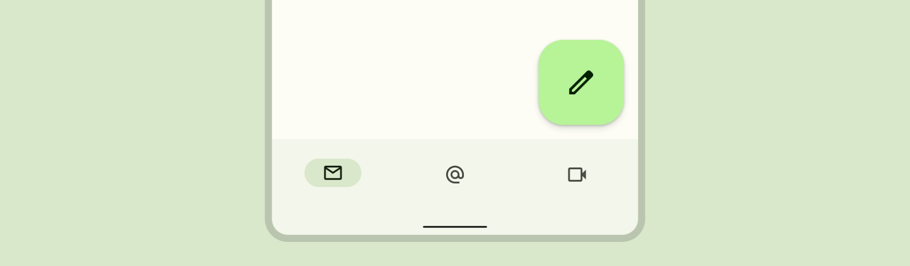

<!--docs:
title: "Floating action buttons"
layout: detail
section: components
excerpt:  "A floating action button (FAB) represents the primary action of a screen."
iconId: button
path: /catalog/floating-action-button/
-->

# Floating action buttons

A
[floating action button (FAB)](https://material.io/components/buttons-floating-action-button)
represents the primary action of a screen.



**Contents**

*   [Design & API Documentation](#design-api-documentation)
*   [Using FABs](#using-fabs)
*   [FABs](#fabs)
*   [Small FABs](#small-fabs)
*   [Large FABs](#large-fabs)
*   [Extended FABs](#extended-fabs)
*   [Theming FABs](#theming-fabs)

## Design & API Documentation

*   [Google Material3 Spec](https://material.io/components/floating-action-button/overview)
*   [API reference](https://developer.android.com/reference/com/google/android/material/floatingactionbutton/package-summary)

## Using FABs

A FAB performs the primary, or most common, action on a screen. It appears in
front of all screen content, typically as a boxy shape with an icon in its
center.

Before you can use Material FABs, you need to add a dependency to the Material
Components for Android library. For more information, go to the
[Getting started](https://github.com/material-components/material-components-android/tree/master/docs/getting-started.md)
page.

**Note:** If the `FloatingActionButton` is a child of a `CoordinatorLayout`, you get
certain behaviors for free. It will automatically shift so that any displayed
`Snackbar`s do not cover it, and will automatically hide when covered by an
`AppBarLayout` or `BottomSheetBehavior`.

### Making FABs accessible

You should set a content description on a FAB via the
`android:contentDescription` attribute or `setContentDescription` method so that
screen readers like TalkBack are able to announce their purpose or action. Text
rendered in Extended FABs is automatically provided to accessibility services,
so additional content labels are usually unnecessary.

### Visibility

Use the `show` and `hide` methods to animate the visibility of a
`FloatingActionButton` or an `ExtendedFloatingActionButton`. The show animation
grows the widget and fades it in, while the hide animation shrinks the widget
and fades it out.

```kt
// To show:
fab.show()
// To hide:
fab.hide()
```

### Extending and Shrinking

Use the `extend` and `shrink` methods to animate showing and hiding the text of
an `ExtendedFloatingActionButton`. The extend animation extends the FAB to show
the text and the icon. The shrink animation shrinks the FAB to show just the
icon.

```kt
// To extend:
extendedFab.extend()
// To shrink:
extendedFab.shrink()
```

### Sizing FABs

The `FloatingActionButton` can be sized either by using `app:fabCustomSize` or
for the large/small FAB (M3 only) by applying the desired style. The
`app:fabSize` discrete size mode is deprecated in Material3 style. If the
`app:fabSize` is overridden in your FAB style, which inherits from one of these
styles:

*   `Widget.Material3.FloatingActionButton(.Large).Primary`
*   `Widget.Material3.FloatingActionButton(.Large).Secondary`
*   `Widget.Material3.FloatingActionButton(.Large).Tertiary`
*   `Widget.Material3.FloatingActionButton(.Large).Surface`

Please consider one of the following migration options:

*   If `normal` size is used, set the parent style to
    `Widget.Material3.FloatingActionButton.{Color}` and remove `app:fabSize`.
*   If `mini` size is used, set the parent style to
    `Widget.Material3.FloatingActionButton.Small.{Color}` and remove
    `app:fabSize`.
*   If FAB size changes in runtime by either setting `fabSize` or
    `fabCustomSize`, and relative sized corners are desired, set
    `shapeAppearanceOverlay` as
    `@style/ShapeAppearanceOverlay.Material3.FloatingActionButton` in the style.

If you'd like to use the small FAB, apply one of these style attributes:

*   `?attr/floatingActionButtonSmallStyle`
*   `?attr/floatingActionButtonSmallPrimaryStyle`
*   `?attr/floatingActionButtonSmallSecondaryStyle`
*   `?attr/floatingActionButtonSmallTertiaryStyle`
*   `?attr/floatingActionButtonSmallSurfaceStyle`

If you'd like to use the large FAB, apply one of these style attributes:

*   `?attr/floatingActionButtonLargeStyle`
*   `?attr/floatingActionButtonLargePrimaryStyle`
*   `?attr/floatingActionButtonLargeSecondaryStyle`
*   `?attr/floatingActionButtonLargeTertiaryStyle`
*   `?attr/floatingActionButtonLargeSurfaceStyle`

### Types

There are four types of FABS: 1\. [FABs](#fabs), 2\. [Small FABs](#small-fabs),
3\. [Large FABs](#large-fabs)


And 4\. [Extended FABs](#extended-fabs)


## FABs

FABs are the default size and style for a primary action button.

API and source code:

*   `FloatingActionButton`
    *   [Class description](https://developer.android.com/reference/com/google/android/material/floatingactionbutton/FloatingActionButton)
    *   [Class source](https://github.com/material-components/material-components-android/tree/master/lib/java/com/google/android/material/floatingactionbutton/FloatingActionButton.java)

### FAB example

The following example shows a regular FAB with a plus icon.


In the layout:

```xml
<androidx.coordinatorlayout.widget.CoordinatorLayout
    ...
    android:layout_width="match_parent"
    android:layout_height="match_parent">

  <!-- Main content -->

  <com.google.android.material.floatingactionbutton.FloatingActionButton
      android:id="@+id/floating_action_button"
      android:layout_width="wrap_content"
      android:layout_height="wrap_content"
      android:layout_gravity="bottom|end"
      android:layout_margin="16dp"
      android:contentDescription="@string/fab_content_desc"
      app:srcCompat="@drawable/ic_plus_24"/>

</androidx.coordinatorlayout.widget.CoordinatorLayout>
```

In code:

```kt
fab.setOnClickListener {
    // Respond to FAB click
}
```

#### Anatomy


A regular FAB has a container and an icon.

1.  Container
1.  Icon

## Small FABs

A small FAB should be used on smaller screens.

Small FABs can also be used to create visual continuity with other screen
elements.

API and source code:

*   `FloatingActionButton`
    *   [Class description](https://developer.android.com/reference/com/google/android/material/floatingactionbutton/FloatingActionButton)
    *   [Class source](https://github.com/material-components/material-components-android/tree/master/lib/java/com/google/android/material/floatingactionbutton/FloatingActionButton.java)

### Small FAB example

The following example shows a small FAB with a plus icon.


In the layout:

```xml
<androidx.coordinatorlayout.widget.CoordinatorLayout
    ...
    >

  <!-- Main content -->

  <com.google.android.material.floatingactionbutton.FloatingActionButton
      ...
      style="?attr/floatingActionButtonSmallStyle"/>

</androidx.coordinatorlayout.widget.CoordinatorLayout>
```

In code:

```kt
fab.setOnClickListener {
    // Respond to FAB click
}
```

#### Anatomy


A small FAB has a container and an icon.

1.  Container
1.  Icon

## Large FABs

A large FAB is useful when the layout calls for a clear and primary action that
the user is most likely to take, and where a larger footprint would help them to
engage. For example, when appearing on taller and larger device screens.

API and source code:

*   `FloatingActionButton`
  *   [Class description](https://developer.android.com/reference/com/google/android/material/floatingactionbutton/FloatingActionButton)
  *   [Class source](https://github.com/material-components/material-components-android/tree/master/lib/java/com/google/android/material/floatingactionbutton/FloatingActionButton.java)

### Large FAB example

The following example shows a large FAB with a plus icon.


In the layout:

```xml
<androidx.coordinatorlayout.widget.CoordinatorLayout
    ...
    >

  <!-- Main content -->

  <com.google.android.material.floatingactionbutton.FloatingActionButton
      ...
      style="?attr/floatingActionButtonLargeStyle"/>

</androidx.coordinatorlayout.widget.CoordinatorLayout>
```

In code:

```kt
fab.setOnClickListener {
    // Respond to FAB click
}
```

#### Anatomy


A large FAB has a container and an icon.

1.  Container
1.  Icon

### Regular, small, and large FAB key properties

#### Container attributes

Element                       | Attribute                                      | Related method(s)                                                                     | Default value
----------------------------- | ---------------------------------------------- | ------------------------------------------------------------------------------------- | -------------
**Color**                     | `app:backgroundTint`                           | `setBackgroundTintList`<br/>`getBackgroundTintList`                                   | `?attr/colorPrimaryContainer` (see all [states](https://github.com/material-components/material-components-android/tree/master/lib/java/com/google/android/material/color/res/color/m3_button_background_color_selector.xml))
**Stroke**                    | `app:borderWidth`                              | N/A                                                                                   | `0dp`
**Size**                      | `app:fabSize`<br>`app:fabCustomSize`           | `setSize`<br/>`setCustomSize`<br/>`clearCustomSize`<br/>`getSize`<br/>`getCustomSize` | `auto`
**Shape**                     | `shapeAppearance`<br/>`shapeAppearanceOverlay` | `setShapeAppearanceModel`<br/>`getShapeAppearanceModel`                               | `ShapeAppearanceOverlay.Material3.FloatingActionButton`<br/>
**Elevation**                 | `app:elevation`                                | `setElevation`<br/>`getCompatElevation`                                               | `6dp`
**Hovered/Focused elevation** | `app:hoveredFocusedTranslationZ`               | `setCompatHoveredFocusedTranslationZ`<br/>`getCompatHoveredFocusedTranslationZ`       | `2dp`
**Pressed elevation**         | `app:pressedTranslationZ`                      | `setCompatPressedTranslationZ`<br/>`getCompatPressedTranslationZ`                     | `6dp`
**Ripple**                    | `app:rippleColor`                              | `setRippleColor`<br/>`getRippleColor`<br/>`getRippleColorStateList`                   | variations of `?attr/colorOnPrimaryContainer`, see all [states](https://github.com/material-components/material-components-android/tree/master/lib/java/com/google/android/material/color/res/color/m3_button_ripple_color_selector.xml)
**Motion**                    | `app:showMotionSpec`<br>`app:hideMotionSpec`   | `set*MotionSpec`<br/>`set*MotionSpecResource`<br/>`get*MotionSpec`                    | `@null`

#### Icon attributes

Element   | Attribute       | Related method(s)                                           | Default value
--------- | --------------- | ----------------------------------------------------------- | -------------
**Icon**  | `app:srcCompat` | `setImageDrawable`<br/>`setImageResource`<br/>`getDrawable` | `null`
**Color** | `app:tint`      | `setImageTintList`<br/>`getImageTintList`                   | `?attr/colorOnPrimaryContainer` (see all [states](https://github.com/material-components/material-components-android/tree/master/lib/java/com/google/android/material/color/res/color/m3_button_foreground_color_selector.xml))

#### Styles

Element           | Style
----------------- | ------------------------------------------------
**Default style** | `Widget.Material3.FloatingActionButton.Primary`

Default style theme attribute: `?attr/floatingActionButtonStyle`

See the full list of
[styles](https://github.com/material-components/material-components-android/tree/master/lib/java/com/google/android/material/floatingactionbutton/res/values/styles.xml)
and
[attrs](https://github.com/material-components/material-components-android/tree/master/lib/java/com/google/android/material/floatingactionbutton/res/values/attrs.xml).

## Extended FABs

The extended FAB is wider, and it includes a text label.

**Note:** `ExtendedFloatingActionButton` is a child class of
[`MaterialButton`](Button.md), rather than `FloatingActionButton`. This means
that several attributes which are applicable to `FloatingActionButton` have
different naming in `ExtendedFloatingActionButton`. For example,
`FloatingActionButton` uses `app:srcCompat` to set the icon drawable, whereas
`ExtendedFloatingActionButton` uses `app:icon`. See the
[attributes tables](#anatomy-and-key-properties) below for more details.

API and source code:

*   `ExtendedFloatingActionButton`
    *   [Class description](https://developer.android.com/reference/com/google/android/material/floatingactionbutton/ExtendedFloatingActionButton)
    *   [Class source](https://github.com/material-components/material-components-android/tree/master/lib/java/com/google/android/material/floatingactionbutton/ExtendedFloatingActionButton.java)

### Extended FAB example

The following example shows an extended FAB with a plus icon.


In the layout:

```xml
<androidx.coordinatorlayout.widget.CoordinatorLayout
    ...
    >

  <!-- Main content -->

  <com.google.android.material.floatingactionbutton.ExtendedFloatingActionButton
    android:id="@+id/extended_fab"
    android:layout_width="wrap_content"
    android:layout_height="wrap_content"
    android:layout_margin="16dp"
    android:layout_gravity="bottom|end"
    android:contentDescription="@string/extended_fab_content_desc"
    android:text="@string/extended_fab_label"
    app:icon="@drawable/ic_plus_24px"/>

</androidx.coordinatorlayout.widget.CoordinatorLayout>
```

In code:

```kt
extendedFab.setOnClickListener {
    // Respond to Extended FAB click
}
```

### Anatomy and key properties


An extended FAB has a text label, a transparent container and an optional icon.

1.  Container
2.  Text label
3.  Icon (Optional)

#### Container attributes

Element                       | Attribute                                                                                  | Related method(s)                                                  | Default value
----------------------------- | ------------------------------------------------------------------------------------------ | ------------------------------------------------------------------ | -------------
**Color**                     | `app:backgroundTint`                                                                       | `setBackgroundTintList`<br/>`getBackgroundTintList`                | `?attr/colorPrimaryContainer` (see all [states](https://github.com/material-components/material-components-android/tree/master/lib/java/com/google/android/material/color/res/color/m3_button_background_color_selector.xml))
**Stroke color**              | `app:strokeColor`                                                                          | `setStrokeColor`<br/>`getStrokeColor`                              | `null`
**Stroke width**              | `app:strokeWidth`                                                                          | `setStrokeWidth`<br/>`getStrokeWidth`                              | `0dp`
**Size**                      | `app:collapsedSize`                                                                        | N/A                                                                |
**Extend Strategy**           | `app:extendStrategy`                                                                       | N/A                                                                | `wrap_content`
**Shape**                     | `app:shapeAppearance`<br/>`app:shapeAppearanceOverlay`                                     | `setShapeAppearanceModel`<br/>`getShapeAppearanceModel`            | `ShapeAppearanceOverlay.Material3.FloatingActionButton`<br/>
**Elevation**                 | `app:elevation`                                                                            | `setElevation`<br/>`getElevation`                                  | `6dp`
**Hovered/Focused elevation** | `app:hoveredFocusedTranslationZ`                                                           | N/A                                                                | `2dp`
**Pressed elevation**         | `app:pressedTranslationZ`                                                                  | N/A                                                                | `6dp`
**Ripple**                    | `app:rippleColor`                                                                          |                                                                    | variations of `?attr/colorOnPrimaryContainer`, see all [states](https://github.com/material-components/material-components-android/tree/master/lib/java/com/google/android/material/color/res/color/m3_button_ripple_color_selector.xml)
**Motion**                    | `app:showMotionSpec`<br>`app:hideMotionSpec`<br/>`extendMotionSpec`<br/>`shrinkMotionSpec` | `set*MotionSpec`<br/>`set*MotionSpecResource`<br/>`get*MotionSpec` | see [animators](https://github.com/material-components/material-components-android/tree/master/lib/java/com/google/android/material/floatingactionbutton/res/animator)

#### Icon attributes

Element                           | Attribute         | Related method(s)                                         | Default value
--------------------------------- | ----------------- | --------------------------------------------------------- | -------------
**Icon**                          | `app:icon`        | `setIcon`<br/>`setIconResource`<br/>`getIcon`             | `null`
**Color**                         | `app:iconTint`    | `setIconTint`<br/>`setIconTintResource`<br/>`getIconTint` | `?attr/colorOnPrimaryContainer` (see all [states](https://github.com/material-components/material-components-android/tree/master/lib/java/com/google/android/material/color/res/color/m3_button_foreground_color_selector.xml))
**Size**                          | `app:iconSize`    | `setIconSize`<br/>`getIconSize`                           | `24dp`
**Padding between icon and text** | `app:iconPadding` | `setIconPadding`<br/>`getIconPadding`                     | `12dp`

#### Text label

Element        | Attribute                | Related method(s)                 | Default value
-------------- | ------------------------ | --------------------------------- | -------------
**Text label** | `android:text`           | `setText`<br/>`getText`           | `null`
**Color**      | `android:textColor`      | `setTextColor`<br/>`getTextColor` | `?attr/colorPrimaryContainer` (see all [states](https://github.com/material-components/material-components-android/tree/master/lib/java/com/google/android/material/color/res/color/m3_button_foreground_color_selector.xml))
**Typography** | `android:textAppearance` | `setTextAppearance`               | `?attr/textAppearanceLabelLarge`

#### Styles

Element                                   | Style
----------------------------------------- | -----
**Default style**                         | `Widget.Material3.ExtendedFloatingActionButton.Icon.Primary`
**Text-only when**<br/>**extended style** | `Widget.Material3.ExtendedFloatingActionButton.Primary`

Default style theme attribute: `?attr/extendedFloatingActionButtonStyle`

See the full list of
[styles](https://github.com/material-components/material-components-android/tree/master/lib/java/com/google/android/material/floatingactionbutton/res/values/styles.xml)
and
[attrs](https://github.com/material-components/material-components-android/tree/master/lib/java/com/google/android/material/floatingactionbutton/res/values/attrs.xml).

## Theming FABs

### FAB theming example

API and source code:

*   `FloatingActionButton`
    *   [Class description](https://developer.android.com/reference/com/google/android/material/floatingactionbutton/FloatingActionButton)
    *   [Class source](https://github.com/material-components/material-components-android/tree/master/lib/java/com/google/android/material/floatingactionbutton/FloatingActionButton.java)
*   `ExtendedFloatingActionButton`
    *   [Class description](https://developer.android.com/reference/com/google/android/material/floatingactionbutton/ExtendedFloatingActionButton)
    *   [Class source](https://github.com/material-components/material-components-android/tree/master/lib/java/com/google/android/material/floatingactionbutton/ExtendedFloatingActionButton.java)

The following example shows a regular, small, and extended FAB with Material
Theming.


#### Implementing FAB theming

Use theme attributes and styles in `res/values/styles.xml` to add themes to all
FABs. This affects other components:

```xml
<style name="Theme.App" parent="Theme.Material3.*">
    ...
    <item name="colorPrimaryContainer">@color/purple_500</item>
    <item name="colorOnPrimaryContainer">@color/purple_700</item>
</style>
```

Use a default style theme attribute, styles and a theme overlay. This themes all
FABs in your app but does not affect other components:

```xml
<style name="Theme.App" parent="Theme.Material3.*">
    ...
    <item name="extendedFloatingActionButtonStyle">@style/Widget.App.ExtendedFloatingActionButton</item>
    <item name="floatingActionButtonStyle">@style/Widget.App.FloatingActionButton</item>
</style>

<style name="Widget.App.ExtendedFloatingActionButton" parent="Widget.Material3.ExtendedFloatingActionButton.Icon.Primary">
    <item name="materialThemeOverlay">@style/ThemeOverlay.App.FloatingActionButton</item>
</style>

<style name="Widget.App.FloatingActionButton" parent="Widget.Material3.FloatingActionButton.Primary">
    <item name="materialThemeOverlay">@style/ThemeOverlay.App.FloatingActionButton</item>
</style>

<style name="ThemeOverlay.App.FloatingActionButton" parent="">
    <item name="colorContainer">@color/purple_500</item>
    <item name="colorOnContainer">@color/purple_700</item>
</style>
```

Use one of the styles in the layout. That affects only this FAB:

```xml
<com.google.android.material.floatingactionbutton.FloatingActionButton
    ...
    style="@style/Widget.App.FloatingActionButton"
/>
```
