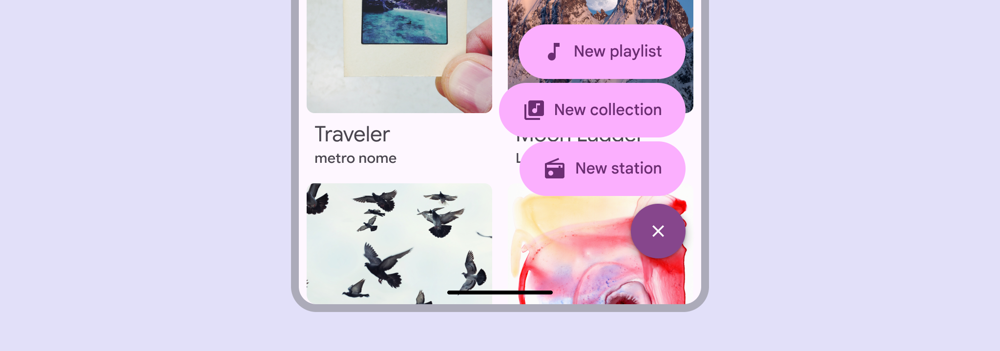

<!--docs:
title: "Floating action button menus"
layout: detail
section: components
excerpt:  "A FAB menu opens from a FAB to show multiple related actions."
iconId: button
path: /catalog/floating-action-button-menu/
-->

# Floating action button menus

A [FAB menu](https://m3.material.io/components/fab-menu) opens from a FAB to show
multiple related actions.

## Design & API documentation

*   [Material 3 (M3) spec](https://m3.material.io/components/fab-menu/overview)
*   [API reference](https://developer.android.com/reference/kotlin/androidx/compose/material3/package-summary?hl=en#FloatingActionButtonMenu(kotlin.Boolean,kotlin.Function0,androidx.compose.ui.Modifier,androidx.compose.ui.Alignment.Horizontal,kotlin.Function1))

## Using FAB menus

Use the FAB menu to show multiple related actions in a prominent, expressive
style.

A FAB menu opens from a FAB to show multiple related actions. It should always
appear in the same place as the FAB that opened it.

### Anatomy

When expanded, a FAB menu has a close button and multiple list items.

1.  Close button
1.  List item

### Usage (via Compose interop)

The FAB menu component is currently not available as a native **Views**
component. This doc shows how to use the **Compose** FAB menu component via the
Views <-> Compose interop.

Compose API and source code:

*   `FloatingActionButtonMenu`
    *   [API documentation](https://developer.android.com/reference/kotlin/androidx/compose/material3/package-summary?hl=en#FloatingActionButtonMenu(kotlin.Boolean,kotlin.Function0,androidx.compose.ui.Modifier,androidx.compose.ui.Alignment.Horizontal,kotlin.Function1))
    *   [Source code](https://cs.android.com/androidx/platform/frameworks/support/+/androidx-main:compose/material3/material3/src/commonMain/kotlin/androidx/compose/material3/FloatingActionButtonMenu.kt)
    *   [Sample code](https://cs.android.com/androidx/platform/frameworks/support/+/androidx-main:compose/material3/material3/samples/src/main/java/androidx/compose/material3/samples/FloatingActionButtonMenuSamples.kt)

First, follow the
[Get started with Jetpack Compose](https://developer.android.com/develop/ui/compose/documentation)
guide to get your app set up with Compose, if it isn't already.

Next, in order to use the Compose `FloatingActionButtonMenu` component make sure
to add a dependency on the
[Compose Material 3](https://developer.android.com/jetpack/androidx/releases/compose-material3)
library to your app.

Finally, add a `ComposeView` to your app by following the
[Using Compose in Views](https://developer.android.com/develop/ui/compose/migrate/interoperability-apis/compose-in-views)
interop guide and use the Compose `FloatingActionButtonMenu` within your
`ComposeView`, by referring to the
[API documentation](https://developer.android.com/reference/kotlin/androidx/compose/material3/package-summary?hl=en#FloatingActionButtonMenu(kotlin.Boolean,kotlin.Function0,androidx.compose.ui.Modifier,androidx.compose.ui.Alignment.Horizontal,kotlin.Function1))
and
[sample code](https://cs.android.com/androidx/platform/frameworks/support/+/androidx-main:compose/material3/material3/samples/src/main/java/androidx/compose/material3/samples/FloatingActionButtonMenuSamples.kt).

For a working demo of using the Compose FAB menu in a Views app via interop,
take a look at
[FabMenuDemoFragment.kt](https://github.com/material-components/material-components-android/tree/master/catalog/java/io/material/catalog/fab/FabMenuDemoFragment.kt)
in the Material Android Views Catalog app. This demo also shows how to handle
light, dark, and dynamic color schemes to ensure the Compose
`FloatingActionButtonMenu` looks correct within the Views app.

**Note:** In order to have a consistent visual experience between the Compose
FAB menu and your app, make sure to set up the `MaterialTheme` or
`MaterialExpressiveTheme` in your `ComposeView` to match the theming of your
Views app.
