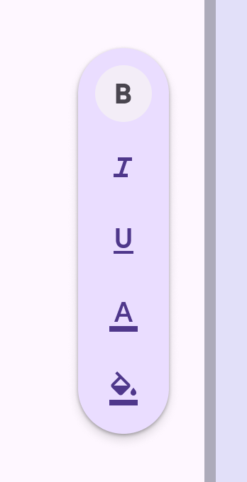

<!--docs:
title: "Floating Toolbar"
layout: detail
section: components
excerpt: "Floating toolbars show actions related to the current page"
iconId: floating_toolbar
path: /catalog/floating-toolbar/
-->

# Floating Toolbar

Floating Toolbar provides a way to show actions related to the current page.
Floating Toolbar is an undocked variant of Toolbars.

See [Top App Bars](TopAppBar.md) and [Bottom App Bars](BottomAppBar.md) for docked Toolbar variants.

Floating toolbars can be vertical or horizontal.

Vertical Floating Toolbar                                               | Horizontal Floating Toolbar
-------------------------------------------------------------------------- | ------------------------
 | 

**Contents**

*   [Design and API Documentation](#design-and-api-documentation)
*   [Using Floating Toolbar](#using-floating-toolbar)
*   [Theming](#theming-a-floating-toolbar)

## Design and API Documentation

*   Google Material3 Spec in progress
*   API Reference in progress

## Using Floating Toolbar

Before you can use the Floating Toolbar, you need to add a dependency to
the Material Components for Android library. For more information, go to the
[Getting started](https://github.com/material-components/material-components-android/tree/master/docs/getting-started.md)
page.

Here's what a typical layout would look like:

```xml
<androidx.coordinatorlayout.widget.CoordinatorLayout
  xmlns:android="http://schemas.android.com/apk/res/android"
  xmlns:app="http://schemas.android.com/apk/res-auto"
  android:layout_width="match_parent"
  android:layout_height="match_parent">

  <!-- sample screen content -->
  <androidx.core.widget.NestedScrollView
    android:layout_width="match_parent"
    android:layout_height="match_parent">
    <LinearLayout
      android:layout_width="match_parent"
      android:layout_height="wrap_content">

      <TextView
        android:layout_width="wrap_content"
        android:layout_height="wrap_content"
        android:text="@string/content" />
    </LinearLayout>
  </androidx.core.widget.NestedScrollView>

  <com.google.android.material.floatingtoolbar.FloatingToolbarLayout
    android:id="@+id/floating_toolbar"
    android:layout_width="wrap_content"
    android:layout_height="wrap_content"
    android:layout_gravity="bottom|center"
    android:layout_margin="16dp">
    
    <!-- floating toolbar sample content -->
    <LinearLayout
      android:id="@+id/floating_toolbar_child"
      android:layout_width="wrap_content"
      android:layout_height="wrap_content"
      android:layout_gravity="center"
      android:orientation="vertical">

      <Button
        android:id="@+id/floating_toolbar_button_bold"
        style="?attr/materialIconButtonFilledStyle"
        android:layout_width="wrap_content"
        android:layout_height="wrap_content"
        android:checkable="true"
        android:contentDescription="@string/bold_button_content_description"
        app:icon="@drawable/ic_format_bold_24px" />

      <Button
        android:id="@+id/floating_toolbar_button_italic"
        style="?attr/materialIconButtonFilledStyle"
        android:layout_width="wrap_content"
        android:layout_height="wrap_content"
        android:checkable="true"
        android:contentDescription="@string/italic_button_content_description"
        app:icon="@drawable/ic_format_italic_24px" />

      <Button
        android:id="@+id/floating_toolbar_button_underlined"
        style="?attr/materialIconButtonFilledStyle"
        android:layout_width="wrap_content"
        android:layout_height="wrap_content"
        android:checkable="true"
        android:contentDescription="@string/underlined_button_content_description"
        app:icon="@drawable/ic_format_underlined_24px" />
    </LinearLayout>

  </com.google.android.material.floatingtoolbar.FloatingToolbarLayout>
```

A Floating Toolbar is a `FrameLayout` that provides additional styling and functionality.
You may add children to it as you would to a `FrameLayout`.

When inside a `CoordinatorLayout`, a floating toolbar will hide itself on scroll using `CoordinatorLayout.Behavior`.

Note that the Material3 style should be explicitly set on the `FloatingToolbarLayout`. See the full list of [styles](https://github.com/material-components/material-components-android/tree/master/lib/java/com/google/android/material/floatingtoolbar/res/values/styles.xml). Otherwise the default horizontal style will be used and `android:layout_gravity` and `android:layout_margin`
will need to be set explicitly.

API and source code:

*   `FloatingToolBar`
    *   [Class source](https://github.com/material-components/material-components-android/tree/master/lib/java/com/google/android/material/floatingtoolbar/FloatingToolbarLayout.java)


### Making Floating Toolbar accessible

You should set a `contentDescription` on all the actions in the Floating Toolbar so that screen
readers like TalkBack can properly announce what each action represents.

You can also control the ordering of the Talkback focus through the `accessibilityTraversalBefore` and `accessibilityTraversalAfter` flags.

For example, if you want the Floating Toolbar to gain Talkback focus first, you can set these accessibility flags like below:

```xml
  <!-- sample screen content -->
  <androidx.core.widget.NestedScrollView
    android:layout_width="match_parent"
    android:layout_height="match_parent">
    <LinearLayout
      android:layout_width="match_parent"
      android:layout_height="wrap_content">

      <TextView
        android:id="@+id/content"
        android:layout_width="wrap_content"
        android:layout_height="wrap_content"
        android:text="@string/content"
        android:accessibilityTraversalAfter="@id/floating_toolbar" />
    </LinearLayout>
  </androidx.core.widget.NestedScrollView>

  <com.google.android.material.floatingtoolbar.FloatingToolbarLayout
    android:id="@+id/floating_toolbar"
    android:layout_width="wrap_content"
    android:layout_height="wrap_content"
    android:accessibilityTraversalBefore="@id/content">
    ...
  </com.google.android.material.floatingtoolbar.FloatingToolbarLayout>
```

### Anatomy and key properties

The following is an anatomy diagram for the navigation rail:


1.  Container
2.  Content

#### Container attributes

**Element** | **Attribute**         | **Related methods** | **Default value**
----------- | --------------------- | ------------------- | -----------------
**Color**   | `app:backgroundTint`  | N/A                 | standard is `?attr/colorSurfaceContainer`, vibrant is `?attr/colorPrimaryContainer`
**Shape**   | `app:shapeAppearance` | N/A                 | `50% rounded`

#### Styles

**Element**        | **Style**
------------------ | ------------------------------------------
**Standard style** | `Widget.Material3.FloatingToolbar`
**Vibrant style**  | `Widget.Material3.FloatingToolbar.Vibrant`

Standard style theme attribute: `?attr/floatingToolbarStyle`
Vibrant style theme attribute: `?attr/floatingToolbarVibrantStyle`

See the full list of
[styles](https://github.com/material-components/material-components-android/tree/master/lib/java/com/google/android/material/floatingtoolbar/res/values/styles.xml) and
[floating toolbar attributes](https://github.com/material-components/material-components-android/tree/master/lib/java/com/google/android/material/floatingtoolbar/res/values/attrs.xml)

## Theming a Floating Toolbar

Floating Toolbar supports [Material Theming](https://m3.material.io/foundations/customization),
which can customize color and typography.

### Floating Toolbar theming example

The following example shows a Floating Toolbar with Material Theming.


#### Implementing floating toolbar theming

Use theme attributes and a style in `res/values/styles.xml` which apply to all
floating toolbars and affect other components:

```xml
<style name="Theme.App" parent="Theme.Material3.*">
    ...
    <item name="colorPrimary">@color/shrine_theme_light_primary</item>
    <item name="colorOnPrimary">@color/shrine_theme_light_onPrimary</item>
    <item name="colorPrimaryContainer">@color/shrine_theme_light_primaryContainer</item>
    <item name="colorOnPrimaryContainer">@color/shrine_theme_light_onPrimaryContainer</item>
    <item name="colorSecondaryContainer">@color/shrine_theme_light_secondaryContainer</item>
    <item name="colorOnSecondaryContainer">@color/shrine_theme_light_onSecondaryContainer</item>
    <item name="colorTertiaryContainer">@color/shrine_theme_light_tertiaryContainer</item>
    <item name="colorOnTertiaryContainer">@color/shrine_theme_light_onTertiaryContainer</item>
    <item name="colorError">@color/shrine_theme_light_error</item>
    <item name="colorErrorContainer">@color/shrine_theme_light_errorContainer</item>
    <item name="colorOnError">@color/shrine_theme_light_onError</item>
    <item name="colorOnErrorContainer">@color/shrine_theme_light_onErrorContainer</item>
    <item name="colorSurface">@color/shrine_theme_light_surface</item>
    <item name="colorOnSurface">@color/shrine_theme_light_onSurface</item>
    <item name="colorOnSurfaceVariant">@color/shrine_theme_light_onSurfaceVariant</item>
</style>
```

Use a default style theme attribute, styles, and a theme overlay, which apply to
all floating toolbars but do not affect other components:

```xml
<style name="Theme.App" parent="Theme.Material3.*">
    ...
    <item name="floatingToolbarStyle">@style/Widget.App.FloatingToolbar</item>
</style>

<style name="Widget.App.FloatingToolbar" parent="Widget.Material3.FloatingToolbar">
    <item name="materialThemeOverlay">@style/ThemeOverlay.App.FloatingToolbar</item>
</style>

<style name="ThemeOverlay.App.FloatingToolbar" parent="">
    <item name="colorPrimary">@color/shrine_theme_light_primary</item>
    <item name="colorOnPrimary">@color/shrine_theme_light_onPrimary</item>
    <item name="colorPrimaryContainer">@color/shrine_theme_light_primaryContainer</item>
    <item name="colorOnPrimaryContainer">@color/shrine_theme_light_onPrimaryContainer</item>
    <item name="colorSecondaryContainer">@color/shrine_theme_light_secondaryContainer</item>
    <item name="colorOnSecondaryContainer">@color/shrine_theme_light_onSecondaryContainer</item>
    <item name="colorTertiaryContainer">@color/shrine_theme_light_tertiaryContainer</item>
    <item name="colorOnTertiaryContainer">@color/shrine_theme_light_onTertiaryContainer</item>
    <item name="colorError">@color/shrine_theme_light_error</item>
    <item name="colorErrorContainer">@color/shrine_theme_light_errorContainer</item>
    <item name="colorOnError">@color/shrine_theme_light_onError</item>
    <item name="colorOnErrorContainer">@color/shrine_theme_light_onErrorContainer</item>
    <item name="colorSurface">@color/shrine_theme_light_surface</item>
    <item name="colorOnSurface">@color/shrine_theme_light_onSurface</item>
    <item name="colorOnSurfaceVariant">@color/shrine_theme_light_onSurfaceVariant</item>
</style>
```

Or use the style in the layout, which affects only this specific floating toolbar:

```xml
<com.google.android.material.floatingtoolbar.FloatingToolbarLayout
    ...
    style="@style/Widget.App.FloatingToolbar"
/>
```
