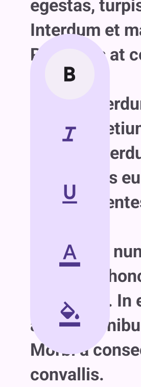
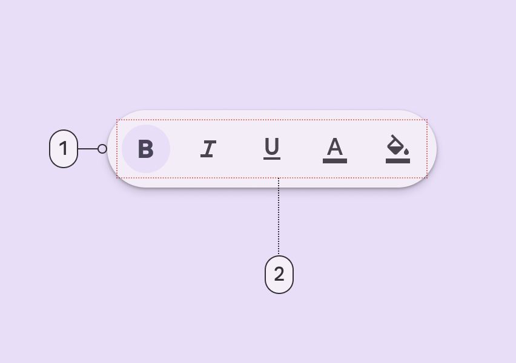
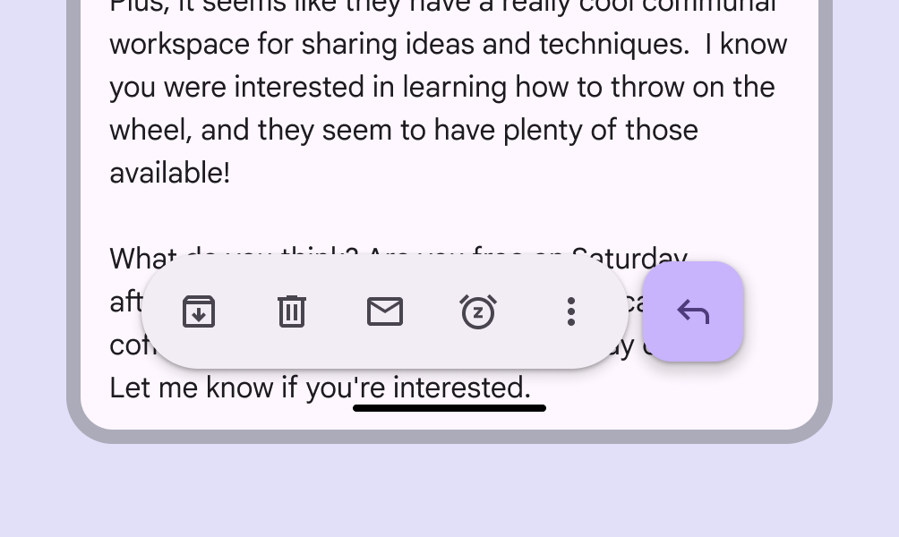
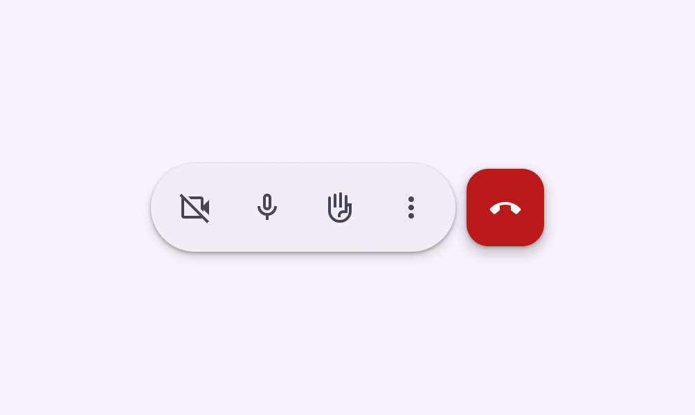
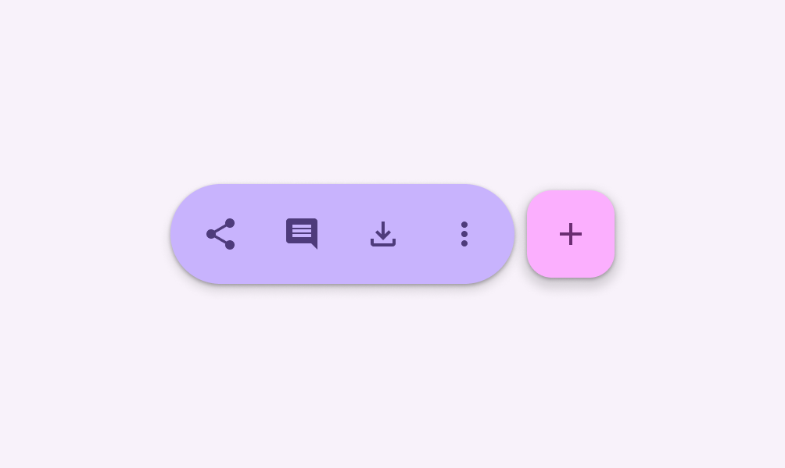
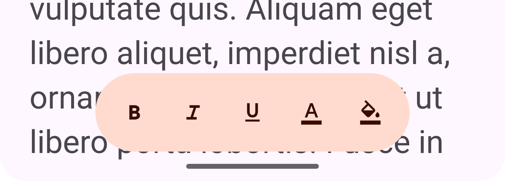

<!--docs:
title: "Floating toolbar"
layout: detail
section: components
excerpt: "Floating toolbars show actions related to the current page"
iconId: floating_toolbar
path: /catalog/floating-toolbar/
-->

# Floating toolbar

Floating toolbar provides a way to show actions related to the current page.
Floating toolbars can be vertical or horizontal.

Vertical floating toolbar                                                                        | Horizontal floating toolbar
:----------------------------------------------------------------------------------------------: | :-------------------------:
 | 

**Note:** Images use various dynamic color schemes.

## Design & API documentation

*   [Material 3 (M3) spec](https://m3.material.io/components/toolbars/overview)
*   API reference in progress

## Anatomy



1.  Container
2.  Elements

More details on anatomy items in the
[component guidelines](https://m3.material.io/components/toolbars/guidelines#d6b7bcb1-295d-41e6-a051-37f12e1c96ab).

## M3 Expressive

### M3 Expressive update

Before you can use `Material3Expressive` component styles, follow the
[`Material3Expressive themes` setup instructions](https://github.com/material-components/material-components-android/tree/master/docs/getting-started.md#material3expressive-themes).


Floating toolbar show controls relevant to the current page

The **floating toolbar** was created for more versatility, greater amounts of
actions, and more variety in where it's placed.
[More on M3 Expressive](https://m3.material.io/blog/building-with-m3-expressive)

**Types and naming:**

*   Added **floating toolbar** with the following attributes:

    *   Layout: Horizontal or vertical
    *   Color: Standard or vibrant
    *   Flexibility: Can hold many elements and components. Can be paired with
        FAB.

### M3 Expressive styles

There are two styles for the floating toolbar specifying different color
schemes:

```xml
<item name="floatingToolbarStyle">@style/Widget.Material3Expressive.FloatingToolbar</item>
<item name="floatingToolbarVibrantStyle">@style/Widget.Material3Expressive.FloatingToolbar.Vibrant</item>
```

Standard Floating Toolbar                                                          | Vibrant Floating Toolbar
---------------------------------------------------------------------------------- | ------------------------
 | 

By default, if a style is not specified, a `FloatingToolbar` will use
`floatingToolbarStyle` from the theme.

There are also styles specific to components inside the floating toolbar that
are recommended to be used. Currently, the recommendation exists for icon
buttons: `Widget.Material3Expressive.FloatingToolbar.IconButton` and
`Widget.Material3Expressive.FloatingToolbar.IconButton.Vibrant`.

Example usage:

```xml
<com.google.android.material.floatingtoolbar.FloatingToolbarLayout
    android:id="@+id/floating_toolbar_bottom"
    android:layout_margin="16dp"
    style="?attr/floatingToolbarVibrantStyle"
    android:layout_gravity="center|bottom"
    android:layout_width="wrap_content"
    android:layout_height="wrap_content">

    <com.google.android.material.overflow.OverflowLinearLayout
      android:id="@+id/floating_toolbar_child_bottom"
      android:layout_width="match_parent"
      android:layout_height="wrap_content"
      android:layout_gravity="center"
      android:orientation="horizontal">

      <Button
          android:id="@+id/floating_toolbar_vibrant_button_bold"
          style="@style/Widget.Material3Expressive.FloatingToolbar.IconButton.Vibrant"
          android:layout_width="wrap_content"
          android:layout_height="wrap_content"
          android:checkable="true"
          android:contentDescription="@string/floating_toolbar_button_bold_content_description"
          app:icon="@drawable/ic_format_bold_24px" />
      ...
```

## Key properties

### Container attributes

Element                 | Attribute                            | Related methods | Default value
----------------------- | ------------------------------------ | --------------- | -------------
**Color**               | `app:backgroundTint`                 | N/A             | standard is `?attr/colorSurfaceContainer`, vibrant is `?attr/colorPrimaryContainer`
**Shape**               | `app:shapeAppearance`                | N/A             | `50% rounded`
**Left inset margin**   | `app:marginLeftSystemWindowInsets`   | N/A             | `true`
**Top inset margin**    | `app:marginTopSystemWindowInsets`    | N/A             | `true`
**Right inset margin**  | `app:marginRightSystemWindowInsets`  | N/A             | `true`
**Bottom inset margin** | `app:marginBottomSystemWindowInsets` | N/A             | `true`

### Styles

Element            | Style                                      | Theme attribute
------------------ | ------------------------------------------ | ---------------
**Standard style** | `Widget.Material3.FloatingToolbar`         | `?attr/floatingToolbarStyle`
**Vibrant style**  | `Widget.Material3.FloatingToolbar.Vibrant` | `?attr/floatingToolbarVibrantStyle`

Floating toolbar also recommends a special style for specific components for
when they are inside of a floating toolbar. Currently, the floating toolbar
styles also include a theme overlay for `?attr/materialButtonStyle`,
`?attr/materialIconButtonStyle`, and `?attr/borderlessButtonStyle` to style
buttons inside of a floating toolbar.

For the full list, see
[styles](https://github.com/material-components/material-components-android/tree/master/lib/java/com/google/android/material/floatingtoolbar/res/values/styles.xml)
and
[floating toolbar attributes](https://github.com/material-components/material-components-android/tree/master/lib/java/com/google/android/material/floatingtoolbar/res/values/attrs.xml)

## Code implementation

Before you can use the floating toolbar, you need to add a dependency to the
Material components for Android library. For more information, go to the
[Getting started](https://github.com/material-components/material-components-android/tree/master/docs/getting-started.md)
page.

### Adding floating toolbar

Here's what a typical layout would look like:

```xml
<androidx.coordinatorlayout.widget.CoordinatorLayout
  xmlns:android="http://schemas.android.com/apk/res/android"
  xmlns:app="http://schemas.android.com/apk/res-auto"
  android:layout_width="match_parent"
  android:layout_height="match_parent">

  <!-- sample screen content -->
  <androidx.core.widget.NestedScrollView
    android:layout_width="match_parent"
    android:layout_height="match_parent">
    <LinearLayout
      android:layout_width="match_parent"
      android:layout_height="wrap_content">

      <TextView
        android:layout_width="wrap_content"
        android:layout_height="wrap_content"
        android:text="@string/content" />
    </LinearLayout>
  </androidx.core.widget.NestedScrollView>

  <com.google.android.material.floatingtoolbar.FloatingToolbarLayout
    android:id="@+id/floating_toolbar"
    android:layout_width="wrap_content"
    android:layout_height="wrap_content"
    android:layout_gravity="bottom|center"
    app:layout_behavior="com.google.android.material.behavior.HideViewOnScrollBehavior"
    android:layout_margin="16dp">

    <!-- floating toolbar sample content -->
   <com.google.android.material.overflow.OverflowLinearLayout
      android:id="@+id/floating_toolbar_child"
      android:layout_width="wrap_content"
      android:layout_height="wrap_content"
      android:layout_gravity="center"
      android:orientation="horizontal">

      <Button
        android:id="@+id/floating_toolbar_button_bold"
        style="?attr/materialIconButtonFilledStyle"
        android:layout_width="wrap_content"
        android:layout_height="wrap_content"
        android:checkable="true"
        android:contentDescription="@string/bold_button_content_description"
        app:icon="@drawable/ic_format_bold_24px"
        app:layout_overflowText="@string/bold_button"
        app:layout_overflowIcon="@drawable/ic_format_bold_24px" />

      <Button
        android:id="@+id/floating_toolbar_button_italic"
        style="?attr/materialIconButtonFilledStyle"
        android:layout_width="wrap_content"
        android:layout_height="wrap_content"
        android:checkable="true"
        android:contentDescription="@string/italic_button_content_description"
        app:icon="@drawable/ic_format_italic_24px"
        app:layout_overflowText="@string/italic_button"
        app:layout_overflowIcon="@drawable/ic_format_italic_24px" />

      <Button
        android:id="@+id/floating_toolbar_button_underlined"
        style="?attr/materialIconButtonFilledStyle"
        android:layout_width="wrap_content"
        android:layout_height="wrap_content"
        android:checkable="true"
        android:contentDescription="@string/underlined_button_content_description"
        app:icon="@drawable/ic_format_underlined_24px"
        app:layout_overflowText="@string/underlined_button"
        app:layout_overflowIcon="@drawable/ic_format_underlined_24px" />
    </com.google.android.material.overflow.OverflowLinearLayout>

  </com.google.android.material.floatingtoolbar.FloatingToolbarLayout>
```

A floating toolbar is a `FrameLayout` that provides additional styling and
functionality. You may add children to it as you would to a `FrameLayout`. It's
recommended to have its children wrapped by an `OverflowLinearLayout` that will
handle automatically adding items to an overflow button when there's not enough
screen space to show all the items.

When using `OverflowLinearLayout`, you should also set `app:layout_overflowText`
as that will be the text of the menu item that corresponds to the hidden child.
Optionally, you can also set `app:layout_overflowIcon`. See
[OverflowLinearLayout](https://github.com/material-components/material-components-android/tree/master//docs/components/Overflow.md)
for more info.

**Note:** if the child view that is clickable is not a direct child of
`OverflowLinearLayout`, such as the case of the example above, make sure to
propagate the parent's click to the child. That is so overflowed items in the
overflowed menu respond properly to being clicked. Alternatively, you can also
set `onClickListener`s on the overflowed items directly by accessing them via
`OverflowLinearLayout.getOverflowedViews()`.

Floating toolbars can hide on scroll if inside a `CoordinatorLayout` by setting
the following `CoordinatorLayout.Behavior` through the `app:layout_behavior`
attribute:

```xml
  <com.google.android.material.floatingtoolbar.FloatingToolbarLayout
    android:id="@+id/floating_toolbar"
    android:layout_width="wrap_content"
    android:layout_height="wrap_content"
    android:layout_gravity="bottom|center"
    app:layout_behavior="com.google.android.material.behavior.HideViewOnScrollBehavior">
  ...
</com.google.android.material.floatingtoolbar.FloatingToolbarLayout>
```

This behavior will be disabled when TalkBack is enabled for a11y reasons. See
[how to make floating toolbars accessible](#making-floating-toolbar-accessible).

Note that the default M3 style is the horizontal standard color styling. Vibrant
color or vertical styles should be explicitly set on the
`FloatingToolbarLayout`. M3 stylings for specific components may also be
defined, such as for icon buttons. These are recommended to be set explicitly on
the corresponding components inside `FloatingToolbarLayout`. See the full list
of
[styles](https://github.com/material-components/material-components-android/tree/master/lib/java/com/google/android/material/floatingtoolbar/res/values/styles.xml).

API and source code:

*   `FloatingToolBar`
    *   [Class source](https://github.com/material-components/material-components-android/tree/master/lib/java/com/google/android/material/floatingtoolbar/FloatingToolbarLayout.java)

### Making floating toolbar accessible

You should set a `contentDescription` on all the actions in the floating toolbar
so that screen readers like TalkBack can properly announce what each action
represents.

You can also control the ordering of the TalkBack focus through the
`accessibilityTraversalBefore` and `accessibilityTraversalAfter` flags.

For example, if you want the floating toolbar to gain TalkBack focus first, you
can set these accessibility flags like below:

```xml
  <!-- sample screen content -->
  <androidx.core.widget.NestedScrollView
    android:layout_width="match_parent"
    android:layout_height="match_parent">
    <LinearLayout
      android:layout_width="match_parent"
      android:layout_height="wrap_content">

      <TextView
        android:id="@+id/content"
        android:layout_width="wrap_content"
        android:layout_height="wrap_content"
        android:text="@string/content"
        android:accessibilityTraversalAfter="@id/floating_toolbar" />
    </LinearLayout>
  </androidx.core.widget.NestedScrollView>

  <com.google.android.material.floatingtoolbar.FloatingToolbarLayout
android:id="@+id/floating_toolbar"
    android:layout_width="wrap_content"
    android:layout_height="wrap_content"
    android:accessibilityTraversalBefore="@id/content">
    ...
  </com.google.android.material.floatingtoolbar.FloatingToolbarLayout>
```

#### TalkBack

Floating toolbars can optionally use the `CoordinatorLayout.Behavior`
`HideViewOnScrollBehavior` to hide the floating toolbar on scroll. This behavior
is disabled when TalkBack is enabled disabled due to screen readers not being
able to see it if the floating toolbar is hidden when scrolled.

If using a floating toolbar in a layout that obscures any content when hide on
scroll is disabled, make sure to add the appropriate padding to the content. For
example, if the floating toolbar is on the bottom and it is obscuring the
content, bottom padding should be added to the content.

See below for an example:

```
val am = context.getSystemService(AccessibilityManager::class.java)
if (am != null && am.isTouchExplorationEnabled) {
    (bar.layoutParams as? CoordinatorLayout.LayoutParams)?.behavior = null
    bar.post {
        content.setPadding(
            content.paddingLeft,
            content.paddingTop,
            content.paddingRight,
            content.paddingBottom + bar.measuredHeight
        )
    }
}
```

## Customizing floating toolbar

### Theming floating toolbar

Floating toolbars support the customization of color and typography.

API and source code:

*   `FloatingToolBarLayout`
    *   [Class source](https://github.com/material-components/material-components-android/tree/master/lib/java/com/google/android/material/floatingtoolbar/FloatingToolbarLayout.java)

#### Floating toolbar theming example

The following example shows a floating toolbar with Material theming.



##### Implementing floating toolbar theming

Use theme attributes and a style in `res/values/styles.xml` which apply to all
floating toolbars and affect other components:

```xml
<style name="Theme.App" parent="Theme.Material3.*">
    ...
    <item name="colorPrimary">@color/shrine_theme_light_primary</item>
    <item name="colorOnPrimary">@color/shrine_theme_light_onPrimary</item>
    <item name="colorPrimaryContainer">@color/shrine_theme_light_primaryContainer</item>
    <item name="colorOnPrimaryContainer">@color/shrine_theme_light_onPrimaryContainer</item>
    <item name="colorSecondaryContainer">@color/shrine_theme_light_secondaryContainer</item>
    <item name="colorOnSecondaryContainer">@color/shrine_theme_light_onSecondaryContainer</item>
    <item name="colorTertiaryContainer">@color/shrine_theme_light_tertiaryContainer</item>
    <item name="colorOnTertiaryContainer">@color/shrine_theme_light_onTertiaryContainer</item>
    <item name="colorError">@color/shrine_theme_light_error</item>
    <item name="colorErrorContainer">@color/shrine_theme_light_errorContainer</item>
    <item name="colorOnError">@color/shrine_theme_light_onError</item>
    <item name="colorOnErrorContainer">@color/shrine_theme_light_onErrorContainer</item>
    <item name="colorSurface">@color/shrine_theme_light_surface</item>
    <item name="colorOnSurface">@color/shrine_theme_light_onSurface</item>
    <item name="colorOnSurfaceVariant">@color/shrine_theme_light_onSurfaceVariant</item>
</style>
```

Use a default style theme attribute, styles, and a theme overlay, which apply to
all floating toolbars but do not affect other components:

```xml
<style name="Theme.App" parent="Theme.Material3.*">
    ...
    <item name="floatingToolbarStyle">@style/Widget.App.FloatingToolbar</item>
</style>

<style name="Widget.App.FloatingToolbar" parent="Widget.Material3.FloatingToolbar">
    <item name="materialThemeOverlay">@style/ThemeOverlay.App.FloatingToolbar</item>
</style>

<style name="ThemeOverlay.App.FloatingToolbar" parent="">
    <item name="colorPrimary">@color/shrine_theme_light_primary</item>
    <item name="colorOnPrimary">@color/shrine_theme_light_onPrimary</item>
    <item name="colorPrimaryContainer">@color/shrine_theme_light_primaryContainer</item>
    <item name="colorOnPrimaryContainer">@color/shrine_theme_light_onPrimaryContainer</item>
    <item name="colorSecondaryContainer">@color/shrine_theme_light_secondaryContainer</item>
    <item name="colorOnSecondaryContainer">@color/shrine_theme_light_onSecondaryContainer</item>
    <item name="colorTertiaryContainer">@color/shrine_theme_light_tertiaryContainer</item>
    <item name="colorOnTertiaryContainer">@color/shrine_theme_light_onTertiaryContainer</item>
    <item name="colorError">@color/shrine_theme_light_error</item>
    <item name="colorErrorContainer">@color/shrine_theme_light_errorContainer</item>
    <item name="colorOnError">@color/shrine_theme_light_onError</item>
    <item name="colorOnErrorContainer">@color/shrine_theme_light_onErrorContainer</item>
    <item name="colorSurface">@color/shrine_theme_light_surface</item>
    <item name="colorOnSurface">@color/shrine_theme_light_onSurface</item>
    <item name="colorOnSurfaceVariant">@color/shrine_theme_light_onSurfaceVariant</item>
</style>
```

Or use the style in the layout, which affects only this specific floating
toolbar:

```xml
<com.google.android.material.floatingtoolbar.FloatingToolbarLayout
    ...
    style="@style/Widget.App.FloatingToolbar"
/>
```
