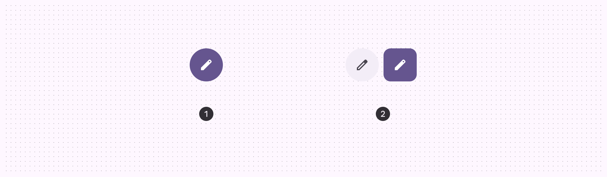
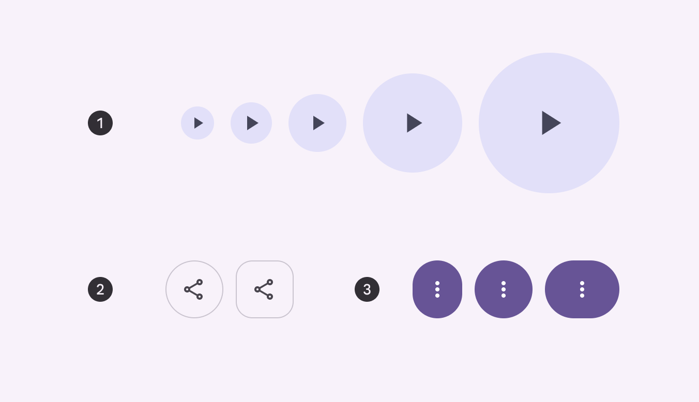
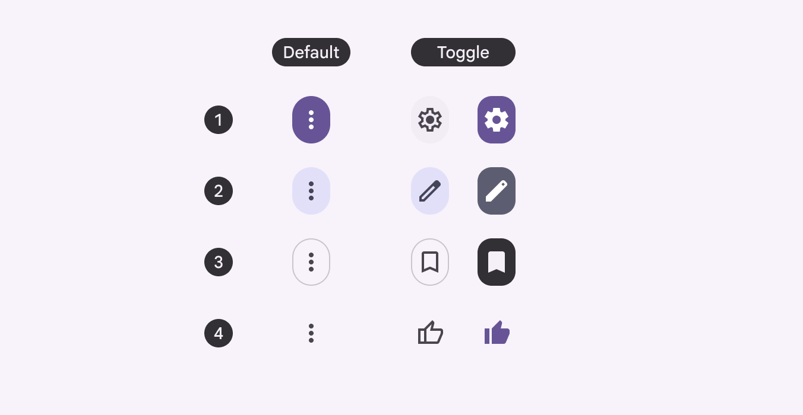

<!--docs:
title: "Icon buttons"
layout: detail
section: components
excerpt: "A customizable button component with updated visual styles."
iconId: materialbutton
path: /catalog/buttons/
-->

# Icon buttons

[Icon buttons](https://m3.material.io/components/icon-buttons/overview) help
people take minor actions with one tap. There are two variants of icon buttons.



1.  Default icon button
2.  Toggle icon button

**Note:** Images use various dynamic color schemes.

## Design & API documentation

*   [Material 3 (M3) spec](https://m3.material.io/components/icon-buttons/overview)
*   [API reference](https://developer.android.com/reference/com/google/android/material/button/package-summary)

## Anatomy


1.  Icon
2.  Container

More details on anatomy items in the
[component guidelines](https://m3.material.io/components/icon-buttons/guidelines#1f6f6121-e403-4d82-aa6a-5ab276f4bc4c).

## M3 Expressive update

Before you can use `Material3Expressive` component styles, follow the
[`Material3Expressive` themes setup instructions](https://github.com/material-components/material-components-android/tree/master/docs/getting-started.md#material3expressive-themes).



1.  Five sizes
2.  Two shapes
3.  Three widths

Icon buttons now have a wider variety of shapes and sizes, changing shape when
selected. When placed in button groups, icon buttons interact with each other
when pressed.
[More on M3 Expressive](https://m3.material.io/blog/building-with-m3-expressive)

**Types and naming:**

*   Default and toggle (selection)
*   Color styles are now configurations. (filled, tonal, outlined, standard)

**Shapes:**

*   Round and square options
*   Shape morphs when pressed
*   Shape morphs when selected

**Sizes:**

*   Extra small
*   Small (default)
*   Medium
*   Large
*   Extra large

**Widths:**

*   Narrow
*   Default
*   Wide

## Key properties

### Styles and theme attributes

Element                      | Style                                             | Theme Attribute
---------------------------- | ------------------------------------------------- | ---------------
**Default style**            | `Widget.Material3.Button.IconButton`              | `?attr/materialIconButtonStyle`
**Filled Icon Button**       | `Widget.Material3.Button.IconButton.Filled`       | `?attr/materialIconButtonFilledStyle`
**Filled Tonal Icon Button** | `Widget.Material3.Button.IconButton.Filled.Tonal` | `?attr/materialIconButtonFilledTonalStyle`
**Outlined Icon Button**     | `Widget.Material3.Button.IconButton.Outlined`     | `?attr/materialIconButtonOutlinedStyle`

See the full list of
[styles](https://github.com/material-components/material-components-android/tree/master/lib/java/com/google/android/material/button/res/values/styles.xml)
and
[attrs](https://github.com/material-components/material-components-android/tree/master/lib/java/com/google/android/material/button/res/values/attrs.xml).

## Variants of icon buttons

### Default icon button

*   Default icon buttons can open other elements, such as a menu or search.
*   Default icon buttons should use filled icons.

### Toggle icon button

*   Toggle icon buttons can represent binary actions that can be toggled on and
    off, such as favorite or bookmark.

*   Each icon button has as an optional toggle behavior, which lets people
    select and unselect the button. Toggle buttons remain highlighted when
    selected, and are styled differently than the default, non-toggle buttons.

*   Toggle buttons should use an outlined icon when unselected, and a filled
    version of the icon when selected.

**There are four icon button color styles, in order of emphasis:**

1.  Filled
2.  Tonal
3.  Outlined
4.  Standard

For the highest emphasis, use the filled style. For the lowest emphasis, use
standard.



The default (left) and toggle (right) icon buttons are available in all four
color styles

## Code implementation

**Note:** The examples below show how to create an icon button using `Button`
which will be inflated to `MaterialButton` when using a Material theme. There is
a known performance issue where `MaterialButton` takes longer to initialize when
compared to `ImageButton` or `AppCompatImageButton`, in large part because
`MaterialButton` extends from `AppCompatButton` which supports more than just
icon buttons. Consider using those pure icon button alternatives if the extra
latency causes a noticeable issue for your app.


Standard, filled unselected, filled selected, filled tonal, and outlined icon
buttons

### Adding standard icon button

The following example shows a standard icon button.


In the layout:

```xml
<Button
    style="?attr/materialIconButtonStyle"
    android:id="@+id/iconButton"
    android:layout_width="wrap_content"
    android:layout_height="wrap_content"
    android:contentDescription="@string/standard_icon_btn_desc"
    app:icon="@drawable/ic_icon_24dp"
/>
```

In code:

```kt
iconButton.addOnButtonCheckedListener { iconButton, checkedId, isChecked ->
    // Respond to button selection
}
```

### Adding filled icon button

The following example shows a contained icon button that is filled.


In the layout:

```xml
<Button
    style="?attr/materialIconButtonFilledStyle"
    android:id="@+id/iconButton"
    android:layout_width="wrap_content"
    android:layout_height="wrap_content"
    android:contentDescription="@string/filled_icon_btn_desc"
    app:icon="@drawable/ic_icon_24dp"
/>
```

### Adding filled tonal icon button

The following example shows a tonal icon button.


In the layout:

```xml
<Button
    style="?attr/materialIconButtonFilledTonalStyle"
    android:id="@+id/iconButton"
    android:layout_width="wrap_content"
    android:layout_height="wrap_content"
    android:contentDescription="@string/filled_tonal_icon_btn_desc"
    app:icon="@drawable/ic_icon_24dp"
/>
```

### Adding outlined icon button

The following example shows an outlined icon button.


In the layout:

```xml
<Button
    style="?attr/materialIconButtonOutlinedStyle"
    android:id="@+id/iconButton"
    android:layout_width="wrap_content"
    android:layout_height="wrap_content"
    android:contentDescription="@string/outlined_icon_btn_desc"
    app:icon="@drawable/ic_icon_24dp"
/>
```

### Adding toggle icon button

In toggle buttons, use the outlined style of an icon for the unselected state,
and the filled style for the selected state.

The following example shows a toggle icon button.

Create file `res/drawable/toggle_icon_button_selector.xml` to include both
outlined and filled icons for the toggle icon button:

```xml
<selector xmlns:android="http://schemas.android.com/apk/res/android">
<item android:state_checked="true" android:drawable="@drawable/star_filled" />
<item android:drawable="@drawable/star_outline" /> </selector>

<com.google.android.material.button.MaterialButton
        android:id="@+id/toggleIconButton"
        android:layout_width="wrap_content"
        android:layout_height="wrap_content"
        style="@style/Widget.Material3.Button.IconButton.Standard"
        app:icon="@drawable/toggle_icon_button_selector"
        app:iconTint="?attr/colorAccent"
        android:contentDescription="Toggle icon button"
        android:checkable="true"/>
```

### Making buttons accessible

Buttons support content labeling for accessibility and are readable by most
screen readers, such as TalkBack. Text rendered in buttons is automatically
provided to accessibility services. Additional content labels are usually
unnecessary.

For more information on content labels, go to the
[Android accessibility help guide](https://support.google.com/accessibility/android/answer/7158690).

## Customizing icon buttons

### Theming buttons

Buttons support the customization of color, typography, and shape.

#### Button theming example

API and source code:

*   `MaterialButton`
    *   [Class description](https://developer.android.com/reference/com/google/android/material/button/MaterialButton)
    *   [Class source](https://github.com/material-components/material-components-android/tree/master/lib/java/com/google/android/material/button/MaterialButton.java)

The following example shows text, outlined and filled button types with Material
theming.


##### Implementing button theming

Use theme attributes and styles in `res/values/styles.xml` to add the theme to
all buttons. This affects other components:

```xml
<style name="Theme.App" parent="Theme.Material3.*">
    ...
    <item name="colorPrimary">@color/shrine_pink_100</item>
    <item name="colorOnPrimary">@color/shrine_pink_900</item>
    <item name="textAppearanceLabelLarge">@style/TextAppearance.App.Button</item>
    <item name="shapeCornerFamily">cut</item>
</style>

<style name="TextAppearance.App.Button" parent="TextAppearance.Material3.LabelLarge">
    <item name="fontFamily">@font/rubik</item>
    <item name="android:fontFamily">@font/rubik</item>
</style>
```

Use default style theme attributes, styles and theme overlays. This adds the
theme to all buttons but does not affect other components:

```xml
<style name="Theme.App" parent="Theme.Material3.*">
    ...
    <item name="borderlessButtonStyle">@style/Widget.App.Button.TextButton</item>
    <item name="materialButtonOutlinedStyle">@style/Widget.App.Button.OutlinedButton</item>
    <item name="materialButtonStyle">@style/Widget.App.Button</item>
</style>

<style name="Widget.App.Button.TextButton" parent="Widget.Material3.Button.TextButton">
    <item name="materialThemeOverlay">@style/ThemeOverlay.App.Button.TextButton</item>
    <item name="android:textAppearance">@style/TextAppearance.App.Button</item>
    <item name="shapeAppearance">@style/ShapeAppearance.App.Button</item>
</style>

<style name="Widget.App.Button.OutlinedButton" parent="Widget.Material3.Button.OutlinedButton">
    <item name="materialThemeOverlay">@style/ThemeOverlay.App.Button.TextButton</item>
    <item name="android:textAppearance">@style/TextAppearance.App.Button</item>
    <item name="shapeAppearance">@style/ShapeAppearance.App.Button</item>
</style>

<style name="Widget.App.Button" parent="Widget.Material3.Button">
    <item name="materialThemeOverlay">@style/ThemeOverlay.App.Button</item>
    <item name="android:textAppearance">@style/TextAppearance.App.Button</item>
    <item name="shapeAppearance">@style/ShapeAppearance.App.Button</item>
</style>

<style name="ThemeOverlay.App.Button.TextButton" parent="ThemeOverlay.Material3.Button.TextButton">
    <item name="colorOnContainer">@color/shrine_pink_900</item>
</style>

<style name="ThemeOverlay.App.Button" parent="ThemeOverlay.Material3.Button">
    <item name="colorContainer">@color/shrine_pink_100</item>
    <item name="colorOnContainer">@color/shrine_pink_900</item>
</style>

<style name="ShapeAppearance.App.Button" parent="">
    <item name="cornerFamily">cut</item>
    <item name="cornerSize">4dp</item>
</style>
```

Use one of the styles in the layout. That will affect only this button:

```xml

<Button style="@style/Widget.App.Button".../>
```

### Optical centering

Optical centering means to offset the `MaterialButton`’s contents (icon and/or
label) when the shape is asymmetric. Before optical centering, we only provided
centering with horizontally asymmetrical shapes.

To turn on optical centering for a given button, use
`setOpticalCenterEnabled(true)`. Optical centering is disabled by default. When
enabled, the shift amount of the icon and/or text is calculated as a value with
the fixed ratio to the difference between left corner size in dp and right
corner size in dp. The shift amount is applied to the padding start and padding
end.
