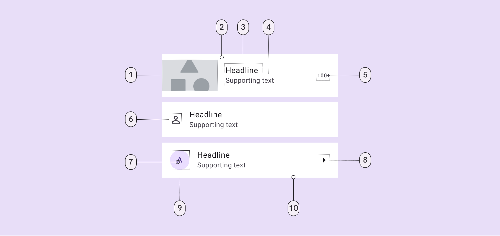
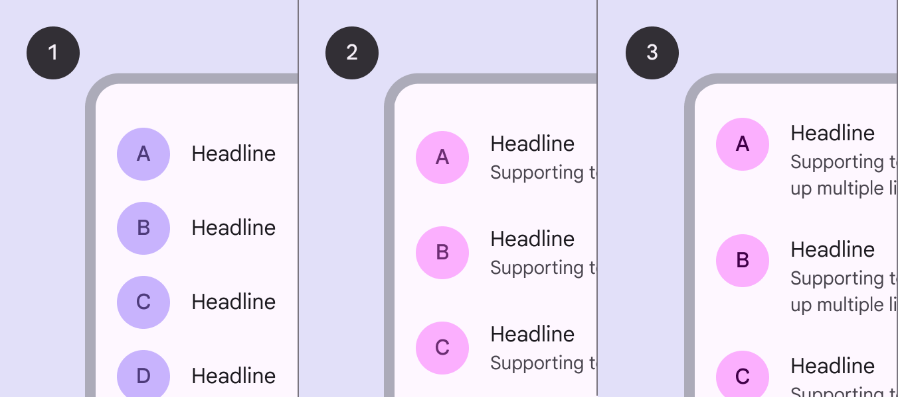
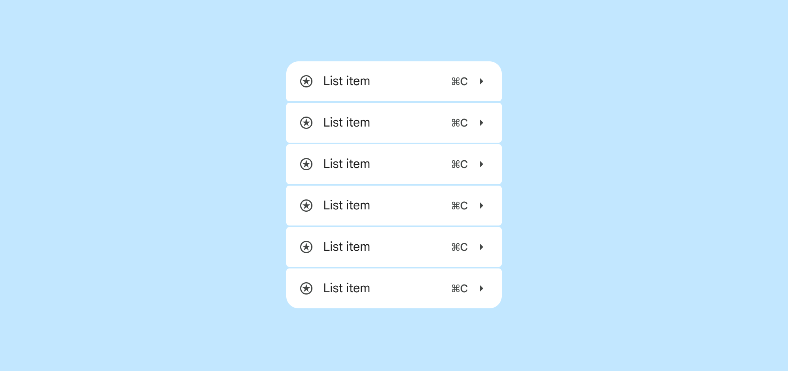
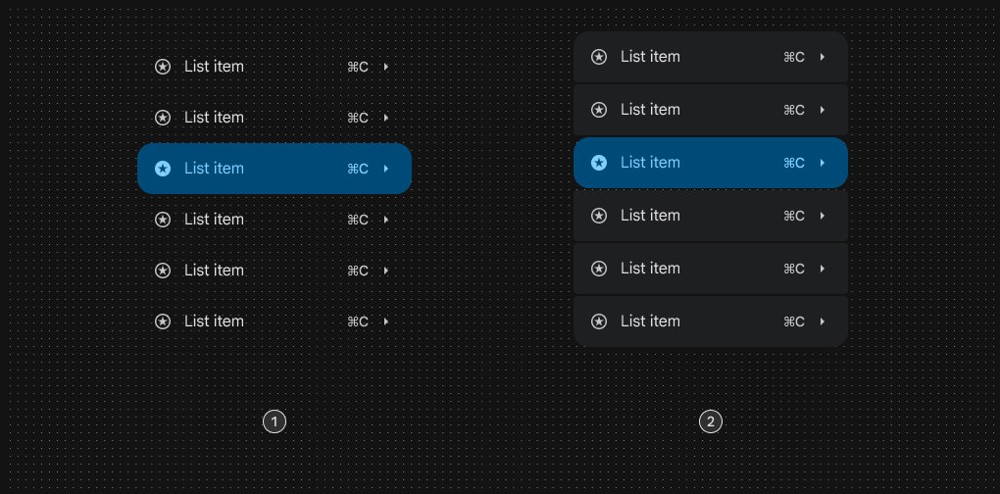
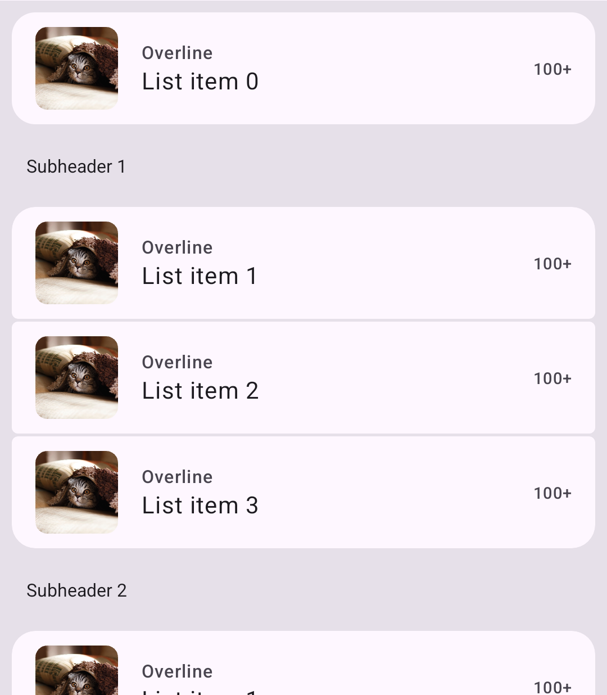
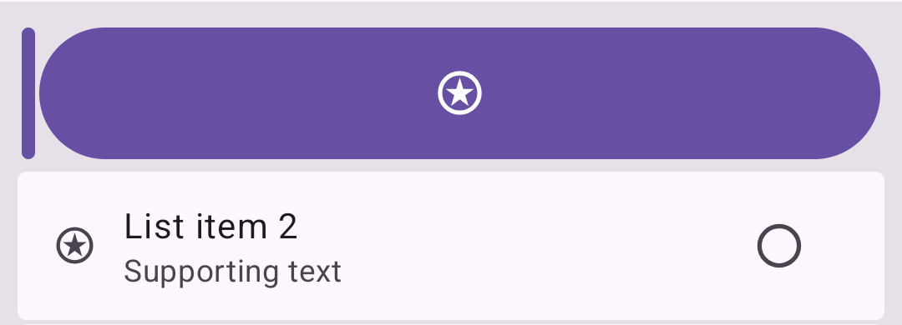

<!--docs:
title: "Lists"
layout: detail
section: components
excerpt: "Lists are continuous, vertical indexes of text or images."
iconId: list
path: /catalog/lists/
-->

# Lists

[Lists](https://m3.material.io/components/lists) are continuous, vertical
indexes of text or images.

 List items can have
supporting text and values

**Note:** Images use various dynamic color schemes.

## Design & API documentation

*   [Material 3 (M3) spec](https://m3.material.io/components/lists/overview/)
*   [API reference](https://developer.android.com/reference/com/google/android/material/listitem/package-summary)

## Anatomy



1.  Leading video thumbnail (optional)
2.  Container
3.  Headline
4.  Supporting text (optional)
5.  Trailing supporting text (optional)
6.  Leading icon (optional)
7.  Leading avatar label text (optional)
8.  Trailing icon (optional)
9.  Leading avatar container (optional)
10. Divider (optional)

More details on anatomy items in the
[component guidelines](https://m3.material.io/components/lists/guidelines#30e9b982-6d57-4163-8514-83761650db9f).

## Sizes of list items

List items come in three sizes:



1.  **One-line** list items contain a maximum of one line of text.
2.  **Two-line** list items contain a maximum of two lines of text.
3.  **Three-line** list items contains a maximum of three lines of text.

## Code implementation

It is encouraged to implement Lists with a `RecyclerView` with the design
guidelines in the
[Material 3 (M3) spec](https://m3.material.io/components/lists/overview/).

Example of a `ViewHolder` with a one-line list item:

```xml
<LinearLayout xmlns:android="http://schemas.android.com/apk/res/android"
    android:layout_width="match_parent"
    android:layout_height="wrap_content"
    android:background="?attr/selectableItemBackground"
    android:minHeight="?attr/minTouchTargetSize">

  <ImageView
      android:layout_width="wrap_content"
      android:layout_height="wrap_content"
      android:paddingTop="8dp"
      android:paddingBottom="8dp"
      android:paddingStart="16dp"
      android:paddingEnd="16dp"/>

  <TextView
      android:layout_width="match_parent"
      android:layout_height="wrap_content"
      android:layout_gravity="center_vertical"
      android:paddingEnd="16dp"
      android:maxLines="1"
      android:textAppearance="?attr/textAppearanceSubtitle1"/>

</LinearLayout>
```


*   Use lists to help users find a specific item and act on it
*   Order list items in logical ways (like alphabetical or numerical)
*   Keep items short and easy to scan
*   Show icons, text, and actions in a consistent format

## M3 Expressive



Expressive list styling introduces changes in list colors, shapes, and
functionalities.

There are 2 expressive list variants; standard and segmented:



1.  Standard
2.  Segmented

There are several new views and interfaces that can be used to implement
expressive lists.

`ListItemLayout` is a container for List content that is applied the following
`Drawable` position states:

- [android.R.attr.state_first](https://developer.android.com/reference/android/R.attr#state_first)
- [android.R.attr.state_middle](https://developer.android.com/reference/android/R.attr#state_middle)
- [android.R.attr.state_last](https://developer.android.com/reference/android/R.attr#state_last)
- [android.R.attr.state_single](https://developer.android.com/reference/android/R.attr#state_single)

Children of `ListItemLayout` that wish to be affected by the `ListItemLayout`'s
position state should duplicate the state through setting
`android:duplicateParentState=true`. The state should also be passed through to
child views that should be state-aware, such as for checked, pressed, or hovered
states. This can be done either through `android:duplicateParentState=true` or
manually.

`ListItemCardView` is recommended as a `ListItemLayout` child, as it supports
updating its shape / corners based on states.

You can update a `ListItemLayout`'s appearance according to its position in a
list by calling `ListItemLayout.updateAppearance(position, itemCount)`. If
using a `RecyclerView`, you can use `ListItemViewHolder` instead and call
`ListItemViewHolder.bind()` when binding the `ViewHolder` to do this
automatically.

Sample `RecyclerView.Adapter` code:

```kt
class ListsAdapter(private val items: List<Data>) :
    RecyclerView.Adapter<ListsAdapter.ListItemViewHolder>() {

    override fun onCreateViewHolder(parent: ViewGroup, position: Int): ListItemViewHolder {
        return ListItemViewHolder.create(parent, R.layout.list_item_viewholder)
    }

    override fun onBindViewHolder(viewHolder: ListItemViewHolder, position: Int) {
        viewHolder.bind(items[position])
        viewHolder.itemView.findViewById<TextView>(R.id.list_item_text)?.let { textView ->
          textView.text = items[position].text
        }
        ...
```

Sample `ViewHolder` code:

```xml
<com.google.android.material.listitem.ListItemLayout
  xmlns:android="http://schemas.android.com/apk/res/android"
  android:layout_width="match_parent"
  android:layout_height="wrap_content">
  <com.google.android.material.listitem.ListItemCardView
    android:layout_width="match_parent"
    android:layout_height="wrap_content"
    android:checkable="true">

    <LinearLayout
      android:orientation="horizontal"
      android:layout_width="match_parent"
      android:layout_height="wrap_content"
      android:gravity="center_vertical">

      <TextView
        android:id="@+id/list_item_text"
        android:layout_width="wrap_content"
        android:layout_height="wrap_content"
        android:duplicateParentState="true"/>

    </LinearLayout>
  </com.google.android.material.listitem.ListItemCardView>
</com.google.android.material.listitem.ListItemLayout>
```

You can also implement multi-section lists by calling
`ListItemLayout.updateAppearance(position, itemCount)` with `position` and
`itemCount` that is relative to the section instead of the whole list.

Eg. for the first item in a section of size 10, make sure you call
`ListItemLayout.updateAppearance(0, 10)`.



`ListItemLayout` also supports a swipe-to-reveal functionality via
`SwipeableListItem` and `RevealableListItem` interfaces. The `SwipeableListItem`
view must be a direct child of `ListItemLayout`, and have a `RevealableListItem`
sibling. `ListItemLayout` supports swiping the `SwipeableListItem` to fully
reveal the `RevealableListItem` sibling by default, and can optionally also
support being swiped its whole width.

We provide `ListItemCardView` as the default `SwipeableListItem` implementation,
and `ListItemRevealLayout` as the default `RevealableListItem`
implementation.


Sample `ViewHolder` code for swipe-to-reveal:

```xml
<com.google.android.material.listitem.ListItemLayout
  xmlns:android="http://schemas.android.com/apk/res/android"
  xmlns:app="http://schemas.android.com/apk/res-auto"
  xmlns:tools="http://schemas.android.com/tools"
  android:layout_width="match_parent"
  android:layout_height="wrap_content">

  <!-- SwipeableListItem -->
  <com.google.android.material.listitem.ListItemCardView
    android:id="@+id/cat_list_item_card_view"
    style="?attr/listItemCardViewSegmentedStyle"
    android:layout_width="match_parent"
    android:layout_height="wrap_content"
    android:checkable="true"
    android:clickable="true"
    android:focusable="true">

    <LinearLayout
      android:layout_width="match_parent"
      android:layout_height="wrap_content"
      android:gravity="center_vertical"
      android:orientation="horizontal"
      tools:ignore="UseCompoundDrawables">

      <ImageView
        style="@style/Widget.Material3.ImageView.ListItem.LeadingIcon"
        android:layout_width="20dp"
        android:layout_height="20dp"
        android:contentDescription="@string/icon_content_description"
        app:srcCompat="@drawable/ic_star_icon_checkable_24px" />

      <LinearLayout
        android:layout_width="0dp"
        android:layout_height="wrap_content"
        android:layout_marginStart="12dp"
        android:layout_weight="1"
        android:orientation="vertical">

        <TextView
          style="@style/Widget.Material3.TextView.ListItem.LabelText"
          android:layout_width="wrap_content"
          android:layout_height="wrap_content" />

        <TextView
          style="@style/Widget.Material3.TextView.ListItem.SupportingText"
          android:layout_width="wrap_content"
          android:layout_height="wrap_content" />

      </LinearLayout>

      <com.google.android.material.checkbox.MaterialCheckBox
        style="@style/Widget.Material3.Checkbox.ListItem"
        android:layout_width="wrap_content"
        android:layout_height="wrap_content"
        android:layout_marginStart="12dp" />

    </LinearLayout>
  </com.google.android.material.listitem.ListItemCardView>

  <!-- RevealableListItem -->
  <com.google.android.material.listitem.ListItemRevealLayout
    android:layout_width="wrap_content"
    android:layout_height="match_parent"
    app:primaryActionSwipeMode="indirect">

    <com.google.android.material.button.MaterialButton
      style="?attr/materialIconButtonFilledStyle"
      android:layout_width="64dp"
      android:layout_height="match_parent"
      android:layout_marginStart="2dp"
      android:layout_marginEnd="2dp"
      app:icon="@drawable/ic_add_24px" />

    <com.google.android.material.button.MaterialButton
      style="?attr/materialIconButtonFilledStyle"
      android:layout_width="64dp"
      android:layout_height="match_parent"
      android:layout_marginStart="2dp"
      android:layout_marginEnd="2dp"
      app:icon="@drawable/ic_add_24px" />

  </com.google.android.material.listitem.ListItemRevealLayout>
</com.google.android.material.listitem.ListItemLayout>
```

You can use `app:primaryActionSwipeMode` on `ListItemRevealLayout` to control
the behavior of swiping to the primary action. Only use
`app:primaryActionSwipeMode=direct` if there is only a single action
representing the primary action in the `ListItemRevealLayout` as a primary
action swipe mode of `direct` will swipe directly to the primary action swipe
state.

If `app:primaryActionSwipeMode=indirect`, swiping from a closed state will swipe
to the open swipe state first, revealing the actions in the
`ListItemRevealLayout` at their intrinsic size first before users can swipe to
the primary action swipe state.

If swipe to trigger primary action is enabled at all
(`app:primaryActionSwipeMode=direct` or `app:primaryActionSwipeMode=indirect`),
make sure to implement the primary action to be triggered through a
`SwipeStateCallback`. The primary action should correspond to the behavior of
the first view in the `ListItemRevealLayout` if it is start-aligned, or the last
view if it is end-aligned.

```kt
listItemCardView.addOnSwipeStateChangedCallback { newState ->
  if (newState == STATE_SWIPE_PRIMARY_ACTION) {
    // do primary action
    listItemLayout.setSwipeState(SwipeableListItem.STATE_CLOSED)
  }
}
```



Do not leave the `ListItemLayout` in the fully swiped state; if using
`ListItemRevealLayout`, child views are shrunk and do not adhere to the min
touch size. It is meant to visually indicate the primary action is triggered,
and the swipe state should either be reset or the `ListItemLayout` should be
dismissed.

Ensure that the primary action that is triggered corresponds to the action
represented by the growing element in the `ListItemRevealLayout`. This is
important for clarity and also for a11y, as in some cases (ie.
`app:primarySwipeActionSwipeMode=direct`) the visual element representing the
primary action will only be visible until the swipe state is reset or
`ListItemLayout` should be dismissed.

### Key properties

#### ListItemCardView attributes

Element                                      | Attribute                         | Related methods                                                        | Default value
-------------------------------------------- | --------------------------------- | ---------------------------------------------------------------------- | -------------
**Color**                                    | `app:cardBackgroundColor`         | `setCardBackgroundColor`<br/>`getCardBackgroundColor`                  | `@color/transparent` (standard style)</br>`?attr/colorSurfaceBright` (segmented style) </br> `?attr/colorSecondaryContainer` (selected)
**Shape**                                    | `app:shapeAppearance`             | `setShapeAppearanceModel`<br/>`getShapeAppearanceModel`                | `?attr/listItemShapeAppearanceSingle` </br> `?attr/listItemShapeAppearanceFirst` </br> `?attr/listItemShapeAppearanceMiddle` </br> `?attr/listItemShapeAppearanceLast`
**Ripple color**                             | `app:rippleColor`                 | `setRippleColor`<br/>`setRippleColorResource`<br/>`getRippleColor`     | `?attr/colorOnSurface` at 10% opacity (8% when hovered)
**Swipe enabled**                            | `app:swipeEnabled`                | `setSwipeEnabled`<br/>`isSwipeEnabled`                                 | `true`

#### ListItemRevealLayout attributes

Element                       | Attribute                    | Related methods                                             | Default value
----------------------------- | ---------------------------- | ----------------------------------------------------------- | -------------
**Min child size**            | `app:minRevealedChildWidth`  | `setMinChildWidth`<br/>`getMinChildWidth`                   | `6dp`
**Primary Action Swipe Mode** | `app:primaryActionSwipeMode` | `setPrimaryActionSwipeMode`<br/>`getPrimaryActionSwipeMode` | `disabled`

### Accessibility

#### Decorative elements inside List items

Any elements of the list item that are purely decorative should not receive
separate focus from the list item, or be announced by a screen reader like
Talkback. An element of a list can be decorative if it does not have a separate
click action from the list item, and if it does not provide any additional
information for the list item that should be announced.

You can set the `android:focusable` and `android:importantForAccessibility`
attributes to control whether or not these elements are focused and announced by
screenreaders. For example:

```xml
      <com.google.android.material.imageview.ShapeableImageView
        style="@style/Widget.Material3.ShapeableImageView.ListItem.LeadingImage"
        android:layout_height="56dp"
        android:layout_width="56dp"
        app:srcCompat="@drawable/cat_image"
        android:focusable="false"
        android:importantForAccessibility="no"
        android:scaleType="centerCrop"/>
```

If your list item has any checkable components that are decorative (ie. they are
sync'd with the checked state of the list item and are purely a visual
indicator) you can use the provided list-specific styles to skip view focus
and a11y actions on these elements:

- `Widget.Material3.Checkbox.ListItem`
- `Widget.Material3.RadioButton.ListItem`
- `Widget.Material3.Switch.ListItem`

For example, if you are using a `MaterialCheckbox`, use the style
`Widget.Material3.Checkbox.ListItem`. Do *not* use this style for any elements
that should have a separate state from the list item, eg. if there are multiple
checkable elements or if the element's checked state should be separate from the
checked state of the list item.

```xml
      <com.google.android.material.checkbox.MaterialCheckBox
        style="@style/Widget.Material3.Checkbox.ListItem"
        android:layout_width="wrap_content"
        android:layout_height="wrap_content"
        android:layout_marginStart="12dp" />
```

#### Expandable List items

If your list item is expandable, it must announce its collapsed or expanded
state when read by screenreaders like Talkback. You can achieve this by setting
an `AccessibilityDelegate` on the list item.

The following code snippet demonstrates how to add `ACTION_EXPAND` and
`ACTION_COLLAPSE` to the accessibility node. Remember to also implement the
expand/collapse action functionalities appropriately when the accessibility
action is performed.

```kt
listItemCardView.accessibilityDelegate = object : View.AccessibilityDelegate() {
    override fun onInitializeAccessibilityNodeInfo(host: View, info: AccessibilityNodeInfo) {
        super.onInitializeAccessibilityNodeInfo(host, info)
        if (data.expanded) {
            info.addAction(AccessibilityNodeInfo.AccessibilityAction.ACTION_COLLAPSE)
        } else {
            info.addAction(AccessibilityNodeInfo.AccessibilityAction.ACTION_EXPAND)
        }
    }

    override fun performAccessibilityAction(host: View, action: Int, args: Bundle?): Boolean {
        return when (action) {
            AccessibilityNodeInfo.AccessibilityAction.ACTION_COLLAPSE.id -> {
              collapse()
              true
            }
            AccessibilityNodeInfo.AccessibilityAction.ACTION_EXPAND.id -> {
                expand()
                true
            }
            else -> super.performAccessibilityAction(host, action, args)
        }
    }
}
```
