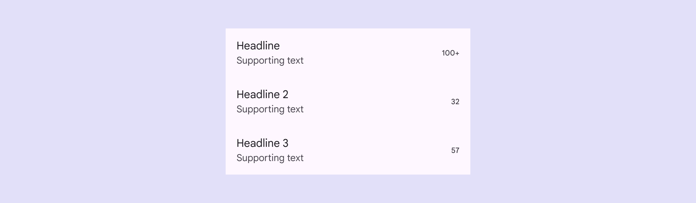

<!--docs:
title: "Lists"
layout: detail
section: components
excerpt: "Lists are continuous, vertical indexes of text or images."
iconId: list
path: /catalog/lists/
-->

# Lists

[Lists](https://m3.material.io/components/lists) are continuous, vertical
indexes of text or images.

 List items can have
supporting text and values

**Note:** Images use various dynamic color schemes.

## Design & API documentation

*   [Material 3 (M3) spec](https://m3.material.io/components/lists/overview/)
*   [API reference](https://developer.android.com/reference/com/google/android/material/listitem/package-summary)

## Anatomy


1.  Leading video thumbnail (optional)
2.  Container
3.  Headline
4.  Supporting text (optional)
5.  Trailing supporting text (optional)
6.  Leading icon (optional)
7.  Leading avatar label text (optional)
8.  Trailing icon (optional)
9.  Leading avatar container (optional)
10. Divider (optional)

More details on anatomy items in the
[component guidelines](https://m3.material.io/components/lists/guidelines#30e9b982-6d57-4163-8514-83761650db9f).

## Sizes of list items

List items come in three sizes:


1.  **One-line** list items contain a maximum of one line of text.
2.  **Two-line** list items contain a maximum of two lines of text.
3.  **Three-line** list items contains a maximum of three lines of text.

## Code implementation

It is encouraged to implement Lists with a `RecyclerView` with the design
guidelines in the
[Material 3 (M3) spec](https://m3.material.io/components/lists/overview/).

Example of a `ViewHolder` with a one-line list item:

```xml
<LinearLayout xmlns:android="http://schemas.android.com/apk/res/android"
    android:layout_width="match_parent"
    android:layout_height="wrap_content"
    android:background="?attr/selectableItemBackground"
    android:minHeight="?attr/minTouchTargetSize">

  <ImageView
      android:layout_width="wrap_content"
      android:layout_height="wrap_content"
      android:paddingTop="8dp"
      android:paddingBottom="8dp"
      android:paddingStart="16dp"
      android:paddingEnd="16dp"/>

  <TextView
      android:layout_width="match_parent"
      android:layout_height="wrap_content"
      android:layout_gravity="center_vertical"
      android:paddingEnd="16dp"
      android:maxLines="1"
      android:textAppearance="?attr/textAppearanceSubtitle1"/>

</LinearLayout>
```



*   Use lists to help users find a specific item and act on it
*   Order list items in logical ways (like alphabetical or numerical)
*   Keep items short and easy to scan
*   Show icons, text, and actions in a consistent format

## M3 Expressive

An expressive List variant is in progress and is available for use through
a new `ListItemLayout`.


`ListItemLayout` is a container for List content that is applied the following
`Drawable` position states:

- [android.R.attr.state_first](https://developer.android.com/reference/android/R.attr#state_first)
- [android.R.attr.state_middle](https://developer.android.com/reference/android/R.attr#state_middle)
- [android.R.attr.state_last](https://developer.android.com/reference/android/R.attr#state_last)
- [android.R.attr.state_single](https://developer.android.com/reference/android/R.attr#state_single)

Children of `ListItemLayout` that wish to be affected by the `ListItemLayout`'s
position state should duplicate the state through setting
`android:duplicateParentState=true`.

`MaterialCardView` is recommended as a `ListItemLayout` child, as it supports
updating its shape / corners based on states.

You can update a `ListItemLayout`'s appearance according to its position in a
list by calling `ListItemLayout.updateAppearance(position, itemCount)`. If
using a `RecyclerView`, you can use `ListItemViewHolder` instead and call
`ListItemViewHolder.bind()` when binding the `ViewHolder` to do this
automatically.

Sample `RecyclerView.Adapter` code:

```kt
class ListsAdapter(private val items: List<Data>) :
    RecyclerView.Adapter<ListsAdapter.ListItemViewHolder>() {

    override fun onCreateViewHolder(parent: ViewGroup, position: Int): ListItemViewHolder {
        return ListItemViewHolder.create(parent, R.layout.list_item_viewholder)
    }

    override fun onBindViewHolder(viewHolder: ListItemViewHolder, position: Int) {
        viewHolder.bind(items[position])
        viewHolder.itemView.findViewById<TextView>(R.id.list_item_text)?.let { textView ->
          textView.text = items[position].text
        }
        ...
```

Sample `ViewHolder` code:

```xml
<com.google.android.material.listitem.ListItemLayout
  xmlns:android="http://schemas.android.com/apk/res/android"
  android:layout_width="match_parent"
  android:layout_height="wrap_content">
  <com.google.android.material.card.MaterialCardView
    android:layout_width="match_parent"
    android:layout_height="wrap_content"
    android:checkable="true">

    <LinearLayout
      android:orientation="horizontal"
      android:layout_width="match_parent"
      android:layout_height="wrap_content"
      android:gravity="center_vertical">

      <TextView
        android:id="@+id/list_item_text"
        android:layout_width="wrap_content"
        android:layout_height="wrap_content"/>

    </LinearLayout>
  </com.google.android.material.card.MaterialCardView>
</com.google.android.material.listitem.ListItemLayout>
```

You can also implement multi-section lists by calling
`ListItemLayout.updateAppearance(position, itemCount)` with `position` and
`itemCount` that is relative to the section instead of the whole list.

Eg. for the first item in a section of size 10, make sure you call
`ListItemLayout.updateAppearance(0, 10)`.


