<!--docs:
title: "Menus"
layout: detail
section: components
excerpt: "Menus display a list of choices on temporary surfaces."
iconId: menu
path: /catalog/menus/
-->

# Menus

[Menus](https://m3.material.io/components/menus/overview) display a list of choices on
temporary surfaces. There are two variants of menus.

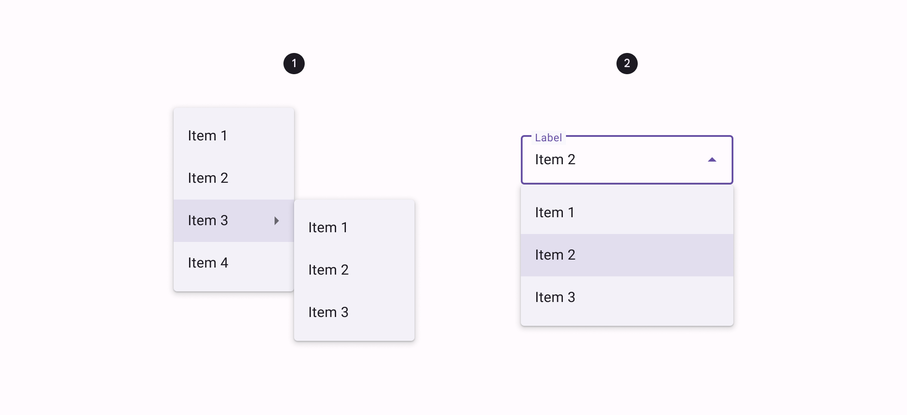

1. Dropdown menu
2. Exposed dropdown menu

Menus allow users to make a selection from multiple options. They appear when
users interact with a button, action, or other control.They are less prominent
and take up less space than selection controls, such as a set of radio
buttons.

**Note:** Images use various dynamic color schemes.

## Design & API documentation

*   [Material 3 (M3) spec](https://m3.material.io/components/menus/overview)
*   [API reference](https://developer.android.com/reference/android/view/Menu)

## Anatomy

#### Dropdown menu

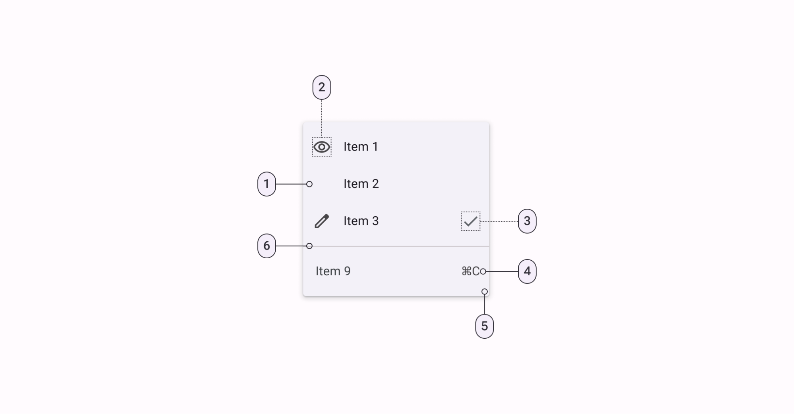

1.  List item
2.  Leading icon
3.  Trailing icon
4.  Trailing text
5.  Container
6.  Divider

#### Exposed dropdown menu

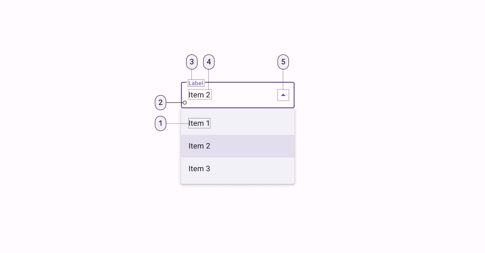

1.  Text
2.  Container
3.  Label
4.  Selection/Input text
5.  Trailing icon

More details on anatomy items in the [component guidelines](https://m3.material.io/components/menus/guidelines#732c1ddd-e298-4891-a1da-6adfa84da279).

## Key properties

### Dropdown menu

#### Container attributes

Element        | Attribute                     | Related method(s) | Default value
-------------- | ----------------------------- | ----------------- | -------------
**Background** | `android:popupMenuBackground` | N/A               | `?attr/popupMenuBackground`
**Color**      | N/A                           | N/A               | `?attr/colorSurfaceContainer`
**Elevation**  | `android:popupElevation`      | N/A               | `3dp`

#### Text attributes

Element        | Attribute                                                                     | Related method(s)                                                  | Default value
-------------- | ----------------------------------------------------------------------------- | ------------------------------------------------------------------ | -------------
**Text label** | `android:title`                                                               | `getMenu().add`<br/>`getMenu().addSubMenu`<br/>`getMenu().getItem` | N/A
**Typography** | `?attr/textAppearanceLargePopupMenu`<br/>`?attr/textAppearanceSmallPopupMenu` | N/A                                                                | `?attr/textAppearanceBodyLarge`

#### Styles

Element                     | Theme attribute              | Default value
--------------------------- | -------------------------------- | -----------------
**Popup menus**             | `?attr/popupMenuStyle`           | `@style/Widget.Material3.PopupMenu`
**List popup window style** | `?attr/listPopupWindowStyle`     | `@style/Widget.Material3.PopupMenu.ListPopupWindow`
**Context menus**           | `?android:contextPopupMenuStyle` | `@style/Widget.Material3.PopupMenu.ContextMenu`
**Overflow menus**          | `?attr/actionOverflowMenuStyle`  | `@style/Widget.Material3.PopupMenu.Overflow`

For the full list, see
[styles](https://github.com/material-components/material-components-android/tree/master/lib/java/com/google/android/material/menu/res/values/styles.xml)
and
[attrs](https://github.com/material-components/material-components-android/tree/master/lib/java/com/google/android/material/menu/res/values/attrs.xml).

### Exposed dropdown menu

#### `TextInputLayout` attributes (container, label, trailing icon)

For all attributes that apply to the `TextInputLayout`, see the
[TextInputLayout documentation](TextField.md).

#### `MaterialAutoCompleteTextView` attributes (input text, dropdown menu)

Element                                   | Attribute                                                           | Related method(s)                                                                                   | Default value
----------------------------------------- | ------------------------------------------------------------------- | --------------------------------------------------------------------------------------------------- | -------------
**Input text**                            | `android:text`                                                      | `setText`<br/>`getText`                                                                             | `@null`
**Typography**                            | `android:textAppearance`                                            | `setTextAppearance`                                                                                 | `?attr/textAppearanceBodyLarge`
**Input accepted**                        | `android:inputType`                                                 | `N/A`                                                                                               | framework's default
**Input text color**                      | `android:textColor`                                                 | `setTextColor`<br/>`getTextColors`<br/>`getCurrentTextColor`                                        | `?android:textColorPrimary`
**Cursor color**                          | N/A (color comes from the theme attr `?attr/colorControlActivated`) | N/A                                                                                                 | `?attr/colorPrimary`
**Dropdown menu<br/>container color**     | `app:dropDownBackgroundTint`                                        | `setDropDownBackgroundTint`<br/>`setDropDownBackgroundTintList`<br/>`getDropDownBackgroundTintList` | `colorSurfaceContainer`
**Dropdown menu elevation**               | `android:popupElevation`                                            | `getPopupElevation`                                                                                 | `3dp`
**Simple items**                          | `app:simpleItems`                                                   | `setSimpleItems`                                                                                    | `null`
**Simple item layout**                    | `app:simpleItemLayout`                                              | N/A                                                                                                 | `@layout/m3_auto_complete_simple_item`
**Selected simple item color**            | `app:simpleItemSelectedColor`                                       | `setSimpleItemSelectedColor`<br/>`getSimpleItemSelectedColor`                                       | `?attr/colorSurfaceContainerHighest`
**Selected simple item<br/>ripple color** | `app:simpleItemSelectedRippleColor`                                 | `setSimpleItemSelectedRippleColor`<br/>`getSimpleItemSelectedRippleColor`                           | `@color/m3_simple_item_ripple_color`

#### Styles

Element            | Style | Theme attribute
------------------ | ------|-----------|
**Filled style**   | `Widget.Material3.TextInputLayout.FilledBox.ExposedDropdownMenu`|`?attr/textInputFilledExposedDropdownMenuStyle`
**Outlined style** | `Widget.Material3.TextInputLayout.OutlinedBox.ExposedDropdownMenu`|`?attr/textInputOutlinedExposedDropdownMenuStyle`
**Filled dense**   | `Widget.Material3.TextInputLayout.FilledBox.Dense.ExposedDropdownMenu`|N/A
**Outlined dense** | `Widget.Material3.TextInputLayout.OutlinedBox.Dense.ExposedDropdownMenu`|N/A

Default style theme attribute: `?attr/textInputStyle`

For the full list, see
[styles](https://github.com/material-components/material-components-android/tree/master/lib/java/com/google/android/material/textfield/res/values/styles.xml)
and
[attrs](https://github.com/material-components/material-components-android/tree/master/lib/java/com/google/android/material/textfield/res/values/attrs.xml).

## Variants of menus

### Dropdown menus

Dropdown menus display a list of options, triggered by an icon, button, or
action. Their placement varies based on the element that opens them.

API and source code:

*   `Menu`
    *   [Class definition](https://developer.android.com/reference/android/view/Menu)
*   `MenuInflater`
    *   [Class definition](https://developer.android.com/reference/android/view/MenuInflater)
*   `ContextMenu`
    *   [Class definition](https://developer.android.com/reference/android/view/ContextMenu)
*   `PopupMenu`
    *   [Class definition](https://developer.android.com/reference/androidx/appcompat/widget/PopupMenu)
*   `ListPopupWindow`
    *   [Class definition](https://developer.android.com/reference/androidx/appcompat/widget/ListPopupWindow)

#### Dropdown menu examples

<details>
  <summary><h5>Overflow menus</h5></summary>

The following example shows an overflow menu.

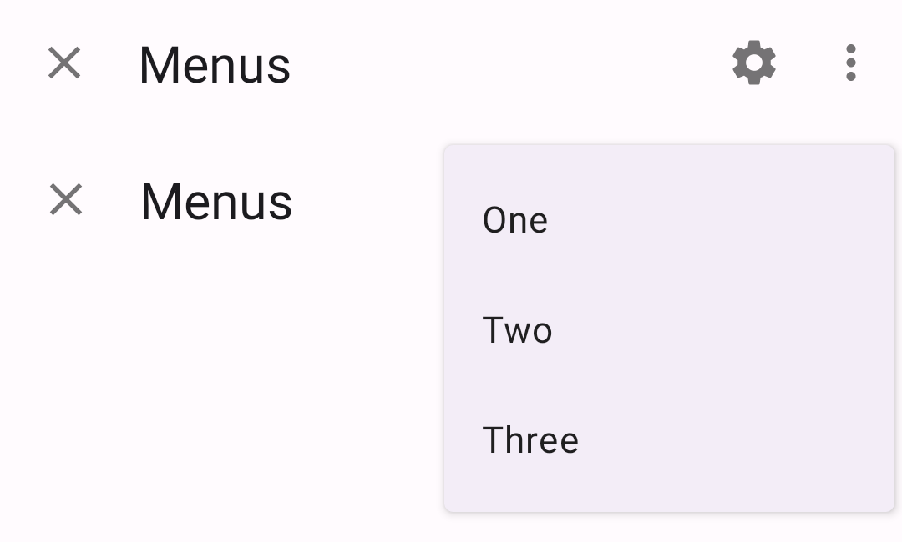

In code:

```kt
override fun onCreateOptionsMenu(menu: Menu): Boolean {
    val inflater: MenuInflater = menuInflater
    inflater.inflate(R.menu.overflow_menu, menu)
    return true
}
```

In `res/menu/overflow_menu.xml`:

```xml
<menu xmlns:android="http://schemas.android.com/apk/res/android">
    <item android:id="@+id/option_1"
          android:title="@string/option_1" />
    <item android:id="@+id/option_2"
          android:title="@string/option_2" />
    <item android:id="@+id/option_3"
          android:title="@string/option_3" />
</menu>
```

</details>

<details>
  <summary><h5>Context menus</h5></summary>

The following example shows a context menu that appears when a `TextView` is
pressed for a designated amount of time.

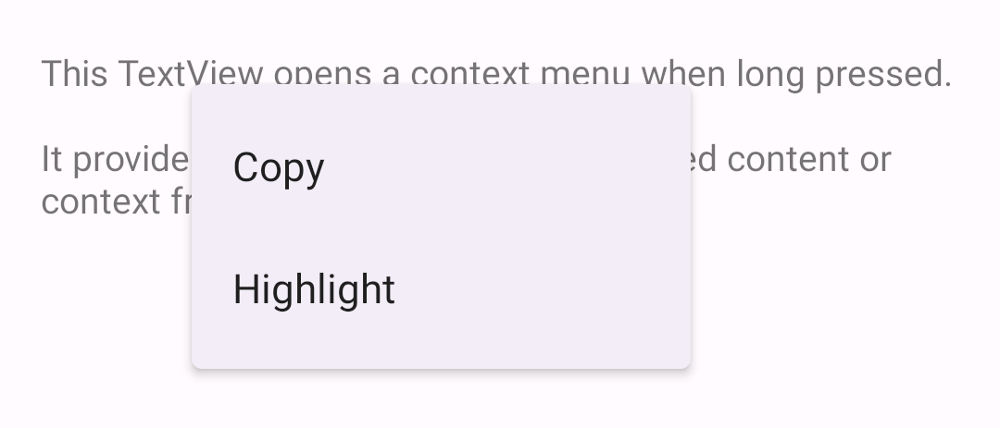

In code:

```kt
override fun onCreate(savedInstanceState: Bundle?) {
    ...
    val contextMenuTextView = view.findViewById<TextView>(R.id.context_menu_tv)
    // Register context menu for TextView
    registerForContextMenu(contextMenuTextView)
}

override fun onCreateContextMenu(menu: ContextMenu, v: View, menuInfo: ContextMenu.ContextMenuInfo?) {
    val contextMenuTextView = v as TextView
    val context = context
    // Add menu items via menu.add
    menu.add(R.string.option_1)
        .setOnMenuItemClickListener { item: MenuItem? ->
            // Respond to item click.
      }
    menu.add(R.string.option_2)
        .setOnMenuItemClickListener { item: MenuItem? ->
            // Respond to item click.
      }
}

override fun onContextMenuClosed(menu: Menu) {
    // Respond to context menu being closed.
}
```

In the layout:

```xml
<TextView
    android:id="@+id/context_menu_tv"
    android:layout_width="match_parent"
    android:layout_height="wrap_content"
    android:padding="16dp"
    android:text="@string/menu_context_menu_description"/>
```

Alternatively, you can inflate a context menu in `onCreateContextMenu` (as with
the overflow menu):

```kt
override fun onCreateContextMenu(menu: ContextMenu, v: View, menuInfo: ContextMenu.ContextMenuInfo?) {
  super.onCreateContextMenu(menu, v, menuInfo)
  val inflater: MenuInflater = menuInflater
  inflater.inflate(R.menu.context_menu, menu)
}

// Then, to handle clicks:
override fun onContextItemSelected(item: MenuItem): Boolean {
  val info = item.menuInfo as AdapterView.AdapterContextMenuInfo
  return when (item.itemId) {
    R.id.option_1 -> {
      // Respond to context menu item 1 click.
      true
    }
    R.id.option_2 -> {
      // Respond to context menu item 2 click.
      true
    }
    else -> super.onContextItemSelected(item)
  }
}
```

with a `res/menu/context_menu.xml`:

```xml
<menu xmlns:android="http://schemas.android.com/apk/res/android">
    <item android:id="@+id/option_1"
          android:title="@string/option_1" />
    <item android:id="@+id/option_2"
          android:title="@string/option_2" />
</menu>
```

</details>

<details>
  <summary><h5>Popup menus</h5></summary>

The following example shows a popup menu that displays when a button is clicked.

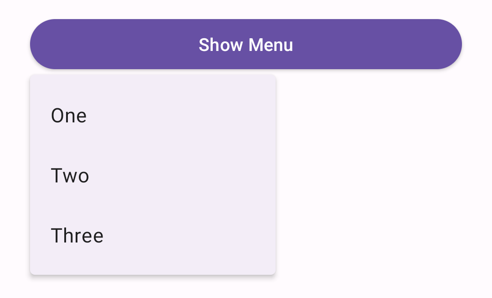

In code:

```kt
override fun onCreate(savedInstanceState: Bundle?) {
    ...
    val button = view.findViewById<Button>(R.id.menu_button)
    button.setOnClickListener { v: View ->
        showMenu(v, R.menu.popup_menu)
    }
}

private fun showMenu(v: View, @MenuRes menuRes: Int) {
    val popup = PopupMenu(context!!, v)
    popup.menuInflater.inflate(menuRes, popup.menu)

    popup.setOnMenuItemClickListener { menuItem: MenuItem ->
        // Respond to menu item click.
    }
    popup.setOnDismissListener {
        // Respond to popup being dismissed.
    }
    // Show the popup menu.
    popup.show()
}
```

In the layout:

```xml
<Button
    android:id="@+id/menu_button"
    android:layout_width="match_parent"
    android:layout_height="wrap_content"
    android:text="@string/show_menu"/>
```

In `res/menu/popup_menu.xml`:

```xml
<menu xmlns:android="http://schemas.android.com/apk/res/android">
    <item android:id="@+id/option_1"
          android:title="@string/option_1" />
    <item android:id="@+id/option_2"
          android:title="@string/option_2" />
    <item android:id="@+id/option_3"
          android:title="@string/option_3" />
</menu>
```

**Adding icons to popup menus**

Currently, there is no public API to add icons to popup menus. The following
workaround is for API 21+, and uses library-only APIs, and is not guaranteed to
work in future versions.

The following example shows a popup menu with icons.

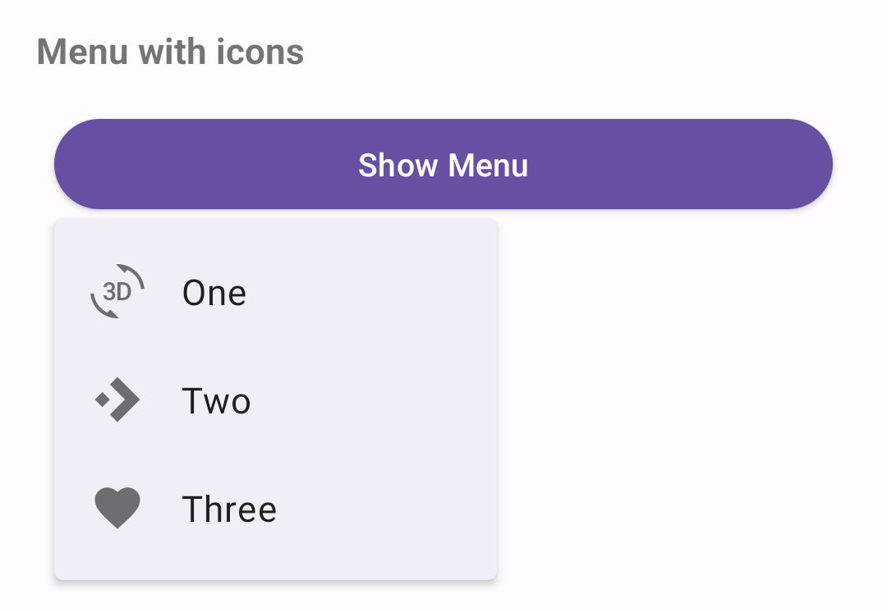

In code:

```kt
//In the showMenu function from the previous example:
private fun showMenu(v: View, @MenuRes menuRes: Int) {
    val popup = PopupMenu(context!!, v)
    popup.menuInflater.inflate(menuRes, popup.menu)
    ...
    if (popup.menu is MenuBuilder) {
        val menuBuilder = popup.menu as MenuBuilder
        menuBuilder.setOptionalIconsVisible(true)
        for (item in menuBuilder.visibleItems) {
            val iconMarginPx =
                TypedValue.applyDimension(
                    TypedValue.COMPLEX_UNIT_DIP, ICON_MARGIN.toFloat(), resources.displayMetrics)
                .toInt()
            if (item.icon != null) {
              if (Build.VERSION.SDK_INT > Build.VERSION_CODES.LOLLIPOP) {
                  item.icon = InsetDrawable(item.icon, iconMarginPx, 0, iconMarginPx,0)
              } else {
                  item.icon =
                      object : InsetDrawable(item.icon, iconMarginPx, 0, iconMarginPx, 0) {
                          override fun getIntrinsicWidth(): Int {
                              return intrinsicHeight + iconMarginPx + iconMarginPx
                      }
                }
              }
          }
      }
    }
    ...
    popup.show()
}
```

In `res/menu/popup_menu.xml`:

```xml
<menu xmlns:android="http://schemas.android.com/apk/res/android">
    <item android:id="@+id/option_1"
          android:icon="@drawable/ic_3d_rotation_24dp"
          android:title="@string/option_1" />
    <item android:id="@+id/option_2"
          android:icon="@drawable/ic_accelerator_24dp"
          android:title="@string/option_2" />
    <item android:id="@+id/option_3"
          android:icon="@drawable/ic_favorite_24dp"
          android:title="@string/option_3" />
</menu>
```
</details>

<details>
  <summary><h5>List popup window menus</h5></summary>

The following example shows a list popup window menu that appears when a button
is clicked.

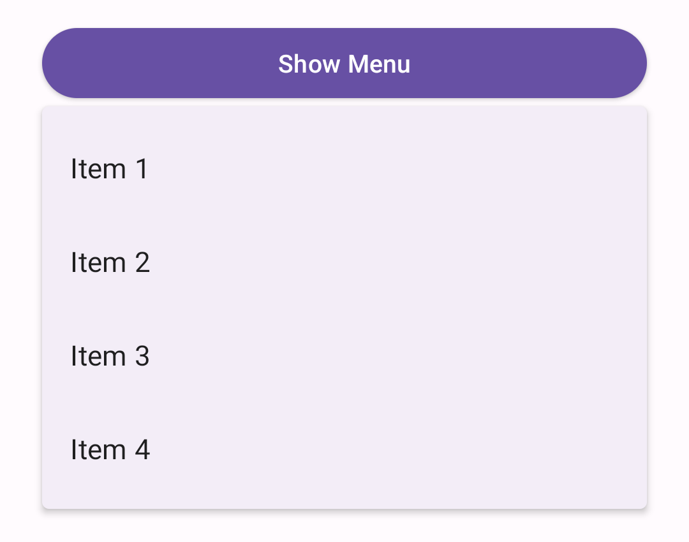

In code:

```kt
val listPopupWindowButton = view.findViewById<Button>(R.id.list_popup_button)
val listPopupWindow = ListPopupWindow(context!!, null, R.attr.listPopupWindowStyle)

// Set button as the list popup's anchor
listPopupWindow.anchorView = listPopupWindowButton

// Set list popup's content
val items = listOf("Item 1", "Item 2", "Item 3", "Item 4")
val adapter = ArrayAdapter(requireContext(), R.layout.list_popup_window_item, items)
listPopupWindow.setAdapter(adapter)

// Set list popup's item click listener
listPopupWindow.setOnItemClickListener { parent: AdapterView<*>?, view: View?, position: Int, id: Long ->
  // Respond to list popup window item click.

  // Dismiss popup.
  listPopupWindow.dismiss()
}

// Show list popup window on button click.
listPopupWindowButton.setOnClickListener { v: View? -> listPopupWindow.show() }
```

In the layout:

```xml
<Button
    android:id="@+id/list_popup_button"
    android:layout_width="match_parent"
    android:layout_height="wrap_content"
    android:text="@string/show_menu"/>
```

In the item layout `res/layout/list_popup_window_item.xml`:

```xml
<TextView
    xmlns:android="http://schemas.android.com/apk/res/android"
    android:layout_width="match_parent"
    android:layout_height="wrap_content"
    android:padding="16dp"
    android:ellipsize="end"
    android:maxLines="1"
    android:textAppearance="?attr/textAppearanceBodyLarge"
/>
```
</details>

### Exposed dropdown menu

Exposed dropdown menus display the currently selected menu item above a list of
options. Some variations can accept user-entered input.

**Note:** The exposed dropdown menu is implemented through the
`TextInputLayout`. For detailed information on
[Material text fields](https://material.io/design/components/text-fields.html)
and their usage, see the [TextInputLayout documentation](TextField.md).

API and source code:

*   `TextInputLayout`
    *   [Class definition](https://developer.android.com/reference/com/google/android/material/textfield/TextInputLayout)
    *   [Class source](https://github.com/material-components/material-components-android/tree/master/lib/java/com/google/android/material/textfield/TextInputLayout.java)
*   `AutoCompleteTextView`
    *   [Class definition](https://developer.android.com/reference/android/widget/AutoCompleteTextView)
*   `MaterialAutoCompleteTextView`
    *   [Class definition](https://developer.android.com/reference/com/google/android/material/textfield/MaterialAutoCompleteTextView)
    *   [Class source](https://github.com/material-components/material-components-android/tree/master/lib/java/com/google/android/material/textfield/MaterialAutoCompleteTextView.java)

The exposed dropdown menu is an `AutoCompleteTextView` within a
`TextInputLayout`. It displays a dropdown menu below a text field.

**Note:** `MaterialComponentsViewInflater` auto-inflates
`<AutoCompleteTextView>` to
`<com.google.android.material.textfield.MaterialAutoCompleteTextView>` when
using `Theme.Material3.*` themes.

The following is an example of a filled exposed dropdown menu:

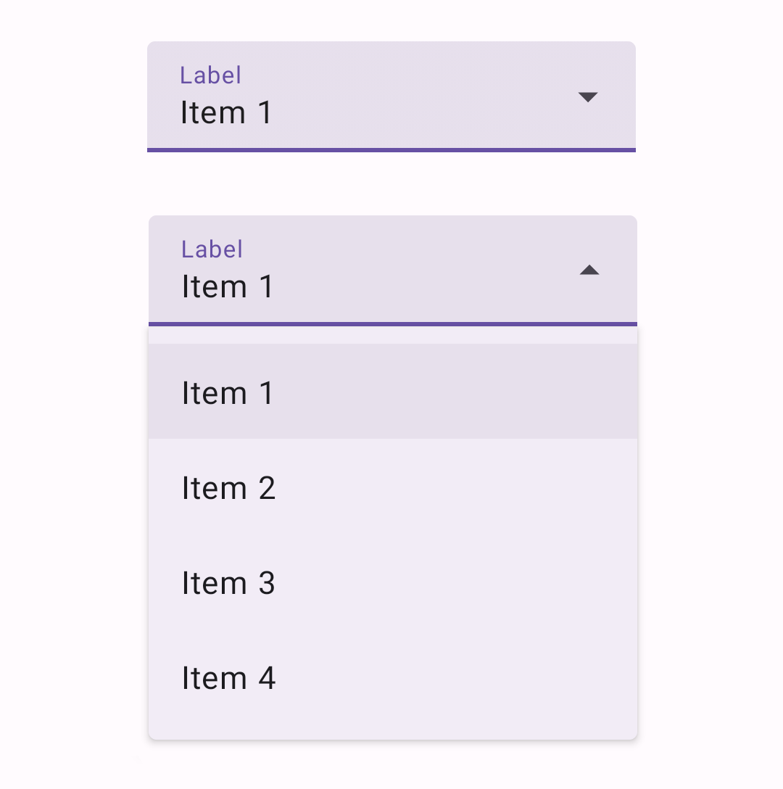

In the layout:

```xml
<com.google.android.material.textfield.TextInputLayout
    android:id="@+id/menu"
    style="?attr/materialButtonOutlinedStyle"
    android:layout_width="match_parent"
    android:layout_height="wrap_content"
    android:hint="@string/label">

    <AutoCompleteTextView
        android:layout_width="match_parent"
        android:layout_height="wrap_content"
        android:inputType="none"
        app:simpleItems="@array/simple_items"
    />

</com.google.android.material.textfield.TextInputLayout>
```

The string array specified by `app:simpleItems` will be used as the default
item strings for auto-completion. Or you can also set it programmatically:

```kt
val items = arrayOf("Item 1", "Item 2", "Item 3", "Item 4")
(textField.editText as? MaterialAutoCompleteTextView)?.setSimpleItems(items)
```

Alternatively, to have more control over the auto-completion items rendering,
you can also provide a custom item adapter by:

```kt
val items = listOf("Item 1", "Item 2", "Item 3", "Item 4")
val adapter = ArrayAdapter(requireContext(), R.layout.list_item, items)
(textField.editText as? AutoCompleteTextView)?.setAdapter(adapter)
```

And a custom item layout (`list_item.xml`):

```xml
<TextView
    xmlns:android="http://schemas.android.com/apk/res/android"
    android:layout_width="match_parent"
    android:layout_height="wrap_content"
    android:padding="16dp"
    android:ellipsize="end"
    android:maxLines="1"
    android:textAppearance="?attr/textAppearanceBodyLarge"
/>
```

To use the exposed dropdown menu with an outlined text field, set the `style` to
`@style/Widget.Material3.TextInputLayout.OutlinedBox.ExposedDropdownMenu`:

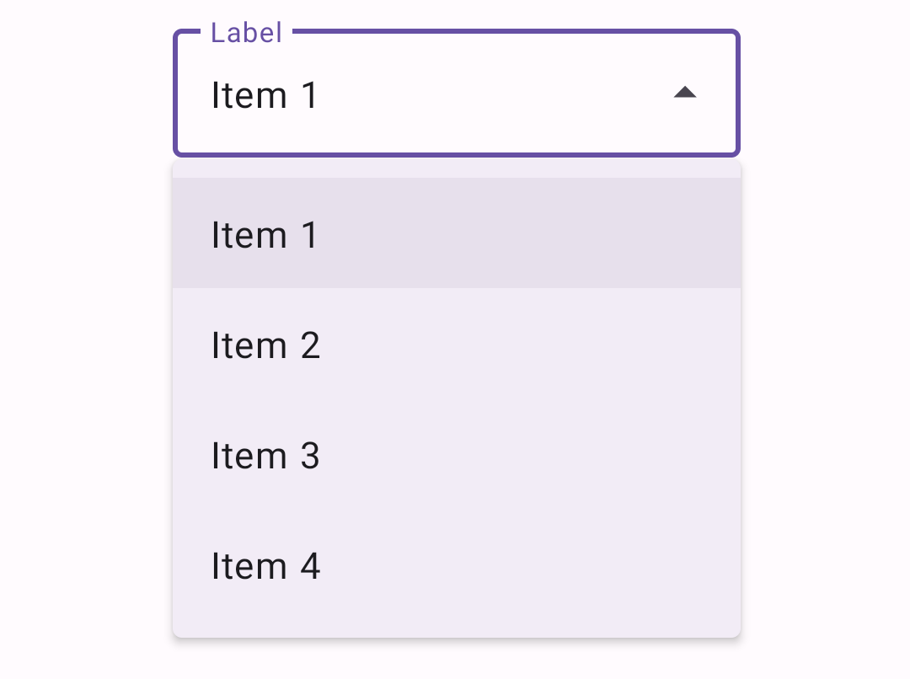

#### Non editable variation

For a non-editable menu, disable the user input in the `AutoCompleteTextView` by
setting `android:inputType="none"` on the `AutoCompleteTextView`.

#### Setting a default value

In order to have a pre-selected value displayed, you can call
`setText(CharSequence text, boolean filter)` on the `AutoCompleteTextView` with
the filter set to `false`.

## Code implementation

Before you can use Material menus, you need to add a dependency to the Material
components for Android library. For more information, go to the
[Getting started](https://github.com/material-components/material-components-android/tree/master/docs/getting-started.md)
page.

### Menu examples

A typical menu resource looks like this:

```xml
<?xml version="1.0" encoding="utf-8"?>
<menu xmlns:android="http://schemas.android.com/apk/res/android">
    <item android:id="@+id/option_1"
          android:title="@string/option_1" />
    <item android:id="@+id/option_2"
          android:title="@string/option_2" />
    <item android:id="@+id/option_3"
          android:title="@string/option_3" />
</menu>
```

A typical exposed dropdown menu looks like this:

```xml
<com.google.android.material.textfield.TextInputLayout
    android:id="@+id/menu"
    style="?attr/textInputFilledExposedDropdownMenuStyle"
    android:layout_width="match_parent"
    android:layout_height="wrap_content"
    android:hint="@string/label">

    <AutoCompleteTextView
        android:layout_width="match_parent"
        android:layout_height="wrap_content"
        android:inputType="none"
    />

</com.google.android.material.textfield.TextInputLayout>
```

### Making menus accessible

Menus are readable by most screen readers, such as TalkBack. Text rendered in
menus is automatically provided to accessibility services. Additional content
labels are usually unnecessary.

Android's exposed dropdown menu component APIs support both label text and
helper text, which tell the user what information is requested for a menu. While
optional, their use is strongly encouraged. For more information about this
component's accessibility, check out
[the text field's a11y section](TextField.md#making-text-fields-accessible).

## Customizing menus

### Theming menus

Menus drawers support the customization of color, typography, and shape.

#### Dropdown menu theming examples

Popup, overflow, and list popup window menus support the customization of
typography.

API and source code:

*   `Menu`
    *   [Class definition](https://developer.android.com/reference/android/view/Menu)
*   `MenuInflater`
    *   [Class definition](https://developer.android.com/reference/android/view/MenuInflater)
*   `ContextMenu`
    *   [Class definition](https://developer.android.com/reference/android/view/ContextMenu)
*   `PopupMenu`
    *   [Class definition](https://developer.android.com/reference/androidx/appcompat/widget/PopupMenu)
*   `ListPopupWindow`
    *   [Class definition](https://developer.android.com/reference/androidx/appcompat/widget/ListPopupWindow)

The following example shows a menu with Material theming.

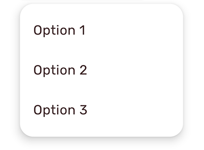

##### Implementing menu theming

Use default style theme attributes, which affect all menus but do not affect
other components:

```xml
<style name="Theme.App" parent="Theme.Material3.*">
    ...
    <item name="textAppearanceLargePopupMenu">@style/TextAppearance.App.BodyLarge</item>
    <item name="textAppearanceSmallPopupMenu">@style/TextAppearance.App.BodyLarge</item>
    <item name="popupMenuBackground">@drawable/custom_popup_background</item>
</style>

<style name="TextAppearance.App.BodyLarge" parent="TextAppearance.Material3.BodyLarge">
    <item name="fontFamily">@font/rubik</item>
    <item name="android:fontFamily">@font/rubik</item>
    <item name="android:textColor">@color/shrine_pink_900</item>
</style>
```

In `res/drawable/custom_popup_background`:

```xml
<?xml version="1.0" encoding="UTF-8"?>
<shape xmlns:android="http://schemas.android.com/apk/res/android">
  <solid android:color="?attr/colorSurface"/>
  <corners
    android:radius="16dp"/>
  <padding
      android:bottom="8dp"
      android:top="8dp"/>
</shape>
```

Use a custom style instead of overriding `?attr/popupMenuBackground` if you want
to set a custom background for one type of menu:

```xml
<style name="Theme.App" parent="Theme.Material3.*">
    ...
    <item name="popupMenuStyle">@style/Widget.App.PopupMenu</item>
</style>

<style name="Widget.App.PopupMenu" parent="Widget.Material3.PopupMenu">
    <item name="android:popupBackground">@drawable/custom_popupmenu_background</item>
</style>
```
#### Exposed dropdown menu theming examples

Exposed dropdown menus support
[Material theming](https://material.io/components/chips/#theming) which can
customize color, typography, and shape.

**Note:** The exposed dropdown menu is implemented through the
`TextInputLayout`. For detailed information on how
[Material text fields](https://material.io/design/components/text-fields.html)
work, see the [TextInputLayout documentation](TextField.md).

API and source code:

*   `TextInputLayout`
    *   [Class definition](https://developer.android.com/reference/com/google/android/material/textfield/TextInputLayout)
    *   [Class source](https://github.com/material-components/material-components-android/tree/master/lib/java/com/google/android/material/textfield/TextInputLayout.java)
*   `AutoCompleteTextView`
    *   [Class definition](https://developer.android.com/reference/android/widget/AutoCompleteTextView)
*   `MaterialAutoCompleteTextView`
    *   [Class definition](https://developer.android.com/reference/com/google/android/material/textfield/MaterialAutoCompleteTextView)
    *   [Class source](https://github.com/material-components/material-components-android/tree/master/lib/java/com/google/android/material/textfield/MaterialAutoCompleteTextView.java)

The following example shows filled and outlined exposed dropdown menu types with
Material theming.


##### Implementing exposed dropdown menu theming

Use default style theme attributes, styles and theme overlays which adds themes
to all menus but does not affect other components:

```xml
<style name="Theme.App" parent="Theme.Material3.*">
    ...
    <item name="textInputStyle">@style/Widget.App.ExposedDropdownMenu</item>
</style>

<style name="Widget.App.ExposedDropdownMenu" parent="Widget.Material3.TextInputLayout.*.ExposedDropdownMenu">
    <item name="materialThemeOverlay">@style/ThemeOverlay.App.ExposedDropdownMenu</item>
    <item name="shapeAppearance">@style/ShapeAppearance.App.SmallComponent</item>
    <item name="hintTextColor">?attr/colorOnSurface</item>
    <item name="endIconTint">?attr/colorOnSurface</item>
</style>

<style name="ThemeOverlay.App.ExposedDropdownMenu" parent="">
    <item name="colorPrimary">@color/shrine_pink_100</item>
    <item name="colorOnSurface">@color/shrine_pink_900</item>
    <item name="colorError">@color/shrine_red</item>
    <item name="textAppearanceBodyLarge">@style/TextAppearance.App.BodyLarge</item>
    <item name="textAppearanceBodySmall">@style/TextAppearance.App.BodySmall</item>
    <item name="autoCompleteTextViewStyle">@style/Widget.Material3.AutoCompleteTextView.*</item>
</style>

<style name="TextAppearance.App.BodyLarge" parent="TextAppearance.Material3.BodyLarge">
    <item name="fontFamily">@font/rubik</item>
    <item name="android:fontFamily">@font/rubik</item>
</style>

<style name="TextAppearance.App.BodySmall" parent="TextAppearance.Material3.BodySmall">
    <item name="fontFamily">@font/rubik</item>
    <item name="android:fontFamily">@font/rubik</item>
</style>

<style name="ShapeAppearance.App.SmallComponent" parent="ShapeAppearance.Material3.SmallComponent">
    <item name="cornerFamily">cut</item>
    <item name="cornerSize">4dp</item>
</style>
```

or use the style in the layout, which affects only this menu:

```xml
<com.google.android.material.textfield.TextInputLayout
    ...
    style="@style/Widget.App.ExposedDropdownMenu">

    ...

</com.google.android.material.textfield.TextInputLayout>
```

**Note:** When setting a `materialThemeOverlay` on a custom `TextInputLayout`
style, set `autoCompleteTextViewStyle` to either a
`@style/Widget.Material3.AutoCompleteTextView.*` style or to a custom one that
inherits from that. <br/> The `TextInputLayout.*.ExposedDropdownMenu` styles set
`materialThemeOverlay` to override `autoCompleteTextViewStyle` with the
specific `AutoCompleteTextView` style needed. Therefore, you don't need to
specify a style tag on the `AutoCompleteTextView`.
