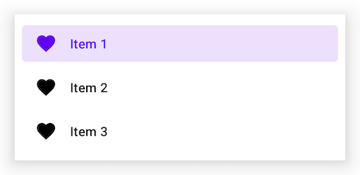
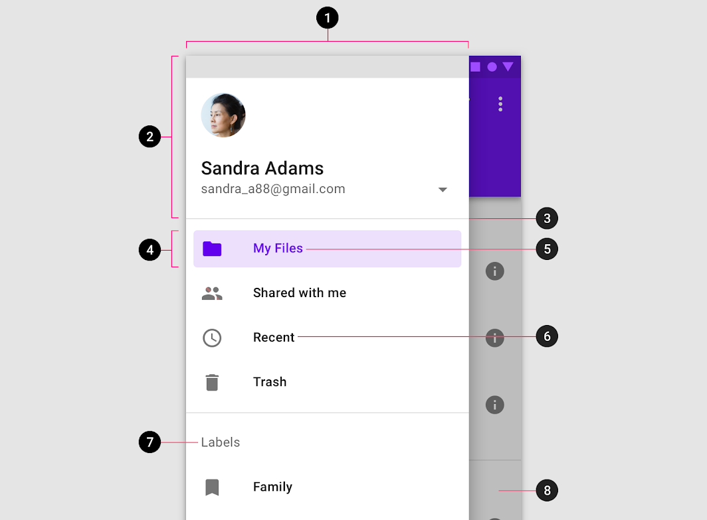

<!--docs:
title: "Navigation drawers"
layout: detail
section: components
excerpt: "Navigation drawers provide access to destinations in your app."
iconId: navigation-drawer
path: /catalog/navigation-drawer/
-->

# Navigation drawer

[Navigation drawers](https://material.io/components/navigation-drawer) provide
access to destinations in your app.


**Contents**

*   [Using navigation drawers](#using-navigation-drawers)
*   [Anatomy](#anatomy)
*   [Standard navigation drawers](#standard-navigation-drawers)
*   [Modal navigation drawers](#modal-navigation-drawers)
*   [Bottom navigation drawers](#bottom-navigation-drawers)
*   [Theming](#theming)

## Using navigation drawers

Before you can use navigation drawers, you need to add a dependency to the
Material Components for Android library. For more information, go to the
[getting started](https://github.com/material-components/material-components-android/tree/master/docs/getting-started.md)
page. For modal navigation drawers you also need to add a dependency to tne
AndroidX `DrawerLayout` library. For more information go to the
[releases](https://developer.android.com/jetpack/androidx/releases/drawerlayout)
page.

The content of all navigation drawer types can be implemented using a
`NavigationView`.

```xml
<com.google.android.material.navigation.NavigationView
  android:id="@+id/navigationView"
  ... />
```

_**Note:** The `layout_width` and `layout_height` attributes should be set to
`wrap_content`, `match_parent`, or a custom dimension depending on the
navigation drawer type and parent `ViewGroup`._

### Adding a menu



In the layout:

```xml
<com.google.android.material.navigation.NavigationView
    ...
    app:menu="@menu/navigation_drawer" />
```

In `res/menu/navigation_drawer.xml`:

```xml
<menu ...>

    <group
        android:id="@+id/group1"
        android:checkableBehavior="single">
        <item
            android:id="@+id/item1"
            android:icon="@drawable/ic_favorite_24dp"
            android:title="@string/title_1"
            android:checked="true" />
        <item
            android:id="@+id/item2"
            android:icon="@drawable/ic_favorite_24dp"
            android:title="@string/title_2" />
        <item
            android:id="@+id/item3"
            android:icon="@drawable/ic_favorite_24dp"
            android:title="@string/title_3" />
    </group>

</menu>
```

### Adding a header


In the layout:

```xml
<com.google.android.material.navigation.NavigationView
    ...
    app:headerLayout="@layout/header_navigation_drawer" />
```

In `res/layout/header_navigation_drawer.xml`:

```xml
<LinearLayout
    ...
    android:layout_width="match_parent"
    android:layout_height="wrap_content"
    android:orientation="vertical">

    <TextView
        android:layout_width="wrap_content"
        android:layout_height="wrap_content"
        android:layout_marginTop="24dp"
        android:layout_marginStart="24dp"
        android:layout_marginEnd="24dp"
        android:textAppearance="?attr/textAppearanceHeadline6"
        android:text="@string/header_title" />

    <TextView
        android:layout_width="wrap_content"
        android:layout_height="wrap_content"
        android:layout_marginBottom="24dp"
        android:layout_marginStart="24dp"
        android:layout_marginEnd="24dp"
        android:textAppearance="?attr/textAppearanceBody2"
        android:textColor="@color/material_on_surface_emphasis_medium"
        android:text="@string/header_text" />

</LinearLayout>
```

### Adding dividers and subtitles


Dividers are automatically added between `<group>`s with unique IDs. When a
sub-`<menu>` is added to an item it is treated as a subtitle.

In `res/menu/navigation_drawer.xml`:

```xml
<menu ...>

    <group
        android:id="@+id/group1"
        ...>
        ...
    </group>

    <group
        android:id="@+id/group2"
        android:checkableBehavior="single">
        <item
            android:id="@+id/subtitle"
            android:title="Subtitle">
            <menu>
                <item
                    android:id="@+id/item4"
                    android:icon="@drawable/ic_favorite_24dp"
                    android:title="Item 4" />

                <item
                    android:id="@+id/item5"
                    android:icon="@drawable/ic_favorite_24dp"
                    android:title="Item 5" />

            </menu>
        </item>
    </group>

</menu>
```

### Making navigation drawers accessible

Navigation drawers support content labeling for accessibility and are readable
by most screen readers, such as TalkBack. Text rendered in menu items is
automatically provided to accessibility services. Additional content labels are
optional but recommended.

For more information on content labels, go to the
[Android accessibility help guide](https://support.google.com/accessibility/android/answer/7158690).

#### Content descriptions

A content description can be set on `<item>`s in the `NavigationView` menu so
that screen readers like TalkBack are able to announce their purpose or action,
if any. This can be done in XML using the `android:contentDescription` attribute
or programmatically with
`navigationView.menu.findItem(R.id.itemId)#setContentDescription` (on API 26 and
above).

Any `ImageView`s within the header layout should also have a content description
set on them.

#### Opening and closing navigation drawers

To open navigation drawers, use clickable widgets that meet the minimum touch
target size of `48dp` and are properly labeled for accessibility. To close
navigation drawers, consider doing the same but bear in mind that clicking on
menu items or an optional scrim should also serve this purpose.

### Using navigation drawers with the Navigation component

Navigation drawers can be used with the AndroidX Navigation library. For more
information, go to the
[documentation](https://developer.android.com/guide/navigation/navigation-ui#add_a_navigation_drawer).

## Anatomy

Navigation drawers have a container, an optional header, optional dividers,
items with inactive text, active text, and an active text overlay, optional
subtitles, and an optional scrim.



1.  Container
2.  Header (optional)
3.  Divider (optional)
4.  Active text overlay
5.  Active text
6.  Inactive text
7.  Subtitle (optional)
8.  Scrim (optional)

### Container attributes

&nbsp;                  | Attribute(s)                                                        | Related method(s)                                | Default value
----------------------- | ------------------------------------------------------------------- | ------------------------------------------------ | -------------
**Color**               | `android:background`                                                | `setBackground`<br>`getBackground`               | `?attr/colorSurface`
**Shape**               | `app:shapeAppearance`<br>`app:shapeAppearanceOverlay`               | N/A                                              | `null`
**Elevation**           | `app:elevation` (can be used on `NavigationView` or `DrawerLayout`) | `setElevation`<br>`getElevation`                 | `16dp` (`NavigationView`) or `10dp` (`DrawerLayout`)
**Max width**           | `android:maxWidth`                                                  | N/A                                              | `280dp`
**Fits system windows** | `android:fitsSystemWindows`                                         | `setFitsSystemWindows`<br>`getFitsSystemWindows` | `true`

### Header attributes

&nbsp;     | Attribute          | Related method(s)                                                                                   | Default value
---------- | ------------------ | --------------------------------------------------------------------------------------------------- | -------------
**Layout** | `app:headerLayout` | `addHeaderView`<br>`inflateHeaderView`<br>`getHeaderView`<br>`getHeaderCount`<br>`removeHeaderView` | `null`

### Divider attributes

&nbsp;      | Attribute                                                                                                                                                                                                                    | Related method(s) | Default value
----------- | ---------------------------------------------------------------------------------------------------------------------------------------------------------------------------------------------------------------------------- | ----------------- | -------------
**Divider** | `android:listDivider` in app theme                                                                                                                                                                                           | N/A               | Varies per platform version
**Height**  | N/A (see [layout](https://github.com/material-components/material-components-android/tree/master/lib/java/com/google/android/material/internal/res/layout/design_navigation_item_separator.xml)) | N/A               | `1dp`

### Text overlay attributes

&nbsp;                 | Attribute(s)                                                                                                  | Related method(s)                                                                              | Default value
---------------------- | ------------------------------------------------------------------------------------------------------------- | ---------------------------------------------------------------------------------------------- | -------------
**Color**              | `app:itemShapeFillColor`                                                                                      | N/A                                                                                            | `?attr/colorPrimary` at 12% opacity (see all [states](https://github.com/material-components/material-components-android/tree/master/lib/java/com/google/android/material/navigation/res/color/mtrl_navigation_item_background_color.xml))
**Shape**              | `app:itemShapeAppearance`<br>`app:itemShapeAppearanceOverlay`                                                 | N/A                                                                                            | `?attr/shapeAppearanceSmallComponent`<br>`null`
**Insets**             | `app:itemShapeInsetStart`<br>`app:itemShapeInsetTop`<br>`app:itemShapeInsetEnd`<br>`app:itemShapeInsetBottom` | N/A                                                                                            | `8dp`<br>`4dp`<br>`8dp`<br>`4dp`
**Horizontal padding** | `app:itemHorizontalPadding`                                                                                   | `setItemHorizontalPadding`<br>`setItemHorizontalPaddingResource`<br>`getItemHorizontalPadding` | `22dp`

### Text attributes

&nbsp;          | Attribute                | Related method(s)                        | Default value
--------------- | ------------------------ | ---------------------------------------- | -------------
**Color**       | `app:itemTextColor`      | `setItemTextColor`<br>`getItemTextColor` | `?attr/colorPrimary` when active else `?attr/colorOnSurface` (see all [states](https://github.com/material-components/material-components-android/tree/master/lib/java/com/google/android/material/navigation/res/color/mtrl_navigation_item_text_color.xml))
**Typograhphy** | `app:itemTextAppearance` | `setItemTextAppearance`                  | `?attr/textAppearanceSubtitle2`
**Max lines**   | `app:itemMaxLines`       | `setItemMaxLines`<br>`getItemMaxLines`   | `1`

### Icon attributes

&nbsp;      | Attribute             | Related method(s)                                                            | Default value
----------- | --------------------- | ---------------------------------------------------------------------------- | -------------
**Color**   | `app:itemIconTint`    | `setIconItemTintList`<br>`getIconItemTintList`                               | `?attr/colorPrimary` when active else `?attr/colorOnSurface` (see all [states](https://github.com/material-components/material-components-android/tree/master/lib/java/com/google/android/material/navigation/res/color/mtrl_navigation_item_icon_tint.xml))
**Size**    | `app:itemIconSize`    | `setItemIconSize`                                                            | `24dp`
**Padding** | `app:itemIconPadding` | `setItemIconPadding`<br>`setItemIconPaddingResource`<br>`getItemIconPadding` | `14dp`

### Subtitle attributes

&nbsp;         | Attribute                                                                                                                                                                                                                    | Related method(s) | Default value
-------------- | ---------------------------------------------------------------------------------------------------------------------------------------------------------------------------------------------------------------------------- | ----------------- | -------------
**Color**      | N/A (see [layout](https://github.com/material-components/material-components-android/tree/master/lib/java/com/google/android/material/internal/res/layout/design_navigation_item_subheader.xml)) | N/A               | `?android:textColorSecondary`
**Typography** | N/A                                                                                                                                                                                                                          | N/A               | `@style/TextAppearance.AppCompat.Body2`
**Max lines**  | N/A                                                                                                                                                                                                                          | N/A               | `1`
**Height**     | N/A                                                                                                                                                                                                                          | N/A               | `?attr/listPreferredItemHeightSmall`
**Padding**    | N/A                                                                                                                                                                                                                          | N/A               | `?attr/listPreferredItemPaddingLeft` and `?attr/listPreferredItemPaddingRight`

### Scrim attributes

&nbsp;    | Attribute | Related method(s)                 | Default value
--------- | --------- | --------------------------------- | --------------------
**Color** | N/A       | `setScrimColor` on `DrawerLayout` | Black at 60% opacity

### `NavigationView` styles

&nbsp;            | Style
----------------- | ------------------------------------------
**Default style** | `Widget.MaterialComponents.NavigationView`

Default style theme attribute: `?attr/navigationViewStyle`

### `DrawerLayout` styles

Default style theme attribute: `?attr/drawerLayoutStyle`

## Types

There are three types of navigation drawers: 1\.
[Standard navigation drawer](#standard-navigation-drawer), 2\.
[Modal navigation drawer](#modal-navigation-drawer), 3\.
[Bottom navigation drawer](#bottom-navigation-drawer)


## Standard navigation drawer

[Standard navigation drawers](https://material.io/components/navigation-drawer#standard-drawer)
allow interaction with both screen content and the drawer at the same time. They
can be used on tablet and desktop, but they aren’t suitable for mobile due to
limited screen size.

### Standard navigation drawer example

API and source code:

*   `NavigationView`
    *   [Class definition](https://developer.android.com/reference/com/google/android/material/navigation/NavigationView)
    *   [Class source](https://github.com/material-components/material-components-android/tree/master/lib/java/com/google/android/material/navigation/NavigationView.java)

The following example shows a permanently visible standard navigation drawer.


In the layout:

```xml
<androidx.constraintlayout.widget.ConstraintLayout
    ...
    android:layout_width="match_parent"
    android:layout_height="match_parent">

    <com.google.android.material.navigation.NavigationView
        ...
        android:layout_width="wrap_content"
        android:layout_height="match_parent"
        app:layout_constraintStart_toStartOf="parent" />

    <!-- Screen content (constrained to end of navigationView) -->

</androidx.constraintlayout.widget.ConstraintLayout>
```

In `res/values/themes.xml`:

```xml
<style name="Theme.App" parent="Theme.MaterialComponents.DayNight.*">
    <item name="android:windowTranslucentStatus">true</item>
</style>
```

In `res/layout/header_navigation_drawer.xml`:

```xml
<LinearLayout
    ...
    android:fitsSystemWindows="true">

    ...

</LinearLayout>
```

## Modal navigation drawer

[Modal navigation drawers](https://material.io/components/navigation-drawer#modal-drawer)
block interaction with the rest of an app’s content with a scrim. They are
elevated above most of the app’s UI and don’t affect the screen’s layout grid.

They are primarily for use on mobile where screen space is limited, and can be
replaced by standard drawers on tablet and desktop.

### Modal navigation drawer example

API and source code:

*   `NavigationView`
    *   [Class definition](https://developer.android.com/reference/com/google/android/material/navigation/NavigationView)
    *   [Class source](https://github.com/material-components/material-components-android/tree/master/lib/java/com/google/android/material/navigation/NavigationView.java)
*   `DrawerLayout`
    *   [Class definition](https://developer.android.com/reference/kotlin/androidx/drawerlayout/widget/DrawerLayout)

The following example shows a modal navigation drawer with a top app bar.


In the layout:

```xml
<androidx.drawerlayout.widget.DrawerLayout
    ...
    android:id="@+id/drawerLayout"
    android:layout_width="match_parent"
    android:layout_height="match_parent"
    tools:openDrawer="start">

    <androidx.coordinatorlayout.widget.CoordinatorLayout
        android:layout_width="match_parent"
        android:layout_height="match_parent"
        android:fitsSystemWindows="true">

        <com.google.android.material.appbar.AppBarLayout
            android:layout_width="match_parent"
            android:layout_height="wrap_content"
            style="@style/Widget.MaterialComponents.AppBarLayout.PrimarySurface"
            android:fitsSystemWindows="true">

            <com.google.android.material.appbar.MaterialToolbar
                android:id="@+id/topAppBar"
                android:layout_width="match_parent"
                android:layout_height="?attr/actionBarSize"
                app:title="@string/top_app_bar"
                app:navigationIcon="@drawable/ic_menu_24dp"
                style="@style/Widget.MaterialComponents.Toolbar.PrimarySurface"
                android:background="@android:color/transparent"
                android:elevation="0dp" />

        </com.google.android.material.appbar.AppBarLayout>

        <!-- Screen content -->
        <!-- Use app:layout_behavior="@string/appbar_scrolling_view_behavior" to fit below top app bar -->

    </androidx.coordinatorlayout.widget.CoordinatorLayout>

    <com.google.android.material.navigation.NavigationView
        ...
        android:layout_width="wrap_content"
        android:layout_height="match_parent"
        android:layout_gravity="start" />

</androidx.drawerlayout.widget.DrawerLayout>
```

In `res/values/themes.xml`:

```xml
<style name="Theme.App" parent="Theme.MaterialComponents.DayNight.*">
    <item name="android:windowTranslucentStatus">true</item>
</style>
```

In `res/layout/header_navigation_drawer.xml`:

```xml
<LinearLayout
    ...
    android:fitsSystemWindows="true">

    ...

</LinearLayout>
```

In code:

```kt
topAppBar.setNavigationOnClickListener {
    drawerLayout.open()
}

navigationView.setNavigationItemSelectedListener { menuItem ->
    // Handle menu item selected
    menuItem.isChecked = true
    drawerLayout.close()
    true
}
```

For more information on top app bars see the
[documentation](https://github.com/material-components/material-components-android/tree/master/docs/components/TopAppBar.md).

## Bottom navigation drawer

[Bottom navigation drawers](https://material.io/components/navigation-drawer#bottom-drawer)
are modal drawers that are anchored to the bottom of the screen instead of the
left or right edge. They are only used with bottom app bars.

These drawers open upon tapping the navigation menu icon in the bottom app bar.
They are only for use on mobile.

### Bottom navigation drawer example

API and source code:

*   `NavigationView`
    *   [Class definition](https://developer.android.com/reference/com/google/android/material/navigation/NavigationView)
    *   [Class source](https://github.com/material-components/material-components-android/tree/master/lib/java/com/google/android/material/navigation/NavigationView.java)
*   `BottomSheetBehavior`
    *   [Class definition](https://developer.android.com/reference/com/google/android/material/bottomsheet/BottomSheetBehavior)
    *   [Class source](https://github.com/material-components/material-components-android/tree/master/lib/java/com/google/android/material/bottomsheet/BottomSheetBehavior.java)

The following example shows a bottom navigation drawer with a bottom app bar.


In the layout:

```xml
<androidx.coordinatorlayout.widget.CoordinatorLayout
    ...
    android:layout_width="match_parent"
    android:layout_height="match_parent">

    <androidx.coordinatorlayout.widget.CoordinatorLayout
        android:layout_width="match_parent"
        android:layout_height="match_parent"
        android:layout_marginBottom="?attr/actionBarSize">

        <!-- Screen content -->

        <FrameLayout
            android:id="@+id/scrim"
            android:layout_width="match_parent"
            android:layout_height="match_parent" />

        <com.google.android.material.navigation.NavigationView
            ...
            android:layout_width="match_parent"
            android:layout_height="wrap_content"
            app:layout_behavior="@string/bottom_sheet_behavior"
            app:behavior_hideable="true" />

    </androidx.coordinatorlayout.widget.CoordinatorLayout>

    <com.google.android.material.bottomappbar.BottomAppBar
        android:id="@+id/bottomAppBar"
        android:layout_width="match_parent"
        android:layout_height="wrap_content"
        android:layout_gravity="bottom"
        style="@style/Widget.MaterialComponents.BottomAppBar.PrimarySurface"
        app:navigationIcon="@drawable/ic_menu_24dp" />

</androidx.coordinatorlayout.widget.CoordinatorLayout>
```

In code:

```kt
val bottomSheetBehavior = BottomSheetBehavior.from(navigationView)
bottomSheetBehavior.state = BottomSheetBehavior.STATE_HIDDEN

bottomAppBar.setNavigationOnClickListener {
    bottomSheetBehavior.state = BottomSheetBehavior.STATE_EXPANDED
}

navigationView.setNavigationItemSelectedListener { menuItem ->
    // Handle menu item selected
    menuItem.isChecked = true
    bottomSheetBehavior.state = BottomSheetBehavior.STATE_HIDDEN
    true
}

scrim.setOnClickListener {
    bottomSheetBehavior.state = BottomSheetBehavior.STATE_HIDDEN
}

bottomSheetBehavior.addBottomSheetCallback(object : BottomSheetBehavior.BottomSheetCallback() {
    override fun onSlide(bottomSheet: View, slideOffset: Float) {
        val baseColor = Color.BLACK
        // 60% opacity
        val baseAlpha = ResourcesCompat.getFloat(resources, R.dimen.material_emphasis_medium)
        // Map slideOffset from [-1.0, 1.0] to [0.0, 1.0]
        val offset = (slideOffset - (-1f)) / (1f - (-1f)) * (1f - 0f) + 0f
        val alpha = MathUtils.lerp(0f, 255f, offset * baseAlpha).toInt()
        val color = Color.argb(alpha, baseColor.red, baseColor.green, baseColor.blue)
        scrim.setBackgroundColor(color)
    }
    override fun onStateChanged(bottomSheet: View, newState: Int) {
    }
})
```

For more information on bottom app bars see the
[documentation](https://github.com/material-components/material-components-android/tree/master/docs/components/BottomAppBar.md).

## Theming

Navigation drawers support
[Material Theming](https://material.io/components/text-fields/#theming) and can
be customized in terms of color, typography and shape.

### Navigation drawer theming example

API and source code:

*   `NavigationView`
    *   [Class definition](https://developer.android.com/reference/com/google/android/material/navigation/NavigationView)
    *   [GitHub source](https://github.com/material-components/material-components-android/tree/master/lib/java/com/google/android/material/navigation/NavigationView.java)

The following example shows a navigation drawer with Material Theming.


#### Implementing navigation drawer theming

Using theme attributes, default style theme attributes, and styles in
`res/values/styles.xml` (themes all navigation drawers and affects other
components):

```xml
<style name="Theme.App" parent="Theme.MaterialComponents.*">
    ...
    <item name="colorPrimary">@color/shrine_pink_100</item>
    <item name="colorSurface">@color/shrine_pink_50</item>
    <item name="colorOnSurface">@color/shrine_pink_900</item>
    <item name="textAppearanceHeadline6">@style/TextAppearance.App.Headline6</item>
    <item name="textAppearanceSubtitle2">@style/TextAppearance.App.Subtitle2</item>
    <item name="textAppearanceBody2">@style/TextAppearance.App.Body2</item>
    <item name="shapeAppearanceSmallComponent">@style/ShapeAppearance.App.SmallComponent</item>
    <item name="navigationViewStyle">@style/Widget.App.NavigationView</item>
</style>

<style name="TextAppearance.App.Headline6" parent="TextAppearance.MaterialComponents.Subtitle1">
    <item name="fontFamily">@font/rubik</item>
    <item name="android:fontFamily">@font/rubik</item>
</style>

<style name="TextAppearance.App.Subtitle2" parent="TextAppearance.MaterialComponents.Subtitle1">
    <item name="fontFamily">@font/rubik</item>
    <item name="android:fontFamily">@font/rubik</item>
</style>

<style name="TextAppearance.App.Body2" parent="TextAppearance.MaterialComponents.Subtitle1">
    <item name="fontFamily">@font/rubik</item>
    <item name="android:fontFamily">@font/rubik</item>
</style>

<style name="ShapeAppearance.App.SmallComponent" parent="ShapeAppearance.MaterialComponents.SmallComponent">
    <item name="cornerFamily">cut</item>
    <item name="cornerSize">4dp</item>
</style>

<style name="Widget.App.NavigationView" parent="Widget.MaterialComponents.NavigationView">
    <item name="itemIconTint">@color/navigation_item_color</item>
    <item name="itemTextColor">@color/navigation_item_color</item>
    <item name="itemShapeFillColor">@color/navigation_item_background_color</item>
</style>
```

In `res/color/navigation_item_color.xml`:

```xml
<selector ...>
    <item android:color="?attr/colorOnSurface" android:state_checked="true"/>
    <item android:alpha="@dimen/material_emphasis_disabled" android:color="?attr/colorOnSurface" android:state_enabled="false"/>
    <item android:alpha="@dimen/material_emphasis_medium" android:color="?attr/colorOnSurface"/>
</selector>

```

In `res/color/navigation_item_background_color.xml`:

```xml
<selector ...>
    <item android:alpha="@dimen/material_emphasis_disabled" android:color="?attr/colorPrimary" android:state_activated="true"/>
    <item android:alpha="@dimen/material_emphasis_disabled" android:color="?attr/colorPrimary" android:state_checked="true"/>
    <item android:color="@android:color/transparent"/>
</selector>
```

or using default style theme attributes, styles and theme overlays (themes all
navigation drawers but does not affect other components):

```xml
<style name="Theme.App" parent="Theme.MaterialComponents.*">
    ...
    <item name="navigationViewStyle">@style/Widget.App.NavigationView</item>
</style>

<style name="Widget.App.NavigationView" parent="Widget.MaterialComponents.NavigationView">
    <item name="materialThemeOverlay">@style/ThemeOverlay.App.NavigationView</item>
    <item name="itemIconTint">@color/navigation_item_color</item>
    <item name="itemTextColor">@color/navigation_item_color</item>
    <item name="itemShapeFillColor">@color/navigation_item_background_color</item>
</style>

<style name="ThemeOverlay.App.NavigationView" parent="">
    <item name="colorPrimary">@color/shrine_pink_100</item>
    <item name="colorSurface">@color/shrine_pink_50</item>
    <item name="colorOnSurface">@color/shrine_pink_900</item>
    <item name="textAppearanceHeadline6">@style/TextAppearance.App.Headline6</item>
    <item name="textAppearanceSubtitle2">@style/TextAppearance.App.Subtitle2</item>
    <item name="textAppearanceBody2">@style/TextAppearance.App.Body2</item>
    <item name="shapeAppearanceSmallComponent">@style/ShapeAppearance.App.SmallComponent</item>
</style>
```

or using the style in the layout (affects only this navigation drawer):

```xml
<com.google.android.material.navigation.NavigationView
    ...
    style="@style/Widget.App.NavigationView" />
```
