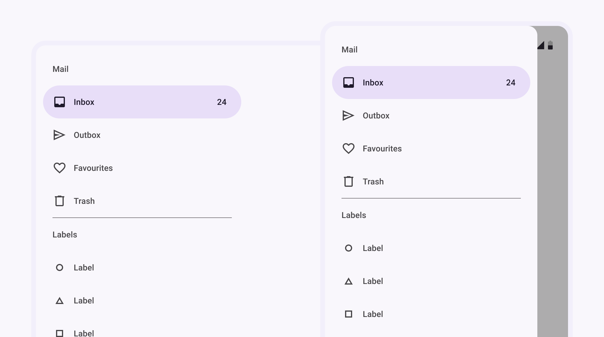
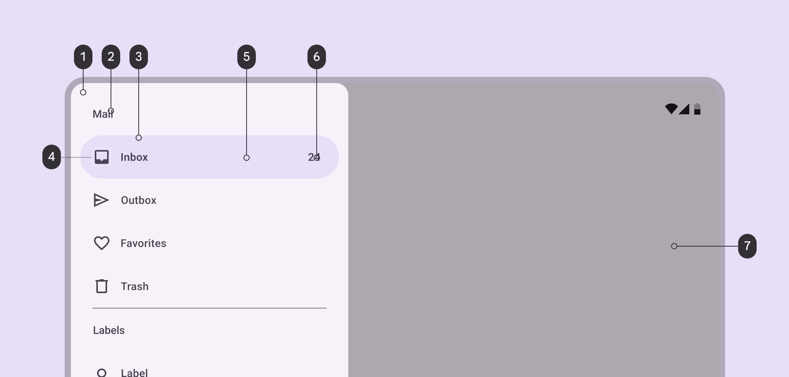

<!--docs:
title: "Navigation drawers"
layout: detail
section: components
excerpt: "Navigation drawers provide access to destinations in your app."
iconId: navigation-drawer
path: /catalog/navigation-drawer/
-->

# Navigation drawer

[Navigation drawers](https://material.io/components/navigation-drawer) provide
access to destinations in your app.



**Contents**

*   [Design & API Documentation](#design-api-documentation)
*   [Using navigation drawers](#using-navigation-drawers)
*   [Anatomy](#anatomy)
*   [Standard navigation drawer](#standard-navigation-drawer)
*   [Modal navigation drawer](#modal-navigation-drawer)
*   [Bottom navigation drawer](#bottom-navigation-drawer)
*   [Predictive Back](#predictive-back)
*   [Theming](#theming)

## Design & API Documentation

*   [Google Material3 Spec](https://material.io/components/navigation-drawer/overview)
*   [API reference](https://developer.android.com/reference/com/google/android/material/navigation/package-summary)

## Using navigation drawers

Before you can use navigation drawers, you need to add a dependency to the
Material Components for Android library. For more information, go to the
[getting started](https://github.com/material-components/material-components-android/tree/master/docs/getting-started.md)
page. For modal navigation drawers you also need to add a dependency to the
AndroidX `DrawerLayout` library. For more information go to the
[releases](https://developer.android.com/jetpack/androidx/releases/drawerlayout)
page.

The content of all navigation drawer types can be implemented using a
`NavigationView`.

```xml
<com.google.android.material.navigation.NavigationView
  android:id="@+id/navigationView"
  ... />
```

**Note:** The `layout_width` and `layout_height` attributes should be set to
`wrap_content`, `match_parent`, or a custom dimension depending on the
navigation drawer type and parent `ViewGroup`.

### Adding a menu


In the layout:

```xml
<com.google.android.material.navigation.NavigationView
    ...
    app:menu="@menu/navigation_drawer" />
```

In `res/menu/navigation_drawer.xml`:

```xml
<menu ...>

  <item
    android:id="@+id/main_item"
    android:title="@string/mail_subheader_title">
      <menu>
        <item
          android:id="@+id/inbox_item"
          android:icon="@drawable/ic_inbox_24px"
          android:title="@string/inbox_title"
          android:checkable="true"/>
        <item
          android:id="@+id/outbox_item"
          android:icon="@drawable/ic_outbox_24px"
          android:title="@string/outbox_title"
          android:checkable="true"/>
        <item
          android:id="@+id/favourites_item"
          android:icon="@drawable/ic_favourites_24px"
          android:title="@string/favourites_title"
          android:checkable="true">
      </menu>
  </item>

</menu>
```

### Adding a header


In the layout:

```xml
<com.google.android.material.navigation.NavigationView
    ...
    app:headerLayout="@layout/header_navigation_drawer" />
```

In `res/layout/header_navigation_drawer.xml`:

```xml
<LinearLayout
    ...
    android:layout_width="match_parent"
    android:layout_height="wrap_content"
    android:orientation="vertical">

    <TextView
        android:layout_width="wrap_content"
        android:layout_height="wrap_content"
        android:layout_marginTop="24dp"
        android:layout_marginStart="24dp"
        android:layout_marginEnd="24dp"
        android:textAppearance="?attr/textAppearanceHeadlineSmall"
        android:textColor="?attr/colorOnSurface"
        android:text="@string/header_title" />

    <TextView
        android:layout_width="wrap_content"
        android:layout_height="wrap_content"
        android:layout_marginBottom="24dp"
        android:layout_marginStart="24dp"
        android:layout_marginEnd="24dp"
        android:textAppearance="?attr/textAppearanceTitleSmall"
        android:textColor="?attr/colorOnSurfaceVariant"
        android:text="@string/header_text" />

</LinearLayout>
```

### Adding dividers and subtitles


Dividers are automatically added between `<item>` groups with unique IDs or
`<group>`s with unique IDs. When a sub-`<menu>` is added to an item it is
treated as a subtitle.

In `res/menu/navigation_drawer.xml`:

```xml
<menu ...>
  <item
    android:id="@+id/main_item"
    android:title="@string/mail_subheader_title">
      <menu>
        <item
          android:id="@+id/search_item"
          android:icon="@drawable/ic_search_24px"
          android:title="@string/search_title"
          android:checkable="true"
          app:showAsAction="ifRoom"/>
        <item
          android:id="@+id/rotation_item"
          android:icon="@drawable/ic_3d_rotation_24px"
          android:title="@string/3d_title"
          android:checkable="true"
          app:showAsAction="ifRoom"/>
        <item
          android:id="@+id/accelerator_item"
          android:icon="@drawable/ic_accelerator_24px"
          android:title="@string/accelerator_title"
          android:checkable="true"
          app:showAsAction="ifRoom"/>
        <item
          android:id="@+id/dashboard_item"
          android:icon="@drawable/ic_dashboard_24px"
          android:title="@string/dashboard_title"
          android:checkable="true"
          app:showAsAction="ifRoom"/>
      </menu>
  </item>
  <item
    android:id="@+id/labels_item"
    android:title="@string/labels_subheader_title">
      <menu>
        <item
          android:id="@+id/label_one"
          android:icon="@drawable/ic_label_24px"
          android:title="@string/label_one_title"
          android:checkable="true"
          app:showAsAction="ifRoom"/>
        <item
          android:id="@+id/label_two"
          android:icon="@drawable/ic_label_24px"
          android:title="@string/label_two_title"
          android:checkable="true"
          app:showAsAction="ifRoom"/>
      </menu>
  </item>

</menu>
```

### Making navigation drawers accessible

Navigation drawers support content labeling for accessibility and are readable
by most screen readers, such as TalkBack. Text rendered in menu items is
automatically provided to accessibility services. Additional content labels are
optional but recommended.

For more information on content labels, go to the
[Android accessibility help guide](https://support.google.com/accessibility/android/answer/7158690).

#### Content descriptions

A content description can be set on `<item>`s in the `NavigationView` menu so
that screen readers like TalkBack are able to announce their purpose or action.
This can be done in XML using the `android:contentDescription` attribute or
programmatically with
`navigationView.menu.findItem(R.id.itemId)#setContentDescription` (on API 26 and
above).

Any `ImageView`s within the header layout should also have a content description
set.

#### Opening and closing navigation drawers

To open navigation drawers, use clickable widgets that meet the minimum touch
target size of `48dp` and are properly labeled for accessibility. To close
navigation drawers, consider doing the same but bear in mind that clicking on
menu items or an optional scrim should also serve this purpose.

### Using navigation drawers with the Navigation component

Navigation drawers can be used with the AndroidX Navigation library. For more
information, go to the
[documentation](https://developer.android.com/guide/navigation/navigation-ui#add_a_navigation_drawer).

## Anatomy

Navigation drawers have a container, an optional header, optional dividers,
items with inactive text, active text, and an active text overlay, optional
subtitles, and an optional scrim.



1.  Container
2.  Subheader (optional)
3.  Label text
4.  Icon (optional)
5.  Active indicator/Item shape
6.  Badge text (coming soon)
7.  Divider
8.  Scrim (modal drawer only)

### Container attributes

Element                 | Attribute(s)                                                        | Related method(s)                                | Default value
----------------------- | ------------------------------------------------------------------- | ------------------------------------------------ | -------------
**Color**               | `android:background`                                                | `setBackground`<br>`getBackground`               | `?attr/colorSurfaceContainerLow`
**Shape**               | `app:shapeAppearance`<br>`app:shapeAppearanceOverlay`               | N/A                                              | `null`
**Elevation**           | `app:elevation` (can be used on `NavigationView` or `DrawerLayout`) | `setElevation`<br>`getElevation`                 | `0dp` (`NavigationView`) or `1dp` (`DrawerLayout`)
**Max width**           | `android:maxWidth`                                                  | N/A                                              | `280dp`
**Fits system windows** | `android:fitsSystemWindows`                                         | `setFitsSystemWindows`<br>`getFitsSystemWindows` | `true`
**Drawer corner size**  | `drawerLayoutCornerSize`                                            | N/A                                              | `16dp`

### Header attributes

Element    | Attribute          | Related method(s)                                                                                   | Default value
---------- | ------------------ | --------------------------------------------------------------------------------------------------- | -------------
**Layout** | `app:headerLayout` | `addHeaderView`<br>`inflateHeaderView`<br>`getHeaderView`<br>`getHeaderCount`<br>`removeHeaderView` | `null`

### Divider attributes

Element     | Attribute                                                                                                                                                                                                                    | Related method(s)                                                                                   | Default value
----------- | ---------------------------------------------------------------------------------------------------------------------------------------------------------------------------------------------------------------------------- | --------------------------------------------------------------------------------------------------- | -------------
**Divider** | `android:listDivider` in app theme                                                                                                                                                                                           | N/A                                                                                                 | Varies per platform version
**Height**  | N/A (see [layout](https://github.com/material-components/material-components-android/tree/master/lib/java/com/google/android/material/internal/res/layout/design_navigation_item_separator.xml)) | N/A                                                                                                 | `1dp`
**Inset**   | `app:dividerInsetStart`<br/>`app:dividerInsetEnd`                                                                                                                                                                            | `setDividerInsetStart`<br/>`getDividerInsetStart`<br/>`setDividerInsetEnd`<br/>`getDividerInsetEnd` | `28dp`<br/>`28dp`

### Item attributes

Element                | Attribute(s)                                                                                                  | Related method(s)                                                                              | Default value
---------------------- | ------------------------------------------------------------------------------------------------------------- | ---------------------------------------------------------------------------------------------- | -------------
**Color**              | `app:itemShapeFillColor`                                                                                      | N/A                                                                                            | `?attr/colorSecondaryContainer`
**Shape**              | `app:itemShapeAppearance`<br>`app:itemShapeAppearanceOverlay`                                                 | N/A                                                                                            | `@style/ShapeAppearance.Material3.Corner.Full` <br>(`?attr/shapeCornerFamily` and corner size `50%`)
**Insets**             | `app:itemShapeInsetStart`<br>`app:itemShapeInsetTop`<br>`app:itemShapeInsetEnd`<br>`app:itemShapeInsetBottom` | N/A                                                                                            | `12dp`<br>`0dp`<br>`12dp`<br>`0dp`
**Horizontal padding** | `app:itemHorizontalPadding`                                                                                   | `setItemHorizontalPadding`<br>`setItemHorizontalPaddingResource`<br>`getItemHorizontalPadding` | `28dp`
**Vertical padding**   | `app:itemVerticalPadding`                                                                                     | `setItemVerticalPadding`<br>`setItemVerticalPaddingResource`<br>`getItemVerticalPadding`       | `4dp`

### Text attributes

| Element                 | Attribute                                 | Related method(s)                        | Default value                                                                    |
|-------------------------|-------------------------------------------|------------------------------------------|----------------------------------------------------------------------------------|
| **Color**               | `app:itemTextColor`                       | `setItemTextColor`<br>`getItemTextColor` | `?attr/colorOnSecondaryContainer` when active else `?attr/colorOnSurfaceVariant` |
| **Typography**          | `app:itemTextAppearance`                  | `setItemTextAppearance`                  | `?attr/textAppearanceLabelLarge`                                                 |
| **Typography (active)** | `app:itemTextAppearanceActiveBoldEnabled` | `setItemTextAppearanceActiveBoldEnabled` | `true`                                                                           |
| **Max lines**           | `app:itemMaxLines`                        | `setItemMaxLines`<br>`getItemMaxLines`   | `1`                                                                              |

### Icon attributes

Element     | Attribute             | Related method(s)                                                            | Default value
----------- | --------------------- | ---------------------------------------------------------------------------- | -------------
**Color**   | `app:itemIconTint`    | `setIconItemTintList`<br>`getIconItemTintList`                               | `?attr/colorOnSecondaryContainer` when active else `?attr/colorOnSurfaceVariant`
**Size**    | `app:itemIconSize`    | `setItemIconSize`                                                            | `24dp`
**Padding** | `app:itemIconPadding` | `setItemIconPadding`<br>`setItemIconPaddingResource`<br>`getItemIconPadding` | `12dp`

### Subtitle attributes

Element        | Attribute                                             | Related method(s)                                                                                           | Default value
-------------- | ----------------------------------------------------- | ----------------------------------------------------------------------------------------------------------- | -------------
**Color**      | `app:subheaderColor`                                  | N/A                                                                                                         | `?attr/colorOnSurfaceVariant`
**Typography** | `app:subheaderTextAppearance`                         | N/A                                                                                                         | `?attr/textAppearanceTitleSmall`
**Max lines**  | N/A                                                   | N/A                                                                                                         | `1`
**Height**     | N/A                                                   | N/A                                                                                                         | `?attr/listPreferredItemHeightSmall`
**Padding**    | `app:subheaderInsetStart`<br/>`app:subheaderInsetEnd` | `setSubheaderInsetStart`<br/>`getSubheaderInsetStart`<br/>`setSubheaderInsetEnd`<br/>`getSubheaderInsetEnd` | `28dp` and `28dp`

### Scrim attributes

Element   | Attribute | Related method(s)                 | Default value
--------- | --------- | --------------------------------- | --------------------
**Color** | N/A       | `setScrimColor` on `DrawerLayout` | Black at 60% opacity

### `NavigationView` styles

Element           | Style
----------------- | ---------------------------------
**Default style** | `Widget.Material3.NavigationView`

Default style theme attribute: `?attr/navigationViewStyle`

### `DrawerLayout` styles
Element           | Style
----------------- | ---------------------------------
**Default style** | `Widget.Material3.DrawerLayout`

Default style theme attribute: `?attr/drawerLayoutStyle`

### Types

There are three types of navigation drawers: 1\.
[Standard navigation drawer](#standard-navigation-drawer), 2\.
[Modal navigation drawer](#modal-navigation-drawer), 3\.
[Bottom navigation drawer](#bottom-navigation-drawer)

## Standard navigation drawer

[Standard navigation drawers](https://material.io/components/navigation-drawer#standard-drawer)
allow interaction with both screen content and the drawer at the same time. They
can be used on tablet and desktop, but they aren’t suitable for mobile devices
due to limited screen size.

API and source code:

*   `NavigationView`
    *   [Class definition](https://developer.android.com/reference/com/google/android/material/navigation/NavigationView)
    *   [Class source](https://github.com/material-components/material-components-android/tree/master/lib/java/com/google/android/material/navigation/NavigationView.java)

### Standard navigation drawer example

The following example shows a permanently visible standard navigation drawer.


In the layout:

```xml
<androidx.constraintlayout.widget.ConstraintLayout
    ...
    android:layout_width="match_parent"
    android:layout_height="match_parent">

    <com.google.android.material.navigation.NavigationView
        ...
        android:layout_width="wrap_content"
        android:layout_height="match_parent"
        app:layout_constraintStart_toStartOf="parent" />

    <!-- Screen content (constrained to end of navigationView) -->

</androidx.constraintlayout.widget.ConstraintLayout>
```

In `res/values/themes.xml`:

```xml
<style name="Theme.App" parent="Theme.Material3.DayNight.*">
    <item name="android:windowTranslucentStatus">true</item>
</style>
```

In `res/layout/header_navigation_drawer.xml`:

```xml
<LinearLayout
    ...
    android:fitsSystemWindows="true">

    ...

</LinearLayout>
```

## Modal navigation drawer

[Modal navigation drawers](https://material.io/components/navigation-drawer#modal-drawer)
block interaction with the rest of an app’s content with a scrim. They are
elevated above most of the app’s UI and don’t affect the screen’s layout grid.

They are primarily used for mobile devices where screen space is limited, and
can be replaced by standard drawers on tablet and desktop.

[DrawerLayout](https://developer.android.com/reference/androidx/drawerlayout/widget/DrawerLayout)
is used in conjunction with NavigationDrawer to achieve the modal navigation
drawer.

API and source code:

*   `NavigationView`
    *   [Class definition](https://developer.android.com/reference/com/google/android/material/navigation/NavigationView)
    *   [Class source](https://github.com/material-components/material-components-android/tree/master/lib/java/com/google/android/material/navigation/NavigationView.java)
*   `DrawerLayout`
    *   [Class definition](https://developer.android.com/reference/androidx/drawerlayout/widget/DrawerLayout)

### Modal navigation drawer example

The following example shows a modal navigation drawer.


In the layout:

```xml
<androidx.drawerlayout.widget.DrawerLayout
    ...
    android:id="@+id/drawerLayout"
    android:layout_width="match_parent"
    android:layout_height="match_parent"
    tools:openDrawer="start">

    <androidx.coordinatorlayout.widget.CoordinatorLayout
        android:layout_width="match_parent"
        android:layout_height="match_parent"
        android:fitsSystemWindows="true">

        <!-- Screen content -->
        <!-- Use app:layout_behavior="@string/appbar_scrolling_view_behavior" to fit below top app bar -->

    </androidx.coordinatorlayout.widget.CoordinatorLayout>

    <com.google.android.material.navigation.NavigationView
        ...
        android:layout_width="wrap_content"
        android:layout_height="match_parent"
        android:layout_gravity="start" />

</androidx.drawerlayout.widget.DrawerLayout>
```

In `res/values/themes.xml`:

```xml
<style name="Theme.App" parent="Theme.Material3.DayNight.*">
    <item name="android:windowTranslucentStatus">true</item>
</style>
```

In `res/layout/header_navigation_drawer.xml`:

```xml
<LinearLayout
    ...
    android:fitsSystemWindows="true">

    ...

</LinearLayout>
```

In code:

```kt
topAppBar.setNavigationOnClickListener {
    drawerLayout.open()
}

navigationView.setNavigationItemSelectedListener { menuItem ->
    // Handle menu item selected
    menuItem.isChecked = true
    drawerLayout.close()
    true
}
```

For more information on top app bars see the
[documentation](https://github.com/material-components/material-components-android/tree/master/docs/components/TopAppBar.md).

## Predictive Back

The `NavigationView` component automatically supports
[Predictive Back](../foundations/PredictiveBack.md) when it is set up within a
`DrawerLayout`, as mentioned in the sections above. No further integration is
required on the app side other than the general Predictive Back prerequisites
and migration steps mentioned [here](../foundations/PredictiveBack.md#usage).

Visit the
[Predictive Back design guidelines](https://m3.material.io/components/side-sheets/guidelines#d77245e3-1013-48f8-a9d7-76f484e1be13)
to see how the component behaves when a user swipes back.

## Theming

Navigation drawers support
[Material Theming](https://material.io/components/text-fields/#theming) which
can customize color, typography and shape.

### Navigation drawer theming example

API and source code:

*   `NavigationView`
    *   [Class definition](https://developer.android.com/reference/com/google/android/material/navigation/NavigationView)
    *   [GitHub source](https://github.com/material-components/material-components-android/tree/master/lib/java/com/google/android/material/navigation/NavigationView.java)

The following example shows a navigation drawer with Material Theming.


#### Implementing navigation drawer theming

Use theme attributes, default style theme attributes, and styles in
`res/values/styles.xml`, which applies to all navigation drawers and affects
other components:

```xml
<style name="Theme.App" parent="Theme.Material3.*">
    ...
    <item name="colorSecondaryContainer">@color/shrine_theme_light_secondaryContainer</item>
    <item name="colorOnSecondaryContainer">@color/shrine_theme_light_onSecondaryContainer</item>
    <item name="colorTertiaryContainer">@color/shrine_theme_light_tertiaryContainer</item>
    <item name="colorOnTertiaryContainer">@color/shrine_theme_light_onTertiaryContainer</item>
    <item name="colorSurface">@color/shrine_theme_light_surface</item>
    <item name="colorOnSurface">@color/shrine_theme_light_onSurface</item>
    <item name="colorOnSurfaceVariant">@color/shrine_theme_light_onSurfaceVariant</item>
    <item name="colorOutline">@color/shrine_theme_light_outline</item>
    <item name="textAppearanceTitleSmall">@style/TextAppearance.App.TitleSmall</item>
    <item name="textAppearanceLabelLarge">@style/TextAppearance.App.LabelLarge</item>
</style>

<style name="TextAppearance.App.TitleSmall" parent="TextAppearance.Material3.TitleSmall">
    <item name="fontFamily">@font/rubik</item>
    <item name="android:fontFamily">@font/rubik</item>
</style>

<style name="TextAppearance.App.LabelLarge" parent="TextAppearance.Material3.LabelLarge">
    <item name="fontFamily">@font/rubik</item>
    <item name="android:fontFamily">@font/rubik</item>
</style>

<style name="Widget.App.NavigationView" parent="Widget.Material3.NavigationView">
    <item name="itemIconTint">@color/navigation_item_color</item>
    <item name="itemTextColor">@color/navigation_item_color</item>
    <item name="itemShapeFillColor">@color/navigation_item_background_color</item>
</style>
```

In `res/color/navigation_item_color.xml`:

```xml
<selector ...>
    <item android:color="?attr/colorOnTertiaryContainer" android:state_checked="true"/>
    <item android:alpha="@dimen/material_emphasis_disabled" android:color="?attr/colorOnSurface" android:state_enabled="false"/>
    <item android:color="?attr/colorOnSurfaceVariant"/>
</selector>

```

In `res/color/navigation_item_background_color.xml`:

```xml
<selector ...>
    <item android:alpha="@dimen/material_emphasis_disabled" android:color="?attr/colorTertiaryContainer" android:state_activated="true"/>
    <item android:alpha="@dimen/material_emphasis_disabled" android:color="?attr/colorTertiaryContainer" android:state_checked="true"/>
    <item android:color="@android:color/transparent"/>
</selector>
```

Use default style theme attributes, styles and theme overlays which apply to all
navigation drawers but do not affect other components:

```xml
<style name="Theme.App" parent="Theme.Material3.*">
    ...
    <item name="navigationViewStyle">@style/Widget.App.NavigationView</item>
</style>

<style name="Widget.App.NavigationView" parent="Widget.Material3.NavigationView">
    <item name="materialThemeOverlay">@style/ThemeOverlay.App.NavigationView</item>
    <item name="itemIconTint">@color/navigation_item_color</item>
    <item name="itemTextColor">@color/navigation_item_color</item>
    <item name="itemShapeFillColor">@color/navigation_item_background_color</item>
</style>

<style name="ThemeOverlay.App.NavigationView" parent="">
    <item name="colorSecondaryContainer">@color/shrine_theme_light_secondaryContainer</item>
    <item name="colorOnSecondaryContainer">@color/shrine_theme_light_onSecondaryContainer</item>
    <item name="colorTertiaryContainer">@color/shrine_theme_light_tertiaryContainer</item>
    <item name="colorOnTertiaryContainer">@color/shrine_theme_light_onTertiaryContainer</item>
    <item name="colorSurface">@color/shrine_theme_light_surface</item>
    <item name="colorOnSurface">@color/shrine_theme_light_onSurface</item>
    <item name="colorOnSurfaceVariant">@color/shrine_theme_light_onSurfaceVariant</item>
    <item name="colorOutline">@color/shrine_theme_light_outline</item>
    <item name="textAppearanceTitleSmall">@style/TextAppearance.App.TitleSmall</item>
    <item name="textAppearanceLabelLarge">@style/TextAppearance.App.LabelLarge</item>
</style>
```

Use the style in the layout, which affects only this navigation drawer:

```xml
<com.google.android.material.navigation.NavigationView
    ...
    style="@style/Widget.App.NavigationView" />
```
