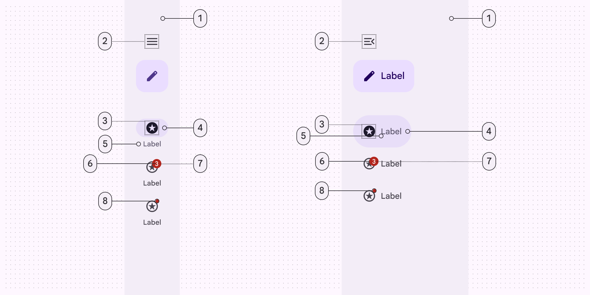
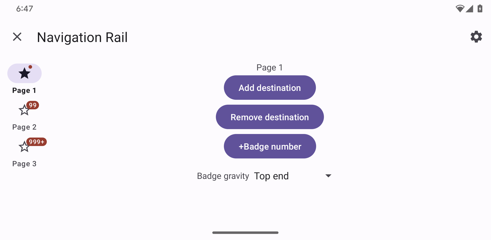
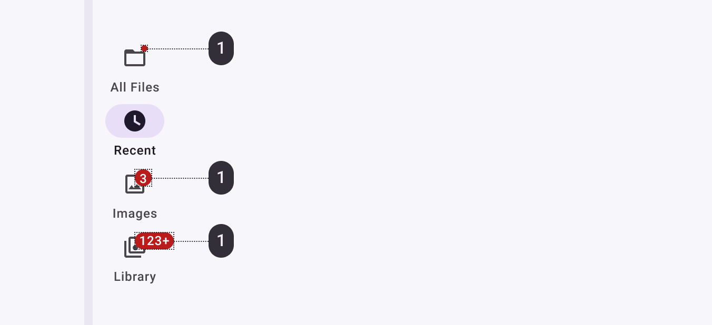
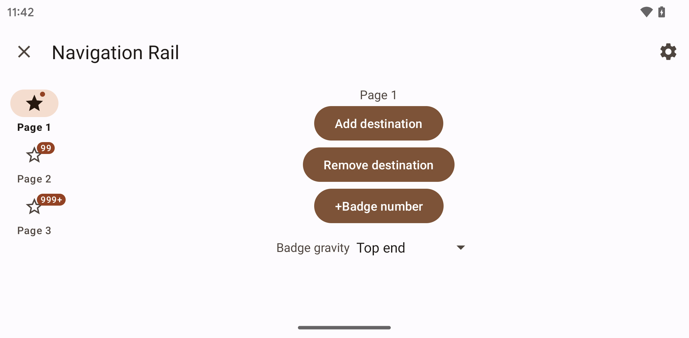

<!--docs:
title: "Navigation rail"
layout: detail
section: components
excerpt: "Navigation rails provide access to primary destinations in your app on tablet and desktop screens.
iconId: navigation_rail
path: /catalog/navigation-rail/
-->

# Navigation rail

[Navigation rail](https://m3.material.io/components/navigation-rail/overview)
lets people switch between UI views on mid-sized devices. There are two types of
navigation rail.


1.  Collapsed navigation rail
2.  Expanded navigation rail

**Note:** Images use various dynamic color schemes.

## Design & API documentation

*   [Material 3 (M3) spec](https://m3.material.io/components/navigation-rail/overview)
*   [API reference](https://developer.android.com/reference/com/google/android/material/navigationrail/package-summary)

## Anatomy


Collapsed and expanded navigation rail elements:

1.  Container
2.  Menu (optional)
3.  FAB or Extended FAB (optional)
4.  Icon
5.  Active indicator
6.  Label text
7.  Large badge (optional)
8.  Large badge label (optional)
9.  Small badge (optional)

More details on anatomy items in the
[component guidelines](https://m3.material.io/components/navigation-rail/guidelines#b51e4558-351f-4368-af8d-bbf1f63f68b4).

## M3 Expressive

### M3 Expressive update

Before you can use `Material3Expressive` component styles, follow the
[`Material3Expressive` themes setup instructions](https://github.com/material-components/material-components-android/tree/master/docs/getting-started.md#material3expressive-themes).


The collapsed and expanded navigation rails match visually and can transition
into each other

The navigation rail can now be **expanded** to show more content, functioning
similarly to a navigation drawer. When not expanded, it is referred to as a
**collapsed navigation rail**, which is its default state.

The expanded nav rail is meant to replace the navigation drawer.
[More on M3 Expressive](https://m3.material.io/blog/building-with-m3-expressive)

**Types and naming:**

*   The original **navigation rail** is now known as **collapsed navigation
    rail**
*   Added two wider navigation rails:
    *   **Collapsed:** Renamed original nav rail
    *   **Expanded:** replaces navigation drawer

**Configurations:**

*   Expanded rail modality:
    *   Non-modal
*   Expanded behavior:
    *   Transition to collapsed navigation rail

**Color:**

*   Active label on vertical items changed from **on surface variant** to
    **secondary**

### M3 Expressive styles

Measurement changes from M3:

*   Width: from 80dp to 96dp
*   Color: new expressive colors!
*   Item minimum height: from 60dp to 64dp
*   Item spacing: from 0dp to 4dp
*   Elevation: from 0dp to 3dp
*   Top item padding: from 4dp to 6dp
*   Bottom item padding: from 12dp to 4dp
*   Top margin of navigation rail content: from 8dp to 44dp
*   Padding between optional header view and navigation rail items: from 8dp to
    40dp
*   Label text is no longer bolded when selected

The default style for navigation rail is:

```xml
<item name="navigationRailStyle">@style/Widget.Material3Expressive.NavigationRailView</item>
```

## Key properties

### Container attributes

Element                                 | Attribute                             | Related methods                                   | Default value
--------------------------------------- | ------------------------------------- | ------------------------------------------------- | -------------
**Color**                               | `app:backgroundTint`                  | N/A                                               | `?attr/colorSurface`
**Elevation**                           | `app:elevation`                       | `setElevation`                                    | `0dp`
**Fits system windows**                 | `android:fitsSystemWindows`           | `getFitsSystemWindows`<br/>`setFitsSystemWindows` | `true`
**Padding top system window insets**    | `app:paddingTopSystemWindowInsets`    | N/A                                               | `null`
**Padding bottom system window insets** | `app:paddingBottomSystemWindowInsets` | N/A                                               | `null`
**Top margin**                          | `app:contentMarginTop`                | N/A                                               | N/A
**Scrolling**                           | `app:scrollingEnabled`                | N/A                                               | `false`

### Header attributes

Element                  | Attribute                | Related methods                                            | Default value
------------------------ | ------------------------ | ---------------------------------------------------------- | -------------
**Header view**          | `app:headerLayout`       | `addHeaderView`<br/>`removeHeaderView`<br/>`getHeaderView` | N/A
**Header bottom margin** | `app:headerMarginBottom` | N/A                                                        | `8dp`

See the
[FAB documentation](https://github.com/material-components/material-components-android/tree/master/docs/components/FloatingActionButton.md)
for more attributes.

### Navigation Menu attributes

Element          | Attribute                    | Related methods                                             | Default value
---------------- | ---------------------------- | ----------------------------------------------------------- | -------------
**Menu gravity** | `app:menuGravity`            | `setMenuGravity`<br/>`getMenuGravity`                       | `TOP\|CENTER_HORIZONTAL`
**Dividers**     | `app:submenuDividersEnabled` | `setSubmenuDividersEnabled`<br/>`getSubmenuDividersEnabled` | `false`

**Note:** If dividers are enabled, they will be between all submenus, which are
only visible when expanded.

### Navigation item attributes

Element                           | Attribute                    | Related methods                                                     | Default value
--------------------------------- | ---------------------------- | ------------------------------------------------------------------- | -------------
**Menu resource**                 | `app:menu`                   | `inflateMenu`<br/>`getMenu`                                         | N/A
**Ripple (inactive)**             | `app:itemRippleColor`        | `setItemRippleColor`<br/>`getItemRippleColor`                       | `?attr/colorPrimary` at 12% (see all [states](https://github.com/material-components/material-components-android/tree/master/lib/java/com/google/android/material/navigation/res/color/mtrl_navigation_bar_ripple_color.xml))
**Ripple (active)**               | `app:itemRippleColor`        | `setItemRippleColor`<br/>`getItemRippleColor`                       | `?attr/colorPrimary` at 12% (see all [states](https://github.com/material-components/material-components-android/tree/master/lib/java/com/google/android/material/navigation/res/color/mtrl_navigation_bar_ripple_color.xml))
**Label visibility mode**         | `app:labelVisibilityMode`    | `setLabelVisibilityMode`<br/>`getLabelVisibilityMode`               | `LABEL_VISIBILITY_AUTO`
**Item minimum height**           | `app:itemMinHeight`          | `setItemMinimumHeight`<br/>`getItemMinimumHeight`                   | `NO_ITEM_MINIMUM_HEIGHT`
**Collapsed item minimum height** | `app:collapsedItemMinHeight` | `setCollapsedItemMinimumHeight`<br/>`getCollapsedItemMinimumHeight` | `NO_ITEM_MINIMUM_HEIGHT`
**Expanded item minimum height**  | `app:expandedItemMinHeight`  | `setExpandedItemMinimumHeight`<br/>`getExpandedItemMinimumHeight`   | `NO_ITEM_MINIMUM_HEIGHT`
**Item spacing**                  | `app:itemSpacing`            | `setItemSpacing`<br/>`getItemSpacing`                               | `0dp`
**Item Gravity**                  | `app:itemGravity`            | `setItemGravity`<br/>`getItemGravity`                               | `TOP_CENTER`

**Note:** If there's not enough room, `itemMinHeight` and `itemSpacing` may not
be respected in order to fit the items.

### Active indicator attributes

Element                                 | Attribute                                  | Related methods                                                                                       | Default value
--------------------------------------- | ------------------------------------------ | ----------------------------------------------------------------------------------------------------- | -------------
**Color**                               | `android:color`                            | `setItemActiveIndicatorColor`<br/>`getItemActiveIndicatorColor`                                       | `?attr/colorSecondaryContainer`
**Width**                               | `android:width`                            | `setItemActiveIndicatorWidth`<br/>`getItemActiveIndicatorWidth`                                       | `56dp`
**Height**                              | `android:height`                           | `setItemActiveIndicatorHeight`<br/>`getItemActiveIndicatorHeight`                                     | `32dp`
**Shape**                               | `app:shapeAppearance`                      | `setItemActiveIndicatorShapeAppearance`<br/>`getItemActiveIndicatorShapeAppearance`                   | `50% rounded`
**Margin horizontal**                   | `app:marginHorizontal`                     | `setItemActiveIndicatorMarginHorizontal`<br/>`getItemActiveIndicatorMarginHorizontal`                 | `4dp`
**Padding between indicator and label** | `app:activeIndicatorLabelPadding`          | `setActiveIndicatorLabelPadding` <br/> `getActiveIndicatorLabelPadding`                               | `4dp`
**Expanded Width**                      | `app:expandedWidth`                        | `setItemActiveIndicatorExpandedWidth`<br/>`getItemActiveIndicatorExpandedWidth`                       | `HUG`
**Expanded Height**                     | `app:expandedHeight`                       | `setItemActiveIndicatorExpandedHeight`<br/>`getItemActiveIndicatorExpandedHeight`                     | `56dp`
**Expanded Margin horizontal**          | `app:expandedMarginHorizontal`             | `setItemActiveIndicatorExpandedMarginHorizontal`<br/>`getItemActiveIndicatorExpandedMarginHorizontal` | `20dp`
**Expanded Start Padding**              | `app:expandedActiveIndicatorPaddingStart`  | `setItemExpandedActiveIndicatorPadding`                                                               | `16dp`
**Expanded End Padding**                | `app:expandedActiveIndicatorPaddingEnd`    | `setItemExpandedActiveIndicatorPadding`                                                               | `16dp`
**Expanded Top Padding**                | `app:expandedActiveIndicatorPaddingTop`    | `setItemExpandedActiveIndicatorPadding`                                                               | `16dp`
**Expanded Bottom Padding**             | `app:expandedActiveIndicatorPaddingBottom` | `setItemExpandedActiveIndicatorPadding`                                                               | `16dp`

**Note:** The expanded active indicator refers to the active indicator that
expands to wrap the content of the navigation rail item when the
`itemIconGravity` value is equal to `START`.

### Icon attributes

Element                           | Attribute                             | Related methods                                                     | Default value
--------------------------------- | ------------------------------------- | ------------------------------------------------------------------- | -------------
**Icon**                          | `android:icon` in the `menu` resource | N/A                                                                 | N/A
**Size**                          | `app:itemIconSize`                    | `setItemIconSize`<br/>`setItemIconSizeRes`<br/>`getItemIconSize`    | `24dp`
**Color (inactive)**              | `app:itemIconTint`                    | `setItemIconTintList`<br/>`getItemIconTintList`                     | `?attr/colorOnSurfaceVariant`
**Color (active)**                | `app:itemIconTint`                    | `setItemIconTintList`<br/>`getItemIconTintList`                     | `?attr/colorOnSecondaryContainer`
**Gravity**                       | `app:itemIconGravity`                 | `setItemIconGravity`<br/>`getItemIconGravity`                       | `TOP`
**Icon label horizontal padding** | `app:iconLabelHorizontalSpacing`      | `setIconLabelHorizontalSpacing`<br/>`getIconLabelHorizontalSpacing` | `8dp`

### Text label attributes

Element                   | Attribute                                                                       | Related methods                                                                                                                                                 | Default value
------------------------- | ------------------------------------------------------------------------------- | --------------------------------------------------------------------------------------------------------------------------------------------------------------- | -------------
**Text label**            | `android:title` in the `menu` resource                                          | N/A                                                                                                                                                             | N/A
**Color (inactive)**      | `app:itemTextColor`                                                             | `setItemTextColor`<br/>`getItemTextColor`                                                                                                                       | `?attr/colorOnSurfaceVariant`
**Color (active)**        | `app:itemTextColor`                                                             | `setItemTextColor`<br/>`getItemTextColor`                                                                                                                       | `?attr/colorOnSurface`
**Typography (inactive)** | `app:itemTextAppearanceInactive`<br/>`app:horizontalItemTextAppearanceInactive` | `setItemTextAppearanceInactive`<br/>`getItemTextAppearanceInactive`<br/>`setHorizontalItemTextAppearanceInactive`<br/>`getHorizontalItemTextAppearanceInactive` | `?attr/textAppearanceTitleSmall` for regular item configuration, `?attr/textAppearanceLabelLarge` for horizontal
**Typography (active)**   | `app:itemTextAppearanceActive`<br/>`app:horizontalItemTextAppearanceActive`     | `setItemTextAppearanceActive`<br/>`getItemTextAppearanceActive`<br/>`setHorizontalItemTextAppearanceActive`<br/>`getHorizontalItemTextAppearanceActive`         | `?attr/textAppearanceTitleSmall` for regular item configuration, `?attr/textAppearanceLabelLarge` for horizontal
**Typography (active)**   | `app:itemTextAppearanceActiveBoldEnabled`                                       | `setItemTextAppearanceActiveBoldEnabled`                                                                                                                        | `true`
**Max lines**             | `app:labelMaxLines`                                                             | `setLabelMaxLines`<br/>`getLabelMaxLines`                                                                                                                       | `1`
**Scale with font size**  | `app:scaleLabelWithFontSize`                                                    | `setScaleLabelTextWithFont`<br/>`getScaleLabelTextWithFont`                                                                                                     | `false`

### Styles

Element           | Style                                 | Container color      | Icon/Text label color (inactive) | Icon/Text label color (active)                               | Theme attribute
----------------- | ------------------------------------- | -------------------- | -------------------------------- | ------------------------------------------------------------ | ---------------
**Default style** | `Widget.Material3.NavigationRailView` | `?attr/colorSurface` | `?attr/colorOnSurfaceVariant`    | `?attr/colorOnSurface`<br/>`?attr/colorOnSecondaryContainer` | `?attr/navigationRailStyle`

For the full list, see
[styles](https://github.com/material-components/material-components-android/tree/master/lib/java/com/google/android/material/navigationrail/res/values/styles.xml),
[navigation bar attributes](https://github.com/material-components/material-components-android/tree/master/lib/java/com/google/android/material/navigation/res/values/attrs.xml),
and
[navigation rail attributes](https://github.com/material-components/material-components-android/tree/master/lib/java/com/google/android/material/navigationrail/res/values/attrs.xml).

## Code implementation

Before you can use the Material navigation rail, you need to add a dependency to
the Material components for Android library. For more information, go to the
[Getting started](https://github.com/material-components/material-components-android/tree/master/docs/getting-started.md)
page.

<details>
<summary><h3>Adding navigation rail</h3></summary>

A typical layout will look similar to this:

```xml
<com.google.android.material.navigationrail.NavigationRailView
    android:id="@+id/navigation_rail"
    android:layout_width="wrap_content"
    android:layout_height="match_parent"
    app:menu="@menu/navigation_rail_menu" />
```

**Note:** The width of a `NavigationRailView` will be 80dp wide by default.The
width of the rail can be changed by setting the `android:layout_width` attribute
to a specific DP value.

In `navigation_rail_menu.xml` inside a `menu` resource directory:

```xml
<menu xmlns:android="http://schemas.android.com/apk/res/android">
  <item
      android:id="@+id/alarms"
      android:enabled="true"
      android:icon="@drawable/icon_alarms"
      android:title="@string/alarms_destination_label"/>
  <item
      android:id="@+id/schedule"
      android:enabled="true"
      android:icon="@drawable/icon_clock"
      android:title="@string/schedule_destination_label"/>
  <item
      android:id="@+id/timer"
      android:enabled="true"
      android:icon="@drawable/icon_sand_clock"
      android:title="@string/timer_destination_label"/>
  <item
      android:id="@+id/stopwatch"
      android:enabled="true"
      android:icon="@drawable/icon_stop_watch"
      android:title="@string/stopwatch_destination_label"/>
</menu>
```

`NavigationRailView` displays three to no more than seven app destinations when
collapsed, and can include a header view. Each destination is represented by an
icon and a text label.

You can also define submenus for the navigation rail like below:

```xml
<menu xmlns:android="http://schemas.android.com/apk/res/android">
    <item
        android:id="@+id/submenu_1"
        android:title="@string/subheader_1_name">
        <menu>
            <item
                android:id="@+id/timer"
                android:enabled="true"
                android:icon="@drawable/icon_sand_clock"
                android:title="@string/timer_destination_label"/>
            <item
                android:id="@+id/stopwatch"
                android:enabled="true"
                android:icon="@drawable/icon_stop_watch"
                android:title="@string/stopwatch_destination_label"/>
        </menu>
    </item>
    <item
        android:id="@+id/alarms"
        android:enabled="true"
        android:icon="@drawable/icon_alarms"
        android:title="@string/alarms_destination_label"/>
    <item
        android:id="@+id/schedule"
        android:enabled="true"
        android:icon="@drawable/icon_clock"
        android:title="@string/schedule_destination_label"/>
</menu>
```

Navigation rails are collapsed by default. When collapsed, only menu items that
are not under a submenu will be shown, up to a limit of 7. There is no limit of
items shown when expanded.

You will need to set listeners for the menu items in code:

```kt
// Listeners are defined on the super class NavigationBarView
// to support both NavigationRail and BottomNavigation with the
// same listeners
NavigationBarView.OnNavigationItemSelectedListener { item ->
    when(item.itemId) {
        R.id.alarms -> {
            // Respond to alarm navigation item click
            true
        }
        R.id.schedule -> {
            // Respond to schedule navigation item click
            true
        }
        else -> false
    }
}
```

There's also a method for detecting if navigation items have been reselected:

```kt
navigationRail.setOnNavigationItemReselectedListener { item ->
    when(item.itemId) {
        R.id.item1 -> {
            // Respond to navigation item 1 reselection
        }
        R.id.item2 -> {
            // Respond to navigation item 2 reselection
        }
    }
}
```

Which results in:



By default, navigation rail adds top and bottom padding according to top and
bottom window insets—helping the header layout and menu items dodge system
spaces. This is controlled by the `android:fitsSystemWindowInsets` attribute,
which is set to true by default. To remove this behavior, set
`android:fitsSystemWindowInsets` to `false` or opt in or out of the top and
bottom insets independently by using `app:paddingTopSystemWindowInsets` and
`app:paddingBottomSystemWindowInsets`.

</details>

<details>
<summary><h3>Navigation rail example</h3></summary>

The following example shows a navigation rail with four icons.


*   Alarms
*   Schedule
*   Timers
*   Stopwatch

In `navigation_rail_menu.xml` inside a `menu` resource directory:

```xml
<menu xmlns:android="http://schemas.android.com/apk/res/android">
  <item
      android:id="@+id/alarms"
      android:enabled="true"
      android:icon="@drawable/icon_alarm"
      android:title="@string/alarms_destination_label"/>
  <item
      android:id="@+id/schedule"
      android:enabled="true"
      android:icon="@drawable/icon_clock"
      android:title="@string/schedule_destination_label"/>
  <item
      android:id="@+id/timers"
      android:enabled="true"
      android:icon="@drawable/icon_sand_clock"
      android:title="@string/timers_destination_label"/>
  <item
      android:id="@+id/stopwatch"
      android:enabled="true"
      android:icon="@drawable/icon_stop_watch"
      android:title="@string/stopwatch_destination_label"/>
</menu>
```

In code:

```kt
navigationRail.selectedItemId = R.id.schedule
```

</details>

<details>
<summary><h3>Making navigation rail accessible</h3></summary>

You should set an `android:title` for each of your `menu` items so that screen
readers like TalkBack can properly announce what each navigation item
represents:

```xml
<menu xmlns:android="http://schemas.android.com/apk/res/android">
  <item
      ...
      android:title="@string/text_label"/>
  ...
</menu>
```

The `labelVisibilityMode` attribute can be used to adjust the behavior of the
text labels for each navigation item. There are four visibility modes:

*   `LABEL_VISIBILITY_AUTO` (default): The label behaves as “labeled” when there
    are 3 items or less, or “selected” when there are 4 items or more
*   `LABEL_VISIBILITY_SELECTED`: The label is only shown on the selected
    navigation item
*   `LABEL_VISIBILITY_LABELED`: The label is shown on all navigation items
*   `LABEL_VISIBILITY_UNLABELED`: The label is hidden for all navigation items

</details>

<details>
<summary><h3>Expanding navigation rail</h3></summary>

You can call `navigationRailView.expand()` and `navigationRailView.collapse()`
to expand and collapse the navigation rail. When collapsed, only menu items not
under a submenu will be shown, up to a limit of 7. When expanded, all menu items
will be shown, including submenu items.

Navigation rails are collapsed by default which animates into the expanded
navigation rail when expanded. If the content beside the navigation rail takes
into account the size of the navigation rail (ie., through setting constraints
in `ConstraintLayout` or layout weights) then the content will also be animated
to shrink. This animation is taken care of by a
[ChangeBounds Transition](https://developer.android.com/reference/android/transition/ChangeBounds);
any animations during the expansion of the navigation rail should be 'turned
off' as it could result in a strange animation due to the `Transition`.

Collapsed navigation rail <div style="width:420px"></div>                                              | Expanded navigation rail <div style="width:420px"></div>
:----------------------------------------------------------------------------------------------------: | :------------------------------------------------------:
 | 

</details>

<details>
<summary><h3>Adding badges</h3></summary>

Rail icons can include badges on the upper right corner of the icon. Badges
convey dynamic information about the associated destination, such as counts or
status.



Initialize and show a `BadgeDrawable` associated with `menuItemId`. Subsequent
calls to this method will reuse the existing `BadgeDrawable`:

```kt
var badge = navigationRail.getOrCreateBadge(menuItemId)
badge.isVisible = true
// An icon only badge will be displayed unless a number or text is set:
badge.number = 99  // or badge.text = "New"
```

As best practice, if you need to temporarily hide the badge, for example until
the next notification is received, change the visibility of `BadgeDrawable`:

```kt
val badgeDrawable = navigationRail.getBadge(menuItemId)
    if (badgeDrawable != null) {
        badgeDrawable.isVisible = false
        badgeDrawable.clearNumber()  // or badgeDrawable.clearText()
    }
```

To remove any `BadgeDrawable`s that are no longer needed:

```kt
navigationRail.removeBadge(menuItemId)
```

See the [`Badge`](BadgeDrawable.md) documentation for more information.

</details>

<details>
<summary><h3>Adding header view</h3></summary>

The rail provides a convenient container for anchoring a header view, such as a
`FloatingActionButton` or a logo, to the top of the rail, using the
`app:headerLayout` attribute.


```xml
<com.google.android.material.navigationrail.NavigationRailView
    android:id="@+id/navigation_rail"
    android:layout_width="wrap_content"
    android:layout_height="wrap_content"
    app:headerLayout="@layout/navigation_rail_fab"
    app:menu="@menu/navigation_rail_menu" />
```

The header view can also be added or removed at runtime using the following
methods:

| Method | Description |
|---|---|
| `addHeaderView(@NonNull View view)` | Attaches the specified header view to the top of the NavigationRailView. If a header view is already attached, it will be removed first. |
| `removeHeaderView()` | Detaches the current header view, if any, from the Navigation Rail. |
The following methods can be used to manipulate the header view at runtime.

| Method                           | Description                               |
| -------------------------------- | ----------------------------------------- |
| `@Nullable View getHeaderView()` | Returns an instance of the header view    |
:                                  : associated with the Navigation Rail, null :
:                                  : if none was currently attached.           :

</details>

## Customizing navigation rail

### Theming navigation rail

Navigation rail supports the customization of color and typography.

#### Navigation rail theming example

API and source code:

*   `NavigationRailView`
    *   [Class description](https://developer.android.com/reference/com/google/android/material/navigationrail/NavigationRailView)
    *   [Class source](https://github.com/material-components/material-components-android/tree/master/lib/java/com/google/android/material/navigationrail/NavigationRailView.java)

The following example shows a navigation rail with Material theming.



##### Implementing navigation rail theming

Use theme attributes and a style in `res/values/styles.xml` which apply to all
navigation rails and affect other components:

```xml
<style name="Theme.App" parent="Theme.Material3.*">
    ...
    <item name="colorPrimary">@color/shrine_theme_light_primary</item>
    <item name="colorSecondaryContainer">@color/shrine_theme_light_secondaryContainer</item>
    <item name="colorOnSecondaryContainer">@color/shrine_theme_light_onSecondaryContainer</item>
    <item name="colorTertiaryContainer">@color/shrine_theme_light_tertiaryContainer</item>
    <item name="colorOnTertiaryContainer">@color/shrine_theme_light_onTertiaryContainer</item>
    <item name="colorError">@color/shrine_theme_light_error</item>
    <item name="colorErrorContainer">@color/shrine_theme_light_errorContainer</item>
    <item name="colorOnError">@color/shrine_theme_light_onError</item>
    <item name="colorOnErrorContainer">@color/shrine_theme_light_onErrorContainer</item>
    <item name="colorSurface">@color/shrine_theme_light_surface</item>
    <item name="colorOnSurface">@color/shrine_theme_light_onSurface</item>
    <item name="colorOnSurfaceVariant">@color/shrine_theme_light_onSurfaceVariant</item>
</style>
```

Use a default style theme attribute, styles, and a theme overlay, which apply to
all navigation rails but do not affect other components:

```xml
<style name="Theme.App" parent="Theme.Material3.*">
    ...
    <item name="navigationRailStyle">@style/Widget.App.NavigationRailView</item>
</style>

<style name="Widget.App.NavigationRailView" parent="Widget.Material3.NavigationRailView">
    <item name="materialThemeOverlay">@style/ThemeOverlay.App.NavigationRailView</item>
</style>

<style name="ThemeOverlay.App.NavigationRailView" parent="">
    <item name="colorPrimary">@color/shrine_theme_light_primary</item>
    <item name="colorSecondaryContainer">@color/shrine_theme_light_secondaryContainer</item>
    <item name="colorOnSecondaryContainer">@color/shrine_theme_light_onSecondaryContainer</item>
    <item name="colorTertiaryContainer">@color/shrine_theme_light_tertiaryContainer</item>
    <item name="colorOnTertiaryContainer">@color/shrine_theme_light_onTertiaryContainer</item>
    <item name="colorError">@color/shrine_theme_light_error</item>
    <item name="colorErrorContainer">@color/shrine_theme_light_errorContainer</item>
    <item name="colorOnError">@color/shrine_theme_light_onError</item>
    <item name="colorOnErrorContainer">@color/shrine_theme_light_onErrorContainer</item>
    <item name="colorSurface">@color/shrine_theme_light_surface</item>
    <item name="colorOnSurface">@color/shrine_theme_light_onSurface</item>
    <item name="colorOnSurfaceVariant">@color/shrine_theme_light_onSurfaceVariant</item>
</style>
```

Or use the style in the layout, which affects only this specific navigation rail
bar:

```xml
<com.google.android.material.navigationrail.NavigationRailView
    ...
    style="@style/Widget.App.NavigationRailView"
/>
```
