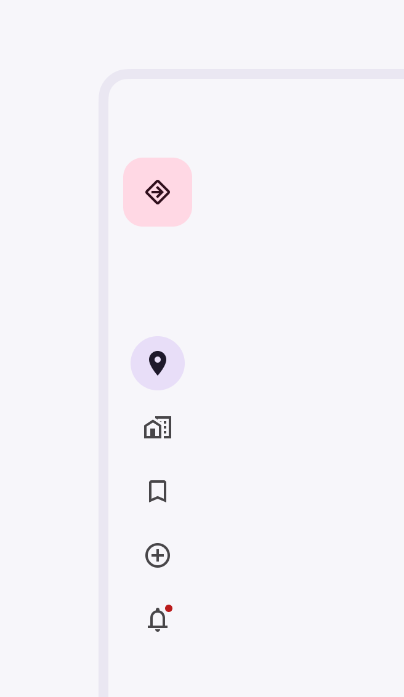

<!--docs:
title: "Navigation Rail"
layout: detail
section: components
excerpt: "Navigation rails provide ergonomic movement between primary destinations in apps running on a large screen device"
iconId: navigation_rail
path: /catalog/navigation-rail/
-->

# Navigation Rail

[Navigation rail](https://material.io/components/navigation-rail/#) allows
movement between primary destinations in an app.


**Contents**

*   [Using navigation rail](#using-navigation-rail)
*   [Navigation rail example](#navigation-rail-example)
*   [Theming](#theming-a-navigation-rail)

## Using navigation rail

Before you can use the Material Navigation Rail, you need to add a dependency to
the Material Components for Android library. For more information, go to the
[Getting started](https://github.com/material-components/material-components-android/tree/master/docs/getting-started.md)
page.

A typical layout will look similar to this:

```xml
<com.google.android.material.navigationrail.NavigationRailView
    android:id="@+id/navigation_rail"
    android:layout_width="wrap_content"
    android:layout_height="match_parent"
    app:menu="@menu/navigation_rail_menu" />
```

**Note:** The width of a `NavigationRailView` will be 72dp wide by default. This
can be changed to 52dp wide by setting the component style to
`Widget.MaterialComponents.NavigationRailView.Compact` or
`Widget.MaterialComponents.NavigationRailView.Colored.Compact` in the layout.
The width of the rail can also be changed by setting the `android:layout_width`
attribute to a specific DP value.

In `navigation_rail_menu.xml` inside a `menu` resource directory:

```xml
<menu xmlns:android="http://schemas.android.com/apk/res/android">
  <item
      android:id="@+id/alarms"
      android:enabled="true"
      android:icon="@drawable/icon_alarms"
      android:title="@string/alarms_destination_label"/>
  <item
      android:id="@+id/schedule"
      android:enabled="true"
      android:icon="@drawable/icon_clock"
      android:title="@string/schedule_destination_label"/>
  <item
      android:id="@+id/timer"
      android:enabled="true"
      android:icon="@drawable/icon_sand_clock"
      android:title="@string/timer_destination_label"/>
  <item
      android:id="@+id/stopwatch"
      android:enabled="true"
      android:icon="@drawable/icon_stop_watch"
      android:title="@string/stopwatch_destination_label"/>
</menu>
```

**Note:** `NavigationRailView` displays three to no more than seven app
destinations and, optionally, a header view. Each destination is represented by
an icon and a text label.

In code:

```kt
NavigationRailView.OnNavigationItemSelectedListener { item ->
    when(item.itemId) {
        R.id.item1 -> {
            // Respond to navigation item 1 click
            true
        }
        R.id.item2 -> {
            // Respond to navigation item 2 click
            true
        }
        else -> false
    }
}
```

There's also a method for detecting when navigation items have been reselected:

```kt
navigationRail.setOnNavigationItemReselectedListener { item ->
    when(item.itemId) {
        R.id.item1 -> {
            // Respond to navigation item 1 reselection
        }
        R.id.item2 -> {
            // Respond to navigation item 2 reselection
        }
    }
}
```

That results in:


### Making navigation rail accessible

You should set an `android:title` for each of your `menu` items so that screen
readers like TalkBack can properly announce what each navigation item
represents:

```xml
<menu xmlns:android="http://schemas.android.com/apk/res/android">
  <item
      ...
      android:title="@string/text_label"/>
  ...
</menu>
```

The `labelVisibilityMode` attribute can be used to adjust the behavior of the
text labels for each navigation item. There are four visibility modes:

*   `LABEL_VISIBILITY_AUTO` (default): The label behaves as “labeled” when there
    are 3 items or less, or “selected” when there are 4 items or more
*   `LABEL_VISIBILITY_SELECTED`: The label is only shown on the selected
    navigation item
*   `LABEL_VISIBILITY_LABELED`: The label is shown on all navigation items
*   `LABEL_VISIBILITY_UNLABELED`: The label is hidden for all navigation items

### Adding a header view

The rail provides a convenient container for anchoring the header view to the
top of the rail, using the `app:headerLayout` attribute.



```xml
<com.google.android.material.navigationrail.NavigationRailView
    android:id="@+id/navigation_rail"
    android:layout_width="wrap_content"
    android:layout_height="wrap_content"
    app:headerLayout="@layout/navigation_rail_fab"
    app:menu="@menu/navigation_rail_menu" />
```

The header view can also be added or removed at runtime using the following
methods:

| **Method**                          | **Description**                       |
| ----------------------------------- | ------------------------------------- |
| `void addHeaderView(@NonNull` `View | The specified header view will be     |
: view)`                              : attached to the `NavigationRailView`, :
:                                     : so that it will appear at the top. If :
:                                     : the view already has a header view    :
:                                     : attached to it, it will be removed    :
:                                     : first.                                :
| `void removeHeaderView()`           | Detaches the current header view if   |
:                                     : any, from the Navigation Rail.        :

The following methods can be used to manipulate the header view at runtime.

| **Method**                       | **Description**                           |
| -------------------------------- | ----------------------------------------- |
| `@Nullable view getHeaderView()` | Returns an instance of the header view    |
:                                  : associated with the Navigation Rail, null :
:                                  : if none was currently attached.           :

### Adding badges

Rail icons can include badges on the upper right corner of the icon. Badges
convey dynamic information about the associated destination, such as counts or
status.


Initialize and show a `BadgeDrawable` associated with `menuItemId`, subsequent
calls to this method will reuse the existing `BadgeDrawable`:

```kt
var badge = navigationRail.getOrCreateBadge(menuItemId)
badge.isVisible = true
// An icon only badge will be displayed unless a number is set:
badge.number = 99
```

As best practice if you need to temporarily hide the badge (e.g. until the next
notification is received), change the visibility of `BadgeDrawable`:

```kt
val badgeDrawable = navigationRail.getBadge(menuItemId)
    if (badgeDrawable != null) {
        badgeDrawable.isVisible = false
        badgeDrawable.clearNumber()
    }
```

To remove any `BadgeDrawable`s that are no longer needed:

```kt
navigationRail.removeBadge(menuItemId)
```

See the [`BadgeDrawable`](BadgeDrawable.md) documentation for more information
about it.

## Navigation rail example

API and source code:

*   `NavigationRailView`
    *   [Class description](https://developer.android.com/reference/com/google/android/material/navigationrail/NavigationRailView)
    *   [Class source](https://github.com/material-components/material-components-android/tree/master/lib/java/com/google/android/material/navigationrail/NavigationRailView.java)

The following example shows a navigation rail with four icons in dense layout:

*   Alarms
*   Schedule
*   Timers
*   Stopwatch


In `layout.xml`:

```xml
<LinearLayout
    xmlns:android="http://schemas.android.com/apk/res/android"
    xmlns:app="http://schemas.android.com/apk/res-auto"
    android:layout_width="match_parent"
    android:layout_height="match_parent">

  <com.google.android.material.navigationrail.NavigationRailView
      android:id="@+id/navigation_rail"
      style="@style/Widget.MaterialComponents.NavigationRailView.Colored.Compact"
      android:layout_width="wrap_content"
      android:layout_height="match_parent"
      app:menu="@menu/navigation_rail_menu" />

</LinearLayout>
```

In `navigation_rail_menu.xml` inside a `menu` resource directory:

```xml
<menu xmlns:android="http://schemas.android.com/apk/res/android">
  <item
      android:id="@+id/alarms"
      android:enabled="true"
      android:icon="@drawable/icon_alarm"
      android:title="@string/alarms_destination_label"/>
  <item
      android:id="@+id/schedule"
      android:enabled="true"
      android:icon="@drawable/icon_clock"
      android:title="@string/schedule_destination_label"/>
  <item
      android:id="@+id/timers"
      android:enabled="true"
      android:icon="@drawable/icon_sand_clock"
      android:title="@string/timers_destination_label"/>
  <item
      android:id="@+id/stopwatch"
      android:enabled="true"
      android:icon="@drawable/icon_stop_watch"
      android:title="@string/stopwatch_destination_label"/>
</menu>
```

In code:

```kt
navigationRail.selectedItemId = R.id.images
```

### Anatomy and key properties

The following is an anatomy diagram for the navigation rail:


1.  Container
2.  Floating Action Button (optional)
3.  A destination
4.  Text label
5.  Divider (optional)

#### Container attributes

| Element       | **Attribute**        | **Related methods** | **Default value**    |
| ------------- | -------------------- | ------------------- | -------------------- |
| **Color**     | `app:backgroundTint` | N/A                 | `?attr/colorSurface` |
| **Elevation** | `app:elevation`      | `setElevation`      | `8dp`                |

#### Navigation item attributes

Element                   | **Attribute**             | **Related methods**                                   | **Default value**
------------------------- | ------------------------- | ----------------------------------------------------- | -----------------
**Menu resource**         | `app:menu`                | `inflateMenu`<br/>`getMenu`                           | N/A
**Ripple (inactive)**     | `app:itemRippleColor`     | `setItemRippleColor`<br/>`getItemRippleColor`         | `?attr/colorOnSurface` at 8% (see all [states](https://github.com/material-components/material-components-android/tree/master/lib/java/com/google/android/material/navigation/res/color/mtrl_navigation_bar_ripple_color.xml))
**Ripple (active)**       | `app:itemRippleColor`     | `setItemRippleColor`<br/>`getItemRippleColor`         | `?attr/colorPrimary` at 8% (see all [states](https://github.com/material-components/material-components-android/tree/master/lib/java/com/google/android/material/navigation/res/color/mtrl_navigation_bar_ripple_color.xml))
**Label visibility mode** | `app:labelVisibilityMode` | `setLabelVisibilityMode`<br/>`getLabelVisibilityMode` | `LABEL_VISIBILITY_AUTO`

#### Icon attributes

Element              | **Attribute**                         | **Related methods**                                              | **Default value**
-------------------- | ------------------------------------- | ---------------------------------------------------------------- | -----------------
**Icon**             | `android:icon` in the `menu` resource | N/A                                                              | N/A
**Size**             | `app:itemIconSize`                    | `setItemIconSize`<br/>`setItemIconSizeRes`<br/>`getItemIconSize` | `24dp`
**Color (inactive)** | `app:itemIconTint`                    | `setItemIconTintList`<br/>`getItemIconTintList`                  | `?attr/colorOnSurface` at 60%
**Color (active)**   | `app:itemIconTint`                    | `setItemIconTintList`<br/>`getItemIconTintList`                  | `?attr/colorPrimary`

#### Text label attributes

Element                   | **Attribute**                          | **Related methods**                                                 | **Default value**
------------------------- | -------------------------------------- | ------------------------------------------------------------------- | -----------------
**Text label**            | `android:title` in the `menu` resource | N/A                                                                 | N/A
**Color (inactive)**      | `app:itemTextColor`                    | `setItemTextColor`<br/>`getItemTextColor`                           | `?attr/colorOnSurface` at 60%
**Color (active)**        | `app:itemTextColor`                    | `setItemTextColor`<br/>`getItemTextColor`                           | `?attr/colorPrimary`
**Typography (inactive)** | `app:itemTextAppearanceInactive`       | `setItemTextAppearanceInactive`<br/>`getItemTextAppearanceInactive` | `?attr/textAppearanceCaption`
**Typography (active)**   | `app:itemTextAppearanceActive`         | `setItemTextAppearanceActive`<br/>`getItemTextAppearanceActive`     | `?attr/textAppearanceCaption`

#### Styles

Element                        | **Style**                                                     | **Container color**                                                        | **Icon/Text label color (inactive)**                                                          | **Icon/Text label color (active)**
------------------------------ | ------------------------------------------------------------- | -------------------------------------------------------------------------- | --------------------------------------------------------------------------------------------- | ----------------------------------
**Default style**              | `Widget.MaterialComponents.NavigationRailView`                | `?attr/colorSurface`                                                       | `?attr/colorOnSurface` at 60%                                                                 | `?attr/colorPrimary`
**Colored style**              | `Widget.MaterialComponents.NavigationRailView.Colored`        | `?attr/colorPrimary`                                                       | `?attr/colorOnPrimary` at 60%                                                                 | `?attr/colorOnPrimary`
**Dark theme supported style** | `Widget.MaterialComponents.NavigationRailView.PrimarySurface` | `?attr/colorPrimary` in light theme<br/>`?attr/colorSurface` in dark theme | `?attr/colorOnPrimary` at 60% in light theme<br/>`?attr/colorOnSurface` at 60% in light theme | `?attr/colorOnPrimary` in light theme<br/>`?attr/colorPrimary` in dark theme

Default style theme attribute: `?attr/navigationRailStyle`

**Note:** The `Widget.MaterialComponents.NavigationRailView.PrimarySurface`
style will automatically switch between between the component's primary colored
style in light theme and surface colored style in dark theme. More information
in the
[Dark theme documentation](https://github.com/material-components/material-components-android/tree/master/docs/theming/Dark.md#primary-vs-surface-coloring-for-large-surfaces).

See the full list of
[styles](https://github.com/material-components/material-components-android/tree/master/lib/java/com/google/android/material/navigationrail/res/values/styles.xml),
[navigation bar attributes](https://github.com/material-components/material-components-android/tree/master/lib/java/com/google/android/material/navigation/res/values/attrs.xml),
and
[navigation rail attributes](https://github.com/material-components/material-components-android/tree/master/lib/java/com/google/android/material/navigationrail/res/values/attrs.xml).

## Theming a navigation rail

Navigation rail supports
[Material Theming](https://material.io/components/navigation-rail#theming) and
can be customized in terms of color and typography.

### Navigation rail theming example

API and source code:

*   `NavigationRailView`
    *   [Class description](https://developer.android.com/reference/com/google/android/material/navigationrail/NavigationRailView)
    *   [Class source](https://github.com/material-components/material-components-android/tree/master/lib/java/com/google/android/material/navigationrail/NavigationRailView.java)

The following example shows a navigation rail with Material Theming.


#### Implementing navigation rail theming

Using theme attributes and a style in `res/values/styles.xml` (themes all bottom
navigation rails and affects other components):

```xml
<style name="Theme.App" parent="Theme.MaterialComponents.*">
    ...
    <item name="navigationRailStyle">@style/Widget.MaterialComponents.NavigationRailView.Colored</item>
    <item name="colorPrimary">@color/shrine_pink_100</item>
    <item name="colorOnPrimary">@color/shrine_pink_900</item>
</style>
```

Or using a default style theme attribute, styles, and a theme overlay (themes
all navigation rails but does not affect other components):

```xml
<style name="Theme.App" parent="Theme.MaterialComponents.*">
    ...
    <item name="navigationRailStyle">@style/Widget.App.NavigationRailView</item>
</style>

<style name="Widget.App.NavigationRailView" parent="Widget.MaterialComponents.NavigationRailView.Colored">
    <item name="materialThemeOverlay">@style/ThemeOverlay.App.NavigationRailView</item>
</style>

<style name="ThemeOverlay.App.NavigationRailView" parent="">
    <item name="colorPrimary">@color/shrine_pink_100</item>
    <item name="colorOnPrimary">@color/shrine_pink_900</item>
</style>
```

Or using the style in the layout (affects only this specific navigation rail
bar):

```xml
<com.google.android.material.navigationrail.NavigationRailView
    ...
    style="@style/Widget.App.NavigationRailView"
/>
```
