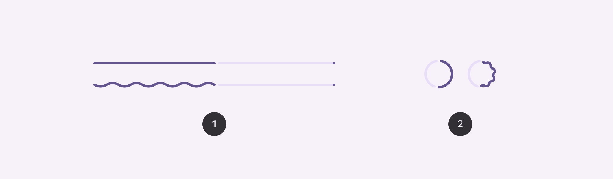
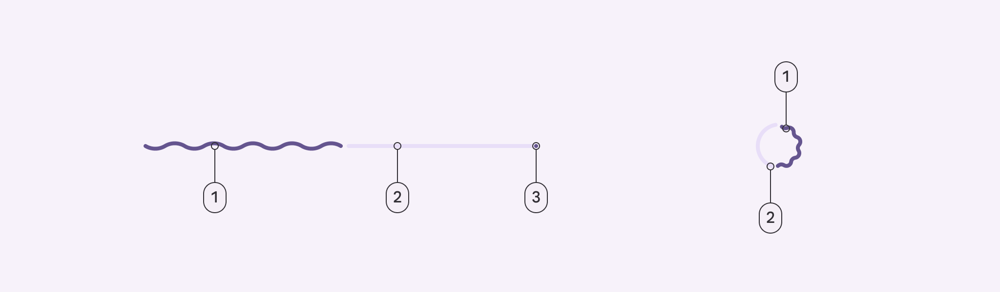
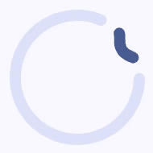
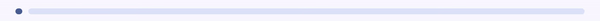
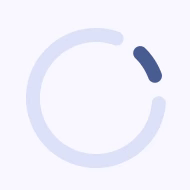
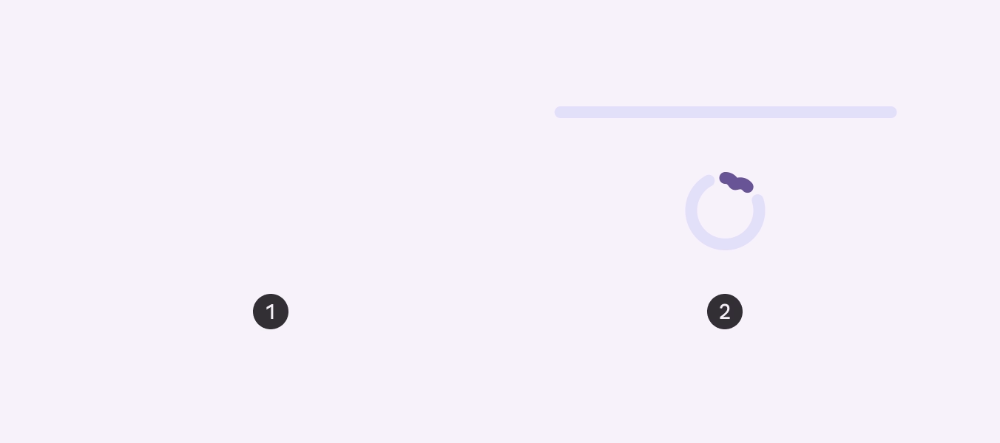
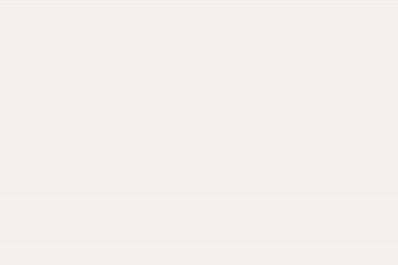
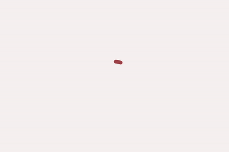

<!--docs:
title: "Progress indicators"
layout: detail
section: components
excerpt: "Progress indicators express an unspecified wait time or display the length of a process."
iconId: progress_indicator
path: /catalog/progress-indicators/
-->

# Progress indicators

[Progress indicators](https://material.io/components/progress-indicators)
express an unspecified wait time or display the length of a process. Progress
indicators show the status of a process in real time. There are two variants of
progress indicators.



1.  Linear progress indicator
2.  Circular progress indicator

**Note:** Images use various dynamic color schemes.

## Design & API documentation

*   [Material 3 (M3) spec](https://m3.material.io/components/progress-indicators/overview/)
*   [API reference](https://developer.android.com/reference/com/google/android/material/progressindicator/package-summary)

## Anatomy



1.  Active indicator
2.  Track
3.  Stop indicator

More details on anatomy items in the
[component guidelines](https://m3.material.io/components/progress-indicators/guidelines#f4cc8d62-23b8-47e5-8ffa-5684ef4f1975).

## M3 Expressive

### M3 Expressive update

Before you can use `Material3Expressive` component styles, follow the
[`Material3Expressive` themes setup instructions](https://github.com/material-components/material-components-android/tree/master/docs/getting-started.md#material3expressive-themes).


Progress indicators have a new rounded, colorful style, and more configurations
to choose from, including a wavy shape and variable track height

**New configurations:**

*   Track height: Thick (8dp)
*   Shape: Wavy

### M3 Expressive styles

<details>
<summary><h4>Wavy</h4></summary>

Wavy progress indicators offer both determinate and indeterminate variants, but
also allow you to customize their appearance with various wave parameters for
more expressive visuals.


Wavy linear indicators increase the height of the overall container

**Note**: The wavy shape can make longer processes feel less static and is
best used when a more expressive style is appropriate. When using the wavy shape
, the overall height of the component changes. At very small sizes, the wavy
shape may not be as visible.

There are two variants of wavy progress indicators: **Linear** and **Circular**

##### Linear

###### Indeterminate


A new variant with wavy tracks is added in expressive. There's no dedicated
theme attribute for this variant added in either `Material3` themes or
`Material3Expressive` themes. It has to be configured by setting the style
as below.

```xml
<com.google.android.material.progressindicator.LinearProgressIndicator
    android:id="@+id/linear_progress_indicator"
    style="@style/Widget.Material3Expressive.LinearProgressIndicator.Wavy"
    android:layout_width="match_parent"
    android:layout_height="wrap_content"
    android:indeterminate="true" />
```

###### Thick indeterminate


A variant with a thicker track can be configured via `trackThickness` attribute
as below. The recommended value is `8dp`. To keep the track fully rounded, the
`trackCornerRadius` should be set to `4dp`.

```xml
<com.google.android.material.progressindicator.LinearProgressIndicator
    android:id="@+id/linear_progress_indicator"
    style="@style/Widget.Material3Expressive.LinearProgressIndicator.Wavy"
    android:layout_width="match_parent"
    android:layout_height="wrap_content"
    android:indeterminate="true"
    app:trackCornerRadius="4dp"
    app:trackThickness="8dp" />
```

It can also be configured via the attributes like `waveLength`, `waveAmplitude`,
etc, for more waviness or thicker track customization.

##### Circular

###### Indeterminate



A new variant with wavy tracks is added in Expressive. There's no theme
attribute for this variant added in either `Material3` themes or
`Material3Expressive` themes. It has to be configured by setting the style
as below.

```xml
<com.google.android.material.progressindicator.CircularProgressIndicator
    android:id="@+id/circular_progress_indicator"
    style="@style/Widget.Material3Expressive.CircularProgressIndicator.Wavy"
    android:layout_width="match_parent"
    android:layout_height="wrap_content"
    android:indeterminate="true" />
```

###### Thick indeterminate


A variant with a thicker track can be configured via `trackThickness` attribute
as below. The recommended value is `8dp`. To keep the track fully rounded,
the `trackCornerRadius` should be set to `4dp`. The `indicatorSize` is also
recommended to increase to `52dp`.

```xml
<com.google.android.material.progressindicator.CircularProgressIndicator
    android:id="@+id/circular_progress_indicator"
    style="@style/Widget.Material3Expressive.CircularProgressIndicator.Wavy"
    android:layout_width="match_parent"
    android:layout_height="wrap_content"
    android:indeterminate="true"
    app:indicatorSize="52dp"
    app:trackCornerRadius="4dp"
    app:trackThickness="8dp" />
```

It can also be configured via the attributes like `waveLength`, `waveAmplitude`,
etc. for more waviness or thicker track customization.

</details>

<details><summary><h4>Flat</h4></summary>

There are two variants of flat progress indicators: **Linear** and **Circular**.

##### Linear

###### Indeterminate



The default `LinearProgressIndicator` style in `Material3Expressive`
themes is the same as the `Material3` themes with a 4dp thick flat track,
`colorPrimary` for indicator color and `colorPrimaryContainer` for track color.

```xml
<com.google.android.material.progressindicator.LinearProgressIndicator
    android:id="@+id/linear_progress_indicator"
    android:layout_width="match_parent"
    android:layout_height="wrap_content"
    android:indeterminate="true" />
```

###### Thick indeterminate


To have a thick flat track, it can be configured via `trackThickness` attribute
as below. The recommended value is `8dp`. To keep the track fully rounded,
the `trackCornerRadius` should be set to `4dp`.

```xml
<com.google.android.material.progressindicator.LinearProgressIndicator
    android:id="@+id/linear_progress_indicator"
    android:layout_width="match_parent"
    android:layout_height="wrap_content"
    android:indeterminate="true"
    app:trackCornerRadius="4dp"
    app:trackThickness="8dp" />
```

##### Circular

###### Indeterminate



The default `CircularProgressIndicator` style in `Material3Expressive`
themes is same as the `Material3` themes with a 4dp track, `colorPrimary`
indicator color and `colorPrimaryContainer` track color. However, in the
indeterminate mode, it has a new animation and the inactive track is also
visible by default.

```xml
<com.google.android.material.progressindicator.CircularProgressIndicator
    android:id="@+id/circular_progress_indicator"
    android:layout_width="wrap_content"
    android:layout_height="wrap_content"
    android:indeterminate="true" />
```

###### Thick indeterminate


To have a thick flat track, it can be configured via `trackThickness` attribute
as below. The recommended value for `trackThickness` is `8dp`. To keep the track
fully rounded, the `trackCornerRadius` should be set to `4dp`. The
`indicatorSize` is also recommended to increase to `44dp`.

```xml
<com.google.android.material.progressindicator.CircularProgressIndicator
    android:id="@+id/circular_progress_indicator"
    android:layout_width="match_parent"
    android:layout_height="wrap_content"
    android:indeterminate="true"
    app:indicatorSize="44dp"
    app:trackCornerRadius="4dp"
    app:trackThickness="8dp" />
```

</details>

## Key properties

### Common attributes

The following attributes are shared between linear and circular progress
indicators:

Element                                   | Attribute                                | Related method(s)                                                                  | Default value
----------------------------------------- | ---------------------------------------- | ---------------------------------------------------------------------------------- | -------------
**Track thickness**                       | `app:trackThickness`                     | `setTrackThickness`<br>`getTrackThickness`                                         | `4dp`
**Indicator color**                       | `app:indicatorColor`                     | `setIndicatorColor`<br>`getIndicatorColor`                                         | `colorPrimary`
**Track color**                           | `app:trackColor`                         | `setTrackColor`<br>`getTrackColor`                                                 | `colorPrimaryContainer` (linear)<br>`@android:color/transparent` (circular)
**Track corner radius**                   | `app:trackCornerRadius`                  | `setTrackCornerRadius`<br>`setTrackCornerRadiusFraction`<br>`getTrackCornerRadius` | `50%`
**Indicator track gap size**              | `app:indicatorTrackGapSize`              | `setIndicatorTrackGapSize`<br>`getIndicatorTrackGapSize`                           | `4dp`
**Show animation behavior**               | `app:showAnimationBehavior`              | `setShowAnimationBehavior`<br>`getShowAnimationBehavior`                           | `none`
**Hide animation behavior**               | `app:hideAnimationBehavior`              | `setHideAnimationBehavior`<br>`getHideAnimationBehavior`                           | `none`
**Delay (in ms) to show**                 | `app:showDelay`                          | N/A                                                                                | 0
**Min delay (in ms) to hide**             | `app:minHideDelay`                       | N/A                                                                                | 0
**Wavelength**                            | `app:wavelength`                         | `setWavelength`                                                                    | 0
**Wavelength in determinate mode**        | `app:wavelengthDeterminate`              | `setWavelengthDeterminate`<br>`getWavelenthDeterminate`                            | `wavelength`
**Wavelength in indeterminate mode**      | `app:wavelengthIndeterminate`            | `setWavelengthIndeterminate`<br>`getWavelengthIndeterminate`                       | `wavelength`
**Wave amplitude**                        | `app:waveAmplitude`                      | `setWaveAmplitude`<br>`getWaveAmplitude`                                           | 0
**Wave speed**                            | `app:waveSpeed`                          | `setWaveSpeed`<br>`getWaveSpeed`                                                   | 0
**Indeterminate animator duration scale** | `app:indeterminateAnimatorDurationScale` | `setIndeterminateAnimatorDurationScale`                                            | 1
**Wave amplitude ramp up progress**       | `app:waveAmplitudeRampProgressMin`       | `setWaveAmplitudeRampProgressRange`                                                | 0.1
**Wave amplitude ramp down progress**     | `app:waveAmplitudeRampProgressMax`       | `setWaveAmplitudeRampProgressRange`                                                | 0.9

### Linear type specific attributes

Linear type progress indicators also have the following attributes:

Element                          | Attribute                        | Related method(s)                                                                                 | Default value
-------------------------------- | -------------------------------- | ------------------------------------------------------------------------------------------------- | -------------
**Indeterminate animation type** | `app:indeterminateAnimationType` | `setIndeterminateAnimationType`<br>`getIndeterminateAnimationType`                                | `disjoint`
**Indicator direction**          | `app:indicatorDirectionLinear`   | `setIndicatorDirection`<br>`getIndicatorDirection`                                                | `leftToRight`
**Track stop indicator size**    | `app:trackStopIndicatorSize`     | `setTrackStopIndicatorSize`<br>`getTrackStopIndicatorSize`                                        | `4dp`
**Track stop indicator padding** | `app:trackStopIndicatorPadding`  | `setTrackStopIndicatorPadding`<br>`getTrackStopIndicatorPadding`                                  | `none`
**Track inner corner radius**    | `app:trackInnerCornerRadius`     | `setTrackInnerCornerRadius`<br>`setTrackInnerCornerRadiusFraction`<br>`getTrackInnerCornerRadius` | `none` (use `trackCornerRadius`)

### Circular type specific attributes

Circular type progress indicators also have the following attributes:

Element                           | Attribute                                | Related method(s)                                                  | Default value
--------------------------------- | ---------------------------------------- | ------------------------------------------------------------------ | -------------
**Spinner size (outer diameter)** | `app:indicatorSize`                      | `setIndicatorSize`<br>`getIndicatorSize`                           | `40dp`
**Inset**                         | `app:indicatorInset`                     | `setIndicatorInset`<br>`getIndicatorInset`                         | `4dp`
**Indicator direction**           | `app:indicatorDirectionCircular`         | `setIndicatorDirection`<br>`getIndicatorDirection`                 | `clockwise`
**Indeterminate animation type**  | `app:indeterminateAnimationTypeCircular` | `setIndeterminateAnimationType`<br>`getIndeterminateAnimationType` | `advance`

### Styles

Element                               | Style                                                   | Theme attribute
------------------------------------- | ------------------------------------------------------- | ---------------
**Default linear**<br>**style**       | `Widget.Material3.LinearProgressIndicator`              | `?attr/linearProgressIndicatorStyle`
**Default circular**<br>**style**     | `Widget.Material3.CircularProgressIndicator`            | `?attr/circularProgressIndicatorStyle`
**Medium circular**<br>**style**      | `Widget.Material3.CircularProgressIndicator.Medium`     | NA
**Small circular**<br>**style**       | `Widget.Material3.CircularProgressIndicator.Small`      | NA
**Extra small circular**<br>**style** | `Widget.Material3.CircularProgressIndicator.ExtraSmall` | NA

For the full list, see
[styles](https://github.com/material-components/material-components-android/tree/master/lib/java/com/google/android/material/progressindicator/res/values/styles.xml)
and
[attributes](https://github.com/material-components/material-components-android/tree/master/lib/java/com/google/android/material/progressindicator/res/values/attrs.xml).

### Non-text contrast update

In order to comply with the latest accessibility requirements, the
`LinearProgressIndicator` and `CircularProgressIndicator` have been updated with
additional attributes:

-   `app:indicatorTrackGapSize`: size of the gap between the indicator and the
    track, 4dp by default.
-   `app:trackStopIndicatorSize`: size of the stop at the end of the track, 4dp
    by default. Only applies to the linear determinate configuration.

`*.Legacy` styles have been added to revert to the previous behavior (**not
recommended**):

-   `Widget.Material3.LinearProgressIndicator.Legacy`
-   `Widget.Material3.CircularProgressIndicator.Legacy`

## Variants of progress indicators

Material design offers two visually distinct types of progress indicators:

1.  Linear
2.  Circular

**Note:** Only one type should represent each kind of activity in an app. For
example, if a refresh action displays a circular indicator on one screen, that
same action shouldn’t use a linear indicator elsewhere in the app.

Progress indicators behave differently based on the time of progress being
tracked:

*   **Determinate progress indicators** fill from 0% to 100%. Use it when
    progress and wait time is known.
*   **Indeterminate progress indicators** move along a fixed track, growing and
    shrinking in size. Use it when progress and wait time is unknown.



1.  Determinate
2.  Indeterminate

<details>

<summary><h3>Linear progress indicators</h3></summary>

Linear progress indicators display progress by animating an indicator along the
length of a fixed, visible track. The behavior of the indicator is dependent on
whether the progress of a process is known.

Linear progress indicators support both determinate and indeterminate
operations.

*   Determinate operations display the indicator increasing in width from 0 to
    100% of the track, in sync with the process’s progress.
*   Indeterminate operations display the indicator continually growing and
    shrinking along the track until the process is complete.

API and source code:

*   `LinearProgressIndicator`
    *   [Class description](https://developer.android.com/reference/com/google/android/material/progressindicator/LinearProgressIndicator)
    *   [Class source](https://github.com/material-components/material-components-android/tree/master/lib/java/com/google/android/material/progressindicator/LinearProgressIndicator.java)

The following example shows a determinate linear progress indicator.


In the layout:

```xml
<com.google.android.material.progressindicator.LinearProgressIndicator
  android:layout_width="match_parent" android:layout_height="wrap_content" />
```

The following example shows an indeterminate linear progress indicator.


In the layout:

```xml
<com.google.android.material.progressindicator.LinearProgressIndicator
  android:layout_width="match_parent" android:layout_height="wrap_content"
  android:indeterminate="true" />
```

#### Multi-color indeterminate animation type

For linear progress indicator, there are two indeterminate animation types:

*   `disjoint` - animates as repeated cycles with two disjoint segments in the
    same color at a time.

    

*   `contiguous` - animates as repeated cycles with three adjacent segments in
    different colors.

    

**Note:** There is a minimum requirement of 3 indicator colors to use the
**contiguous** animation. Otherwise, an IllegalArgumentException will be thrown.

</details>

<details>

<summary><h3>Circular progress indicators</h3></summary>

Circular progress indicators display progress by animating an indicator along an
invisible circular track in a clockwise direction. They can be applied directly
to a surface, such as a button or card.

Circular progress indicators support both determinate and indeterminate
processes.

*   Determinate circular indicators fill the invisible, circular track with
    color, as the indicator moves from 0 to 360 degrees.
*   Indeterminate circular indicators grow and shrink in size while moving along
    the invisible track.

API and source code:

*   `CircularProgressIndicator`
    *   [Class description](https://developer.android.com/reference/com/google/android/material/progressindicator/CircularProgressIndicator)
    *   [Class source](https://github.com/material-components/material-components-android/tree/master/lib/java/com/google/android/material/progressindicator/CircularProgressIndicator.java)

The following example shows a determinate circular progress indicator.



In the layout:

```xml
<com.google.android.material.progressindicator.CircularProgressIndicator
  android:layout_width="wrap_content" android:layout_height="wrap_content" />
```

The following example shows an indeterminate circular progress indicator.



In the layout:

```xml
<com.google.android.material.progressindicator.CircularProgressIndicator
  android:layout_width="wrap_content" android:layout_height="wrap_content"
  android:indeterminate="true" />
```

</details>

## Code implementation

Before you can use progress indicators, you need to add a dependency to the
Material components for Android library. For more information, go to the
[Getting started](https://github.com/material-components/material-components-android/tree/master/docs/getting-started.md)
page.

Progress indicators inform users about the status of ongoing processes, such as
loading an app, submitting a form, or saving updates. They communicate an app’s
state and indicate available actions, such as whether users can navigate away
from the current screen.

**Note:** When displaying progress for a sequence of processes, indicate overall
progress rather than the progress of each activity.

### Adding determinate progress indicators

A determinate progress indicator can be added to a layout:

```xml
<!-- Linear progress indicator -->
<com.google.android.material.progressindicator.LinearProgressIndicator
  android:layout_width="match_parent"
  android:layout_height="wrap_content" /><!-- Circular progress indicator -->
<com.google.android.material.progressindicator.CircularProgressIndicator
android:layout_width="wrap_content" android:layout_height="wrap_content" />
```

### Adding indeterminate progress indicators

An indeterminate progress indicator can be added:

```xml
<!-- Linear progress indicator -->
<com.google.android.material.progressindicator.LinearProgressIndicator
  android:layout_width="match_parent" android:layout_height="wrap_content"
  android:indeterminate="true" /><!-- Circular progress indicator -->
<com.google.android.material.progressindicator.CircularProgressIndicator
android:layout_width="wrap_content" android:layout_height="wrap_content"
android:indeterminate="true" />
```

### Switching from indeterminate to determinate

Indeterminate progress indicators can smoothly transit to determinate progress
indicators by setting the `progress` programmatically:

```kt
int progress = getLoadingProgress ()
indicator.setProgressCompat(progress, true)
```

**Note:** Once indeterminate progress indicators are switched to the determinate
mode (or initialized as determinate), they can be set back to indeterminate mode
via calling the `setIndeterminate(true)` method.

### Making progress indicators accessible

Progress indicators inherit accessibility support from the `ProgressBar` class
in the framework. Please consider setting the content descriptor for use with
screen readers.

That can be done in XML via the `android:contentDescription` attribute or
programmatically like so:

```kt
progressIndicator.contentDescription = contentDescription
```

**Note:** Depending on the track thickness of the linear progress indicator, the
component could be less than or equal to 4dp tall. There's a known limitation in
the focus indicator (green box) while using the talkback. It will fail to draw
the focus indicator, if the component bounds is less than or equal to 4dp in
either dimension. Consider to use `android:paddingTop` and
`android:paddingBottom` to increase the bounds height when available.

## Customizing progress indicators

### Theming progress indicators

Progress indicators support the customization of color and size.

API and source code:

*   `LinearProgressIndicator`
    *   [Class description](https://developer.android.com/reference/com/google/android/material/progressindicator/LinearProgressIndicator)
    *   [Class source](https://github.com/material-components/material-components-android/tree/master/lib/java/com/google/android/material/progressindicator/LinearProgressIndicator.java)
*   `CircularProgressIndicator`
    *   [Class description](https://developer.android.com/reference/com/google/android/material/progressindicator/CircularProgressIndicator)
    *   [Class source](https://github.com/material-components/material-components-android/tree/master/lib/java/com/google/android/material/progressindicator/CircularProgressIndicator.java)

The following example shows a circular progress indicator with Material theming.


#### Implementing progress indicator theming

Use theme attributes and styles in `res/values/styles.xml`, which applies to all
circular progress indicators and affects other components:

```xml
<style name="Theme.App" parent="Theme.Material3.*">
  ...
  <item name="colorPrimary">@color/shrine_pink_100</item>
</style>
```

Use a default type theme attribute, styles and a theme overlay, which applies to
all circular progress indicators but does not affect other components:

```xml
<style name="Theme.App" parent="Theme.Material3.*">
  ...
  <item name="circularProgressIndicatorStyle">
    @style/Widget.App.CircularProgressIndicator
  </item>
</style>

<style name="Widget.App.CircularProgressIndicator"
parent="Widget.Material3.CircularProgressIndicator.Legacy">
<item name="materialThemeOverlay">
  @style/ThemeOverlay.App.CircularProgressIndicator
</item>
<item name="trackThickness">20dp</item>
</style>

<style name="ThemeOverlay.App.CircularProgressIndicator" parent="">
<item name="colorPrimary">@color/shrine_pink_100</item>
</style>
```

Use the style in the layout, which affects only this specific circular progress
indicator:

```xml
<com.google.android.material.progressindicator.CircularProgressIndicator...style="@style/Widget.App.CircularProgressIndicator"  />
```

### Showing or hiding the progress indicator

By default, the progress indicator will be shown or hidden without animations.
You can change the animation behaviors via `app:showAnimationBehavior` (or
`setShowAnimationBehavior` method) and `app:hideAnimationBehavior` (or
`setHideAnimationBehavior` method).

The modes of behaviors are:

*   `none` (default) - shows/hides the view immediately when the visibility is
    being changed via `show`, `hide` or `setVisibility` method.
*   `outward` - for the linear type, shows the view by expanding from the
    baseline (or bottom edge) and hides the view by collapsing to the top edge;
    for the circular type, shows the view by expanding from the inner edge and
    hides the view by collapsing to the outer edge.
*   `inward` - for the linear type, shows the view by expanding from the top
    edge and hides the view by collapsing to the baseline (bottom edge); for the
    circular type, shows the view by expanding from the outer edge and hides the
    view by collapsing to the inner edge.
*   `escape` - for the linear type, escapes in the progression direction; for
    the circular type, no effect.

When the hide animation behavior is not none, the visibility of the view will be
changed after the animation finishes. Please use `setVisibilityAfterHide` method
to set the target visibility as `Visibility.INVISIBLE` (default) or
`Visibility.GONE`.

### Adding rounded corners

Progress indicators can have rounded corners via `app:trackCornerRadius` (in dp
or fraction) or the `setTrackCornerRadius` and `setTrackCornerRadiusFraction`
methods.
