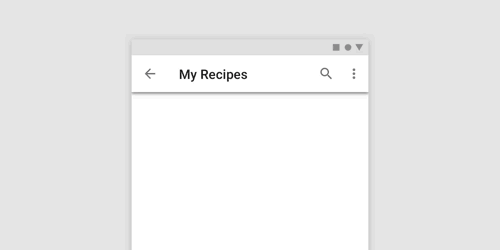
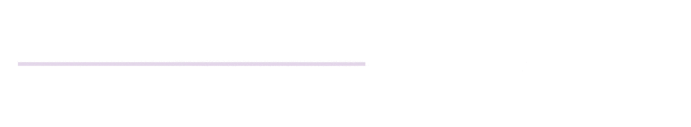
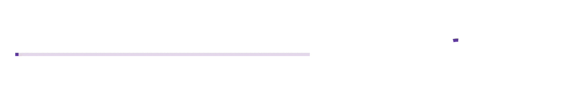
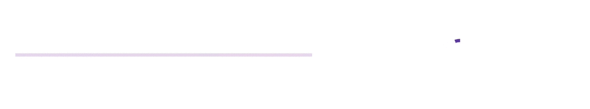
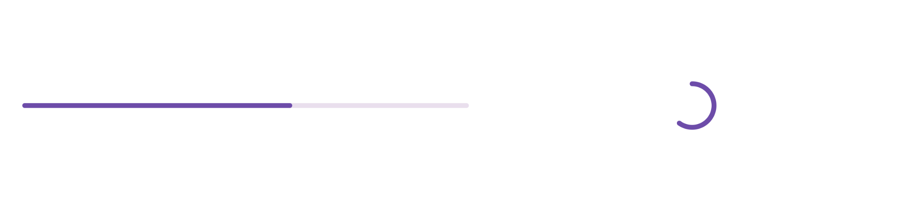
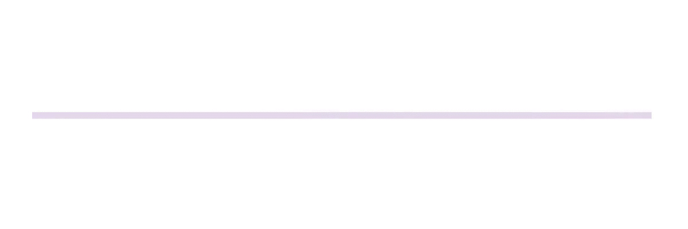
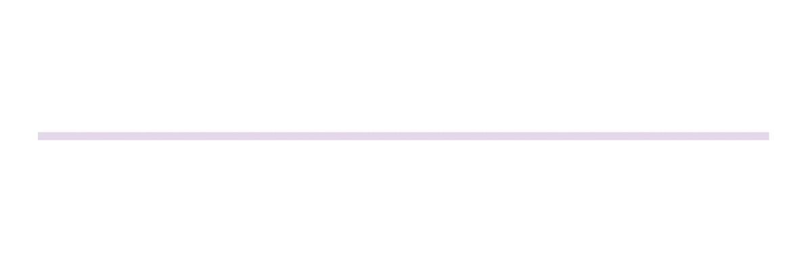
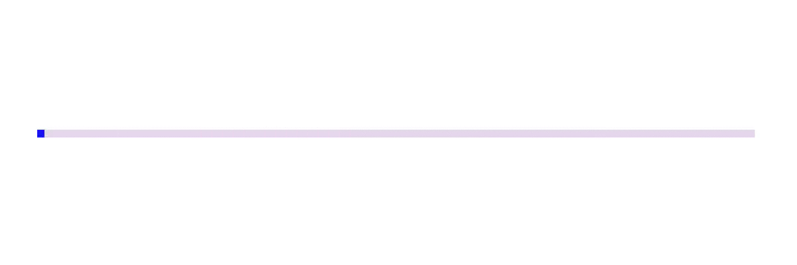
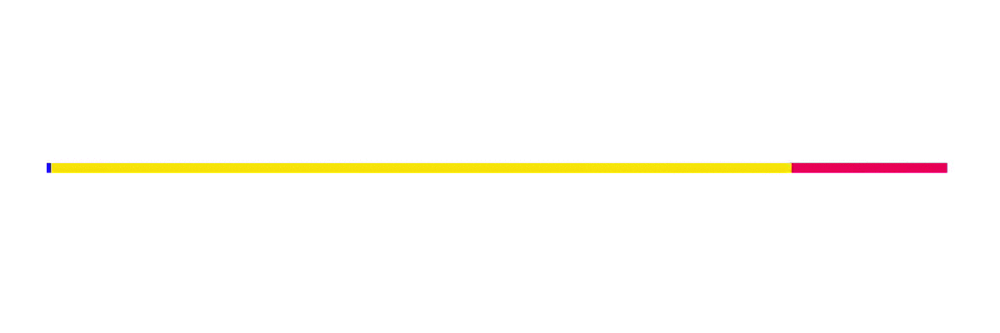
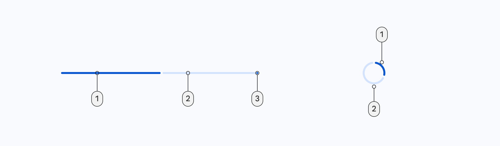

<!--docs:
title: "Progress indicators"
layout: detail
section: components
excerpt: "Progress indicators express an unspecified wait time or display the length of a process."
iconId: progress_indicator
path: /catalog/progress-indicators/
-->

# Progress Indicators

[Progress indicators](https://material.io/components/progress-indicators)
express an unspecified wait time or display the length of a process.



**Contents**

*   [Using progress indicators](#using-progress-indicators)
*   [Linear progress indicators](#linear-progress-indicators)
*   [Circular progress indicators](#circular-progress-indicators)
*   [Anatomy](#anatomy)
*   [Theming progress indicators](#theming-progress-indicators)

## Using progress indicators

Before you can use Material sliders, you need to add a dependency to the
Material Components for Android library. For more information, go to the
[Getting started](https://github.com/material-components/material-components-android/tree/master/docs/getting-started.md)
page.

Progress indicators inform users about the status of ongoing processes, such as
loading an app, submitting a form, or saving updates. They communicate an app’s
state and indicate available actions, such as whether users can navigate away
from the current screen.

_**Note: When displaying progress for a sequence of processes, indicate overall
progress rather than the progress of each activity.**_

### Usage



A determinate progress indicator can added in a layout like so:

```xml
<!-- Linear progress indicator -->
<com.google.android.material.progressindicator.LinearProgressIndicator
    android:layout_width="match_parent"
    android:layout_height="wrap_content" />
<!-- Circular progress indicator -->
<com.google.android.material.progressindicator.CircularProgressIndicator
    android:layout_width="wrap_content"
    android:layout_height="wrap_content" />
```



An indeterminate progress indicator can be added like so:

```xml
<!-- Linear progress indicator -->
<com.google.android.material.progressindicator.LinearProgressIndicator
    android:layout_width="match_parent"
    android:layout_height="wrap_content"
    android:indeterminate="true" />
<!-- Circular progress indicator -->
<com.google.android.material.progressindicator.CircularProgressIndicator
    android:layout_width="wrap_content"
    android:layout_height="wrap_content"
    android:indeterminate="true" />
```

### Switching from indeterminate to determinate



Indeterminate progress indicators can smoothly transit to determinate progress
indicators by setting the `progress` programmatically:

```kt
int progress = getLoadingProgress()
indicator.setProgressCompat(progress, true)
```

_**Note:** Once indeterminate progress indicators are switched to the
determinate mode (or initialized as determinate), they can be set back to
indeterminate mode via calling the `setIndeterminate(false)` method. However, in
order to keep the smoothness of animation, they need to be set `INVISIBLE` or
`GONE` via the `setVisibility` or `hide` methods first._

### Making progress indicators accessible

Progress indicators inherit accessibility support from the `ProgressBar` class
in the framework. Please consider setting the content descriptor for use with
screen readers.

That can be done in XML via the `android:contentDescription` attribute or
programmatically like so:

```kt
progressIndicator.contentDescription = contentDescription
```

### Showing/hiding the progressindicator

By default, the progress indicator will be shown or hidden without animations.
You can change the animation behaviors via `app:showAnimationBehavior` (or
`setShowAnimationBehavior` method) and `app:hideAnimationBehavior` (or
`setHideAnimationBehavior` method).

The modes of behaviors are:

*   `none` (default) - shows/hides the view immediately when the visibility is
    being changed via `show`, `hide` or `setVisibility` method.
*   `outward` - for the linear type, shows the view by expanding from the
    baseline (or bottom edge) and hides the view by collapsing to the top edge;
    for the circular type, shows the view by expanding from the inner edge and
    hides the view by collapsing to the outer edge.
*   `inward` - for the linear type, shows the view by expanding from the top
    edge and hides the view by collapsing to the baseline (bottom edge); for the
    circular type, shows the view by expanding from the outer edge and hides the
    view by collapsing to the inner edge.

When the hide animation behavior is not none, the visibility of the view will be
changed after the animation finishes. Please use `setVisibilityAfterHide` method
to set the target visibility as `Visibiltiy.INVISIBLE` (default) or
`Visibility.GONE`.

### Rounded corners



Progress indicators can have rounded corners via `app:trackCornerRadius` or the
`setTrackCornerRadius` method.

## Types

Material Design offers two visually distinct types of progress indicators:

1.  [linear](#linear-progress-indicators)
2.  [circular](#circular-progress-indicators)

Only one type should represent each kind of activity in an app. For example, if
a refresh action displays a circular indicator on one screen, that same action
shouldn’t use a linear indicator elsewhere in the app.


### Linear progress indicators

Linear progress indicators display progress by animating an indicator along the
length of a fixed, visible track. The behavior of the indicator is dependent on
whether the progress of a process is known.

Linear progress indicators support both determinate and indeterminate
operations.

*   Determinate operations display the indicator increasing in width from 0 to
    100% of the track, in sync with the process’s progress.
*   Indeterminate operations display the indicator continually growing and
    shrinking along the track until the process is complete.

Source code:

*   [`LinearProgressIndicator`](https://github.com/material-components/material-components-android/tree/master/lib/java/com/google/android/material/progressindicator/LinearProgressIndicator.java)

The following example shows a determinate linear progress indicator.



In the layout:

```xml
<com.google.android.material.progressindicator.LinearProgressIndicator
    android:layout_width="match_parent"
    android:layout_height="wrap_content" />
```

The following example shows an indeterminate linear progress indicator.



In the layout:

```xml
<com.google.android.material.progressindicator.LinearProgressIndicator
    android:layout_width="match_parent"
    android:layout_height="wrap_content"
    android:indeterminate="true" />
```

#### Multi-color indeterminate animation type

For linear progress indicator, there are two indeterminate animation types:



*   `disjoint` - animates as repeated cycles with two disjoint segments in the
    same color at a time.



*   `contiguous` - animates as repeated cycles with three adjacent segments in
    iterative different colors.

### Circular progress indicators

Circular progress indicators display progress by animating an indicator along an
invisible circular track in a clockwise direction. They can be applied directly
to a surface, such as a button or card.

Circular progress indicators support both determinate and indeterminate
processes.

*   Determinate circular indicators fill the invisible, circular track with
    color, as the indicator moves from 0 to 360 degrees.
*   Indeterminate circular indicators grow and shrink in size while moving along
    the invisible track.

Source code:

*   [`CircularProgressIndicator`](https://github.com/material-components/material-components-android/tree/master/lib/java/com/google/android/material/progressindicator/CircularProgressIndicator.java)

The following example shows a determinate circular progress indicator.


In the layout:

```xml
<com.google.android.material.progressindicator.LinearProgressIndicator
    android:layout_width="match_parent"
    android:layout_height="wrap_content"
    android:indeterminate="true" />
```

The following example shows an indeterminate circular progress indicator.


In the layout:

```xml
<com.google.android.material.progressindicator.CircularProgressIndicator
    android:layout_width="wrap_content"
    android:layout_height="wrap_content"
    android:indeterminate="true" />
```

### Anatomy and key properties

A progress indicator consists of a track and an indicator.



1.  Track
2.  Indicator

#### Common attributes

The following attributes are shared between linear and circular progress
indicators:

&nbsp;                        | Attribute                   | Related method(s)                                         | Default value
----------------------------- | --------------------------- | --------------------------------------------------------- | -------------
**track thickness**           | `app:trackThickness`        | `setTrackThickness`</br>`getTrackThickness`               | `4dp`
**indicator color**           | `app:indicatorColor`        | `setIndicatorColor`</br>`getIndicatorColor`               | `colorPrimary`
**track color**               | `app:trackColor`            | `setTrackColor`</br>`getTrackColor`                       | `indicatorColor` at `disabledAlpha`
**track corner radius**       | `app:trackCornerRadius`     | `setTrackCornerRadius`</br>`getTrackCornerRadius`         | `0dp`
**show animation behavior**   | `app:showAnimationBehavior` | `setShowAnimationBehavior`</br>`getShowAnimationBehavior` | `none`
**hide animation behavior**   | `app:hideAnimationBehavior` | `setHideAnimationBehavior`</br>`getHideAnimationBehavior` | `none`
**delay (in ms) to show**     | `app:showDelay`             | N/A                                                       | 0
**min delay (in ms) to hide** | `app:minHideDelay`          | N/A                                                       | 0

#### Linear type specific attributes

Linear type progress indicators also have the following attributes:

&nbsp;                           | Attribute                        | Related method(s)                                                   | Default value
-------------------------------- | -------------------------------- | ------------------------------------------------------------------- | -------------
**indeterminate animation type** | `app:indeterminateAnimationType` | `setIndeterminateAnimationType`</br>`getIndeterminateAnimationType` | `disjoint`
**indicator direction**          | `app:indicatorDirectionLinear`   | `setIndicatorDirection`</br>`getIndicatorDirection`                 | `leftToRight`

#### Circular type specific attributes

Circular type progress indicators also have the following attributes:

&nbsp;                            | Attribute                        | Related method(s)                                   | Default value
--------------------------------- | -------------------------------- | --------------------------------------------------- | -------------
**spinner size (outer diameter)** | `app:indicatorSize`              | `setIndicatorSize`</br>`getIndicatorSize`           | `40dp`
**inset**                         | `app:indicatorInset`             | `setIndicatorInset`</br>`getIndicatorInset`         | `4dp`
**indicator direction**           | `app:indicatorDirectionCircular` | `setIndicatorDirection`</br>`getIndicatorDirection` | `clockwise`

#### Styles

&nbsp;                                 | Style
-------------------------------------- | -----
**Default linear**<br/>**style**       | `Widget.MaterialComponents.LinearProgressIndicator`
**Default circular**<br/>**style**     | `Widget.MaterialComponents.CircularProgressIndicator`
**Medium circular**<br/>**style**      | `Widget.MaterialComponents.CircularProgressIndicator.Medium`
**Small circular**<br/>**style**       | `Widget.MaterialComponents.CircularProgressIndicator.Small`
**Extra small circular**<br/>**style** | `Widget.MaterialComponents.CircularProgressIndicator.ExtraSmall`


Default linear style theme attribute: `?attr/linearProgressIndicatorStyle`

Default circular style theme attribute: `?attr/circularProgressIndicatorStyle`

See the full list of
[styles](https://github.com/material-components/material-components-android/tree/master/lib/java/com/google/android/material/progressindicator/res/values/styles.xml)
and
[attributes](https://github.com/material-components/material-components-android/tree/master/lib/java/com/google/android/material/progressindicator/res/values/attrs.xml).

## Theming

Progress indicators support Material theming and can be customized in terms of
color and size.

### Progress indicator theming example

The following example shows a circular progress indicator with Material Theming.


#### Implementing progress indicator theming

Using theme attributes and style sin `res/values/styles.xml` (themes all
circular progress indicators and affects other components):

```xml
<style name="Theme.App" parent="Theme.MaterialComponents.*">
    ...
    <item name="colorPrimary">@color/shrine_pink_100</item>
</style>
```

or using a default stype theme attribute, styles and a theme overlay (themes all
circular progress indicators but does not affect other components):

```xml
<style name="Theme.App" parent="Theme.MaterialComponents.*">
    ...
    <item name="circularProgressIndicatorStyle">@style/Widget.App.CircularProgressIndicator</item>
</style>

<style name="Widget.App.CircularProgressIndicator" parent="Widget.MaterialComponents.CircularProgressIndicator">
    <item name="materialThemeOverlay">@style/ThemeOverlay.App.CircularProgressIndicator</item>
    <item name="trackThickness">20dp</item>
</style>

<style name="ThemeOverlay.App.CircularProgressIndicator" parent="">
    <item name="colorPrimary">@color/shrine_pink_100</item>
</style>
```

or using the style in the layout (affects only this specific circular progress
indicator):

```xml
<com.google.android.material.progressindicator.CircularProgressIndicator
    ...
    style="@style/Widget.App.CircularProgressIndicator"  />
```
