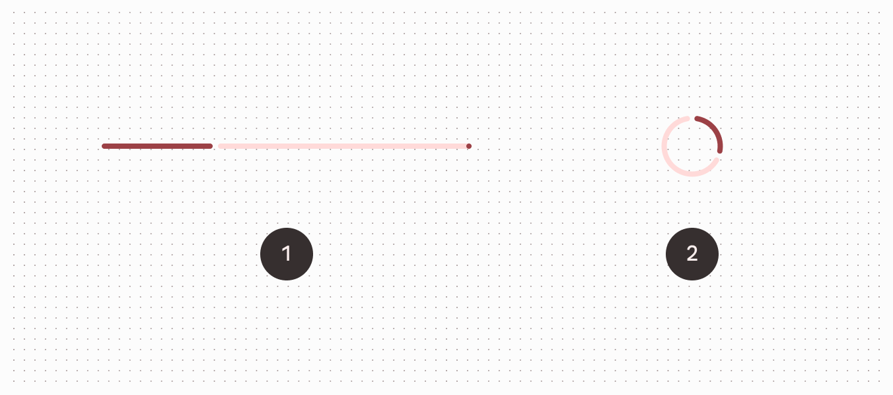

<!--docs:
title: "Progress indicators"
layout: detail
section: components
excerpt: "Progress indicators express an unspecified wait time or display the length of a process."
iconId: progress_indicator
path: /catalog/progress-indicators/
-->

# Progress Indicators

[Progress indicators](https://material.io/components/progress-indicators)
express an unspecified wait time or display the length of a process.


**Contents**

*   [Design & API Documentation](#design-api-documentation)
*   [Using progress indicators](#using-progress-indicators)
*   [Linear progress indicators](#linear-progress-indicators)
*   [Circular progress indicators](#circular-progress-indicators)
*   [Anatomy and key properties](#anatomy-and-key-properties)
*   [Theming progress indicators](#theming-progress-indicators)

## Design & API Documentation

*   [Google Material3 Spec](https://material.io/components/progress-indicators/overview)
*   [API Reference](https://developer.android.com/reference/com/google/android/material/progressindicator/package-summary)

## Using progress indicators

Before you can use Material sliders, you need to add a dependency to the
Material Components for Android library. For more information, go to the
[Getting started](https://github.com/material-components/material-components-android/tree/master/docs/getting-started.md)
page.

Progress indicators inform users about the status of ongoing processes, such as
loading an app, submitting a form, or saving updates. They communicate an app’s
state and indicate available actions, such as whether users can navigate away
from the current screen.

**Note:** When displaying progress for a sequence of processes, indicate overall
progress rather than the progress of each activity.

### Usage

A determinate progress indicator can be added to a layout:

```xml
<!-- Linear progress indicator -->
<com.google.android.material.progressindicator.LinearProgressIndicator
    android:layout_width="match_parent"
    android:layout_height="wrap_content" />
<!-- Circular progress indicator -->
<com.google.android.material.progressindicator.CircularProgressIndicator
    android:layout_width="wrap_content"
    android:layout_height="wrap_content" />
```

An indeterminate progress indicator can be added:

```xml
<!-- Linear progress indicator -->
<com.google.android.material.progressindicator.LinearProgressIndicator
    android:layout_width="match_parent"
    android:layout_height="wrap_content"
    android:indeterminate="true" />
<!-- Circular progress indicator -->
<com.google.android.material.progressindicator.CircularProgressIndicator
    android:layout_width="wrap_content"
    android:layout_height="wrap_content"
    android:indeterminate="true" />
```


1. Determinate
2. Indeterminate

### Switching from indeterminate to determinate

Indeterminate progress indicators can smoothly transit to determinate progress
indicators by setting the `progress` programmatically:

```kt
int progress = getLoadingProgress()
indicator.setProgressCompat(progress, true)
```

**Note:** Once indeterminate progress indicators are switched to the
determinate mode (or initialized as determinate), they can be set back to
indeterminate mode via calling the `setIndeterminate(true)` method.

### Making progress indicators accessible

Progress indicators inherit accessibility support from the `ProgressBar` class
in the framework. Please consider setting the content descriptor for use with
screen readers.

That can be done in XML via the `android:contentDescription` attribute or
programmatically like so:

```kt
progressIndicator.contentDescription = contentDescription
```

### Showing/hiding the progress indicator

By default, the progress indicator will be shown or hidden without animations.
You can change the animation behaviors via `app:showAnimationBehavior` (or
`setShowAnimationBehavior` method) and `app:hideAnimationBehavior` (or
`setHideAnimationBehavior` method).

The modes of behaviors are:

*   `none` (default) - shows/hides the view immediately when the visibility is
    being changed via `show`, `hide` or `setVisibility` method.
*   `outward` - for the linear type, shows the view by expanding from the
    baseline (or bottom edge) and hides the view by collapsing to the top edge;
    for the circular type, shows the view by expanding from the inner edge and
    hides the view by collapsing to the outer edge.
*   `inward` - for the linear type, shows the view by expanding from the top
    edge and hides the view by collapsing to the baseline (bottom edge); for the
    circular type, shows the view by expanding from the outer edge and hides the
    view by collapsing to the inner edge.
*   `escape` - for the linear type, escapes in the progression direction; for the
    circular type, no effect.

When the hide animation behavior is not none, the visibility of the view will be
changed after the animation finishes. Please use `setVisibilityAfterHide` method
to set the target visibility as `Visibility.INVISIBLE` (default) or
`Visibility.GONE`.

### Rounded corners

Progress indicators can have rounded corners via `app:trackCornerRadius` or the
`setTrackCornerRadius` method.

### Types

Material Design offers two visually distinct types of progress indicators: 1\.
[linear](#linear-progress-indicators) 2\.
[circular](#circular-progress-indicators)

Only one type should represent each kind of activity in an app. For example, if
a refresh action displays a circular indicator on one screen, that same action
shouldn’t use a linear indicator elsewhere in the app.



## Linear progress indicators

Linear progress indicators display progress by animating an indicator along the
length of a fixed, visible track. The behavior of the indicator is dependent on
whether the progress of a process is known.

Linear progress indicators support both determinate and indeterminate
operations.

*   Determinate operations display the indicator increasing in width from 0 to
    100% of the track, in sync with the process’s progress.
*   Indeterminate operations display the indicator continually growing and
    shrinking along the track until the process is complete.

API and source code:

*   `LinearProgressIndicator`
    *   [Class description](https://developer.android.com/reference/com/google/android/material/progressindicator/LinearProgressIndicator)
    *   [Class source](https://github.com/material-components/material-components-android/tree/master/lib/java/com/google/android/material/progressindicator/LinearProgressIndicator.java)

The following example shows a determinate linear progress indicator.

{width="600"}

In the layout:

```xml
<com.google.android.material.progressindicator.LinearProgressIndicator
    android:layout_width="match_parent"
    android:layout_height="wrap_content" />
```

The following example shows an indeterminate linear progress indicator.

{width="600"}

In the layout:

```xml
<com.google.android.material.progressindicator.LinearProgressIndicator
    android:layout_width="match_parent"
    android:layout_height="wrap_content"
    android:indeterminate="true" />
```

#### Multi-color indeterminate animation type

For linear progress indicator, there are two indeterminate animation types:

*   `disjoint` - animates as repeated cycles with two disjoint segments in the
    same color at a time. {width="600"}

*   `contiguous` - animates as repeated cycles with three adjacent segments in
    different colors. {width="600"}

**Note:** There is a minimum requirement of 3 indicator colors to use the
**contiguous** animation. Otherwise, an IllegalArgumentException will be thrown.

## Circular progress indicators

Circular progress indicators display progress by animating an indicator along an
invisible circular track in a clockwise direction. They can be applied directly
to a surface, such as a button or card.

Circular progress indicators support both determinate and indeterminate
processes.

*   Determinate circular indicators fill the invisible, circular track with
    color, as the indicator moves from 0 to 360 degrees.
*   Indeterminate circular indicators grow and shrink in size while moving along
    the invisible track.

API and source code:

*   `CircularProgressIndicator`
    *   [Class description](https://developer.android.com/reference/com/google/android/material/progressindicator/CircularProgressIndicator)
    *   [Class source](https://github.com/material-components/material-components-android/tree/master/lib/java/com/google/android/material/progressindicator/CircularProgressIndicator.java)

The following example shows a determinate circular progress indicator.

{width="600"}

In the layout:

```xml
<com.google.android.material.progressindicator.CircularProgressIndicator
    android:layout_width="wrap_content"
    android:layout_height="wrap_content" />
```

The following example shows an indeterminate circular progress indicator.

{width="600"}

In the layout:

```xml
<com.google.android.material.progressindicator.CircularProgressIndicator
    android:layout_width="wrap_content"
    android:layout_height="wrap_content"
    android:indeterminate="true" />
```

### Anatomy and key properties

A progress indicator consists of a track and an indicator.


1. Active indicator
2. Track
3. Stop indicator

#### Common attributes

The following attributes are shared between linear and circular progress
indicators:

| Element                       | Attribute                   | Related method(s)                                         | Default value                                                                |
|-------------------------------|-----------------------------|-----------------------------------------------------------|------------------------------------------------------------------------------|
| **Track thickness**           | `app:trackThickness`        | `setTrackThickness`</br>`getTrackThickness`               | `4dp`                                                                        |
| **Indicator color**           | `app:indicatorColor`        | `setIndicatorColor`</br>`getIndicatorColor`               | `colorPrimary`                                                               |
| **Track color**               | `app:trackColor`            | `setTrackColor`</br>`getTrackColor`                       | `colorPrimaryContainer` (linear)</br>`@android:color/transparent` (circular) |
| **Track corner radius**       | `app:trackCornerRadius`     | `setTrackCornerRadius`</br>`getTrackCornerRadius`         | `2dp`                                                                        |
| **Indicator track gap size**  | `app:indicatorTrackGapSize` | `setIndicatorTrackGapSize`</br>`getIndicatorTrackGapSize` | `4dp`                                                                        |
| **Show animation behavior**   | `app:showAnimationBehavior` | `setShowAnimationBehavior`</br>`getShowAnimationBehavior` | `none`                                                                       |
| **Hide animation behavior**   | `app:hideAnimationBehavior` | `setHideAnimationBehavior`</br>`getHideAnimationBehavior` | `none`                                                                       |
| **Delay (in ms) to show**     | `app:showDelay`             | N/A                                                       | 0                                                                            |
| **Min delay (in ms) to hide** | `app:minHideDelay`          | N/A                                                       | 0                                                                            |

#### Linear type specific attributes

Linear type progress indicators also have the following attributes:

| Element                          | Attribute                        | Related method(s)                                                   | Default value |
|----------------------------------|----------------------------------|---------------------------------------------------------------------|---------------|
| **Indeterminate animation type** | `app:indeterminateAnimationType` | `setIndeterminateAnimationType`</br>`getIndeterminateAnimationType` | `disjoint`    |
| **Indicator direction**          | `app:indicatorDirectionLinear`   | `setIndicatorDirection`</br>`getIndicatorDirection`                 | `leftToRight` |
| **Track stop indicator size**    | `app:trackStopIndicatorSize`     | `setTrackStopIndicatorSize`</br>`getTrackStopIndicatorSize`         | `4dp`         |

#### Circular type specific attributes

Circular type progress indicators also have the following attributes:

Element                           | Attribute                        | Related method(s)                                   | Default value
--------------------------------- | -------------------------------- | --------------------------------------------------- | -------------
**Spinner size (outer diameter)** | `app:indicatorSize`              | `setIndicatorSize`</br>`getIndicatorSize`           | `40dp`
**Inset**                         | `app:indicatorInset`             | `setIndicatorInset`</br>`getIndicatorInset`         | `4dp`
**Indicator direction**           | `app:indicatorDirectionCircular` | `setIndicatorDirection`</br>`getIndicatorDirection` | `clockwise`

#### Styles

Element                                | Style
-------------------------------------- | -----
**Default linear**<br/>**style**       | `Widget.Material3.LinearProgressIndicator`
**Default circular**<br/>**style**     | `Widget.Material3.CircularProgressIndicator`
**Medium circular**<br/>**style**      | `Widget.Material3.CircularProgressIndicator.Medium`
**Small circular**<br/>**style**       | `Widget.Material3.CircularProgressIndicator.Small`
**Extra small circular**<br/>**style** | `Widget.Material3.CircularProgressIndicator.ExtraSmall`

Default linear style theme attribute: `?attr/linearProgressIndicatorStyle`

Default circular style theme attribute: `?attr/circularProgressIndicatorStyle`

See the full list of
[styles](https://github.com/material-components/material-components-android/tree/master/lib/java/com/google/android/material/progressindicator/res/values/styles.xml)
and
[attributes](https://github.com/material-components/material-components-android/tree/master/lib/java/com/google/android/material/progressindicator/res/values/attrs.xml).

#### Non-Text Contrast update

In order to comply with the latest accessibility requirements, the
`LinearProgressIndicator` and `CircularProgressIndicator` have been updated with
additional attributes:

- `app:indicatorTrackGapSize`: size of the gap between the indicator and the
  track, 4dp by default.
- `app:trackStopIndicatorSize`: size of the stop at the end of the track, 4dp by
  default. Only applies to the linear determinate configuration.

`*.Legacy` styles have been added to revert to the previous behavior (**not
recommended**):

- `Widget.Material3.LinearProgressIndicator.Legacy`
- `Widget.Material3.CircularProgressIndicator.Legacy`

## Theming

Progress indicators support Material theming which can customize color and size.

### Theming progress indicators

API and source code:

*   `LinearProgressIndicator`
    *   [Class description](https://developer.android.com/reference/com/google/android/material/progressindicator/LinearProgressIndicator)
    *   [Class source](https://github.com/material-components/material-components-android/tree/master/lib/java/com/google/android/material/progressindicator/LinearProgressIndicator.java)
*   `CircularProgressIndicator`
    *   [Class description](https://developer.android.com/reference/com/google/android/material/progressindicator/CircularProgressIndicator)
    *   [Class source](https://github.com/material-components/material-components-android/tree/master/lib/java/com/google/android/material/progressindicator/CircularProgressIndicator.java)

The following example shows a circular progress indicator with Material Theming.


#### Implementing progress indicator theming

Use theme attributes and styles in `res/values/styles.xml`, which applies to all
circular progress indicators and affects other components:

```xml
<style name="Theme.App" parent="Theme.Material3.*">
    ...
    <item name="colorPrimary">@color/shrine_pink_100</item>
</style>
```

Use a default type theme attribute, styles and a theme overlay, which applies to
all circular progress indicators but does not affect other components:

```xml
<style name="Theme.App" parent="Theme.Material3.*">
    ...
    <item name="circularProgressIndicatorStyle">@style/Widget.App.CircularProgressIndicator</item>
</style>

<style name="Widget.App.CircularProgressIndicator" parent="Widget.Material3.CircularProgressIndicator.Legacy">
    <item name="materialThemeOverlay">@style/ThemeOverlay.App.CircularProgressIndicator</item>
    <item name="trackThickness">20dp</item>
</style>

<style name="ThemeOverlay.App.CircularProgressIndicator" parent="">
    <item name="colorPrimary">@color/shrine_pink_100</item>
</style>
```

Use the style in the layout, which affects only this specific circular progress
indicator:

```xml
<com.google.android.material.progressindicator.CircularProgressIndicator
    ...
    style="@style/Widget.App.CircularProgressIndicator"  />
```
