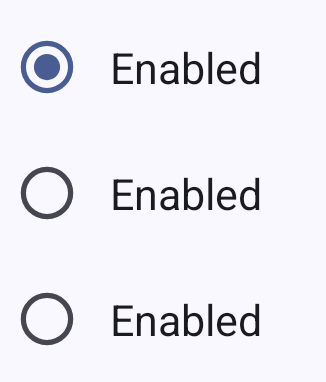

<!--docs:
title: "Material selection controls: Radio button"
layout: detail
section: components
excerpt: "Selection controls allow the user to select options."
iconId: radiobutton
path: /catalog/radiobuttons/
-->

# Radio button

[Radio buttons](https://m3.material.io/components/radio-button/overview) let
people select one option from a set of options.


**Note:** Images use various dynamic color schemes.

## Design & API documentation

*   [Material 3 (M3) spec](https://m3.material.io/components/radio-button/overview)
*   [API reference](https://developer.android.com/reference/com/google/android/material/radiobutton/package-summary)

## Anatomy


1.  Icon (selected)
2.  Adjacent label text
3.  Icon (unselected)

More details on anatomy items are available in the
[component guidelines](https://m3.material.io/components/radio-button/guidelines#4c0190e7-49da-43bf-b08b-828f71300425).

## Key properties

### Radio button attributes

Element                    | Attribute                                  | Related method(s)                                          | Default value
-------------------------- | ------------------------------------------ | ---------------------------------------------------------- | -------------
**To use material colors** | `app:useMaterialThemeColors`               | `setUseMaterialThemeColors`<br/>`isUseMaterialThemeColors` | `true` (ignored if `app:buttonTint` is set)
**Color**                  | `app:buttonTint`                           | `setButtonTintList`<br/>`getButtonTintList`                | `?attr/colorOnSurface` (see all [states](https://github.com/material-components/material-components-android/tree/master/lib/java/com/google/android/material/radiobutton/res/color/m3_radiobutton_button_tint.xml))
**Min size**               | `android:minWidth`<br/>`android:minHeight` | `(set/get)MinWidth`<br/>`(set/get)MinHeight`               | `?attr/minTouchTargetSize`

The color of the radio button defaults to `?attr/colorOnSurface` (unchecked) and
`?attr/colorPrimary` (checked) defined in your app theme. If you want to
override this behavior, you could use a custom drawable that should not be
tinted, set `app:useMaterialThemeColors` to `false`:

```xml
<RadioButton
    ...
    app:useMaterialThemeColors="false"
/>
```

### Text label attributes

Element        | Attribute                | Related method(s)                  | Default value
-------------- | ------------------------ | ---------------------------------- | -------------
**Text label** | `android:text`           | `setText`<br/>`getText`            | `null`
**Color**      | `android:textColor`      | `setTextColor`<br/>`getTextColors` | inherits from `AppCompatRadioButton`
**Typography** | `android:textAppearance` | `setTextAppearance`                | `?attr/textAppearanceBodyMedium`

### Radio button states

Radio buttons can be selected or unselected. Radio buttons have enabled,
disabled, hover, focused, and pressed states.


### Styles

Element           | Style                                         | Theme attribute
----------------- | --------------------------------------------- | ---------------
**Default style** | `Widget.Material3.CompoundButton.RadioButton` | `?attr/radioButtonStyle`

For the full list, see
[styles](https://github.com/material-components/material-components-android/tree/master/lib/java/com/google/android/material/radiobutton/res/values/styles.xml)
and
[attrs](https://github.com/material-components/material-components-android/tree/master/lib/java/com/google/android/material/radiobutton/res/values/attrs.xml).

## Code implementation

Before you can use Material radio buttons, you need to add a dependency to the
Material components for Android library. For more information, go to the
[Getting started](https://github.com/material-components/material-components-android/tree/master/docs/getting-started.md)
page.

### Adding radio button

A radio button is a circle that is filled in with an inset when selected. Radio
buttons allow the user to select one option from a set. Use radio buttons when
the user needs to see all available options. If available options can be
collapsed, consider using a dropdown menu because it uses less space.

**Note:** `<RadioButton>` is auto-inflated as
`<com.google.android.material.button.MaterialRadioButton>` via
`MaterialComponentsViewInflater` when using a `Theme.Material3.*` theme.

<h3 id="radio-button-group-example">Radio button example</h3>

The following example shows a radio button group with three radio buttons.



In the layout:

```xml
<RadioGroup
    android:checkedButton="@+id/enabled_selected"
    android:layout_width="match_parent"
    android:layout_height="wrap_content">
    <RadioButton
        android:id="@+id/enabled_selected"
        android:layout_width="match_parent"
        android:layout_height="match_parent"
        android:enabled="true"
        android:paddingStart="@dimen/padding_start"
        android:text="@string/radiobutton_text"/>
    <RadioButton
        android:layout_width="match_parent"
        android:layout_height="match_parent"
        android:checked="false"
        android:enabled="true"
        android:paddingStart="@dimen/padding_start"
        android:text="@string/radiobutton_text"/>
    <RadioButton
        android:layout_width="match_parent"
        android:layout_height="match_parent"
        android:checked="false"
        android:enabled="true"
        android:paddingStart="@dimen/padding_start"
        android:text="@string/radiobutton_text"/>
</RadioGroup>
```

In code:

```kt
val checkedRadioButtonId = radioGroup.checkedRadioButtonId // Returns View.NO_ID if nothing is checked.
radioGroup.setOnCheckedChangeListener { group, checkedId ->
    // Responds to child RadioButton checked/unchecked
}

// To check a radio button
radioButton.isChecked = true

// To listen for a radio button's checked/unchecked state changes
radioButton.setOnCheckedChangeListener { buttonView, isChecked
    // Responds to radio button being checked/unchecked
}
```

### Making radio buttons accessible

Radio buttons support content labeling for accessibility and are readable by
most screen readers, such as Talkback. Text rendered in radio buttons is
automatically provided to accessibility services. Additional content labels are
usually unnecessary.

### Grouping radio buttons

Changes in the states of one radio button can affect other buttons in the group.
Specifically, selecting a `RadioButton` in a `RadioGroup` will deselect all
other buttons in that group. See the
[example section](#radio-button-group-example) for implementation details.

## Customizing radio buttons

### Theming radio buttons

Radio buttons support the customization of color and typography.

#### Radio button theming example

API and source code:

*   `MaterialRadioButton`
    *   [Class definition](https://developer.android.com/reference/com/google/android/material/radiobutton/MaterialRadioButton)
    *   [Class source](https://github.com/material-components/material-components-android/tree/master/lib/java/com/google/android/material/radiobutton/MaterialRadioButton.java)
*   `RadioGroup`
    *   [Class definition](https://developer.android.com/reference/android/widget/RadioGroup)

The following example shows a radio button with Material theming.


##### Implementing radio button theming

Use theme attributes in `res/values/styles.xml` which applies to all radio
buttons and affects other components:

```xml
<style name="Theme.App" parent="Theme.Material3.*">
    ...
    <item name="colorOnSurface">@color/shrine_pink_900</item>
    <item name="colorPrimary">@color/shrine_pink_100</item>
</style>

```

Use default style theme attributes, styles and theme overlays which apply to all
radio buttons but do not affect other components:

```xml
<style name="Theme.App" parent="Theme.Material3.*">
    ...
    <item name="radioButtonStyle">@style/Widget.App.RadioButton</item>
</style>

<style name="Widget.App.RadioButton" parent="Widget.Material3.CompoundButton.RadioButton">
    <item name="materialThemeOverlay">@style/ThemeOverlay.App.RadioButton</item>
</style>

<style name="ThemeOverlay.App.RadioButton" parent="">
    <item name="colorOnSurface">@color/shrine_pink_900</item>
    <item name="colorPrimary">@color/shrine_pink_100</item>
</style>
```

You can also change the radio button colors via the `?attr/buttonTint`
attribute:

```xml
<style name="Widget.App.RadioButton" parent="Widget.Material3.CompoundButton.RadioButton">
    <item name="buttonTint">@color/button_tint</item>
</style>
```

and in `color/button_tint.xml`:

```xml
<selector xmlns:android="http://schemas.android.com/apk/res/android">
    <item android:color="@color/shrine_pink_900" android:state_checked="true"/>
    <item android:alpha="0.38" android:color="@color/shrine_pink_100" android:state_enabled="false"/>
    <item android:color="@color/shrine_pink_100"/>
</selector>
```

You can use the styles in the layout, which affects only this radio button:

```xml
<RadioButton
    ...
    style="@style/Widget.App.RadioButton"
/>
```
