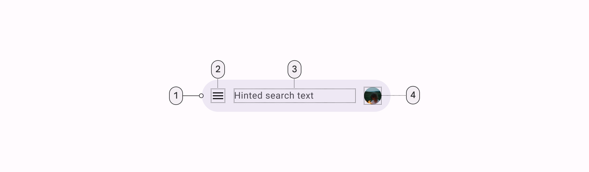

<!--docs:
title: "Search"
layout: detail
section: components
excerpt: "A navigation pattern that leverages Google's iconic 'Search' feature."
iconId: search
path: /catalog/search/
-->

# Search Bar

Search is a navigation pattern which provides a floating search field with a
surface that allows product-specific branding and additional navigation icons.


**Contents**

*   [Design and API Documentation](#design-and-api-documentation)
*   [Using search components](#using-search-components)
*   [Search Bar](#search-bar)
*   [Search View](#search-view)
*   [Putting it all together](#putting-it-all-together)
*   [Predictive Back](#predictive-back)

## Design and API Documentation

*   [Google Material3 Spec](https://material.io/components/search/overview)
*   [API Reference](https://developer.android.com/reference/com/google/android/material/search/package-summary)

## Using search components

Before you can use the Material Search components, you need to add a dependency to
the Material Components for Android library. For more information, go to the
[Getting started](https://github.com/material-components/material-components-android/tree/master/docs/getting-started.md)
page.

Note: Material Search was introduced in `1.8.0`. To use Material Search, make
sure you're depending on [library version `1.8.0`](https://github.com/material-components/material-components-android/releases/tag/1.8.0)
or later.

### Making Search Components accessible

You should set a content description on a search bar and search view components
via the `android:contentDescription` attribute or `setContentDescription` method
so that screen readers such as TalkBack are able to announce their purpose or
action. Text rendered in these components are automatically provided to
accessibility services, so additional content labels are usually unnecessary.

## Search Bar

The `SearchBar` component provides an implementation of the floating search
field. It extends `Toolbar`, so it supports a navigation icon, menu items, and
any other `Toolbar` APIs. Additionally, the `SearchBar` comes with a hint
`TextView` and supports nesting a centered branding element.

Since `SearchBar` extends `Toolbar`, you can set up your `SearchBar` as an
`ActionBar` via [`AppCompatActivity#setSupportActionBar`](https://developer.android.com/reference/kotlin/androidx/appcompat/app/AppCompatActivity#setSupportActionBar(androidx.appcompat.widget.Toolbar)), and inflate a menu by
overriding the `onCreateOptionsMenu` method. However, if using the default
magnifying glass `navigationIcon`, you may need to set
`app:forceDefaultNavigationOnClickListener="true"` on your `SearchBar` so that
the search icon doesn't act as a back button due to the Activity's `ActionBar`
setup flow.

Alternatively, you can choose to not set up your `SearchBar` as an `ActionBar`,
and instead just use `Toolbar`'s `inflateMenu` and `setOnMenuItemClickListener`
methods:

```java
searchBar.inflateMenu(R.menu.searchbar_menu);
searchBar.setOnMenuItemClickListener(
    menuItem -> {
      // Handle menuItem click.
      return true;
    });
```

Note: `SearchBar` aims to provide a consistent search bar across all apps, so
it does not support setting a custom background via `android:background`.

API and source code:

*   `SearchBar`
    *   [Class definition](https://developer.android.com/reference/com/google/android/material/search/SearchBar)
    *   [Class source](https://github.com/material-components/material-components-android/tree/master/lib/java/com/google/android/material/search/SearchBar.java)

### Anatomy and key properties

The following is an anatomy diagram for the search bar:



1.  Container
2.  Leading icon button
3.  Supporting text
4.  Avatar or trailing icon (optional)

### Attributes

The following attributes can be changed for `SearchBar`:

Element                      | Attribute                   | Related method(s)                           | Default value
---------------------------- | --------------------------- | ------------------------------------------- | -------------
**Min height**               | `android:minHeight`         | `setMinHeight`<br/>`getMinHeight`           | `@dimen/m3_searchbar_height`
**Search text appearance**   | `android:textAppearance`    | `setTextAppearance`<br/>`getTextAppearance` | `@style/TextAppearance.Material3.SearchBar`
**Search text**              | `android:text`              | `setText`<br/>`getText`                     | `null`
**Search hint**              | `android:hint`              | `setHint`<br/>`getHint`                     | `null`
**Color**                    | `app:backgroundTint`        | --                                          | `?attr/colorSurfaceContainerHigh`
**Flag for default margins** | `app:defaultMarginsEnabled` | --                                          | `true`
**Flag for navigation icon** | `app:hideNavigationIcon`    | --                                          | `false`

## Styles

Element                       | Style
----------------------------- | ----------------------------
**Search Bar Default style**  | `Widget.Material3.SearchBar`
**Search View Toolbar style** | `Widget.Material3.SearchView.Toolbar`
**Search View Toolbar height**| `@dimen/m3_searchview_height`

Default search bar style theme attribute: `?attr/materialSearchBarStyle`.

Search view toolbar theme attribute: `?attr/materialSearchViewToolbarStyle`.
Search view toolbar height theme attribute:
`?attr/materialSearchViewToolbarHeight`.

### Scrolling Behavior

The `SearchBar` can either be used as a fixed or scroll-away search field.

#### Fixed Mode

To set up the fixed mode, simply position the `SearchBar` on top of the rest of
your layout's contents and do not set up any scrolling behaviors or
AppBarLayout. The `SearchBar` will remain fixed in place as the content is
scrolled beneath it.

#### Scroll-away Mode

To set up the scroll-away mode, use a top-level `CoordinatorLayout` and place
the `SearchBar` within an `AppBarLayout`. Then, place the `AppBarLayout` below
the scrolling view (usually a `RecyclerView` or `NestedScrollView`) in the
`CoordinatorLayout`, and set
`app:layout_behavior="@string/searchbar_scrolling_view_behavior"` on the
scrolling view. This scrolling behavior makes the `AppBarLayout` transparent and
not elevated so there are no undesirable shadows. It also adjusts the scrolling
child so that the `SearchBar` will overlap the rest of your content and appear
to be floating above it. See the
[Putting it all together](#putting-it-all-together) section below for an example
of how to set up this behavior.

Additionally, if your app is going edge-to-edge, consider adding
`app:statusBarForeground="?attr/colorSurface"` to your `AppBarLayout` in order
to avoid overlap between the `SearchBar` and status bar content on scroll.

### Toolbar Transitions

The `SearchBar` component also provides transitions to and from a `Toolbar`,
e.g., for a contextual multi-select flow. These transitions are implemented as
expand and collapse animations, and can be started by calling `SearchBar#expand`
and `SearchBar#collapse`, respectively. Additionally, if you are using an
`AppBarLayout` in conjunction with the `SearchBar`, you may pass in a reference
to your `AppBarLayout` to these methods so that its visibility and offset can be
taken into account for the animations.

Lastly, make sure to add the following to your back pressed handling method, in
order to collapse the contextual `Toolbar` into the `SearchBar` when the user
presses the system back button:

```java
if (searchBar.collapse(contextualToolbar, appBarLayout)) {
  // Clear selection.
  return;
}
```

## Search View

The `SearchView` component provides an implementation of a full-screen search
view which can be used to display back navigation, a search hint and text, menu
items, and search suggestions and results. It also comes with a clear text
button that shows and hides depending on whether the user has entered text.

To set up a menu for your `SearchView`, you can use the `inflateMenu` and
`setOnMenuItemClickListener` methods:

```java
searchView.inflateMenu(R.menu.search_view_menu);
searchView.setOnMenuItemClickListener(
    menuItem -> {
      // Handle menuItem click.
      return true;
    });
```

Additionally, `SearchView` exposes its main `EditText` via a `getEditText()`
method, so you can use any of the traditional
[EditText APIs](https://developer.android.com/reference/android/widget/EditText)
to configure the search field (`setText()`, `addTextChangedListener()`, etc.).

Here is an example of how you can carry over the search text to
the `SearchBar`, as well as hide the `SearchView` when the user finishes typing
and presses enter:

```java
searchView
    .getEditText()
    .setOnEditorActionListener(
        (v, actionId, event) -> {
          searchBar.setText(searchView.getText());
          searchView.hide();
          return false;
        });
```

### Anatomy and key properties

The following is an anatomy diagram for the search view:


1.  Container
2.  Header
3.  Leading icon button
4.  Supporting text
5.  Trailing icon button
6.  Input text
7.  Divider

### Attributes

The following attributes can be changed for `SearchView`:

Element                            | Attribute                    | Related method(s)                           | Default value
---------------------------------- | ---------------------------- | ------------------------------------------- | -------------
**Search text appearance**         | `android:textAppearance`     | `setTextAppearance`<br/>`getTextAppearance` | `@style/TextAppearance.Material3.SearchBar`
**Search text**                    | `android:text`               | `setText`<br/>`getText`                     | `null`
**Search hint**                    | `android:hint`               | `setHint`<br/>`getHint`                     | `null`
**Color**                          | `app:backgroundTint`         | --                                          | `?attr/colorSurfaceContainerHigh`
**Flag for navigation icon**       | `app:hideNavigationIcon`     | --                                          | `true`
**Flag for `DrawerArrowDrawable`** | `app:useDrawerArrowDrawable` | --                                          | `false`
**Flag for soft keyboard**         | `app:autoShowKeyboard`       | --                                          | `true`

## Styles

Element                       | Style
----------------------------- | -----------------------------
**Search View Default style** | `Widget.Material3.SearchView`

Default search view style theme attribute: `?attr/materialSearchViewStyle`.

### Expand and Collapse Animations

One of the biggest advantages of using the `SearchView` in conjunction with an
`SearchBar` is that you will get the expand and collapse animations for free. If
you are just using a standalone `SearchView` without an `SearchBar`, then
showing or hiding the `SearchView` will result in slide up and slide down
transitions.

### Transition Listeners

If you want to get callbacks for when the `SearchView` transitions between its
different animation states, you can add an `SearchView.TransitionListener` via
the `SearchView#addTransitionListener` method. E.g.:

```java
searchView.addTransitionListener(
    (searchView, previousState, newState) -> {
      if (newState == TransitionState.SHOWING) {
        // Handle search view opened.
      }
    });
```

### Soft Input Modes

The recommended `windowSoftInputMode` when using an `SearchBar` and an
`SearchView` is `adjustNothing`. There are a couple reasons for this:

1.  The `adjustResize` mode causes the screen to resize when the keyboard is
    shown, which can cause glitchiness during the expand and collapse
    animations. `SearchView` does address this by staggering the showing and
    hiding of the keyboard with the animations; however, the preferred approach
    is to use `adjustNothing` so the keyboard can be shown and hidden
    immediately.
2.  Resizing the screen is not usually helpful to the user during search. The
    user can either keep typing to see more results or start scrolling, in which
    case the `SearchView` will automatically dismiss the keyboard to show the
    rest of the screen.

On initial render, the `SearchView` will get the soft input mode from the
`Window`, so that it can set up the above behavior. If you change the soft input
mode at runtime, make sure to also invoke the `SearchView#setSoftInputMode`
method so that the `SearchView` can adjust its behavior accordingly.

Lastly, if you don't want the soft keyboard to show automatically when the
`SearchView` is shown, you can set `app:autoShowKeyboard="false"` on your
`SearchView`.

### Translucent Status Bar

`SearchBar` and `SearchView` come with support for a translucent status bar.

To make sure that the `SearchBar` doesn't appear underneath the translucent
status bar, you can wrap it in a `FrameLayout` which has the
`android:fitsSystemWindows` attribute set to `true`.

Additionally, you should not set the `android:fitsSystemWindows` attribute on
the `SearchView`. If you are using either `FLAG_TRANSLUCENT_STATUS`
(`android:windowTranslucentStatus`) or `FLAG_LAYOUT_NO_LIMITS`, then the
`SearchView` will automatically add an extra spacer surface so that it fills the
space underneath the translucent status bar.

### Menu to Back Arrow Animation

If you are using the `SearchBar` with a `NavigationDrawer`, you can set the
`app:useDrawerArrowDrawable` attribute to `true` on your `SearchView` to enable
the "hamburger" menu to back arrow icon animation. This animation will happen
during the expand and collapse of the `SearchView`.

### Search Prefix

If you would like to show some prefix text before the main search `EditText`,
you can make use of the `app:searchPrefixText` attribute. For example, setting
`app:searchPrefixText="To:"` on your `SearchView` will result in the fixed text
label, "To:", being shown before the search `EditText`.

Additionally, with this pattern it is common to hide the back button to reduce
clutter, as navigation can be handled outside of the search view. This can be
accomplished by setting `app:hideNavigationIcon="true"` on your `SearchView`.

## Search History, Suggestions, and Results

`SearchView` is a view group component, meaning you can nest content inside of
it such as:

- Search history when the `SearchView` is first expanded
- Search suggestions when the user is typing
- Search results once the user submits the search

```xml
  <com.google.android.material.search.SearchView
      android:layout_width="match_parent"
      android:layout_height="match_parent"
      android:hint="@string/searchbar_hint"
      app:layout_anchor="@id/search_bar">

    <!-- Search suggestions/results go here (ScrollView, RecyclerView, etc.). -->

  </com.google.android.material.search.SearchView>
```

## Putting it all together

Putting it all together and using the scroll-away mode, the `SearchBar` and
`SearchView` widgets can be used in your layout as such:

```xml
<androidx.coordinatorlayout.widget.CoordinatorLayout
    android:layout_width="match_parent"
    android:layout_height="match_parent">

  <!-- NestedScrollingChild goes here (NestedScrollView, RecyclerView, etc.). -->
  <androidx.core.widget.NestedScrollView
      android:layout_width="match_parent"
      android:layout_height="match_parent"
      app:layout_behavior="@string/searchbar_scrolling_view_behavior">
    <!-- Screen content goes here. -->
  </androidx.core.widget.NestedScrollView>

  <com.google.android.material.appbar.AppBarLayout
      android:layout_width="match_parent"
      android:layout_height="wrap_content">
    <com.google.android.material.search.SearchBar
        android:id="@+id/search_bar"
        android:layout_width="match_parent"
        android:layout_height="wrap_content"
        android:hint="@string/searchbar_hint" />
  </com.google.android.material.appbar.AppBarLayout>

  <com.google.android.material.search.SearchView
      android:layout_width="match_parent"
      android:layout_height="match_parent"
      android:hint="@string/searchbar_hint"
      app:layout_anchor="@id/search_bar">

    <!-- Search suggestions/results go here (ScrollView, RecyclerView, etc.). -->

  </com.google.android.material.search.SearchView>
</androidx.coordinatorlayout.widget.CoordinatorLayout>
```

By placing the `SearchBar` and `SearchView` within a `CoordinatorLayout` and
using the `app:layout_anchor` tag, they will get automatically hooked up. This
sets up the behavior of showing the `SearchView` when the `SearchBar` is tapped,
as well as the expand and collapse animations. If you can't use a
`CoordinatorLayout`, instead you can call the `SearchView#setUpWithSearchBar`
method to achieve the same result.

## Predictive Back

The `SearchView` component automatically supports
[Predictive Back](../foundations/PredictiveBack.md) when it is set up with and
connected to a `SearchBar`, as mentioned in the sections above. No further
integration is required on the app side other than the general Predictive Back
prerequisites and migration steps mentioned
[here](../foundations/PredictiveBack.md#usage).

Visit the
[Predictive Back design guidelines](https://m3.material.io/components/search/guidelines#3f2d4e47-2cf5-4c33-b6e1-5368ceaade55)
to see how the component behaves when a user swipes back.

## API and source code

* [Class definition](https://developer.android.com/reference/com/google/android/material/search/SearchView)

* [Class source](https://github.com/material-components/material-components-android/tree/master/lib/java/com/google/android/material/search/SearchView.java)
