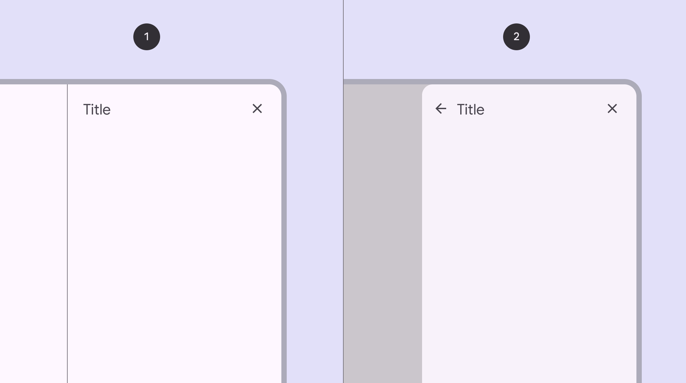
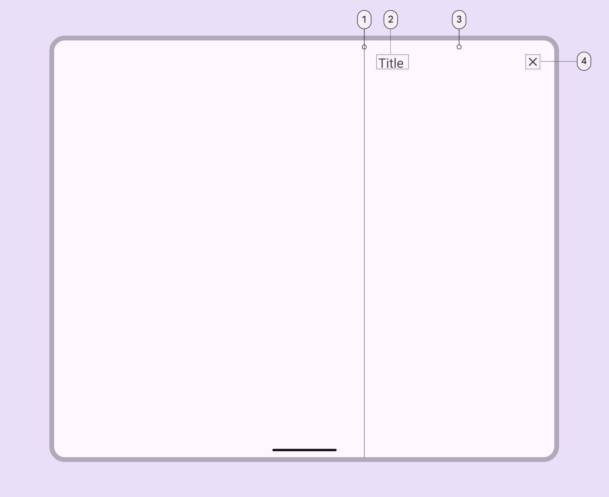
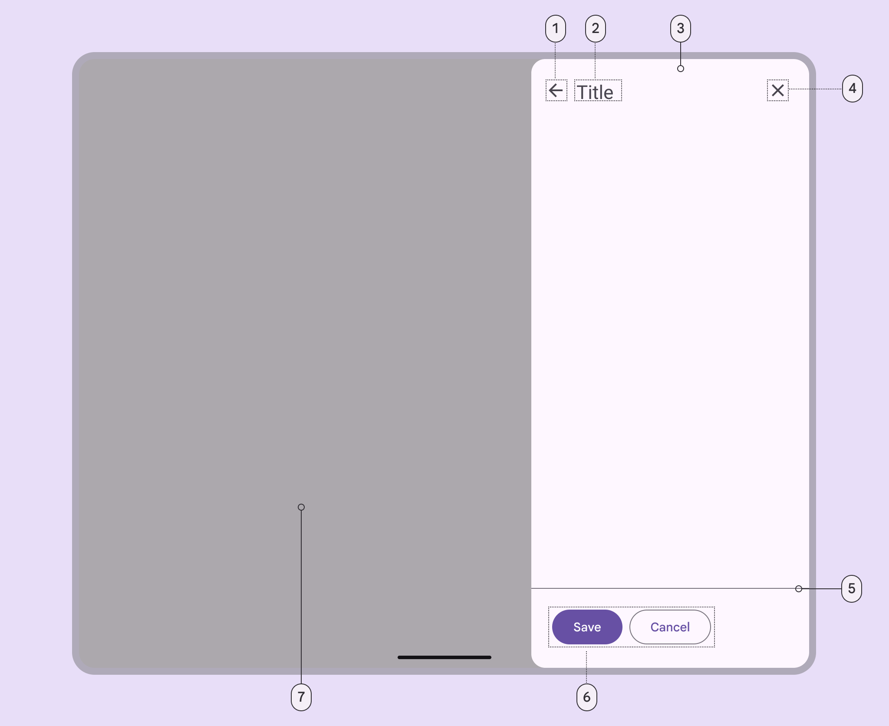

<!--docs:
title: "Side Sheets"
layout: detail
section: components
excerpt: "Side sheets slide in from the side of the screen to reveal more content."
iconId: side_sheet
path: /catalog/side-sheet-behavior/
-->

# Side sheets

[Side sheets](https://m3.material.io/components/side-sheets/overview) are
surfaces containing supplementary content that are anchored to the side of the
screen. There are two variants of side sheets.



1.  Standard side sheet
2.  Modal side sheet

**Note:** Images use various dynamic color schemes.

## Design & API documentation

*   [Material 3 (M3) spec](https://m3.material.io/components/side-sheets/overview)
*   [API reference](https://developer.android.com/reference/com/google/android/material/sidesheet/package-summary)

## Anatomy

#### Standard side sheet



1.  Divider (optional)
2.  Headline
3.  Container
4.  Close affordance

#### Modal side sheet



1.  Back icon button (optional)
2.  Header
3.  Container
4.  Close icon button
5.  Divider (optional)
6.  Action (optional)
7.  Scrim

More details on anatomy items in the
[component guidelines](https://m3.material.io/components/side-sheets/guidelines#4d992de0-362a-41b3-9537-9da4dec148af).

## Key properties

### Sheet attributes

Element                      | Attribute                   | Related method(s)                                       | Default value
---------------------------- | --------------------------- | ------------------------------------------------------- | -------------
**Color**                    | `app:backgroundTint`        | N/A                                                     | `?attr/colorSurface`</br>`?attr/colorSurfaceContainerLow` (modal)
**Coplanar sibling view id** | `app:coplanarSiblingViewId` | `setCoplanarSiblingViewId`<br/>`setCoplanarSiblingView` | N/A
**Shape**                    | `app:shapeAppearance`       | N/A                                                     | `?attr/shapeAppearanceCornerLarge`
**Sheet edge**               | `android:layout_gravity`    | `setSheetEdge` (modal only)                             | end
**Elevation**                | `android:elevation`         | N/A                                                     | 0dp
**Max width**                | `android:maxWidth`          | `setMaxWidth`<br/>`getMaxWidth`                         | N/A
**Max height**               | `android:maxHeight`         | `setMaxHeight`<br/>`getMaxHeight`                       | N/A

### Behavior attributes

More info about these attributes and how to use them in the
[setting behavior](#setting-behavior) section.

Behavior                 | Related method(s)                | Default value
------------------------ | -------------------------------- | -------------
`app:behavior_draggable` | `setDraggable`<br/>`isDraggable` | `true`

### Sheet edge

You can set the sheet to originate from the left or right side of the screen.
You can also automatically switch the sheet edge based on layout direction, by
setting the sheet edge to `start` or `end`.

#### Standard and coplanar sheets

To set a standard or coplanar sheet's edge, set the `gravity` property of the
side sheet `View`'s `CoordinatorLayout.LayoutParams`, then request a layout pass
on the side sheet `View`.

```kt
val layoutParams = sideSheetView.layoutParams
if (layoutParams is CoordinatorLayout.LayoutParams) {
  layoutParams.gravity = sheetGravity
  sideSheetView.requestLayout()
}
```

You can also set the sheet edge with XML, by setting `android:layout_gravity` to
the desired gravity:

```xml
<FrameLayout
  android:id="@+id/side_sheet_container"
  style="@style/Widget.Material3.SideSheet"
  android:layout_width="256dp"
  android:layout_height="match_parent"
  android:layout_gravity="start"
  app:layout_behavior="@string/side_sheet_behavior">
  <include layout="@layout/side_sheet_layout" />
</FrameLayout>
```

#### Modal sheets

To set a modal sheet's edge, pass a `Gravity` constant into `SideSheetDialog`'s
dedicated `setSheetEdge` method. For example, set the sheet edge to `start` like
this:

```kt
sideSheetDialog.setSheetEdge(Gravity.START)
```

Note: Runtime changes to sheet edges are not supported for modal sheets and may
not work as expected. If you'd like to change the sheet edge at runtime, you
should recreate the sheet, then call `setSheetEdge` with the new gravity.

### Styles

Element                   | Value                                     | Theme attribute
------------------------- | ----------------------------------------- | ---------------
Standard side sheet style | `@style/Widget.Material3.SideSheet`       | N/A
Modal side sheet style    | `@style/Widget.Material3.SideSheet.Modal` | `?attr/sideSheetModalStyle`

Note: There is no default style theme attribute for standard side sheets,
because `SideSheetBehavior`s don't have a designated associated `View`. Modal
side sheets use `?attr/sideSheetModalStyle` as the default style, but there is
no need to set `?attr/sideSheetModalStyle` on your modal side sheet layout
because the style is automatically applied to the parent `SideSheetDialog`.

For the full list, see
[styles](https://github.com/material-components/material-components-android/tree/master/lib/java/com/google/android/material/sidesheet/res/values/styles.xml),
[attributes](https://github.com/material-components/material-components-android/tree/master/lib/java/com/google/android/material/sidesheet/res/values/attrs.xml),
and
[themes and theme overlays](https://github.com/material-components/material-components-android/tree/master/lib/java/com/google/android/material/sidesheet/res/values/themes.xml).

## Variants of side sheets

<details>
<summary><h3>Standard side sheet</h3></summary>

Standard side sheets co-exist with the screen’s main UI region and allow for
simultaneously viewing and interacting with both regions. They are commonly used
to keep a feature or secondary content visible on screen when content in the
main UI region is frequently scrolled or panned.

`SideSheetBehavior` is applied to a child of
[CoordinatorLayout](https://developer.android.com/reference/androidx/coordinatorlayout/widget/CoordinatorLayout)
to make that child a standard side sheet, which is a view that comes up from the
side of the screen, elevated over the main content. It can be dragged vertically
to expose more or less content.

API and source code:

*   `SideSheetBehavior`
    *   [Class definition](https://developer.android.com/reference/com/google/android/material/sidesheet/SideSheetBehavior)
    *   [Class source](https://github.com/material-components/material-components-android/tree/master/lib/java/com/google/android/material/sidesheet/SideSheetBehavior.java)

<h4 id="standard-side-sheet-example">Standard side sheet example</h4>

`SideSheetBehavior` works in tandem with `CoordinatorLayout` to let you display
content in a side sheet, perform enter/exit animations, respond to
dragging/swiping gestures, and more.

Apply the `SideSheetBehavior` to a direct child `View` of `CoordinatorLayout`:

```xml
<androidx.coordinatorlayout.widget.CoordinatorLayout
  ...>

  <LinearLayout
    android:id="@+id/standard_side_sheet"
    style="@style/Widget.Material3.SideSheet"
    android:layout_width="256dp"
    android:layout_height="match_parent"
    android:orientation="vertical"
    app:layout_behavior="com.google.android.material.sidesheet.SideSheetBehavior">

    <!-- Side sheet contents. -->
    <TextView
    android:layout_width="wrap_content"
    android:layout_height="wrap_content"
    android:text="@string/title"
    .../>

    <TextView
    android:layout_width="wrap_content"
    android:layout_height="wrap_content"
    android:text="@string/supporting_text"
    .../>

    <Button
    android:id="@+id/sidesheet_button"
    android:layout_width="wrap_content"
    android:layout_height="wrap_content"
    android:text="@string/action"
    .../>

  </LinearLayout>

</androidx.coordinatorlayout.widget.CoordinatorLayout>
```

In this example, the side sheet is the `LinearLayout`.

#### Coplanar side sheet

Coplanar side sheets are standard side sheets that "squash" a sibling view's
content as the side sheet expands. Coplanar side sheets are on the same plane as
their sibling, as opposed to standard side sheets, which are displayed above the
screen content.

Note: Coplanar side sheets are not recommended for narrow screens.

##### Coplanar side sheet example

To add a coplanar side sheet to your app, follow the steps to
[add a standard side sheet to your layout](#standard-side-sheet-example), above,
and simply set `app:coplanarSiblingViewId` on the `View` that has the side sheet
`layout_behavior` set on it. You can point the coplanar sibling view id to any
child of the `CoordinatorLayout`. Make sure to set
`style="@style/Widget.Material3.SideSheet"` on your side sheet view, as well.

Alternatively, you can set the coplanar sibling view programmatically:

```kt
coplanarSideSheet.setCoplanarSiblingView(coplanarSiblingView)
```

To remove coplanar functionality from a side sheet, simply set the coplanar
sibling view to `null`:

```kt
coplanarSideSheet.setCoplanarSiblingView(null)
```

</details>

<details>
<summary><h3>Modal side sheet</h3></summary>

Modal side sheets present the sheet while blocking interaction with the rest of
the screen. They are an alternative to inline menus and simple dialogs on mobile
devices, providing additional room for content, iconography, and actions.

Modal side sheets render a scrim on the non-side sheet content, to indicate that
they are modal and block interaction with the rest of the screen. If the content
outside of the dialog is tapped, the side sheet is dismissed. Modal side sheets
can be dragged horizontally and dismissed by sliding them off of the screen.

API and source code:

*   `SideSheetDialog`
    *   [Class definition](https://developer.android.com/reference/com/google/android/material/sidesheet/SideSheetDialog)
    *   [Class source](https://github.com/material-components/material-components-android/tree/master/lib/java/com/google/android/material/sidesheet/SideSheetDialog.java)

#### Modal side sheet example

To show a modal side sheet, instantiate a `SideSheetDialog` with the desired
`context`:

```kt
val sideSheetDialog = SideSheetDialog(requireContext());
```

Then, you can set the content view of the `SideSheetDialog`:

```kt
sideSheetDialog.setContentView(R.layout.side_sheet_content_layout)
```

You can then show the side sheet with `sideSheetDialog.show()` and dismiss it
with `sideSheetDialog.hide()`. `SideSheetDialog` has built in functionality to
automatically cancel the dialog after it is swiped off the screen.

</details>

## Code implementation

Before you can use Material side sheets, you need to add a dependency to the
Material components for Android library. For more information, go to the
[Getting started](https://github.com/material-components/material-components-android/tree/master/docs/getting-started.md)
page.

### Adding side sheets

Note: Side sheets were introduced in `1.8.0`. To use side sheets, make sure
you're depending on
[library version `1.8.0`](https://github.com/material-components/material-components-android/releases/tag/1.8.0)
or later.

**Standard side sheet basic usage:**

```xml
<androidx.coordinatorlayout.widget.CoordinatorLayout
  ...>

  <FrameLayout
    ...
    android:id="@+id/standard_side_sheet"
    app:layout_behavior="com.google.android.material.sidesheet.SideSheetBehavior">

    <!-- Side sheet content. -->

  </FrameLayout>

</androidx.coordinatorlayout.widget.CoordinatorLayout>
```

### Listening to state and slide changes

`SideSheetCallback`s can be added to a `SideSheetBehavior` to listen for state
and slide changes:

```kt
val sideSheetCallback = object : SideSheetBehavior.SideSheetCallback() {

    override fun onStateChanged(sideSheet: View, newState: Int) {
        // Do something for new state.
    }

    override fun onSlide(sideSheet: View, slideOffset: Float) {
        // Do something for slide offset.
    }
}

// To add a callback:
sideSheetBehavior.addCallback(sideSheetCallback)

// To remove a callback:
sideSheetBehavior.removeCallback(sideSheetCallback)
```

<h3 id="setting-behavior">Setting behavior</h3>

There are several attributes that can be used to adjust the behavior of standard
and modal side sheets.

Behavior attributes can be applied to standard side sheets in xml by setting
them on a child `View` set to `app:layout_behavior`, or programmatically:

```kt
val standardSideSheetBehavior = SideSheetBehavior.from(standardSideSheet)
// Use this to programmatically apply behavior attributes
```

More information about these attributes and their default values is available in
the [behavior attributes](#behavior-attributes) section.

### Setting state

Standard side sheets have the following states:

*   `STATE_EXPANDED`: The side sheet is visible at its maximum height and it is
    neither dragging nor settling (see below).
*   `STATE_HIDDEN`: The side sheet is no longer visible and can only be re-shown
    programmatically.
*   `STATE_DRAGGING`: The user is actively dragging the side sheet.
*   `STATE_SETTLING`: The side sheet is settling to a specific height after a
    drag/swipe gesture. This will be the peek height, expanded height, or 0, in
    case the user action caused the side sheet to hide.

You can set a state on the side sheet:

```kt
sideSheetBehavior.state = Sheet.STATE_HIDDEN
```

**Note:** `STATE_SETTLING` and `STATE_DRAGGING` should not be set
programmatically.

### Predictive back

#### Standard and coplanar (non-modal) side sheets

To set up predictive back for standard or coplanar (non-modal) side sheets using
`SideSheetBehavior`, create an AndroidX back callback that forwards
`BackEventCompat` objects to your `SideSheetBehavior`:

```kt
val sideSheetBackCallback = object : OnBackPressedCallback(/* enabled= */false) {
  override fun handleOnBackStarted(backEvent: BackEventCompat) {
    sideSheetBehavior.startBackProgress(backEvent)
  }

  override fun handleOnBackProgressed(backEvent: BackEventCompat) {
    sideSheetBehavior.updateBackProgress(backEvent)
  }

  override fun handleOnBackPressed() {
    sideSheetBehavior.handleBackInvoked()
  }

  override fun handleOnBackCancelled() {
    sideSheetBehavior.cancelBackProgress()
  }
}
```

And then add and enable the back callback as follows:

```kt
getOnBackPressedDispatcher().addCallback(this, sideSheetBackCallback)

sideSheetBehavior.addCallback(object : SideSheetCallback() {
  override fun onStateChanged(sideSheet: View, newState: Int) {
    when (newState) {
      STATE_EXPANDED, STATE_SETTLING -> sideSheetBackCallback.setEnabled(true)
      STATE_HIDDEN -> sideSheetBackCallback.setEnabled(false)
      else -> {
        // Do nothing, only change callback enabled for above states.
      }
    }
  }

  override fun onSlide(sideSheet: View, slideOffset: Float) {}
})
```

#### Modal side sheets

The modal `SideSheetDialog` component automatically supports
[predictive back](/third_party/java_src/android_libs/material_components/docs/foundations/PredictiveBack.md).
No further integration is required on the app side other than the general
predictive back prerequisites and migration steps mentioned
[here](/third_party/java_src/android_libs/material_components/docs/foundations/PredictiveBack.md#usage).

Visit the
[predictive back design guidelines](https://m3.material.io/components/side-sheets/guidelines#d77245e3-1013-48f8-a9d7-76f484e1be13)
to see how the component behaves when a user swipes back.

## Customizing side sheets

### Theming side sheets

Side sheets support the customization of color, shape, and more.

#### Side sheet theming example

API and source code:

*   `SideSheetBehavior`
    *   [Class definition](https://developer.android.com/reference/com/google/android/material/sidesheet/SideSheetBehavior)
    *   [Class source](https://github.com/material-components/material-components-android/tree/master/lib/java/com/google/android/material/sidesheet/SideSheetBehavior.java)
*   `SideSheetDialog`
    *   [Class definition](https://developer.android.com/reference/com/google/android/material/sidesheet/SideSheetDialog)
    *   [Class source](https://github.com/material-components/material-components-android/tree/master/lib/java/com/google/android/material/sidesheet/SideSheetDialog.java)

Setting the theme attribute `sideSheetDialogTheme` to your custom `ThemeOverlay`
will affect all side sheets.

In `res/values/themes.xml`:

```xml
<style name="Theme.App" parent="Theme.Material3.*">
  ...
  <item name="sideSheetDialogTheme">@style/ThemeOverlay.App.SideSheetDialog</item>
</style>

<style name="ThemeOverlay.App.SideSheetDialog" parent="ThemeOverlay.Material3.SideSheetDialog">
    <item name="sideSheetModalStyle">@style/Widget.App.SideSheet.Modal</item>
</style>
```

In `res/values/styles.xml`:

```xml
<style name="Widget.App.SideSheet.Modal" parent="Widget.Material3.SideSheet.Modal">
    <item name="backgroundTint">@color/shrine_pink_light</item>
    <item name="shapeAppearance">@style/ShapeAppearance.App.Corner.Large</item>
</style>

<style name="ShapeAppearance.App.Corner.Large" parent="ShapeAppearance.Material3.Corner.Large">
    <item name="cornerFamily">cut</item>
    <item name="cornerSize">24dp</item>
</style>
```

**Note:** The benefit of using a custom `ThemeOverlay` is that any changes to
your main theme, such as updated colors, will be reflected in the side sheet, as
long as they're not overridden in your custom theme overlay. If you use a custom
`Theme` instead, by extending from one of the
`Theme.Material3.*.SideSheetDialog` variants, you will have more control over
exactly what attributes are included in each, but it also means you'll have to
duplicate any changes that you've made in your main theme into your custom
theme.
