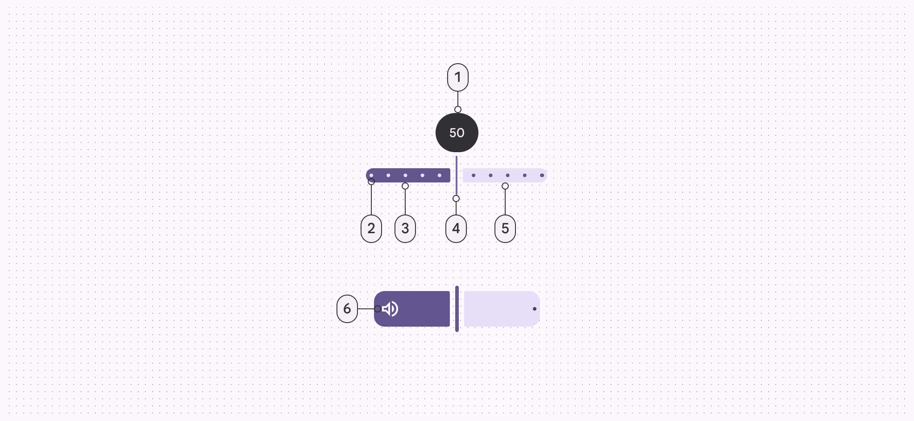
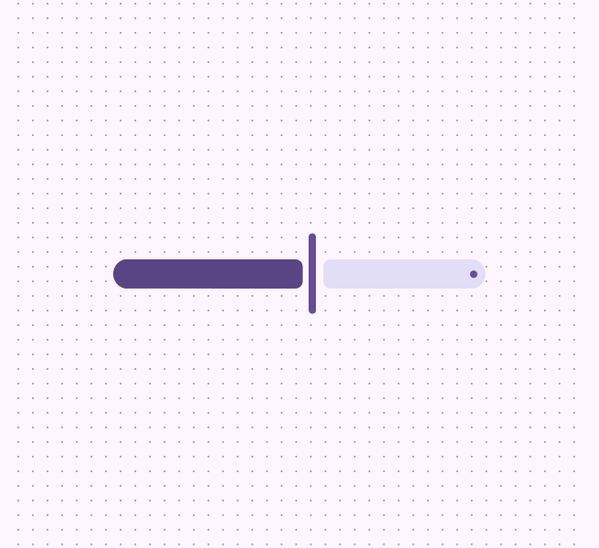
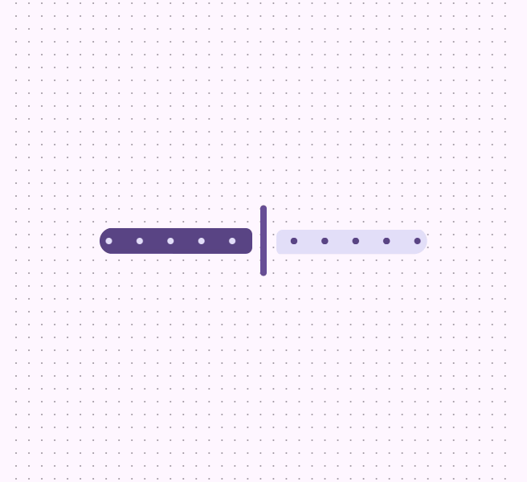
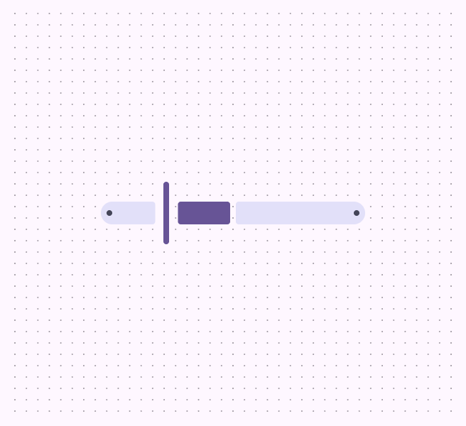
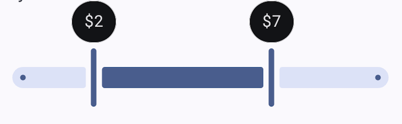

<!--docs:
title: "Sliders"
layout: detail
section: components
excerpt: "Sliders allow users to make selections from a range of values."
iconId: slider
path: /catalog/sliders/
-->

# Slider

[Sliders](https://m3.material.io/components/sliders/) let users make selections
from a range of values. There are three variants of sliders.


1.  Standard
2.  Centered
3.  Range

**Note:** Images use various dynamic color schemes.

## Design & API documentation

*   [Material 3 (M3) spec](https://m3.material.io/components/sliders/overview/)
*   [API reference](https://developer.android.com/reference/com/google/android/material/slider/package-summary)

## Anatomy



1.  Value indicator (optional)
2.  Stop indicators (optional)
3.  Active track
4.  Handle
5.  Inactive track
6.  Inset icon (optional)

More details on anatomy items in the
[component guidelines](https://m3.material.io/components/sliders/guidelines#b3701f5e-128a-4807-bca7-033402b4266a).

## M3 Expressive

### M3 Expressive update

Before you can use `Material3Expressive` component styles, follow the
[`Material3Expressive themes` setup instructions](https://github.com/material-components/material-components-android/tree/master/docs/getting-started.md#material3expressive-themes).

The slider includes expressive configurations for orientation, shape sizes, and
an inset icon.
[More on M3 Expressive](https://m3.material.io/blog/building-with-m3-expressive)

**Types and naming:**

*   Changed **continuous** slider to **standard** slider
*   The **discrete** slider is now the **stops** configuration

**New configurations:**

*   Orientation: Horizontal, vertical
*   Optional inset icon (standard slider only)
*   Sizes: XS (existing default), S, M, L, XL

### M3 Expressive styles

The expressive slider comes with 5 pre-defined styles varying in track thickness
and corner size:

- `Widget.Material3Expressive.Slider.Xsmall` (default)
- `Widget.Material3Expressive.Slider.Small`
- `Widget.Material3Expressive.Slider.Medium`
- `Widget.Material3Expressive.Slider.Large`
- `Widget.Material3Expressive.Slider.Xlarge`

## Key properties

### Track attributes

Element                                    | Attribute                     | Related method(s)                                             | Default value
------------------------------------------ | ----------------------------- | ------------------------------------------------------------- | -------------
**Orientation**                            | `android:orientation`         | `setOrientation`<br/>`isVertical`                             | `horizontal`
**Min value**                              | `android:valueFrom`           | `setValueFrom`<br/>`getValueFrom`                             | N/A
**Max value**                              | `android:valueTo`             | `setValueTo`<br/>`getValueTo`                                 | N/A
**Step size (discrete)**                   | `android:stepSize`            | `setStepSize`<br/>`getStepSize`                               | N/A
**Initial selected value (Slider)**        | `android:value`               | `setValue`<br/>`getValue`                                     | N/A
**Initial selected values (RangeSlider)**  | `app:values`                  | `setValues`<br/>`getValues`                                   | N/A
**Centered**                               | `app:centered`                | `setCentered`<br/>`isCentered`                                | `false`
**Continuous mode tick count**             | `app:continuousModeTickCount` | `setContinuousModeTickCount`<br/>`getContinuousModeTickCount` | 0
**Height**                                 | `app:trackHeight`             | `setTrackHeight`<br/>`getTrackHeight`                         | `16dp`
**Color**                                  | `app:trackColor`              | `setTrackTintList`<br/>`getTrackTintList`                     | `null`
**Color for track's active part**          | `app:trackColorActive`        | `setTrackActiveTintList`<br/>`getTrackActiveTintList`         | `?attr/colorPrimary`
**Color for track's inactive part**        | `app:trackColorInactive`      | `setTrackInactiveTintList`<br/>`getTrackInactiveTintList`     | `?attr/colorSurfaceContainerHighest`
**Corner size**                            | `app:trackCornerSize`         | `setTrackCornerSize`<br/>`getTrackCornerSize`                 | `trackHeight / 2`
**Inside corner size**                     | `app:trackInsideCornerSize`   | `setTrackInsideCornerSize`<br/>`getTrackInsideCornerSize`     | `2dp`
**Stop indicator size**                    | `app:trackStopIndicatorSize`  | `setTrackStopIndicatorSize`<br/>`getTrackStopIndicatorSize`   | `4dp`
**Minimum separation for adjacent thumbs** | `app:minSeparation`           | `setMinSeparation`<br/>`getMinSeparation`                     | `0dp`
**Active start icon**                      | `app:trackIconActiveStart`    | `setTrackIconActiveStart`<br/>`getTrackIconActiveStart`       | `null`
**Active end icon**                        | `app:trackIconActiveEnd`      | `setTrackIconActiveEnd`<br/>`getTrackIconActiveEnd`           | `null`
**Active icon color**                      | `app:trackIconActiveColor`    | `setTrackIconActiveColor`<br/>`getTrackIconActiveColor`       | N/A
**Inactive start icon**                    | `app:trackIconInactiveStart`  | `setTrackIconInactiveStart`<br/>`getTrackIconInactiveStart`   | `null`
**Inactive end icon**                      | `app:trackIconInactiveEnd`    | `setTrackIconInactiveEnd`<br/>`getTrackIconInactiveEnd`       | `null`
**Inactive icon color**                    | `app:trackIconInactiveColor`  | `setTrackIconInactiveColor`<br/>`getTrackIconInactiveColor`   | N/A
**Icon size**                              | `app:trackIconSize`           | `setTrackIconSize`<br/>`getTrackIconSize`                     | N/A

**Note:** `app:trackColor` takes precedence over `app:trackColorActive` and
`app:trackColorInative`. It's a shorthand for setting both values to the same
thing.

**Note:** `app:trackStopIndicatorSize` takes precedence over
`app:tickRadiusActive` and `app:tickRadiusInactive`.

**Note:** `vertical` orientation still uses `height` in the same way as for
`horizontal` orientation. In this context, `height` can be seen as track
thickness.

### Thumb attributes

Element          | Attribute               | Related method(s)                                                                 | Default value
---------------- | ----------------------- | --------------------------------------------------------------------------------- | -------------
**Color**        | `app:thumbColor`        | `setThumbTintList`<br/>`getThumbTintList`                                         | `?attr/colorPrimary`
**Width**        | `app:thumbWidth`        | `setThumbWidth`<br/>`setThumbWidthResource`<br/>`getThumbWidth`                   | `4dp`
**Height**       | `app:thumbHeight`       | `setThumbHeight`<br/>`setThumbHeightResource`<br/>`getThumbHeight`                | `44dp`
**Radius**       | `app:thumbRadius`       | `setThumbRadiusResource`<br/>`setThumbRadius`<br/>`getThumbRadius`                | N/A
**Elevation**    | `app:thumbElevation`    | `setThumbElevationResource`<br/>`setThumbElevation`<br/>`getThumbElevation`       | `2dp`
**Halo color**   | `app:haloColor`         | `setHaloTintList`<br/>`getHaloTintList`                                           | `@android:color/transparent`
**Halo radius**  | `app:haloRadius`        | `setHaloRadiusResource`<br/>`setHaloRadius`<br/>`getHaloRadius`                   | N/A
**Stroke color** | `app:thumbStrokeColor`  | `setThumbStrokeColor`<br/>`setThumbStrokeColorResource`<br/>`getThumbStrokeColor` | `null`
**Stroke width** | `app:thumbStrokeWidth`  | `setThumbStrokeWidth`<br/>`setThumbStrokeWidthResource`<br/>`getThumbStrokeWidth` | `0dp`
**Gap size**     | `app:thumbTrackGapSize` | `setThumbTrackGapSize`<br/>`getThumbTrackGapSize`                                 | `6dp`

**Note:** `app:thumbWidth` and `app:thumbHeight` take precedence over
`app:thumbRadius`.

### Value label attributes

Element       | Attribute           | Related method(s)                           | Default value
------------- | ------------------- | ------------------------------------------- | -------------
**Style**     | `app:labelStyle`    | N/A                                         | `@style/Widget.Material3.Tooltip`
**Formatter** | N/A                 | `setLabelFormatter`<br/>`hasLabelFormatter` | `null`
**Behavior**  | `app:labelBehavior` | `setLabelBehavior`<br/>`getLabelBehavior`   | `floating`

**Note:** The value label is a
[Tooltip](https://github.com/material-components/material-components-android/tree/master/lib/java/com/google/android/material/tooltip/TooltipDrawable.java).

### Tick mark attributes

Element                             | Attribute                | Related method(s)                                       | Default value
----------------------------------- | ------------------------ | ------------------------------------------------------- | -------------
**Color**                           | `app:tickColor`          | `setTickTintList`<br/>`getTickTintList`                 | `null`
**Color for tick's active part**    | `app:tickColorActive`    | `setTickActiveTintList`<br/>`getTickActiveTintList`     | `?attr/colorSurfaceContainerHighest`
**Color for tick's inactive part**  | `app:tickColorInactive`  | `setTickInactiveTintList`<br/>`getTickInactiveTintList` | `?attr/colorPrimary`
**Radius for tick's active part**   | `app:tickRadiusActive`   | `setTickActiveRadius`<br/>`getTickActiveRadius`         | `null` (1/2 trackStopIndicatorSize)
**Radius for tick's inactive part** | `app:tickRadiusInactive` | `setTickInactiveRadius`<br/>`getTickInactiveRadius`     | `null` (1/2 trackStopIndicatorSize)
**Tick visible** (deprecated)       | `app:tickVisible`        | `setTickVisible`<br/>`isTickVisible()`                  | `true`
**Tick visibility mode**            | `app:tickVisibilityMode` | `setTickVisibilityMode`<br/>`getTickVisibilityMode()`   | `autoLimit`

**Note:** `app:tickColor` takes precedence over `app:tickColorActive` and
`app:tickColorInactive`. It's a shorthand for setting both values to the same
thing.

**Note:** `app:tickVisible` is deprecated in favor of `app:tickVisibilityMode`.

### Styles

Element           | Style                     | Theme attribute
----------------- | ------------------------- | -------------------
**Default style** | `Widget.Material3.Slider` | `?attr/sliderStyle`

For the full list, see
[styles](https://github.com/material-components/material-components-android/tree/master/lib/java/com/google/android/material/slider/res/values/styles.xml)
and
[attributes](https://github.com/material-components/material-components-android/tree/master/lib/java/com/google/android/material/slider/res/values/attrs.xml).

### Non-text contrast update

In order to comply with the latest accessibility requirements, the `Slider` has
been updated with additional attributes:

-   `app:thumbTrackGapSize`: size of the gap between the thumb and the track,
    6dp by default.
-   `app:trackInsideCornerSize`: size of the corners towards the thumb when a
    gap is present, 2dp by default.
-   `app:trackStopIndicatorSize`: size of the stop at the start/end of the
    track, 4dp by default.

`*.Legacy` styles have been added to revert to the previous behavior (**not
recommended**):

-   `Widget.Material3.Slider.Legacy`

## Variants of sliders

### Standard slider

Standard sliders select one value from a range of values. Use this when the
slider should start from zero or the beginning of a sequence.

API and source code:

*   `Slider`
    *   [Class definition](https://developer.android.com/reference/com/google/android/material/slider/Slider)
    *   [Class source](https://github.com/material-components/material-components-android/tree/master/lib/java/com/google/android/material/slider/Slider.java)

**Add a `Standard slider` to a layout:**



```xml
<com.google.android.material.slider.Slider
    android:id="@+id/slider"
    android:layout_width="match_parent"
    android:layout_height="wrap_content"
    android:contentDescription="@string/slider_desc"
    android:value="20.0"
    android:valueFrom="0.0"
    android:valueTo="100.0" />
```

**Add a `standard slider with stop indicator` to a layout:**

Stop indicators show which predetermined values can be chosen on the slider. The
slider handle snaps to the closest stop.



```xml
<com.google.android.material.slider.Slider
    ...
    android:valueFrom="0.0"
    android:valueTo="100.0"
    android:stepSize="10.0"  />
```

**Observe changes to a slider:**

```kt
slider.addOnSliderTouchListener(object : Slider.OnSliderTouchListener {
    override fun onStartTrackingTouch(slider: Slider) {
        // Responds to when slider's touch event is being started
    }

    override fun onStopTrackingTouch(slider: Slider) {
        // Responds to when slider's touch event is being stopped
    }
})

slider.addOnChangeListener { slider, value, fromUser ->
    // Responds to when slider's value is changed
}
```

### Centered slider

Centered sliders select a value from a positive and negative value range. Use
this when zero, or the default value, is in the middle of the range.

**Add a `centered slider` to a layout:**



```xml
<com.google.android.material.slider.Slider
    android:id="@+id/slider"
    android:layout_width="match_parent"
    android:layout_height="wrap_content"
    android:contentDescription="@string/slider_desc"
    android:value="0.0"
    android:valueFrom="-100.0"
    android:valueTo="100.0" />
```

### Range slider

A slider with two thumbs is called a range slider. Range sliders select two
values on one slider to create a range. Use this when defining a minimum and
maximum value.

*   `RangeSlider`
    *   [Class definition](https://developer.android.com/reference/com/google/android/material/slider/RangeSlider)
    *   [Class source](https://github.com/material-components/material-components-android/tree/master/lib/java/com/google/android/material/slider/RangeSlider.java)

**Add a `range slider` to a layout:**


```xml
<com.google.android.material.slider.RangeSlider
  android:id="@+id/range_slider"
  android:layout_width="match_parent"
  android:layout_height="wrap_content"
  android:contentDescription="@string/slider_desc"
  app:values="@array/initial_slider_values"
  android:valueFrom="0.0"
  android:valueTo="100.0" />
```

**Add a `range slider with stop indicator` to a layout:**

Stop indicators show which predetermined values can be chosen on the slider. The
slider handle snaps to the closest stop.


```xml
<com.google.android.material.slider.RangeSlider
    ...
    android:valueFrom="0.0"
    android:valueTo="100.0"
    app:values="@array/initial_slider_values"
    android:stepSize="10.0"  />
```

And in `values/arrays.xml`:

```xml
<resources>
  <array name="initial_slider_values">
    <item>20.0</item>
    <item>70.0</item>
  </array>
</resources>
```

**Observe changes to a range slider:**

```kt
rangeSlider.addOnSliderTouchListener(object : RangeSlider.OnSliderTouchListener {
    override fun onStartTrackingTouch(slider: RangeSlider) {
        // Responds to when slider's touch event is being started
    }

    override fun onStopTrackingTouch(slider: RangeSlider) {
        // Responds to when slider's touch event is being stopped
    }
})

rangeSlider.addOnChangeListener { rangeSlider, value, fromUser ->
    // Responds to when slider's value is changed
}
```

## Code implementation

Before you can use Material sliders, you need to add a dependency to the
Material components for Android library. For more information, go to the
[Getting started](https://github.com/material-components/material-components-android/tree/master/docs/getting-started.md)
page.

### Making sliders accessible

Sliders support setting content descriptors for use with screen readers. While
optional, we strongly encourage their use.

That can be done in XML via the `android:contentDescription` attribute or
programmatically:

```kt
slider.contentDescription = contentDescription
```

If using a `TextView` to display the value of the slider, you should set
`android:labelFor` so that screen readers announce that `TextView` refers to the
slider.

The minimum touch target size of the thumb is 48dp by default. If a different
size is needed, please set `minTouchTargetSize` in the style or the layout.

### Setting a `LabelFormatter`

By using a `LabelFormatter` you can display the selected value using letters to
indicate magnitude (e.g.: 1.5K, 3M, 12B). That can be achieved through the
`setLabelFormatter` method.

The following example shows a slider for a price range in USD currency.



In code:

```kt
rangeSlider.setLabelFormatter { value: Float ->
    val format = NumberFormat.getCurrencyInstance()
    format.maximumFractionDigits = 0
    format.currency = Currency.getInstance("USD")
    format.format(value.toDouble())
}
```

## Customizing sliders

### Theming sliders

Sliders support
[Material Theming](https://material.io/components/sliders#theming) which can
customize color and typography.

#### Slider theming example

API and source code:

*   `Slider`
    *   [Class definition](https://developer.android.com/reference/com/google/android/material/slider/Slider)
    *   [Class source](https://github.com/material-components/material-components-android/tree/master/lib/java/com/google/android/material/slider/Slider.java)

The following example shows a range slider with Material theming.


##### Implementing slider theming

Use theme attributes and styles in `res/values/styles.xml` which applies to all
sliders and affects other components:

```xml
<style name="Theme.App" parent="Theme.Material3.*">
    ...
    <item name="colorPrimary">@color/shrine_pink_100</item>
    <item name="colorOnPrimary">@color/shrine_pink_900</item>
    <item name="colorOnSurface">@color/shrine_pink_100</item>
</style>
```

Use a default style theme attribute, styles and a theme overlay which applies to
all sliders but does not affect other components:

```xml
<style name="Theme.App" parent="Theme.Material3.*">
    ...
    <item name="sliderStyle">@style/Widget.App.Slider</item>
</style>

<style name="Widget.App.Slider" parent="Widget.Material3.Slider.Legacy">
    <item name="materialThemeOverlay">@style/ThemeOverlay.App.Slider</item>
    <item name="labelStyle">@style/Widget.App.Tooltip</item>
  </style>

<style name="ThemeOverlay.App.Slider" parent="">
    <item name="colorPrimary">@color/shrine_pink_100</item>
    <item name="colorOnPrimary">@color/shrine_pink_900</item>
    <item name="colorOnSurface">@color/shrine_pink_100</item>
</style>

<style name="Widget.App.Tooltip" parent="Widget.Material3.Tooltip">
    <item name="android:textAppearance">@style/TextAppearance.App.Tooltip</item>
    <item name="backgroundTint">@color/shrine_pink_900</item>
  </style>

<style name="TextAppearance.App.Tooltip" parent="TextAppearance.Material3.BodySmall">
  <item name="android:textColor">@color/shrine_pink_100</item>
  <item name="fontFamily">@font/rubik</item>
  <item name="android:fontFamily">@font/rubik</item>
</style>
```

Use the style in the layout, which affects only this specific slider:

```xml
<com.google.android.material.slider.RangeSlider
    ...
    style="@style/Widget.App.Slider"  />
```
