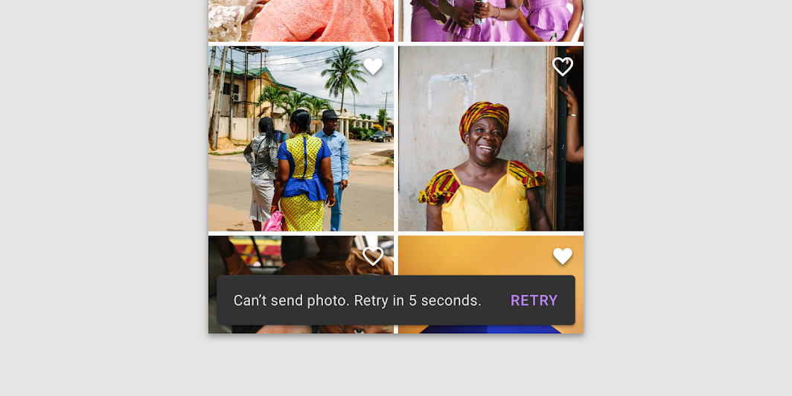
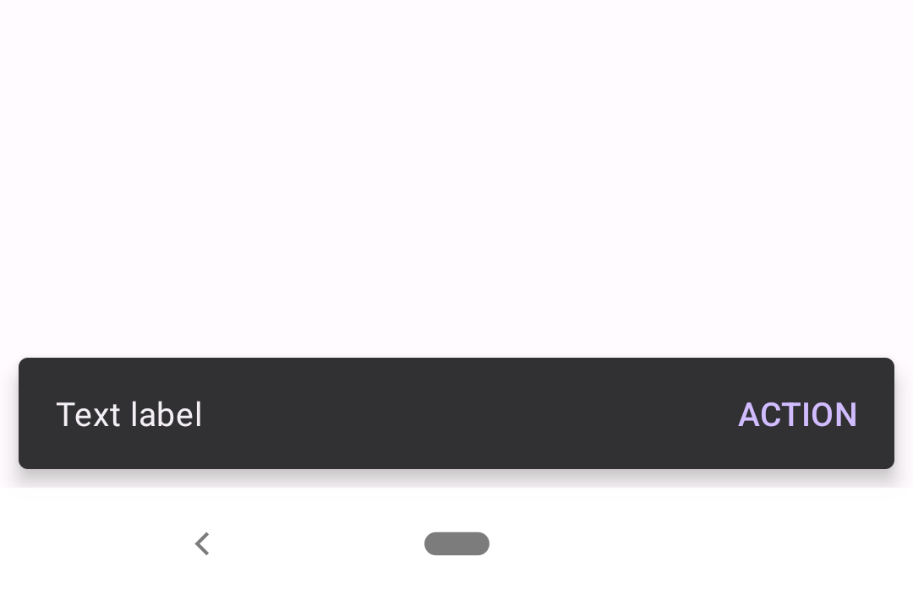
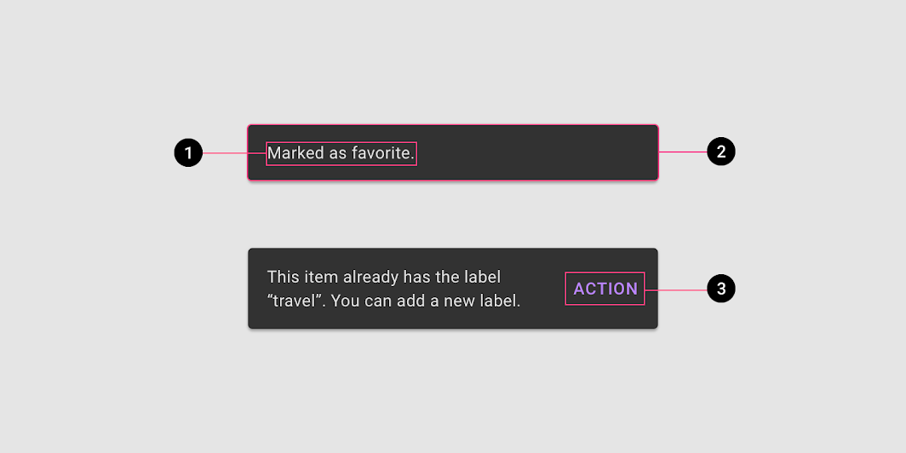
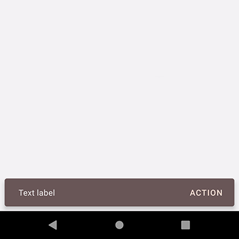

<!--docs:
title: "Snackbars"
layout: detail
section: components
excerpt: "Snackbars provide brief messages about app processes at the bottom of the screen."
iconId: toast
path: /catalog/snackbars/
-->

# Snackbars

[Snackbars](https://material.io/components/snackbars) provide brief messages
about app processes at the bottom of the screen.



**Contents**

*   [Using snackbars](#using-snackbars)
*   [Snackbar](#snackbar)
*   [Theming snackbars](#theming-snackbars)

## Using snackbars

Before you can use Material snackbars, you need to add a dependency to the
Material Components for Android library. For more information, go to the
[Getting started](https://github.com/material-components/material-components-android/tree/master/docs/getting-started.md)
page.

The `Snackbar` class provides static `make` methods to produce a snackbar
configured in the desired way. These methods take a `View`, which will be used
to find a suitable ancestor `ViewGroup` to display the snackbar in, a text
string to display, and a duration to display the snackbar for. A suitable
ancestor `ViewGroup` will be either the nearest `CoordinatorLayout` to the
`View` passed in, or the root `DecorView` if none could be found.

Available duration presets are:

*   `LENGTH_INDEFINITE` (Show the snackbar until it's either dismissed or
    another snackbar is shown)
*   `LENGTH_LONG` (Show the snackbar for a long period of time)
*   `LENGTH_SHORT` (Show the snackbar for a short period of time)

_**Note:** Snackbars work best if they are displayed inside of a
[CoordinatorLayout](https://developer.android.com/reference/androidx/coordinatorlayout/widget/CoordinatorLayout).
`CoordinatorLayout` allows the snackbar to enable behavior like
swipe-to-dismiss, as well as automatically moving widgets like
[FloatingActionButton](FloatingActionButton.md)._

### Making snackbars accessible

Snackbars support content labeling for accessibility and are readable by most
screen readers, such as TalkBack. Text rendered in snackbars is automatically
provided to accessibility services. Additional content labels are usually
unnecessary.

### Showing a snackbar

Calling `make` creates the snackbar, but doesn't cause it to be visible on the
screen. To show it, use the `show` method on the returned `Snackbar` instance.
Note that only one snackbar will be shown at a time. Showing a new snackbar will
dismiss any previous ones first.

To show a snackbar with a message and no action:

```kt
// The view used to make the snackbar.
// This should be contained within the view hierarchy you want to display the
// snackbar. Generally it can be the view that was interacted with to trigger
// the snackbar, such as a button that was clicked, or a card that was swiped.
val contextView = findViewById<View>(R.id.context_view)

Snackbar.make(contextView, R.string.text_label, Snackbar.LENGTH_SHORT)
    .show()
```

### Adding an action

To add an action, use the `setAction` method on the object returned from `make`.
Snackbars are automatically dismissed when the action is clicked.

To show a snackbar with a message and an action:

```kt
Snackbar.make(contextView, R.string.text_label, Snackbar.LENGTH_LONG)
    .setAction(R.string.action_text) {
        // Responds to click on the action
    }
    .show()
```

### Anchoring a snackbar

By default, `Snackbar`s will be anchored to the bottom edge of their parent
view. However, you can use the `setAnchorView` method to make a `Snackbar`
appear above a specific view within your layout, e.g. a `FloatingActionButton`.

```kt
Snackbar.make(...)
    .setAnchorView(fab)
    ...
```

This is especially helpful if you would like to place a `Snackbar` above
navigational elements at the bottom of the screen, such as a `BottomAppBar` or
`BottomNavigationView`.

### Related concepts

Temporary bottom bars with other sorts of content layouts can be implemented by
subclassing
[BaseTransientBottomBar](https://developer.android.com/reference/com/google/android/material/snackbar/BaseTransientBottomBar).

Android also provides a
[Toast](https://developer.android.com/reference/android/widget/Toast.html) class
with a similar API that can be used for displaying system-level notifications.
Generally, snackbars are the preferred mechanism for displaying feedback
messages to users, as they can be displayed in the context of the UI where the
action occurred. Reserve `Toast` for cases where this cannot be done.

## Snackbar

Snackbars inform users of a process that an app has performed or will perform.
They appear temporarily, towards the bottom of the screen. They shouldn’t
interrupt the user experience, and they don’t require user input to disappear.
They disappear either after a timeout or after a user interaction elsewhere on
the screen, but can also be swiped off the screen.

Snackbars can also offer the ability to perform an action, such as undoing an
action that was just taken, or retrying an action that had failed.

### Snackbars example

API and source code:

*   `Snackbar`
    *   [Class definition](https://developer.android.com/reference/com/google/android/material/snackbar/Snackbar)
    *   [Class source](https://github.com/material-components/material-components-android/tree/master/lib/java/com/google/android/material/snackbar/Snackbar.java)

The following is an example of a snackbar with an action button:



In code:

```kt
Snackbar.make(contextView, "Text label", Snackbar.LENGTH_LONG)
    .setAction("Action") {
        // Responds to click on the action
    }
    .show()
```

## Anatomy and key properties

The following is an anatomy diagram of a snackbar:



1.  Text label
1.  Container
1.  Action (optional)

### Text label attributes

&nbsp;               | Attribute                | Related method(s) | Default value
-------------------- | ------------------------ | ----------------- | -------------
**Text label style** | N/A                      | N/A               | `?attr/snackbarTextViewStyle`
**Text label**       | `android:text`           | `setText`         | `null`
**Color**            | `android:textColor`      | `setTextColor`    | `?attr/colorSurface`
**Typography**       | `android:textAppearance` | N/A               | `?attr/textAppearanceBody2`

### Container attributes

&nbsp;                  | Attribute                         | Related method(s)                               | Default value
----------------------- | --------------------------------- | ----------------------------------------------- | -------------
**Color**               | `app:backgroundTint`              | `setBackgroundTint`<br/>`setBackgroundTintList` | `?attr/colorSurface` at 80% over `?attr/colorOnSurface`
**Color overlay alpha** | `app:backgroundOverlayColorAlpha` | N/A                                             | `0.8f` (ignored if `app:backgroundTint` is set)
**Margin**              | `android:layout_margin`           | N/A                                             | `8dp`
**Elevation**           | `app:elevation`                   | N/A                                             | `6dp`
**Animation mode**      | `app:animationMode`               | `setAnimationMode`<br/>`getAnimationMode`       | `fade`

### Action attributes

&nbsp;               | Attribute                  | Related method(s)    | Default value
-------------------- | -------------------------- | -------------------- | -------------
**Button style**     | N/A                        | N/A                  | `?attr/snackbarButtonStyle`
**Text color alpha** | `app:actionTextColorAlpha` | N/A                  | `0.5f`
**Text Color**       | `android:textColor`        | `setTextActionColor` | `?attr/colorPrimary`

### Styles

&nbsp;                  | **Theme attribute**           | **Default value**
----------------------- | ----------------------------- | -----------------
**Default style**       | `?attr/snackbarStyle`         | `@style/Widget.MaterialComponents.Snackbar`
**Action button style** | `?attr/snackbarButtonStyle`   | `@style/Widget.MaterialComponents.Button.TextButton.Snackbar`
**Text label style**    | `?attr/snackbarTextViewStyle` | `@style/Widget.MaterialComponents.Snackbar.TextView`

See the full list of
[styles](https://github.com/material-components/material-components-android/tree/master/lib/java/com/google/android/material/snackbar/res/values/styles.xml)
and
[attrs](https://github.com/material-components/material-components-android/tree/master/lib/java/com/google/android/material/snackbar/res/values/attrs.xml).

## Theming snackbars

Snackbars support
[Material Theming](https://material.io/design/material-theming/overview.html#using-material-theming)
and can be customized in terms of color and typography.

### Snackbar theming example

API and source code:

*   `Snackbar`
    *   [Class definition](https://developer.android.com/reference/com/google/android/material/snackbar/Snackbar)
    *   [Class source](https://github.com/material-components/material-components-android/tree/master/lib/java/com/google/android/material/snackbar/Snackbar.java)

The following is an example of a snackbar with an action button that uses the
Material.io [Shrine](https://material.io/design/material-studies/shrine.html)
color theming:



#### Implementing snackbar theming

Using theme attributes in `res/values/styles.xml` (themes all snackbars and
affects other components):

```xml
<style name="Theme.App" parent="Theme.MaterialComponents.*">
    ...
    <item name="colorPrimary">@color/shrine_pink_100</item>
    <item name="colorOnSurface">@color/shrine_pink_900</item>
</style>

```

or using default style theme attributes, styles and theme overlays (themes all
snackbars but does not affect other components):

```xml
<style name="Theme.App" parent="Theme.MaterialComponents.*">
    ...
    <item name="snackbarStyle">@style/Widget.App.Snackbar</item>
    <item name="snackbarButtonStyle">@style/Widget.App.SnackbarButton</item>
</style>

<style name="Widget.App.Snackbar" parent="Widget.MaterialComponents.Snackbar">
    <item name="materialThemeOverlay">@style/ThemeOverlay.App.Snackbar</item>
    <item name="actionTextColorAlpha">1</item>
  </style>

<style name="Widget.App.SnackbarButton" parent="Widget.MaterialComponents.Button.TextButton.Snackbar">
    <item name="android:textColor">@color/shrine_pink_100</item>
</style>

<style name="ThemeOverlay.App.Snackbar" parent="">
    <item name="colorPrimary">@color/shrine_pink_100</item>
    <item name="colorOnSurface">@color/shrine_pink_900</item>
</style>
```

or in code (affects only this snackbar):

```kt
Snackbar.make(contextView, "Text label", Snackbar.LENGTH_LONG)
    .setAction("Action") {
        // Responds to click on the action
    }
    .setBackgroundTint(resources.getColor(R.color.backgroundTint))
    .setActionTextColor(resources.getColor(R.color.actionTextColor))
    .show()
```

and in `values/colors.xml`:

```xml
<color name="backgroundTint">@color/shrine_pink_900</color>
<color name="actionTextColor">@color/shrine_pink_100</color>
```
